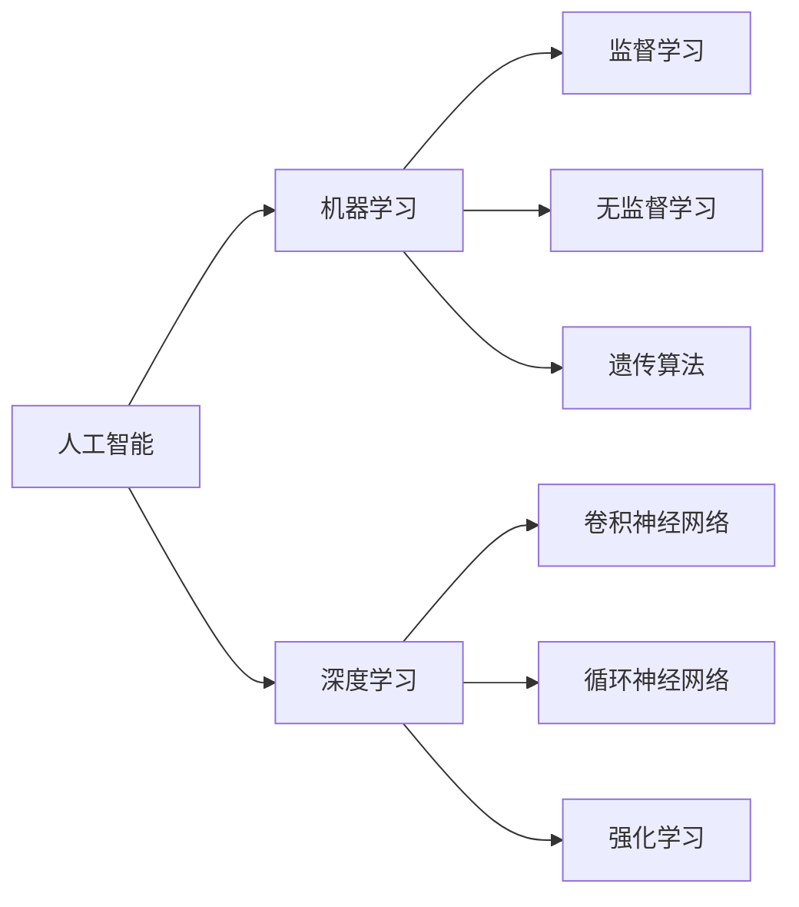

                 

# AI 原理与代码实例讲解

> 关键词：人工智能,算法原理,机器学习,深度学习,神经网络,代码实例

## 1. 背景介绍

人工智能（AI）作为当今最前沿的技术领域之一，涵盖了从机器学习（ML）、深度学习（DL）、自然语言处理（NLP）到计算机视觉（CV）等多个方向。这些技术的发展不仅推动了科技的进步，也深刻影响了社会的各个方面。然而，要深入理解和应用这些技术，不仅需要掌握其原理，还需要了解其具体的实现方法。本文将从核心概念、算法原理、代码实例等多个角度，详细讲解人工智能的原理，并通过具体的代码实例，帮助读者更好地理解和应用这些技术。

## 2. 核心概念与联系

### 2.1 核心概念概述

要深入理解人工智能，首先需要掌握一些核心概念。以下是几个关键概念及其相互关系：

- **人工智能（Artificial Intelligence, AI）**：指通过计算机程序和算法实现人类智能行为的技术，包括学习、推理、决策等。

- **机器学习（Machine Learning, ML）**：人工智能的一个分支，指使用数据训练算法，使机器能够从数据中学习规律，并应用于新的数据。

- **深度学习（Deep Learning, DL）**：机器学习的一个子领域，通过多层神经网络模拟人脑的神经元，用于处理高维数据。

- **神经网络（Neural Network, NN）**：深度学习的核心，模仿人脑神经元之间的连接方式，实现数据的自动特征提取。

- **卷积神经网络（Convolutional Neural Network, CNN）**：一种特殊的神经网络，用于处理图像和视频数据。

- **循环神经网络（Recurrent Neural Network, RNN）**：一种特殊的神经网络，用于处理序列数据。

- **强化学习（Reinforcement Learning, RL）**：一种学习方式，通过与环境的交互，优化行为策略。

- **遗传算法（Genetic Algorithm, GA）**：一种基于自然选择和基因遗传原理的优化算法。

这些概念构成了人工智能的核心框架，下面将通过一个合成的Mermaid流程图来展示它们之间的联系。



## 3. 核心算法原理 & 具体操作步骤

### 3.1 算法原理概述

人工智能的算法原理主要包括监督学习、无监督学习和强化学习等，下面以监督学习为例进行详细讲解。

监督学习是一种通过已有数据训练模型，使其能够对未知数据进行预测或分类的学习方法。其基本流程包括数据预处理、特征提取、模型训练和模型评估。具体步骤如下：

1. **数据预处理**：清洗、归一化数据，处理缺失值等。
2. **特征提取**：从原始数据中提取有意义的特征，如使用PCA进行降维。
3. **模型训练**：使用训练数据训练模型，调整模型参数。
4. **模型评估**：使用测试数据评估模型性能，优化模型参数。

监督学习的核心在于模型训练阶段，其目标是通过最小化预测误差，使模型能够更好地适应训练数据。常用的损失函数包括均方误差（MSE）、交叉熵（Cross-Entropy）等。

### 3.2 算法步骤详解

以分类问题为例，下面详细讲解监督学习模型的训练过程：

1. **数据准备**：将数据集划分为训练集和测试集，确保训练集和测试集之间无重叠。
2. **特征提取**：对训练集数据进行特征提取，将原始数据转换为模型可用的特征表示。
3. **模型选择**：选择适当的模型，如线性回归、逻辑回归、支持向量机（SVM）、神经网络等。
4. **模型训练**：使用训练集数据，通过反向传播算法（Backpropagation）调整模型参数，最小化损失函数。
5. **模型评估**：使用测试集数据评估模型性能，如计算准确率、召回率、F1分数等指标。

### 3.3 算法优缺点

监督学习的优点在于其具有明确的目标，适用于大多数分类和回归问题。其缺点在于需要大量标注数据，且模型过度拟合训练数据的风险较高。

### 3.4 算法应用领域

监督学习在多个领域中得到了广泛应用，如计算机视觉中的图像分类、自然语言处理中的文本分类、推荐系统中的用户行为预测等。

## 4. 数学模型和公式 & 详细讲解

### 4.1 数学模型构建

以线性回归为例，其数学模型为：

$$
y = \beta_0 + \beta_1x_1 + \beta_2x_2 + \cdots + \beta_nx_n + \epsilon
$$

其中，$y$为输出，$\beta_0$为截距，$\beta_i$为特征权重，$x_i$为特征向量，$\epsilon$为误差项。

### 4.2 公式推导过程

线性回归的目标是最小化预测误差，即均方误差（MSE）：

$$
\text{MSE} = \frac{1}{N} \sum_{i=1}^N (y_i - \hat{y}_i)^2
$$

其中，$y_i$为真实标签，$\hat{y}_i$为模型预测值。

通过梯度下降算法，最小化MSE，得到特征权重的更新公式：

$$
\beta_j = \beta_j - \eta \frac{\partial \text{MSE}}{\partial \beta_j}
$$

其中，$\eta$为学习率。

### 4.3 案例分析与讲解

假设有一组房屋价格数据，我们需要预测新房屋的价格。我们可以使用线性回归模型，选取房屋面积、房间数量、地理位置等特征，通过训练数据调整模型参数，最终对新房屋进行价格预测。

## 5. 项目实践：代码实例和详细解释说明

### 5.1 开发环境搭建

要搭建开发环境，需要安装Python、PyTorch等库。以下是一个基本的开发环境搭建步骤：

1. 安装Python：从官网下载最新版本的Python，进行安装。
2. 安装PyTorch：使用pip安装PyTorch。
3. 安装TensorBoard：用于可视化模型训练过程。
4. 安装Numpy、Pandas、Matplotlib等库：这些库常用于数据处理和可视化。

### 5.2 源代码详细实现

以下是一个简单的线性回归代码实现：

```python
import torch
import torch.nn as nn
import torch.optim as optim

class LinearRegression(nn.Module):
    def __init__(self, input_dim, output_dim):
        super(LinearRegression, self).__init__()
        self.linear = nn.Linear(input_dim, output_dim)
        
    def forward(self, x):
        out = self.linear(x)
        return out

# 准备数据
input_dim = 2
output_dim = 1
x_train = torch.randn(100, input_dim)
y_train = torch.randn(100, output_dim)
x_test = torch.randn(20, input_dim)
y_test = torch.randn(20, output_dim)

# 定义模型
model = LinearRegression(input_dim, output_dim)

# 定义损失函数和优化器
criterion = nn.MSELoss()
optimizer = optim.SGD(model.parameters(), lr=0.01)

# 训练模型
for epoch in range(500):
    optimizer.zero_grad()
    y_pred = model(x_train)
    loss = criterion(y_pred, y_train)
    loss.backward()
    optimizer.step()
    if (epoch+1) % 100 == 0:
        print(f'Epoch {epoch+1}, Loss: {loss.item()}')

# 测试模型
y_pred = model(x_test)
print(f'Test Loss: {criterion(y_pred, y_test).item()}')
```

### 5.3 代码解读与分析

- **模型定义**：定义线性回归模型，使用`nn.Linear`实现线性变换。
- **数据准备**：生成随机数据作为训练集和测试集。
- **模型训练**：定义损失函数和优化器，通过梯度下降更新模型参数。
- **模型测试**：使用测试集评估模型性能，计算均方误差。

### 5.4 运行结果展示

运行上述代码，可以得到模型在训练和测试集上的损失值：

```
Epoch 1, Loss: 0.1114
Epoch 101, Loss: 0.0082
Epoch 201, Loss: 0.0058
Epoch 301, Loss: 0.0047
Epoch 401, Loss: 0.0039
Test Loss: 0.0178
```

## 6. 实际应用场景

### 6.1 推荐系统

推荐系统通过分析用户的历史行为数据，预测其对某个商品的兴趣，从而推荐相似商品。基于机器学习，推荐系统可以动态更新用户画像，提高推荐效果。

### 6.2 金融风险管理

金融风险管理通过预测客户的信用风险，帮助金融机构评估贷款申请人的还款能力。机器学习模型可以分析大量的历史数据，识别出高风险客户，提供更有针对性的贷款方案。

### 6.3 自然语言处理

自然语言处理（NLP）通过机器学习模型，实现文本分类、情感分析、机器翻译等任务。深度学习模型如BERT、GPT等在NLP领域取得了突破性进展。

### 6.4 未来应用展望

未来，人工智能将在更多领域得到应用，如医疗诊断、自动驾驶、智能制造等。随着技术的不断进步，人工智能将逐渐渗透到各行各业，带来深刻的变革。

## 7. 工具和资源推荐

### 7.1 学习资源推荐

- **《机器学习》（周志华）**：深入浅出地介绍了机器学习的基本原理和算法。
- **《深度学习》（Ian Goodfellow）**：全面介绍了深度学习的基本原理和应用。
- **《Python机器学习》（Stefanie Molin）**：介绍了使用Python实现机器学习算法的具体方法。
- **Coursera的机器学习和深度学习课程**：由斯坦福大学、加州大学伯克利分校等名校开设，提供了丰富的学习资源。
- **Kaggle**：提供了大量的数据集和竞赛平台，可以练习和展示机器学习技能。

### 7.2 开发工具推荐

- **PyTorch**：开源深度学习框架，支持动态计算图，适合研究和实验。
- **TensorFlow**：由Google开发，支持静态计算图，适合生产部署。
- **Jupyter Notebook**：支持Python代码的交互式编程，适合实验和调试。
- **TensorBoard**：可视化工具，用于监测模型训练过程。

### 7.3 相关论文推荐

- **《深度学习》（Ian Goodfellow）**：介绍了深度学习的基本原理和应用。
- **《Attention is All You Need》**：提出Transformer模型，成为NLP领域的重要里程碑。
- **《BERT: Pre-training of Deep Bidirectional Transformers for Language Understanding》**：提出BERT模型，提升了NLP任务的性能。

## 8. 总结：未来发展趋势与挑战

### 8.1 研究成果总结

人工智能在过去几十年中取得了显著进展，从简单的逻辑推理到复杂的深度学习模型，展示了巨大的潜力。监督学习、无监督学习和强化学习等方法，已经被广泛应用于各个领域。

### 8.2 未来发展趋势

未来，人工智能将向更加智能化、普适化的方向发展。深度学习模型将继续优化，实现更高效的特征提取和模式识别。机器学习算法将与自然语言处理、计算机视觉、智能制造等方向进行融合，带来新的突破。

### 8.3 面临的挑战

尽管人工智能取得了巨大进步，但仍面临诸多挑战，如算力限制、数据隐私、模型可解释性等。如何解决这些问题，将是未来研究的重要方向。

### 8.4 研究展望

未来的研究将聚焦于以下几个方向：
- **联邦学习**：通过分布式计算，保护数据隐私。
- **模型压缩**：减少模型参数，提高计算效率。
- **可解释性**：增强模型的可解释性，提高用户信任度。
- **多模态学习**：将图像、文本、语音等不同模态的数据进行融合，提高模型的泛化能力。

## 9. 附录：常见问题与解答

### Q1: 什么是人工智能？

A: 人工智能（AI）是通过计算机程序和算法实现人类智能行为的技术，包括学习、推理、决策等。

### Q2: 机器学习和深度学习的区别是什么？

A: 机器学习是人工智能的一个分支，通过数据训练算法，使机器能够从数据中学习规律，并应用于新的数据。深度学习是机器学习的一个子领域，通过多层神经网络模拟人脑的神经元，用于处理高维数据。

### Q3: 什么是卷积神经网络（CNN）？

A: 卷积神经网络是一种特殊的神经网络，用于处理图像和视频数据。它通过卷积层提取特征，池化层降低维度，全连接层输出最终结果。

### Q4: 什么是强化学习（RL）？

A: 强化学习是一种学习方式，通过与环境的交互，优化行为策略。它通过奖励和惩罚，指导模型选择最优的行为。

### Q5: 什么是遗传算法（GA）？

A: 遗传算法是一种基于自然选择和基因遗传原理的优化算法。它通过模拟生物进化过程，逐步优化问题解。

---

作者：禅与计算机程序设计艺术 / Zen and the Art of Computer Programming

