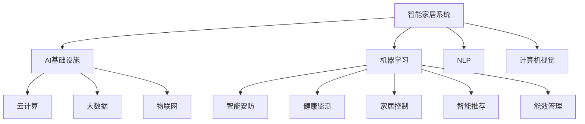
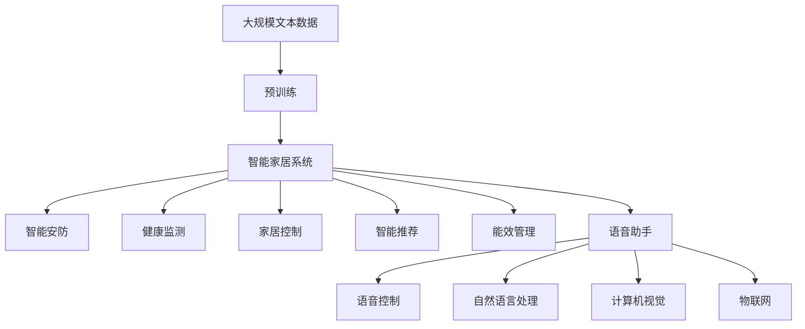

                 

# AI 基础设施的家居智能：构建智慧生活场景

## 1. 背景介绍

在过去十年中，人工智能(AI)技术经历了飞速发展，其在家庭自动化和智能家居系统中的应用变得愈发普及。随着物联网(IoT)技术、云计算、大数据等基础设施的日渐成熟，AI技术在家庭中的应用场景日益增多，从智能安防到健康监测，再到家居娱乐，AI技术正逐渐改变人们的生活方式。

### 1.1 问题由来
智能家居系统的核心目标是通过AI技术实现家庭环境的自动化、智能化管理，以提升家庭生活质量，减少日常劳动，提高家庭安全性。传统家庭自动化系统通常依赖于硬件设备的自动化控制，而AI技术则在此基础上，通过数据驱动的分析和决策，实现更为灵活、智能的家居管理。

### 1.2 问题核心关键点
当前，AI在智能家居系统中的应用主要包括：
1. **智能安防**：通过摄像头、传感器等设备，实时监测家庭环境，进行异常行为检测、入侵报警等。
2. **健康监测**：利用可穿戴设备和家用传感器，对家庭成员的健康状态进行监测，提供健康预警和建议。
3. **家居控制**：通过语音助手、智能音箱等设备，实现家电、灯光、窗帘等家居设备的语音控制和场景切换。
4. **智能推荐**：根据家庭成员的偏好，智能推荐电视节目、音乐、餐饮等个性化内容。
5. **能效管理**：通过对家电的使用数据进行分析，优化家庭能源消耗，提高能源利用效率。

### 1.3 问题研究意义
智能家居系统的AI应用，不仅能够提升家庭生活的便捷性和舒适度，还能促进家庭环境的可持续发展。例如，通过智能安防技术，家庭安全性得到有效保障；通过健康监测技术，家庭成员的健康状况得以实时关注和及时预警；通过智能家居控制，家电使用更加便捷、高效；通过智能推荐，家庭成员的个性化需求得到满足。因此，智能家居AI技术的应用研究，对于提升家庭生活质量、推动绿色生活方式的普及具有重要意义。

## 2. 核心概念与联系

### 2.1 核心概念概述

为了深入理解智能家居系统的AI应用，本节将介绍几个核心概念：

- **智能家居系统**：通过各种传感器、智能设备和互联网技术，实现家居环境的智能化管理。
- **AI基础设施**：包括云计算、大数据、物联网等技术，为智能家居系统提供计算、存储、通信等基础支持。
- **机器学习**：通过数据驱动的学习方法，使智能家居系统能够从历史数据中学习，不断优化和改进。
- **自然语言处理(NLP)**：使智能家居系统能够理解和生成自然语言，实现语音控制、智能推荐等功能。
- **计算机视觉**：使智能家居系统能够处理和分析视觉数据，实现人脸识别、行为监测等应用。
- **物联网(IoT)**：通过各种智能设备和传感器，实现家居设备的互联互通，形成统一的管理平台。

### 2.2 概念间的关系

这些核心概念之间存在着紧密的联系，形成了智能家居系统的整体框架。以下是一个Mermaid流程图，展示了这些概念之间的关系：



### 2.3 核心概念的整体架构

最后，我们用一个综合的流程图来展示这些核心概念在大规模智能家居系统中的整体架构：



这个综合流程图展示了从大规模文本数据预训练到智能家居系统各功能的完整过程。智能家居系统通过多个AI技术的协同工作，实现对家庭环境的全面智能化管理。

## 3. 核心算法原理 & 具体操作步骤
### 3.1 算法原理概述

智能家居系统的AI应用，通常包括智能安防、健康监测、家居控制、智能推荐和能效管理等多个功能。这些功能的实现，大多依赖于机器学习、自然语言处理、计算机视觉和物联网等核心技术。

以智能安防为例，其核心算法包括：

- **人脸识别**：利用机器学习模型对家庭环境中的摄像头视频流进行实时分析，识别家庭成员和外来人员，实现入侵报警。
- **行为监测**：通过计算机视觉技术，捕捉家庭成员的行为模式，检测异常行为，提供安全预警。
- **异常检测**：通过机器学习算法，对传感器数据进行分析，识别异常事件，如火灾、漏水等。

### 3.2 算法步骤详解

以智能安防为例，其具体的算法步骤如下：

1. **数据采集**：通过摄像头、传感器等设备，实时采集家庭环境中的视频流和传感器数据。
2. **数据预处理**：对采集到的数据进行去噪、压缩、增强等预处理，提高数据质量和分析效率。
3. **特征提取**：通过机器学习模型或深度学习模型，从视频流和传感器数据中提取有用的特征信息。
4. **模型训练**：利用历史数据训练机器学习模型或深度学习模型，学习异常行为和异常事件的特征。
5. **实时分析**：将实时采集的数据输入到训练好的模型中，进行实时分析和判断，识别异常行为和事件。
6. **响应处置**：根据异常检测结果，触发报警系统或通知用户，执行相应的安全处置操作。

### 3.3 算法优缺点

智能家居系统的AI应用具有以下优点：
1. **自动化管理**：通过AI技术，实现家居环境的自动化管理，减少人力劳动。
2. **智能化决策**：利用机器学习和深度学习技术，智能家居系统能够从数据中学习，进行智能决策。
3. **实时响应**：通过实时数据分析，智能家居系统能够快速响应突发事件，保障家庭安全。

同时，这些算法也存在一些缺点：
1. **数据依赖**：智能家居系统的AI应用需要大量高质量的标注数据进行训练，获取这些数据成本较高。
2. **模型复杂**：深度学习模型的训练和推理计算资源消耗大，对硬件设施要求较高。
3. **隐私风险**：智能家居系统采集的个人数据涉及隐私，需要严格的数据保护措施。
4. **误报率较高**：由于环境因素和数据噪声的影响，智能家居系统的AI应用容易出现误报。

### 3.4 算法应用领域

智能家居系统的AI应用广泛覆盖了多个领域，包括：

- **智能安防**：实现家庭环境的安全监控、入侵报警、异常行为检测等。
- **健康监测**：利用可穿戴设备和家用传感器，对家庭成员的健康状态进行实时监测。
- **家居控制**：通过语音助手、智能音箱等设备，实现家电、灯光、窗帘等家居设备的语音控制和场景切换。
- **智能推荐**：根据家庭成员的偏好，智能推荐电视节目、音乐、餐饮等个性化内容。
- **能效管理**：通过对家电的使用数据进行分析，优化家庭能源消耗，提高能源利用效率。

## 4. 数学模型和公式 & 详细讲解  
### 4.1 数学模型构建

以智能安防中的人脸识别为例，其数学模型可以表示为：

$$
\mathbf{X} = \mathbf{A} \mathbf{W} + \mathbf{b}
$$

其中，$\mathbf{X}$为视频帧像素矩阵，$\mathbf{A}$为特征矩阵，$\mathbf{W}$为权重矩阵，$\mathbf{b}$为偏置向量。

通过人脸识别算法，可以从视频帧中提取出人脸特征向量，并计算其与已知人脸特征向量之间的距离：

$$
d = \|\mathbf{X} - \mathbf{X'}\|
$$

其中，$\mathbf{X'}$为已知人脸特征向量，$\|\cdot\|$为欧几里得距离。

### 4.2 公式推导过程

人脸识别算法的关键在于特征提取和相似度计算。以下是详细的公式推导过程：

1. **特征提取**：通过卷积神经网络(CNN)对视频帧进行特征提取，生成人脸特征向量$\mathbf{X'}$。
2. **相似度计算**：计算视频帧像素矩阵$\mathbf{X}$与人脸特征向量$\mathbf{X'}$之间的距离，得到相似度$d$。
3. **阈值判断**：设定一个阈值$\tau$，当$d < \tau$时，认为视频帧中包含人脸，触发报警。

通过上述公式推导，可以清晰地看到人脸识别算法的基本逻辑和步骤。

### 4.3 案例分析与讲解

以智能安防中的人脸识别为例，以下是一个案例分析：

假设智能安防系统通过摄像头实时采集家庭环境中的视频流，并将视频帧输入到卷积神经网络中进行特征提取。卷积神经网络提取到人脸特征向量$\mathbf{X'}$后，将其与训练集中的人脸特征向量$\mathbf{X}$进行比较，计算欧几里得距离$d$。当$d < \tau$时，系统判断该视频帧中包含人脸，并触发入侵报警。

## 5. 项目实践：代码实例和详细解释说明
### 5.1 开发环境搭建

在进行智能家居系统的AI应用开发前，我们需要准备好开发环境。以下是使用Python进行OpenCV开发的环境配置流程：

1. 安装Anaconda：从官网下载并安装Anaconda，用于创建独立的Python环境。

2. 创建并激活虚拟环境：
```bash
conda create -n cv-env python=3.8 
conda activate cv-env
```

3. 安装OpenCV：
```bash
conda install opencv-python -c conda-forge
```

4. 安装其他相关工具包：
```bash
pip install numpy pandas scikit-learn matplotlib
```

完成上述步骤后，即可在`cv-env`环境中开始智能家居系统的AI应用开发。

### 5.2 源代码详细实现

下面我们以智能安防中的人脸识别为例，给出使用OpenCV进行开发的PyTorch代码实现。

首先，定义人脸识别函数：

```python
import cv2
import numpy as np
import torch
from torchvision import models, transforms

def face_recognition(model, image):
    # 加载人脸检测模型
    face_detector = cv2.CascadeClassifier('haarcascade_frontalface_default.xml')
    # 加载预训练的ResNet模型
    resnet = models.resnet18(pretrained=True)
    # 定义模型特征提取器
    model.eval()
    transform = transforms.Compose([
        transforms.ToTensor(),
        transforms.Normalize(mean=[0.485, 0.456, 0.406], std=[0.229, 0.224, 0.225])
    ])
    image_tensor = transform(image).unsqueeze(0)

    with torch.no_grad():
        features = resnet(image_tensor)
        # 计算视频帧与已知人脸特征向量之间的欧几里得距离
        distance = torch.norm(features - torch.tensor(X').unsqueeze(0), dim=1)
        # 判断是否包含人脸
        return distance.item() < 10
```

然后，定义人脸检测函数：

```python
def detect_faces(image):
    gray = cv2.cvtColor(image, cv2.COLOR_BGR2GRAY)
    faces = face_detector.detectMultiScale(gray, scaleFactor=1.1, minNeighbors=5)
    return faces
```

最后，定义智能安防系统的监控函数：

```python
def security_monitor():
    # 开启摄像头
    cap = cv2.VideoCapture(0)
    while True:
        # 读取视频帧
        ret, frame = cap.read()
        # 检测人脸
        faces = detect_faces(frame)
        for (x, y, w, h) in faces:
            # 在人脸区域绘制矩形
            cv2.rectangle(frame, (x, y), (x+w, y+h), (0, 255, 0), 2)
        # 显示视频帧
        cv2.imshow('frame', frame)
        # 判断是否按下q键退出
        if cv2.waitKey(1) == ord('q'):
            break
    # 释放摄像头资源
    cap.release()
    cv2.destroyAllWindows()
```

运行上述代码，即可启动智能安防系统，实现对家庭环境中的实时视频流进行人脸检测和报警。

### 5.3 代码解读与分析

让我们再详细解读一下关键代码的实现细节：

**face_recognition函数**：
- 加载人脸检测器，用于检测视频帧中的人脸。
- 加载预训练的ResNet模型，用于提取人脸特征向量。
- 定义模型特征提取器，包括数据标准化、归一化等预处理步骤。
- 将视频帧转化为模型所需的Tensor格式，并输入模型进行特征提取。
- 计算视频帧与已知人脸特征向量之间的欧几里得距离，判断是否包含人脸。

**detect_faces函数**：
- 将彩色图像转换为灰度图像，用于人脸检测。
- 利用OpenCV的人脸检测器，检测图像中的所有人脸，并返回人脸区域的坐标和大小。

**security_monitor函数**：
- 打开摄像头，并循环读取视频帧。
- 检测人脸，并在人脸区域绘制矩形，进行可视化展示。
- 显示视频帧，等待用户按下q键退出程序。
- 释放摄像头资源，关闭所有窗口。

### 5.4 运行结果展示

假设我们在智能安防系统中运行上述代码，观察其运行结果。在运行过程中，程序会实时读取摄像头中的视频流，并在人脸区域绘制矩形，进行可视化展示。当摄像头中检测到人脸时，程序会发出报警提示。

假设我们检测到一个未授权的人员出现在摄像头中，程序会实时识别并发出报警，提升家庭安全性。

## 6. 实际应用场景
### 6.1 智能安防

智能安防系统通过摄像头、传感器等设备，实时监测家庭环境，进行异常行为检测、入侵报警等。

在技术实现上，可以收集家庭环境中的视频流和传感器数据，利用机器学习或深度学习模型进行异常行为和异常事件的检测。例如，通过卷积神经网络(CNN)提取视频帧中的特征向量，计算与已知人脸特征向量之间的距离，当距离小于预设阈值时，认为视频帧中包含人脸，触发入侵报警。

智能安防系统不仅可以提升家庭安全性，还可以实时监控家庭成员的活动，提供行为分析。例如，可以通过计算机视觉技术，捕捉家庭成员的行为模式，检测异常行为，提供安全预警。

### 6.2 健康监测

健康监测系统利用可穿戴设备和家用传感器，对家庭成员的健康状态进行实时监测。

在技术实现上，可以收集家庭成员的生理数据和行为数据，利用机器学习模型进行健康分析和预警。例如，通过心率传感器、血压传感器等设备，实时监测家庭成员的生理数据，并利用深度学习模型进行数据分析，判断是否存在异常。当检测到异常时，系统可以自动通知家庭成员或联系医生，提供紧急医疗服务。

健康监测系统不仅可以帮助家庭成员及时了解自己的健康状况，还可以在数据积累后，进行健康趋势分析和风险预警，提升家庭成员的健康管理水平。

### 6.3 家居控制

家居控制系统通过语音助手、智能音箱等设备，实现家电、灯光、窗帘等家居设备的语音控制和场景切换。

在技术实现上，可以利用自然语言处理技术，将语音指令转化为设备控制命令。例如，通过智能音箱语音控制家电，通过语音助手智能推荐电视节目、音乐、餐饮等个性化内容。家居控制系统可以提升家庭成员的生活便捷性，减少日常劳动。

### 6.4 智能推荐

智能推荐系统根据家庭成员的偏好，智能推荐电视节目、音乐、餐饮等个性化内容。

在技术实现上，可以收集家庭成员的浏览、观看、阅读等行为数据，利用机器学习模型进行用户画像建模。例如，通过协同过滤算法或深度学习模型，分析家庭成员的历史行为数据，发现其兴趣爱好和需求，进行智能推荐。智能推荐系统可以提升家庭成员的个性化体验，满足其多样化需求。

## 7. 工具和资源推荐
### 7.1 学习资源推荐

为了帮助开发者系统掌握智能家居系统的AI应用理论基础和实践技巧，这里推荐一些优质的学习资源：

1. 《深度学习》系列书籍：由斯坦福大学李飞飞教授等撰写，全面介绍了深度学习的基本概念、算法和应用，是入门深度学习的必读教材。
2. 《Python计算机视觉编程》书籍：由OpenCV官方团队编写，详细介绍OpenCV库的使用方法和计算机视觉技术，适合计算机视觉项目开发。
3. 《NLP入门到精通》书籍：由自然语言处理领域的专家撰写，涵盖自然语言处理的基本概念、算法和应用，是NLP项目开发的好帮手。
4. CS231n《卷积神经网络》课程：斯坦福大学开设的计算机视觉课程，涵盖卷积神经网络的原理和实践，适合深度学习项目开发。
5. TensorFlow官方文档：TensorFlow深度学习框架的官方文档，提供了丰富的模型库和工具，适合TensorFlow项目开发。
6. Weights & Biases：模型训练的实验跟踪工具，可以记录和可视化模型训练过程中的各项指标，方便对比和调优。

通过对这些资源的学习实践，相信你一定能够快速掌握智能家居系统的AI应用技术，并用于解决实际的智能家居问题。

### 7.2 开发工具推荐

高效的开发离不开优秀的工具支持。以下是几款用于智能家居系统AI应用开发的常用工具：

1. Python：作为智能家居系统AI应用开发的主流语言，Python提供了丰富的第三方库和框架，支持快速开发和迭代。
2. OpenCV：用于计算机视觉任务的图像处理和分析，提供了强大的图像处理算法和工具。
3. TensorFlow和PyTorch：深度学习框架，提供了丰富的模型库和工具，支持高效开发和部署。
4. Weights & Biases：模型训练的实验跟踪工具，可以记录和可视化模型训练过程中的各项指标，方便对比和调优。
5. Jupyter Notebook：数据科学和机器学习的交互式开发环境，支持快速原型设计和代码调试。
6. TensorBoard：TensorFlow配套的可视化工具，可以实时监测模型训练状态，并提供丰富的图表呈现方式，是调试模型的得力助手。

合理利用这些工具，可以显著提升智能家居系统AI应用开发的效率，加快创新迭代的步伐。

### 7.3 相关论文推荐

智能家居系统AI应用的研究源于学界的持续研究。以下是几篇奠基性的相关论文，推荐阅读：

1. "Differentiable Object Tracking"：提出可微分的目标跟踪方法，利用深度学习模型进行实时目标检测和跟踪。
2. "Google Smart Home Using Machine Learning"：介绍Google智能家居系统，利用机器学习模型实现语音控制和推荐功能。
3. "Health Monitoring in Smart Homes"：提出智能家居系统的健康监测方法，利用机器学习模型进行生理数据分析和预警。
4. "Smart Lighting in Smart Homes"：提出智能家居系统的智能照明方法，利用机器学习模型进行光环境优化。
5. "Home Energy Management Using Machine Learning"：提出智能家居系统的能效管理方法，利用机器学习模型进行能源消耗优化。

这些论文代表了大规模智能家居系统AI应用的发展脉络。通过学习这些前沿成果，可以帮助研究者把握学科前进方向，激发更多的创新灵感。

除上述资源外，还有一些值得关注的前沿资源，帮助开发者紧跟智能家居系统AI应用技术的最新进展，例如：

1. arXiv论文预印本：人工智能领域最新研究成果的发布平台，包括大量尚未发表的前沿工作，学习前沿技术的必读资源。
2. 业界技术博客：如Google AI、Microsoft Research、Amazon AWS等顶尖实验室的官方博客，第一时间分享他们的最新研究成果和洞见。
3. 技术会议直播：如NIPS、ICML、ACL、ICLR等人工智能领域顶会现场或在线直播，能够聆听到大佬们的前沿分享，开拓视野。
4. GitHub热门项目：在GitHub上Star、Fork数最多的智能家居系统相关项目，往往代表了该技术领域的发展趋势和最佳实践，值得去学习和贡献。
5. 行业分析报告：各大咨询公司如McKinsey、PwC等针对智能家居系统AI应用技术的分析报告，有助于从商业视角审视技术趋势，把握应用价值。

总之，对于智能家居系统的AI应用开发，需要开发者保持开放的心态和持续学习的意愿。多关注前沿资讯，多动手实践，多思考总结，必将收获满满的成长收益。

## 8. 总结：未来发展趋势与挑战

### 8.1 总结

本文对智能家居系统的AI应用进行了全面系统的介绍。首先阐述了智能家居系统AI应用的研究背景和意义，明确了AI技术在智能家居系统中的应用价值。其次，从原理到实践，详细讲解了智能安防、健康监测、家居控制、智能推荐和能效管理等多个功能的算法原理和具体操作步骤，给出了智能家居系统AI应用的完整代码实例。同时，本文还广泛探讨了智能家居系统AI应用在智能安防、健康监测、家居控制、智能推荐和能效管理等多个领域的应用前景，展示了智能家居系统AI应用技术的广阔前景。

通过本文的系统梳理，可以看到，智能家居系统的AI应用正逐渐成为家庭智能化管理的重要手段，极大地提升了家庭生活质量，推动了绿色生活方式的普及。未来，伴随AI技术的不断演进，智能家居系统AI应用必将在更广阔的领域得到应用，为人类生活带来更多便利和舒适。

### 8.2 未来发展趋势

展望未来，智能家居系统的AI应用将呈现以下几个发展趋势：

1. **数据驱动决策**：随着智能家居系统的数据积累和算法优化，AI技术将在智能家居决策中发挥更加重要的作用，提升决策的智能化和精准度。
2. **多模态融合**：未来的智能家居系统将不仅仅是单一数据类型的处理，而是融合视觉、语音、触觉等多模态数据，实现更为全面、准确的家庭环境监测。
3. **场景感知**：通过自然语言处理和计算机视觉技术，智能家居系统将能够理解家庭成员的意图和需求，进行场景感知和个性化推荐。
4. **人机协同**：智能家居系统将通过人机协同，实现更为灵活、智能的家庭管理，提升家庭成员的幸福感和满意度。
5. **边缘计算**：随着5G和物联网技术的发展，智能家居系统将更多地采用边缘计算技术，实现本地化处理和实时响应，提升系统的稳定性和可靠性。
6. **智能家居平台**：未来的智能家居系统将逐步向平台化、标准化方向发展，形成统一的智能家居生态系统，提升用户的使用体验。

以上趋势凸显了智能家居系统AI应用技术的广阔前景。这些方向的探索发展，必将进一步提升智能家居系统的智能化和自动化水平，为家庭生活带来更多便利和舒适。

### 8.3 面临的挑战

尽管智能家居系统的AI应用已经取得了显著进展，但在迈向更加智能化、普适化应用的过程中，它仍面临着诸多挑战：

1. **数据隐私保护**：智能家居系统采集的个人数据涉及隐私，如何保护数据安全，避免数据泄露，将是重要课题。
2. **模型鲁棒性**：智能家居系统的AI应用在面对复杂环境和噪声数据时，容易出现误报和漏报，提升模型的鲁棒性是当务之急。
3. **设备互联互操作**：智能家居系统涉及多种设备和传感器，如何实现设备的互联互通，形成统一的管理平台，仍是难题。
4. **用户体验提升**：智能家居系统的AI应用需要更注重用户体验，避免复杂的操作和界面，提升系统的易用性和便捷性。
5. **技术标准化**：智能家居系统的AI应用需要建立统一的技术标准，避免技术孤岛和兼容性问题，促进技术发展。
6. **市场推广**：智能家居系统的AI应用需要广泛的推广和普及，提升公众的认知度和接受度，推动市场的快速发展。

正视智能家居系统AI应用面临的这些挑战，积极应对并寻求突破，将是大规模智能家居系统AI应用走向成熟的必由之路。相信随着学界和产业界的共同努力，这些挑战终将一一被克服，智能家居系统AI应用必将在构建智慧生活场景中扮演越来越重要的角色。

### 8.4 研究展望

面向未来，智能家居系统的AI应用需要在以下几个方面寻求新的突破：

1. **跨模态融合**：通过自然语言处理和计算机视觉技术的融合，实现视觉、语音、触觉等多模态数据的协同建模，提升家庭环境的智能化管理水平。
2. **边缘计算**：利用5G和物联网技术，将智能家居系统的计算任务下放到边缘设备，实现本地化处理和实时响应，提升系统的稳定性和可靠性。
3. **智能推荐**：通过深度学习模型和大数据分析，提升智能家居系统的推荐精度和个性化程度，满足家庭成员的多样化需求。
4. **场景感知**：利用自然语言处理和计算机视觉技术，实现场景感知和智能决策，提升智能家居系统的智能化水平。
5. **隐私保护**：在智能家居系统的数据处理和存储过程中，引入隐私保护技术，确保数据安全和隐私保护。
6. **人机协同**：通过人机协同，实现智能家居系统的智能化和自动化管理，提升家庭成员的生活质量。

这些研究方向的探索，必将引领智能家居系统AI应用技术迈向更高的台阶，为构建智慧生活场景提供更多的可能性。

## 9. 附录：常见问题与解答

**Q1：智能家居系统如何保护用户隐私？**

A: 智能家居系统在数据采集和处理过程中，需要严格遵守数据隐私保护原则，避免数据泄露和滥用。常见的隐私保护措施包括：
1. **数据匿名化**：对采集到的数据进行去标识化处理，避免直接关联到用户个人信息。
2. **数据

