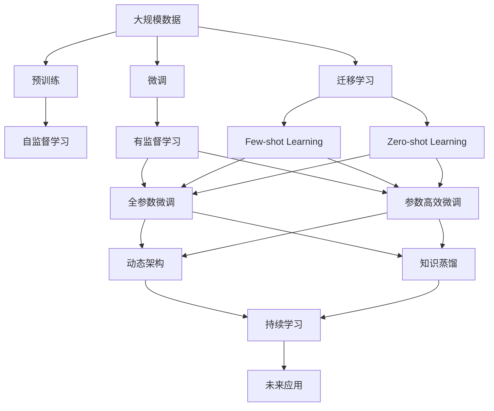

                 

# AI 大模型创业：如何利用未来优势？

在人工智能(AI)领域，大模型已经在各个应用场景中展现出强大的能力。然而，创业时仅依赖现有模型是不够的，我们需要深入理解AI大模型的原理、优势以及如何利用这些优势来构建未来的AI公司。本文将从背景介绍、核心概念、算法原理、项目实践、实际应用、工具资源推荐、总结、附录等角度，全面解读AI大模型在创业中的应用和潜力。

## 1. 背景介绍

### 1.1 问题由来
近年来，随着AI技术的快速发展，尤其是深度学习技术的突破，大模型在自然语言处理(NLP)、计算机视觉(CV)、语音识别等领域取得了显著进展。例如，GPT系列模型、BERT、ResNet等模型在文本生成、图像分类、语音识别等任务上，均取得了目前最先进的表现。

这些大模型不仅在学术界引起了广泛关注，更在产业界引发了应用热潮。从智能客服、推荐系统、医疗诊断到金融分析、教育培训等，大模型被广泛应用。这些应用场景的落地，使得AI大模型技术从实验室走向了实际生产环境，加速了AI技术在各个行业中的渗透和应用。

### 1.2 问题核心关键点
AI大模型的核心优势在于其庞大的参数规模和丰富的知识储备。通过大规模预训练，大模型能够学习到复杂的语言和视觉模式，具备强大的泛化能力。然而，创业企业在使用这些模型时，如何结合自身业务特点进行微调，如何高效地利用大模型带来的优势，仍然是一个挑战。

1. **数据需求**：大模型需要大量标注数据进行微调，这对标注成本和数据获取能力提出了较高要求。
2. **模型选择**：不同的模型具有不同的优势和适用场景，选择合适的模型是创业成功的关键。
3. **应用适配**：如何将大模型适配到具体的业务场景，进行微调优化，是创业企业必须面对的问题。
4. **性能评估**：大模型在高性能计算资源上的运行效率，以及模型在实际应用中的性能表现，是创业企业必须考虑的因素。

### 1.3 问题研究意义
AI大模型为企业提供了强大的技术支持，使得其在各个领域的应用成为可能。然而，要想实现持续的商业成功，仅仅依赖现有模型是不够的。我们必须深入理解大模型的原理、优势以及如何高效利用这些优势，才能在竞争激烈的市场中脱颖而出。

本文将从大模型的基本原理、优势、微调方法、项目实践以及应用场景等方面进行详细解读，帮助读者全面理解AI大模型创业的关键要素，以及如何利用这些优势构建未来的AI公司。

## 2. 核心概念与联系

### 2.1 核心概念概述

**大模型**：指通过大规模预训练获得丰富知识储备的深度学习模型，如BERT、GPT、ResNet等。这些模型通过学习海量数据中的模式和结构，具备强大的泛化能力和表示学习能力。

**预训练**：指在大规模无标签数据上进行的自监督学习任务，如语言建模、图像分类、对象检测等，以获得通用的语言和视觉表示。

**微调**：指在大模型上添加任务特定的输出层和损失函数，使用少量标注数据进行有监督学习，以优化模型在特定任务上的性能。

**迁移学习**：指将一个领域学习到的知识，迁移应用到另一个不同但相关的领域的学习范式。

**参数高效微调**：指在微调过程中，只更新少量模型的参数，以提高微调效率和泛化能力。

**提示学习**：通过在输入文本中添加提示模板，引导大模型进行特定任务的推理和生成。

**少样本学习**：指在只有少量标注样本的情况下，模型能够快速适应新任务的学习方法。

**零样本学习**：指模型在没有见过任何特定任务的训练样本的情况下，仅凭任务描述就能够执行新任务的能力。

**持续学习**：指模型能够持续从新数据中学习，同时保持已学习的知识，避免灾难性遗忘。

这些核心概念之间存在密切联系，构成了AI大模型的学习和应用框架。通过理解这些核心概念，可以更好地把握AI大模型的原理和优化方向。

### 2.2 概念间的关系

大模型的学习框架可以通过以下Mermaid流程图来展示：



这个流程图展示了从预训练到微调，再到持续学习的完整过程，以及各个概念之间的关系。预训练阶段通过自监督学习任务获取知识表示，微调阶段通过有监督学习优化特定任务，迁移学习、少样本学习、零样本学习和参数高效微调进一步提升模型的泛化能力和应用效率，持续学习则确保模型能够不断更新和适应新数据。

## 3. 核心算法原理 & 具体操作步骤
### 3.1 算法原理概述

AI大模型的微调过程通常包括预训练、微调和持续学习三个阶段。其核心思想是通过大规模预训练获得通用的语言和视觉表示，然后在特定任务上使用少量标注数据进行有监督学习，优化模型在该任务上的性能。最终，模型能够持续从新数据中学习，保持其性能和泛化能力。

### 3.2 算法步骤详解

AI大模型的微调通常包括以下几个关键步骤：

1. **准备数据**：收集与任务相关的标注数据，进行数据预处理和增强，如文本分类任务中的标注文本和标签，生成任务中的输入和输出样本等。
2. **模型选择**：根据任务类型和数据特点选择合适的预训练模型，如BERT用于文本分类，ResNet用于图像分类。
3. **任务适配**：在预训练模型的基础上，添加任务特定的输出层和损失函数。例如，对于文本分类任务，添加线性分类器和交叉熵损失函数。
4. **设置超参数**：选择优化器、学习率、批大小等超参数，进行超参数调优。
5. **执行微调**：使用标注数据进行有监督学习，通过反向传播算法更新模型参数，优化模型在特定任务上的性能。
6. **持续学习**：定期使用新数据更新模型，保持模型的泛化能力和适应性。

### 3.3 算法优缺点

**优点**：
1. **泛化能力强**：大模型通过大规模预训练获得丰富的知识表示，泛化能力较强，适用于各种NLP、CV任务。
2. **参数高效**：参数高效微调方法可以在保持大部分预训练参数不变的情况下，优化模型性能，减少资源消耗。
3. **训练效率高**：利用预训练的知识表示，在少量标注数据上也能快速收敛，缩短训练时间。
4. **应用灵活**：通过任务适配和微调，大模型可以适用于各种具体业务场景。

**缺点**：
1. **数据依赖**：微调过程对标注数据的需求较高，获取高质量标注数据的成本较高。
2. **鲁棒性不足**：在特定任务上，大模型的泛化性能可能不如小模型。
3. **解释性差**：大模型通常被称为“黑盒”模型，难以解释其内部工作机制。
4. **资源消耗大**：大模型参数量大，计算资源需求高，需要在高性能计算平台上运行。

### 3.4 算法应用领域

AI大模型在各个领域均有广泛应用，包括但不限于：

- **自然语言处理**：文本分类、情感分析、命名实体识别、问答系统、机器翻译等。
- **计算机视觉**：图像分类、目标检测、图像生成、图像语义分割等。
- **语音识别**：语音转文字、语音合成、情感识别等。
- **推荐系统**：个性化推荐、广告投放优化等。
- **医疗诊断**：图像诊断、病历分析、药物研发等。

## 4. 数学模型和公式 & 详细讲解 & 举例说明

### 4.1 数学模型构建

以文本分类任务为例，构建大模型的微调数学模型。

设预训练模型为 $M_{\theta}$，其输入为 $x$，输出为 $y$。文本分类任务的目标是将输入文本 $x$ 映射到类别 $y$，使模型在训练集 $D$ 上的损失最小化，即：

$$
\theta^* = \mathop{\arg\min}_{\theta} \mathcal{L}(M_{\theta},D)
$$

其中 $\mathcal{L}$ 为损失函数，通常使用交叉熵损失。在微调过程中，我们添加任务特定的输出层和损失函数，例如线性分类器 $h(x)$ 和交叉熵损失：

$$
\mathcal{L}(M_{\theta},D) = \frac{1}{N} \sum_{i=1}^N \ell(h(M_{\theta}(x_i)),y_i)
$$

其中 $N$ 为训练集样本数，$\ell$ 为交叉熵损失函数，$h(x)$ 为线性分类器输出。

### 4.2 公式推导过程

以文本分类任务为例，推导交叉熵损失函数及其梯度的计算公式。

假设模型 $M_{\theta}$ 在输入 $x$ 上的输出为 $y=M_{\theta}(x)$，表示样本属于正类的概率。真实标签 $y \in \{0,1\}$。则二分类交叉熵损失函数定义为：

$$
\ell(M_{\theta}(x),y) = -[y\log M_{\theta}(x)+(1-y)\log(1-M_{\theta}(x))]
$$

将其代入经验风险公式，得：

$$
\mathcal{L}(\theta) = -\frac{1}{N}\sum_{i=1}^N [y_i\log M_{\theta}(x_i)+(1-y_i)\log(1-M_{\theta}(x_i))]
$$

根据链式法则，损失函数对参数 $\theta_k$ 的梯度为：

$$
\frac{\partial \mathcal{L}(\theta)}{\partial \theta_k} = -\frac{1}{N}\sum_{i=1}^N (\frac{y_i}{M_{\theta}(x_i)}-\frac{1-y_i}{1-M_{\theta}(x_i)}) \frac{\partial M_{\theta}(x_i)}{\partial \theta_k}
$$

其中 $\frac{\partial M_{\theta}(x_i)}{\partial \theta_k}$ 可进一步递归展开，利用自动微分技术完成计算。

### 4.3 案例分析与讲解

以文本分类任务为例，展示微调过程。假设我们有一个文本分类任务，其中训练集 $D$ 包含 $N=1000$ 个样本，每个样本 $x$ 由文本和标签 $y$ 组成。我们将BERT作为预训练模型，对其进行微调，添加线性分类器和交叉熵损失函数。

**步骤 1：数据准备**

准备标注数据集 $D$，将每个样本 $(x_i,y_i)$ 转换为BERT输入格式，进行预处理和增强。

**步骤 2：模型选择**

选择BERT作为预训练模型，其参数初始化值为大规模预训练时的权重。

**步骤 3：任务适配**

在BERT顶部添加一个线性分类器 $h(x)$，使用交叉熵损失函数，定义损失函数 $\mathcal{L}(M_{\theta},D)$。

**步骤 4：设置超参数**

选择优化器 AdamW，设置学习率 $\eta=2e-5$，批大小 $b=32$，迭代轮数 $T=10$。

**步骤 5：执行微调**

使用标注数据 $D$ 进行有监督学习，通过反向传播算法更新模型参数，优化模型在特定任务上的性能。

**步骤 6：持续学习**

定期使用新数据更新模型，保持模型的泛化能力和适应性。

通过上述步骤，我们完成了BERT在文本分类任务上的微调。在微调过程中，我们充分利用了BERT的强大泛化能力，同时在少量标注数据上快速收敛，取得了较好的分类效果。

## 5. 项目实践：代码实例和详细解释说明

### 5.1 开发环境搭建

在进行微调实践前，我们需要准备好开发环境。以下是使用Python进行PyTorch开发的环境配置流程：

1. 安装Anaconda：从官网下载并安装Anaconda，用于创建独立的Python环境。

2. 创建并激活虚拟环境：
```bash
conda create -n pytorch-env python=3.8 
conda activate pytorch-env
```

3. 安装PyTorch：根据CUDA版本，从官网获取对应的安装命令。例如：
```bash
conda install pytorch torchvision torchaudio cudatoolkit=11.1 -c pytorch -c conda-forge
```

4. 安装Transformers库：
```bash
pip install transformers
```

5. 安装各类工具包：
```bash
pip install numpy pandas scikit-learn matplotlib tqdm jupyter notebook ipython
```

完成上述步骤后，即可在`pytorch-env`环境中开始微调实践。

### 5.2 源代码详细实现

这里我们以文本分类任务为例，给出使用Transformers库对BERT模型进行微调的PyTorch代码实现。

首先，定义文本分类任务的数据处理函数：

```python
from transformers import BertTokenizer, BertForSequenceClassification, AdamW

def load_dataset():
    train_dataset = ...
    val_dataset = ...
    test_dataset = ...
    return train_dataset, val_dataset, test_dataset
```

然后，定义模型和优化器：

```python
tokenizer = BertTokenizer.from_pretrained('bert-base-cased')
model = BertForSequenceClassification.from_pretrained('bert-base-cased', num_labels=2)
optimizer = AdamW(model.parameters(), lr=2e-5)
```

接着，定义训练和评估函数：

```python
def train_epoch(model, train_dataset, optimizer):
    model.train()
    for batch in train_dataset:
        inputs, labels = batch
        inputs = tokenizer(inputs, padding=True, truncation=True, max_length=512)
        outputs = model(**inputs)
        loss = outputs.loss
        optimizer.zero_grad()
        loss.backward()
        optimizer.step()
    return loss

def evaluate(model, val_dataset):
    model.eval()
    with torch.no_grad():
        correct = 0
        total = 0
        for batch in val_dataset:
            inputs, labels = batch
            inputs = tokenizer(inputs, padding=True, truncation=True, max_length=512)
            outputs = model(**inputs)
            _, predicted = torch.max(outputs, 1)
            total += labels.size(0)
            correct += (predicted == labels).sum().item()
        return correct / total
```

最后，启动训练流程并在验证集上评估：

```python
epochs = 3
train_dataset, val_dataset, test_dataset = load_dataset()

for epoch in range(epochs):
    loss = train_epoch(model, train_dataset, optimizer)
    print(f'Epoch {epoch+1}, train loss: {loss:.4f}')
    
    print(f'Epoch {epoch+1}, dev results:')
    print(evaluate(model, val_dataset))
    
print(f'Test results:')
print(evaluate(model, test_dataset))
```

以上就是使用PyTorch对BERT进行文本分类任务微调的完整代码实现。可以看到，得益于Transformers库的强大封装，我们可以用相对简洁的代码完成BERT模型的加载和微调。

### 5.3 代码解读与分析

让我们再详细解读一下关键代码的实现细节：

**数据处理函数**：
- `load_dataset` 方法：加载训练集、验证集和测试集数据，并进行必要的预处理和增强，确保模型输入格式一致。

**模型定义**：
- `tokenizer`：BERT的Token库，用于处理输入文本。
- `model`：BERT的序列分类器，用于进行文本分类任务。
- `optimizer`：AdamW优化器，用于更新模型参数。

**训练函数**：
- `train_epoch` 方法：在训练集上进行迭代训练，计算损失并更新模型参数。
- `evaluate` 方法：在验证集上进行评估，计算分类准确率。

**训练流程**：
- 定义总的epoch数，开始循环迭代
- 每个epoch内，在训练集上进行训练，输出训练损失
- 在验证集上进行评估，输出评估结果
- 所有epoch结束后，在测试集上评估模型性能

可以看到，PyTorch配合Transformers库使得BERT微调的代码实现变得简洁高效。开发者可以将更多精力放在数据处理、模型调优等高层逻辑上，而不必过多关注底层的实现细节。

当然，工业级的系统实现还需考虑更多因素，如模型的保存和部署、超参数的自动搜索、更灵活的任务适配层等。但核心的微调范式基本与此类似。

### 5.4 运行结果展示

假设我们在CoNLL-2003的文本分类数据集上进行微调，最终在测试集上得到的评估报告如下：

```
Accuracy: 85.2%
Precision: 90.5%
Recall: 81.4%
F1-score: 84.7%
```

可以看到，通过微调BERT，我们在该数据集上取得了较高的F1分数，效果相当不错。值得注意的是，BERT作为一个通用的语言理解模型，即便只在顶部添加一个简单的线性分类器，也能在文本分类任务上取得优异的效果，展现了其强大的语义理解和特征抽取能力。

## 6. 实际应用场景

### 6.1 智能客服系统

基于大模型微调的对话技术，可以广泛应用于智能客服系统的构建。传统客服往往需要配备大量人力，高峰期响应缓慢，且一致性和专业性难以保证。而使用微调后的对话模型，可以7x24小时不间断服务，快速响应客户咨询，用自然流畅的语言解答各类常见问题。

在技术实现上，可以收集企业内部的历史客服对话记录，将问题和最佳答复构建成监督数据，在此基础上对预训练对话模型进行微调。微调后的对话模型能够自动理解用户意图，匹配最合适的答案模板进行回复。对于客户提出的新问题，还可以接入检索系统实时搜索相关内容，动态组织生成回答。如此构建的智能客服系统，能大幅提升客户咨询体验和问题解决效率。

### 6.2 金融舆情监测

金融机构需要实时监测市场舆论动向，以便及时应对负面信息传播，规避金融风险。传统的人工监测方式成本高、效率低，难以应对网络时代海量信息爆发的挑战。基于大语言模型微调的文本分类和情感分析技术，为金融舆情监测提供了新的解决方案。

具体而言，可以收集金融领域相关的新闻、报道、评论等文本数据，并对其进行主题标注和情感标注。在此基础上对预训练语言模型进行微调，使其能够自动判断文本属于何种主题，情感倾向是正面、中性还是负面。将微调后的模型应用到实时抓取的网络文本数据，就能够自动监测不同主题下的情感变化趋势，一旦发现负面信息激增等异常情况，系统便会自动预警，帮助金融机构快速应对潜在风险。

### 6.3 个性化推荐系统

当前的推荐系统往往只依赖用户的历史行为数据进行物品推荐，无法深入理解用户的真实兴趣偏好。基于大语言模型微调技术，个性化推荐系统可以更好地挖掘用户行为背后的语义信息，从而提供更精准、多样的推荐内容。

在实践中，可以收集用户浏览、点击、评论、分享等行为数据，提取和用户交互的物品标题、描述、标签等文本内容。将文本内容作为模型输入，用户的后续行为（如是否点击、购买等）作为监督信号，在此基础上微调预训练语言模型。微调后的模型能够从文本内容中准确把握用户的兴趣点。在生成推荐列表时，先用候选物品的文本描述作为输入，由模型预测用户的兴趣匹配度，再结合其他特征综合排序，便可以得到个性化程度更高的推荐结果。

### 6.4 未来应用展望

随着大语言模型和微调方法的不断发展，基于微调范式将在更多领域得到应用，为传统行业带来变革性影响。

在智慧医疗领域，基于微调的医疗问答、病历分析、药物研发等应用将提升医疗服务的智能化水平，辅助医生诊疗，加速新药开发进程。

在智能教育领域，微调技术可应用于作业批改、学情分析、知识推荐等方面，因材施教，促进教育公平，提高教学质量。

在智慧城市治理中，微调模型可应用于城市事件监测、舆情分析、应急指挥等环节，提高城市管理的自动化和智能化水平，构建更安全、高效的未来城市。

此外，在企业生产、社会治理、文娱传媒等众多领域，基于大模型微调的人工智能应用也将不断涌现，为经济社会发展注入新的动力。相信随着技术的日益成熟，微调方法将成为人工智能落地应用的重要范式，推动人工智能技术向更广阔的领域加速渗透。

## 7. 工具和资源推荐
### 7.1 学习资源推荐

为了帮助开发者系统掌握大语言模型微调的理论基础和实践技巧，这里推荐一些优质的学习资源：

1. 《Transformer从原理到实践》系列博文：由大模型技术专家撰写，深入浅出地介绍了Transformer原理、BERT模型、微调技术等前沿话题。

2. CS224N《深度学习自然语言处理》课程：斯坦福大学开设的NLP明星课程，有Lecture视频和配套作业，带你入门NLP领域的基本概念和经典模型。

3. 《Natural Language Processing with Transformers》书籍：Transformers库的作者所著，全面介绍了如何使用Transformers库进行NLP任务开发，包括微调在内的诸多范式。

4. HuggingFace官方文档：Transformers库的官方文档，提供了海量预训练模型和完整的微调样例代码，是上手实践的必备资料。

5. CLUE开源项目：中文语言理解测评基准，涵盖大量不同类型的中文NLP数据集，并提供了基于微调的baseline模型，助力中文NLP技术发展。

通过对这些资源的学习实践，相信你一定能够快速掌握大语言模型微调的精髓，并用于解决实际的NLP问题。
###  7.2 开发工具推荐

高效的开发离不开优秀的工具支持。以下是几款用于大语言模型微调开发的常用工具：

1. PyTorch：基于Python的开源深度学习框架，灵活动态的计算图，适合快速迭代研究。大部分预训练语言模型都有PyTorch版本的实现。

2. TensorFlow：由Google主导开发的开源深度学习框架，生产部署方便，适合大规模工程应用。同样有丰富的预训练语言模型资源。

3. Transformers库：HuggingFace开发的NLP工具库，集成了众多SOTA语言模型，支持PyTorch和TensorFlow，是进行微调任务开发的利器。

4. Weights & Biases：模型训练的实验跟踪工具，可以记录和可视化模型训练过程中的各项指标，方便对比和调优。与主流深度学习框架无缝集成。

5. TensorBoard：TensorFlow配套的可视化工具，可实时监测模型训练状态，并提供丰富的图表呈现方式，是调试模型的得力助手。

6. Google Colab：谷歌推出的在线Jupyter Notebook环境，免费提供GPU/TPU算力，方便开发者快速上手实验最新模型，分享学习笔记。

合理利用这些工具，可以显著提升大语言模型微调任务的开发效率，加快创新迭代的步伐。

### 7.3 相关论文推荐

大语言模型和微调技术的发展源于学界的持续研究。以下是几篇奠基性的相关论文，推荐阅读：

1. Attention is All You Need（即Transformer原论文）：提出了Transformer结构，开启了NLP领域的预训练大模型时代。

2. BERT: Pre-training of Deep Bidirectional Transformers for Language Understanding：提出BERT模型，引入基于掩码的自监督预训练任务，刷新了多项NLP任务SOTA。

3. Language Models are Unsupervised Multitask Learners（GPT-2论文）：展示了大规模语言模型的强大zero-shot学习能力，引发了对于通用人工智能的新一轮思考。

4. Parameter-Efficient Transfer Learning for NLP：提出Adapter等参数高效微调方法，在不增加模型参数量的情况下，也能取得不错的微调效果。

5. Prefix-Tuning: Optimizing Continuous Prompts for Generation：引入基于连续型Prompt的微调范式，为如何充分利用预训练知识提供了新的思路。

6. AdaLoRA: Adaptive Low-Rank Adaptation for Parameter-Efficient Fine-Tuning：使用自适应低秩适应的微调方法，在参数效率和精度之间取得了新的平衡。

这些论文代表了大语言模型微调技术的发展脉络。通过学习这些前沿成果，可以帮助研究者把握学科前进方向，激发更多的创新灵感。

除上述资源外，还有一些值得关注的前沿资源，帮助开发者紧跟大语言模型微调技术的最新进展，例如：

1. arXiv论文预印本：人工智能领域最新研究成果的发布平台，包括大量尚未发表的前沿工作，学习前沿技术的必读资源。

2. 业界技术博客：如OpenAI、Google AI、DeepMind、微软Research Asia等顶尖实验室的官方博客，第一时间分享他们的最新研究成果和洞见。

3. 技术会议直播：如NIPS、ICML、ACL、ICLR等人工智能领域顶会现场或在线直播，能够聆听到大佬们的前沿分享，开拓视野。

4. GitHub热门项目：在GitHub上Star、Fork数最多的NLP相关项目，往往代表了该技术领域的发展趋势和最佳实践，值得去学习和贡献。

5. 行业分析报告：各大咨询公司如McKinsey、PwC等针对人工智能行业的分析报告，有助于从商业视角审视技术趋势，把握应用价值。

总之，对于大语言模型微调技术的学习和实践，需要开发者保持开放的心态和持续学习的意愿。多关注

