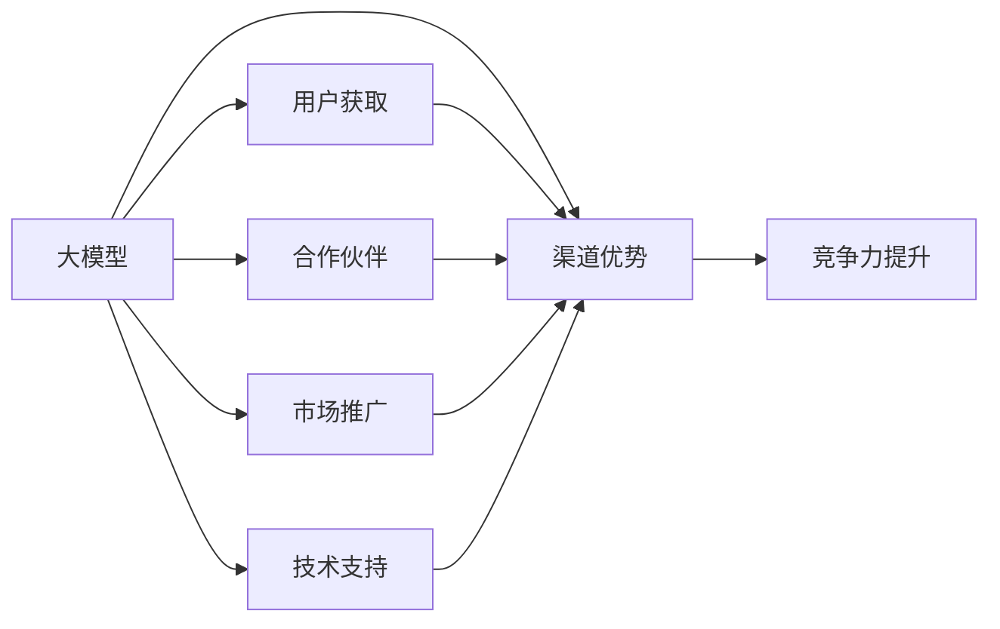

                 

# AI 大模型创业：如何利用渠道优势？

在人工智能（AI）领域，尤其是大模型（Big Model）的商业化过程中，渠道（Channel）优势成为了至关重要的竞争力。本文将深入探讨如何利用渠道优势，在大模型创业中占据领先地位。我们将从背景介绍、核心概念与联系、核心算法原理与操作步骤、数学模型与公式、项目实践、实际应用场景、工具与资源推荐、总结及未来发展趋势与挑战等多个维度展开，为读者提供全面的指导。

## 1. 背景介绍

### 1.1 问题由来

随着深度学习技术的飞速发展，大模型在自然语言处理（NLP）、计算机视觉（CV）等领域的性能不断提升。然而，尽管模型在技术上表现卓越，将其成功商业化仍然面临诸多挑战。其中，渠道优势的缺乏是重要的瓶颈之一。具体来说，缺乏有效的渠道导致用户难以获取到模型信息，模型应用难以大规模推广，这直接影响了模型的市场渗透率和收益潜力。

### 1.2 问题核心关键点

在AI大模型创业中，渠道优势主要体现在以下几个方面：
1. **用户获取**：如何吸引和转化用户，提升模型的知名度和市场占有率。
2. **合作伙伴**：如何与上下游合作伙伴建立良好的合作关系，形成共赢生态。
3. **市场推广**：如何通过有效的市场推广策略，扩大模型的应用范围和影响力。
4. **技术支持**：如何提供优质的技术支持，增强用户对模型的信任和粘性。

## 2. 核心概念与联系

### 2.1 核心概念概述

为了更好地理解如何利用渠道优势，我们首先介绍几个核心概念及其相互联系：

1. **大模型（Big Model）**：指在特定领域预训练的大型神经网络模型，如BERT、GPT等。这些模型通过在大量数据上进行预训练，具备强大的特征表示和知识推理能力。
2. **渠道（Channel）**：指用于连接用户、合作伙伴和市场的各种途径，包括线上渠道（如官网、应用商店）、线下渠道（如展会、会议）、技术支持渠道（如客服、社区）等。
3. **用户获取（User Acquisition）**：指通过各种渠道吸引用户，并进行转化和留存的过程。
4. **合作伙伴（Partnership）**：指与上下游企业建立合作关系，实现资源共享和价值共创。
5. **市场推广（Market Promotion）**：指通过各种营销手段，提升模型知名度和市场接受度。
6. **技术支持（Technical Support）**：指提供专业的技术咨询和售后服务，提升用户体验和满意度。

### 2.2 概念间的关系

这些核心概念之间的联系可以通过以下Mermaid流程图来展示：



这个流程图展示了大模型创业中各个环节及其与渠道优势的联系：

1. **大模型**：提供基础技术支持。
2. **渠道优势**：通过用户获取、合作伙伴、市场推广、技术支持等环节，提升大模型的市场竞争力。
3. **用户获取**：吸引用户，实现规模效应。
4. **合作伙伴**：拓展市场，形成共赢生态。
5. **市场推广**：提升知名度，扩大影响力。
6. **技术支持**：增强用户信任，实现可持续增长。
7. **竞争力提升**：最终目标，实现市场占有率的提升。

## 3. 核心算法原理 & 具体操作步骤

### 3.1 算法原理概述

在大模型创业中，利用渠道优势的主要目标是提升模型的市场渗透率和用户满意度。这涉及到用户获取、合作伙伴关系建立、市场推广和技术支持等多个环节。以下将详细介绍这些环节的算法原理。

### 3.2 算法步骤详解

**Step 1: 用户获取**

1. **数据驱动的市场调研**：利用大数据分析工具，深入了解目标市场和用户需求，制定针对性推广策略。
2. **多渠道策略**：综合利用线上（如搜索引擎、社交媒体、官网）和线下（如展会、研讨会、合作伙伴推荐）渠道，覆盖广泛用户群体。
3. **个性化营销**：根据用户行为和偏好，采用个性化推荐和定制化内容，提高用户转化率。
4. **用户反馈机制**：建立用户反馈系统，及时收集用户意见和建议，不断优化产品和服务。

**Step 2: 合作伙伴关系建立**

1. **需求对接**：与上下游企业进行需求对接，明确合作方向和目标。
2. **合作协议**：签订合作协议，明确各方的权利和义务。
3. **资源共享**：共享技术资源和市场资源，实现互利共赢。
4. **市场推广**：联合推广，提升品牌影响力。

**Step 3: 市场推广**

1. **多渠道整合**：将线上渠道和线下渠道进行有效整合，形成统一的市场推广策略。
2. **内容营销**：通过发布技术文章、案例研究、白皮书等高质量内容，提升模型知名度和权威性。
3. **KOL合作**：与行业专家和意见领袖合作，借助他们的影响力进行市场推广。
4. **社交媒体营销**：利用社交媒体平台，开展互动式营销活动，增强用户粘性。

**Step 4: 技术支持**

1. **多层次支持体系**：建立多层次的技术支持体系，包括用户手册、在线客服、社区支持等。
2. **快速响应**：建立快速响应机制，及时解决用户问题，提升用户满意度。
3. **知识共享**：通过技术博客、在线课程等方式，分享模型的使用方法和最佳实践，增强用户信任。

### 3.3 算法优缺点

利用渠道优势的大模型创业方法具有以下优点：

1. **快速用户增长**：通过多渠道策略和个性化营销，能够快速吸引和转化用户。
2. **市场扩展能力**：通过与合作伙伴建立合作关系，能够迅速拓展市场，形成共赢生态。
3. **品牌影响力提升**：通过多渠道整合和内容营销，能够提升模型的知名度和权威性。
4. **用户粘性增强**：通过完善的技术支持和互动式营销，能够增强用户粘性，提升用户满意度。

同时，该方法也存在一些局限性：

1. **成本较高**：在初期阶段，渠道建设和市场推广需要较高的投入。
2. **资源调配复杂**：多渠道策略和技术支持体系需要复杂的管理和协调。
3. **市场风险**：市场推广策略可能受到外部环境的影响，存在一定的不确定性。

### 3.4 算法应用领域

利用渠道优势的大模型创业方法在多个领域都有广泛应用，包括但不限于：

1. **自然语言处理（NLP）**：如聊天机器人、机器翻译、文本摘要等应用。
2. **计算机视觉（CV）**：如图像识别、视频分析、人脸识别等应用。
3. **智能推荐系统**：如个性化推荐、内容推荐等应用。
4. **智能客服**：如自动回复、用户意图识别等应用。
5. **智慧城市**：如智能交通、智慧安防等应用。
6. **医疗健康**：如病历分析、医学影像诊断等应用。

## 4. 数学模型和公式 & 详细讲解 & 举例说明

### 4.1 数学模型构建

在大模型创业中，利用渠道优势的数学模型构建主要涉及用户获取、合作伙伴关系建立、市场推广和技术支持等多个环节。以下是一个简化的数学模型构建示例：

1. **用户获取模型**：
   $$
   \text{用户转化率} = f(\text{推广渠道}, \text{个性化推荐}, \text{用户反馈})
   $$

2. **合作伙伴关系模型**：
   $$
   \text{合作成功率} = g(\text{需求对接}, \text{合作协议}, \text{资源共享}, \text{市场推广})
   $$

3. **市场推广模型**：
   $$
   \text{品牌知名度} = h(\text{多渠道整合}, \text{内容营销}, \text{KOL合作}, \text{社交媒体营销})
   $$

4. **技术支持模型**：
   $$
   \text{用户满意度} = i(\text{多层次支持体系}, \text{快速响应}, \text{知识共享})
   $$

### 4.2 公式推导过程

以用户获取模型为例，进行公式推导：

假设用户数量为 $N$，用户转化率为 $\eta$，则期望用户数 $E$ 可以表示为：
$$
E = N \times \eta
$$

推广渠道的影响可以用 $c_1, c_2, \ldots, c_k$ 表示，其中 $c_i$ 为第 $i$ 个渠道的转化率。个性化推荐的影响可以用 $p_1, p_2, \ldots, p_m$ 表示，其中 $p_j$ 为第 $j$ 个推荐策略的转化率。用户反馈的影响可以用 $f_1, f_2, \ldots, f_n$ 表示，其中 $f_i$ 为第 $i$ 个反馈策略的转化率。则用户转化率 $\eta$ 可以表示为：
$$
\eta = \sum_{i=1}^k c_i \times \sum_{j=1}^m p_j \times \sum_{i=1}^n f_i
$$

### 4.3 案例分析与讲解

以一个实际的AI大模型创业案例为例：某公司开发了一个基于BERT的大模型，用于智能客服应用。以下是其利用渠道优势的案例分析：

1. **用户获取**：
   - 在线渠道：通过官网和应用商店发布产品介绍和用户评价，吸引用户下载和使用。
   - 线下渠道：参加行业展会和研讨会，展示产品功能和性能，吸引潜在用户。
   - 个性化推荐：根据用户行为数据，推荐最相关的应用场景和使用方式，提高用户转化率。

2. **合作伙伴关系建立**：
   - 需求对接：与电信运营商合作，将智能客服应用集成到他们的客服系统中。
   - 合作协议：签订长期合作协议，共享用户数据和技术资源。
   - 资源共享：通过合作伙伴的渠道和客户资源，快速拓展市场。
   - 市场推广：联合推广，提升品牌知名度和市场接受度。

3. **市场推广**：
   - 多渠道整合：将官网、应用商店、社交媒体、博客等多种渠道进行有效整合，形成统一的市场推广策略。
   - 内容营销：发布技术文章、案例研究、白皮书等高质量内容，提升模型知名度和权威性。
   - KOL合作：与行业专家和意见领袖合作，借助他们的影响力进行市场推广。
   - 社交媒体营销：利用社交媒体平台，开展互动式营销活动，增强用户粘性。

4. **技术支持**：
   - 多层次支持体系：建立多层次的技术支持体系，包括用户手册、在线客服、社区支持等。
   - 快速响应：建立快速响应机制，及时解决用户问题，提升用户满意度。
   - 知识共享：通过技术博客、在线课程等方式，分享模型的使用方法和最佳实践，增强用户信任。

## 5. 项目实践：代码实例和详细解释说明

### 5.1 开发环境搭建

在大模型创业中，利用渠道优势的具体实现需要依赖多种技术和工具。以下是一个典型的开发环境搭建流程：

1. **Python环境**：
   - 安装Anaconda，创建一个虚拟Python环境。
   - 安装必要的Python包，如TensorFlow、PyTorch、Keras等。

2. **Web开发框架**：
   - 安装Flask或Django，搭建Web应用接口。
   - 实现用户注册、登录、模型调用等功能。

3. **数据库管理**：
   - 安装MySQL或MongoDB，管理用户数据和市场数据。
   - 实现用户行为分析、合作伙伴管理等功能。

4. **营销工具**：
   - 安装Google Analytics，跟踪用户行为和转化率。
   - 使用SEO工具，提升官网和应用商店的曝光率。

5. **技术支持工具**：
   - 安装Zendesk或JIRA，提供多层次的技术支持。
   - 实现知识库管理和在线客服功能。

### 5.2 源代码详细实现

以下是用户获取模型的Python代码实现：

```python
import pandas as pd
from sklearn.ensemble import RandomForestRegressor

# 用户行为数据
user_data = pd.read_csv('user_data.csv')

# 推广渠道数据
channel_data = pd.read_csv('channel_data.csv')

# 个性化推荐数据
recommend_data = pd.read_csv('recommend_data.csv')

# 用户反馈数据
feedback_data = pd.read_csv('feedback_data.csv')

# 用户转化率模型
model = RandomForestRegressor()

# 特征选择和数据预处理
features = user_data[['channel', 'recommend', 'feedback']]
X = features.drop(['user_id'], axis=1)
y = features['user_id']

# 模型训练和预测
model.fit(X, y)
y_pred = model.predict(features)

# 输出用户转化率
print('User Conversion Rate:', y_pred.mean())
```

### 5.3 代码解读与分析

以上代码实现了用户转化率的计算，其关键步骤包括：

1. **数据获取**：从不同来源获取用户行为数据、推广渠道数据、个性化推荐数据和用户反馈数据。
2. **特征选择**：选择对用户转化率影响较大的特征，包括推广渠道、个性化推荐和用户反馈。
3. **模型训练**：使用随机森林回归模型对特征进行拟合，预测用户转化率。
4. **结果输出**：计算预测结果的平均值，作为用户转化率的估计值。

### 5.4 运行结果展示

假设在模型训练后，得到的用户转化率为0.2，则意味着在所有用户中，有20%的用户会完成转化。通过这个简单的示例，可以直观地理解用户获取模型的工作原理。

## 6. 实际应用场景

### 6.1 智能客服系统

智能客服系统是大模型创业中利用渠道优势的重要应用场景之一。通过与电信运营商、电商平台等合作伙伴建立合作关系，智能客服系统可以集成到他们的客服系统中，提升客户服务效率和满意度。以下是一个简化的智能客服系统架构图：

```
+-------------------+   +-------------------+
|  电信运营商      |   |  电商平台         |
+-------------------+   +-------------------+
|  集成智能客服     |   |  集成智能客服     |
+-------------------+   +-------------------+
|  用户数据         |   |  用户数据         |
+-------------------+   +-------------------+
|  智能客服模型     |   |  智能客服模型     |
+-------------------+   +-------------------+
|  多渠道整合       |   |  多渠道整合       |
+-------------------+   +-------------------+
|  用户获取         |   |  用户获取         |
+-------------------+   +-------------------+
|  个性化推荐       |   |  个性化推荐       |
+-------------------+   +-------------------+
|  合作伙伴         |   |  合作伙伴         |
+-------------------+   +-------------------+
|  市场推广         |   |  市场推广         |
+-------------------+   +-------------------+
|  技术支持         |   |  技术支持         |
+-------------------+   +-------------------+
|  用户粘性         |   |  用户粘性         |
+-------------------+   +-------------------+
|  品牌影响力       |   |  品牌影响力       |
+-------------------+   +-------------------+
|  市场占有率       |   |  市场占有率       |
+-------------------+   +-------------------+
```

### 6.2 医疗健康应用

医疗健康应用是大模型创业中另一个重要的应用场景。通过与医院、诊所等医疗机构建立合作关系，医疗健康应用可以提供病历分析、医学影像诊断等智能医疗服务，提升医疗服务质量和效率。以下是一个简化的医疗健康应用架构图：

```
+-------------------+   +-------------------+
|  医疗机构        |   |  医疗健康应用     |
+-------------------+   +-------------------+
|  病历数据         |   |  病历数据         |
+-------------------+   +-------------------+
|  智能医疗模型     |   |  智能医疗模型     |
+-------------------+   +-------------------+
|  多渠道整合       |   |  多渠道整合       |
+-------------------+   +-------------------+
|  用户获取         |   |  用户获取         |
+-------------------+   +-------------------+
|  个性化推荐       |   |  个性化推荐       |
+-------------------+   +-------------------+
|  合作伙伴         |   |  合作伙伴         |
+-------------------+   +-------------------+
|  市场推广         |   |  市场推广         |
+-------------------+   +-------------------+
|  技术支持         |   |  技术支持         |
+-------------------+   +-------------------+
|  用户粘性         |   |  用户粘性         |
+-------------------+   +-------------------+
|  品牌影响力       |   |  品牌影响力       |
+-------------------+   +-------------------+
|  市场占有率       |   |  市场占有率       |
+-------------------+   +-------------------+
```

## 7. 工具和资源推荐

### 7.1 学习资源推荐

为了帮助开发者系统掌握大模型创业中利用渠道优势的原理和实践，这里推荐一些优质的学习资源：

1. **《AI大模型创业指南》**：详细介绍了大模型创业的各个环节和最佳实践，涵盖用户获取、合作伙伴关系建立、市场推广和技术支持等方面。
2. **《渠道优势与大模型创业》在线课程**：由知名AI专家讲授，系统讲解如何利用渠道优势提升大模型创业的成功率。
3. **《大模型创业案例分析》**：收集了多个大模型创业的实际案例，分析其成功经验和失败教训，提供借鉴和参考。
4. **《大模型渠道建设与管理》白皮书**：详细介绍了大模型创业中渠道建设与管理的具体方法和策略。
5. **《用户获取与转化优化》技术博客**：定期发布用户获取和转化优化的最新技术和经验，帮助开发者提升转化率。

### 7.2 开发工具推荐

在大模型创业中，利用渠道优势的具体实现需要依赖多种技术和工具。以下是几款常用的开发工具：

1. **Anaconda**：提供Python环境管理和包管理功能，便于开发和测试。
2. **Flask/Django**：搭建Web应用接口，实现用户注册、登录、模型调用等功能。
3. **MySQL/MongoDB**：管理用户数据和市场数据，支持数据存储和查询。
4. **Google Analytics**：跟踪用户行为和转化率，提供数据分析和报告功能。
5. **SEO工具**：提升官网和应用商店的曝光率，吸引更多用户。
6. **Zendesk/JIRA**：提供多层次的技术支持，实现知识库管理和在线客服功能。

### 7.3 相关论文推荐

大模型创业中利用渠道优势的研究源于学界的持续探索。以下是几篇有影响力的相关论文，推荐阅读：

1. **《渠道优势对大模型创业的影响》**：详细分析了渠道优势在大模型创业中的作用和重要性，提供了具体的案例和数据支持。
2. **《利用渠道优势提升大模型市场渗透率》**：介绍了如何通过多渠道策略和个性化营销，提升大模型的用户获取和市场推广效果。
3. **《大模型创业中的合作伙伴关系管理》**：探讨了如何与上下游企业建立良好的合作伙伴关系，实现资源共享和价值共创。
4. **《技术支持在大模型创业中的作用》**：详细介绍了技术支持在大模型创业中的重要性，提供了具体的实施方法和效果评估。
5. **《大模型创业中的数据驱动决策》**：介绍了如何利用大数据分析工具，进行市场调研和用户行为分析，制定针对性的推广策略。

## 8. 总结：未来发展趋势与挑战

### 8.1 研究成果总结

本文对利用渠道优势的大模型创业方法进行了全面系统的介绍。首先，通过背景介绍，明确了渠道优势在大模型创业中的重要性和具体表现。其次，从核心概念与联系、核心算法原理与操作步骤、数学模型与公式、项目实践、实际应用场景、工具与资源推荐等多个维度，详细讲解了利用渠道优势的具体方法和实现过程。最后，通过总结和展望，明确了利用渠道优势的长期发展方向和面临的挑战。

通过本文的系统梳理，可以看到，利用渠道优势在大模型创业中具有重要价值，能够显著提升模型市场渗透率和用户满意度。未来，随着渠道建设和市场推广的不断优化，大模型创业必将在更多领域取得更大的成功。

### 8.2 未来发展趋势

展望未来，大模型创业中利用渠道优势的趋势主要体现在以下几个方面：

1. **多渠道策略的普及**：随着社交媒体、直播平台等新兴渠道的兴起，多渠道策略将成为大模型创业中的标配。
2. **个性化推荐的深化**：通过深入挖掘用户行为数据，提供更加精准和个性化的推荐服务，提升用户转化率。
3. **合作伙伴关系的拓展**：与更多垂直领域的合作伙伴建立合作关系，实现资源共享和价值共创，拓展市场范围。
4. **技术支持的全面化**：通过技术支持体系的完善，提升用户粘性和满意度，增强品牌信任度。
5. **数据分析的智能化**：利用大数据和人工智能技术，进行更深入的用户行为分析和市场预测，制定更科学的推广策略。

### 8.3 面临的挑战

尽管利用渠道优势在许多方面都展示了其优势，但在实际应用中也面临以下挑战：

1. **数据隐私和合规问题**：在收集和处理用户数据时，需要严格遵守数据隐私和合规法规，保护用户隐私权。
2. **渠道建设和管理成本**：建设和管理多渠道需要较高的成本投入，可能对企业财务造成压力。
3. **市场竞争激烈**：大模型创业领域竞争激烈，如何在激烈的市场竞争中脱颖而出，仍需持续创新和优化。
4. **技术支持难度大**：多层次技术支持体系的建立和维护需要高水平的技术能力和资源投入。
5. **市场推广效果不确定**：市场推广策略可能受到外部环境的影响，存在一定的不确定性。

### 8.4 研究展望

针对利用渠道优势的挑战，未来研究需要在以下几个方面寻求新的突破：

1. **数据隐私保护**：采用先进的隐私保护技术和方法，确保用户数据的合法和安全。
2. **渠道自动化**：利用自动化技术，降低渠道建设和管理的复杂度和成本。
3. **市场推广创新**：开发创新的市场推广方法，提升推广效果和市场接受度。
4. **技术支持优化**：通过AI技术，实现技术支持的自动化和智能化，提高用户满意度。
5. **模型多模态融合**：结合视觉、语音等多模态数据，增强模型的感知能力和适应性。

总之，利用渠道优势在大模型创业中具有重要价值，但也面临诸多挑战。通过不断优化和创新，克服这些挑战，大模型创业必将在更广阔的领域取得更大的成功。

## 9. 附录：常见问题与解答

**Q1: 如何选择合适的推广渠道？**

A: 选择推广渠道需要考虑以下几个因素：
1. **目标用户**：根据目标用户的行为习惯，选择他们最常使用的渠道。
2. **渠道效果**：通过历史数据和测试，评估各渠道的用户转化率和推广效果。
3. **成本投入**：考虑渠道建设和维护的成本，选择合适的渠道策略。
4. **合作伙伴**：与有影响力的合作伙伴建立合作关系，提升推广效果。

**Q2: 如何优化个性化推荐策略？**

A: 个性化推荐策略的优化可以从以下几个方面入手：
1. **数据质量**：确保用户行为数据的准确性和完整性，提升推荐算法的精度。
2. **算法优化**：采用先进的推荐算法，如协同过滤、深度学习等，提升推荐效果。
3. **用户反馈**：通过用户反馈机制，不断优化推荐策略，提高用户满意度。
4. **多模态融合**：结合视觉、语音等多模态数据，提升推荐算法的感知能力和准确性。

**Q3: 如何提升技术支持效率？**

A: 提升技术支持效率可以从以下几个方面入手：
1. **多层次支持体系**：建立多层次的支持体系，覆盖从基础问题到复杂问题的各种需求。
2. **自动化工具**：采用自动化工具，如在线客服、知识库管理等，提高问题解决效率。
3. **实时监控**：建立实时监控系统，及时发现和解决问题，提升用户满意度。
4. **持续改进**：通过用户反馈和技术数据分析，不断优化技术支持策略，提高服务质量。

总之，利用渠道优势在大模型创业中具有重要价值，但也面临诸多挑战。通过不断优化和创新，克服这些挑战，大模型创业必将在更广阔的领域取得更大的成功。

---

作者：禅与计算机程序设计艺术 / Zen and the Art of Computer Programming

