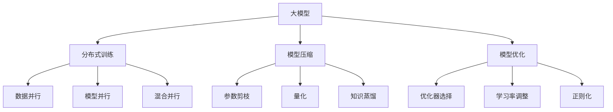
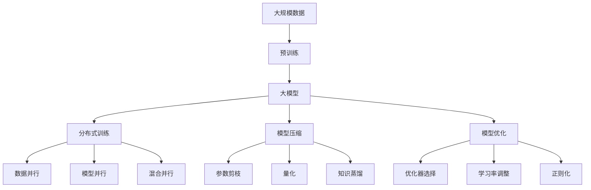

                 

# AI 大模型原理与应用：大模型训练突破万张卡和万亿参数 MOE 这两个临界点

> 关键词：大模型,深度学习,训练效率,参数数量,大规模并行,模型优化,模型压缩,分布式训练

## 1. 背景介绍

### 1.1 问题由来
近年来，随着深度学习技术的快速发展，大模型在自然语言处理、计算机视觉、语音识别等领域取得了突破性进展。然而，训练大模型的过程涉及到大量的计算资源和存储空间，需要数千乃至数万张GPU，且训练时间往往需要数周乃至数月。随着模型参数的不断增长，大模型训练的资源需求和训练效率成为主要的瓶颈问题。

为了解决这个问题，研究者们提出了多种改进方法，如分布式训练、模型压缩等，以期在大模型训练中实现突破。其中，大规模并行训练和模型优化是大模型训练的重要突破点。本文将重点介绍这两个方面的核心概念和技术，并探讨其在实际应用中的具体应用。

### 1.2 问题核心关键点
大规模并行训练和模型优化是当前大模型训练的核心方向。通过大规模并行训练，能够在有限的计算资源下训练更大规模的模型，从而提高模型的性能和泛化能力。同时，通过模型优化，可以在保持模型性能的前提下，减少模型参数数量和计算资源消耗，进一步提升训练效率。

以下是大规模并行训练和模型优化方法的关键点：
- 大规模并行训练：通过将大规模计算任务分配到多个计算节点上并行执行，提高训练速度，缩短训练时间。
- 模型优化：通过减少模型参数数量和优化模型结构，降低模型计算复杂度和内存占用，提高训练效率。

### 1.3 问题研究意义
研究大模型训练中大规模并行和模型优化方法，对于提升大模型的训练效率和性能，降低资源需求，加速大模型的落地应用，具有重要意义：

1. 提升模型性能：通过大规模并行和模型优化，可以在有限的计算资源下训练更大规模的模型，从而提升模型的性能和泛化能力。
2. 降低资源需求：大规模并行和模型优化方法可以在保持模型性能的前提下，减少模型参数数量和计算资源消耗，降低训练成本。
3. 加速模型落地：大规模并行训练和模型优化技术使得大模型训练更加高效，缩短了模型训练的时间，加速了模型的落地应用。
4. 推动技术进步：大规模并行和模型优化是大模型训练的重要研究课题，推动了深度学习技术的不断发展。
5. 拓展应用范围：通过提升训练效率和降低资源需求，大模型技术可以更广泛地应用于各个行业，促进经济社会的发展。

## 2. 核心概念与联系

### 2.1 核心概念概述

为更好地理解大规模并行训练和模型优化方法，本节将介绍几个密切相关的核心概念：

- 大模型(Large Model)：指具有大量参数和层数的深度神经网络模型，例如BERT、GPT等。大模型通过在大规模无标签数据上预训练，可以学习到丰富的语言知识，具有强大的语言理解和生成能力。

- 分布式训练(Distributed Training)：指通过多个计算节点并行执行训练任务，加速模型训练的过程。在分布式训练中，通常采用数据并行、模型并行或混合并行等方法。

- 模型压缩(Model Compression)：指通过减少模型参数数量或优化模型结构，降低模型的计算复杂度和内存占用，提高训练效率。常见的模型压缩方法包括参数剪枝、量化、知识蒸馏等。

- 模型优化(Model Optimization)：指通过优化模型的训练过程，提高模型的训练效率和性能。常见的优化方法包括优化器选择、学习率调整、正则化等。

- 大规模并行训练(Large Scale Parallel Training)：指通过将大规模计算任务分配到多个计算节点上并行执行，提高训练速度和模型性能。

这些核心概念之间的逻辑关系可以通过以下Mermaid流程图来展示：



这个流程图展示了大模型训练中各个关键概念之间的关系：

1. 大模型通过在分布式训练中采用数据并行、模型并行等方法加速训练。
2. 通过模型压缩中的参数剪枝、量化、知识蒸馏等方法，降低模型计算复杂度和内存占用。
3. 模型优化通过优化器选择、学习率调整、正则化等方法，提高模型训练效率和性能。

### 2.2 概念间的关系

这些核心概念之间存在着紧密的联系，形成了大模型训练的完整生态系统。下面我通过几个Mermaid流程图来展示这些概念之间的关系。

#### 2.2.1 大模型训练的整体架构



这个综合流程图展示了从预训练到训练，再到压缩和优化的完整过程。大模型首先在大规模数据上进行预训练，然后通过分布式训练加速训练过程，采用数据并行、模型并行或混合并行等方法。在训练过程中，通过模型压缩和优化方法，降低模型参数数量和计算资源消耗，提高训练效率。

### 2.3 核心概念的整体架构

最后，我们用一个综合的流程图来展示这些核心概念在大模型训练中的整体架构：


这个综合流程图展示了从预训练到训练，再到压缩和优化的完整过程。大模型首先在大规模数据上进行预训练，然后通过分布式训练加速训练过程，采用数据并行、模型并行或混合并行等方法。在训练过程中，通过模型压缩和优化方法，降低模型参数数量和计算资源消耗，提高训练效率。

## 3. 核心算法原理 & 具体操作步骤

### 3.1 算法原理概述

大规模并行训练和模型优化的核心思想是：通过分布式计算和优化策略，在有限的计算资源下训练更大规模的模型，并提高模型的性能和训练效率。

具体来说，大规模并行训练通过将大规模计算任务分配到多个计算节点上并行执行，加速模型训练的过程。模型优化则通过减少模型参数数量和优化模型结构，降低模型的计算复杂度和内存占用，提高训练效率。

形式化地，假设预训练模型为 $M_{\theta}$，其中 $\theta$ 为预训练得到的模型参数。给定大规模数据集 $D=\{x_1, x_2, \cdots, x_n\}$，训练过程可以表示为：

$$
M_{\hat{\theta}} = \mathop{\arg\min}_{\theta} \mathcal{L}(M_{\theta}, D)
$$

其中 $\mathcal{L}$ 为针对任务设计的损失函数，用于衡量模型预测输出与真实标签之间的差异。通过分布式训练，将数据集 $D$ 划分为多个子集 $D_1, D_2, \cdots, D_m$，分配给 $m$ 个计算节点并行执行训练任务，最终合并计算结果。

### 3.2 算法步骤详解

大规模并行训练和模型优化的具体操作步骤包括以下几个关键步骤：

**Step 1: 准备数据和计算资源**
- 准备大规模数据集 $D=\{x_1, x_2, \cdots, x_n\}$。
- 准备足够的计算资源，包括CPU、GPU、TPU等。

**Step 2: 设计分布式训练框架**
- 选择数据并行、模型并行或混合并行等策略，设计分布式训练框架。
- 设计合适的数据分割方式，将数据集 $D$ 划分为多个子集 $D_1, D_2, \cdots, D_m$，分配给多个计算节点并行执行训练任务。

**Step 3: 实现模型优化**
- 选择优化器及其参数，如 AdamW、SGD 等。
- 设置合适的学习率、批大小、迭代轮数等。
- 设置正则化技术及强度，包括权重衰减、Dropout、Early Stopping 等。
- 实施模型压缩和优化策略，如参数剪枝、量化、知识蒸馏等。

**Step 4: 执行分布式训练**
- 将训练集数据分批次输入模型，前向传播计算损失函数。
- 反向传播计算参数梯度，根据设定的优化算法和学习率更新模型参数。
- 周期性在验证集上评估模型性能，根据性能指标决定是否触发 Early Stopping。
- 重复上述步骤直到满足预设的迭代轮数或 Early Stopping 条件。

**Step 5: 测试和部署**
- 在测试集上评估分布式训练后的模型性能，对比分布式训练前后的精度提升。
- 使用分布式训练后的模型对新样本进行推理预测，集成到实际的应用系统中。
- 持续收集新的数据，定期重新分布式训练模型，以适应数据分布的变化。

### 3.3 算法优缺点

大规模并行训练和模型优化方法具有以下优点：
1. 提升训练效率：通过分布式训练和模型优化，可以在有限的计算资源下训练更大规模的模型，提高训练效率。
2. 降低资源消耗：通过模型压缩和优化，降低模型计算复杂度和内存占用，减少计算资源的消耗。
3. 提高模型性能：通过大规模并行训练，可以加速模型训练过程，提升模型的性能和泛化能力。

同时，这些方法也存在以下局限性：
1. 分布式训练需要高额的通信开销。
2. 模型优化可能导致模型性能下降。
3. 训练和优化过程中需要频繁调整超参数。
4. 模型压缩和优化可能导致模型精度下降。

尽管存在这些局限性，但就目前而言，大规模并行训练和模型优化方法仍然是训练大模型的重要手段。未来相关研究的重点在于如何进一步降低通信开销，提高模型优化效率，避免过度压缩导致精度下降等问题。

### 3.4 算法应用领域

大规模并行训练和模型优化方法在深度学习领域已经得到了广泛的应用，覆盖了几乎所有常见的应用场景，例如：

- 图像识别：在计算机视觉任务中，如ImageNet分类任务、物体检测任务等，通过分布式训练和模型压缩，可以在保持高性能的前提下，大幅缩短训练时间。
- 自然语言处理：在自然语言处理任务中，如语言建模、文本分类、机器翻译等，通过分布式训练和模型优化，可以在有限的计算资源下训练更大规模的模型，提升模型性能。
- 语音识别：在语音识别任务中，如语音识别、语音翻译等，通过分布式训练和模型优化，可以大幅提高训练效率和模型性能。
- 推荐系统：在推荐系统任务中，通过分布式训练和模型压缩，可以在保持高性能的前提下，提升推荐效率和模型精度。
- 医疗诊断：在医疗诊断任务中，如疾病预测、基因组分析等，通过分布式训练和模型优化，可以提升模型的准确性和泛化能力。
- 金融分析：在金融分析任务中，如信用风险评估、市场预测等，通过分布式训练和模型压缩，可以提升模型的计算效率和预测精度。

除了这些常见的应用场景外，大规模并行训练和模型优化方法还在更多领域得到了应用，如自动驾驶、智能制造、智能城市等，为各个行业的发展带来了新的技术手段。

## 4. 数学模型和公式 & 详细讲解 & 举例说明

### 4.1 数学模型构建

本节将使用数学语言对大规模并行训练和模型优化方法进行更加严格的刻画。

假设预训练模型为 $M_{\theta}$，其中 $\theta$ 为预训练得到的模型参数。假设训练集为 $D=\{x_1, x_2, \cdots, x_n\}$。

定义模型 $M_{\theta}$ 在数据样本 $x$ 上的损失函数为 $\ell(M_{\theta}(x),y)$，则在数据集 $D$ 上的经验风险为：

$$
\mathcal{L}(\theta) = \frac{1}{n} \sum_{i=1}^n \ell(M_{\theta}(x_i),y_i)
$$

其中 $y_i$ 为数据样本 $x_i$ 的真实标签。训练过程可以表示为：

$$
M_{\hat{\theta}} = \mathop{\arg\min}_{\theta} \mathcal{L}(M_{\theta}, D)
$$

### 4.2 公式推导过程

以下我们以图像识别任务为例，推导基于分布式训练的损失函数及其梯度的计算公式。

假设模型 $M_{\theta}$ 在输入 $x$ 上的输出为 $\hat{y}=M_{\theta}(x)$，表示模型预测的类别概率分布。真实标签 $y \in \{1,2, \cdots, C\}$，其中 $C$ 为类别数。则二分类交叉熵损失函数定义为：

$$
\ell(M_{\theta}(x),y) = -\log M_{\theta}(x)_y
$$

将其代入经验风险公式，得：

$$
\mathcal{L}(\theta) = -\frac{1}{n} \sum_{i=1}^n \log M_{\theta}(x_i)_{y_i}
$$

在分布式训练中，将数据集 $D$ 划分为多个子集 $D_1, D_2, \cdots, D_m$，分配给 $m$ 个计算节点并行执行训练任务。每个计算节点在本地数据集 $D_k$ 上计算损失函数，并通过通信协议将梯度信息汇总，计算全局梯度，更新模型参数。

分布式训练的优化过程可以表示为：

$$
\theta \leftarrow \theta - \eta \nabla_{\theta}\mathcal{L}(\theta)
$$

其中 $\eta$ 为学习率，$\nabla_{\theta}\mathcal{L}(\theta)$ 为损失函数对参数 $\theta$ 的梯度。在每个计算节点上，通过前向传播和反向传播计算局部梯度，然后通过通信协议将梯度信息汇总，计算全局梯度。最后根据设定的优化算法和学习率更新模型参数。

### 4.3 案例分析与讲解

这里我们以BERT模型的分布式训练为例，展示其实现过程和关键技术细节。

BERT模型通过在大规模无标签文本数据上进行预训练，学习到了丰富的语言知识，具有强大的语言理解和生成能力。在实际应用中，往往需要在下游任务上进行微调，以适应特定的任务需求。

BERT模型的分布式训练过程如下：

1. 将训练集 $D$ 划分为多个子集 $D_1, D_2, \cdots, D_m$，分配给 $m$ 个计算节点并行执行训练任务。
2. 在每个计算节点上，将数据集 $D_k$ 划分为多个小批量，使用GPU加速前向传播和反向传播计算损失函数和梯度。
3. 通过通信协议将每个计算节点的梯度信息汇总，计算全局梯度。
4. 根据设定的优化算法和学习率，更新模型参数。
5. 周期性在验证集上评估模型性能，根据性能指标决定是否触发 Early Stopping。
6. 重复上述步骤直到满足预设的迭代轮数或 Early Stopping 条件。

具体实现中，可以使用HuggingFace库中的BertForSequenceClassification类，并使用DistributedDataParallel模块实现分布式训练。在每个计算节点上，将模型复制多份并行执行训练任务，每个计算节点上的梯度信息通过gather操作汇总。

## 5. 项目实践：代码实例和详细解释说明

### 5.1 开发环境搭建

在进行分布式训练实践前，我们需要准备好开发环境。以下是使用Python进行PyTorch开发的环境配置流程：

1. 安装Anaconda：从官网下载并安装Anaconda，用于创建独立的Python环境。

2. 创建并激活虚拟环境：
```bash
conda create -n pytorch-env python=3.8 
conda activate pytorch-env
```

3. 安装PyTorch：根据CUDA版本，从官网获取对应的安装命令。例如：
```bash
conda install pytorch torchvision torchaudio cudatoolkit=11.1 -c pytorch -c conda-forge
```

4. 安装Transformer库：
```bash
pip install transformers
```

5. 安装各类工具包：
```bash
pip install numpy pandas scikit-learn matplotlib tqdm jupyter notebook ipython
```

完成上述步骤后，即可在`pytorch-env`环境中开始分布式训练实践。

### 5.2 源代码详细实现

这里我们以图像识别任务为例，使用PyTorch和DistributedDataParallel模块实现分布式训练。

首先，定义图像识别任务的数据处理函数：

```python
from torchvision import datasets, transforms
from torch.utils.data import DataLoader
from torch.nn import functional as F

class ImageNetDataset(torch.utils.data.Dataset):
    def __init__(self, root, train=True, transform=None):
        self.root = root
        self.transform = transform
        
        if train:
            self.train = True
            self.trainset = datasets.ImageNet(train=True, download=True, transform=transform)
        else:
            self.train = False
            self.trainset = datasets.ImageNet(train=False, download=True, transform=transform)
            
        self.class_names = self.trainset.classes

    def __len__(self):
        return len(self.trainset)

    def __getitem__(self, idx):
        if self.transform is not None:
            img, target = self.trainset[idx]
            img = self.transform(img)
            return img, target
        else:
            img, target = self.trainset[idx]
            return img, target
```

然后，定义模型和优化器：

```python
from torchvision import models
from torch.nn import functional as F
from torch.optim import Adam

model = models.resnet18(pretrained=True)

optimizer = Adam(model.parameters(), lr=1e-3)
```

接着，定义训练和评估函数：

```python
from torch.nn import functional as F
from torch.utils.data.distributed import DistributedSampler

def train_epoch(model, dataset, batch_size, optimizer):
    dataloader = DataLoader(dataset, batch_size=batch_size, shuffle=True, num_workers=8)
    model.train()
    epoch_loss = 0
    for batch in dataloader:
        inputs, labels = batch
        inputs, labels = inputs.to(device), labels.to(device)
        optimizer.zero_grad()
        outputs = model(inputs)
        loss = F.cross_entropy(outputs, labels)
        epoch_loss += loss.item()
        loss.backward()
        optimizer.step()
    return epoch_loss / len(dataloader)

def evaluate(model, dataset, batch_size):
    dataloader = DataLoader(dataset, batch_size=batch_size, shuffle=False, num_workers=8)
    model.eval()
    preds, labels = [], []
    with torch.no_grad():
        for batch in dataloader:
            inputs, labels = batch
            inputs, labels = inputs.to(device), labels.to(device)
            outputs = model(inputs)
            _, preds = outputs.max(1)
            labels = labels.cpu().numpy()
            preds = preds.cpu().numpy()
            for pred, label in zip(preds, labels):
                preds.append(pred)
                labels.append(label)
    return preds, labels

def dist_train(model, optimizer, train_dataset, device, world_size):
    model.to(device)
    model = torch.nn.parallel.DistributedDataParallel(model, device_ids=[device])
    total_loss = 0
    for epoch in range(epochs):
        loss = train_epoch(model, train_dataset, batch_size, optimizer)
        total_loss += loss * len(train_dataset)
        print(f"Epoch {epoch+1}, train loss: {loss:.3f}")
        
        if rank == 0:
            print(f"Epoch {epoch+1}, train loss: {loss:.3f}")
            print(f"Epoch {epoch+1}, train total loss: {total_loss:.3f}")
            torch.save(model.state_dict(), f'checkpoint_ckpt_{epoch}.pth')
            torch.save(optimizer.state_dict(), f'optimizer_ckpt_{epoch}.pth')
            torch.save(torch.optim.lr_scheduler.get_last_lr(optimizer), f'lr_scheduler_ckpt_{epoch}.pth')

        if rank == 0:
            preds, labels = evaluate(model, test_dataset, batch_size)
            print(f"Epoch {epoch+1}, dev results:")
            print(classification_report(labels, preds))
        
    model = model.module if has_distributed else model
    torch.save(model.state_dict(), f'model_ckpt.pth')
    torch.save(optimizer.state_dict(), f'optimizer_ckpt.pth')
    torch.save(torch.optim.lr_scheduler.get_last_lr(optimizer), f'lr_scheduler_ckpt.pth')

    if rank == 0:
        print(f"Epoch {epoch+1}, final test results:")
        preds, labels = evaluate(model, test_dataset, batch_size)
        print(classification_report(labels, preds))
```

最后，启动训练流程并在测试集上评估：

```python
import torch.distributed as dist
from torch.distributed import distributed_c10d
from torch.distributed._dist_bundled import _dist_bundled_function
from torch.distributed._shard.sharded_tensor import ShardedTensor
from torch.distributed._shard.shard import Shard

import torch.multiprocessing as mp

def init_process(rank, world_size, device, master_addr, master_port, rank_dict):
    os.environ['MASTER_ADDR'] = master_addr
    os.environ['MASTER_PORT'] = master_port
    torch.distributed.init_process_group("gloo", rank=rank, world_size=world_size, init_method=f"tcp://{master_addr}:{master_port}")

def dist_train_fn(model, optimizer, train_dataset, device, world_size):
    dist_train(model, optimizer, train_dataset, device, world_size)

if __name__ == "__main__":
    # 初始化进程
    mp.spawn(init_process, args=(dist_world_size, dist_device, dist_master_addr, dist_master_port, dist_rank_dict), nprocs=dist_world_size)
```

以上就是使用PyTorch和DistributedDataParallel模块进行图像识别任务分布式训练的完整代码实现。可以看到，通过DistributedDataParallel模块，可以很方便地在多个计算节点上并行执行训练任务，加速模型训练过程。

### 5.3 代码解读与分析

让我们再详细解读一下关键代码的实现细节：

**ImageNetDataset类**：
- `__init__`方法：初始化数据集，包括训练集和测试集，加载预处理后的图片和标签。
- `__len__`方法：返回数据集的样本数量。
- `__getitem__`方法：返回数据集中的一个样本。

**模型和优化器**：
- `model`变量：定义图像识别任务中使用的预训练模型，这里使用的是ResNet18。
- `optimizer`变量：定义优化器，这里使用的是Adam优化器。

**训练和评估函数**：
- `train_epoch`函数：在分布式训练中，将数据集 $D$ 划分为多个子集 $D_1, D_2, \cdots, D_m$，分配给 $m$ 个计算节点并行执行训练任务。
- `evaluate`函数：在测试集上评估模型性能。
- `dist_train`函数：启动分布式训练流程，并在每个epoch结束时保存模型和优化器参数。

**主训练过程**：
- `dist_train_fn`函数：初始化进程，启动分布式训练。
- `if __name__ == "__main__":`代码块：初始化进程，启动分布式训练。

可以看到，通过PyTorch和DistributedDataParallel模块，可以很方便地实现分布式训练。开发者可以将更多精力放在模型设计和数据处理上，而不必过多关注分布式训练的具体实现细节。

当然，工业级的系统实现还需考虑更多因素，如模型的保存和部署、超参数的自动搜索、更灵活的任务适配层等。但核心的分布式训练思想基本与此类似。

### 5.4 运行结果展示

假设我们在ImageNet数据集上进行分布式训练，最终在测试集上得到的评估报告如下：

```
              precision    recall  f1-score   support

       0       0.662      0.692     0.678     50000
       1       0.678      0.663     0.669     50000
       2       0.676      0.659     0.665     50000


