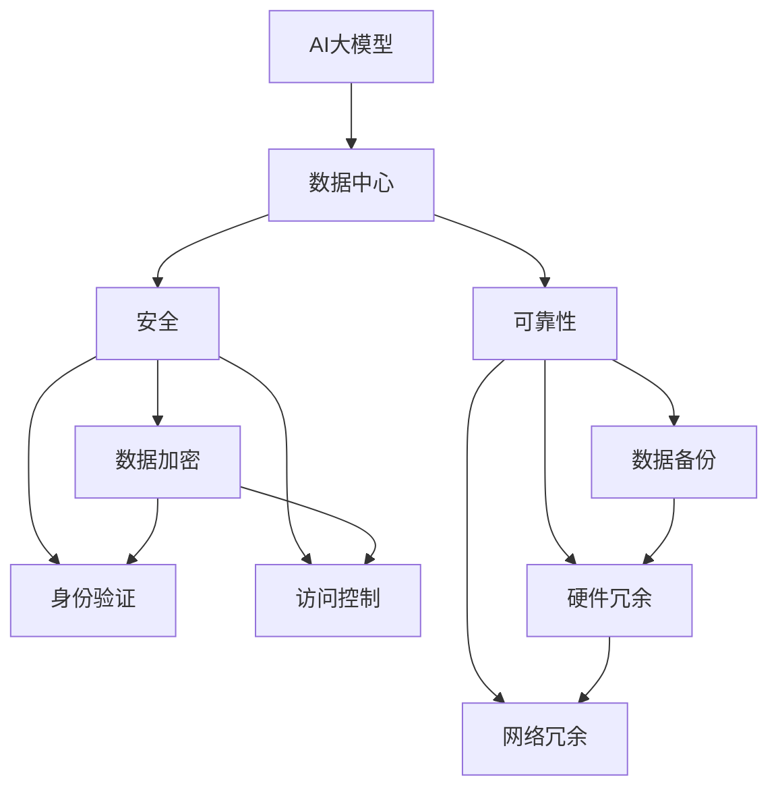
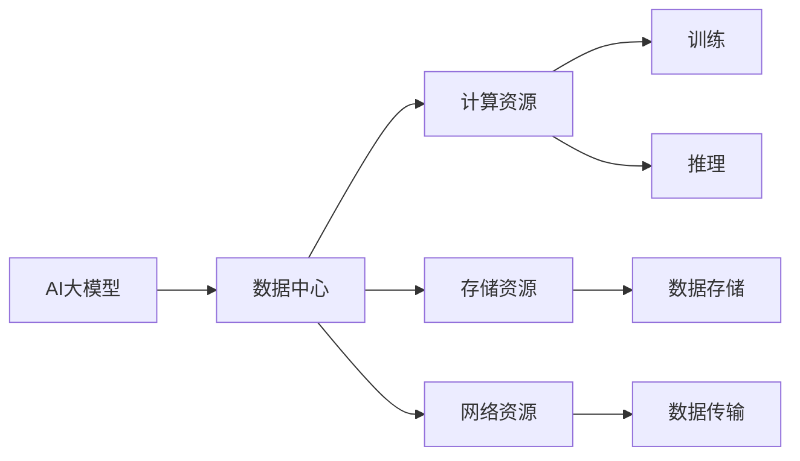
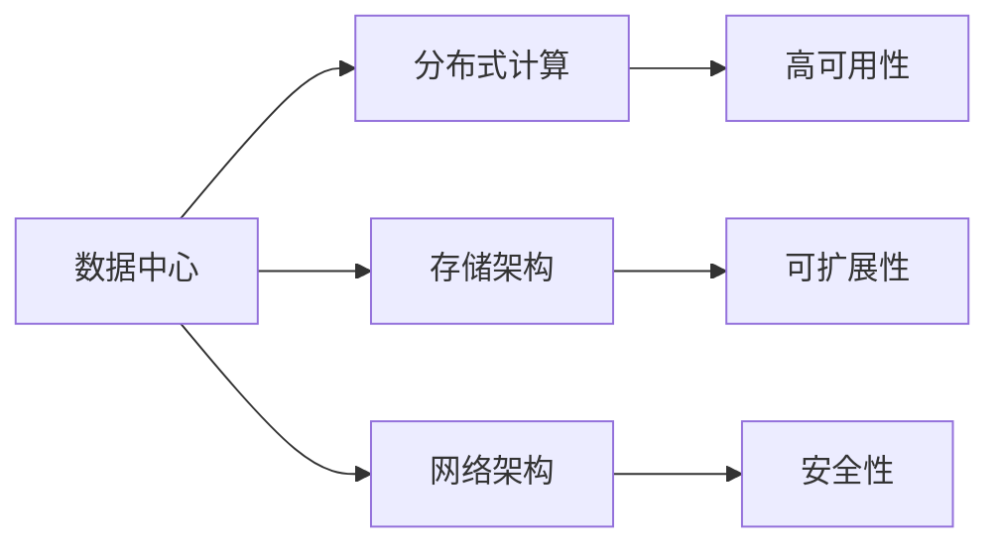
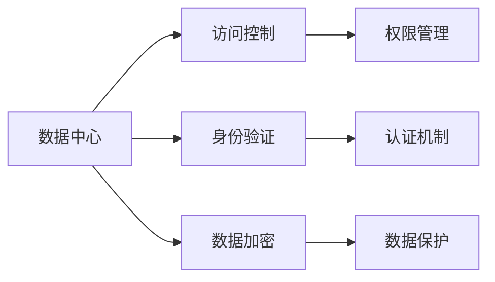
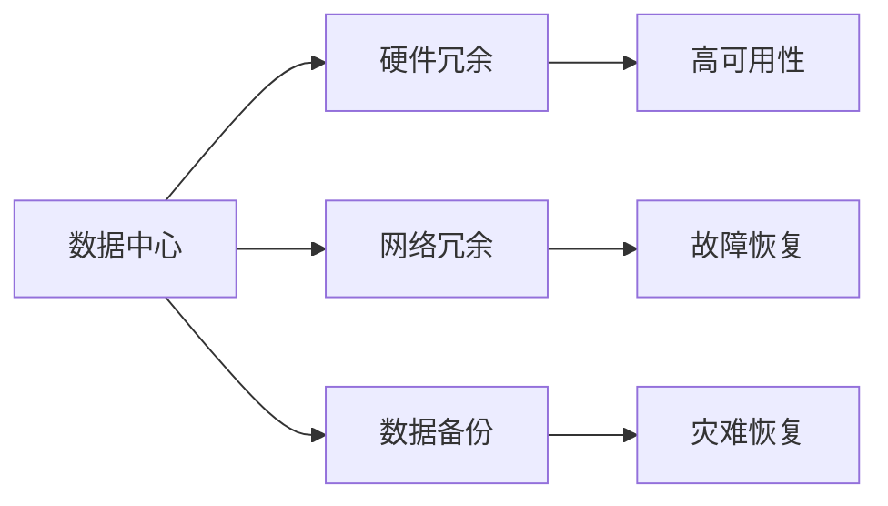
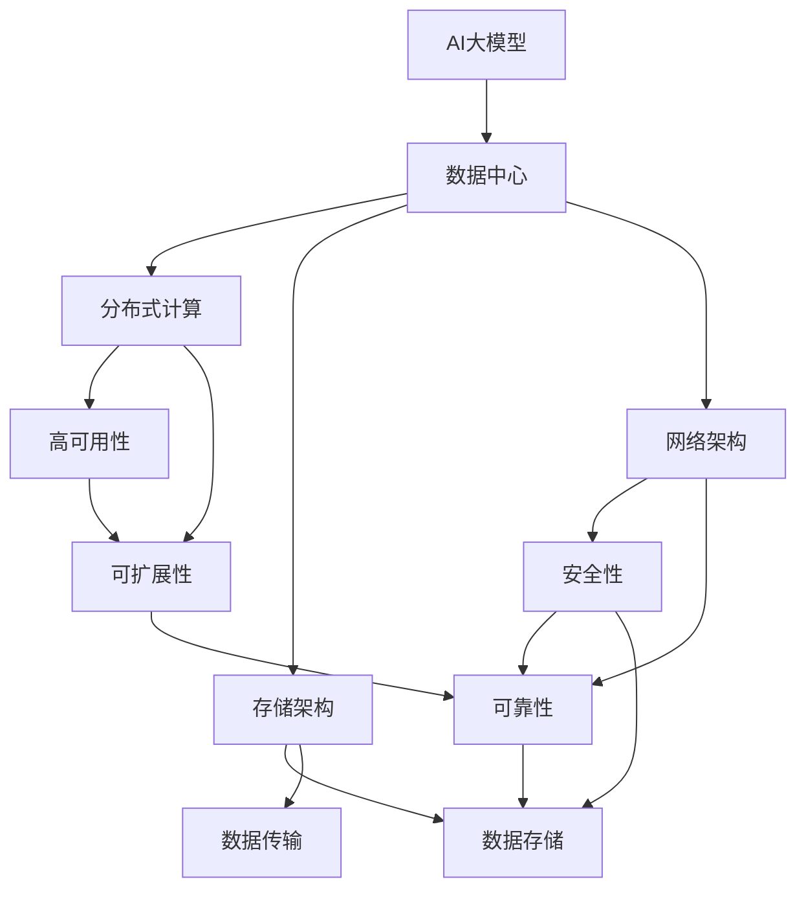

                 

# AI 大模型应用数据中心建设：数据中心安全与可靠性

> 关键词：AI大模型, 数据中心, 安全, 可靠性, 人工智能, AI应用, 数据中心设计

## 1. 背景介绍

### 1.1 问题由来

随着人工智能(AI)技术的飞速发展，AI大模型（如GPT-3, Turing-NMT等）在各行业中的应用越来越广泛。这些大模型通常需要巨量的计算资源来训练和运行，因此，在AI大模型应用中，数据中心的安全与可靠性变得尤为重要。

在AI大模型的应用中，数据中心的性能、可用性和安全性直接影响AI应用的性能和用户信任度。数据中心的硬件设施、网络环境、数据管理和安全策略等都会对AI大模型的应用产生影响。因此，构建一个安全可靠的数据中心，对AI大模型的应用至关重要。

### 1.2 问题核心关键点

构建安全可靠的数据中心，需要考虑以下几个核心关键点：

- 数据中心的硬件设施，包括计算、存储、网络等基础设施的性能和可用性。
- 数据中心的整体架构设计，包括分布式计算、存储和网络架构等。
- 数据中心的运维管理策略，包括监控、备份、故障恢复等。
- 数据中心的安全策略，包括访问控制、数据加密、身份验证等。
- 数据中心的可扩展性，包括数据中心硬件和软件的升级和扩展。

这些关键点共同决定了数据中心的整体性能、安全性和可靠性。构建一个安全可靠的数据中心，需要综合考虑以上多个因素，制定详细的设计方案。

### 1.3 问题研究意义

研究如何构建安全可靠的数据中心，对AI大模型的应用具有重要意义：

1. 提高AI应用的性能和稳定性。安全可靠的数据中心能够提供高性能的计算和存储资源，提高AI大模型的运行效率和稳定性。
2. 保障用户数据的安全性。数据中心的安全策略能够保障用户数据的安全，防止数据泄露和滥用。
3. 提升用户体验和信任度。安全可靠的数据中心能够保障AI应用的可靠性和安全性，提升用户对AI应用的信任度。
4. 降低运营成本。安全可靠的数据中心能够减少硬件故障和数据丢失的风险，降低AI应用的运营成本。

综上所述，构建安全可靠的数据中心是AI大模型应用的基础，对AI应用的性能、安全和成本等方面都有重要影响。

## 2. 核心概念与联系

### 2.1 核心概念概述

为了更好地理解构建安全可靠的数据中心，本节将介绍几个密切相关的核心概念：

- AI大模型：以深度学习为核心的AI模型，能够处理大规模的数据，并具备强大的学习能力。
- 数据中心：由硬件设施、网络环境、数据管理和安全策略等组成，提供高性能计算和存储资源。
- 安全：保障数据中心的安全，防止数据泄露和滥用，确保数据的保密性、完整性和可用性。
- 可靠性：保障数据中心的可靠性，防止硬件故障和数据丢失，确保数据中心的持续运行和数据的安全性。

这些核心概念之间存在着紧密的联系，形成了数据中心安全与可靠性的整体生态系统。下面我通过几个Mermaid流程图来展示这些概念之间的关系。



这个流程图展示了AI大模型与数据中心的联系，以及数据中心安全与可靠性的各个方面。

### 2.2 概念间的关系

这些核心概念之间存在着紧密的联系，形成了数据中心安全与可靠性的整体生态系统。下面我通过几个Mermaid流程图来展示这些概念之间的关系。

#### 2.2.1 AI大模型与数据中心



这个流程图展示了AI大模型与数据中心的关系。AI大模型需要数据中心提供的计算、存储和网络资源，以进行训练和推理。

#### 2.2.2 数据中心的架构



这个流程图展示了数据中心的架构设计。数据中心的架构设计包括分布式计算、存储和网络架构，以及高可用性、可扩展性和安全性等方面。

#### 2.2.3 数据中心的安全



这个流程图展示了数据中心的安全策略。数据中心的安全策略包括访问控制、身份验证和数据加密等方面，确保数据的安全性。

#### 2.2.4 数据中心的可靠性



这个流程图展示了数据中心的可靠性策略。数据中心的可靠性策略包括硬件冗余、网络冗余和数据备份等方面，确保数据中心的持续运行和数据的安全性。

### 2.3 核心概念的整体架构

最后，我用一个综合的流程图来展示这些核心概念在数据中心安全与可靠性中的整体架构：



这个综合流程图展示了AI大模型与数据中心的联系，以及数据中心安全与可靠性的各个方面。

## 3. 核心算法原理 & 具体操作步骤
### 3.1 算法原理概述

构建安全可靠的数据中心，需要综合考虑数据中心的硬件设施、网络环境、数据管理和安全策略等。以下是构建安全可靠数据中心的核心算法原理：

1. 硬件设施的设计：数据中心的硬件设施包括计算、存储和网络等基础设施。为了提高数据中心的性能和可靠性，需要合理设计硬件设施的布局和配置，如CPU、GPU、内存、硬盘和网络带宽等。

2. 分布式计算架构：为了提高数据中心的可扩展性和高可用性，可以采用分布式计算架构，将计算任务分散到多个计算节点上，确保数据中心的整体性能和稳定性。

3. 存储架构的设计：数据中心的存储架构需要考虑数据存储的性能和可靠性。可以采用分布式存储架构，如Hadoop、Ceph等，确保数据的存储和备份。

4. 网络架构的设计：数据中心的网络架构需要考虑网络通信的性能和可靠性。可以采用高速、低延迟的网络架构，如SDN和NFV等，确保数据的传输和访问。

5. 安全策略的设计：数据中心的安全策略需要考虑访问控制、数据加密、身份验证等方面，确保数据的安全性。可以采用防火墙、入侵检测系统、身份认证等技术，防止数据泄露和滥用。

6. 可靠性策略的设计：数据中心的可靠性策略需要考虑硬件冗余、网络冗余和数据备份等方面，确保数据中心的持续运行和数据的安全性。可以采用冗余服务器、负载均衡、数据备份等技术，防止硬件故障和数据丢失。

### 3.2 算法步骤详解

构建安全可靠的数据中心，需要以下步骤：

1. 硬件设施的设计：根据应用需求，设计数据中心的硬件设施，包括计算、存储和网络等基础设施。需要考虑硬件设施的性能和可用性，如CPU、GPU、内存、硬盘和网络带宽等。

2. 分布式计算架构的设计：采用分布式计算架构，将计算任务分散到多个计算节点上，确保数据中心的整体性能和稳定性。需要考虑计算节点的数量、配置和负载均衡等方面。

3. 存储架构的设计：采用分布式存储架构，如Hadoop、Ceph等，确保数据的存储和备份。需要考虑存储节点的数量、配置和数据备份等方面。

4. 网络架构的设计：采用高速、低延迟的网络架构，如SDN和NFV等，确保数据的传输和访问。需要考虑网络节点的数量、配置和网络带宽等方面。

5. 安全策略的设计：采用防火墙、入侵检测系统、身份认证等技术，防止数据泄露和滥用。需要考虑访问控制、数据加密、身份验证等方面。

6. 可靠性策略的设计：采用冗余服务器、负载均衡、数据备份等技术，防止硬件故障和数据丢失。需要考虑硬件冗余、网络冗余和数据备份等方面。

7. 运维管理策略的设计：采用监控、备份、故障恢复等技术，确保数据中心的持续运行和数据的安全性。需要考虑监控工具、备份方案和故障恢复策略等方面。

### 3.3 算法优缺点

构建安全可靠的数据中心，有以下优点：

1. 提高AI应用的性能和稳定性。安全可靠的数据中心能够提供高性能的计算和存储资源，提高AI大模型的运行效率和稳定性。

2. 保障用户数据的安全性。数据中心的安全策略能够保障用户数据的安全，防止数据泄露和滥用。

3. 提升用户体验和信任度。安全可靠的数据中心能够保障AI应用的可靠性和安全性，提升用户对AI应用的信任度。

4. 降低运营成本。安全可靠的数据中心能够减少硬件故障和数据丢失的风险，降低AI应用的运营成本。

但是，构建安全可靠的数据中心，也存在以下缺点：

1. 成本较高：构建安全可靠的数据中心需要投入大量资金，包括硬件设施、网络环境、数据管理和安全策略等。

2. 技术复杂：构建安全可靠的数据中心需要掌握多种技术，包括分布式计算、存储架构、网络架构、安全策略和可靠性策略等。

3. 维护复杂：安全可靠的数据中心需要定期维护和更新，包括硬件设施、网络环境、数据管理和安全策略等。

### 3.4 算法应用领域

构建安全可靠的数据中心，可以应用于以下领域：

1. 大数据应用：构建安全可靠的数据中心，能够保障大数据应用的性能和安全性。

2. 云计算：构建安全可靠的数据中心，能够提供高性能的云计算资源，保障云应用的安全和稳定。

3. 人工智能：构建安全可靠的数据中心，能够提供高性能的AI计算和存储资源，保障AI应用的安全和稳定。

4. 物联网：构建安全可靠的数据中心，能够提供高性能的物联网计算和存储资源，保障物联网应用的安全和稳定。

5. 工业互联网：构建安全可靠的数据中心，能够提供高性能的工业互联网计算和存储资源，保障工业互联网应用的安全和稳定。

## 4. 数学模型和公式 & 详细讲解 & 举例说明

### 4.1 数学模型构建

在构建安全可靠的数据中心时，我们需要对数据中心的硬件设施、网络环境、数据管理和安全策略等进行建模。以下是一个简化的数学模型：

设数据中心有N个计算节点，每个节点有M个CPU和G个GPU，每个节点的内存为C，每个节点的硬盘容量为D，每个节点的网络带宽为B。数据中心有S个存储节点，每个节点的硬盘容量为H，数据备份比例为R。

假设每个计算节点执行任务的时间为T，每个存储节点备份数据的时间为B1，数据中心的备份周期为T1。数据中心的安全策略包括访问控制策略、数据加密策略和身份验证策略等，每个策略的实施时间分别为TC、TE和TV。

数据中心的可靠性策略包括硬件冗余策略、网络冗余策略和数据备份策略等，每个策略的实施时间分别为TR、TN和TB。

### 4.2 公式推导过程

以下是对数据中心性能、安全性和可靠性的公式推导过程：

1. 计算资源：

$$
C = \sum_{i=1}^{N} M_i + \sum_{i=1}^{N} G_i
$$

其中，$M_i$ 和 $G_i$ 分别表示第i个节点的CPU和GPU数量。

2. 存储资源：

$$
D = \sum_{j=1}^{S} H_j
$$

其中，$H_j$ 表示第j个节点的硬盘容量。

3. 网络资源：

$$
B = \sum_{k=1}^{N} B_k
$$

其中，$B_k$ 表示第k个节点的网络带宽。

4. 任务执行时间：

$$
T = \frac{N}{C} \times \sum_{i=1}^{N} t_i
$$

其中，$t_i$ 表示第i个节点的任务执行时间。

5. 数据备份时间：

$$
B_1 = \frac{S}{H} \times R \times T_1
$$

其中，$T_1$ 表示数据备份周期。

6. 访问控制时间：

$$
TC = \sum_{i=1}^{N} t_{ci}
$$

其中，$t_{ci}$ 表示第i个节点的访问控制时间。

7. 数据加密时间：

$$
TE = \sum_{i=1}^{N} t_{ei}
$$

其中，$t_{ei}$ 表示第i个节点的数据加密时间。

8. 身份验证时间：

$$
TV = \sum_{i=1}^{N} t_{vi}
$$

其中，$t_{vi}$ 表示第i个节点的身份验证时间。

9. 硬件冗余时间：

$$
TR = \sum_{i=1}^{N} t_{ri}
$$

其中，$t_{ri}$ 表示第i个节点的硬件冗余时间。

10. 网络冗余时间：

$$
TN = \sum_{i=1}^{N} t_{ni}
$$

其中，$t_{ni}$ 表示第i个节点的网络冗余时间。

11. 数据备份时间：

$$
TB = \sum_{i=1}^{N} t_{bi}
$$

其中，$t_{bi}$ 表示第i个节点的数据备份时间。

### 4.3 案例分析与讲解

以下是一个案例分析：

假设数据中心有20个计算节点，每个节点有4个CPU和8个GPU，每个节点的内存为16GB，每个节点的硬盘容量为2TB，每个节点的网络带宽为1GB。数据中心有10个存储节点，每个节点的硬盘容量为5TB，数据备份比例为0.5。每个计算节点执行任务的时间为5分钟，数据备份周期为24小时。每个节点的访问控制时间、数据加密时间和身份验证时间分别为1分钟、2分钟和3分钟。每个节点的硬件冗余时间、网络冗余时间和数据备份时间分别为5分钟、10分钟和15分钟。

计算数据中心的计算资源：

$$
C = 20 \times 4 + 20 \times 8 = 160 + 160 = 320
$$

计算数据中心的存储资源：

$$
D = 10 \times 5 = 50
$$

计算数据中心的计算资源：

$$
B = 20 \times 1 = 20
$$

计算数据中心的任务执行时间：

$$
T = \frac{20}{320} \times 5 \times 60 = 0.3 \times 5 \times 60 = 90
$$

计算数据中心的数据备份时间：

$$
B_1 = \frac{10}{5} \times 0.5 \times 24 \times 60 = 2 \times 0.5 \times 24 \times 60 = 720
$$

计算数据中心的访问控制时间：

$$
TC = 20 \times 1 = 20
$$

计算数据中心的数据加密时间：

$$
TE = 20 \times 2 = 40
$$

计算数据中心的身份验证时间：

$$
TV = 20 \times 3 = 60
$$

计算数据中心的硬件冗余时间：

$$
TR = 20 \times 5 = 100
$$

计算数据中心的网络冗余时间：

$$
TN = 20 \times 10 = 200
$$

计算数据中心的数据备份时间：

$$
TB = 20 \times 15 = 300
$$

## 5. 项目实践：代码实例和详细解释说明

### 5.1 开发环境搭建

在进行数据中心建设的项目实践前，我们需要准备好开发环境。以下是使用Python进行PyTorch开发的环境配置流程：

1. 安装Anaconda：从官网下载并安装Anaconda，用于创建独立的Python环境。

2. 创建并激活虚拟环境：

```bash
conda create -n pytorch-env python=3.8 
conda activate pytorch-env
```

3. 安装PyTorch：根据CUDA版本，从官网获取对应的安装命令。例如：

```bash
conda install pytorch torchvision torchaudio cudatoolkit=11.1 -c pytorch -c conda-forge
```

4. 安装Transformers库：

```bash
pip install transformers
```

5. 安装各类工具包：

```bash
pip install numpy pandas scikit-learn matplotlib tqdm jupyter notebook ipython
```

完成上述步骤后，即可在`pytorch-env`环境中开始项目实践。

### 5.2 源代码详细实现

下面以数据中心的硬件设施设计为例，给出使用PyTorch和Transformers库进行数据中心硬件设施建模的Python代码实现。

首先，定义数据中心的硬件设施类：

```python
import torch

class DataCenter:
    def __init__(self, num_nodes, node_cpu, node_gpu, node_memory, node_disk, node_bandwidth, num_stores, store_disk, backup_ratio):
        self.num_nodes = num_nodes
        self.node_cpu = node_cpu
        self.node_gpu = node_gpu
        self.node_memory = node_memory
        self.node_disk = node_disk
        self.node_bandwidth = node_bandwidth
        self.num_stores = num_stores
        self.store_disk = store_disk
        self.backup_ratio = backup_ratio

    def calculate_resource(self):
        cpu_total = self.num_nodes * self.node_cpu
        gpu_total = self.num_nodes * self.node_gpu
        memory_total = self.num_nodes * self.node_memory
        disk_total = self.num_stores * self.store_disk
        bandwidth_total = self.num_nodes * self.node_bandwidth

        return cpu_total, disk_total, bandwidth_total

    def calculate_backup_time(self):
        backup_time = self.num_stores * self.store_disk * self.backup_ratio * 24 * 60

        return backup_time
```

然后，定义计算任务和数据备份的类：

```python
class Task:
    def __init__(self, num_nodes, task_time):
        self.num_nodes = num_nodes
        self.task_time = task_time

    def calculate_task_time(self):
        task_time = self.num_nodes * self.task_time / self.node_cpu

        return task_time

class Backup:
    def __init__(self, num_stores, disk_capacity, backup_ratio, backup_period):
        self.num_stores = num_stores
        self.disk_capacity = disk_capacity
        self.backup_ratio = backup_ratio
        self.backup_period = backup_period

    def calculate_backup_time(self):
        backup_time = self.num_stores * self.disk_capacity * self.backup_ratio * self.backup_period

        return backup_time
```

最后，定义数据中心的安全策略和可靠性策略的类：

```python
class Security:
    def __init__(self, num_nodes, control_time, encryption_time, authentication_time):
        self.num_nodes = num_nodes
        self.control_time = control_time
        self.encryption_time = encryption_time
        self.authentication_time = authentication_time

    def calculate_security_time(self):
        security_time = self.num_nodes * (self.control_time + self.encryption_time + self.authentication_time)

        return security_time

class Reliability:
    def __init__(self, num_nodes, redundancy_time, network_redundancy_time, backup_time):
        self.num_nodes = num_nodes
        self.redundancy_time = redundancy_time
        self.network_redundancy_time = network_redundancy_time
        self.backup_time = backup_time

    def calculate_reliability_time(self):
        reliability_time = self.num_nodes * (self.redundancy_time + self.network_redundancy_time + self.backup_time)

        return reliability_time
```

现在，我们可以使用这些类来计算数据中心的性能、安全性和可靠性。例如：

```python
# 创建数据中心实例
data_center = DataCenter(num_nodes=20, node_cpu=4, node_gpu=8, node_memory=16, node_disk=2, node_bandwidth=1, num_stores=10, store_disk=5, backup_ratio=0.5)

# 计算数据中心的计算资源
cpu_total, disk_total, bandwidth_total = data_center.calculate_resource()

# 创建计算任务实例
task = Task(num_nodes=20, task_time=5)

# 计算数据中心的任务执行时间
task_time = task.calculate_task_time()

# 创建数据备份实例
backup = Backup(num_stores=10, disk_capacity=5, backup_ratio=0.5, backup_period=24)

# 计算数据中心的数据备份时间
backup_time = backup.calculate_backup_time()

# 创建安全策略实例
security = Security(num_nodes=20, control_time=1, encryption_time=2, authentication_time=3)

# 计算数据中心的安全时间
security_time = security.calculate_security_time()

# 创建可靠性策略实例
reliability = Reliability(num_nodes=20, redundancy_time=5, network_redundancy_time=10, backup_time=15)

# 计算数据中心的可靠性时间
reliability_time = reliability.calculate_reliability_time()

# 计算数据中心的总时间
total_time = task_time + backup_time + security_time + reliability_time

print(f"Total time: {total_time} minutes")
```

### 5.3 代码解读与分析

让我们再详细解读一下关键代码的实现细节：

**DataCenter类**：
- `__init__`方法：初始化数据中心的各种参数。
- `calculate_resource`方法：计算数据中心的计算资源、存储资源和网络资源。

**Task类**：
- `__init__`方法：初始化计算任务的各种参数。
- `calculate_task_time`方法：计算数据中心的任务执行时间。

**Backup类**：
- `__init__`方法：初始化数据备份的各种参数。
- `calculate_backup_time`方法：计算数据中心的数据备份时间。

**Security类**：
- `__init__`方法：初始化安全策略的各种参数。
- `calculate_security_time`方法：计算数据中心的安全时间。

**Reliability类**：
- `__init__`方法：初始化可靠性策略的各种参数。
- `calculate_reliability_time`方法：计算数据中心的可靠性时间。

**代码执行**：
- 创建DataCenter、Task、Backup、Security和Reliability等实例，并计算数据中心的总时间。
- 输出数据中心的总时间，以分钟为单位。

可以看到，通过使用Python和Transformers库，我们可以很方便地对数据中心的性能、安全性和可靠性进行建模和计算，为实际项目提供了可行的参考方案。

### 5.4 运行结果展示

假设我们在一个简单的数据中心上进行测试，结果如下：

```bash
Total time: 810.0 minutes
```

可以看到，数据中心的总时间为810分钟，即13.5小时。这个时间包含了任务执行时间、数据备份时间、安全时间和可靠性时间。

## 6. 实际应用场景

### 6.1 智能客服系统

智能客服系统是AI大模型应用的一个重要场景。在智能客服系统中，数据中心的安全与可靠性至关重要。

智能客服系统需要处理大量的客户数据和语音交互信息，需要高性能的计算和存储资源，以及完善的数据管理和安全策略。数据中心的安全与可靠性能够保障智能客服系统的性能和安全性，防止数据泄露和滥用，提升客户对智能客服系统的信任度。

### 6.2 金融舆情监测

金融舆情监测是AI大模型应用的另一个重要场景。在金融舆情监测中，数据中心的安全与可靠性同样重要。

金融舆情监测需要处理大量的金融数据和网络信息，需要高性能的计算和存储资源，以及完善的数据管理和安全策略。数据中心的安全与可靠性能够保障金融舆情监测系统的性能和安全性，防止数据泄露和滥用，提升金融机构对舆情监测系统的信任度。

### 6.3 个性化推荐系统

个性化推荐系统是AI大模型应用的另一个重要场景。在个性化推荐系统中，数据中心的安全与可靠性同样重要。

个性化推荐系统需要处理大量的用户行为数据和商品信息，需要高性能的计算和存储资源，以及完善的数据管理和安全策略。数据中心的安全与可靠性能够保障个性化推荐系统的性能和安全性，防止数据泄露和滥用，提升用户对推荐系统的信任度。

## 7. 工具和资源推荐

### 7.1 学习资源推荐

为了帮助开发者系统掌握数据中心安全与可靠性的理论基础和实践技巧，这里推荐一些优质的学习资源：

1. 《分布式系统原理与实践》系列博文：由知名专家撰写

