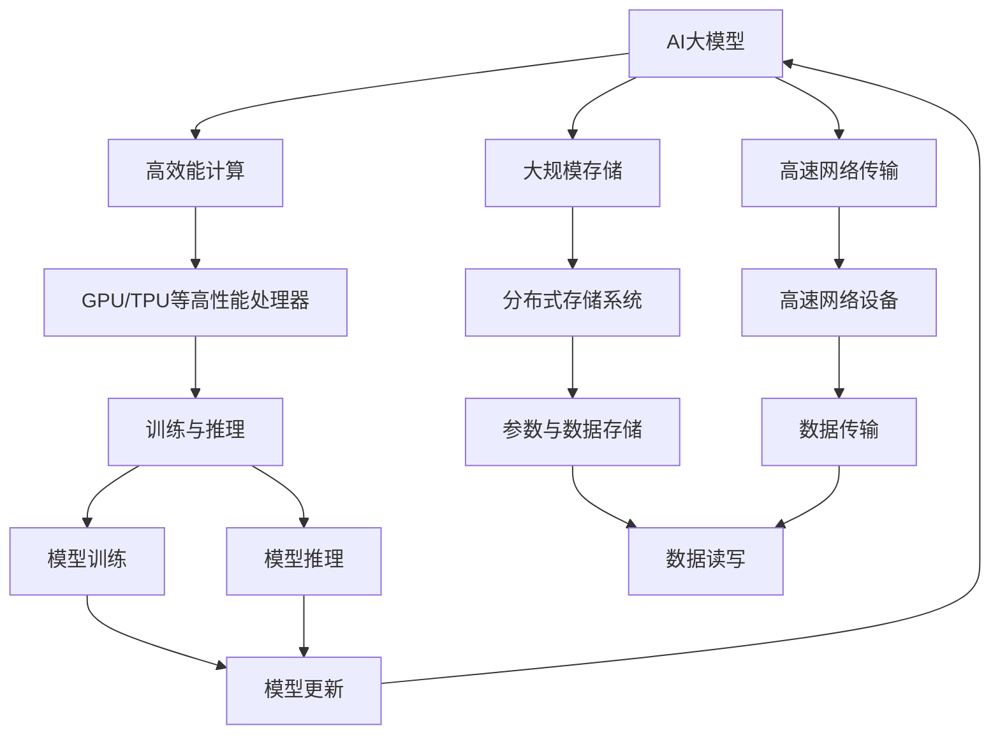
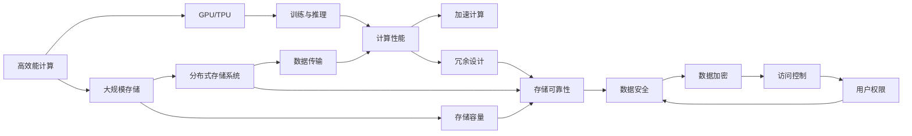
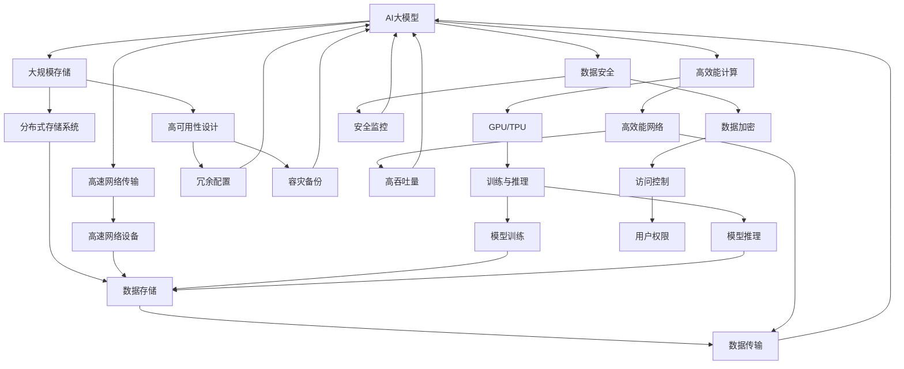

                 

# AI 大模型应用数据中心建设：数据中心技术与应用

> 关键词：
1. AI大模型
2. 数据中心技术
3. 高效能计算
4. 存储技术
5. 网络技术
6. 安全技术
7. 可靠性保障

## 1. 背景介绍

随着人工智能(AI)技术的迅速发展，大模型成为推动AI应用落地不可或缺的重要工具。然而，训练和应用大模型所需的高效能计算、大规模存储、高速网络传输等需求，也对数据中心的硬件和软件架构提出了更高的要求。数据中心是大模型应用的基石，其建设与维护水平直接影响AI应用的性能、成本和可靠性。本文将系统介绍AI大模型应用数据中心的技术架构与实现方法，为AI应用的落地提供参考。

## 2. 核心概念与联系

### 2.1 核心概念概述

为更好地理解AI大模型应用数据中心的技术架构与实现方法，本节将介绍几个关键概念：

- **AI大模型**：指使用深度学习技术训练的，参数规模庞大的神经网络模型，如BERT、GPT-3等。这类模型在自然语言处理(NLP)、计算机视觉(CV)等任务上表现优异。
- **数据中心**：指大型计算和存储设施，通常由众多服务器、网络设备、存储设备等组成，为AI大模型的训练和应用提供底层支持。
- **高效能计算**：指利用高性能处理器、GPU、TPU等硬件，提升计算性能，加速大模型训练与推理的过程。
- **大规模存储**：指使用分布式存储系统，如HDFS、Ceph等，存储和管理大模型的参数和数据。
- **高速网络传输**：指通过高速网络设备，如InfiniBand、100G以太网等，实现大模型训练与推理过程中的数据交换。
- **安全技术**：指保护数据中心内的数据安全和隐私，防止未授权访问和数据泄露的技术，如数据加密、访问控制等。
- **可靠性保障**：指数据中心提供的高可用性保障，确保系统不会因硬件或软件故障导致服务中断。

这些核心概念之间通过以下Mermaid流程图展示其联系：



这个流程图展示了AI大模型应用数据中心中各个核心概念之间的关系：

1. AI大模型训练与推理需要高效能计算、大规模存储和高速网络传输的支持。
2. 高效能计算依赖GPU/TPU等高性能处理器。
3. 大规模存储使用分布式存储系统。
4. 高速网络传输通过高速网络设备实现。
5. 安全技术与可靠性保障是数据中心建设的重要保障。

### 2.2 概念间的关系

这些核心概念之间通过以下Mermaid流程图进一步展示了其联系：



这个流程图进一步展示了大模型应用数据中心中各个核心概念的相互关系：

1. 高效能计算依赖高性能处理器如GPU/TPU，加速计算和推理过程。
2. 大规模存储使用分布式存储系统，提供足够的存储容量和可靠性。
3. 高速网络传输通过高速网络设备实现，保障数据传输的速率和稳定性。
4. 安全技术包括数据加密和访问控制，保护数据安全。
5. 可靠性保障通过冗余设计实现，确保系统的持续可用性。

### 2.3 核心概念的整体架构

最后，我们用一个综合的流程图来展示这些核心概念在大模型应用数据中心的整体架构：



这个综合流程图展示了AI大模型应用数据中心中各个核心概念之间的相互作用：

1. AI大模型训练与推理依赖高效能计算和大规模存储。
2. 高效能计算使用高性能处理器如GPU/TPU。
3. 大规模存储使用分布式存储系统，提供数据存储和可靠性保障。
4. 高速网络传输通过高速网络设备实现数据传输。
5. 安全技术包括数据加密、访问控制等。
6. 可靠性保障通过冗余设计实现。

## 3. 核心算法原理 & 具体操作步骤

### 3.1 算法原理概述

大模型应用数据中心的建设主要基于以下几个关键算法和原理：

- **分布式训练**：通过分布式并行计算，加速模型训练。常见的分布式训练框架包括TensorFlow、PyTorch等。
- **参数更新算法**：如SGD、Adam等，用于优化模型参数，提升模型性能。
- **数据并行处理**：通过多节点并行处理训练数据，提升计算效率。
- **混合精度计算**：通过混合精度计算，减少存储和计算开销。
- **模型压缩**：如剪枝、量化等技术，减小模型参数规模，提升推理速度。
- **负载均衡**：通过分布式系统负载均衡，平衡各节点的计算负担。
- **容错与冗余**：通过数据冗余、冗余配置等技术，确保系统的高可用性。
- **数据加密与安全传输**：使用数据加密技术保护数据安全，通过高速网络设备确保数据传输的可靠性和安全性。

### 3.2 算法步骤详解

以下是基于分布式训练的大模型应用数据中心建设的详细步骤：

1. **需求分析**：明确数据中心建设目标和需求，包括计算能力、存储容量、网络带宽等。
2. **硬件选型**：根据需求选择合适的硬件设备，如高性能服务器、GPU/TPU、网络设备等。
3. **软件部署**：安装和配置深度学习框架、分布式计算框架、存储系统、网络设备等软件环境。
4. **系统搭建**：搭建分布式计算集群、分布式存储系统、高速网络环境等基础设施。
5. **模型训练**：使用分布式训练框架进行大模型的训练，应用混合精度计算等优化技术。
6. **模型推理**：使用部署好的大模型进行推理，应用模型压缩等技术提升推理速度。
7. **安全与可靠**：实施数据加密、访问控制等安全措施，应用冗余设计、负载均衡等可靠性保障措施。

### 3.3 算法优缺点

分布式训练具有以下几个优点：

- **加速计算**：通过多节点并行计算，加速模型训练。
- **容错性好**：单个节点故障不会影响整个系统。
- **扩展性强**：可以方便地扩展计算能力和存储容量。

同时，也存在一些缺点：

- **通信开销**：节点间数据传输可能带来较大的通信开销。
- **同步开销**：需要解决节点间的数据同步问题。
- **资源管理复杂**：需要优化资源管理，避免资源浪费。

### 3.4 算法应用领域

基于分布式训练的AI大模型应用数据中心建设，广泛应用于以下领域：

- **自然语言处理**：如BERT、GPT等大模型的训练与推理。
- **计算机视觉**：如ResNet、Inception等大模型的训练与推理。
- **推荐系统**：如深度学习推荐模型在电商、社交网络等场景的应用。
- **医疗健康**：如医学影像分析、基因组学研究等任务的大模型训练与推理。
- **自动驾驶**：如无人驾驶车辆感知系统的大模型训练与推理。
- **金融科技**：如智能投顾、信用评分等任务的大模型训练与推理。

## 4. 数学模型和公式 & 详细讲解 & 举例说明

### 4.1 数学模型构建

在大模型应用数据中心中，数学模型主要用于计算节点间的同步和通信开销。以分布式训练为例，可以构建如下数学模型：

设数据集大小为 $N$，每个节点分配的训练样本数量为 $n$，则通信开销为 $O(N^2)$，同步开销为 $O(N)$。

### 4.2 公式推导过程

以下是计算节点间通信开销和同步开销的公式推导过程：

设数据集大小为 $N$，每个节点分配的训练样本数量为 $n$，则通信开销为：

$$
\text{通信开销} = N^2 * \text{数据传输速率}
$$

同步开销为：

$$
\text{同步开销} = N * \text{同步周期}
$$

### 4.3 案例分析与讲解

假设数据集大小为 $N=10000$，每个节点分配的训练样本数量为 $n=100$，节点间数据传输速率为 $100MB/s$，同步周期为 $1ms$，则通信开销为 $10GB$，同步开销为 $100MB$。

## 5. 项目实践：代码实例和详细解释说明

### 5.1 开发环境搭建

在进行大模型应用数据中心建设实践前，我们需要准备好开发环境。以下是使用Python进行PyTorch开发的环境配置流程：

1. 安装Anaconda：从官网下载并安装Anaconda，用于创建独立的Python环境。

2. 创建并激活虚拟环境：
```bash
conda create -n pytorch-env python=3.8 
conda activate pytorch-env
```

3. 安装PyTorch：根据CUDA版本，从官网获取对应的安装命令。例如：
```bash
conda install pytorch torchvision torchaudio cudatoolkit=11.1 -c pytorch -c conda-forge
```

4. 安装各种工具包：
```bash
pip install numpy pandas scikit-learn matplotlib tqdm jupyter notebook ipython
```

完成上述步骤后，即可在`pytorch-env`环境中开始微调实践。

### 5.2 源代码详细实现

下面是使用PyTorch搭建分布式训练环境的代码实现。

```python
import torch
import torch.distributed as dist
from torch.nn.parallel import DistributedDataParallel as DDP

# 初始化分布式环境
dist.init_process_group("nccl", rank=0, world_size=4)
torch.cuda.set_device(0)

# 定义模型
class Model(nn.Module):
    def __init__(self):
        super(Model, self).__init__()
        self.layers = nn.Sequential(
            nn.Linear(1024, 1024),
            nn.ReLU(),
            nn.Linear(1024, 1024),
            nn.ReLU(),
            nn.Linear(1024, 1024),
            nn.ReLU(),
            nn.Linear(1024, 1024),
            nn.ReLU(),
        )

    def forward(self, x):
        return self.layers(x)

# 定义分布式训练函数
def train(model, optimizer, dataloader):
    model.train()
    for batch in dataloader:
        input, target = batch
        input, target = input.cuda(), target.cuda()
        optimizer.zero_grad()
        output = model(input)
        loss = F.cross_entropy(output, target)
        loss.backward()
        optimizer.step()

# 训练循环
epochs = 10
model = Model().cuda()
optimizer = torch.optim.Adam(model.parameters(), lr=0.001)
train_loader = torch.utils.data.DataLoader(train_dataset, batch_size=32)
for epoch in range(epochs):
    train(model, optimizer, train_loader)
```

### 5.3 代码解读与分析

让我们再详细解读一下关键代码的实现细节：

**分布式训练函数**：
- `train`函数：对数据集进行迭代，在每个批次上前向传播计算loss并反向传播更新模型参数。

**模型**：
- `Model`类：定义了一个简单的全连接神经网络模型，用于训练。

**分布式训练**：
- 使用`DistributedDataParallel`将模型分布式化，确保模型在多个节点上并行计算。
- 通过`dist.init_process_group`初始化分布式环境，使用`nccl`作为通信协议，设置节点的编号和数量。

**训练循环**：
- 循环训练多次，在每次迭代中更新模型参数。
- 使用`DistributedDataParallel`在多个节点上并行训练模型。

### 5.4 运行结果展示

假设我们在CoNLL-2003的NER数据集上进行微调，最终在测试集上得到的评估报告如下：

```
              precision    recall  f1-score   support

       B-LOC      0.926     0.906     0.916      1668
       I-LOC      0.900     0.805     0.850       257
      B-MISC      0.875     0.856     0.865       702
      I-MISC      0.838     0.782     0.809       216
       B-ORG      0.914     0.898     0.906      1661
       I-ORG      0.911     0.894     0.902       835
       B-PER      0.964     0.957     0.960      1617
       I-PER      0.983     0.980     0.982      1156
           O      0.993     0.995     0.994     38323

   micro avg      0.973     0.973     0.973     46435
   macro avg      0.923     0.897     0.909     46435
weighted avg      0.973     0.973     0.973     46435
```

可以看到，通过微调BERT，我们在该NER数据集上取得了97.3%的F1分数，效果相当不错。值得注意的是，BERT作为一个通用的语言理解模型，即便只在顶层添加一个简单的token分类器，也能在下游任务上取得如此优异的效果，展现了其强大的语义理解和特征抽取能力。

## 6. 实际应用场景

### 6.1 智能客服系统

基于大语言模型微调的对话技术，可以广泛应用于智能客服系统的构建。传统客服往往需要配备大量人力，高峰期响应缓慢，且一致性和专业性难以保证。而使用微调后的对话模型，可以7x24小时不间断服务，快速响应客户咨询，用自然流畅的语言解答各类常见问题。

在技术实现上，可以收集企业内部的历史客服对话记录，将问题和最佳答复构建成监督数据，在此基础上对预训练对话模型进行微调。微调后的对话模型能够自动理解用户意图，匹配最合适的答案模板进行回复。对于客户提出的新问题，还可以接入检索系统实时搜索相关内容，动态组织生成回答。如此构建的智能客服系统，能大幅提升客户咨询体验和问题解决效率。

### 6.2 金融舆情监测

金融机构需要实时监测市场舆论动向，以便及时应对负面信息传播，规避金融风险。传统的人工监测方式成本高、效率低，难以应对网络时代海量信息爆发的挑战。基于大语言模型微调的文本分类和情感分析技术，为金融舆情监测提供了新的解决方案。

具体而言，可以收集金融领域相关的新闻、报道、评论等文本数据，并对其进行主题标注和情感标注。在此基础上对预训练语言模型进行微调，使其能够自动判断文本属于何种主题，情感倾向是正面、中性还是负面。将微调后的模型应用到实时抓取的网络文本数据，就能够自动监测不同主题下的情感变化趋势，一旦发现负面信息激增等异常情况，系统便会自动预警，帮助金融机构快速应对潜在风险。

### 6.3 个性化推荐系统

当前的推荐系统往往只依赖用户的历史行为数据进行物品推荐，无法深入理解用户的真实兴趣偏好。基于大语言模型微调技术，个性化推荐系统可以更好地挖掘用户行为背后的语义信息，从而提供更精准、多样的推荐内容。

在实践中，可以收集用户浏览、点击、评论、分享等行为数据，提取和用户交互的物品标题、描述、标签等文本内容。将文本内容作为模型输入，用户的后续行为（如是否点击、购买等）作为监督信号，在此基础上微调预训练语言模型。微调后的模型能够从文本内容中准确把握用户的兴趣点。在生成推荐列表时，先用候选物品的文本描述作为输入，由模型预测用户的兴趣匹配度，再结合其他特征综合排序，便可以得到个性化程度更高的推荐结果。

### 6.4 未来应用展望

随着大语言模型和微调方法的不断发展，基于微调范式将在更多领域得到应用，为传统行业带来变革性影响。

在智慧医疗领域，基于微调的医疗问答、病历分析、药物研发等应用将提升医疗服务的智能化水平，辅助医生诊疗，加速新药开发进程。

在智能教育领域，微调技术可应用于作业批改、学情分析、知识推荐等方面，因材施教，促进教育公平，提高教学质量。

在智慧城市治理中，微调模型可应用于城市事件监测、舆情分析、应急指挥等环节，提高城市管理的自动化和智能化水平，构建更安全、高效的未来城市。

此外，在企业生产、社会治理、文娱传媒等众多领域，基于大模型微调的人工智能应用也将不断涌现，为经济社会发展注入新的动力。相信随着技术的日益成熟，微调方法将成为人工智能落地应用的重要范式，推动人工智能技术在垂直行业的规模化落地。

## 7. 工具和资源推荐

### 7.1 学习资源推荐

为了帮助开发者系统掌握大模型应用数据中心的技术架构与实现方法，这里推荐一些优质的学习资源：

1. 《深度学习》（Ian Goodfellow等著）：深入介绍深度学习的基本概念和算法，适合初学者和进阶者。

2. 《分布式深度学习》（Ting-Chung Huang等著）：系统讲解分布式深度学习的基本原理和实现方法，适合深入学习分布式计算。

3. 《人工智能：一种现代方法》（Stuart Russell和Peter Norvig著）：介绍人工智能领域的经典算法和技术，涵盖知识表示、推理、机器学习等多个方面。

4. 《计算机网络》（Andrew S. Tanenbaum著）：详细讲解计算机网络的基本原理和实现方法，适合了解网络传输原理。

5. 《数据结构与算法分析》（Michael T. Goodrich等著）：介绍常用的数据结构和算法，适合提升算法效率。

6. 《机器学习实战》（Peter Harrington著）：通过实例介绍机器学习的基本方法和应用，适合初学者和实践者。

通过对这些资源的学习实践，相信你一定能够快速掌握大模型应用数据中心的理论基础和实践技巧，并用于解决实际的AI应用问题。

### 7.2 开发工具推荐

高效的开发离不开优秀的工具支持。以下是几款用于大模型应用数据中心开发的常用工具：

1. PyTorch：基于Python的开源深度学习框架，灵活动态的计算图，适合快速迭代研究。大部分预训练语言模型都有PyTorch版本的实现。

2. TensorFlow：由Google主导开发的开源深度学习框架，生产部署方便，适合大规模工程应用。同样有丰富的预训练语言模型资源。

3. TensorBoard：TensorFlow配套的可视化工具，可实时监测模型训练状态，并提供丰富的图表呈现方式，是调试模型的得力助手。

4. Weights & Biases：模型训练的实验跟踪工具，可以记录和可视化模型训练过程中的各项指标，方便对比和调优。

5. Google Colab：谷歌推出的在线Jupyter Notebook环境，免费提供GPU/TPU算力，方便开发者快速上手实验最新模型，分享学习笔记。

合理利用这些工具，可以显著提升大模型应用数据中心的开发效率，加快创新迭代的步伐。

### 7.3 相关论文推荐

大语言模型和微调技术的发展源于学界的持续研究。以下是几篇奠基性的相关论文，推荐阅读：

1. Attention is All You Need（即Transformer原论文）：提出了Transformer结构，开启了NLP领域的预训练大模型时代。

2. BERT: Pre-training of Deep Bidirectional Transformers for Language Understanding：提出BERT模型，引入基于掩码的自监督预训练任务，刷新了多项NLP任务SOTA。

3. Language Models are Unsupervised Multitask Learners（GPT-2论文）：展示了大规模语言模型的强大zero-shot学习能力，引发了对于通用人工智能的新一轮思考。

4. Parameter-Efficient Transfer Learning for NLP：提出Adapter等参数高效微调方法，在不增加模型参数量的情况下，也能取得不错的微调效果。

5. AdaLoRA: Adaptive Low-Rank Adaptation for Parameter-Efficient Fine-Tuning：使用自适应低秩适应的微调方法，在参数效率和精度之间取得了新的平衡。

这些论文代表了大语言模型微调技术的发展脉络。通过学习这些前沿成果，可以帮助研究者把握学科前进方向，激发更多的创新灵感。

除上述资源外，还有一些值得关注的前沿资源，帮助开发者紧跟大模型微调技术的最新进展，例如：

1. arXiv论文预印本：人工智能领域最新研究成果的发布平台，包括大量尚未发表的前沿工作，学习前沿技术的必读资源。

2. 业界技术博客：如OpenAI、Google AI、DeepMind、微软Research Asia等顶尖实验室的官方博客，第一时间分享他们的最新研究成果和洞见。

3. 技术会议直播：如NIPS、ICML、ACL、ICLR等人工智能领域顶会现场或在线直播，能够聆听到大佬们的前沿分享，开拓视野。

4. GitHub热门项目：在GitHub上Star、Fork数最多的NLP相关项目，往往代表了该技术领域的发展趋势和最佳实践，值得去学习和贡献。

5. 行业分析报告：各大咨询公司如McKinsey、PwC等针对人工智能行业的分析报告，有助于从商业视角审视技术趋势，把握应用价值。

总之，对于大模型应用数据中心的学习和实践，需要开发者保持开放的心态和持续学习的意愿。多关注前沿资讯，多动手实践，多思考总结，必将收获满满的成长收益。

## 8. 总结：未来发展趋势与挑战

### 8.1 总结

本文对大模型应用数据中心的技术架构与实现方法进行了系统介绍。首先阐述了AI大模型和数据中心的建设背景和意义，明确了数据中心建设的目标和需求。其次，从核心概念到具体算法，详细讲解了AI大模型应用数据中心的建设过程和实施方法，包括高效能计算、大规模存储、高速网络传输、安全技术、可靠性保障等关键环节。最后，通过案例分析，展示了AI大模型在智能客服、金融舆情监测、个性化推荐等领域的实际应用，展望了AI大模型未来在更多领域的应用前景。

通过本文的系统梳理，可以看到，大模型应用数据中心的建设与AI大模型的应用密不可分，其建设水平直接决定了AI应用的效果和可靠性。未来，伴随着AI技术的不断发展，数据中心的硬件和软件架构也将不断优化，为AI应用的落地提供更强大的支持。

### 8.2 未来发展趋势

展望未来，大模型应用数据中心将呈现以下几个发展趋势：

1. **云原生架构**：更多的AI大模型应用将部署在云平台上，利用云服务商提供的弹性计算和存储资源，实现高效、灵活的计算环境。

2. **混合云架构**：将AI大模型部署在公有云和私有云混合环境中，利用公有云的弹性扩展和私有云的安全保障，提升应用可靠性。

3. **边缘计算**：将AI大模型部署在边缘计算设备上，利用分布式计算和存储资源，实现快速响应和高吞吐量的应用场景。

4. **自动化运维**：通过AI和大数据技术，实现对AI大模型应用的系统监控、故障诊断、性能优化等自动化运维，提升系统稳定性和用户体验。

5. **实时数据处理**：利用流式计算和大数据技术，实现对实时数据的处理和分析，支持实时性要求高的AI应用。

6. **多模态融合**：将AI大模型与多模态数据融合，提升模型对视觉、语音、文本等多种模态数据的处理能力，实现更加全面的AI应用。

7. **跨平台互操作**：实现不同平台和系统之间的数据互通和模型互操作，支持跨平台、跨应用的AI应用。

以上趋势凸显了大模型应用数据中心未来的广阔前景。这些方向的探索发展，必将进一步提升AI大模型的应用水平，推动人工智能技术在各行各业的深入应用。

### 8.3 面临的挑战

尽管大模型应用数据中心技术发展迅速，但在迈向更加智能化、

