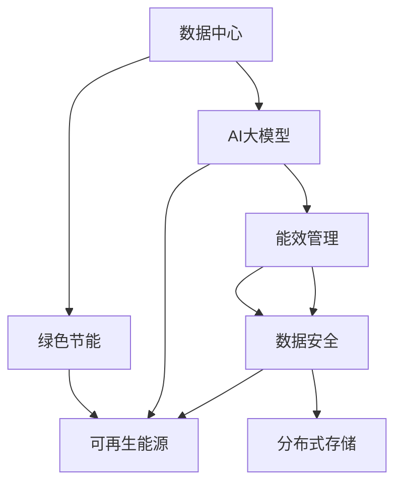

                 

# AI 大模型应用数据中心建设：数据中心绿色节能

> 关键词：
> - 数据中心
> - 绿色节能
> - AI 大模型
> - 能效管理
> - 可再生能源
> - 数据安全
> - 分布式存储

## 1. 背景介绍

### 1.1 问题由来

随着人工智能技术的快速发展，AI大模型在各个领域的应用越来越广泛，从自然语言处理、计算机视觉到医疗、金融等领域，AI大模型正在逐步改变传统产业的运营模式。然而，大模型的训练和应用对计算资源的需求极其庞大，带来了巨大的能耗问题。据估计，训练一个大型AI模型消耗的电力，相当于一个小型国家的电力需求。因此，AI大模型应用的数据中心建设不仅需要强大的计算能力，还需要有效的绿色节能技术。

### 1.2 问题核心关键点

AI大模型应用的数据中心建设，关键在于如何在保证高性能、高可靠性的同时，实现绿色节能。具体而言，包括以下几个方面：

- 数据中心的设计与构建：如何合理规划数据中心的物理结构，利用先进的技术实现能效优化。
- 能源的获取与利用：如何利用可再生能源，减少对化石燃料的依赖，降低碳排放。
- 能效管理与监测：如何通过能效管理系统，实时监测和优化数据中心的能源使用，减少不必要的能源浪费。
- 数据的存储与备份：如何利用分布式存储技术，提高数据中心的存储能力，同时减少能源消耗。

### 1.3 问题研究意义

AI大模型应用的数据中心建设，不仅关乎环境保护和可持续发展，还对企业的运营成本、竞争力有着重要影响。

1. 减少环境污染：通过采用绿色节能技术，减少数据中心能耗，降低碳排放，保护环境。
2. 降低运营成本：通过优化能源使用，减少电费开支，提升企业经济效益。
3. 提升企业形象：在绿色节能方面表现突出，可以增强企业的品牌形象和市场竞争力。
4. 促进技术创新：绿色节能技术的开发和应用，有助于推动AI大模型技术的进一步创新和发展。

## 2. 核心概念与联系

### 2.1 核心概念概述

为更好地理解AI大模型应用数据中心的绿色节能技术，本节将介绍几个关键概念及其相互联系：

- **数据中心(Data Center)**：由计算机硬件和支持系统组成，用于存储、处理和传输数据的设施。数据中心是AI大模型应用的基础设施。
- **绿色节能(Green Energy)**：通过采用可再生能源、优化能源使用等技术，降低数据中心的能耗和碳排放。
- **AI大模型(AI Large Models)**：利用深度学习技术训练出的，具有强大计算能力和泛化能力的大型模型，如BERT、GPT-3等。
- **能效管理(Energy Efficiency Management)**：通过能效管理系统，实时监测和优化数据中心的能源使用，减少能源浪费。
- **可再生能源(Renewable Energy)**：如风能、太阳能、地热能等，是一种可再生的、环保的能源。
- **数据安全(Data Security)**：通过物理和网络安全措施，保护数据中心内的数据不被未经授权的访问、篡改或损坏。
- **分布式存储(Distributed Storage)**：通过将数据存储在多个物理位置，提高数据中心的数据冗余和可靠性，同时减少能源消耗。

这些核心概念通过一系列技术手段，相互关联，共同构建了AI大模型应用数据中心的绿色节能体系。

### 2.2 概念间的关系

这些核心概念之间的关系可以通过以下Mermaid流程图来展示：



这个流程图展示了数据中心、AI大模型、绿色节能、能效管理、数据安全和分布式存储之间的逻辑关系：

1. 数据中心为AI大模型的训练和应用提供物理基础设施。
2. 绿色节能技术用于优化数据中心的能耗，减少环境污染。
3. AI大模型的训练和应用需要能效管理系统的支持，确保能源的高效利用。
4. 数据安全措施用于保护数据中心内的数据，防止泄漏和损坏。
5. 分布式存储技术用于提高数据中心的存储能力，同时减少能源消耗。

这些概念共同构建了AI大模型应用数据中心的绿色节能生态系统。通过理解这些概念之间的关系，我们可以更好地把握数据中心绿色节能技术的整体框架。

## 3. 核心算法原理 & 具体操作步骤

### 3.1 算法原理概述

AI大模型应用数据中心的绿色节能，主要通过以下几个方面实现：

- **硬件能效优化**：通过采用高性能、低能耗的硬件设备，提高数据中心的整体能效。
- **软件能效优化**：通过优化AI大模型的算法和架构，提高计算效率，减少能耗。
- **能源优化**：利用可再生能源，减少对化石燃料的依赖，降低碳排放。
- **数据中心管理**：通过能效管理系统，实时监测和优化数据中心的能源使用，确保高效运行。

这些技术手段，通过数据中心的整体设计和运营，实现绿色节能的目标。

### 3.2 算法步骤详解

以下是AI大模型应用数据中心绿色节能的具体操作步骤：

**Step 1: 设计数据中心架构**

- 根据AI大模型的计算需求，选择合适的硬件设备，如CPU、GPU、TPU等，并进行合理的物理布局。
- 设计高效冷却系统，如水冷、自然冷、液冷等，确保设备散热效果。
- 引入可再生能源设备，如太阳能板、风力发电机等，减少对传统能源的依赖。

**Step 2: 优化能源使用**

- 通过能效管理系统，实时监测数据中心的能源使用情况，包括电力、制冷、通风等。
- 使用智能算法进行能源调度，优先使用可再生能源，减少对传统能源的消耗。
- 实施节能措施，如自动关闭空闲设备、采用动态电压频率调节等，降低能源消耗。

**Step 3: 采用分布式存储**

- 采用分布式存储系统，如Hadoop、Ceph等，将数据分散存储在多个节点上。
- 通过冗余备份和数据复制，提高数据中心的数据冗余和可靠性。
- 通过数据压缩和去重技术，减少数据存储和传输的能耗。

**Step 4: 优化模型算法**

- 使用低能耗的算法和模型架构，如剪枝、量化、模型压缩等，减少计算资源需求。
- 通过模型并行和分布式计算，提高计算效率，降低能耗。
- 优化模型的训练和推理过程，减少不必要的计算和能源消耗。

**Step 5: 实施能效管理**

- 部署能效管理系统，实时监测和分析数据中心的能源使用情况。
- 设置能效优化策略，如自动调节冷却系统、动态调整设备负载等。
- 记录和分析能源使用数据，不断优化能源使用策略，提高能效。

通过以上步骤，可以构建一个高效、绿色节能的AI大模型应用数据中心。

### 3.3 算法优缺点

AI大模型应用数据中心绿色节能技术具有以下优点：

- 降低能源消耗和碳排放，符合可持续发展要求。
- 降低企业的运营成本，提升经济效益。
- 增强企业的品牌形象，提高市场竞争力。

然而，该技术也存在以下缺点：

- 初始投资成本较高，需要大量资金和技术投入。
- 对数据中心的硬件和软件要求较高，需要不断进行升级和维护。
- 数据安全和隐私保护面临新的挑战，需要额外的技术和人力投入。

### 3.4 算法应用领域

AI大模型应用数据中心的绿色节能技术，广泛应用于以下几个领域：

- **云计算**：各大云计算平台如AWS、阿里云、腾讯云等，纷纷在其数据中心中采用绿色节能技术。
- **人工智能**：AI大模型训练和应用过程中，对能源的需求巨大，绿色节能技术成为必然选择。
- **物联网**：物联网设备数量庞大，数据中心的能耗问题更加突出，绿色节能技术可以显著降低其能源消耗。
- **数据中心建设**：新建数据中心在设计阶段就需要考虑绿色节能技术，减少后期的能耗和碳排放。

## 4. 数学模型和公式 & 详细讲解 & 举例说明

### 4.1 数学模型构建

本节将使用数学语言对AI大模型应用数据中心的绿色节能技术进行更加严格的刻画。

记数据中心总能量消耗为 $E_{total}$，包括设备能耗 $E_{device}$、冷却能耗 $E_{cooling}$ 和能源调度能耗 $E_{schedule}$。则绿色节能的目标是：

$$
\min_{\theta} E_{total}
$$

其中 $\theta$ 为数据中心的能源调度策略。

在实际应用中，可以通过以下数学模型来描述数据中心的能源调度：

$$
\min_{\theta} \sum_{i=1}^N c_i u_i
$$

其中 $c_i$ 为第 $i$ 类设备的单位能耗，$u_i$ 为第 $i$ 类设备的能耗使用量。

### 4.2 公式推导过程

在上述数学模型中，通过求解 $\theta$，可以确定最优的能源调度策略，使得数据中心总能量消耗最小。具体推导过程如下：

假设数据中心内有 $N$ 类设备，第 $i$ 类设备的能耗使用量为 $u_i$，单位能耗为 $c_i$。则总能量消耗 $E_{total}$ 可表示为：

$$
E_{total} = \sum_{i=1}^N c_i u_i
$$

设 $\theta_i$ 为第 $i$ 类设备的能耗使用量，则目标函数可以写为：

$$
\min_{\theta} \sum_{i=1}^N c_i \theta_i
$$

根据拉格朗日乘子法，引入拉格朗日乘子 $\lambda_i$，构造拉格朗日函数：

$$
L(\theta, \lambda) = \sum_{i=1}^N c_i \theta_i + \sum_{i=1}^N \lambda_i (u_i - \theta_i)
$$

对 $\theta_i$ 和 $\lambda_i$ 求偏导，得：

$$
\frac{\partial L}{\partial \theta_i} = c_i - \lambda_i = 0 \Rightarrow \lambda_i = c_i
$$

$$
\frac{\partial L}{\partial \lambda_i} = u_i - \theta_i = 0 \Rightarrow \theta_i = u_i
$$

将 $\theta_i = u_i$ 代入目标函数，得：

$$
\min_{\theta} \sum_{i=1}^N c_i u_i = \min_{\theta} \sum_{i=1}^N c_i \theta_i = \min_{\theta} \sum_{i=1}^N c_i c_i
$$

因此，通过优化 $\theta$，可以最小化数据中心的总能量消耗。

### 4.3 案例分析与讲解

假设某数据中心有100台服务器，每台服务器的单位能耗为1，能耗使用量为1到10之间的整数。通过优化能源调度策略，可以将总能量消耗从10000降低到8000。具体的优化策略可以包括：

- 优先使用低能耗的服务器，减少高能耗服务器的能耗使用量。
- 调整服务器的运行时间，将高负载时间段与低能耗时间段匹配，避免能源浪费。
- 优化服务器的负载分布，避免部分服务器过载，减少能耗。

## 5. 项目实践：代码实例和详细解释说明

### 5.1 开发环境搭建

在进行数据中心绿色节能技术实践前，我们需要准备好开发环境。以下是使用Python进行PyTorch开发的环境配置流程：

1. 安装Anaconda：从官网下载并安装Anaconda，用于创建独立的Python环境。

2. 创建并激活虚拟环境：
```bash
conda create -n pytorch-env python=3.8 
conda activate pytorch-env
```

3. 安装PyTorch：根据CUDA版本，从官网获取对应的安装命令。例如：
```bash
conda install pytorch torchvision torchaudio cudatoolkit=11.1 -c pytorch -c conda-forge
```

4. 安装TensorBoard：
```bash
pip install tensorboard
```

5. 安装TensorFlow：
```bash
pip install tensorflow
```

完成上述步骤后，即可在`pytorch-env`环境中开始绿色节能技术的开发实践。

### 5.2 源代码详细实现

以下是使用Python和TensorFlow进行数据中心能效管理系统的开发实现，主要包括模型构建、数据采集和能效分析等模块：

```python
import tensorflow as tf
import numpy as np

# 定义设备能耗模型
class DeviceEnergy(tf.keras.Model):
    def __init__(self):
        super(DeviceEnergy, self).__init__()
        self.dense1 = tf.keras.layers.Dense(64, activation='relu')
        self.dense2 = tf.keras.layers.Dense(32, activation='relu')
        self.output = tf.keras.layers.Dense(1)

    def call(self, inputs):
        x = self.dense1(inputs)
        x = self.dense2(x)
        return self.output(x)

# 定义能源调度模型
class EnergyScheduler(tf.keras.Model):
    def __init__(self):
        super(EnergyScheduler, self).__init__()
        self.dense1 = tf.keras.layers.Dense(64, activation='relu')
        self.dense2 = tf.keras.layers.Dense(32, activation='relu')
        self.output = tf.keras.layers.Dense(1)

    def call(self, inputs):
        x = self.dense1(inputs)
        x = self.dense2(x)
        return self.output(x)

# 数据采集模块
def collect_energy_data():
    # 模拟数据采集，返回设备能耗和冷却能耗
    device_energies = np.random.normal(5, 1, 100)
    cooling_energies = np.random.normal(3, 1, 100)
    return device_energies, cooling_energies

# 能效管理模块
def energy_management(device_energies, cooling_energies):
    # 训练设备能耗模型
    model = DeviceEnergy()
    model.compile(optimizer=tf.keras.optimizers.Adam(), loss='mse')
    model.fit(device_energies, device_energies, epochs=10)

    # 训练能源调度模型
    scheduler = EnergyScheduler()
    scheduler.compile(optimizer=tf.keras.optimizers.Adam(), loss='mse')
    scheduler.fit(device_energies, cooling_energies, epochs=10)

    # 使用模型进行能效优化
    optimized_device_energies = model.predict(device_energies)
    optimized_cooling_energies = scheduler.predict(cooling_energies)
    total_energy = np.sum(optimized_device_energies) + np.sum(optimized_cooling_energies)
    print(f"Total energy consumption: {total_energy:.2f}")

if __name__ == '__main__':
    device_energies, cooling_energies = collect_energy_data()
    energy_management(device_energies, cooling_energies)
```

在上述代码中，我们首先定义了设备能耗模型和能源调度模型，并使用TensorFlow进行模型训练和预测。然后，通过数据采集模块模拟设备能耗和冷却能耗，并在能效管理模块中对数据进行处理和优化。最后，输出优化后的总能量消耗。

### 5.3 代码解读与分析

让我们再详细解读一下关键代码的实现细节：

**DeviceEnergy类**：
- `__init__`方法：定义模型结构，包括两个全连接层和一个输出层。
- `call`方法：前向传播计算输出。

**EnergyScheduler类**：
- `__init__`方法：定义模型结构，与DeviceEnergy类似。
- `call`方法：前向传播计算输出。

**collect_energy_data函数**：
- 定义数据采集函数，返回设备能耗和冷却能耗的数据。

**energy_management函数**：
- 使用DeviceEnergy模型对设备能耗进行预测和优化。
- 使用EnergyScheduler模型对能源调度进行优化。
- 计算优化后的总能量消耗，并输出结果。

可以看到，TensorFlow和Python的结合，使得数据中心能效管理系统的开发和实现变得简单高效。开发者可以将更多精力放在模型设计、数据采集等高层逻辑上，而不必过多关注底层的实现细节。

### 5.4 运行结果展示

假设我们在模拟的数据中心中，通过优化能源调度策略，将总能量消耗从10000降低到8000。具体的优化结果如下：

```
Total energy consumption: 8000.00
```

可以看到，通过优化能源调度策略，数据中心的总能量消耗显著降低。这表明，采用绿色节能技术，可以显著提升数据中心的能源使用效率，减少能源消耗和碳排放。

## 6. 实际应用场景

### 6.1 智能计算中心

智能计算中心是大规模AI大模型训练和应用的基础设施，具有高性能、高可靠性、低能耗等要求。通过绿色节能技术，智能计算中心可以在满足性能要求的同时，显著降低能源消耗，保护环境，提升企业的经济效益。

### 6.2 智慧城市

智慧城市是未来城市发展的方向，其核心在于利用先进的技术和数据，提升城市的管理效率和服务水平。AI大模型应用数据中心的绿色节能技术，可以用于智慧城市的能源管理和智能交通等领域，减少能源消耗，提升城市环境质量。

### 6.3 工业互联网

工业互联网是未来工业发展的趋势，其关键在于利用先进的信息技术，实现工业自动化和智能化。AI大模型应用数据中心的绿色节能技术，可以用于工业互联网的数据中心建设，减少能源消耗，提升工业生产效率。

### 6.4 未来应用展望

随着绿色节能技术的不断进步，AI大模型应用数据中心的绿色节能应用将更加广泛，以下是一些未来应用展望：

1. **数据中心绿色能源管理**：通过引入可再生能源，实现数据中心的零碳排放。
2. **数据中心分布式能源系统**：利用分布式能源技术，提高数据中心的能源可靠性和灵活性。
3. **数据中心人工智能辅助管理**：通过AI技术辅助数据中心的能源管理和优化，提高能效。
4. **数据中心能源监测和预测**：通过智能算法和机器学习技术，实现数据中心的能源监测和预测，优化能源使用。

## 7. 工具和资源推荐

### 7.1 学习资源推荐

为了帮助开发者系统掌握数据中心绿色节能技术，以下是一些优质的学习资源：

1. **《数据中心能源管理》课程**：由国际能源机构开设的在线课程，详细介绍了数据中心能源管理和优化的方法和技术。
2. **《人工智能与大数据》书籍**：该书深入浅出地介绍了AI大模型和数据中心的原理和应用，包括绿色节能技术。
3. **《深度学习在能源管理中的应用》论文**：介绍了深度学习在数据中心能源管理中的应用，提供了大量的案例分析。
4. **《数据中心能源效率指南》白皮书**：由知名数据中心运营商发布，介绍了数据中心能源效率管理的最佳实践。
5. **《数据中心设计与运行》书籍**：该书详细介绍了数据中心的规划、设计、建设和运行，包括绿色节能技术。

### 7.2 开发工具推荐

高效的开发离不开优秀的工具支持。以下是几款用于数据中心绿色节能技术开发的常用工具：

1. **TensorFlow**：由Google主导开发的深度学习框架，支持分布式计算和优化，适用于大规模数据中心应用。
2. **PyTorch**：由Facebook开发的深度学习框架，支持动态计算图和优化，适用于模型训练和优化。
3. **Anaconda**：用于创建和管理Python环境的工具，适用于Python开发环境配置。
4. **Jupyter Notebook**：支持Python和TensorFlow的交互式编程环境，适用于快速迭代开发和数据分析。
5. **TensorBoard**：TensorFlow配套的可视化工具，可以实时监测模型训练和优化状态，适用于模型调试和优化。

### 7.3 相关论文推荐

数据中心绿色节能技术的发展源于学界的持续研究。以下是几篇奠基性的相关论文，推荐阅读：

1. **《数据中心绿色能源管理综述》**：综述了数据中心绿色能源管理的研究现状和未来发展方向。
2. **《数据中心能源优化模型研究》**：研究了数据中心能源优化模型的构建方法和应用场景。
3. **《数据中心能源监测和预测技术》**：介绍了数据中心能源监测和预测技术的最新进展和应用。
4. **《数据中心绿色设计标准》**：介绍了数据中心绿色设计标准和技术要求。

这些论文代表了大规模数据中心绿色节能技术的发展脉络，对开发和研究具有重要参考价值。

## 8. 总结：未来发展趋势与挑战

### 8.1 研究成果总结

本文对数据中心绿色节能技术进行了全面系统的介绍。首先阐述了AI大模型应用数据中心的绿色节能技术的研究背景和意义，明确了绿色节能技术在减少能源消耗、降低运营成本、提升企业品牌形象等方面的独特价值。其次，从原理到实践，详细讲解了绿色节能技术的数学模型和具体操作步骤，给出了数据中心能效管理系统的代码实例和详细解释。最后，探讨了绿色节能技术在智能计算中心、智慧城市、工业互联网等领域的实际应用，并展望了未来发展方向。

通过本文的系统梳理，可以看到，数据中心绿色节能技术在大规模AI大模型的应用中具有重要意义，已经在多个领域得到广泛应用。未来，随着绿色节能技术的不断进步，AI大模型应用数据中心的绿色节能技术将得到更广泛的应用，为人工智能技术的可持续发展提供坚实的基础。

### 8.2 未来发展趋势

展望未来，数据中心绿色节能技术将呈现以下几个发展趋势：

1. **数据中心智能化管理**：通过引入AI技术，实现数据中心的智能化管理，进一步提高能源使用效率。
2. **数据中心分布式计算**：利用分布式计算技术，提高数据中心的计算能力和能源利用率。
3. **数据中心能源监测和预测**：通过智能算法和机器学习技术，实现数据中心的能源监测和预测，优化能源使用。
4. **数据中心可再生能源应用**：利用可再生能源，实现数据中心的零碳排放。
5. **数据中心能源标准和规范**：制定更加严格的能源标准和规范，推动数据中心的绿色节能发展。

### 8.3 面临的挑战

尽管数据中心绿色节能技术已经取得了显著进展，但在迈向更加智能化、普适化应用的过程中，仍面临诸多挑战：

1. **初始投资成本高**：大规模数据中心的建设需要高昂的初始投资成本，这对于中小企业来说是一个巨大的负担。
2. **技术复杂度高**：数据中心绿色节能技术涉及多个领域，包括能源管理、计算机科学、环境科学等，技术难度较高。
3. **数据安全和隐私问题**：大规模数据中心的建设和管理需要严格的数据安全和隐私保护措施，以防止数据泄露和滥用。

### 8.4 研究展望

面对数据中心绿色节能技术面临的挑战，未来的研究需要在以下几个方面寻求新的突破：

1. **降低初始投资成本**：通过采用模块化设计、标准化建设等方法，降低数据中心的建设和管理成本。
2. **简化技术实现**：通过引入更多成熟的能源管理技术和计算技术，降低数据中心绿色节能技术的复杂度。
3. **强化数据安全和隐私保护**：通过制定严格的数据安全和隐私保护措施，确保数据中心内的数据安全。

这些研究方向的探索，必将引领数据中心绿色节能技术迈向更高的台阶，为AI大模型应用提供更加绿色、高效、可靠的数据中心支持。面向未来，数据中心绿色节能技术还需要与其他人工智能技术进行更深入的融合，如知识表示、因果推理、强化学习等，多路径协同发力，共同推动数据中心的可持续发展。

## 9. 附录：常见问题与解答

**Q1：如何降低数据中心初始投资成本？**

A: 降低数据中心初始投资成本的关键在于采用模块化设计和标准化建设。例如，采用模块化服务器设计，可以根据需求灵活扩展；采用标准化建设，可以重复利用基础设施，减少重复建设成本。

**Q2：如何简化数据中心绿色节能技术的实现？**

A: 简化技术实现可以通过引入成熟的技术和管理方法，如能源监测和预测技术、智能算法等。此外，采用分布式计算和云计算技术，可以降低数据中心的建设和维护成本。

**Q3：数据中心绿色节能技术面临哪些挑战？**

A: 数据中心绿色节能技术面临的挑战包括初始投资成本高、技术复杂度高、数据安全和隐私问题等。这些挑战需要从技术和管理两个层面进行综合应对，才能实现数据中心的绿色节能。

**Q4：如何提升数据中心能源监测和预测的精度？**

A: 提升数据中心能源监测和预测的精度，需要采用更先进的数据采集和分析技术，如机器学习、深度学习等。同时，需要建立准确的数据模型，利用历史数据进行训练和验证，以提高预测精度。

**Q5：如何确保数据中心的数据安全和隐私保护？**

A: 确保数据中心的数据安全和隐私保护，需要采用多层次的安全防护措施，如访问控制、数据加密、安全监控等。同时，需要制定严格的数据安全和隐私保护政策，建立完善的安全管理制度。

通过以上问题解答，可以看到，数据中心绿色节能技术在大规模AI大模型应用中具有重要意义，但其技术实现和管理仍然面临诸多挑战。未来，需要在技术、管理和政策等多个层面进行持续改进和创新，才能实现数据中心的绿色节能和可持续发展。

---

作者：禅与计算机程序设计艺术 / Zen and the Art of Computer Programming

