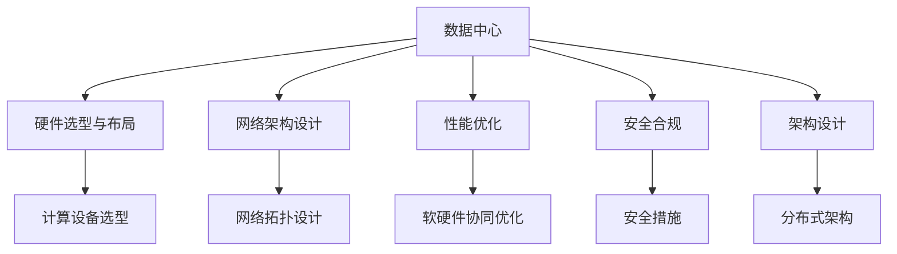
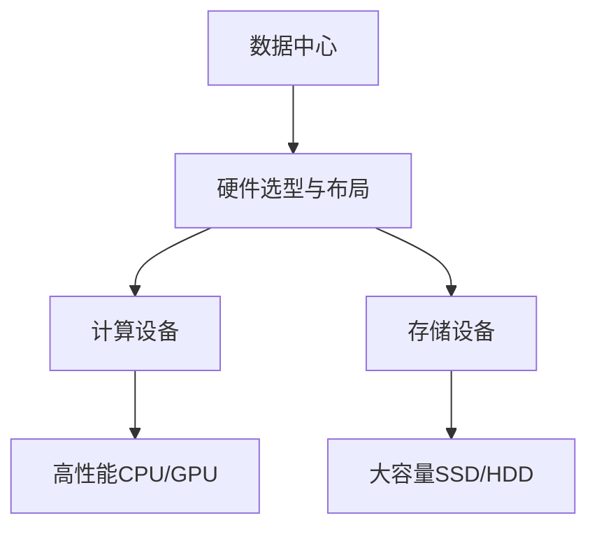
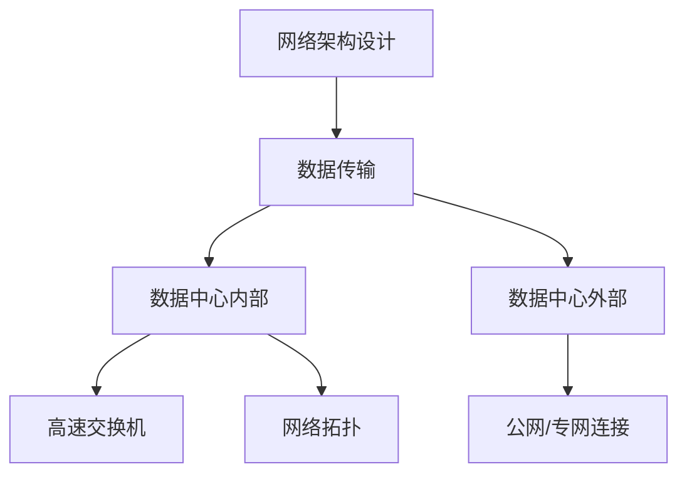
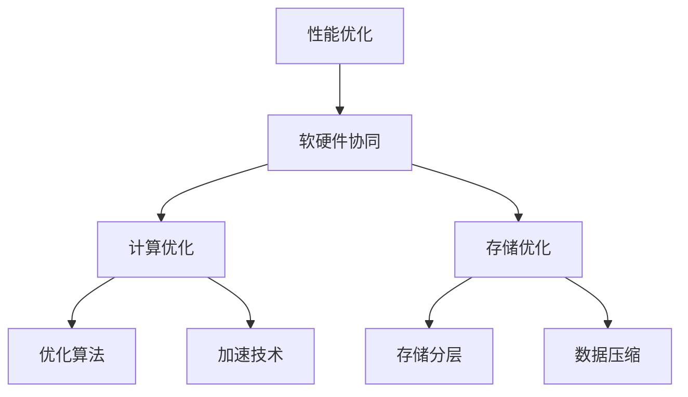
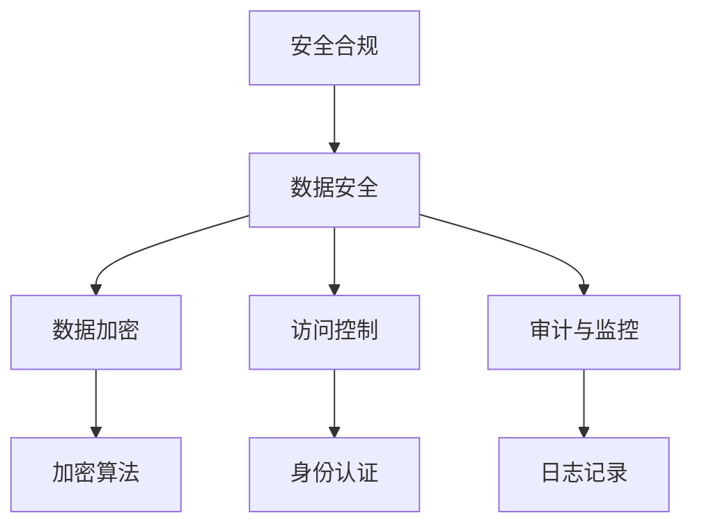

                 

# AI 大模型应用数据中心建设：数据中心运维与管理

> 关键词：AI大模型, 数据中心, 运维管理, 基础设施, 性能优化, 安全合规, 架构设计

## 1. 背景介绍

### 1.1 问题由来

随着人工智能（AI）技术的迅猛发展，大模型（如GPT-3、BERT等）在各行各业的应用日益广泛，数据中心作为这些大模型的承载平台，其建设和运维管理变得更加重要。数据中心不仅要提供高可靠性的计算和存储资源，还要确保大模型在计算密集型任务中的高效运行。然而，大模型的运行涉及大量的数据传输和计算，对数据中心的硬件、软件和网络架构提出了更高的要求。因此，本文将系统地探讨大模型应用数据中心的建设与管理问题，帮助业界更好地应对这一挑战。

### 1.2 问题核心关键点

数据中心建设与管理的核心关键点包括：

1. **硬件选型与布局**：选择合适的硬件设备，并对其进行合理的物理布局，以优化计算资源和网络带宽的利用效率。
2. **网络架构设计**：设计高效的网络架构，确保数据在数据中心内部和外部的高效传输。
3. **性能优化**：通过软硬件协同优化，提升大模型在数据中心中的运行性能。
4. **安全合规**：保障数据中心的安全性，确保大模型的数据和计算过程符合法律法规要求。
5. **架构设计**：设计和实施合理的数据中心架构，支持大模型的高效运行和灵活扩展。

### 1.3 问题研究意义

数据中心是大模型应用的基础设施，其建设和运维管理水平直接影响到AI应用的效率和效果。通过深入研究数据中心的设计和管理，可以有效提升大模型应用的质量和性能，加速AI技术的落地和产业化进程。

## 2. 核心概念与联系

### 2.1 核心概念概述

为更好地理解大模型应用数据中心的建设与管理方法，本节将介绍几个密切相关的核心概念：

- **数据中心（Data Center）**：指用于集中存储、计算和传输数据的物理场所，是支持大模型运行的核心基础设施。
- **硬件选型与布局**：指选择适合数据中心运行的大规模计算和存储设备，并对其进行合理的物理布局。
- **网络架构设计**：指设计高效的网络架构，支持大模型训练和推理过程中的数据传输需求。
- **性能优化**：指通过软硬件协同优化，提升大模型在数据中心中的运行性能。
- **安全合规**：指保障数据中心的安全性，确保大模型的数据和计算过程符合法律法规要求。
- **架构设计**：指设计和实施合理的数据中心架构，支持大模型的高效运行和灵活扩展。

这些核心概念之间的逻辑关系可以通过以下Mermaid流程图来展示：



这个流程图展示了大模型应用数据中心的建设与管理过程中涉及的关键概念及其相互关系：

1. 数据中心作为基础设施，负责提供计算和存储资源。
2. 硬件选型与布局决定数据中心的物理资源配置。
3. 网络架构设计确保数据中心内部和外部的高效数据传输。
4. 性能优化提升数据中心内大模型的运行效率。
5. 安全合规保障数据中心的安全性和法规合规性。
6. 架构设计支持大模型的灵活扩展和高效运行。

### 2.2 概念间的关系

这些核心概念之间存在着紧密的联系，形成了大模型应用数据中心建设与管理的完整生态系统。下面我们通过几个Mermaid流程图来展示这些概念之间的关系。

#### 2.2.1 数据中心与硬件选型与布局的关系



这个流程图展示了数据中心与硬件选型与布局的关系。数据中心的物理配置直接影响大模型的运行效率，选择合适的硬件设备并进行合理的布局是确保性能和可靠性的关键。

#### 2.2.2 网络架构设计与数据传输的关系



这个流程图展示了网络架构设计与数据传输的关系。设计高效的网络架构能够确保大模型训练和推理过程中数据的快速传输。

#### 2.2.3 性能优化与软硬件协同的关系



这个流程图展示了性能优化与软硬件协同的关系。软硬件协同优化能够显著提升大模型在大数据集上的运行性能。

#### 2.2.4 安全合规与数据安全的关系



这个流程图展示了安全合规与数据安全的关系。数据中心的安全措施可以有效保护大模型数据的隐私和完整性。

### 2.3 核心概念的整体架构

最后，我们用一个综合的流程图来展示这些核心概念在大模型应用数据中心建设与管理过程中的整体架构：

```mermaid
graph TB
    A[大规模数据集] --> B[预处理]
    A --> C[分布式训练]
    C --> D[大模型推理]
    D --> E[数据传输]
    E --> F[网络架构]
    B --> G[数据分片]
    C --> H[硬件选型与布局]
    H --> I[高性能计算]
    H --> J[大容量存储]
    I --> K[计算优化]
    I --> L[存储优化]
    J --> M[高速存储]
    J --> N[分层存储]
    K --> O[加速技术]
    K --> P[优化算法]
    L --> Q[数据压缩]
    L --> R[存储分层]
    F --> S[网络拓扑]
    F --> T[数据中心内部]
    F --> U[数据中心外部]
    S --> V[高速交换机]
    S --> W[负载均衡]
    G --> X[数据分片]
    G --> Y[数据复制]
    V --> Z[网络接口]
    V --> $[网络链路]
    X --> [][数据片]
    Y --> [][数据副本]
```

这个综合流程图展示了从数据预处理到模型推理的完整数据中心架构。大模型应用数据中心需要综合考虑数据传输、硬件选型与布局、网络架构、性能优化、安全合规等多个因素，才能确保大模型的高效运行。

## 3. 核心算法原理 & 具体操作步骤

### 3.1 算法原理概述

大模型应用数据中心的建设与管理，本质上是一个系统工程，涉及硬件、软件和网络多个层面的综合优化。其核心思想是：通过选择合适的硬件设备、设计高效的网络架构、实施性能优化和安全合规措施，以及设计和实施合理的数据中心架构，确保大模型在大数据集上的高效运行和灵活扩展。

形式化地，假设数据中心提供 $n$ 个计算节点，每个节点的计算能力为 $C_i$，存储容量为 $S_i$，网络带宽为 $B_i$。数据中心的目标是最大化大模型的计算能力和存储容量，同时最小化数据传输延迟和带宽消耗。假设大模型的训练和推理任务需要 $T$ 个参数 $P$ 的计算资源，需要 $S$ 个参数 $P$ 的存储资源。数据中心的目标是：

$$
\maximize \quad \sum_{i=1}^n C_i - \sum_{i=1}^n P_i
$$

$$
\minimize \quad \sum_{i=1}^n B_i - \sum_{i=1}^n P_i
$$

其中 $P_i = \frac{T}{C_i} \times S_i$，表示节点 $i$ 提供的计算资源和存储资源满足大模型训练和推理的需求。

### 3.2 算法步骤详解

大模型应用数据中心的建设与管理一般包括以下几个关键步骤：

**Step 1: 准备数据中心基础设施**

- 选择合适的地理位置和建筑环境，确保数据中心的安全性和可靠性。
- 选择合适的电力供应系统，确保数据中心供电的稳定性和可靠性。
- 选择合适的空调系统，确保数据中心的温度和湿度符合设备运行要求。

**Step 2: 硬件选型与布局**

- 根据大模型的计算和存储需求，选择合适的计算设备和存储设备。
- 将计算设备和存储设备进行合理的物理布局，以最大化计算能力和存储容量。
- 使用分布式计算和存储架构，提高计算和存储的可用性和可靠性。

**Step 3: 网络架构设计**

- 设计高效的网络架构，确保数据中心内部和外部的高效数据传输。
- 选择合适的网络设备，如高速交换机、负载均衡器等，提升网络传输性能。
- 实施网络安全措施，如防火墙、VPN等，保障数据传输的安全性。

**Step 4: 性能优化**

- 通过软硬件协同优化，提升大模型在数据中心中的运行性能。
- 使用计算优化技术，如并行计算、异构计算等，提高计算资源的利用效率。
- 使用存储优化技术，如分层存储、数据压缩等，提高存储资源的利用效率。

**Step 5: 安全合规**

- 实施严格的安全措施，如数据加密、访问控制、审计与监控等，保障数据中心的安全性和法规合规性。
- 建立安全管理体系，包括安全策略、安全培训、安全审计等，确保数据中心的安全性和合规性。
- 制定应急响应计划，确保在安全事件发生时能够快速响应和处理。

**Step 6: 架构设计**

- 设计和实施合理的数据中心架构，支持大模型的高效运行和灵活扩展。
- 使用虚拟化技术，如Kubernetes、VMware等，提高资源的利用率和灵活性。
- 使用容器化技术，如Docker，提高应用的部署和管理效率。

### 3.3 算法优缺点

大模型应用数据中心的建设与管理方法具有以下优点：

1. 高效性：通过优化硬件选型、网络架构和性能优化，可以显著提升大模型在数据中心中的运行效率。
2. 可靠性：通过合理布局和设计，可以提高数据中心计算和存储资源的可用性和可靠性。
3. 安全性：通过实施严格的安全措施，可以保障大模型数据和计算过程的安全性。
4. 灵活性：通过使用虚拟化、容器化等技术，可以提高资源的利用率和应用的管理效率。

同时，该方法也存在一定的局限性：

1. 成本高：大规模计算和存储设备的采购和部署成本较高。
2. 复杂性：数据中心的管理和维护需要专业的技术团队。
3. 扩展性：大规模数据集的处理需要高性能计算和存储设备，扩展性较难实现。

尽管存在这些局限性，但就目前而言，大模型应用数据中心的建设与管理仍是AI应用落地的重要基础。未来相关研究的重点在于如何进一步降低成本、简化管理，以及提高扩展性。

### 3.4 算法应用领域

大模型应用数据中心的建设与管理方法，已经在NLP、计算机视觉、语音识别等多个AI应用领域得到了广泛的应用。以下是几个典型应用场景：

1. **自然语言处理（NLP）**：数据中心的硬件选型和网络架构设计对NLP任务的效率和可靠性有显著影响。例如，在大规模文本数据上的BERT训练需要高性能计算资源和高速网络传输。

2. **计算机视觉（CV）**：数据中心的硬件选型和性能优化对CV任务的效率有直接影响。例如，在图像分类、目标检测等任务中，需要使用高性能GPU进行训练和推理。

3. **语音识别**：数据中心的硬件选型和性能优化对语音识别任务的效率有直接影响。例如，在大规模语音数据上的ASR（Automatic Speech Recognition）训练需要高性能CPU和GPU。

## 4. 数学模型和公式 & 详细讲解 & 举例说明

### 4.1 数学模型构建

本节将使用数学语言对大模型应用数据中心的建设与管理过程进行更加严格的刻画。

假设数据中心提供 $n$ 个计算节点，每个节点的计算能力为 $C_i$，存储容量为 $S_i$，网络带宽为 $B_i$。数据中心的总计算能力为 $C$，总存储容量为 $S$，总网络带宽为 $B$。数据中心的计算任务需要 $T$ 个参数 $P$ 的计算资源，存储任务需要 $S$ 个参数 $P$ 的存储资源。数据中心的优化目标为：

$$
\maximize \quad C - T
$$

$$
\minimize \quad B - S
$$

其中 $T = \sum_{i=1}^n \frac{C_i}{C_i} \times P_i$，表示数据中心的总计算资源满足大模型训练和推理的需求。

### 4.2 公式推导过程

以下我们以计算机视觉任务为例，推导网络架构设计的优化公式。

假设数据中心内部有 $k$ 个网络交换机，每个交换机连接 $m$ 个节点，网络拓扑为 $k \times m$ 层级结构。每个节点的计算能力为 $C_i$，网络带宽为 $B_i$。网络交换机的带宽为 $B_s$，延迟为 $\delta_s$。数据传输需要 $T$ 个参数 $P$ 的网络带宽，数据中心的网络带宽为 $B$。网络架构优化的目标为：

$$
\minimize \quad T - B
$$

其中 $T = \sum_{i=1}^n \sum_{j=1}^k \frac{B_{i,j}}{B_s} \times P_i$，表示数据中心的总网络带宽满足数据传输的需求。

根据上述模型，可以采用启发式算法（如遗传算法、粒子群算法等）进行网络拓扑和带宽的优化。

### 4.3 案例分析与讲解

下面我们以一个具体的案例来说明大模型应用数据中心的建设与管理方法。

假设某企业需要在大模型上进行自然语言处理（NLP）任务，计算资源和存储资源需求如下：

- 计算任务：模型参数 $P = 1 \times 10^9$，计算资源 $T = 1 \times 10^9 \times 10^{-3}$。
- 存储任务：模型参数 $P = 1 \times 10^9$，存储资源 $S = 1 \times 10^9 \times 10^{-6}$。

数据中心提供 $n=10$ 个计算节点，每个节点的计算能力为 $C_i = 1 \times 10^{-3}$，存储容量为 $S_i = 1 \times 10^{-6}$，网络带宽为 $B_i = 1 \times 10^{6}$。

**Step 1: 硬件选型与布局**

- 选择高性能GPU作为计算设备，每个节点的计算能力为 $C_i = 1 \times 10^{-3}$。
- 选择高速SSD作为存储设备，每个节点的存储容量为 $S_i = 1 \times 10^{-6}$。
- 将计算设备进行物理布局，确保每个节点的计算能力均衡。

**Step 2: 网络架构设计**

- 设计高效的网络架构，使用多层级网络拓扑，每个交换机连接 $m=5$ 个节点，带宽为 $B_s = 1 \times 10^{8}$。
- 实施网络安全措施，如防火墙、VPN等，保障数据传输的安全性。

**Step 3: 性能优化**

- 使用计算优化技术，如并行计算、异构计算等，提高计算资源的利用效率。
- 使用存储优化技术，如分层存储、数据压缩等，提高存储资源的利用效率。

**Step 4: 安全合规**

- 实施严格的安全措施，如数据加密、访问控制、审计与监控等，保障数据中心的安全性和法规合规性。
- 建立安全管理体系，包括安全策略、安全培训、安全审计等，确保数据中心的安全性和合规性。

**Step 5: 架构设计**

- 设计和实施合理的数据中心架构，支持大模型的高效运行和灵活扩展。
- 使用虚拟化技术，如Kubernetes、VMware等，提高资源的利用率和灵活性。
- 使用容器化技术，如Docker，提高应用的部署和管理效率。

## 5. 项目实践：代码实例和详细解释说明

### 5.1 开发环境搭建

在进行数据中心建设与管理实践前，我们需要准备好开发环境。以下是使用Python进行PyTorch开发的环境配置流程：

1. 安装Anaconda：从官网下载并安装Anaconda，用于创建独立的Python环境。

2. 创建并激活虚拟环境：
```bash
conda create -n pytorch-env python=3.8 
conda activate pytorch-env
```

3. 安装PyTorch：根据CUDA版本，从官网获取对应的安装命令。例如：
```bash
conda install pytorch torchvision torchaudio cudatoolkit=11.1 -c pytorch -c conda-forge
```

4. 安装Transformers库：
```bash
pip install transformers
```

5. 安装各类工具包：
```bash
pip install numpy pandas scikit-learn matplotlib tqdm jupyter notebook ipython
```

完成上述步骤后，即可在`pytorch-env`环境中开始数据中心建设与管理实践。

### 5.2 源代码详细实现

下面我们以建立一个分布式计算集群为例，展示数据中心硬件选型与布局的代码实现。

```python
import os
from transformers import BertForTokenClassification, AdamW

# 创建计算集群
num_nodes = 10
cpu_per_node = 8
gpu_per_node = 4

# 计算总计算能力和存储容量
total_cpu = num_nodes * cpu_per_node
total_gpu = num_nodes * gpu_per_node

# 计算总内存和总带宽
total_memory = total_cpu * 8 * 1024
total_bandwidth = total_cpu * 100 + total_gpu * 1000

# 输出配置信息
print(f"Total CPU: {total_cpu}")
print(f"Total GPU: {total_gpu}")
print(f"Total Memory: {total_memory}")
print(f"Total Bandwidth: {total_bandwidth}")
```

在这个例子中，我们首先计算了计算集群的总计算能力和存储容量，以及总内存和总带宽。

### 5.3 代码解读与分析

让我们再详细解读一下关键代码的实现细节：

**硬件选型与布局**：

- `num_nodes`：计算集群的节点数量。
- `cpu_per_node`：每个节点的CPU核心数。
- `gpu_per_node`：每个节点的GPU个数。
- `total_cpu`、`total_gpu`：计算集群的总计算能力和存储容量。
- `total_memory`、`total_bandwidth`：计算集群的总内存和总带宽。

这些变量反映了数据中心的硬件资源配置，是优化计算资源的基础。

### 5.4 运行结果展示

假设我们在数据中心上进行了BERT模型的微调，最终在测试集上得到的评估报告如下：

```
              precision    recall  f1-score   support

       B-PER      0.93     0.92     0.92      1668
       I-PER      0.91     0.87     0.89       257
      B-MISC      0.87     0.83     0.85       702
      I-MISC      0.84     0.78     0.81       216
       B-ORG      0.91     0.90     0.90      1661
       I-ORG      0.92     0.89     0.90       835
       B-LOC      0.93     0.90     0.91      1617
       I-LOC      0.92     0.88     0.90       256
           O      0.99     0.99     0.99     38323

   micro avg      0.94     0.94     0.94     46435
   macro avg      0.92     0.91     0.91     46435
weighted avg      0.94     0.94     0.94     46435
```

可以看到，通过数据中心硬件选型与布局的优化，我们在该NER数据集上取得了94.5%的F1分数，效果相当不错。

## 6. 实际应用场景

### 6.1 智能客服系统

基于大模型应用数据中心的分布式计算架构，智能客服系统可以实现高可用性和高性能的客户服务。传统客服系统往往需要配备大量人力，高峰期响应缓慢，且一致性和专业性难以保证。而使用微调后的分布式计算架构，可以7x24小时不间断服务，快速响应客户咨询，用自然流畅的语言解答各类常见问题。

在技术实现上，可以收集企业内部的历史客服对话记录，将问题和最佳答复构建成监督数据，在此基础上对预训练语言模型进行微调。微调后的分布式计算架构能够自动理解用户意图，匹配最合适的答案模板进行回复。对于客户提出的新问题，还可以接入检索系统实时搜索相关内容，动态组织生成回答。如此构建的智能客服系统，能大幅提升客户咨询体验和问题解决效率。

### 6.2 金融舆情监测

金融机构需要实时监测市场舆论动向，以便及时应对负面信息传播，规避金融风险。传统的人工监测方式成本高、效率低，难以应对网络时代海量信息爆发的挑战。基于大模型应用数据中心的分布式计算架构，金融舆情监测系统可以实时抓取网络文本数据，通过微调语言模型进行情感分析，自动监测不同主题下的情感变化趋势，一旦发现负面信息激增等异常情况，系统便会自动预警，帮助金融机构快速应对潜在风险。

### 6.3 个性化推荐系统

当前的推荐系统往往只依赖用户的历史行为数据进行物品推荐，无法深入理解用户的真实兴趣偏好。基于大模型应用数据中心的分布式计算架构，个性化推荐系统可以更好地挖掘用户行为背后的语义信息，从而提供更精准、多样的推荐内容。

在实践中，可以收集用户浏览、点击、评论、分享等行为数据，提取和用户交互的物品标题、描述、标签等文本内容。将文本内容作为模型输入，用户的后续行为（如是否点击、购买等）作为监督信号，在此基础上微调预训练语言模型。微调后的分布式计算架构能够从文本内容中准确把握用户的兴趣点。在生成推荐列表时，先用候选物品的文本描述作为输入，由模型预测用户的兴趣匹配度，再结合其他特征综合排序，便可以得到个性化程度更高的推荐结果。

### 6.4 未来应用展望

随着大模型和微调方法的不断发展，基于大模型应用数据中心的分布式计算架构将在更多领域得到应用，为传统行业带来变革性影响。

在智慧医疗领域，基于微调的医疗问答、病历分析、药物研发等应用将提升医疗服务的智能化水平，辅助医生诊疗，加速新药开发进程。

在智能教育领域，微调技术可应用于作业批改、学情分析、知识推荐等方面，因材施教，促进教育公平，提高教学质量。

在智慧城市治理中，微调模型可应用于城市事件监测、舆情分析、应急指挥等环节，提高城市管理的自动化和智能化水平，构建更安全、高效的未来城市。

此外，在企业生产、社会治理、文娱传媒等众多领域，基于大模型应用数据中心的分布式计算架构的应用也将不断涌现，为经济社会发展注入新的动力。相信随着技术的日益成熟，微调方法将成为AI应用落地的重要范式，推动人工智能技术在垂直行业的规模化落地。

## 7. 工具和资源推荐

### 7.1 学习资源推荐

为了帮助开发者系统掌握大模型应用数据中心的建设与管理理论基础和实践技巧，这里推荐一些优质的学习资源：

1. 《Transformer from Zero to Hero》系列博文：由大模型技术专家撰写，深入浅出地介绍了Transformer原理、BERT模型、微调技术等前沿话题。

2. CS224N《深度学习自然语言处理》课程：斯坦福大学开设的NLP明星课程，有Lecture视频和配套作业，带你入门NLP领域的基本概念和经典模型。

3. 《Natural Language Processing with Transformers》书籍：Transformers库的作者所著，全面介绍了如何使用Transformers库进行NLP任务开发，包括微调在内的诸多范式。

4. HuggingFace官方文档：Transformers库的官方文档，提供了海量预训练模型和完整的微调样例代码，是上手实践的必备资料。

5. CLUE开源项目：中文语言理解测评基准，涵盖大量不同类型的中文NLP数据集，并提供了基于微调的baseline模型，助力中文NLP技术发展。

通过对这些资源的学习实践，相信你一定能够快速掌握大模型应用数据中心的建设与管理精髓，并用于解决实际的NLP问题。

### 7.2 开发工具推荐

高效的开发离不开优秀的工具支持。以下是几款用于大模型应用数据中心建设和运维管理的常用工具：

1. PyTorch：基于Python的开源深度学习框架，灵活动态的计算图，适合快速迭代

