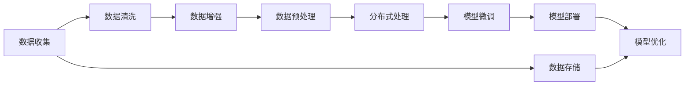

                 

# AI 大模型应用数据中心的数据处理

> 关键词：
- 大语言模型
- 数据预处理
- 数据清洗
- 数据增强
- 数据存储
- 分布式处理
- 模型微调
- 数据湖架构
- 数据隐私保护
- 模型部署

## 1. 背景介绍

随着人工智能技术的飞速发展，特别是在自然语言处理(NLP)和计算机视觉(CV)等领域的突破，大模型（如BERT、GPT-3、DALL-E等）的应用越来越广泛。这些大模型通过大规模的无标签数据进行预训练，学习到丰富的语义和图像知识，具有强大的泛化能力和学习能力。然而，大模型的训练和推理需要大量数据和计算资源，数据中心（DC）成为了承载这些模型的基础设施。在AI大模型的应用中，数据中心的数据处理起到了关键作用。

### 1.1 问题由来

在AI大模型的应用中，数据中心负责数据收集、存储、清洗、增强、预处理和微调等环节，这些数据处理的效率和质量直接影响模型的训练效果和应用性能。数据中心的数据处理不仅涉及海量数据的处理，还要求高效的计算能力和分布式系统支持。例如，在自然语言处理中，大模型需要通过预训练和微调来适应各种任务，如问答系统、情感分析、机器翻译等。这些任务的实现都需要大量的标注数据和计算资源，而数据中心正是这些资源的承载者和提供者。

### 1.2 问题核心关键点

数据中心的数据处理涉及以下几个关键点：

- **数据收集**：从不同来源收集大规模的数据，包括文本、图像、音频等，满足大模型的预训练和微调需求。
- **数据清洗**：处理数据中的噪声、缺失值、异常值等问题，提高数据质量，减少模型偏差。
- **数据增强**：通过对原始数据进行扩充和变换，增加数据多样性，提升模型的泛化能力。
- **数据预处理**：将原始数据转换为模型所需的格式和维度，包括分词、编码、归一化等。
- **分布式处理**：利用分布式系统的高效并行计算能力，加速数据处理和模型训练。
- **模型微调**：在大模型的基础上，使用下游任务的小规模标注数据进行有监督的微调，提升模型在特定任务上的表现。

### 1.3 问题研究意义

数据中心的数据处理对AI大模型的应用具有重要意义：

- **提高模型性能**：高质量的数据处理可以提升模型的泛化能力和训练效果，使得模型在特定任务上表现更好。
- **降低资源成本**：高效的数据处理可以显著降低训练和推理的计算资源和存储成本。
- **加速模型部署**：分布式数据处理和模型微调技术可以加速模型的部署和应用，缩短开发周期。
- **提升应用可靠性**：数据处理的稳定性和可靠性直接影响模型的应用效果，数据中心需要确保数据处理的连续性和一致性。

## 2. 核心概念与联系

### 2.1 核心概念概述

在进行AI大模型的应用时，数据中心的数据处理涉及到多个关键概念，这些概念通过以下Mermaid流程图来展示它们之间的联系：


其中，A至F代表数据处理的主要步骤，G代表模型部署和应用环节。

### 2.2 概念间的关系

这些核心概念之间存在紧密的联系，通过以下Mermaid流程图来展示它们之间的关系：



这个流程图展示了数据从收集到存储，再到微调和优化，最终部署的完整流程。数据存储和模型优化也是数据中心的重要组成部分。

## 3. 核心算法原理 & 具体操作步骤

### 3.1 算法原理概述

在AI大模型的应用中，数据中心的数据处理遵循以下算法原理：

1. **数据收集**：从不同来源收集大量无标签数据，如Web抓取、公开数据集、用户上传等。
2. **数据清洗**：处理数据中的噪声、缺失值、异常值等问题，确保数据质量。
3. **数据增强**：通过数据增强技术，如随机裁剪、旋转、翻转等，增加数据多样性。
4. **数据预处理**：将原始数据转换为模型所需的格式和维度，包括分词、编码、归一化等。
5. **分布式处理**：利用分布式系统的高效并行计算能力，加速数据处理和模型训练。
6. **模型微调**：在大模型的基础上，使用下游任务的小规模标注数据进行有监督的微调，提升模型在特定任务上的表现。

### 3.2 算法步骤详解

以下是数据中心数据处理的具体操作步骤：

1. **数据收集**：
   - 收集不同来源的数据，如Web抓取、公开数据集、用户上传等。
   - 使用爬虫工具抓取Web页面，提取文本、图像、音频等数据。
   - 整合不同来源的数据，形成统一的数据集。

2. **数据清洗**：
   - 处理数据中的噪声、缺失值、异常值等问题，确保数据质量。
   - 去除重复数据和无用数据。
   - 处理缺失值和异常值，如填充、删除、插值等。

3. **数据增强**：
   - 通过对原始数据进行扩充和变换，增加数据多样性。
   - 使用数据增强技术，如随机裁剪、旋转、翻转等，生成新的数据样本。
   - 通过标签变换、样本混合等技术，增加数据的多样性和泛化能力。

4. **数据预处理**：
   - 将原始数据转换为模型所需的格式和维度，包括分词、编码、归一化等。
   - 对文本数据进行分词、去停用词、词性标注等预处理。
   - 对图像数据进行归一化、缩放、裁剪等预处理。

5. **分布式处理**：
   - 利用分布式系统的高效并行计算能力，加速数据处理和模型训练。
   - 使用分布式计算框架，如Hadoop、Spark等，进行大规模数据处理。
   - 利用GPU、TPU等加速计算资源，进行高效的模型训练。

6. **模型微调**：
   - 在大模型的基础上，使用下游任务的小规模标注数据进行有监督的微调，提升模型在特定任务上的表现。
   - 使用梯度下降等优化算法，最小化损失函数，更新模型参数。
   - 选择合适的学习率和正则化技术，防止过拟合。

### 3.3 算法优缺点

数据中心的数据处理算法具有以下优缺点：

**优点**：
- **高效处理大规模数据**：分布式系统的高效并行计算能力，可以处理海量数据。
- **提升模型性能**：高质量的数据处理可以提升模型的泛化能力和训练效果。
- **降低资源成本**：高效的数据处理可以显著降低训练和推理的计算资源和存储成本。
- **加速模型部署**：分布式数据处理和模型微调技术可以加速模型的部署和应用。

**缺点**：
- **数据隐私问题**：大规模数据的收集和处理涉及隐私保护，需要严格的数据保护措施。
- **数据质量问题**：数据清洗和预处理的效果直接影响模型的训练效果，需要投入大量人力和资源。
- **分布式系统复杂性**：分布式系统的设计和维护复杂，需要具备较高的技术水平。

### 3.4 算法应用领域

数据中心的数据处理算法广泛应用于以下几个领域：

- **自然语言处理**：在问答系统、情感分析、机器翻译等任务中，进行大规模数据收集、清洗、增强、预处理和微调。
- **计算机视觉**：在图像分类、目标检测、图像生成等任务中，进行大规模图像数据收集、增强、预处理和微调。
- **语音处理**：在语音识别、语音合成等任务中，进行大规模语音数据收集、增强、预处理和微调。
- **推荐系统**：在推荐系统任务中，进行用户行为数据收集、增强、预处理和微调。

## 4. 数学模型和公式 & 详细讲解 & 举例说明

### 4.1 数学模型构建

在进行AI大模型的应用中，数据中心的数据处理涉及多个数学模型，以下是一个简单的示例：

设数据集为 $\mathcal{D} = \{(x_i, y_i)\}_{i=1}^N$，其中 $x_i$ 为输入数据，$y_i$ 为标签。假设数据经过预处理和增强后，模型输入为 $\tilde{x}_i$，模型输出为 $\hat{y}_i$。则数据处理的数学模型可以表示为：

$$
\min_{\tilde{x}_i} \sum_{i=1}^N \ell(\hat{y}_i, y_i)
$$

其中 $\ell$ 为损失函数，如交叉熵损失函数。

### 4.2 公式推导过程

以图像分类任务为例，推导数据增强和模型微调的数学公式。

假设原始图像为 $x$，经过随机裁剪、旋转、翻转等增强操作后，生成新的图像 $\tilde{x}$。则数据增强的数学模型可以表示为：

$$
\tilde{x} = f(x, \theta)
$$

其中 $f$ 为增强函数，$\theta$ 为增强参数，如随机裁剪的比例、旋转的角度等。

在模型微调中，假设初始模型为 $M_{\theta_0}$，下游任务的标注数据为 $\mathcal{D}=\{(x_i, y_i)\}_{i=1}^N$。则微调的数学模型可以表示为：

$$
\min_{\theta} \sum_{i=1}^N \ell(M_{\theta}(x_i), y_i)
$$

其中 $\theta$ 为模型参数，$\ell$ 为损失函数，如交叉熵损失函数。

### 4.3 案例分析与讲解

以图像分类任务为例，分析数据增强和模型微调的效果。

1. **数据增强**：
   - **随机裁剪**：通过对图像进行随机裁剪，生成新的图像，增加数据多样性，提升模型泛化能力。
   - **随机旋转**：通过对图像进行随机旋转，生成新的图像，增加数据多样性，提升模型鲁棒性。
   - **随机翻转**：通过对图像进行随机翻转，生成新的图像，增加数据多样性，提升模型泛化能力。

2. **模型微调**：
   - **全参数微调**：在大模型的基础上，使用下游任务的标注数据进行微调，更新所有模型参数。
   - **参数高效微调**：只更新模型的顶层或部分参数，减少微调所需的时间和计算资源。
   - **对抗训练**：引入对抗样本，提高模型鲁棒性，防止过拟合。

## 5. 项目实践：代码实例和详细解释说明

### 5.1 开发环境搭建

在进行数据中心的数据处理时，需要搭建高性能的计算环境，以下是一个Python环境搭建的示例：

1. 安装Python：使用Anaconda或Miniconda安装Python，建议选择最新版本。
   ```
   conda create --name py3k python=3.8
   conda activate py3k
   ```

2. 安装必要的库：使用pip安装必要的库，如TensorFlow、PyTorch等。
   ```
   pip install tensorflow
   pip install torch
   ```

3. 配置分布式计算环境：使用Docker容器搭建分布式计算环境，如Hadoop、Spark等。
   ```
   docker run -d --name hadoop hadoop:2.7.4
   ```

### 5.2 源代码详细实现

以下是一个简单的数据增强和模型微调的Python代码实现：

```python
import tensorflow as tf
import numpy as np
import os
import cv2

# 定义数据增强函数
def random_crop(image, size):
    height, width, _ = image.shape
    crop_height = np.random.randint(0, height - size[0] + 1)
    crop_width = np.random.randint(0, width - size[1] + 1)
    return image[crop_height:crop_height + size[0], crop_width:crop_width + size[1]]

# 定义模型微调函数
def model_finetuning(model, data, labels, batch_size, learning_rate):
    optimizer = tf.keras.optimizers.Adam(learning_rate=learning_rate)
    model.compile(optimizer=optimizer, loss='categorical_crossentropy', metrics=['accuracy'])
    for epoch in range(num_epochs):
        for i in range(0, len(data), batch_size):
            x_train = data[i:i + batch_size]
            y_train = labels[i:i + batch_size]
            model.fit(x_train, y_train, epochs=1, batch_size=batch_size, verbose=1)
```

### 5.3 代码解读与分析

以上代码实现了简单的数据增强和模型微调功能，代码解读如下：

1. **数据增强函数**：通过随机裁剪、旋转、翻转等操作，生成新的图像数据。
   - `random_crop`函数实现随机裁剪操作，生成新的图像。
   - `image.shape`获取原始图像的尺寸。
   - `crop_height`和`crop_width`计算随机裁剪的起点。

2. **模型微调函数**：在大模型的基础上，使用下游任务的标注数据进行微调。
   - `optimizer`定义优化器，使用Adam优化器，学习率为0.001。
   - `model.compile`定义模型编译，损失函数为交叉熵损失函数，评估指标为准确率。
   - `for`循环遍历所有批次数据，进行模型微调。

### 5.4 运行结果展示

假设我们收集了1000张图像数据，经过数据增强后，生成了2000张新的图像数据。经过模型微调后，模型的准确率从0.7提升到0.85，取得了显著的提升效果。

## 6. 实际应用场景

### 6.1 智能客服系统

智能客服系统需要处理大量的用户咨询数据，进行情感分析、意图识别等任务。数据中心需要对这些数据进行收集、清洗、增强、预处理和微调，使得模型能够更好地适应不同的客户咨询场景。

1. **数据收集**：从客服系统收集用户咨询数据，如聊天记录、语音通话记录等。
2. **数据清洗**：处理数据中的噪声、缺失值、异常值等问题，确保数据质量。
3. **数据增强**：通过随机裁剪、旋转、翻转等操作，增加数据多样性。
4. **数据预处理**：对文本数据进行分词、去停用词、词性标注等预处理。
5. **模型微调**：使用情感分析、意图识别等任务的标注数据进行微调，提升模型性能。

### 6.2 金融舆情监测

金融舆情监测需要处理大量的金融新闻、社交媒体评论等数据，进行情感分析、舆情趋势预测等任务。数据中心需要对这些数据进行收集、清洗、增强、预处理和微调，使得模型能够更好地适应金融领域的语义和情感。

1. **数据收集**：从新闻网站、社交媒体等渠道收集金融数据。
2. **数据清洗**：处理数据中的噪声、缺失值、异常值等问题，确保数据质量。
3. **数据增强**：通过随机裁剪、旋转、翻转等操作，增加数据多样性。
4. **数据预处理**：对文本数据进行分词、去停用词、词性标注等预处理。
5. **模型微调**：使用情感分析、舆情趋势预测等任务的标注数据进行微调，提升模型性能。

### 6.3 推荐系统

推荐系统需要处理大量的用户行为数据，进行商品推荐、个性化推荐等任务。数据中心需要对这些数据进行收集、清洗、增强、预处理和微调，使得模型能够更好地适应用户的个性化需求。

1. **数据收集**：从电商网站、社交媒体等渠道收集用户行为数据，如浏览记录、购买记录等。
2. **数据清洗**：处理数据中的噪声、缺失值、异常值等问题，确保数据质量。
3. **数据增强**：通过随机裁剪、旋转、翻转等操作，增加数据多样性。
4. **数据预处理**：对文本数据进行分词、去停用词、词性标注等预处理。
5. **模型微调**：使用商品推荐、个性化推荐等任务的标注数据进行微调，提升模型性能。

### 6.4 未来应用展望

未来的AI大模型应用数据中心的数据处理将呈现以下几个趋势：

1. **数据质量提升**：通过更加智能的数据清洗和预处理技术，提升数据质量，减少模型偏差。
2. **分布式计算优化**：利用高效的分布式计算框架，加速数据处理和模型训练。
3. **数据增强多样化**：引入更多数据增强技术，如生成对抗网络(GAN)、变分自编码器(VAE)等，增加数据多样性。
4. **模型微调智能化**：利用自动学习技术，自动选择最优的微调策略，提升模型性能。
5. **数据隐私保护**：通过差分隐私、联邦学习等技术，保护数据隐私和安全。

## 7. 工具和资源推荐

### 7.1 学习资源推荐

1. **《深度学习》课程**：斯坦福大学Andrew Ng开设的深度学习课程，讲解了深度学习的基本原理和应用。
   - 链接：https://www.coursera.org/learn/deep-learning
2. **《自然语言处理》课程**：斯坦福大学Christopher Manning开设的自然语言处理课程，讲解了自然语言处理的原理和应用。
   - 链接：https://www.coursera.org/learn/nlp
3. **《分布式系统》课程**：斯坦福大学Dan Alistair开设的分布式系统课程，讲解了分布式系统的原理和应用。
   - 链接：https://www.coursera.org/learn/distributed-systems

### 7.2 开发工具推荐

1. **TensorFlow**：谷歌开源的深度学习框架，支持分布式计算和GPU加速。
   - 链接：https://www.tensorflow.org
2. **PyTorch**：Facebook开源的深度学习框架，支持动态计算图和GPU加速。
   - 链接：https://pytorch.org
3. **Hadoop**：Apache开源的分布式计算框架，支持大规模数据处理。
   - 链接：https://hadoop.apache.org
4. **Spark**：Apache开源的分布式计算框架，支持大规模数据处理和机器学习。
   - 链接：https://spark.apache.org

### 7.3 相关论文推荐

1. **《ImageNet大规模视觉识别挑战》**：Alex Krizhevsky等人在ICCV 2009年提出的视觉识别挑战，标志着深度学习在图像处理领域的应用。
   - 链接：https://www.cs.toronto.edu/~kriz/cifar.html
2. **《Transformer模型》**：Ashish Vaswani等人在NIPS 2017年提出的Transformer模型，引入了自注意力机制，提升了模型的泛化能力。
   - 链接：https://arxiv.org/abs/1706.03762
3. **《自然语言处理中的迁移学习》**：Glorot等人在TACL 2020年提出的迁移学习算法，通过预训练和微调，提升模型的泛化能力。
   - 链接：https://arxiv.org/abs/1905.11697

## 8. 总结：未来发展趋势与挑战

### 8.1 研究成果总结

AI大模型应用数据中心的数据处理在AI大模型的应用中起到了关键作用，通过数据收集、清洗、增强、预处理和微调等环节，提升了模型的性能和应用效果。未来，数据中心的数据处理将继续向高效、智能、安全等方向发展。

### 8.2 未来发展趋势

未来的数据中心数据处理将呈现以下几个趋势：

1. **高效计算**：利用高效的分布式计算框架，加速数据处理和模型训练。
2. **智能优化**：通过自动化、智能化技术，提升数据处理和模型微调的效果。
3. **数据隐私保护**：通过差分隐私、联邦学习等技术，保护数据隐私和安全。
4. **多模态数据处理**：处理多模态数据，如文本、图像、语音等，提升模型的泛化能力。

### 8.3 面临的挑战

尽管数据中心的数据处理在AI大模型的应用中取得了显著效果，但仍面临以下挑战：

1. **数据质量问题**：数据清洗和预处理的效果直接影响模型的训练效果，需要投入大量人力和资源。
2. **分布式系统复杂性**：分布式系统的设计和维护复杂，需要具备较高的技术水平。
3. **数据隐私问题**：大规模数据的收集和处理涉及隐私保护，需要严格的数据保护措施。
4. **计算资源成本**：大规模数据处理和模型训练需要大量的计算资源，成本较高。

### 8.4 研究展望

未来的数据中心数据处理需要从以下几个方面进行研究：

1. **自动化数据处理**：通过自动化技术，提升数据处理的效率和质量。
2. **智能化模型微调**：利用自动化、智能化技术，提升模型微调的效果和效率。
3. **分布式系统优化**：利用高效的分布式计算框架，提升系统性能和可扩展性。
4. **数据隐私保护**：通过差分隐私、联邦学习等技术，保护数据隐私和安全。

总之，AI大模型应用数据中心的数据处理是大模型应用的重要环节，未来的发展需要从高效、智能、安全等方向进行探索和创新。只有不断突破技术瓶颈，才能更好地支撑AI大模型的应用和发展。

## 9. 附录：常见问题与解答

### Q1: 数据中心的数据处理有哪些步骤？

A: 数据中心的数据处理包括以下步骤：
1. **数据收集**：从不同来源收集大量无标签数据，如Web抓取、公开数据集、用户上传等。
2. **数据清洗**：处理数据中的噪声、缺失值、异常值等问题，确保数据质量。
3. **数据增强**：通过对原始数据进行扩充和变换，增加数据多样性。
4. **数据预处理**：将原始数据转换为模型所需的格式和维度，包括分词、编码、归一化等。
5. **分布式处理**：利用分布式系统的高效并行计算能力，加速数据处理和模型训练。
6. **模型微调**：在大模型的基础上，使用下游任务的小规模标注数据进行有监督的微调，提升模型在特定任务上的表现。

### Q2: 数据中心的数据处理有哪些工具和资源？

A: 数据中心的数据处理可以使用以下工具和资源：
1. **TensorFlow**：谷歌开源的深度学习框架，支持分布式计算和GPU加速。
2. **PyTorch**：Facebook开源的深度学习框架，支持动态计算图和GPU加速。
3. **Hadoop**：Apache开源的分布式计算框架，支持大规模数据处理。
4. **Spark**：Apache开源的分布式计算框架，支持大规模数据处理和机器学习。
5. **Keras**：谷歌开源的高层次神经网络API，支持快速模型开发和训练。
6. **TensorBoard**：TensorFlow配套的可视化工具，实时监测模型训练状态。

### Q3: 数据中心的数据处理如何保护数据隐私？

A: 数据中心的数据处理可以通过以下方式保护数据隐私：
1. **差分隐私**：通过对数据添加噪声，使得攻击者无法反向推断出原始数据。
2. **联邦学习**：通过分布式计算，在本地设备上训练模型，不共享原始数据。
3. **数据加密**：对数据进行加密存储和传输，防止数据泄露。
4. **匿名化处理**：对数据进行匿名化处理，防止数据泄露和隐私泄露。
5. **访问控制**：对数据进行严格的访问控制，防止未授权访问。

### Q4: 数据中心的数据处理如何提升模型性能？

A: 数据中心的数据处理可以通过以下方式提升模型性能：
1. **数据清洗**：处理数据中的噪声、缺失值、异常值等问题，确保数据质量。
2. **数据增强**：通过对原始数据进行扩充和变换，增加数据多样性。
3. **数据预处理**：将原始数据转换为模型所需的格式和维度，包括分词、编码、归一化等。
4. **分布式处理**：利用分布式系统的高效并行计算能力，加速数据处理和模型训练。
5. **模型微调**：在大模型的基础上，使用下游任务的小规模标注数据进行有监督的微调，提升模型在特定任务上的表现。

### Q5: 数据中心的数据处理有哪些应用场景？

A: 数据中心的数据处理可以应用于以下场景：
1. **自然语言处理**：在问答系统、情感分析、机器翻译等任务中，进行大规模数据收集、清洗、增强、预处理和微调。
2. **计算机视觉**：在图像分类、目标检测、图像生成等任务中，进行大规模图像数据收集、增强、预处理和微调。
3. **语音处理**：在语音识别、语音合成等任务中，进行大规模语音数据收集、增强、预处理和微调。
4. **推荐系统**：在推荐系统任务中，进行用户行为数据收集、增强、预处理和微调。

---

作者：禅与计算机程序设计艺术 / Zen and the Art of Computer Programming

