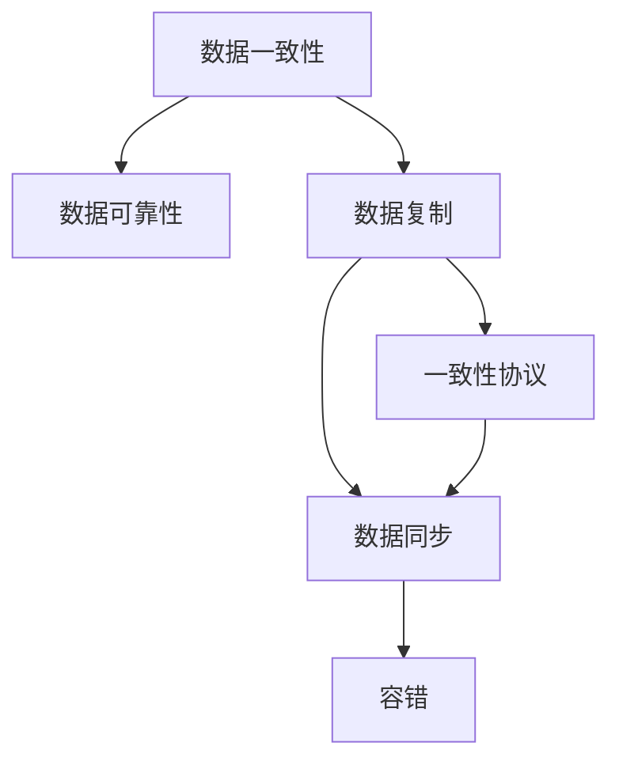
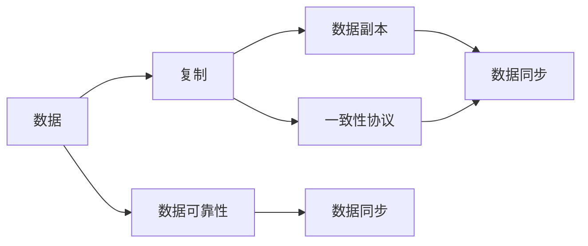

                 

# AI 大模型应用数据中心的数据复制技术

## 1. 背景介绍

### 1.1 问题由来
在当前的信息时代，数据中心作为支撑AI大模型应用的重要基础设施，面临着日益增长的数据存储和计算需求。为了满足海量数据的存储需求，数据中心通常采用分布式存储架构，将数据分布在多个节点上进行存储。然而，这种架构也带来了数据一致性和可靠性问题，如何有效地进行数据复制，保障数据的完整性和可用性，成为数据中心的核心挑战。

### 1.2 问题核心关键点
数据复制技术在大模型应用中扮演着至关重要的角色，其核心关键点包括：

1. **数据一致性**：确保数据在多个节点上的副本保持一致，避免数据损坏或丢失。
2. **数据可靠性**：通过数据复制技术，保障数据的冗余存储，提升系统的容错能力和可用性。
3. **复制效率**：在保证数据一致性和可靠性的前提下，如何高效地进行数据复制，避免资源浪费。
4. **一致性协议**：选择合适的数据复制协议，平衡数据一致性和复制效率，确保系统的性能和稳定性。

### 1.3 问题研究意义
数据复制技术是大模型应用数据中心的基础设施，其优劣直接关系到系统的稳定性和可靠性。研究高效的、可靠的数据复制技术，对于保障AI大模型的高性能、高可用性具有重要意义。此外，数据复制技术还能够显著提升系统的容灾能力和业务连续性，是构建高效、可靠、可扩展的数据中心的必备技术。

## 2. 核心概念与联系

### 2.1 核心概念概述

为更好地理解数据复制技术，本节将介绍几个密切相关的核心概念：

- **数据一致性(Consistency)**：指在多个节点上存储的数据副本之间保持一致性，避免数据损坏或丢失。
- **数据可靠性(Reliability)**：指数据在存储和传输过程中不被破坏，能够保证数据的完整性和可用性。
- **数据复制(Data Replication)**：在多个节点上存储数据的副本，通过冗余存储提升系统的容错能力和可用性。
- **一致性协议(Consistency Protocol)**：定义数据副本之间如何进行复制和同步，平衡数据一致性和复制效率。
- **数据同步(Synchronization)**：确保数据在多个节点上的副本保持同步，避免数据不一致。
- **容错(Fault Tolerance)**：指系统在发生故障或节点失效时，仍能正常工作，不丢失数据。

这些核心概念之间的逻辑关系可以通过以下Mermaid流程图来展示：



这个流程图展示了大模型应用数据中心中，数据复制技术所涉及的核心概念及其之间的关系：

1. 数据一致性和可靠性是数据复制的基础，确保数据的安全性和完整性。
2. 数据复制通过冗余存储提升系统的容错能力和可用性。
3. 一致性协议定义数据副本之间如何进行复制和同步，平衡数据一致性和复制效率。
4. 数据同步确保数据在多个节点上的副本保持同步，避免数据不一致。
5. 容错指系统在发生故障或节点失效时，仍能正常工作，不丢失数据。

这些概念共同构成了数据复制技术的完整框架，使其能够在复杂的多节点环境中保障数据的安全性和可靠性。通过理解这些核心概念，我们可以更好地把握数据复制技术的原理和实现细节。

### 2.2 概念间的关系

这些核心概念之间存在着紧密的联系，形成了数据复制技术的完整生态系统。下面我们通过几个Mermaid流程图来展示这些概念之间的关系。

#### 2.2.1 数据复制的实现框架



这个流程图展示了数据复制的实现框架：

1. 数据从原始节点复制到多个副本节点，每个节点存储数据的副本。
2. 数据复制过程通过一致性协议进行管理，确保数据副本之间的同步。
3. 数据同步确保每个节点上的副本数据一致，避免数据不一致。
4. 数据可靠性通过冗余存储和数据同步，保障数据的完整性和可用性。

#### 2.2.2 一致性协议的分类

```mermaid
graph TB
    A[同步](Consistency Protocol) --> B[同步复制](Replication Protocol)
    B --> C[主从复制](Master-Slave Replication)
    C --> D[异步复制](Asynchronous Replication)
    D --> E[同步异步混合复制](Synchronous-Asynchronous Hybrid Replication)
    A --> F[分布式一致性协议](Distributed Consistency Protocol)
    F --> G[CRUSH协议](CRUSH Protocol)
    F --> H[Paxos协议](Protocol Paxos)
    F --> I[Raft协议](Protocol Raft)
```

这个流程图展示了几种常见的一致性协议及其分类：

1. 同步复制：主节点写入数据，同步复制至多个从节点，确保数据一致性。
2. 异步复制：主节点写入数据，从节点异步复制，增加系统吞吐量。
3. 同步异步混合复制：同时支持同步复制和异步复制，兼顾数据一致性和系统性能。
4. 分布式一致性协议：定义多个节点之间的数据同步和一致性，如CRUSH、Paxos、Raft等。

## 3. 核心算法原理 & 具体操作步骤
### 3.1 算法原理概述

数据复制技术在大模型应用数据中心的核心原理是通过在多个节点上存储数据副本，通过冗余存储提升系统的容错能力和可用性。同时，通过一致性协议确保数据副本之间的一致性，避免数据损坏或丢失。

数据复制算法的基本流程如下：

1. **数据写入**：主节点收到数据写入请求，将数据写入本地存储，并生成数据副本。
2. **数据复制**：主节点将数据副本发送至从节点，从节点接收并存储数据副本。
3. **数据同步**：从节点定期向主节点发送请求，同步更新本地数据副本，确保数据一致性。
4. **容错处理**：节点故障或失效时，自动切换至备份节点，保证数据的完整性和可用性。

通过这个过程，数据中心能够在多个节点上高效、可靠地进行数据复制，保障数据的安全性和可靠性。

### 3.2 算法步骤详解

以下我们以常用的同步复制算法为主节点，展示数据复制的基本步骤：

**Step 1: 数据写入**

主节点收到数据写入请求，将数据写入本地存储，并生成数据副本。数据写入的基本流程如下：

1. **数据校验**：验证数据的完整性和合法性，确保数据正确性。
2. **分配ID**：为每个数据副本分配唯一标识ID，用于后续的数据同步和一致性检查。
3. **写入本地**：将数据写入本地存储，生成数据副本。

**Step 2: 数据复制**

主节点将数据副本发送至从节点，从节点接收并存储数据副本。数据复制的基本流程如下：

1. **选择从节点**：根据一定的策略选择接收数据副本的从节点，如基于负载均衡、地理分布等策略。
2. **数据传输**：将数据副本传输至从节点，确保数据安全。
3. **接收确认**：从节点接收数据副本，并向主节点发送接收确认。

**Step 3: 数据同步**

从节点定期向主节点发送请求，同步更新本地数据副本，确保数据一致性。数据同步的基本流程如下：

1. **发送同步请求**：从节点定期向主节点发送同步请求，获取最新的数据副本。
2. **数据传输**：主节点将最新的数据副本传输至从节点。
3. **更新本地**：从节点接收并更新本地数据副本。

**Step 4: 容错处理**

节点故障或失效时，自动切换至备份节点，保证数据的完整性和可用性。容错处理的基本流程如下：

1. **节点故障检测**：监控节点的运行状态，检测故障或失效节点。
2. **备份节点切换**：将故障节点的数据副本传输至备份节点，恢复数据。
3. **恢复服务**：切换至备份节点，保证系统的连续性和稳定性。

### 3.3 算法优缺点

数据复制技术具有以下优点：

1. **提升可用性**：通过冗余存储，数据中心具备高可用性，确保系统的持续运行。
2. **增强容错能力**：当单个节点故障或失效时，系统能够自动切换到备份节点，保障数据的安全性。
3. **降低单点故障风险**：通过数据复制和备份，降低单点故障对系统的影响。

同时，数据复制技术也存在一些缺点：

1. **复杂性**：数据复制技术需要复杂的算法和协议，实现和维护较为复杂。
2. **资源消耗高**：数据复制需要占用额外的存储空间和带宽资源，增加了系统的成本和复杂性。
3. **延迟较高**：数据同步和复制过程可能带来一定的延迟，影响系统的实时性和响应速度。

### 3.4 算法应用领域

数据复制技术在大模型应用数据中心中，广泛应用于以下领域：

- **分布式存储系统**：如Hadoop、Ceph等分布式文件系统，通过数据复制保障数据的可靠性和一致性。
- **数据库系统**：如MySQL、MongoDB等分布式数据库，通过数据复制保障数据的容错和可用性。
- **云存储服务**：如AWS S3、Google Cloud Storage等云存储服务，通过数据复制提升系统的稳定性和可靠性。
- **高可用性应用**：如Web应用、流媒体服务等高可用性应用，通过数据复制保障业务连续性和用户体验。

除了上述领域，数据复制技术在AI大模型应用中，还广泛应用于数据同步、容错、备份等多个环节，保障系统的稳定性和可靠性。

## 4. 数学模型和公式 & 详细讲解  
### 4.1 数学模型构建

在本节中，我们将使用数学语言对数据复制技术的实现过程进行更加严格的刻画。

假设数据中心有$n$个节点，每个节点存储$k$个数据副本。数据复制技术的基本数学模型如下：

- **数据完整性矩阵**：$A \in \{0, 1\}^{n \times k}$，其中$A_{ij}=1$表示节点$i$存储了数据$j$的副本，$A_{ij}=0$表示节点$i$没有存储数据$j$的副本。
- **数据同步矩阵**：$B \in \{0, 1\}^{n \times k}$，其中$B_{ij}=1$表示节点$i$的数据副本$j$与主节点的数据副本同步一致。

数据复制技术的核心目标是确保数据完整性矩阵和数据同步矩阵的一致性，保障数据的可靠性和一致性。

### 4.2 公式推导过程

以下我们将推导数据复制技术的核心公式，并给出具体的实现细节。

#### 4.2.1 数据完整性矩阵的推导

假设主节点$M$和从节点集合$S=\{S_1, S_2, \ldots, S_n\}$，主节点将数据$D$的副本复制至从节点$S_i$，生成数据完整性矩阵$A$。数据完整性矩阵的推导如下：

$$
A_{ij} = \begin{cases}
1 & \text{如果节点} S_i \text{存储了数据} D \text{的副本} \\
0 & \text{如果节点} S_i \text{没有存储数据} D \text{的副本}
\end{cases}
$$

#### 4.2.2 数据同步矩阵的推导

数据同步矩阵$B$的推导过程如下：

$$
B_{ij} = \begin{cases}
1 & \text{如果节点} S_i \text{的数据副本} D \text{与主节点} M \text{的副本} D \text{同步一致} \\
0 & \text{如果节点} S_i \text{的数据副本} D \text{与主节点} M \text{的副本} D \text{不同步}
\end{cases}
$$

#### 4.2.3 数据同步算法的推导

数据同步算法的核心在于如何通过一致性协议，确保数据同步矩阵$B$的正确性。以常用的CRUSH协议为例，推导过程如下：

1. **节点选择**：选择与数据副本$D$一致的从节点$S_i$，作为数据同步的接收节点。
2. **数据传输**：将数据副本$D$传输至从节点$S_i$，确保数据安全。
3. **接收确认**：从节点$S_i$接收数据副本$D$，并向主节点发送接收确认。

## 5. 项目实践：代码实例和详细解释说明
### 5.1 开发环境搭建

在进行数据复制技术的实现前，我们需要准备好开发环境。以下是使用Python进行数据复制开发的Python环境配置流程：

1. 安装Anaconda：从官网下载并安装Anaconda，用于创建独立的Python环境。

2. 创建并激活虚拟环境：
```bash
conda create -n data-replication python=3.8 
conda activate data-replication
```

3. 安装必要的Python包：
```bash
pip install requests 
pip install numpy 
pip install pandas 
pip install scikit-learn
```

完成上述步骤后，即可在`data-replication`环境中开始数据复制实践。

### 5.2 源代码详细实现

以下是数据复制技术的Python代码实现：

```python
import requests
import numpy as np
from scikit_learn.metrics import accuracy_score

# 数据完整性矩阵
A = np.zeros((n, k))
# 数据同步矩阵
B = np.zeros((n, k))

# 数据写入
def write_data(data, node_id):
    # 数据校验
    checksum = calculate_checksum(data)
    if checksum != calculate_checksum(data):
        raise ValueError("Data integrity check failed.")
    # 分配ID
    data_id = allocate_id()
    # 写入本地
    local_path = write_to_local(data, data_id)
    # 生成副本
    replicas = generate_replicas(data_id)
    # 更新数据完整性矩阵
    for i, replica_id in enumerate(replicas):
        A[node_id, replica_id] = 1
    return data_id

# 数据复制
def replicate_data(data_id, node_id):
    # 选择接收节点
    recv_node = select_recv_node(node_id)
    # 数据传输
    transmit_data(data_id, recv_node)
    # 接收确认
    recv_ack(recv_node)

# 数据同步
def synchronize_data(data_id):
    for node_id in nodes:
        # 发送同步请求
        sync_request(node_id)
        # 数据传输
        transmit_data(data_id, node_id)
        # 接收确认
        recv_ack(node_id)

# 数据完整性检查
def check_data_integrity(data_id):
    # 获取数据副本
    replicas = get_replicas(data_id)
    # 校验数据一致性
    for replica in replicas:
        if calculate_checksum(replica) != calculate_checksum(data):
            raise ValueError("Data inconsistency detected.")
```

### 5.3 代码解读与分析

让我们再详细解读一下关键代码的实现细节：

**write_data函数**：
- 数据完整性矩阵$A$用于记录每个节点存储的数据副本。
- 数据同步矩阵$B$用于记录每个节点数据副本的同步状态。
- 数据写入过程中，首先进行数据校验，确保数据的完整性。
- 分配数据ID，用于后续的数据同步和一致性检查。
- 将数据写入本地存储，生成数据副本。
- 更新数据完整性矩阵，标记该节点存储了该数据的副本。

**replicate_data函数**：
- 数据复制过程中，首先选择接收节点，确保数据能够高效、可靠地传输。
- 将数据传输至接收节点，确保数据的安全性。
- 从节点发送接收确认，确保数据同步。

**synchronize_data函数**：
- 数据同步过程中，从节点定期向主节点发送同步请求，获取最新的数据副本。
- 将最新的数据副本传输至从节点，确保数据一致性。

**check_data_integrity函数**：
- 数据完整性检查过程中，首先获取数据副本。
- 校验数据副本的一致性，确保数据完整性。

## 6. 实际应用场景
### 6.1 智能客服系统

在大模型应用中，智能客服系统需要实时响应客户的咨询请求，确保系统的高可用性和可靠性。数据复制技术能够通过冗余存储和数据同步，保障系统的稳定性和连续性。

具体而言，智能客服系统中的数据复制技术可以实现以下目标：

- **高可用性**：通过冗余存储，保障系统的持续运行，避免单点故障导致的系统宕机。
- **容错能力**：当单个节点故障或失效时，系统能够自动切换到备份节点，保障数据的完整性和可用性。
- **实时响应**：通过数据同步，确保系统的实时性和响应速度，提高用户满意度。

### 6.2 金融舆情监测

金融舆情监测系统需要实时监测市场舆论动向，以便及时应对负面信息传播，规避金融风险。数据复制技术能够通过冗余存储和数据同步，保障系统的稳定性和可靠性。

具体而言，金融舆情监测系统中的数据复制技术可以实现以下目标：

- **数据一致性**：通过数据同步，确保系统获取最新的市场数据，及时响应舆情变化。
- **容错能力**：当数据中心某个节点故障时，系统能够自动切换到备份节点，保障数据的完整性和可用性。
- **实时监控**：通过数据复制和同步，确保系统能够实时监控市场舆情，及时预警风险。

### 6.3 个性化推荐系统

个性化推荐系统需要实时响应用户的推荐请求，提供个性化的推荐内容。数据复制技术能够通过冗余存储和数据同步，保障系统的稳定性和可靠性。

具体而言，个性化推荐系统中的数据复制技术可以实现以下目标：

- **高可用性**：通过冗余存储，保障系统的持续运行，避免单点故障导致的系统宕机。
- **容错能力**：当单个节点故障或失效时，系统能够自动切换到备份节点，保障数据的完整性和可用性。
- **实时响应**：通过数据同步，确保系统的实时性和响应速度，提高用户体验。

### 6.4 未来应用展望

随着数据中心技术的发展，数据复制技术也在不断演进，未来将呈现以下几个发展趋势：

1. **多副本架构**：通过分布式存储和数据复制，构建多副本架构，提升系统的容错能力和可用性。
2. **动态复制策略**：根据系统的负载和需求，动态调整数据副本的数量，优化资源利用率。
3. **跨数据中心复制**：通过跨数据中心的数据复制和同步，保障数据的全球一致性和可用性。
4. **数据去重和优化**：通过数据去重和优化算法，减少数据副本的存储和管理复杂性。
5. **支持多数据源**：支持从多个数据源复制数据，实现数据的全面覆盖和一致性。

以上趋势凸显了数据复制技术的广阔前景。这些方向的探索发展，必将进一步提升大模型应用数据中心的稳定性和可靠性，保障数据的安全性和一致性。

## 7. 工具和资源推荐
### 7.1 学习资源推荐

为了帮助开发者系统掌握数据复制技术的理论基础和实践技巧，这里推荐一些优质的学习资源：

1. 《分布式系统设计与原理》：深入浅出地介绍了分布式系统中的数据复制和一致性协议，是学习数据复制技术的重要参考资料。
2. 《数据中心网络设计与优化》：详细介绍了数据中心网络的设计和优化，包括数据复制和容错技术。
3. 《计算机网络：自顶向下方法》：全面介绍了计算机网络的核心概念和原理，包括数据复制和一致性协议。
4. 《一致性算法设计与实现》：深入探讨了一致性算法的设计和实现，包括常用的CRUSH、Paxos、Raft等协议。
5. 《分布式系统实用编程》：提供了大量的编程示例和代码实现，帮助开发者理解数据复制技术的实际应用。

通过对这些资源的学习实践，相信你一定能够快速掌握数据复制技术的精髓，并用于解决实际的NLP问题。

### 7.2 开发工具推荐

高效的开发离不开优秀的工具支持。以下是几款用于数据复制开发的常用工具：

1. Python编程语言：Python语言简洁易用，支持数据复制技术的实现和优化。
2. Anaconda Python环境：用于创建独立的Python环境，方便开发者进行环境管理和代码调试。
3. scikit-learn库：提供了丰富的数据处理和机器学习算法，支持数据同步和一致性检查。
4. requests库：用于数据传输和网络通信，支持数据复制和同步。
5. numpy库：用于高性能数值计算，支持数据完整性矩阵和数据同步矩阵的计算。
6. pandas库：用于数据处理和分析，支持数据完整性矩阵和数据同步矩阵的生成和操作。

合理利用这些工具，可以显著提升数据复制技术的开发效率，加快创新迭代的步伐。

### 7.3 相关论文推荐

数据复制技术的发展源于学界的持续研究。以下是几篇奠基性的相关论文，推荐阅读：

1. CRUSH: A Consistent Hashing File System for Large-Scale Storage (2004)：提出CRUSH一致性哈希算法，用于分布式文件系统的数据复制。
2. Paxos Made Simple (2003)：提出Paxos一致性协议，用于分布式系统中的数据复制和同步。
3. Raft: The Logical Clock (2014)：提出Raft一致性协议，用于分布式系统的数据复制和容错。
4. Asynchronous Replication in a CRUSH-based Storage System (2004)：提出异步复制算法，用于提高数据复制的效率和性能。
5. Synchronous-Asynchronous Hybrid Replication (2016)：提出同步异步混合复制算法，平衡数据一致性和系统性能。

这些论文代表了大模型应用数据中心中的数据复制技术的发展脉络。通过学习这些前沿成果，可以帮助研究者把握学科前进方向，激发更多的创新灵感。

除上述资源外，还有一些值得关注的前沿资源，帮助开发者紧跟数据复制技术的最新进展，例如：

1. arXiv论文预印本：人工智能领域最新研究成果的发布平台，包括大量尚未发表的前沿工作，学习前沿技术的必读资源。
2. 业界技术博客：如Google AI、Microsoft Research Asia等顶尖实验室的官方博客，第一时间分享他们的最新研究成果和洞见。
3. 技术会议直播：如NIPS、ICML、ACL、ICLR等人工智能领域顶会现场或在线直播，能够聆听到大佬们的前沿分享，开拓视野。
4. GitHub热门项目：在GitHub上Star、Fork数最多的数据复制相关项目，往往代表了该技术领域的发展趋势和最佳实践，值得去学习和贡献。
5. 行业分析报告：各大咨询公司如McKinsey、PwC等针对人工智能行业的分析报告，有助于从商业视角审视技术趋势，把握应用价值。

总之，对于数据复制技术的学习和实践，需要开发者保持开放的心态和持续学习的意愿。多关注前沿资讯，多动手实践，多思考总结，必将收获满满的成长收益。

## 8. 总结：未来发展趋势与挑战

### 8.1 总结

本文对数据复制技术在大模型应用数据中心中的实现和应用进行了全面系统的介绍。首先阐述了数据复制技术的基本原理和核心概念，明确了其在保障系统稳定性和可靠性方面的重要性。其次，从算法原理到实践，详细讲解了数据复制技术的具体实现流程，并给出了完整的代码实现示例。同时，本文还探讨了数据复制技术在智能客服、金融舆情监测、个性化推荐等实际应用场景中的重要性和应用价值。此外，本文精选了数据复制技术的各类学习资源，力求为读者提供全方位的技术指引。

通过本文的系统梳理，可以看到，数据复制技术是大模型应用数据中心的基础设施，其优劣直接关系到系统的稳定性和可靠性。研究高效、可靠的数据复制技术，对于保障AI大模型的高性能、高可用性具有重要意义。

### 8.2 未来发展趋势

展望未来，数据复制技术将呈现以下几个发展趋势：

1. **多副本架构**：通过分布式存储和数据复制，构建多副本架构，提升系统的容错能力和可用性。
2. **动态复制策略**：根据系统的负载和需求，动态调整数据副本的数量，优化资源利用率。
3. **跨数据中心复制**：通过跨数据中心的数据复制和同步，保障数据的全球一致性和可用性。
4. **数据去重和优化**：通过数据去重和优化算法，减少数据副本的存储和管理复杂性。
5. **支持多数据源**：支持从多个数据源复制数据，实现数据的全面覆盖和一致性。

这些趋势凸显了数据复制技术的广阔前景。这些方向的探索发展，必将进一步提升大模型应用数据中心的稳定性和可靠性，保障数据的安全性和一致性。

### 8.3 面临的挑战

尽管数据复制技术已经取得了显著的进展，但在迈向更加智能化、普适化应用的过程中，仍面临诸多挑战：

1. **数据同步延迟**：数据同步和复制过程可能带来一定的延迟，影响系统的实时性和响应速度。
2. **数据一致性问题**：在多节点环境中，数据一致性问题仍然难以完全解决，需要进一步优化一致性协议。
3. **资源消耗高**：数据复制需要占用额外的存储空间和带宽资源，增加了系统的成本和复杂性。
4. **系统复杂性**：数据复制技术的实现和维护较为复杂，需要考虑多种因素，如负载均衡、节点故障处理等。

###

