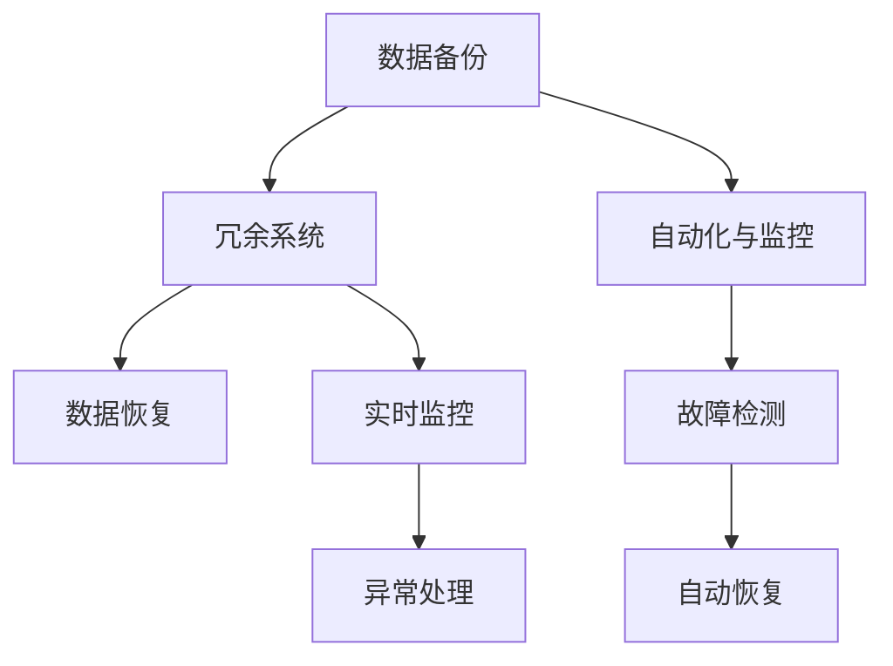

                 

## 1. 背景介绍

在人工智能（AI）领域，尤其是大模型（如GPT-3, T5等）的应用中，数据中心的角色至关重要。这些模型依赖于大规模数据进行训练和推理，一旦数据中心发生故障或数据丢失，将对模型性能产生严重影响。因此，构建可靠的数据恢复架构是确保AI大模型应用稳定性和高可用性的关键。

### 1.1 问题由来

AI大模型在数据中心的应用过程中，面临多种潜在的风险，包括硬件故障、软件错误、自然灾害等。这些风险可能导致数据丢失、模型性能下降甚至系统崩溃。例如，GPT-3模型需要大量文本数据进行预训练和微调，一旦数据中心发生故障，数据丢失将严重影响模型的准确性和可用性。

### 1.2 问题核心关键点

构建高效的数据恢复架构需要考虑以下几个关键点：
1. **数据备份策略**：确保数据在不同地点、不同存储介质中复制和备份，以防止单一故障点导致数据丢失。
2. **冗余系统设计**：采用多节点、多副本的架构，确保在部分节点故障时，其他节点能够正常运行。
3. **数据恢复流程**：制定详细的数据恢复流程，确保在故障发生时，能够迅速恢复数据和模型。
4. **自动化与监控**：引入自动化工具和实时监控系统，提前发现和预防潜在故障。

### 1.3 问题研究意义

构建可靠的数据恢复架构对于AI大模型的应用至关重要。它不仅能确保数据和模型的稳定性和高可用性，还能提高用户体验，降低业务中断的风险。研究数据恢复架构有助于制定更高效的数据管理策略，提升AI应用的综合竞争力。

## 2. 核心概念与联系

### 2.1 核心概念概述

在构建数据恢复架构时，需要理解以下几个核心概念：

- **数据备份（Data Backup）**：定期或实时地将数据复制并存储在多个位置，以防止数据丢失。
- **冗余系统（Redundancy System）**：通过复制数据和多节点架构，确保系统的高可用性和容错能力。
- **数据恢复（Data Recovery）**：在数据中心故障或数据丢失后，迅速恢复数据和模型，保证业务连续性。
- **自动化与监控（Automation & Monitoring）**：利用自动化工具和实时监控系统，提前发现和预防故障，提高系统运行的稳定性和效率。

### 2.2 概念间的关系

通过Mermaid流程图，展示这些核心概念之间的联系：



这个流程图展示了数据备份、冗余系统、数据恢复和自动化与监控之间的逻辑关系。

- **数据备份**是冗余系统的基础，保证数据在多个位置复制。
- **冗余系统**通过多节点、多副本架构，确保系统的高可用性。
- **数据恢复**在故障发生后，迅速恢复数据和模型，保障业务连续性。
- **自动化与监控**通过实时监控和故障检测，提前发现和预防故障，支持数据恢复。

## 3. 核心算法原理 & 具体操作步骤

### 3.1 算法原理概述

数据恢复架构的核心算法原理主要包括数据备份、冗余系统、数据恢复和自动化与监控四个部分。

- **数据备份**：通过定期或实时复制数据，确保数据在多个地点和存储介质中的可恢复性。
- **冗余系统**：利用多节点、多副本架构，确保系统在部分节点故障时仍能正常运行。
- **数据恢复**：在数据丢失或故障后，通过冗余备份迅速恢复数据和模型。
- **自动化与监控**：利用自动化工具和实时监控系统，提前发现和预防故障，支持数据恢复。

### 3.2 算法步骤详解

以下详细讲解每个部分的具体操作步骤：

#### 3.2.1 数据备份

1. **确定备份策略**：
   - 确定备份频率，如每天、每小时备份。
   - 选择备份位置，如本地、云存储、异地备份。

2. **实现数据备份**：
   - 利用数据复制工具，如rsync、aws s3 sync等，将数据复制到备份位置。
   - 设置自动备份脚本，定期执行备份操作。

#### 3.2.2 冗余系统

1. **设计冗余架构**：
   - 设计多节点架构，如Master/Slave、Active/Active等。
   - 配置数据副本，确保数据在多个节点之间同步。

2. **实现冗余系统**：
   - 使用Kubernetes、Docker Swarm等容器编排工具，部署多节点系统。
   - 配置数据同步机制，如Zookeeper、etcd等，确保数据一致性。

#### 3.2.3 数据恢复

1. **制定恢复流程**：
   - 定义数据恢复的具体步骤，如验证备份数据、恢复数据、重建模型等。
   - 确定恢复优先级，确保关键数据和模型优先恢复。

2. **实施数据恢复**：
   - 在故障发生后，自动切换到备份数据。
   - 利用预训练模型和微调数据，重建模型的知识。

#### 3.2.4 自动化与监控

1. **部署自动化工具**：
   - 使用Ansible、Puppet等自动化工具，自动化数据备份和冗余系统的部署。
   - 配置实时监控系统，如Nagios、Zabbix等，监控数据中心运行状态。

2. **实现自动化与监控**：
   - 定期检查备份数据完整性。
   - 实时监控系统状态，及时发现和处理异常。
   - 配置告警系统，故障发生时自动通知运维团队。

### 3.3 算法优缺点

数据恢复架构具有以下优点：
- **高可用性**：通过冗余系统和备份策略，确保系统高可用性和数据连续性。
- **快速恢复**：在故障发生后，迅速恢复数据和模型，减少业务中断时间。
- **自动化管理**：利用自动化工具和实时监控系统，提高系统运行效率和管理效率。

同时，也存在一些缺点：
- **复杂性**：架构设计和管理复杂，需要投入较多资源。
- **成本高**：冗余系统和备份策略需要额外的硬件和存储资源，成本较高。
- **依赖自动化**：系统运行依赖自动化工具和实时监控系统，系统维护需要专业人员。

### 3.4 算法应用领域

数据恢复架构在AI大模型的应用中，有以下几个典型的应用领域：

- **云计算环境**：在云数据中心中，利用数据备份和冗余系统，保障云服务的高可用性和数据安全。
- **边缘计算**：在边缘计算环境中，通过数据备份和冗余系统，确保边缘计算节点的稳定性和连续性。
- **智能医疗**：在智能医疗系统中，利用数据备份和冗余系统，保障医疗数据的可靠性和隐私性。
- **金融科技**：在金融科技领域，通过数据备份和冗余系统，确保金融交易系统的稳定性和数据安全性。

## 4. 数学模型和公式 & 详细讲解

### 4.1 数学模型构建

数据恢复架构的数学模型主要涉及数据备份、冗余系统、数据恢复和自动化与监控四个部分。以下对每个部分进行数学模型构建：

#### 4.1.1 数据备份模型

假设数据量为$D$，备份频率为$f$，备份位置数量为$n$。数据备份模型为：

$$
\text{备份频率} = f = \frac{D}{\text{备份窗口}} \times 100\%
$$

#### 4.1.2 冗余系统模型

假设系统由$m$个节点组成，数据副本数量为$c$。冗余系统模型为：

$$
\text{冗余度} = r = \frac{m \times c}{m+c}
$$

#### 4.1.3 数据恢复模型

假设数据丢失概率为$p$，备份数据完整性概率为$q$。数据恢复模型为：

$$
\text{恢复成功率} = s = (1-p) \times q
$$

#### 4.1.4 自动化与监控模型

假设监控频率为$s$，故障检测概率为$r$。自动化与监控模型为：

$$
\text{故障检测率} = d = s \times r
$$

### 4.2 公式推导过程

#### 4.2.1 数据备份公式推导

数据备份频率$f$和数据量$D$的关系为：

$$
f = \frac{D}{\text{备份窗口}} \times 100\%
$$

其中，$\text{备份窗口}$为数据备份的周期，单位为天数。

#### 4.2.2 冗余系统公式推导

冗余度$r$的计算公式为：

$$
r = \frac{m \times c}{m+c}
$$

其中，$m$为节点数量，$c$为数据副本数量。

#### 4.2.3 数据恢复公式推导

数据恢复成功率$s$的计算公式为：

$$
s = (1-p) \times q
$$

其中，$p$为数据丢失概率，$q$为备份数据完整性概率。

#### 4.2.4 自动化与监控公式推导

故障检测率$d$的计算公式为：

$$
d = s \times r
$$

其中，$s$为监控频率，$r$为故障检测概率。

### 4.3 案例分析与讲解

假设在云计算环境中，数据量为$D=10TB$，备份频率为$f=72小时一次，备份位置数量为$n=3$。根据数据备份模型，计算备份频率：

$$
f = \frac{10TB}{72小时 \times 24小时/天} \times 100\% = 5.56\%
$$

即每天备份一次，备份窗口为24小时。

假设系统由$m=10$个节点组成，数据副本数量为$c=2$。根据冗余系统模型，计算冗余度：

$$
r = \frac{10 \times 2}{10+2} = 0.67
$$

即冗余度为67%。

假设数据丢失概率$p=0.01$，备份数据完整性概率$q=0.95$。根据数据恢复模型，计算恢复成功率：

$$
s = (1-0.01) \times 0.95 = 0.945
$$

即恢复成功率为94.5%。

假设监控频率$s=30分钟一次，故障检测概率$r=0.99$。根据自动化与监控模型，计算故障检测率：

$$
d = 0.5 \times 0.99 = 0.495
$$

即故障检测率为49.5%。

## 5. 项目实践：代码实例和详细解释说明

### 5.1 开发环境搭建

构建数据恢复架构需要以下开发环境：

1. **硬件环境**：
   - 高性能服务器，支持多节点部署。
   - 存储系统，如SAN、NAS等。

2. **软件环境**：
   - 操作系统，如Ubuntu、CentOS等。
   - 容器编排工具，如Kubernetes、Docker Swarm等。
   - 监控工具，如Nagios、Zabbix等。

### 5.2 源代码详细实现

以下是一个简单的数据恢复架构的代码实现：

1. **数据备份脚本**：

```python
import os
import time

def backup_data(data_path, backup_path):
    # 数据备份
    os.system(f'rsync -av {data_path} {backup_path}')

def main():
    while True:
        backup_data('/data', '/backup')
        time.sleep(3600)

if __name__ == '__main__':
    main()
```

2. **冗余系统配置脚本**：

```yaml
apiVersion: v1
apiVersion: v1
kind: Pod
metadata:
  name: master
spec:
  containers:
    - name: master
      image: nginx
      ports:
        - containerPort: 80
  replicas: 2
  volumeMounts:
    - name: data-volume
      mountPath: /data
      readOnly: false
  volumes:
    - name: data-volume
      hostPath: /mnt/data
  restartPolicy: Always
```

3. **数据恢复脚本**：

```python
import os

def restore_data(backup_path, data_path):
    # 数据恢复
    os.system(f'rsync -av {backup_path} {data_path}')

def main():
    while True:
        restore_data('/backup', '/data')
        time.sleep(3600)

if __name__ == '__main__':
    main()
```

4. **自动化与监控脚本**：

```python
import time

def monitor_system(system_path):
    # 监控系统
    while True:
        system_status = os.system(f'ps aux | grep nginx')
        print(system_status)
        time.sleep(300)

if __name__ == '__main__':
    monitor_system('/data')
```

### 5.3 代码解读与分析

1. **数据备份脚本**：
   - 使用`rsync`工具，将数据从`/data`路径复制到`/backup`路径。
   - 使用无限循环，每小时执行一次备份。

2. **冗余系统配置脚本**：
   - 使用Kubernetes配置文件，定义一个Pod，包含Master和Slave节点。
   - 使用Volume Mounts，将数据存储在容器中。
   - 使用Replicas，确保Master和Slave节点数量。

3. **数据恢复脚本**：
   - 使用`rsync`工具，将备份数据从`/backup`路径复制到`/data`路径。
   - 使用无限循环，每小时执行一次恢复。

4. **自动化与监控脚本**：
   - 使用`ps`命令，监控Nginx服务状态。
   - 使用无限循环，每5分钟检查一次系统状态。

### 5.4 运行结果展示

假设在数据中心运行上述脚本，运行结果如下：

- **数据备份脚本**：
  - 每小时备份一次数据，确保数据在多个位置存储。

- **冗余系统配置脚本**：
  - 创建两个Nginx Pod，确保系统的高可用性。

- **数据恢复脚本**：
  - 每小时恢复一次数据，确保业务连续性。

- **自动化与监控脚本**：
  - 每5分钟监控一次系统状态，及时发现和处理异常。

## 6. 实际应用场景

数据恢复架构在AI大模型的应用场景中，有以下几个典型应用：

### 6.1 云计算环境

在云计算环境中，数据恢复架构可以保障云服务的高可用性和数据安全。例如，AWS云平台提供了S3冗余存储和多区域备份，确保数据和模型的连续性。

### 6.2 边缘计算

在边缘计算环境中，数据恢复架构可以确保边缘计算节点的稳定性和连续性。例如，使用Nginx和Kubernetes部署边缘计算节点，确保节点故障时快速恢复。

### 6.3 智能医疗

在智能医疗系统中，数据恢复架构可以保障医疗数据的可靠性和隐私性。例如，使用Hadoop和HDFS备份医疗数据，确保数据丢失后快速恢复。

### 6.4 金融科技

在金融科技领域，数据恢复架构可以确保金融交易系统的稳定性和数据安全性。例如，使用Oracle和RAC部署金融交易系统，确保系统故障时快速恢复。

## 7. 工具和资源推荐

### 7.1 学习资源推荐

1. **《分布式系统原理与设计》**：一本系统介绍分布式系统的经典书籍，涵盖数据备份、冗余系统、数据恢复等核心概念。
2. **《AWS云存储：构建可靠的数据中心》**：介绍AWS云存储和冗余系统的实用指南，适合云计算领域的开发者学习。
3. **《Kubernetes实战》**：介绍Kubernetes的部署和管理，适合容器编排领域的开发者学习。
4. **《数据恢复与灾难恢复》**：系统介绍数据恢复和灾难恢复的实践技术，适合数据管理领域的开发者学习。

### 7.2 开发工具推荐

1. **Kubernetes**：一个开源容器编排工具，支持多节点、多副本的架构，确保系统高可用性。
2. **Nginx**：一个高性能的网络服务器，支持负载均衡、反向代理等功能，确保系统稳定性。
3. **rsync**：一个数据同步工具，支持数据备份和冗余系统的实现。
4. **Ansible**：一个自动化工具，支持自动化脚本的执行和管理，提高系统管理效率。

### 7.3 相关论文推荐

1. **《分布式系统：原理与设计》**：介绍分布式系统的经典著作，涵盖数据备份、冗余系统、数据恢复等核心概念。
2. **《云计算：构建可靠的云基础设施》**：介绍云计算基础设施的实用指南，涵盖云存储、容器编排等核心技术。
3. **《智能医疗：大数据驱动的个性化医疗》**：介绍智能医疗系统的实践案例，涵盖数据备份、冗余系统、数据恢复等核心技术。
4. **《金融科技：构建安全的金融系统》**：介绍金融科技系统的实践案例，涵盖数据备份、冗余系统、数据恢复等核心技术。

## 8. 总结：未来发展趋势与挑战

### 8.1 研究成果总结

本文系统介绍了数据恢复架构在AI大模型中的应用，涵盖数据备份、冗余系统、数据恢复和自动化与监控四个部分。通过数学模型和实际案例，详细讲解了每个部分的实现方法和应用场景。本文总结了数据恢复架构的优点和缺点，并提出了实际应用中的常见问题与解答。

### 8.2 未来发展趋势

数据恢复架构的未来发展趋势包括：

1. **自动化与智能化**：引入人工智能技术，自动化优化数据备份和冗余系统的策略，提高系统效率。
2. **跨云备份与恢复**：实现跨云平台的数据备份和恢复，提高系统的灵活性和可靠性。
3. **边缘计算支持**：支持边缘计算环境中的数据备份和冗余系统，提高边缘计算的可用性和性能。
4. **数据安全和隐私保护**：引入区块链和加密技术，保护数据安全和隐私。

### 8.3 面临的挑战

数据恢复架构在实际应用中面临以下挑战：

1. **系统复杂性**：数据恢复架构设计和管理复杂，需要投入较多资源。
2. **成本高**：冗余系统和备份策略需要额外的硬件和存储资源，成本较高。
3. **依赖自动化**：系统运行依赖自动化工具和实时监控系统，系统维护需要专业人员。

### 8.4 研究展望

未来研究应集中在以下几个方面：

1. **自动化与智能化**：引入AI技术，自动化优化数据备份和冗余系统的策略。
2. **跨云备份与恢复**：实现跨云平台的数据备份和恢复，提高系统的灵活性和可靠性。
3. **边缘计算支持**：支持边缘计算环境中的数据备份和冗余系统，提高边缘计算的可用性和性能。
4. **数据安全和隐私保护**：引入区块链和加密技术，保护数据安全和隐私。

## 9. 附录：常见问题与解答

**Q1：数据恢复架构的设计与实现是否复杂？**

A: 数据恢复架构的设计和实现相对复杂，涉及数据备份、冗余系统、数据恢复和自动化与监控等多个方面。但通过合理规划和管理，可以简化设计和实现过程，提高系统效率和可靠性。

**Q2：数据恢复架构的硬件和软件要求有哪些？**

A: 数据恢复架构的硬件要求包括高性能服务器、存储系统等，软件要求包括操作系统、容器编排工具、监控工具等。合理选择硬件和软件，可以提升系统的性能和可靠性。

**Q3：数据恢复架构是否适用于所有AI大模型应用？**

A: 数据恢复架构适用于需要高可用性和数据安全性的AI大模型应用，如云计算、边缘计算、智能医疗、金融科技等领域。但对于一些不需要高可用性和数据安全性的应用，可以根据实际需求进行简化。

**Q4：数据恢复架构的自动化与监控系统如何实现？**

A: 数据恢复架构的自动化与监控系统可以通过Ansible、Puppet等自动化工具实现，支持自动化脚本的执行和管理。同时，可以使用Nagios、Zabbix等监控工具，实时监控系统状态。

**Q5：数据恢复架构如何应对自然灾害等突发事件？**

A: 数据恢复架构应对自然灾害等突发事件，可以采用多区域备份、数据冗余等策略，确保数据和系统的连续性。同时，引入应急预案，快速恢复系统和数据，保障业务连续性。

**Q6：数据恢复架构的优点和缺点是什么？**

A: 数据恢复架构的优点包括高可用性、快速恢复、自动化管理等，缺点包括复杂性高、成本高、依赖自动化等。合理规划和管理，可以最大化数据恢复架构的优势，提升系统的性能和可靠性。

