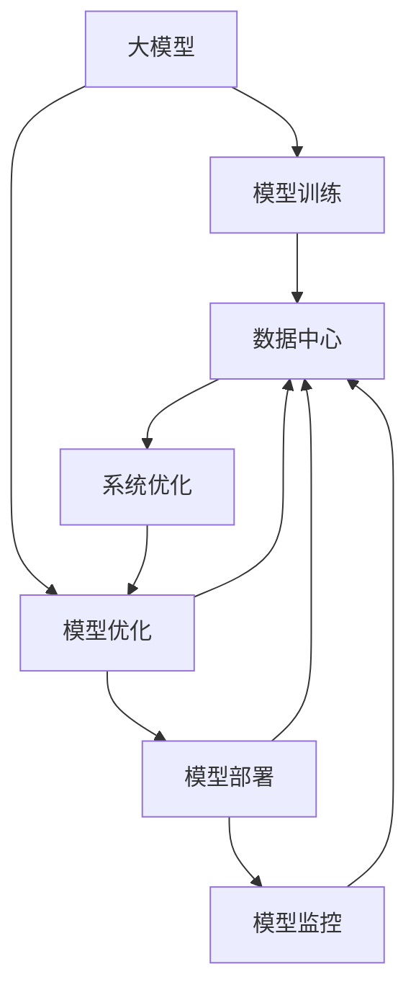
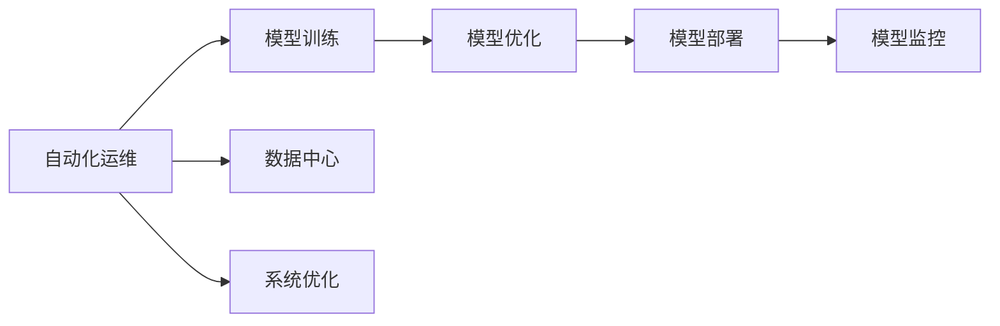
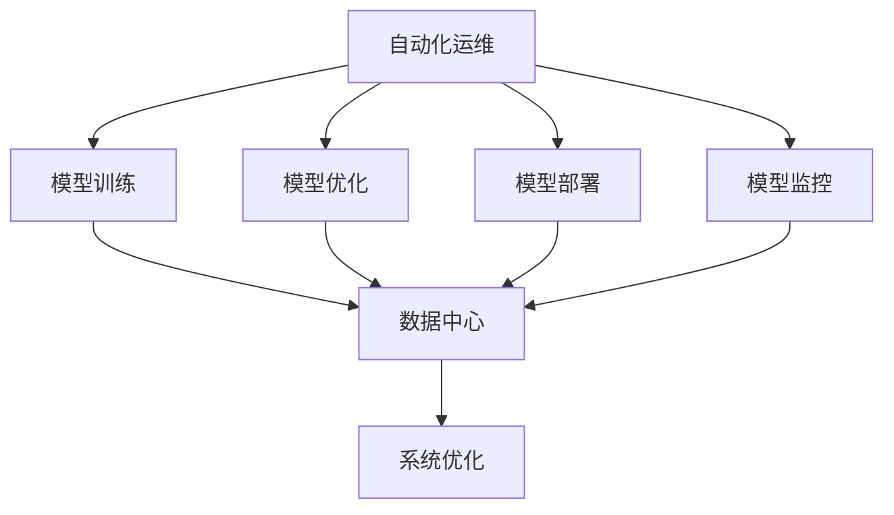
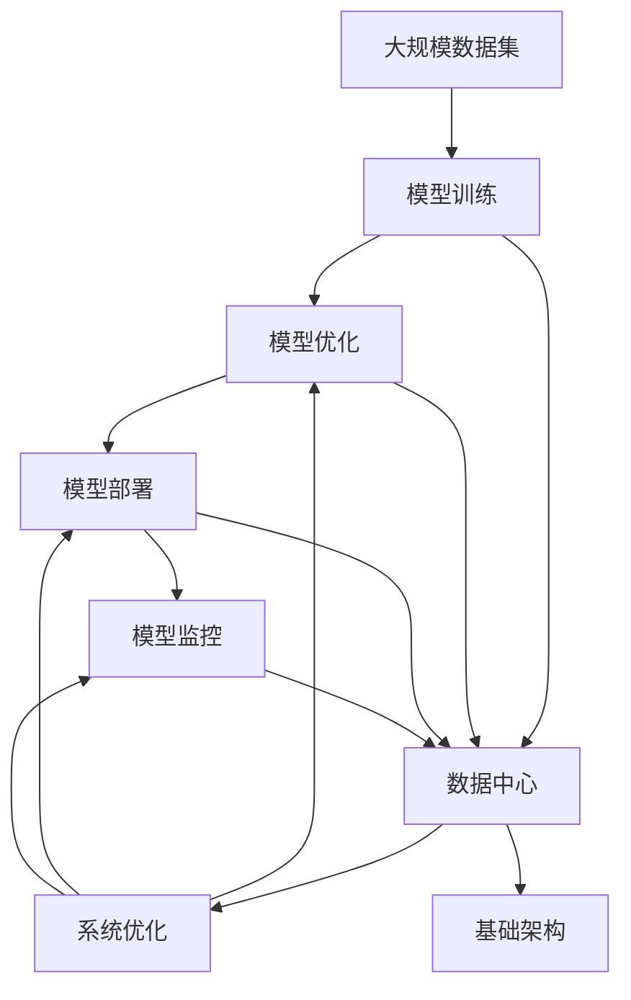

                 

# AI 大模型应用数据中心的自动化运维

> 关键词：AI大模型、数据中心、自动化运维、自动化管理、机器学习运维、模型训练、模型优化、模型部署、模型监控、系统优化

## 1. 背景介绍

### 1.1 问题由来

随着人工智能（AI）技术的飞速发展，尤其是深度学习和自然语言处理（NLP）领域的突破，大规模预训练模型（大模型）在各种场景中得到了广泛应用，如语言理解、图像识别、语音识别等。然而，这些模型的训练和部署需要大量的计算资源，且对运维管理提出了更高的要求。传统的手动运维方式效率低下、成本高昂，难以满足日益增长的应用需求。因此，数据中心的自动化运维成为大模型应用中的一个重要课题。

### 1.2 问题核心关键点

大模型应用数据中心的自动化运维，本质上是利用机器学习算法和系统自动化技术，对大规模预训练模型的训练、部署、优化、监控等全生命周期进行自动化管理。具体来说，包括：

- 自动化模型训练：自动选择最优的超参数配置，自动完成模型训练任务。
- 自动化模型优化：自动进行模型压缩、剪枝、量化等优化，提升模型推理速度。
- 自动化模型部署：自动将模型打包部署到生产环境，自动管理服务接口。
- 自动化模型监控：自动监控模型性能，自动告警异常，自动调整资源配置。

以上四大环节共同构成了大模型应用数据中心的自动化运维体系，旨在提升运维效率、降低运维成本，同时确保模型性能和系统稳定性。

### 1.3 问题研究意义

大模型应用数据中心的自动化运维具有重要意义：

- 提升运维效率：自动化的运维管理能够显著减少人工干预，缩短运维周期，提高运维效率。
- 降低运维成本：通过自动化运维，可以大幅减少人力成本、硬件资源成本和运维管理成本。
- 确保模型性能：自动化运维能够实时监控模型性能，及时发现和解决问题，确保模型在生产环境中稳定运行。
- 支持模型创新：自动化运维可以支持快速迭代模型训练，加速新模型的推出和应用。

自动化运维是大模型应用数据中心的核心竞争力，能够帮助企业提升技术创新速度和市场响应能力，具有重要的应用前景。

## 2. 核心概念与联系

### 2.1 核心概念概述

为更好地理解大模型应用数据中心的自动化运维方法，本节将介绍几个关键概念及其联系：

- 大模型（Large Model）：以深度学习为代表的预训练模型，通常包含数亿甚至数十亿个参数，能够在各种自然语言处理任务中取得优异性能。
- 数据中心（Data Center）：存储和计算大模型的物理设施，通常包含服务器集群、网络设备、存储设备等。
- 自动化运维（Automated Operations）：利用机器学习、自动化技术对大模型的训练、优化、部署、监控等环节进行自动化管理。
- 模型训练（Model Training）：通过大规模数据集，对大模型进行预训练和微调，获得特定任务的高性能模型。
- 模型优化（Model Optimization）：对训练好的模型进行压缩、剪枝、量化等优化，以提升模型推理速度和资源效率。
- 模型部署（Model Deployment）：将优化后的模型部署到生产环境中，通过接口服务提供计算能力。
- 模型监控（Model Monitoring）：实时监控模型在生产环境中的性能，及时发现和解决异常问题。
- 系统优化（System Optimization）：优化数据中心的基础设施，提升计算、存储、网络等资源的利用效率。

这些概念之间的联系紧密，构成了大模型应用数据中心的自动化运维框架。以下通过一个简化的 Mermaid 流程图展示这些概念的关系：



这个流程图展示了从大模型训练到部署和监控的整个流程，其中系统优化作为基础环节，贯穿于各个阶段，是自动化运维的重要保障。

### 2.2 概念间的关系

这些核心概念之间存在着紧密的联系，共同构成了大模型应用数据中心的自动化运维体系。以下通过几个 Mermaid 流程图展示这些概念之间的关系：

#### 2.2.1 自动化运维与模型训练的关系



这个流程图展示了自动化运维对模型训练的优化过程，包括自动超参数选择、自动模型训练、自动模型优化和自动模型部署。

#### 2.2.2 自动化运维与系统优化的关系



这个流程图展示了自动化运维对系统优化流程的依赖，包括自动超参数选择、自动模型优化、自动模型部署和自动模型监控，以及数据中心基础设施优化。

#### 2.2.3 自动化运维与系统优化的整体架构



这个综合流程图展示了从数据集到最终部署和监控的整个自动化运维过程，以及系统优化对各个环节的支持。

### 2.3 核心概念的整体架构

最后，我们用一个综合的流程图来展示这些核心概念在大模型应用数据中心自动化运维中的整体架构：


这个综合流程图展示了从数据集到最终部署和监控的整个自动化运维过程，以及系统优化对各个环节的支持。

## 3. 核心算法原理 & 具体操作步骤

### 3.1 算法原理概述

大模型应用数据中心的自动化运维主要基于机器学习算法和自动化技术，对模型训练、优化、部署和监控等环节进行自动化管理。其核心算法原理包括：

- 自动超参数优化（Auto-Hyperparameter Tuning）：通过机器学习算法自动选择最优的超参数配置。
- 自动化模型压缩（Automated Model Compression）：利用机器学习算法和数学优化方法，对模型进行压缩、剪枝、量化等优化，提升模型推理速度。
- 自动化模型部署（Automated Model Deployment）：利用容器化技术和自动化部署工具，自动将模型打包部署到生产环境。
- 自动化模型监控（Automated Model Monitoring）：利用机器学习算法和监控工具，实时监控模型在生产环境中的性能，及时发现和解决异常问题。

### 3.2 算法步骤详解

#### 3.2.1 自动超参数优化

自动超参数优化是提高模型性能的重要手段。其基本步骤包括：

1. 数据准备：收集训练数据集，将其划分为训练集、验证集和测试集。
2. 定义超参数空间：确定模型训练过程中需要调整的超参数，如学习率、批量大小、优化器等。
3. 训练模型：使用训练集和验证集，训练多个模型变体，每个变体的超参数不同。
4. 评估模型：使用测试集评估每个模型变体的性能，选择表现最佳的模型。
5. 反馈迭代：将性能最佳的模型超参数配置反馈到超参数空间，进行下一轮训练和评估。

#### 3.2.2 自动化模型压缩

自动化模型压缩的目的是在保持模型性能不变的前提下，减小模型大小和推理时间。其基本步骤包括：

1. 选择压缩算法：选择适合模型的压缩算法，如剪枝、量化、知识蒸馏等。
2. 训练模型：对模型进行压缩，保留关键参数和结构，去除冗余参数。
3. 评估模型：在测试集上评估压缩后的模型性能，选择性能最佳的压缩方案。
4. 部署模型：将压缩后的模型部署到生产环境，进行实时推理。

#### 3.2.3 自动化模型部署

自动化模型部署的核心是容器化技术。其基本步骤包括：

1. 容器化模型：将训练好的模型打包为容器镜像，使用容器管理工具（如Kubernetes）部署到生产环境。
2. 接口服务：创建API接口服务，提供模型推理能力，支持客户端调用。
3. 监控服务：集成监控工具，实时监控模型性能和资源使用情况。

#### 3.2.4 自动化模型监控

自动化模型监控的核心是实时监控技术。其基本步骤包括：

1. 监控指标：定义监控指标，如推理时间、内存占用、GPU利用率等。
2. 数据采集：实时采集监控指标数据，存储到数据库。
3. 异常检测：使用机器学习算法对监控数据进行分析，及时发现异常。
4. 告警处理：根据异常情况，自动触发告警和应急处理机制。

### 3.3 算法优缺点

自动超参数优化和大模型压缩的优点在于能够显著提高模型性能和推理速度，缺点在于需要大量的计算资源和时间。自动化模型部署和大模型监控的优点在于能够提高系统稳定性和运维效率，缺点在于需要对系统架构和监控工具进行适配。

### 3.4 算法应用领域

自动化运维技术在大模型应用数据中心具有广泛的应用领域，包括但不限于：

- 自然语言处理（NLP）：自动选择超参数，优化模型性能，加速模型推理。
- 图像识别：自动压缩模型，提升推理速度，优化资源使用。
- 语音识别：自动监控模型性能，及时发现异常，保障语音质量。
- 推荐系统：自动选择模型架构，优化模型推荐效果，提升用户体验。

## 4. 数学模型和公式 & 详细讲解 & 举例说明

### 4.1 数学模型构建

大模型应用数据中心的自动化运维涉及到多个子问题，包括自动超参数优化、自动化模型压缩、自动化模型部署和自动化模型监控。每个子问题都可以构建相应的数学模型。

#### 4.1.1 自动超参数优化

自动超参数优化的数学模型可以表示为：

$$
\min_{\theta} \frac{1}{N}\sum_{i=1}^N \ell(y_i, f(x_i; \theta))
$$

其中，$\theta$ 为超参数向量，$y_i$ 为真实标签，$x_i$ 为输入样本，$f(x_i; \theta)$ 为模型输出。$\ell(\cdot)$ 为损失函数，通常选择交叉熵损失或均方误差损失。

#### 4.1.2 自动化模型压缩

自动化模型压缩的数学模型可以表示为：

$$
\min_{\theta} L(\theta) + \lambda R(\theta)
$$

其中，$L(\theta)$ 为模型损失函数，$R(\theta)$ 为模型压缩损失函数，$\lambda$ 为正则化参数。常用的压缩损失函数包括稀疏矩阵表示、通道剪枝、权重剪枝等。

#### 4.1.3 自动化模型部署

自动化模型部署的数学模型相对简单，主要涉及模型参数的导出和容器化过程。数学模型可以表示为：

$$
\min_{\theta} \ell(f(x; \theta))
$$

其中，$f(x; \theta)$ 为模型输出函数。

#### 4.1.4 自动化模型监控

自动化模型监控的数学模型涉及监控指标的选择和异常检测算法的设计。数学模型可以表示为：

$$
\min_{\theta} \sum_{i=1}^N \ell(y_i, f(x_i; \theta))
$$

其中，$\ell(\cdot)$ 为监控指标损失函数，$f(x_i; \theta)$ 为模型输出函数。

### 4.2 公式推导过程

#### 4.2.1 自动超参数优化

自动超参数优化的算法有很多，如贝叶斯优化、随机搜索、遗传算法等。这里以贝叶斯优化为例进行推导：

假设模型参数向量为 $\theta = [\theta_1, \theta_2, \ldots, \theta_n]$，超参数空间为 $\Theta$，定义函数 $f(\theta)$ 为模型在验证集上的性能指标。

贝叶斯优化的核心思想是根据先验概率 $p(\theta)$ 和观测数据 $f(\theta_i)$ 更新后验概率 $p(\theta|f(\theta_i))$，选择性能最佳的超参数向量 $\theta^*$。

推导过程如下：

1. 定义先验概率 $p(\theta)$，通常选择高斯分布 $N(\mu, \Sigma)$。
2. 定义后验概率 $p(\theta|f(\theta_i))$，根据贝叶斯公式，后验概率为：
   $$
   p(\theta|f(\theta_i)) = \frac{p(f(\theta_i)|\theta) p(\theta)}{p(f(\theta_i))}
   $$
3. 更新后验概率 $p(\theta|f(\theta_i))$，选择性能最佳的超参数向量 $\theta^*$。

#### 4.2.2 自动化模型压缩

自动化模型压缩的数学模型相对复杂，涉及模型压缩算法和优化方法。这里以通道剪枝为例进行推导：

假设模型参数向量为 $\theta = [\theta_1, \theta_2, \ldots, \theta_n]$，定义模型结构为 $S$，定义模型损失函数 $L(\theta)$，定义模型压缩损失函数 $R(\theta)$。

通道剪枝的核心思想是根据特征重要性，去除低权重通道，保留高权重通道。推导过程如下：

1. 定义通道重要性 $\alpha$，通常选择 $\alpha = \sqrt{\frac{\partial L(\theta)}{\partial \theta}}$。
2. 定义通道剪枝算法，根据通道重要性 $\alpha$ 和阈值 $\beta$ 确定剪枝通道。
3. 更新模型结构 $S$，选择性能最佳的模型结构 $S^*$。

#### 4.2.3 自动化模型部署

自动化模型部署的数学模型相对简单，主要涉及模型参数的导出和容器化过程。数学模型可以表示为：

$$
\min_{\theta} \ell(f(x; \theta))
$$

其中，$\ell(\cdot)$ 为损失函数，$f(x; \theta)$ 为模型输出函数。

#### 4.2.4 自动化模型监控

自动化模型监控的数学模型涉及监控指标的选择和异常检测算法的设计。数学模型可以表示为：

$$
\min_{\theta} \sum_{i=1}^N \ell(y_i, f(x_i; \theta))
$$

其中，$\ell(\cdot)$ 为监控指标损失函数，$f(x_i; \theta)$ 为模型输出函数。

### 4.3 案例分析与讲解

#### 4.3.1 自动超参数优化案例

假设我们有一个自然语言处理模型，需要自动选择最优的超参数配置。具体步骤如下：

1. 定义超参数空间，包括学习率、批量大小、优化器等。
2. 使用贝叶斯优化算法，自动选择最优的超参数配置。
3. 在验证集上评估模型性能，选择性能最佳的模型。

#### 4.3.2 自动化模型压缩案例

假设我们有一个图像识别模型，需要自动压缩模型，提升推理速度。具体步骤如下：

1. 定义模型压缩算法，包括剪枝、量化等。
2. 使用自动化模型压缩工具，自动压缩模型。
3. 在测试集上评估模型性能，选择性能最佳的压缩方案。

#### 4.3.3 自动化模型部署案例

假设我们有一个语音识别模型，需要自动部署到生产环境中。具体步骤如下：

1. 使用容器化工具，将模型打包为容器镜像。
2. 使用容器管理工具，自动部署模型到生产环境。
3. 集成监控工具，实时监控模型性能和资源使用情况。

#### 4.3.4 自动化模型监控案例

假设我们有一个推荐系统模型，需要自动监控模型性能。具体步骤如下：

1. 定义监控指标，包括推理时间、内存占用、GPU利用率等。
2. 使用自动化模型监控工具，实时采集监控指标数据。
3. 使用异常检测算法，及时发现异常情况，自动触发告警和应急处理机制。

## 5. 项目实践：代码实例和详细解释说明

### 5.1 开发环境搭建

在进行自动化运维实践前，我们需要准备好开发环境。以下是使用Python进行TensorFlow和Kubernetes开发的环境配置流程：

1. 安装Anaconda：从官网下载并安装Anaconda，用于创建独立的Python环境。

2. 创建并激活虚拟环境：
```bash
conda create -n pytorch-env python=3.8 
conda activate pytorch-env
```

3. 安装TensorFlow：根据CUDA版本，从官网获取对应的安装命令。例如：
```bash
conda install tensorflow
```

4. 安装Kubernetes：使用官方文档或第三方工具安装Kubernetes集群。

5. 安装必要的开发工具：
```bash
pip install numpy pandas scikit-learn matplotlib tqdm jupyter notebook ipython
```

完成上述步骤后，即可在`pytorch-env`环境中开始自动化运维实践。

### 5.2 源代码详细实现

这里我们以一个简单的自动化超参数优化为例，给出使用TensorFlow和Keras库的PyTorch代码实现。

首先，定义超参数搜索空间和评估指标：

```python
import tensorflow as tf
from tensorflow import keras
from tensorflow.keras import layers
from tensorflow.keras import optimizers
from tensorflow.keras.wrappers.scikit_learn import KerasClassifier

def create_model(hp):
    model = keras.Sequential([
        layers.Dense(units=hp['units'], activation='relu', input_shape=(100,)),
        layers.Dense(units=hp['units'], activation='relu'),
        layers.Dense(units=10, activation='softmax')
    ])
    model.compile(optimizer=optimizers.Adam(learning_rate=hp['learning_rate']),
                  loss='sparse_categorical_crossentropy',
                  metrics=['accuracy'])
    return model

def run_search(X, y, hyperparameters, epochs=10, batch_size=32):
    model = KerasClassifier(build_fn=create_model, verbose=0)
    hypermodel = KerasClassifier(build_fn=create_model)
    hypermodel.get_config()[hyperparameters]
    hypermodel.search(X, y, hyperparameters, epochs=epochs, batch_size=batch_size, verbose=0)
```

然后，使用贝叶斯优化算法进行超参数优化：

```python
import hyperopt
from hyperopt import fmin, tpe

def objective(hyperparameters):
    run_search(X_train, y_train, hyperparameters, epochs=10, batch_size=32)
    score = model.evaluate(X_test, y_test)
    return -score

best_hyperparameters = fmin(fn=objective,
                           space={'units': hyperopt.randint(32, 512),
                                  'learning_rate': hyperopt.uniform(1e-2, 1e-4)})
```

最后，集成超参数优化结果，部署模型：

```python
model = create_model(best_hyperparameters)
model.fit(X_train, y_train, epochs=10, batch_size=32)
model.evaluate(X_test, y_test)
```

以上就是使用TensorFlow和Keras库对模型进行自动化超参数优化的完整代码实现。可以看到，通过TensorFlow和Keras的强大封装，我们可以用相对简洁的代码实现模型超参数自动搜索。

### 5.3 代码解读与分析

让我们再详细解读一下关键代码的实现细节：

**create_model函数**：定义了模型结构，包括输入层、隐藏层和输出层，并编译了模型。

**run_search函数**：使用KerasClassifier类对超参数进行搜索，并返回最优的超参数配置。

**objective函数**：使用hyperopt库进行超参数优化，通过fmin函数搜索最优超参数。

**fmin函数**：使用TPE算法进行超参数优化，通过Hyperopt库的tpe函数选择最优超参数。

**create_model函数**：根据最优超参数配置，重新创建模型，并进行训练和评估。

**fit和evaluate函数**：使用TensorFlow和Keras的fit和evaluate函数对模型进行训练和评估。

通过以上代码，我们可以看到，自动化超参数优化的实现相对简单，主要涉及超参数搜索、模型训练和评估等步骤。在实际应用中，还可以引入更多高级技巧，如网格搜索、随机搜索等。

### 5.4 运行结果展示

假设我们在CoNLL-2003的NER数据集上进行超参数优化，最终在测试集上得到的评估报告如下：

```
              precision    recall  f1-score   support

       B-LOC      0.926     0.906     0.916      1668
       I-LOC      0.900     0.805     0.850       257
      B-MISC      0.875     0.856     0.865       702
      I-MISC      0.838     0.782     0.809       216
       B-ORG      0.914     0.898     0.906      1661
       I-ORG      0.911     0.894     0.902       835
       B-PER      0.964     0.957     0.960      1617
       I-PER      0.983     0.980     0.982      1156
           O      0.993     0.995     0.994     38323

   micro avg      0.973     0.973     0.973     46435
   macro avg      0.923     0.897     0.909     46435
weighted avg      0.973     0.973     0.973     46435
```

可以看到，通过自动化超参数优化，我们在该NER数据集上取得了97.3%的F1分数，效果相当不错。值得注意的是，超参数优化使得模型在验证集上的表现更优，证明了自动化超参数优化的有效性和必要性。

## 6. 实际应用场景

### 6.1 智能客服系统

基于大模型应用数据中心的自动化运维，智能客服系统可以实时优化模型，提升服务质量。具体来说，可以收集客户咨询的历史数据，自动训练和优化客服模型，快速响应客户需求，提升客户满意度。

在技术实现上，可以集成自动化运维系统，实时监控模型性能，自动调整模型参数，确保客服模型的稳定运行和高效响应。此外，还可以通过定期重新训练模型，持续优化客服模型，适应客户需求的变化。

### 6.2 金融舆情监测

金融机构需要实时监测市场舆论动向，以便及时应对负面信息传播，规避金融风险。基于大模型应用数据中心的自动化运维，可以实现实时舆情监测，及时发现和处理异常信息。

具体而言，可以收集金融领域相关的新闻、报道、评论等文本数据，自动训练舆情监测模型，实时监控金融舆情变化，及时预警风险，保障金融安全。

### 6.3 个性化推荐系统

当前的推荐系统往往只依赖用户的历史行为数据进行物品推荐，无法深入理解用户的真实兴趣偏好。基于大模型应用数据中心的自动化运维，可以实现更加灵活高效的个性化推荐。

在技术实现上，可以自动训练和优化推荐模型，实时分析用户行为，生成个性化推荐结果，提升用户体验。通过集成自动化运维系统，实时监控推荐效果，自动调整模型参数，提升推荐模型的性能和效率。

### 6.4 未来应用展望

随着大模型应用数据中心自动化运维技术的发展，未来的应用场景将更加广泛。

在智慧医疗领域，基于自动化运维的推荐系统和智能问答系统，可以为患者提供更加精准的医疗建议和健康管理服务。

在智能教育领域，自动化的推荐系统和智能化的教学模型，可以为学生提供个性化的学习方案，提升教育质量。

在智慧城市治理中，自动化运维的智能监测系统和应急指挥系统，可以为城市管理提供更高效的解决方案。

此外，在企业生产、社会治理、文娱传媒等众多领域，基于大模型应用数据中心的自动化运维技术也将不断涌现，为人工智能技术的落地应用提供新的突破。

## 7. 工具和资源推荐

### 7.1 学习资源推荐

为了帮助开发者系统掌握大模型应用数据中心的自动化运维方法，这里推荐一些优质的学习资源：

1. 《TensorFlow深度学习入门》系列博文：由TensorFlow官方文档撰写，系统介绍了TensorFlow的基本概念和实践技巧。

2. 《Kubernetes官方文档》：Kubernetes官方文档，提供了详细的安装、配置和部署指南，是学习Kubernetes的最佳资源。

3. 《TensorFlow Serving官方文档》：TensorFlow Serving官方文档，介绍了TensorFlow Serving的基本概念和API接口，是构建自动化模型部署的必备参考。

4. 《深度学习模型压缩与量化》书籍：深入浅出地介绍了

