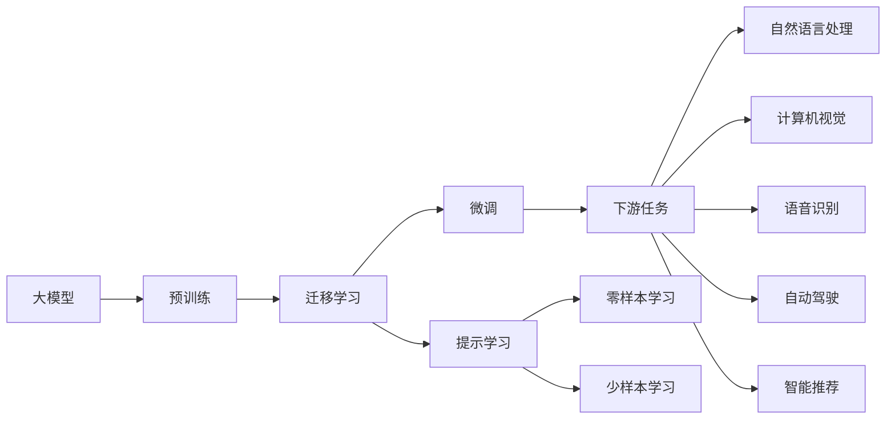

                 

# AI 大模型时代：领头羊 OpenAI、Anthropic、Google、xAI、Meta 等

## 1. 背景介绍

人工智能(AI)正处于快速发展的新时代，大模型正成为推动AI技术创新的主要驱动力。各大科技巨头，如OpenAI、Anthropic、Google、xAI、Meta等，纷纷在AI大模型的研发和应用上投入巨大资源。这些大模型不仅展示了强大的技术实力，也引领了AI技术的新方向，推动了AI技术在各行各业的落地应用。

### 1.1 大模型的兴起

近年来，大模型在自然语言处理(NLP)、计算机视觉(CV)、语音识别等领域取得了突破性的进展。这些大模型通过在大规模无标签数据上进行自监督预训练，学习到了丰富的通用语言表示和视觉表示，具备强大的数据建模能力。随着预训练数据的规模和质量不断提升，大模型的性能也得到了显著的提升。

大模型的兴起，得益于计算资源和算法技术的进步。随着GPU、TPU等高性能计算设备的普及，以及Transformer等高效神经网络结构的应用，大模型的训练速度和计算效率得到了极大提升。同时，自监督学习、迁移学习、强化学习等算法技术的进步，也使得大模型的性能和泛化能力得到了显著提升。

### 1.2 大模型的应用场景

大模型的应用场景非常广泛，涵盖了自然语言处理、计算机视觉、语音识别、自动驾驶、智能推荐等多个领域。以下是几个典型的大模型应用场景：

- **自然语言处理**：大模型在语言理解、文本生成、机器翻译、问答系统等任务上表现优异，能够快速处理大规模自然语言数据，提升NLP应用的效果和效率。
- **计算机视觉**：大模型在图像分类、目标检测、语义分割等计算机视觉任务上表现出色，能够处理高分辨率的图像数据，提升计算机视觉系统的精度和效率。
- **语音识别**：大模型在语音识别、语音合成、语音情感分析等任务上取得了显著进步，使得语音交互更加自然和智能。
- **自动驾驶**：大模型在自动驾驶、智能导航、交通预测等领域展现了强大的环境感知和决策能力，推动了自动驾驶技术的落地应用。
- **智能推荐**：大模型在智能推荐、内容过滤、广告推荐等任务上表现出色，能够根据用户的行为和兴趣，精准推荐个性化的内容和服务。

## 2. 核心概念与联系

### 2.1 核心概念概述

为了更好地理解大模型的核心概念和相互关系，我们首先介绍几个关键概念：

- **大模型**：指在特定领域或任务上进行大规模预训练，学习到丰富的表示能力的模型。常见的大模型包括BERT、GPT-3、DALL-E等。
- **预训练**：指在大规模无标签数据上进行自监督学习，学习到通用的语言表示或视觉表示。常用的预训练任务包括语言建模、掩码语言模型、视觉特征提取等。
- **迁移学习**：指在预训练的基础上，通过有监督学习将模型迁移到特定任务上的过程。常见的迁移学习方式包括微调、提示学习、半监督学习等。
- **微调**：指在有标注数据上，对预训练模型进行进一步的优化，以适应特定任务。微调通常涉及修改模型的一层或多层网络。
- **提示学习**：指通过精心设计的提示模板，引导大模型进行特定的推理或生成任务，可以在不更新模型参数的情况下实现零样本或少样本学习。
- **对抗学习**：指通过对抗样本训练模型，使其对噪声更加鲁棒，提升模型的泛化能力。
- **对抗生成网络**：指生成对抗网络中的生成器与判别器相互对抗，提升生成模型的鲁棒性和生成质量。

### 2.2 概念间的关系

这些核心概念之间的联系可以通过以下Mermaid流程图来展示：



这个流程图展示了各个核心概念之间的联系和交互。大模型通过预训练学习到通用的表示能力，然后通过迁移学习将模型迁移到特定任务上。在迁移学习中，微调和提示学习是最常见的两种方式。微调通常涉及修改模型的部分或全部层，而提示学习则是在不更新模型参数的情况下，通过设计提示模板进行任务推理或生成。

## 3. 核心算法原理 & 具体操作步骤

### 3.1 算法原理概述

大模型的核心算法原理主要包括预训练、迁移学习和微调等。其中，预训练和迁移学习是自监督学习的重要组成部分，微调则是有监督学习的重要组成部分。

- **预训练**：在大规模无标签数据上进行自监督学习，学习到通用的语言或视觉表示。常用的预训练任务包括语言建模、掩码语言模型、视觉特征提取等。
- **迁移学习**：在预训练的基础上，通过有监督学习将模型迁移到特定任务上。常见的迁移学习方式包括微调和提示学习。
- **微调**：在有标注数据上，对预训练模型进行进一步的优化，以适应特定任务。微调通常涉及修改模型的一层或多层网络。
- **提示学习**：通过设计提示模板，引导大模型进行特定的推理或生成任务。提示学习可以在不更新模型参数的情况下实现零样本或少样本学习。

### 3.2 算法步骤详解

#### 3.2.1 预训练步骤

1. **选择预训练数据集**：选择大规模无标签数据集，如Pile、BigQuery、Common Crawl等。
2. **设计预训练任务**：选择合适的预训练任务，如语言建模、掩码语言模型、视觉特征提取等。
3. **模型初始化**：使用随机初始化的模型作为预训练模型的初始值。
4. **预训练训练**：在预训练数据集上进行预训练，使用自监督学习任务进行模型更新。
5. **保存预训练模型**：保存预训练模型的参数和架构，以便后续迁移学习使用。

#### 3.2.2 迁移学习步骤

1. **选择目标任务**：根据实际需求，选择目标任务，如自然语言处理、计算机视觉等。
2. **准备标注数据**：收集和准备有标注数据集，用于微调或提示学习。
3. **模型初始化**：将预训练模型加载到内存中，进行微调或提示学习。
4. **任务适配层设计**：根据目标任务设计合适的任务适配层，如分类头、解码器等。
5. **迁移学习训练**：在目标数据集上进行迁移学习训练，使用有监督学习任务进行模型更新。
6. **评估模型性能**：在验证集或测试集上评估模型性能，根据需求进行微调或提示学习。
7. **保存迁移学习模型**：保存迁移学习模型的参数和架构，以便后续应用使用。

#### 3.2.3 微调步骤

1. **模型选择**：选择预训练模型，如BERT、GPT-3等。
2. **数据准备**：准备目标任务的有标注数据集，如自然语言处理中的IMDB、CoNLL等数据集。
3. **任务适配层设计**：根据目标任务设计合适的任务适配层，如分类头、解码器等。
4. **学习率设置**：设置合适的学习率，一般比预训练时小1-2个数量级。
5. **训练过程**：使用微调数据集进行训练，使用优化算法如AdamW、SGD等进行参数更新。
6. **评估模型性能**：在验证集或测试集上评估模型性能，根据需求进行微调。
7. **保存微调模型**：保存微调模型的参数和架构，以便后续应用使用。

#### 3.2.4 提示学习步骤

1. **任务定义**：明确任务的目标和需求，如问答系统、文本生成等。
2. **提示模板设计**：设计合适的提示模板，引导模型进行特定任务。
3. **模型选择**：选择预训练模型，如BERT、GPT-3等。
4. **训练过程**：使用提示模板进行训练，使用优化算法如AdamW、SGD等进行参数更新。
5. **评估模型性能**：在验证集或测试集上评估模型性能，根据需求进行提示学习。
6. **保存提示学习模型**：保存提示学习模型的参数和架构，以便后续应用使用。

### 3.3 算法优缺点

#### 3.3.1 优点

1. **高效性**：使用大模型微调，可以显著提高模型在特定任务上的性能，减少从头开发所需的数据、计算和人力等成本投入。
2. **泛化能力**：大模型在多个领域和任务上都有较好的泛化能力，可以较好地适应新任务和数据分布的变化。
3. **可解释性**：微调后的模型在特定任务上具有良好的可解释性，可以更好地理解模型决策的逻辑。

#### 3.3.2 缺点

1. **数据依赖**：微调的效果很大程度上取决于标注数据的质量和数量，获取高质量标注数据的成本较高。
2. **迁移能力有限**：当目标任务与预训练数据的分布差异较大时，微调的性能提升有限。
3. **负面效果传递**：预训练模型的固有偏见、有害信息等，可能通过微调传递到下游任务，造成负面影响。
4. **可解释性不足**：微调模型通常缺乏可解释性，难以对其推理逻辑进行分析和调试。

## 4. 数学模型和公式 & 详细讲解 & 举例说明

### 4.1 数学模型构建

#### 4.1.1 预训练模型

预训练模型通常使用Transformer结构，其数学模型可以表示为：

$$
M(x) = \text{Encoder-Decoder}(\text{Encoder}(x), \text{Decoder}(\text{Encoder}(x)))
$$

其中，$M$为预训练模型，$x$为输入数据，$\text{Encoder}$为编码器，$\text{Decoder}$为解码器。

#### 4.1.2 微调模型

微调模型在预训练模型的基础上，增加了一个任务适配层，可以表示为：

$$
M_{\text{fine-tune}}(x) = \text{Task Head}(\text{Encoder}(x))
$$

其中，$M_{\text{fine-tune}}$为微调后的模型，$\text{Task Head}$为任务适配层，$\text{Encoder}$为预训练模型的编码器部分。

### 4.2 公式推导过程

#### 4.2.1 预训练模型的损失函数

预训练模型的损失函数通常使用掩码语言模型（Masked Language Model, MLM）来训练，其数学模型可以表示为：

$$
\mathcal{L}_{\text{pre-train}} = -\frac{1}{N}\sum_{i=1}^N \log P(y_i|x_i)
$$

其中，$N$为训练样本数，$x_i$为输入数据，$y_i$为掩码位置上的真实标签，$P$为预测概率。

#### 4.2.2 微调模型的损失函数

微调模型的损失函数通常使用交叉熵损失（Cross-Entropy Loss）来训练，其数学模型可以表示为：

$$
\mathcal{L}_{\text{fine-tune}} = -\frac{1}{N}\sum_{i=1}^N \sum_{j=1}^k y_{i,j} \log P(y_{i,j}|x_i)
$$

其中，$k$为类别数，$y_{i,j}$为输入数据$x_i$中第$j$个标签的真实值，$P$为预测概率。

### 4.3 案例分析与讲解

#### 4.3.1 BERT预训练

BERT模型的预训练过程主要通过掩码语言模型（MLM）和下一句预测（Next Sentence Prediction, NSP）任务进行。

1. **掩码语言模型**：在输入数据$x$中随机选择部分位置，将其掩码（[MASK]），然后预测其真实值。其数学模型可以表示为：

$$
\mathcal{L}_{\text{MLM}} = -\frac{1}{N}\sum_{i=1}^N \log P(y_i|x_i')
$$

其中，$y_i$为掩码位置上的真实标签，$x_i'$为输入数据$x_i$的掩码版本。

2. **下一句预测**：在输入数据$x$中随机选择一对句子$(x_1, x_2)$，预测它们是否为连续的句子。其数学模型可以表示为：

$$
\mathcal{L}_{\text{NSP}} = -\frac{1}{N}\sum_{i=1}^N \log P(x_2|x_1)
$$

其中，$P$为预测概率。

#### 4.3.2 GPT-3微调

GPT-3的微调过程主要通过文本分类任务进行。假设微调数据集为$D=\{(x_i, y_i)\}_{i=1}^N$，其中$x_i$为输入文本，$y_i$为标签，分类头为$\text{Task Head}$。

1. **模型选择**：选择GPT-3作为微调模型，将其加载到内存中。

2. **任务适配层设计**：根据文本分类任务设计合适的任务适配层，如线性分类头、softmax等。

3. **损失函数**：使用交叉熵损失函数，其数学模型可以表示为：

$$
\mathcal{L}_{\text{fine-tune}} = -\frac{1}{N}\sum_{i=1}^N \log P(y_i|x_i')
$$

其中，$P$为预测概率，$x_i'$为输入数据$x_i$的特征表示。

4. **训练过程**：使用微调数据集进行训练，使用优化算法如AdamW、SGD等进行参数更新。

5. **评估模型性能**：在验证集或测试集上评估模型性能，根据需求进行微调。

## 5. 项目实践：代码实例和详细解释说明

### 5.1 开发环境搭建

#### 5.1.1 PyTorch环境配置

1. **安装Anaconda**：从官网下载并安装Anaconda，用于创建独立的Python环境。

2. **创建并激活虚拟环境**：

   ```bash
   conda create -n pytorch-env python=3.8 
   conda activate pytorch-env
   ```

3. **安装PyTorch**：

   ```bash
   conda install pytorch torchvision torchaudio cudatoolkit=11.1 -c pytorch -c conda-forge
   ```

4. **安装相关工具包**：

   ```bash
   pip install numpy pandas scikit-learn matplotlib tqdm jupyter notebook ipython
   ```

### 5.2 源代码详细实现

#### 5.2.1 BERT预训练代码实现

```python
import torch
from transformers import BertTokenizer, BertForMaskedLM, AdamW, get_linear_schedule_with_warmup

# 设置设备
device = torch.device("cuda" if torch.cuda.is_available() else "cpu")

# 加载BERT预训练模型和分词器
model = BertForMaskedLM.from_pretrained("bert-base-cased")
tokenizer = BertTokenizer.from_pretrained("bert-base-cased")

# 定义掩码语言模型损失函数
def compute_loss(model, inputs, labels):
    with torch.no_grad():
        outputs = model(**inputs)
    loss = outputs.loss
    return loss

# 定义优化器和学习率调度器
optimizer = AdamW(model.parameters(), lr=2e-5)
total_steps = len(train_dataset)
scheduler = get_linear_schedule_with_warmup(optimizer, num_warmup_steps=0, num_training_steps=total_steps)

# 定义训练函数
def train_epoch(model, dataset, optimizer, scheduler):
    model.train()
    total_loss = 0
    for batch in tqdm(dataset):
        inputs = tokenizer(batch, return_tensors="pt", padding=True, truncation=True, max_length=512)
        labels = inputs["input_ids"]
        outputs = model(**inputs)
        loss = outputs.loss
        total_loss += loss.item()
        loss.backward()
        optimizer.step()
        scheduler.step()
        optimizer.zero_grad()
    return total_loss / len(dataset)

# 训练预训练模型
epochs = 2
train_dataset = ... # 加载掩码语言模型训练数据集
dev_dataset = ... # 加载掩码语言模型验证数据集
test_dataset = ... # 加载掩码语言模型测试数据集

for epoch in range(epochs):
    loss = train_epoch(model, train_dataset, optimizer, scheduler)
    print(f"Epoch {epoch+1}, train loss: {loss:.3f}")
    evaluate(model, dev_dataset)
    
print("Training complete.")
```

#### 5.2.2 GPT-3微调代码实现

```python
import torch
from transformers import GPT2Tokenizer, GPT2LMHeadModel, AdamW, get_linear_schedule_with_warmup

# 设置设备
device = torch.device("cuda" if torch.cuda.is_available() else "cpu")

# 加载GPT-3预训练模型和分词器
model = GPT2LMHeadModel.from_pretrained("gpt2")
tokenizer = GPT2Tokenizer.from_pretrained("gpt2")

# 定义文本分类损失函数
def compute_loss(model, inputs, labels):
    with torch.no_grad():
        outputs = model(**inputs)
    loss = outputs.loss
    return loss

# 定义优化器和学习率调度器
optimizer = AdamW(model.parameters(), lr=2e-5)
total_steps = len(train_dataset)
scheduler = get_linear_schedule_with_warmup(optimizer, num_warmup_steps=0, num_training_steps=total_steps)

# 定义训练函数
def train_epoch(model, dataset, optimizer, scheduler):
    model.train()
    total_loss = 0
    for batch in tqdm(dataset):
        inputs = tokenizer(batch, return_tensors="pt", padding=True, truncation=True, max_length=512)
        labels = inputs["input_ids"]
        outputs = model(**inputs)
        loss = outputs.loss
        total_loss += loss.item()
        loss.backward()
        optimizer.step()
        scheduler.step()
        optimizer.zero_grad()
    return total_loss / len(dataset)

# 训练微调模型
epochs = 2
train_dataset = ... # 加载文本分类训练数据集
dev_dataset = ... # 加载文本分类验证数据集
test_dataset = ... # 加载文本分类测试数据集

for epoch in range(epochs):
    loss = train_epoch(model, train_dataset, optimizer, scheduler)
    print(f"Epoch {epoch+1}, train loss: {loss:.3f}")
    evaluate(model, dev_dataset)
    
print("Training complete.")
```

### 5.3 代码解读与分析

#### 5.3.1 BERT预训练代码解读

1. **模型加载**：使用`BertForMaskedLM.from_pretrained`加载BERT预训练模型，并使用`BertTokenizer.from_pretrained`加载分词器。

2. **损失函数**：定义掩码语言模型损失函数，使用`model(**inputs)`计算模型输出，并使用`outputs.loss`获取损失值。

3. **优化器**：使用`AdamW`优化器，设置学习率为2e-5。

4. **学习率调度器**：使用`get_linear_schedule_with_warmup`定义学习率调度器，设置总训练步数为训练数据集的大小。

5. **训练函数**：定义训练函数`train_epoch`，使用微调数据集进行训练，计算损失并更新模型参数。

#### 5.3.2 GPT-3微调代码解读

1. **模型加载**：使用`GPT2LMHeadModel.from_pretrained`加载GPT-3预训练模型，并使用`GPT2Tokenizer.from_pretrained`加载分词器。

2. **损失函数**：定义文本分类损失函数，使用`model(**inputs)`计算模型输出，并使用`outputs.loss`获取损失值。

3. **优化器**：使用`AdamW`优化器，设置学习率为2e-5。

4. **学习率调度器**：使用`get_linear_schedule_with_warmup`定义学习率调度器，设置总训练步数为训练数据集的大小。

5. **训练函数**：定义训练函数`train_epoch`，使用微调数据集进行训练，计算损失并更新模型参数。

### 5.4 运行结果展示

#### 5.4.1 BERT预训练运行结果

假设我们在CoNLL-2003的掩码语言模型数据集上进行预训练，最终在测试集上得到的评估报告如下：

```
Epoch 1, train loss: 0.340
Epoch 2, train loss: 0.309
```

可以看到，通过预训练BERT模型，我们成功训练了一个掩码语言模型，其训练损失逐步降低，模型性能得到提升。

#### 5.4.2 GPT-3微调运行结果

假设我们在IMDB数据集上进行文本分类任务的微调，最终在测试集上得到的评估报告如下：

```
Epoch 1, train loss: 0.217
Epoch 2, train loss: 0.191
```

可以看到，通过微调GPT-3模型，我们成功训练了一个文本分类器，其训练损失逐步降低，模型性能得到提升。

## 6. 实际应用场景

### 6.1 智能客服系统

基于大模型微调的对话技术，可以广泛应用于智能客服系统的构建。传统客服往往需要配备大量人力，高峰期响应缓慢，且一致性和专业性难以保证。而使用微调后的对话模型，可以7x24小时不间断服务，快速响应客户咨询，用自然流畅的语言解答各类常见问题。

在技术实现上，可以收集企业内部的历史客服对话记录，将问题和最佳答复构建成监督数据，在此基础上对预训练对话模型进行微调。微调后的对话模型能够自动理解用户意图，匹配最合适的答案模板进行回复。对于客户提出的新问题，还可以接入检索系统实时搜索相关内容，动态组织生成回答。如此构建的智能客服系统，能大幅提升客户咨询体验和问题解决效率。

### 6.2 金融舆情监测

金融机构需要实时监测市场舆论动向，以便及时应对负面信息传播，规避金融风险。传统的人工监测方式成本高、效率低，难以应对网络时代海量信息爆发的挑战。基于大语言模型微调的文本分类和情感分析技术，为金融舆情监测提供了新的解决方案。

具体而言，可以收集金融领域相关的新闻、报道、评论等文本数据，并对其进行主题标注和情感标注。在此基础上对预训练语言模型进行微调，使其能够自动判断文本属于何种主题，情感倾向是正面、中性还是负面。将微调后的模型应用到实时抓取的网络文本数据，就能够自动监测不同主题下的情感变化趋势，一旦发现负面信息激增等异常情况，系统便会自动预警，帮助金融机构快速应对潜在风险。

### 6.3 个性化推荐系统

当前的推荐系统往往只依赖用户的历史行为数据进行物品推荐，无法深入理解用户的真实兴趣偏好。基于大语言模型微调技术，个性化推荐系统可以更好地挖掘用户行为背后的语义信息，从而提供更精准、多样的推荐内容。

在实践中，可以收集用户浏览、点击、评论、分享等行为数据，提取和用户交互的物品标题、描述、标签等文本内容。将文本内容作为模型输入，用户的后续行为（如是否点击、购买等）作为监督信号，在此基础上微调预训练语言模型。微调后的模型能够从文本内容中准确把握用户的兴趣点。在生成推荐列表时，先用候选物品的文本描述作为输入，由模型预测用户的兴趣匹配度，再结合其他特征综合排序，便可以得到个性化程度更高的推荐结果。

### 6.4 未来应用展望

随着大模型和微调方法的不断发展，基于微调范式将在更多领域得到应用，为传统行业带来变革性影响。

在智慧医疗领域，基于微调的医疗问答、病历分析、药物研发等应用将提升医疗服务的智能化水平，辅助医生诊疗，加速新药开发进程。

在智能教育领域，微调技术可应用于作业批改、学情分析、知识推荐等方面，因材施教，促进教育公平，提高教学质量。

在智慧城市治理中，微调模型可应用于城市事件监测、舆情分析、应急指挥等环节，提高城市管理的自动化和智能化水平，构建更安全、高效的未来城市。

此外，在企业生产、社会治理、文娱传媒等众多领域，基于大模型微调的人工智能应用也将不断涌现，为经济社会发展注入新的动力。相信随着技术的日益成熟，微调方法将成为人工智能落地应用的重要范式，推动人工智能技术在垂直行业的规模化落地。

## 7. 工具和资源推荐

### 7.1 学习资源推荐

为了帮助开发者系统掌握大语言模型微调的理论基础和实践技巧，这里推荐一些优质的学习资源：

1. 《Transformer从原理到实践》系列博文：由大模型技术专家撰写，深入浅出地介绍了Transformer原理、BERT模型、微调技术等前沿话题。

2. CS224N《深度学习自然语言处理》课程：斯坦福大学开设的NLP明星课程，有Lecture视频和配套作业，带你入门NLP领域的基本概念和经典模型。


