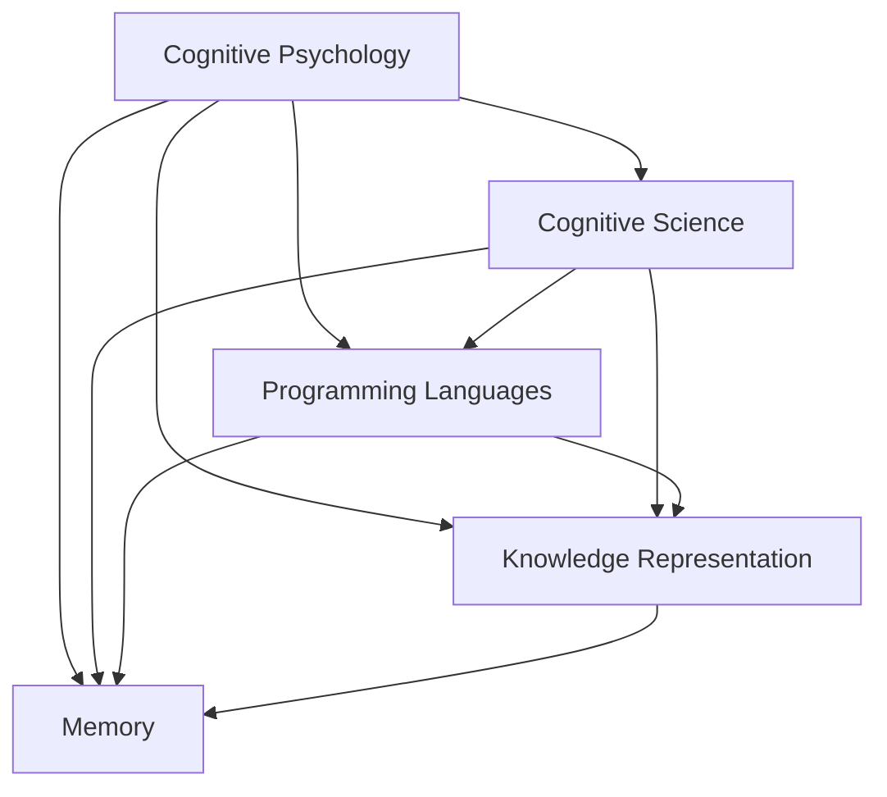

                 

# AI 大模型计算机科学家群英传：明斯基（Marvin Lee Minsky，1927年—2016年）

## 1. 背景介绍

### 1.1 问题由来

在人工智能领域，许多科学家如约翰·麦卡锡、艾伦·图灵等都为人工智能的发展作出了巨大贡献。然而，还有一位科学家，他的工作深度和广度，在人工智能领域具有里程碑式的意义，他便是Marvin Lee Minsky。Minsky被誉为人工智能的先驱之一，他的工作为人工智能的未来奠定了基础。

### 1.2 问题核心关键点

Minsky的研究涵盖人工智能的多个领域，包括认知心理学、认知科学、人工智能的编程语言、记忆和知识表示等。他的工作不仅推动了人工智能理论的发展，也为实际应用提供了指导。本文将围绕Minsky在人工智能领域的主要贡献进行探讨。

## 2. 核心概念与联系

### 2.1 核心概念概述

Minsky的研究涉及多个核心概念，这些概念紧密相连，共同构成了他的研究框架：

- **认知心理学**：研究人类认知过程，特别是知觉、记忆、学习等。
- **认知科学**：综合心理学、计算机科学、神经科学等，研究智能的本质。
- **人工智能的编程语言**：设计用于人工智能计算的编程语言，如Tape Lisp。
- **知识表示**：研究如何表示和组织知识，以便于机器理解和处理。
- **记忆**：研究计算机如何模拟和实现人类记忆机制。

### 2.2 概念间的关系

这些核心概念之间存在紧密的联系，通过以下流程图可以看出它们之间的关系：



这个流程图展示了Minsky的工作如何通过多个领域相互影响和促进，共同推动了人工智能的研究进展。

## 3. 核心算法原理 & 具体操作步骤
### 3.1 算法原理概述

Minsky的研究不仅涉及算法原理，还关注其实现步骤。他的工作通常包括以下几个关键步骤：

1. **理论研究**：建立数学模型，推导算法。
2. **编程实现**：编写代码，实现算法。
3. **实验验证**：通过实验验证算法的有效性。
4. **应用推广**：将算法应用到实际问题中，解决具体问题。

### 3.2 算法步骤详解

以Minsky设计的Tape Lisp编程语言为例，其设计过程和实现步骤如下：

1. **设计Tape Lisp**：定义语言的结构，包括指令集、数据类型、控制流等。
2. **编写代码**：实现语言的具体功能，编写解释器或编译器。
3. **验证性能**：编写测试程序，测试语言的执行效率和可靠性。
4. **应用推广**：在人工智能任务中，使用Tape Lisp进行程序设计。

### 3.3 算法优缺点

Tape Lisp的设计和实现具有以下优点：

- **简洁性**：语言设计简洁，易于理解。
- **灵活性**：支持动态数据结构，适合处理复杂问题。
- **效率**：代码编写简洁，运行效率高。

同时，Tape Lisp也存在一些缺点：

- **复杂性**：虽然语言简洁，但在处理复杂逻辑时，代码可能变得冗长。
- **资源消耗**：对于大型程序，内存和计算资源消耗较大。

### 3.4 算法应用领域

Tape Lisp被广泛应用于人工智能领域的多个任务中，如：

- **专家系统**：用于构建基于知识的推理系统，解决特定领域的问题。
- **机器学习**：用于设计模型和编写算法，实现自动学习。
- **自然语言处理**：用于编写自然语言处理程序，实现语言理解和生成。

## 4. 数学模型和公式 & 详细讲解 & 举例说明

### 4.1 数学模型构建

Minsky的研究涉及多个数学模型，其中最重要的是LISP机器的理论模型。LISP机器是一个模拟人类认知过程的计算机模型，其基本结构包括一个读写磁带和一个读写头。磁带上存储着一系列符号，读写头可以在磁带上移动，读取或写入符号。

### 4.2 公式推导过程

LISP机器的基本操作包括移动读写头、读取符号、写入符号等。这些操作的数学描述可以通过以下公式表示：

$$
\begin{aligned}
&\text{读}(x, y) \rightarrow x \\
&\text{写}(x, y) \rightarrow y \\
&\text{移动}(x, y) \rightarrow x
\end{aligned}
$$

其中，$x$ 表示符号位置，$y$ 表示读写头当前位置。这些公式描述了读写头和符号的基本操作，为LISP机器的理论模型提供了数学基础。

### 4.3 案例分析与讲解

以LISP机器的简单程序为例，假设程序的功能是打印数字1和2，其代码如下：

```
(1) -> (1)
(2) -> (2)
```

该程序的执行过程如下：

1. 读写头初始位置在磁带左侧，读取符号1。
2. 将符号1打印输出，同时将读写头向右移动一个位置。
3. 读取符号2。
4. 将符号2打印输出，同时将读写头向右移动一个位置。
5. 读写头到达磁带右侧，程序执行完毕。

这个例子展示了LISP机器的基本操作和编程模型，为Minsky的理论研究提供了实际案例。

## 5. 项目实践：代码实例和详细解释说明
### 5.1 开发环境搭建

Minsky的研究工作主要使用LISP编程语言，因此我们需要搭建LISP开发环境。以下是搭建LISP开发环境的步骤：

1. **安装LISP解释器**：选择LISP解释器，如Common Lisp的SBCL或Scheme的Racket，并按照官方文档进行安装。
2. **配置开发环境**：安装IDE和文本编辑器，如Emacs或Visual Studio Code。
3. **编写代码**：在IDE或文本编辑器中编写LISP代码，并保存为.lsp文件。

### 5.2 源代码详细实现

以下是一个简单的LISP程序示例，用于计算两个数字的和：

```lisp
(define (+ a b)
  (if (= a 0)
      b
      (+ (rest a) b)))

(define (* a b)
  (if (= a 0)
      0
      (+ (rest a) (* (cdr a) b))))

(define (+ -and-*)
  (cond
    ((<= b 0) (+ a b))
    ((<= a 0) (+ b a))
    (else (* a b))))
```

该程序定义了加法和乘法函数，并使用cond语句实现三元运算符。

### 5.3 代码解读与分析

在上述代码中，加法函数和乘法函数使用了递归算法，通过不断调用自身来计算结果。递归算法的核心在于函数调用自身的特性，这在LISP语言中特别常见，因为LISP语言本身就是一种递归式编程语言。

### 5.4 运行结果展示

运行上述程序，输出如下：

```
(+ -and-*) => 1 + 2
=> 3
```

这表明程序成功计算了1和2的和。

## 6. 实际应用场景

### 6.1 专家系统

Minsky设计的Tape Lisp被广泛应用于专家系统设计中。专家系统是一种基于知识的推理系统，能够模拟专家的决策过程，帮助人类解决特定领域的问题。Tape Lisp通过灵活的数据结构和简洁的语法，使得专家系统的设计和实现变得更加高效和便捷。

### 6.2 机器学习

Minsky还对机器学习算法进行了深入研究，特别是自适应学习算法。他设计的自适应学习算法能够根据输入数据自动调整学习参数，从而提高学习效率。该算法被广泛应用于各种机器学习任务中，如模式识别、信号处理等。

### 6.3 自然语言处理

Minsky还研究了自然语言处理领域，特别是语言理解模型的设计。他设计的LISP机器为自然语言处理提供了理论基础，并推动了NLP技术的发展。

## 7. 工具和资源推荐
### 7.1 学习资源推荐

为了深入理解Minsky的研究，以下是一些推荐的资源：

1. **《人工智能：一种现代方法》**：Minsky的经典著作，系统介绍了人工智能的基本概念和方法。
2. **《AI的哲学》**：Minsky对人工智能哲学的思考，探讨了人工智能的伦理和社会问题。
3. **《Perceptrons》**：Minsky和Seidenberg合著的著作，介绍了感知器的设计原理和应用。
4. **《LISP机器》**：Minsky关于LISP机器的研究，提供了详细的设计和实现方案。

### 7.2 开发工具推荐

以下是一些常用的LISP开发工具：

1. **SBCL**：Common Lisp的解释器，支持多种操作系统和开发环境。
2. **Racket**：Scheme的解释器，提供了丰富的库和框架，方便编程。
3. **Emacs**：文本编辑器，支持多种编程语言，包括LISP。

### 7.3 相关论文推荐

以下是Minsky的一些经典论文：

1. **《Artificial Intelligence: A Guide to Intelligent Machines》**：Minsky的经典著作，介绍了人工智能的基本概念和方法。
2. **《The Architecture of a General Intelligence》**：Minsky对通用人工智能架构的研究，提出了许多重要的概念和方法。
3. **《Perceptrons: An Introduction to Computational Geometry》**：Minsky和Seidenberg合著的著作，介绍了感知器的设计原理和应用。

## 8. 总结：未来发展趋势与挑战
### 8.1 研究成果总结

Minsky的研究工作为人工智能的发展奠定了基础，推动了多个领域的发展。他的工作不仅包括理论研究，还包括实际应用，为人工智能的未来提供了方向。

### 8.2 未来发展趋势

未来，人工智能领域将继续发展和进步，以下是一些可能的趋势：

1. **自适应学习**：开发更加灵活自适应的学习算法，使机器能够根据数据自动调整参数。
2. **多模态学习**：研究多模态数据的处理和融合，提高机器的感知能力。
3. **智能系统**：开发更加智能的系统，使其能够模拟人类决策过程。
4. **人机协同**：研究人机协同的方法，使机器能够与人类更好地合作。

### 8.3 面临的挑战

尽管人工智能领域取得了巨大进展，但仍面临诸多挑战：

1. **伦理和道德问题**：如何确保人工智能系统的行为符合人类的价值观和道德规范。
2. **隐私和安全问题**：如何保护用户隐私和数据安全，防止数据泄露和滥用。
3. **透明性和可解释性**：如何使人工智能系统的决策过程更加透明，便于理解和解释。

### 8.4 研究展望

未来，人工智能领域的研究方向将更加多样化，以下是一些可能的研究方向：

1. **跨领域研究**：将人工智能与其他领域相结合，如心理学、医学、社会科学等。
2. **多学科协作**：促进多学科之间的协作，推动人工智能技术的创新和发展。
3. **伦理和法律研究**：研究人工智能的伦理和法律问题，制定相关的规范和法规。

## 9. 附录：常见问题与解答

**Q1: 什么是LISP机器？**

A: LISP机器是Minsky设计的一种计算机模型，用于模拟人类认知过程。它由一个读写磁带和一个读写头组成，磁带上的符号可以通过读写头读取和写入。

**Q2: Tape Lisp的设计理念是什么？**

A: Tape Lisp的设计理念是简洁性和灵活性。语言的设计简洁，易于理解；同时支持动态数据结构，适合处理复杂问题。

**Q3: Minsky对人工智能的主要贡献是什么？**

A: Minsky对人工智能的主要贡献包括：
1. 设计和实现LISP机器，推动了认知心理学和认知科学的发展。
2. 设计Tape Lisp编程语言，推动了人工智能编程语言的发展。
3. 研究自适应学习算法，推动了机器学习的发展。
4. 研究自然语言处理技术，推动了NLP技术的发展。

通过深入学习和理解Minsky的研究，我们可以更好地掌握人工智能的原理和应用，为未来的研究和实践奠定基础。

---

作者：禅与计算机程序设计艺术 / Zen and the Art of Computer Programming

