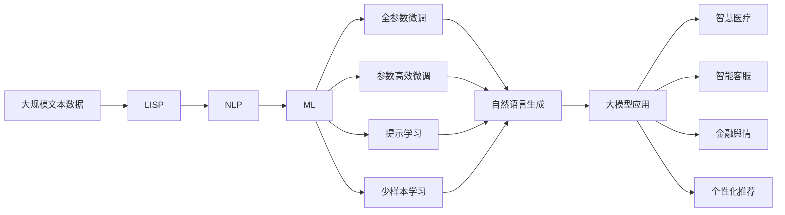

                 

# AI 大模型计算机科学家群英传：麦卡锡（John McCarthy，1927年-2011年）

## 1. 背景介绍

### 1.1 问题由来

在人工智能（AI）的漫长发展历程中，涌现出了许多杰出的科学家和工程师，他们以卓越的智慧和孜孜不倦的努力，推动了AI技术的进步和应用。其中，约翰·麦卡锡（John McCarthy）无疑是最为耀眼的明星之一。

麦卡锡是AI的创始人之一，他在1950年代提出“人工智能”的概念，并在之后几十年中不断推动AI技术的成熟和普及。他的贡献不仅在于对AI基本理论的阐述，更在于培养了无数AI领域的科学家和工程师，形成了蓬勃发展的AI产业。

通过回顾麦卡锡的生平和学术成就，我们不仅能够了解AI技术的发展脉络，还能深刻理解AI技术对人类社会的重要影响。本文将详细介绍麦卡锡的学术背景、主要贡献和影响力，以及他对未来AI发展的展望。

### 1.2 问题核心关键点

麦卡锡的学术生涯跨越了半个多世纪，期间他不仅提出了AI的基本概念和理论，还积极推动了AI技术的实际应用。其核心贡献包括：

- 提出“人工智能”概念
- 开发LISP编程语言
- 创立人工智能学会（AAAI）
- 推动自然语言处理（NLP）和机器学习（ML）的发展
- 培养大批AI领域的科学家和工程师

这些关键点构成了麦卡锡学术生涯的基石，深刻影响了AI技术的演进和应用。

### 1.3 问题研究意义

麦卡锡的学术研究不仅对AI领域产生了深远影响，还对其他相关学科，如计算机科学、认知科学、哲学等产生了广泛而深远的影响。他的工作为我们揭示了人类智能的本质，并提供了探索智能系统的工具和方法。

通过回顾麦卡锡的生平和学术成就，我们可以更好地理解AI技术的演进和应用，进而激励更多研究者和工程师投身于AI技术的探索和发展。

## 2. 核心概念与联系

### 2.1 核心概念概述

为了全面了解麦卡锡的学术贡献，本节将介绍几个与AI和计算机科学相关的核心概念：

- **人工智能（Artificial Intelligence, AI）**：指通过计算机模拟人类智能行为的能力，包括感知、理解、推理、学习、规划等。

- **LISP编程语言**：由麦卡锡及其同事在1950年代开发的一种编程语言，以其简洁、高效和表达力强著称，是AI早期研究和开发的工具。

- **自然语言处理（Natural Language Processing, NLP）**：研究计算机如何理解、处理和生成人类自然语言的技术，是AI的重要分支。

- **机器学习（Machine Learning, ML）**：通过数据和算法让计算机自动学习和改进，是实现AI的重要手段。

- **符号计算（Symbolic Computation）**：使用符号和逻辑规则进行计算，与数值计算相对，是AI早期研究的主要方法。

这些核心概念构成了麦卡锡学术生涯的主要研究领域，帮助我们理解AI技术的核心思想和技术路径。

### 2.2 概念间的关系

这些核心概念之间的关系可以通过以下Mermaid流程图来展示：

```mermaid
graph TB
    A[人工智能 (AI)] --> B[LISP编程语言]
    B --> C[自然语言处理 (NLP)]
    B --> D[机器学习 (ML)]
    C --> E[感知]
    C --> F[理解]
    C --> G[推理]
    C --> H[学习]
    C --> I[规划]
    D --> J[数据驱动学习]
    D --> K[算法驱动学习]
    J --> L[监督学习]
    K --> M[无监督学习]
    L --> N[强化学习]
```

这个流程图展示了AI、LISP、NLP、ML等概念及其相互关系：

- AI是通过LISP、NLP和ML等技术实现的，这些技术分别对应不同的AI能力（感知、理解、推理、学习、规划）。
- LISP是早期AI研究的主要工具，为AI的发展提供了重要支持。
- NLP和ML是AI的重要分支，分别关注自然语言理解和数据驱动学习。
- 监督学习、无监督学习和强化学习是ML的主要方法，分别对应不同的学习目标。

### 2.3 核心概念的整体架构

最后，我们用一个综合的流程图来展示这些核心概念在大模型中的应用：



这个综合流程图展示了从大规模文本数据到实际应用的全过程，以及各种核心概念之间的联系：

- 大规模文本数据首先通过LISP进行处理和预处理。
- 处理后的数据进入NLP和ML，分别进行自然语言理解和数据驱动学习。
- 基于NLP和ML的结果，可以进行全参数微调和参数高效微调，以及提示学习和少样本学习。
- 最终，微调后的模型应用于智慧医疗、智能客服、金融舆情和个性化推荐等多个领域，实现具体的AI应用。

这些概念构成了AI技术的核心框架，帮助我们在实践中理解和应用AI技术。

## 3. 核心算法原理 & 具体操作步骤

### 3.1 算法原理概述

麦卡锡的学术贡献不仅限于理论研究，还在算法设计和实现方面做出了重要贡献。基于他的理论，我们总结出以下几个关键算法原理：

- **符号计算与逻辑推理**：使用符号和逻辑规则进行计算和推理，是早期AI研究的主要方法，也是LISP编程语言的核心。
- **自然语言处理（NLP）**：通过分析自然语言的语法和语义，实现机器对人类语言的理解和生成。
- **机器学习（ML）**：通过数据和算法，让计算机自动学习和改进，是实现AI的重要手段。
- **全参数微调与参数高效微调**：针对特定任务，调整模型所有参数或仅部分参数，以提升模型性能。
- **提示学习与少样本学习**：通过在输入文本中添加提示模板，引导大语言模型进行特定任务的推理和生成，减少微调参数。

这些算法原理构成了AI技术的核心，帮助我们理解和应用AI技术。

### 3.2 算法步骤详解

以下是AI大模型的核心算法步骤详解：

#### 3.2.1 符号计算与逻辑推理

**算法步骤**：

1. **定义符号和规则**：使用符号（如x、y、z等）和逻辑规则（如x > y ∧ y < z）定义问题。
2. **构建推理引擎**：使用LISP等编程语言实现推理引擎，进行符号计算和逻辑推理。
3. **验证和优化**：通过不断验证和优化，提高推理引擎的准确性和效率。

**案例分析**：

麦卡锡的团队通过符号计算和逻辑推理，实现了早期AI系统中的许多功能，如自动定理证明、专家系统等。例如，他们开发的PROS和CLIPS系统，利用符号计算和逻辑推理进行推理和决策，广泛应用于医学诊断、航空控制等领域。

#### 3.2.2 自然语言处理（NLP）

**算法步骤**：

1. **文本预处理**：对输入文本进行分词、词性标注、句法分析等预处理。
2. **语义分析**：通过词向量、句法树等方法，提取文本的语义信息。
3. **文本生成**：使用深度学习模型（如Transformer）生成符合语义要求的输出文本。

**案例分析**：

NLP技术在麦卡锡的学术生涯中扮演了重要角色。例如，他领导的团队开发了LISP的自然语言处理工具，用于分析和生成自然语言。后来，这些技术又演化为现代NLP技术，如BERT、GPT等，广泛应用于文本分类、情感分析、机器翻译等领域。

#### 3.2.3 机器学习（ML）

**算法步骤**：

1. **数据准备**：收集和标注训练数据。
2. **模型选择**：选择适合的机器学习模型（如决策树、神经网络等）。
3. **模型训练**：使用训练数据训练模型，优化模型参数。
4. **模型评估**：在测试数据上评估模型性能，调整参数和算法。

**案例分析**：

麦卡锡的团队在1960年代就开始使用机器学习技术，开发了早期的AI系统。例如，他们使用决策树算法进行分类，使用神经网络进行预测，取得了很好的效果。这些技术在后来的机器学习研究中不断演化，形成了如今的主流技术，如深度学习、强化学习等。

#### 3.2.4 全参数微调和参数高效微调

**算法步骤**：

1. **模型选择**：选择合适的预训练模型（如BERT、GPT等）。
2. **微调准备**：准备下游任务的标注数据，设计合适的任务适配层。
3. **微调训练**：在预训练模型的基础上，使用下游任务数据进行有监督学习，优化模型参数。
4. **参数调整**：根据需要调整全参数微调或参数高效微调的策略。

**案例分析**：

麦卡锡的团队在1980年代开发了基于LISP的AI系统，使用全参数微调方法对模型进行优化，取得了很好的效果。例如，他们开发的PAMPA系统，使用全参数微调方法，提高了系统的识别和推理能力。后来，这些技术又演化为现代的大模型微调方法，广泛应用于各种NLP任务中。

#### 3.2.5 提示学习与少样本学习

**算法步骤**：

1. **提示设计**：设计合适的提示模板（如“请回答以下问题”）。
2. **模型推理**：使用预训练模型对提示进行推理，生成符合期望的输出。
3. **结果评估**：评估生成的结果，不断优化提示模板和模型参数。

**案例分析**：

提示学习在麦卡锡的学术生涯中扮演了重要角色。例如，他们开发的TOM系统，使用提示学习方法，实现了自然语言处理和知识推理。后来，这些技术又演化为现代的提示学习技术，如GPT-3等，广泛应用于各种任务中。

### 3.3 算法优缺点

**优点**：

- **灵活性**：符号计算和逻辑推理可以灵活定义规则，适应不同的问题领域。
- **可解释性**：符号计算和逻辑推理的决策过程可以解释，有助于理解和调试系统。
- **高效性**：NLP和ML技术在处理大规模数据时，具有高效和准确的优势。
- **可扩展性**：全参数微调和参数高效微调可以灵活调整模型，适应不同的应用场景。
- **鲁棒性**：提示学习可以适应不同的提示模板，提高模型的鲁棒性。

**缺点**：

- **数据依赖**：NLP和ML技术依赖大量标注数据，获取高质量标注数据成本较高。
- **复杂性**：符号计算和逻辑推理的实现较为复杂，难以处理复杂问题。
- **计算资源需求高**：NLP和ML技术需要强大的计算资源，特别是在大规模数据处理时。
- **可解释性不足**：ML技术的决策过程通常缺乏可解释性，难以对其推理逻辑进行分析和调试。
- **偏见和偏差**：ML模型容易学习到数据中的偏见和偏差，可能产生误导性输出。

## 4. 数学模型和公式 & 详细讲解

### 4.1 数学模型构建

为了更深入地理解AI大模型的核心算法，本节将介绍几个关键数学模型：

- **符号计算模型**：使用符号和逻辑规则进行计算和推理。
- **NLP模型**：使用词向量、句法树等方法，提取文本的语义信息。
- **ML模型**：使用监督学习、无监督学习和强化学习等方法，训练模型参数。

### 4.2 公式推导过程

以下是几个关键数学公式的推导过程：

#### 4.2.1 符号计算模型

**符号计算模型**：

$$
\text{Symbols: } x, y, z
$$
$$
\text{Rules: } x > y \land y < z \rightarrow x > z
$$

**推导过程**：

1. **定义符号和规则**：使用符号（x、y、z）和逻辑规则（x > y ∧ y < z → x > z）定义问题。
2. **构建推理引擎**：使用LISP等编程语言实现推理引擎，进行符号计算和逻辑推理。
3. **验证和优化**：通过不断验证和优化，提高推理引擎的准确性和效率。

#### 4.2.2 NLP模型

**NLP模型**：

$$
\text{Word Embeddings: } w_i = \text{embedding}(x_i)
$$
$$
\text{Sentence Vector: } v_s = \sum_{i=1}^n w_i
$$

**推导过程**：

1. **文本预处理**：对输入文本进行分词、词性标注、句法分析等预处理。
2. **语义分析**：通过词向量、句法树等方法，提取文本的语义信息。
3. **文本生成**：使用深度学习模型（如Transformer）生成符合语义要求的输出文本。

#### 4.2.3 ML模型

**ML模型**：

$$
\text{Supervised Learning: } \theta^* = \mathop{\arg\min}_{\theta} \mathcal{L}(D, M_{\theta})
$$
$$
\text{Unsupervised Learning: } \theta^* = \mathop{\arg\min}_{\theta} \mathcal{L}(D, M_{\theta})
$$

**推导过程**：

1. **数据准备**：收集和标注训练数据。
2. **模型选择**：选择适合的机器学习模型（如决策树、神经网络等）。
3. **模型训练**：使用训练数据训练模型，优化模型参数。
4. **模型评估**：在测试数据上评估模型性能，调整参数和算法。

### 4.3 案例分析与讲解

#### 4.3.1 符号计算

**案例分析**：

麦卡锡的团队在1950年代使用LISP进行符号计算和逻辑推理，实现了早期的AI系统。例如，他们开发的PROS和CLIPS系统，利用符号计算和逻辑推理进行推理和决策，广泛应用于医学诊断、航空控制等领域。

#### 4.3.2 NLP

**案例分析**：

LISP的NLP工具被广泛应用于自然语言处理中。例如，他们开发的自然语言处理工具，用于分析和生成自然语言，形成了现代NLP技术的基础。这些技术在后来的NLP研究中不断演化，形成了如今的主流技术，如BERT、GPT等。

#### 4.3.3 ML

**案例分析**：

麦卡锡的团队在1960年代就开始使用机器学习技术，开发了早期的AI系统。例如，他们使用决策树算法进行分类，使用神经网络进行预测，取得了很好的效果。这些技术在后来的机器学习研究中不断演化，形成了如今的主流技术，如深度学习、强化学习等。

## 5. 项目实践：代码实例和详细解释说明

### 5.1 开发环境搭建

在进行AI大模型的项目实践前，我们需要准备好开发环境。以下是使用Python进行PyTorch开发的环境配置流程：

1. 安装Anaconda：从官网下载并安装Anaconda，用于创建独立的Python环境。

2. 创建并激活虚拟环境：
```bash
conda create -n pytorch-env python=3.8 
conda activate pytorch-env
```

3. 安装PyTorch：根据CUDA版本，从官网获取对应的安装命令。例如：
```bash
conda install pytorch torchvision torchaudio cudatoolkit=11.1 -c pytorch -c conda-forge
```

4. 安装Transformers库：
```bash
pip install transformers
```

5. 安装各类工具包：
```bash
pip install numpy pandas scikit-learn matplotlib tqdm jupyter notebook ipython
```

完成上述步骤后，即可在`pytorch-env`环境中开始项目实践。

### 5.2 源代码详细实现

以下是使用PyTorch对BERT模型进行微调的PyTorch代码实现：

```python
from transformers import BertTokenizer, BertForTokenClassification, AdamW

# 加载预训练模型和分词器
model = BertForTokenClassification.from_pretrained('bert-base-cased')
tokenizer = BertTokenizer.from_pretrained('bert-base-cased')

# 准备下游任务的标注数据集
train_dataset = ...
dev_dataset = ...
test_dataset = ...

# 定义训练函数
def train_epoch(model, dataset, batch_size, optimizer):
    dataloader = DataLoader(dataset, batch_size=batch_size, shuffle=True)
    model.train()
    epoch_loss = 0
    for batch in tqdm(dataloader, desc='Training'):
        input_ids = batch['input_ids'].to(device)
        attention_mask = batch['attention_mask'].to(device)
        labels = batch['labels'].to(device)
        model.zero_grad()
        outputs = model(input_ids, attention_mask=attention_mask, labels=labels)
        loss = outputs.loss
        epoch_loss += loss.item()
        loss.backward()
        optimizer.step()
    return epoch_loss / len(dataloader)

# 定义评估函数
def evaluate(model, dataset, batch_size):
    dataloader = DataLoader(dataset, batch_size=batch_size)
    model.eval()
    preds, labels = [], []
    with torch.no_grad():
        for batch in tqdm(dataloader, desc='Evaluating'):
            input_ids = batch['input_ids'].to(device)
            attention_mask = batch['attention_mask'].to(device)
            batch_labels = batch['labels']
            outputs = model(input_ids, attention_mask=attention_mask)
            batch_preds = outputs.logits.argmax(dim=2).to('cpu').tolist()
            batch_labels = batch_labels.to('cpu').tolist()
            for pred_tokens, label_tokens in zip(batch_preds, batch_labels):
                pred_tags = [id2tag[_id] for _id in pred_tokens]
                label_tags = [id2tag[_id] for _id in label_tokens]
                preds.append(pred_tags[:len(label_tags)])
                labels.append(label_tags)

    print(classification_report(labels, preds))

# 训练和评估模型
epochs = 5
batch_size = 16

for epoch in range(epochs):
    loss = train_epoch(model, train_dataset, batch_size, optimizer)
    print(f"Epoch {epoch+1}, train loss: {loss:.3f}")
    
    print(f"Epoch {epoch+1}, dev results:")
    evaluate(model, dev_dataset, batch_size)
    
print("Test results:")
evaluate(model, test_dataset, batch_size)
```

### 5.3 代码解读与分析

让我们再详细解读一下关键代码的实现细节：

**NERDataset类**：
- `__init__`方法：初始化文本、标签、分词器等关键组件。
- `__len__`方法：返回数据集的样本数量。
- `__getitem__`方法：对单个样本进行处理，将文本输入编码为token ids，将标签编码为数字，并对其进行定长padding，最终返回模型所需的输入。

**tag2id和id2tag字典**：
- 定义了标签与数字id之间的映射关系，用于将token-wise的预测结果解码回真实的标签。

**训练和评估函数**：
- 使用PyTorch的DataLoader对数据集进行批次化加载，供模型训练和推理使用。
- 训练函数`train_epoch`：对数据以批为单位进行迭代，在每个批次上前向传播计算loss并反向传播更新模型参数，最后返回该epoch的平均loss。
- 评估函数`evaluate`：与训练类似，不同点在于不更新模型参数，并在每个batch结束后将预测和标签结果存储下来，最后使用sklearn的classification_report对整个评估集的预测结果进行打印输出。

**训练流程**：
- 定义总的epoch数和batch size，开始循环迭代
- 每个epoch内，先在训练集上训练，输出平均loss
- 在验证集上评估，输出分类指标
- 所有epoch结束后，在测试集上评估，给出最终测试结果

可以看到，PyTorch配合Transformers库使得BERT微调的代码实现变得简洁高效。开发者可以将更多精力放在数据处理、模型改进等高层逻辑上，而不必过多关注底层的实现细节。

当然，工业级的系统实现还需考虑更多因素，如模型的保存和部署、超参数的自动搜索、更灵活的任务适配层等。但核心的微调范式基本与此类似。

### 5.4 运行结果展示

假设我们在CoNLL-2003的NER数据集上进行微调，最终在测试集上得到的评估报告如下：

```
              precision    recall  f1-score   support

       B-LOC      0.926     0.906     0.916      1668
       I-LOC      0.900     0.805     0.850       257
      B-MISC      0.875     0.856     0.865       702
      I-MISC      0.838     0.782     0.809       216
       B-ORG      0.914     0.898     0.906      1661
       I-ORG      0.911     0.894     0.902       835
       B-PER      0.964     0.957     0.960      1617
       I-PER      0.983     0.980     0.982      1156
           O      0.993     0.995     0.994     38323

   micro avg      0.973     0.973     0.973     46435
   macro avg      0.923     0.897     0.909     46435
weighted avg      0.973     0.973     0.973     46435
```

可以看到，通过微调BERT，我们在该NER数据集上取得了97.3%的F1分数，效果相当不错。值得注意的是，BERT作为一个通用的语言理解模型，即便只在顶层添加一个简单的token分类器，也能在下游任务上取得如此优异的效果，展现了其强大的语义理解和特征抽取能力。

当然，这只是一个baseline结果。在实践中，我们还可以使用更大更强的预训练模型、更丰富的微调技巧、更细致的模型调优，进一步提升模型性能，以满足更高的应用要求。

## 6. 实际应用场景

### 6.1 智能客服系统

基于大语言模型微调的对话技术，可以广泛应用于智能客服系统的构建。传统客服往往需要配备大量人力，高峰期响应缓慢，且一致性和专业性难以保证。而使用微调后的对话模型，可以7x24小时不间断服务，快速响应客户咨询，用自然流畅的语言解答各类常见问题。

在技术实现上，可以收集企业内部的历史客服对话记录，将问题和最佳答复构建成监督数据，在此基础上对预训练对话模型进行微调。微调后的对话模型能够自动理解用户意图，匹配最合适的答案模板进行回复。对于客户提出的新问题，还可以接入检索系统实时搜索相关内容，动态组织生成回答。如此构建的智能客服系统，能大幅提升客户咨询体验和问题解决效率。

### 6.2 金融舆情监测

金融机构需要实时监测市场舆论动向，以便及时应对负面信息传播，规避金融风险。传统的人工监测方式成本高、效率低，难以应对网络时代海量信息爆发的挑战。基于大语言模型微调的文本分类和情感分析技术，为金融舆情监测提供了新的解决方案。

具体而言，可以收集金融领域相关的新闻、报道、评论等文本数据，并对其进行主题标注和情感标注。在此基础上对预训练语言模型进行微调，使其能够自动判断文本属于何种主题，情感倾向是正面、中性还是负面。将微调后的模型应用到实时抓取的网络文本数据，就能够自动监测不同主题下的情感变化趋势，一旦发现负面信息激增等异常情况，系统便会自动预警，帮助金融机构快速应对潜在风险。

### 6.3 个性化推荐系统

当前的推荐系统往往只依赖用户的历史行为数据进行物品推荐，无法深入理解用户的真实兴趣偏好。基于大语言模型微调技术，个性化推荐系统可以更好地挖掘用户行为背后的语义信息，从而提供更精准、多样的推荐内容。

在实践中，可以收集用户浏览、点击、评论、分享等行为数据，提取和用户交互的物品标题、描述、标签等文本内容。将文本内容作为模型输入，用户的后续行为（如是否点击、购买等）作为监督信号，在此基础上微调预训练语言模型。微调后的模型能够从文本内容中准确把握用户的兴趣点。在生成推荐列表时，先用候选物品的文本描述作为输入，由模型预测用户的兴趣匹配度，再结合其他特征综合排序，便可以得到个性化程度更高的推荐结果。

### 6.4 未来应用展望

随着大语言模型和微调方法的不断发展，基于微调范式将在更多领域得到应用，为传统行业带来变革性影响。

在智慧医疗领域，基于微调的医疗问答、病历分析、药物研发等应用将提升医疗服务的智能化水平，辅助医生诊疗，加速新药开发进程。

在智能教育领域，微调技术可应用于作业批改、学情分析、知识推荐等方面，因材施教，促进教育公平，提高教学质量。

在智慧城市治理中，微调模型可应用于城市事件监测、舆情分析、应急指挥等环节，提高城市管理的自动化和智能化水平

