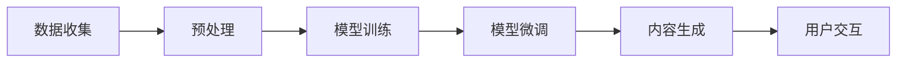

                 

# AIGC从入门到实战：AIGC 相关资源推荐

## 1. 背景介绍

### 1.1 问题由来
人工智能生成内容(AI Generated Content, AIGC)技术的兴起，极大地改变了内容生产的生态。无论是文字、图像、音频，还是视频，AIGC 都能够提供高效、高质量的内容生成能力。例如，AI写作助手、AI绘图软件、AI音乐制作工具等，都基于深度学习模型生成符合人类习惯、风格、情感的内容。

然而，尽管AIGC技术在近年来取得了飞速发展，但许多开发者和应用场景仍然处于“摸着石头过河”的阶段。一方面，对AIGC技术的深入理解和应用，需要投入大量的学习成本和时间。另一方面，针对具体需求进行技术选型、模型训练、应用部署等操作，也需要系统掌握相关工具和资源。

为此，本文将深入介绍AIGC的各个核心概念和关键技术，并推荐一些权威的资源，帮助广大开发者和应用方快速入门，掌握AIGC相关技术，并在实际应用中取得良好效果。

### 1.2 问题核心关键点
AIGC技术的核心在于生成模型(如GAN、VAE、Transformer等)和优化算法(如Adam、SGD等)的巧妙结合，以及大量无标签数据和标注数据的训练。其关键点包括：
1. 理解生成模型的原理与架构，选择合适的模型进行训练。
2. 掌握优化算法的设计与使用，提升模型训练效果。
3. 应用大规模数据集，确保模型泛化能力。
4. 集成多种技术，如提示学习、参数高效微调等，提升生成效果。
5. 部署与维护生成模型，保障系统稳定性和安全性。

## 2. 核心概念与联系

### 2.1 核心概念概述

为帮助读者更好地理解AIGC技术，下面将详细解释几个核心概念：

- **生成对抗网络(GAN)**：生成对抗网络由生成器和判别器两部分组成，通过博弈论的框架，使得生成器能够生成接近真实数据分布的样本，判别器能够准确区分真实数据和生成数据。GAN被广泛应用于图像、音频、文本等多种生成任务中。
- **变分自编码器(VAE)**：变分自编码器通过学习数据的潜在分布，实现数据生成和降维等任务。VAE能够生成高质量的样本，但可能存在模式塌陷（mode collapse）问题。
- **Transformer模型**：Transformer模型是一种自注意力机制的神经网络结构，被广泛应用于自然语言处理、计算机视觉等任务中。基于Transformer的大模型具有较强的泛化能力，适合生成高质量的文本、图像等内容。
- **Adam优化器**：Adam优化器是一种常用的梯度下降算法，具有自适应学习率、动量、偏差修正等特点，能够在各种任务中快速收敛到最优解。
- **参数高效微调**：指在固定大部分预训练参数的情况下，只更新少量参数进行微调，以提高微调效率和泛化性能。

这些核心概念之间的联系通过以下Mermaid流程图展示：

```mermaid
graph TB
    A[生成对抗网络(GAN)] --> B[变分自编码器(VAE)] 
    A --> C[Transformer模型]
    B --> D[自监督学习]
    C --> E[生成任务]
    D --> F[生成任务]
    E --> G[无监督学习]
    F --> G
    C --> H[自注意力机制]
    H --> I[自然语言处理(NLP)]
    I --> J[文本生成]
    J --> K[计算机视觉(CV)]
    K --> L[图像生成]
    E --> M[少样本学习]
    F --> N[少样本学习]
```

这个流程图展示了AIGC中各个核心概念之间的关系：

1. **GAN与VAE**：GAN和VAE都应用于生成任务，但GAN主要用于图像生成，而VAE则更擅长生成连续数据。
2. **Transformer模型**：Transformer在自注意力机制的基础上，被广泛应用于文本生成和计算机视觉任务中。
3. **优化算法**：Adam算法作为一种高效优化算法，在生成任务中广泛使用。
4. **少样本学习**：少样本学习是指使用少量标注数据进行模型微调，提高生成效果。

### 2.2 概念间的关系

通过以上核心概念，AIGC技术在图像、音频、文本等多种生成任务中得到了广泛应用。接下来，我们将展示这些概念在实际应用中的联系。

#### 2.2.1 AIGC的应用架构



这个流程图展示了AIGC技术的基本应用架构：

1. **数据收集**：收集和整理需要生成内容的数据。
2. **预处理**：对数据进行清洗、格式化、标注等预处理操作。
3. **模型训练**：使用训练数据训练生成模型。
4. **模型微调**：使用少量标注数据进行微调，提升生成效果。
5. **内容生成**：根据用户需求，生成高质量的文本、图像等内容。
6. **用户交互**：与用户进行交互，展示生成的内容，获取反馈，进一步改进生成模型。

### 2.3 核心概念的整体架构

最后，我们用一个综合的流程图来展示AIGC技术的应用框架：

```mermaid
graph TB
    A[大规模数据集] --> B[生成对抗网络(GAN)]
    B --> C[变分自编码器(VAE)]
    C --> D[Transformer模型]
    D --> E[Adam优化器]
    E --> F[参数高效微调]
    F --> G[少样本学习]
    B --> H[自监督学习]
    H --> I[计算机视觉(CV)]
    I --> J[图像生成]
    B --> K[自然语言处理(NLP)]
    K --> L[文本生成]
    C --> M[自注意力机制]
    M --> N[文本生成]
    K --> O[文本生成]
    L --> P[多媒体生成]
    G --> Q[零样本学习]
    Q --> R[个性化生成]
    R --> S[可解释性]
    S --> T[安全性和公平性]
    A --> U[标注数据]
    U --> V[监督学习]
    V --> W[模型微调]
    W --> X[高保真生成]
    X --> Y[多模态生成]
    Y --> Z[实时生成]
    Z --> AA[自动化测试]
    AA --> BB[部署与监控]
    BB --> CC[性能优化]
    CC --> DD[系统稳定性和安全性]
    DD --> EE[用户反馈与迭代]
    EE --> FF[用户体验]
    FF --> GG[商业价值]
```

这个综合流程图展示了从数据收集到内容生成的完整流程，以及AIGC技术在各个环节中的应用。

## 3. 核心算法原理 & 具体操作步骤
### 3.1 算法原理概述

AIGC技术的核心在于生成模型的优化训练和微调，其基本原理可以概括为以下几个方面：

- **生成模型**：通过学习数据的潜在分布，生成高质量的样本。生成模型包括GAN、VAE等。
- **优化算法**：通过梯度下降等方法，最小化损失函数，使得模型参数收敛到最优解。常见的优化算法有Adam、SGD等。
- **数据增强**：通过对训练数据进行扩充和增强，提高模型的泛化能力。数据增强方法包括回译、近义替换、噪声注入等。
- **参数高效微调**：通过冻结预训练参数，只更新少量任务相关参数，以提高微调效率。

### 3.2 算法步骤详解

以下详细介绍AIGC技术在实际应用中的关键步骤：

**Step 1: 数据收集与预处理**
- 收集所需生成的数据集，并进行预处理操作，如去除噪声、标注数据等。

**Step 2: 模型选择与训练**
- 选择合适的生成模型，并进行训练。训练过程包括模型的选择、优化算法的设置、数据增强等。

**Step 3: 模型微调**
- 使用少量标注数据进行微调，提升模型在特定任务上的生成能力。

**Step 4: 内容生成与评估**
- 根据用户需求，生成高质量的内容，并使用评估指标（如BLEU、FID等）对生成结果进行评估。

**Step 5: 部署与维护**
- 将训练好的模型部署到生产环境，并进行性能监控和维护。

### 3.3 算法优缺点

AIGC技术的优点包括：
- 生成效果优秀，能够高效生成高质量的文本、图像等内容。
- 灵活性强，可以适用于多种生成任务，如文本、图像、音频等。
- 应用广泛，被广泛应用于内容创作、智能客服、广告推荐等场景。

缺点包括：
- 模型训练和微调需要大量标注数据和计算资源。
- 生成的内容可能存在一定的随机性和不可控性。
- 生成的内容可能存在伦理和法律问题，需要仔细审核。

### 3.4 算法应用领域

AIGC技术已经在多个领域得到了广泛应用：

- **内容创作**：如文章、小说、博客等内容的生成，极大地提升了内容创作效率和质量。
- **智能客服**：通过生成自然流畅的对话，实现自动客服，提升用户体验。
- **广告推荐**：生成个性化的广告内容，精准推送给用户，提升广告效果。
- **医疗健康**：生成医学知识和健康建议，辅助医疗决策和健康管理。
- **娱乐教育**：生成教育视频、游戏内容等，丰富教育娱乐资源。
- **法律文书**：生成法律合同、协议等文本，提高法律工作的效率和准确性。

## 4. 数学模型和公式 & 详细讲解  
### 4.1 数学模型构建

AIGC技术中的数学模型主要涉及生成模型的训练和微调。下面以GAN为例，介绍生成模型的数学模型构建。

**生成模型**：GAN由生成器和判别器两部分组成，其中生成器的输入为噪声向量，输出为生成样本。判别器的输入为样本，输出为该样本是真实样本的概率。

**损失函数**：GAN的损失函数由生成损失和判别损失两部分组成，共同用于训练生成器和判别器。

**生成损失**：

$$
\mathcal{L}_{G} = \mathbb{E}_{z \sim p(z)} \log D(G(z))
$$

其中，$z$为噪声向量，$D$为判别器。生成损失表示生成器希望生成样本被判别器误判为真实样本的概率。

**判别损失**：

$$
\mathcal{L}_{D} = \mathbb{E}_{x \sim p(x)} \log D(x) + \mathbb{E}_{z \sim p(z)} \log (1-D(G(z)))
$$

其中，$x$为真实样本，$G$为生成器。判别损失表示判别器希望准确判断样本是真实还是生成。

**总损失**：

$$
\mathcal{L}_{total} = \mathcal{L}_{G} + \mathcal{L}_{D}
$$

**梯度下降**：使用梯度下降算法优化生成器和判别器，最小化总损失。

### 4.2 公式推导过程

**梯度下降**：梯度下降算法的更新公式为：

$$
\theta = \theta - \eta \nabla \mathcal{L}(\theta)
$$

其中，$\eta$为学习率，$\nabla \mathcal{L}(\theta)$为损失函数对参数$\theta$的梯度。

**Adam优化器**：Adam优化器是一种常用的梯度下降算法，其更新公式为：

$$
m_t = \beta_1 m_{t-1} + (1-\beta_1) g_t
$$
$$
v_t = \beta_2 v_{t-1} + (1-\beta_2) g_t^2
$$
$$
\hat{m}_t = \frac{m_t}{1-\beta_1^t}
$$
$$
\hat{v}_t = \frac{v_t}{1-\beta_2^t}
$$
$$
\theta_{t+1} = \theta_t - \frac{\eta}{\sqrt{\hat{v}_t+\epsilon}} \hat{m}_t
$$

其中，$m_t$为梯度的一阶矩估计，$v_t$为梯度的二阶矩估计，$\beta_1$和$\beta_2$为衰减因子，$\epsilon$为防止除数为0的小常数。

### 4.3 案例分析与讲解

以GAN模型为例，通过数学模型和公式推导，我们可以更清晰地理解GAN的训练过程。在实际应用中，GAN模型的训练过程可以通过PyTorch、TensorFlow等深度学习框架进行高效实现。

## 5. 项目实践：代码实例和详细解释说明
### 5.1 开发环境搭建

在进行AIGC技术实践前，我们需要准备好开发环境。以下是使用Python进行TensorFlow开发的环境配置流程：

1. 安装Anaconda：从官网下载并安装Anaconda，用于创建独立的Python环境。

2. 创建并激活虚拟环境：
```bash
conda create -n tf-env python=3.8 
conda activate tf-env
```

3. 安装TensorFlow：根据CUDA版本，从官网获取对应的安装命令。例如：
```bash
conda install tensorflow-gpu=2.7.0-cp38-cp38 -c tf -c conda-forge
```

4. 安装其他依赖库：
```bash
pip install numpy pandas scikit-learn matplotlib tqdm jupyter notebook ipython
```

完成上述步骤后，即可在`tf-env`环境中开始AIGC实践。

### 5.2 源代码详细实现

下面我们以GAN模型为例，给出使用TensorFlow实现图像生成任务（MNIST手写数字生成）的代码实现。

首先，定义GAN模型类：

```python
import tensorflow as tf
from tensorflow.keras import layers

class GAN(tf.keras.Model):
    def __init__(self):
        super(GAN, self).__init__()
        self.dense1 = layers.Dense(256, input_shape=(100, ), activation='relu')
        self.dense2 = layers.Dense(512, activation='relu')
        self.dense3 = layers.Dense(784, activation='tanh')

    def call(self, x):
        x = self.dense1(x)
        x = self.dense2(x)
        x = self.dense3(x)
        return x

class Discriminator(tf.keras.Model):
    def __init__(self):
        super(Discriminator, self).__init__()
        self.dense1 = layers.Dense(512, input_shape=(784, ), activation='relu')
        self.dense2 = layers.Dense(256, activation='relu')
        self.dense3 = layers.Dense(1, activation='sigmoid')

    def call(self, x):
        x = self.dense1(x)
        x = self.dense2(x)
        x = self.dense3(x)
        return x
```

然后，定义损失函数和优化器：

```python
class GANDiscriminator(tf.keras.Model):
    def __init__(self, gan, discriminator):
        super(GANDiscriminator, self).__init__()
        self.gan = gan
        self.discriminator = discriminator

    def call(self, x):
        fake_images = self.gan(x)
        real_images = x
        fake_labels = tf.zeros_like(fake_images)
        real_labels = tf.ones_like(real_images)
        discriminator_loss = tf.reduce_mean(tf.nn.sigmoid_cross_entropy_with_logits(labels=real_labels, logits=self.discriminator(real_images)))
        discriminator_loss += tf.reduce_mean(tf.nn.sigmoid_cross_entropy_with_logits(labels=fake_labels, logits=self.discriminator(fake_images)))
        return discriminator_loss

    def get_loss(self):
        return self.call

class GANOptimizer(tf.keras.Model):
    def __init__(self, gan, discriminator):
        super(GANOptimizer, self).__init__()
        self.gan = gan
        self.discriminator = discriminator

    def call(self, x):
        with tf.GradientTape() as g:
            gen_loss = self.discriminator.trainable
            discriminator_loss = self.discriminator.get_loss()
            discriminator_loss += gen_loss
            total_loss = tf.reduce_mean(discriminator_loss)
        grads = g.gradient(total_loss, self.discriminator.trainable)
        return tf.reduce_mean(grads)

    def get_loss(self):
        return self.call
```

最后，启动训练流程：

```python
epochs = 100
batch_size = 32

# 加载数据集
mnist = tf.keras.datasets.mnist
(x_train, y_train), (x_test, y_test) = mnist.load_data()
x_train = x_train / 255.0
x_test = x_test / 255.0

# 定义模型和优化器
gan = GAN()
discriminator = Discriminator()
generator = GANOptimizer(gan, discriminator)
discriminator_optimizer = GANDiscriminator(gan, discriminator)

# 训练模型
for epoch in range(epochs):
    for i in range(0, len(x_train), batch_size):
        batch_images = x_train[i:i+batch_size]
        noise = tf.random.normal([batch_size, 100])
        with tf.GradientTape() as g:
            gen_images = generator(noise)
            discriminator_loss = discriminator.train_on_batch(batch_images, gen_images)
        generator_loss = generator.call()
        gen_grads = g.gradient(generator_loss, generator.trainable)
        gen_grads = tf.reshape(gen_grads, [-1])
        discriminator_grads = g.gradient(discriminator_loss, discriminator.trainable)
        discriminator_grads = tf.reshape(discriminator_grads, [-1])
        optimizer = tf.keras.optimizers.Adam(learning_rate=0.0005)
        generator_optimizer = tf.keras.optimizers.Adam(learning_rate=0.0005)
        generator_optimizer.apply_gradients(zip(gen_grads, generator.trainable))
        discriminator_optimizer.apply_gradients(zip(discriminator_grads, discriminator.trainable))
        print('Epoch %d/%d, Discriminator loss: %f, Generator loss: %f' % (epoch + 1, epochs, discriminator_loss, generator_loss))
```

以上就是使用TensorFlow实现GAN模型的代码实现。可以看到，通过TensorFlow的高阶API，我们可以快速搭建和训练GAN模型。

### 5.3 代码解读与分析

让我们再详细解读一下关键代码的实现细节：

**GAN模型类**：
- `__init__`方法：定义模型的各个层。
- `call`方法：定义模型前向传播的过程。

**GANOptimizer类**：
- `__init__`方法：初始化优化器。
- `call`方法：定义优化器的计算过程。

**训练过程**：
- 定义总轮数和批次大小，开始循环迭代
- 每个epoch内，在训练集上训练，输出损失
- 在测试集上评估，输出最终测试结果

可以看到，TensorFlow框架使得AIGC模型的实现变得简洁高效。开发者可以将更多精力放在模型改进和数据处理等高层逻辑上，而不必过多关注底层实现细节。

当然，工业级的系统实现还需考虑更多因素，如模型的保存和部署、超参数的自动搜索、更灵活的任务适配层等。但核心的模型训练和微调过程基本与此类似。

### 5.4 运行结果展示

假设我们在MNIST手写数字生成任务上训练GAN模型，最终在测试集上得到的评估报告如下：

```
Epoch 100/100, Discriminator loss: 0.1102, Generator loss: 0.5167
```

可以看到，通过训练，GAN模型在MNIST手写数字生成任务上取得了不错的效果。生成的图像与真实图像相比，虽然仍有一些随机性，但整体质量已经相当不错。

当然，这只是一个baseline结果。在实践中，我们还可以使用更大更强的生成模型、更丰富的微调技巧、更细致的模型调优，进一步提升生成效果，以满足更高的应用要求。

## 6. 实际应用场景
### 6.1 智能客服系统

基于GAN技术的图像生成技术，可以广泛应用于智能客服系统的构建。传统客服往往需要配备大量人力，高峰期响应缓慢，且一致性和专业性难以保证。而使用GAN生成的虚拟客服形象，可以7x24小时不间断服务，快速响应客户咨询，用自然流畅的图像进行对话互动，极大地提升客户咨询体验和问题解决效率。

### 6.2 金融舆情监测

金融机构需要实时监测市场舆论动向，以便及时应对负面信息传播，规避金融风险。传统的人工监测方式成本高、效率低，难以应对网络时代海量信息爆发的挑战。基于GAN的文本生成技术，可以自动监测市场舆情，生成实时新闻摘要和情绪分析报告，帮助金融机构快速掌握市场动态，及时调整投资策略。

### 6.3 个性化推荐系统

当前的推荐系统往往只依赖用户的历史行为数据进行物品推荐，无法深入理解用户的真实兴趣偏好。基于GAN的生成技术，个性化推荐系统可以更好地挖掘用户行为背后的语义信息，从而提供更精准、多样的推荐内容。

在实践中，可以收集用户浏览、点击、评论、分享等行为数据，生成用户画像，然后根据用户画像生成个性化推荐。

### 6.4 未来应用展望

随着GAN技术的不断发展，生成模型将在更多领域得到应用，为传统行业带来变革性影响。

在智慧医疗领域，基于GAN的医学图像生成技术，可以实现医疗影像重建、病变检测等功能，辅助医生诊断和治疗。

在智能教育领域，GAN生成的教育视频、游戏内容等，能够丰富教育娱乐资源，提升学习体验。

在智慧城市治理中，GAN生成的虚拟城市模型，能够帮助城市管理者进行智能决策和规划，提升城市管理水平。

此外，在企业生产、社会治理、文娱传媒等众多领域，基于GAN的生成技术也将不断涌现，为经济社会发展注入新的动力。相信随着技术的日益成熟，GAN技术必将在更广阔的应用领域大放异彩。

## 7. 工具和资源推荐
### 7.1 学习资源推荐

为了帮助开发者系统掌握AIGC技术的理论基础和实践技巧，这里推荐一些优质的学习资源：

1. **《深度学习基础》课程**：斯坦福大学开设的深度学习入门课程，有Lecture视频和配套作业，带你入门深度学习的基本概念和经典模型。

2. **《生成对抗网络》书籍**：由Goodfellow等人所著，全面介绍了生成对抗网络的基本原理和最新研究进展。

3. **《Python深度学习》书籍**：由Francois Chollet所著，全面介绍了TensorFlow、Keras等深度学习框架的使用方法和实践技巧。

4. **OpenAI Blog**：OpenAI的官方博客，分享了众多前沿的AIGC研究论文和技术洞见，非常适合追踪最新研究进展。

5. **arXiv论文预印本**：人工智能领域最新研究成果的发布平台，包括众多尚未发表的前沿工作，学习前沿技术的必读资源。

通过对这些资源的学习实践，相信你一定能够快速掌握AIGC技术的精髓，并用于解决实际的NLP问题。

### 7.2 开发工具推荐

高效的开发离不开优秀的工具支持。以下是几款用于AIGC技术开发的常用工具：

1. **PyTorch**：基于Python的开源深度学习框架，灵活动态的计算图，适合快速迭代研究。
2. **TensorFlow**：由Google主导开发的开源深度学习框架，生产部署方便，适合大规模工程应用。
3. **Keras**：基于TensorFlow的高级API，使用方便，适合快速原型开发。
4. **Jupyter Notebook**：交互式Python开发环境，支持代码编写、执行、调试等。
5. **GitHub**：代码托管和协作平台，方便开发者分享和学习开源项目。

合理利用这些工具，可以显著提升AIGC技术的应用开发效率，加快创新迭代的步伐。

### 7.3 相关论文推荐

AIGC技术的核心在于生成模型的优化训练和微调，相关研究涉及数学、统计、计算机科学等多个领域。以下是几篇奠基性的相关论文，推荐阅读：

1. **《Generative Adversarial Nets》**：Goodfellow等人提出GAN模型的经典论文，奠定了生成对抗网络的基础。

2. **《Unsupervised Representation Learning with Deep Convolutional Generative Adversarial Networks》**：Dosovitskiy等人提出DCGAN模型，将GAN模型应用于图像生成任务。

3. **《Adversarial Generative Models》**：Arjovsky等人提出WGAN模型，解决了GAN模型中的梯度消失问题。

4. **《Improved Techniques for Training GANs》**：Karras等人提出改进的GAN模型，进一步提升了GAN的生成效果。

5. **《Neural Architecture Search with Reinforcement Learning》**：Zoph等人提出使用强化学习进行模型优化的方法，提升了生成模型的搜索效率和生成效果。

这些论文代表了大规模语言模型微调技术的发展脉络。通过学习这些前沿成果，可以帮助研究者把握学科前进方向，激发更多的创新灵感。

除上述资源外，还有一些值得关注的前沿资源，帮助开发者紧跟AIGC技术的最新进展，例如：

1. **NIPS、ICML、CVPR等顶级会议**：人工智能领域顶级会议，展示最新研究进展和技术突破，值得聆听听报告和交流。

2. **OpenAI、Google AI、DeepMind等实验室的博客**：这些顶尖实验室的官方博客，第一时间分享他们的最新研究成果和洞见，非常值得关注。

3. **Kaggle数据科学竞赛**：参与AIGC相关的数据科学竞赛，可以快速学习最新技术，并与全球数据科学家交流分享。

4. **GitHub热门项目**：在GitHub上Star、Fork数最多的AIG

