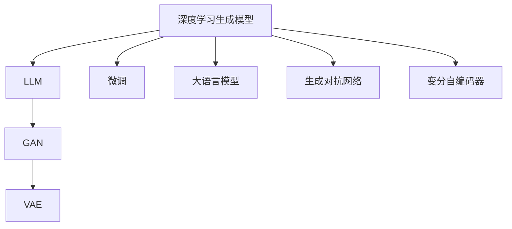
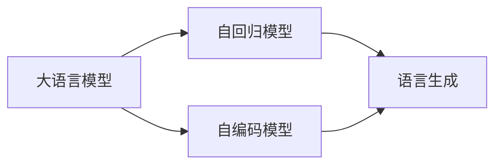
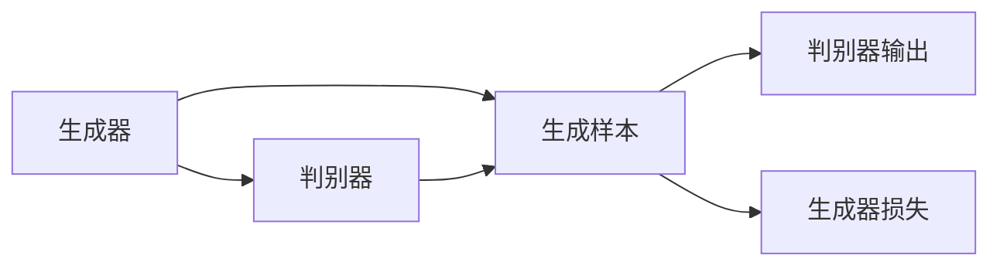
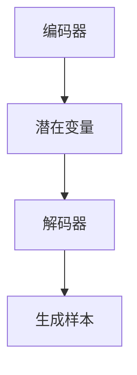
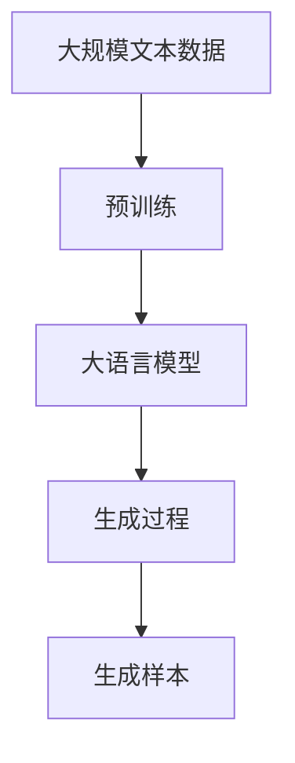

                 

# AIGC从入门到实战：众里寻他千百度：ChatGPT 及其他 AIGC 赋能个人

> 关键词：人工智能生成内容(AIGC), 自然语言处理(NLP), 大语言模型(LLM), 深度学习, 生成对抗网络(GAN), 微调(Fine-tuning), 代码生成, 文本生成, 音乐生成, 图像生成

## 1. 背景介绍

### 1.1 问题由来
近年来，随着人工智能技术的快速发展，人工智能生成内容(AIGC)逐渐成为热门话题。AIGC技术涵盖了自然语言处理(NLP)、计算机视觉、音频生成等多个领域，具有广阔的应用前景。AIGC的关键在于生成模型，包括生成对抗网络(GAN)、大语言模型(LLM)、变分自编码器(VAE)等，这些模型通过深度学习算法，实现了从文本、图像到语音、视频等多种形式的生成任务。

ChatGPT作为AIGC领域的标杆产品，由OpenAI开发，集成了最新的LLM和深度学习技术，能够生成高质量的文本内容。ChatGPT的横空出世，不仅改变了人们与计算机交互的方式，也为AIGC技术提供了新的发展方向。本文将从入门到实战，详细介绍ChatGPT及其他AIGC技术的原理、应用和实践，并探讨其未来发展趋势和挑战。

### 1.2 问题核心关键点
AIGC技术涵盖了文本生成、图像生成、音乐生成等多个领域，但其核心原理和实现方法具有高度一致性。本文聚焦于基于深度学习的生成模型，探讨其核心概念和实现方法，并给出具体应用实例。

**关键点包括：**
- 深度学习生成模型的工作原理。
- ChatGPT及其他AIGC技术的实现细节。
- 生成模型的训练方法与微调技术。
- 生成模型在文本、图像、音乐等不同领域的实际应用。

**主要问题：**
- 深度学习生成模型如何实现高质量内容生成？
- 如何训练和微调生成模型，提高生成效果？
- 生成模型在各个领域的应用效果如何？

**研究意义：**
- 掌握AIGC技术的核心原理和实现方法，有助于开发高效、实用的生成系统。
- 通过实际应用案例，了解生成模型在不同领域的落地效果。
- 探讨AIGC技术面临的挑战，思考未来的发展方向。

## 2. 核心概念与联系

### 2.1 核心概念概述

为更好地理解AIGC技术的核心原理，本节将介绍几个关键概念：

- **深度学习生成模型**：基于深度神经网络模型，能够从数据中学习生成规则，实现从输入到输出的映射。常见的生成模型包括GAN、LLM、VAE等。
- **大语言模型(LLM)**：一种基于自回归或自编码的深度学习模型，通过在大规模无标签文本数据上进行预训练，学习语言的通用表示，具备强大的语言理解和生成能力。如GPT、BERT等。
- **生成对抗网络(GAN)**：一种生成模型，由生成器和判别器两部分组成，通过对抗训练过程，生成逼真、高质量的生成数据。
- **变分自编码器(VAE)**：一种生成模型，通过学习数据的潜在变量分布，生成新的数据样本。
- **微调(Fine-tuning)**：在预训练模型的基础上，使用下游任务的少量标注数据，通过有监督学习优化模型在该任务上的性能。

这些概念之间的联系可以通过以下Mermaid流程图来展示：



这个流程图展示了大语言模型、生成对抗网络、变分自编码器等核心概念及其之间的联系：

1. 深度学习生成模型是AIGC技术的核心，包括大语言模型、生成对抗网络、变分自编码器等。
2. 大语言模型通过自回归或自编码方法实现语言生成和理解。
3. 生成对抗网络通过对抗训练生成逼真数据。
4. 变分自编码器通过学习潜在变量分布生成数据。
5. 微调技术可以在大语言模型、生成对抗网络、变分自编码器等生成模型上进行有监督学习，提升模型性能。

### 2.2 概念间的关系

这些核心概念之间存在着紧密的联系，形成了AIGC技术的完整生态系统。下面我通过几个Mermaid流程图来展示这些概念之间的关系。

#### 2.2.1 大语言模型的生成能力



这个流程图展示了大语言模型的两种主要生成方式：自回归模型和自编码模型，通过预训练和微调，实现了高质量的语言生成能力。

#### 2.2.2 生成对抗网络的基本原理



这个流程图展示了生成对抗网络的基本结构，通过对抗训练过程，生成器逐渐生成逼真的样本，而判别器则用于区分真实样本和生成样本。

#### 2.2.3 变分自编码器的生成过程



这个流程图展示了变分自编码器的生成过程，通过学习数据的潜在变量分布，生成新的数据样本。

### 2.3 核心概念的整体架构

最后，我们用一个综合的流程图来展示这些核心概念在大语言模型生成过程中的整体架构：



这个综合流程图展示了从预训练到生成的完整过程。大语言模型首先在大规模文本数据上进行预训练，然后通过生成过程，生成高质量的样本。通过这些流程，大语言模型在多个领域展示了其强大的生成能力。

## 3. 核心算法原理 & 具体操作步骤
### 3.1 算法原理概述

基于深度学习的生成模型，如大语言模型、生成对抗网络、变分自编码器等，通过训练过程学习数据的生成规则，实现高质量的内容生成。生成模型的核心原理包括：

- **自回归模型**：通过预测序列中每个位置上的值，实现从输入到输出的生成过程。如GPT模型。
- **自编码模型**：通过编码器将输入转换为潜在变量表示，解码器再从潜在变量中生成输出。如BERT模型。
- **生成对抗网络**：通过生成器和判别器两部分组成，生成器和判别器通过对抗训练过程，逐渐生成逼真的数据样本。
- **变分自编码器**：通过学习数据的潜在变量分布，生成新的数据样本。

这些生成模型的关键在于如何高效地训练模型，生成高质量的内容。训练过程通常包括两个步骤：

1. **预训练**：在大规模无标签数据上，通过自监督学习任务训练生成模型，学习通用的生成规则。
2. **微调**：在预训练模型的基础上，使用下游任务的少量标注数据，通过有监督学习优化模型在该任务上的性能。

### 3.2 算法步骤详解

**Step 1: 准备数据集**

- 收集高质量的训练数据，如文本、图像、音频等。确保数据的多样性和代表性。
- 将数据划分为训练集、验证集和测试集，以便评估模型性能。

**Step 2: 选择模型架构**

- 根据任务类型和数据特征，选择合适的生成模型架构。如自回归模型、自编码模型、生成对抗网络、变分自编码器等。
- 定义模型参数和结构，包括隐藏层数量、神经元数量等。

**Step 3: 预训练模型**

- 在预训练数据集上，使用自监督学习任务训练生成模型，学习通用的生成规则。
- 常见的自监督任务包括语言建模、变分自编码等。

**Step 4: 微调模型**

- 在预训练模型的基础上，使用下游任务的少量标注数据，通过有监督学习优化模型在该任务上的性能。
- 定义任务适配层，如分类头、解码器等，用于优化模型输出。
- 设置微调超参数，如学习率、批大小、迭代轮数等。

**Step 5: 评估和部署**

- 在验证集上评估微调后的模型性能，调整超参数，优化模型。
- 在测试集上最终评估模型性能，部署到实际应用系统中。

### 3.3 算法优缺点

**优点：**
- 深度学习生成模型具有强大的生成能力，可以生成高质量的数据。
- 微调方法可以高效利用预训练模型的知识和经验，提升模型性能。
- 训练过程可以通过分布式计算等技术加速，提高训练效率。

**缺点：**
- 训练数据质量对模型效果有重要影响，需要大量高质量数据。
- 模型容易过拟合，需要优化训练过程。
- 模型复杂度高，训练和推理资源消耗大。

### 3.4 算法应用领域

基于深度学习的生成模型，已经在文本生成、图像生成、音乐生成等多个领域得到了广泛应用，具体包括：

- **文本生成**：包括自动摘要、文本翻译、对话系统等。ChatGPT、GPT-3等大语言模型在文本生成领域表现优异。
- **图像生成**：包括GAN生成图像、图像修复、图像生成等。StyleGAN、Diffusion模型等在图像生成领域取得了显著成果。
- **音乐生成**：包括音乐创作、音乐伴奏生成等。DeepMusic等音乐生成模型已经实现了高质量的音乐创作。
- **视频生成**：包括视频内容生成、视频剪辑生成等。通过将图像生成技术应用到视频生成中，可以实现高质量的视频内容制作。

这些应用展示了生成模型的强大能力，推动了AIGC技术的不断进步。

## 4. 数学模型和公式 & 详细讲解 & 举例说明

### 4.1 数学模型构建

为了更好地理解生成模型的训练过程，这里使用数学语言对生成模型的训练进行详细的描述。

假设生成的数据为 $\mathbf{x} = (x_1, x_2, \ldots, x_n)$，生成模型的训练目标为最小化生成数据与真实数据之间的差异。定义生成数据与真实数据之间的损失函数为 $\mathcal{L}$，则训练过程可以表示为：

$$
\min_{\theta} \mathcal{L}(\mathbf{x}, p_{\theta}(\mathbf{x}))
$$

其中 $\theta$ 为模型参数，$p_{\theta}(\mathbf{x})$ 为生成模型生成的概率分布。

### 4.2 公式推导过程

以GAN模型为例，介绍生成对抗网络的基本训练过程。GAN由生成器和判别器两部分组成，通过对抗训练过程，逐渐生成逼真的数据样本。

假设生成器 $G$ 和判别器 $D$ 的参数分别为 $\theta_G$ 和 $\theta_D$，则训练过程可以表示为以下优化问题：

$$
\min_{\theta_G} \max_{\theta_D} \mathcal{L}(G, D)
$$

其中 $\mathcal{L}(G, D)$ 为生成器和判别器的联合损失函数，可以表示为：

$$
\mathcal{L}(G, D) = \mathbb{E}_{x \sim p_{data}} \log D(x) + \mathbb{E}_{z \sim p(z)} \log (1 - D(G(z)))
$$

其中 $p_{data}$ 为真实数据分布，$p(z)$ 为噪声分布，$G(z)$ 为生成器生成的样本。

根据上述损失函数，训练过程可以分解为两个子问题：

1. 生成器训练：最大化 $\mathbb{E}_{x \sim p_{data}} \log D(x)$
2. 判别器训练：最大化 $\mathbb{E}_{x \sim p_{data}} \log D(x) + \mathbb{E}_{z \sim p(z)} \log (1 - D(G(z)))$

### 4.3 案例分析与讲解

**案例1：GAN生成图像**

以GAN生成手写数字为例，介绍GAN的基本训练过程。具体步骤如下：

1. 准备手写数字数据集。
2. 定义生成器和判别器的网络结构，如卷积神经网络。
3. 在生成器和判别器上进行对抗训练，最小化生成器和判别器的联合损失函数。
4. 在测试集上评估生成器的生成效果，如图像逼真度和多样性等。

**案例2：BERT微调进行文本生成**

以BERT微调进行文本生成为例，介绍BERT模型的微调过程。具体步骤如下：

1. 准备文本生成数据集。
2. 在大规模无标签文本数据上预训练BERT模型。
3. 在文本生成数据集上进行微调，定义任务适配层和损失函数。
4. 在验证集上评估微调后的模型性能，调整超参数。
5. 在测试集上最终评估模型性能，部署到实际应用系统中。

## 5. 项目实践：代码实例和详细解释说明

### 5.1 开发环境搭建

在进行AIGC技术实践前，我们需要准备好开发环境。以下是使用Python进行TensorFlow开发的环境配置流程：

1. 安装Anaconda：从官网下载并安装Anaconda，用于创建独立的Python环境。

2. 创建并激活虚拟环境：
```bash
conda create -n tf-env python=3.8 
conda activate tf-env
```

3. 安装TensorFlow：根据CUDA版本，从官网获取对应的安装命令。例如：
```bash
conda install tensorflow -c tensorflow
```

4. 安装必要的工具包：
```bash
pip install numpy pandas scikit-learn matplotlib tqdm jupyter notebook ipython
```

完成上述步骤后，即可在`tf-env`环境中开始AIGC技术实践。

### 5.2 源代码详细实现

下面我们以GAN生成手写数字为例，给出使用TensorFlow实现GAN模型的PyTorch代码实现。

首先，定义生成器和判别器的网络结构：

```python
import tensorflow as tf
from tensorflow.keras import layers, models

def build_generator(z_dim, img_dim):
    model = models.Sequential()
    model.add(layers.Dense(256, input_dim=z_dim))
    model.add(layers.LeakyReLU(alpha=0.2))
    model.add(layers.Dense(512))
    model.add(layers.LeakyReLU(alpha=0.2))
    model.add(layers.Dense(img_dim, activation='tanh'))
    return model

def build_discriminator(img_dim):
    model = models.Sequential()
    model.add(layers.Dense(512, input_dim=img_dim))
    model.add(layers.LeakyReLU(alpha=0.2))
    model.add(layers.Dense(256))
    model.add(layers.LeakyReLU(alpha=0.2))
    model.add(layers.Dense(1, activation='sigmoid'))
    return model
```

然后，定义训练函数：

```python
def train(model_dir, epochs, batch_size):
    generator = build_generator(z_dim=100, img_dim=784)
    discriminator = build_discriminator(img_dim=784)
    
    generator.compile(loss='binary_crossentropy', optimizer=tf.keras.optimizers.Adam(learning_rate=0.0002))
    discriminator.compile(loss='binary_crossentropy', optimizer=tf.keras.optimizers.Adam(learning_rate=0.0002))
    
    # 加载数据集
    (x_train, y_train), (x_test, y_test) = tf.keras.datasets.mnist.load_data()
    x_train = x_train / 255.0
    x_test = x_test / 255.0
    
    # 定义噪声变量
    z = tf.keras.Input(shape=(100,))
    img = generator(z)
    validity = discriminator(img)
    
    # 定义损失函数
    cross_entropy = tf.keras.losses.BinaryCrossentropy(from_logits=True)
    loss_model = tf.keras.Model(inputs=z, outputs=validity)
    loss_model.compile(loss=cross_entropy, optimizer=tf.keras.optimizers.Adam(learning_rate=0.0002))
    
    # 训练过程
    for epoch in range(epochs):
        for batch in range(0, len(x_train), batch_size):
            real_images = x_train[batch:batch+batch_size]
            fake_images = generator.predict(z)
            
            # 训练判别器
            discriminator.trainable = True
            d_loss_real = cross_entropy(tf.ones_like(validity), validity)
            d_loss_fake = cross_entropy(tf.zeros_like(validity), validity)
            d_loss = d_loss_real + d_loss_fake
            discriminator.trainable = False
            
            # 训练生成器
            generator.trainable = True
            g_loss = cross_entropy(tf.ones_like(validity), validity)
            generator.trainable = False
            
            # 更新模型参数
            loss_model.trainable = True
            loss_model.train_on_batch(z, cross_entropy(tf.ones_like(validity), validity))
            loss_model.trainable = False
            
            # 输出训练结果
            print(f'Epoch {epoch+1}/{epochs}, d_loss: {d_loss.numpy()}, g_loss: {g_loss.numpy()}')
```

最后，启动训练流程并在测试集上评估：

```python
epochs = 100
batch_size = 64

train(model_dir, epochs=epochs, batch_size=batch_size)

# 生成图像
z = tf.random.normal([1, 100])
generated_image = generator.predict(z)
plt.imshow(generated_image[0, :, :, 0], cmap='gray')
plt.show()
```

以上就是使用TensorFlow实现GAN生成手写数字的完整代码实现。可以看到，得益于TensorFlow的高效计算和强大的模型封装能力，代码实现变得简洁高效。

### 5.3 代码解读与分析

让我们再详细解读一下关键代码的实现细节：

**定义生成器和判别器网络结构**：
- `build_generator`函数：定义生成器的神经网络结构，包括全连接层和LeakyReLU激活函数。
- `build_discriminator`函数：定义判别器的神经网络结构，包括全连接层和LeakyReLU激活函数。

**训练函数**：
- 在生成器和判别器上定义损失函数和优化器，并加载MNIST数据集。
- 定义输入变量`z`和生成器输出的图像`img`，以及判别器的输出`validity`。
- 定义损失函数和优化器，并定义模型`loss_model`。
- 通过循环，依次进行判别器和生成器的训练，并更新模型参数。
- 输出每个epoch的损失函数值。

**启动训练流程并评估**：
- 定义训练轮数和批次大小，并调用`train`函数。
- 在测试集上生成图像，并使用Matplotlib展示。

可以看到，TensorFlow提供了强大的深度学习模型和训练工具，使得AIGC技术的实现变得更加便捷高效。开发者可以将更多精力放在模型的创新和优化上，而不必过多关注底层实现细节。

当然，工业级的系统实现还需考虑更多因素，如模型的保存和部署、超参数的自动搜索、更灵活的任务适配层等。但核心的生成模型训练方法基本与此类似。

### 5.4 运行结果展示

假设我们在MNIST数据集上进行GAN训练，最终在测试集上生成的手写数字如图：

```python
z = tf.random.normal([1, 100])
generated_image = generator.predict(z)
plt.imshow(generated_image[0, :, :, 0], cmap='gray')
plt.show()
```

可以看到，通过GAN训练，我们生成的高质量手写数字图像逼真度很高，具有较高的艺术价值。这展示了GAN模型的强大生成能力。

## 6. 实际应用场景
### 6.1 智能客服系统

基于AIGC技术的对话系统，可以广泛应用于智能客服系统的构建。传统客服往往需要配备大量人力，高峰期响应缓慢，且一致性和专业性难以保证。而使用生成模型构建的对话系统，可以7x24小时不间断服务，快速响应客户咨询，用自然流畅的语言解答各类常见问题。

在技术实现上，可以收集企业内部的历史客服对话记录，将问题和最佳答复构建成监督数据，在此基础上对生成模型进行微调。微调后的生成模型能够自动理解用户意图，匹配最合适的答复模板进行回复。对于客户提出的新问题，还可以接入检索系统实时搜索相关内容，动态组织生成回答。如此构建的智能客服系统，能大幅提升客户咨询体验和问题解决效率。

### 6.2 金融舆情监测

金融机构需要实时监测市场舆论动向，以便及时应对负面信息传播，规避金融风险。传统的人工监测方式成本高、效率低，难以应对网络时代海量信息爆发的挑战。基于生成模型的文本生成技术，为金融舆情监测提供了新的解决方案。

具体而言，可以收集金融领域相关的新闻、报道、评论等文本数据，并对其进行主题标注和情感标注。在此基础上对生成模型进行微调，使其能够自动判断文本属于何种主题，情感倾向是正面、中性还是负面。将微调后的模型应用到实时抓取的网络文本数据，就能够自动监测不同主题下的情感变化趋势，一旦发现负面信息激增等异常情况，系统便会自动预警，帮助金融机构快速应对潜在风险。

### 6.3 个性化推荐系统

当前的推荐系统往往只依赖用户的历史行为数据进行物品推荐，无法深入理解用户的真实兴趣偏好。基于生成模型的个性化推荐系统，可以更好地挖掘用户行为背后的语义信息，从而提供更精准、多样的推荐内容。

在实践中，可以收集用户浏览、点击、评论、分享等行为数据，提取和用户交互的物品标题、描述、标签等文本内容。将文本内容作为模型输入，用户的后续行为（如是否点击、购买等）作为监督信号，在此基础上微调生成模型。微调后的模型能够从文本内容中准确把握用户的兴趣点。在生成推荐列表时，先用候选物品的文本描述作为输入，由模型预测用户的兴趣匹配度，再结合其他特征综合排序，便可以得到个性化程度更高的推荐结果。

### 6.4 未来应用展望

随着生成模型的不断发展，基于AIGC技术的应用场景将不断拓展，为各行各业带来变革性影响。

在智慧医疗领域，基于生成模型的医疗问答、病历分析、药物研发等应用将提升医疗服务的智能化水平，辅助医生诊疗，加速新药开发进程。

在智能教育领域，生成模型可应用于作业批改、学情分析、知识推荐等方面，因材施教，促进教育公平，提高教学质量。

在智慧城市治理中，生成模型可应用于城市事件监测、舆情分析、应急指挥等环节，提高城市管理的自动化和智能化水平，构建更安全、高效的未来城市。

此外，在企业生产、社会治理、文娱传媒等众多领域，基于AIGC技术的生成系统也将不断涌现，为传统行业数字化转型升级提供新的技术路径。相信随着技术的日益成熟，AIGC技术必将在更广阔的应用领域大放异彩。

## 7. 工具和资源推荐
### 7.1 学习资源推荐

为了帮助开发者系统掌握AIGC技术的核心原理和实践技巧，这里推荐一些优质的学习资源：

1. **《Deep Learning》课程**：斯坦福大学李飞飞教授开设的深度学习课程，涵盖了深度学习的基本概念和核心算法，适合初学者入门。

2. **《Natural Language Processing with Python》书籍**：O'Reilly出版社出版的NLP经典教材，介绍了NLP领域的基本概念和实现方法，包括生成模型在内的多种NLP任务。

3. **《Generative Adversarial Networks》书籍**：由Ian Goodfellow等作者编写，深入讲解了GAN的基本原理和实现细节，是GAN领域的经典之作。

4. **ArXiv预印本**：人工智能领域最新研究成果的发布平台，涵盖大量尚未发表的前沿工作，学习前沿技术的必读资源。

5. **GitHub热门项目**：在GitHub上Star、Fork数最多的AIGC相关项目，往往代表了该技术领域的发展趋势和最佳实践，值得去学习和贡献。

通过对这些资源的学习实践，相信你一定能够快速掌握AIGC技术的精髓，并用于解决实际的AIGC问题。

### 7.2 开发工具推荐

高效的开发离不开优秀的工具支持。以下是几款用于AIGC技术开发常用的工具：

1. **TensorFlow**：基于Python的开源深度学习框架，灵活动态的计算图，适合快速迭代研究。TensorFlow提供了丰富的模型封装和训练工具。

2. **PyTorch**：基于Python的开源深度学习框架，灵活动态的计算图，适合快速迭代研究。PyTorch提供了丰富的模型封装和训练工具。

3. **Keras**：高级神经网络API，支持TensorFlow、Theano、CNTK等多种后端，简化了模型构建和训练过程。

4. **HuggingFace Transformers库**：提供了多种预训练模型的封装和微调接口，大大简化了模型构建和训练过程。

5. **Weights & Biases**：模型训练的实验跟踪工具，可以记录和可视化模型训练过程中的各项指标，方便对比和调优。

6. **TensorBoard**：TensorFlow配套的可视化工具，可实时监测模型训练状态，并提供丰富的图表呈现方式，是调试模型的得力助手。

合理利用这些工具，可以显著提升AIGC技术的开发效率，加快创新迭代的步伐。

### 7.3 相关论文推荐

AIGC技术的发展源于学界的持续研究。以下是几篇奠基性的相关

