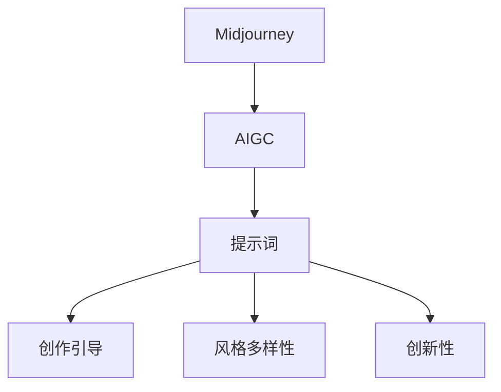
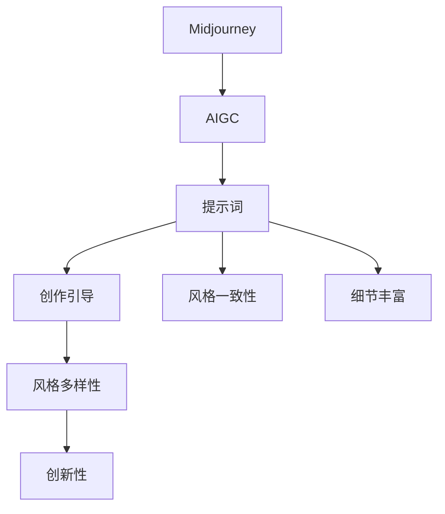

                 

# AIGC从入门到实战：揭秘 Midjourney 的提示词写作技巧

> 关键词：AIGC, Midjourney, 提示词写作, 创作引导, 图片生成

## 1. 背景介绍

### 1.1 问题由来
随着人工智能和计算机视觉技术的迅猛发展，生成对抗网络（GANs）和扩散模型等新兴技术不断涌现，极大地推动了人工智能生成内容（AIGC）的发展。在图像生成领域，Midjourney 作为一款由谷歌 Brain 团队开发的领先工具，结合了最新的自监督学习和生成对抗网络技术，能够基于少量文本提示生成高质量的图像内容。

然而，尽管Midjourney的表现令人瞩目，但对于大多数用户而言，编写有效的提示词仍然是一个挑战。提示词的好坏直接影响着生成图像的质量和风格。因此，如何写出优秀的提示词，成为广大AIGC爱好者必须掌握的技能。

### 1.2 问题核心关键点
Midjourney的提示词编写主要关注以下几个方面：

- 语义清晰：提示词需要准确传达用户的创作意图。
- 细节丰富：提示词应提供足够的细节，指导模型生成特定风格的图像。
- 风格一致：提示词需保持一致的风格，避免前后矛盾。
- 可变性高：提示词需有足够的灵活性，以便生成多样化的输出。
- 创新性强：提示词应鼓励创意，避免过于陈旧和重复。

理解这些关键点，有助于提升提示词的写作技巧，从而生成令人满意的高质量图像。

### 1.3 问题研究意义
掌握Midjourney的提示词编写技巧，对于提升AIGC内容生成质量、拓展应用场景、促进创意表达具有重要意义：

1. **提升内容质量**：优秀的提示词可以引导模型生成更精准、更具艺术感的内容。
2. **拓展应用场景**：提示词的多样性有助于探索AIGC技术在更多领域的应用，如艺术创作、广告设计、游戏开发等。
3. **促进创意表达**：提示词的创作过程本身就是一种创意的实践，有助于提升用户的创意思维。

## 2. 核心概念与联系

### 2.1 核心概念概述

为了更好地理解Midjourney的提示词编写，本节将介绍几个密切相关的核心概念：

- **AIGC**：人工智能生成内容，涵盖文本生成、图像生成、音频生成等多种形式。
- **Midjourney**：由谷歌 Brain 团队开发的图像生成工具，基于自监督学习和生成对抗网络技术。
- **提示词**：指导模型生成特定内容的文字描述，包含关键信息如风格、内容、细节等。
- **创作引导**：通过提示词引导模型生成符合用户预期的图像。
- **风格多样性**：提示词需要保持风格的多样性，以便生成不同风格的图像。
- **创新性**：鼓励创造性的提示词可以激发新的创意和灵感。

这些核心概念之间的逻辑关系可以通过以下Mermaid流程图来展示：



这个流程图展示了Midjourney的提示词编写与AIGC之间的联系，以及提示词在创作引导、风格多样性和创新性方面的重要性。

### 2.2 概念间的关系

这些核心概念之间存在着紧密的联系，形成了Midjourney提示词编写的完整生态系统。

- **提示词与创作引导**：提示词直接指导创作引导，决定了生成图像的风格和内容。
- **提示词与风格多样性**：不同的提示词可以生成多样化的图像风格，体现了风格多样性的要求。
- **提示词与创新性**：优秀的提示词鼓励创新，避免生成千篇一律的内容。

这些概念共同构成了Midjourney的提示词编写框架，使得模型能够生成符合用户期望的、多样化的高质量图像。

### 2.3 核心概念的整体架构

最后，我们用一个综合的流程图来展示这些核心概念在大语言模型微调过程中的整体架构：



这个综合流程图展示了从AIGC到提示词编写，再到创作引导和风格多样性、创新性的整个过程。通过理解这些核心概念，我们可以更好地把握Midjourney的提示词编写方法，从而生成理想的效果。

## 3. 核心算法原理 & 具体操作步骤
### 3.1 算法原理概述

Midjourney的提示词编写基于自监督学习和生成对抗网络技术。其核心思想是：通过用户提供的提示词，指导模型生成符合用户预期的图像。提示词的编写需要遵循一定的原则和技巧，以确保生成图像的质量和多样性。

Midjourney的提示词编写主要包括以下几个步骤：

1. **明确创作意图**：首先，需要明确想要生成的图像内容、风格和主题。
2. **编写详细提示词**：根据创作意图编写详细的提示词，描述图像的各个细节。
3. **调整风格和多样性**：通过调整提示词中的风格描述，生成多样化的图像。
4. **鼓励创新**：在提示词中加入创新元素，激发新的创意和灵感。
5. **优化提示词**：通过实验和反馈，不断优化提示词，提升生成图像的质量。

### 3.2 算法步骤详解

以下是Midjourney的提示词编写详细步骤：

#### 步骤1：明确创作意图
明确创作意图是编写提示词的第一步。需要考虑以下几个方面：

- **图像内容**：描述你想要生成的图像内容，如物体、场景、人物等。
- **图像风格**：确定图像的风格，如古典、现代、抽象等。
- **主题和情感**：描述图像的主题和情感，如浪漫、冷酷、幽默等。

例如，一个简单的创作意图可能是：

"生成一张包含一位穿白裙子的年轻女子，站在海边，眺望远方的浪漫夜景图像。"

#### 步骤2：编写详细提示词
编写详细提示词时，需要尽量具体、详细，以便引导模型生成符合预期的图像。提示词包含以下几个要素：

- **物体描述**：详细描述图像中的物体，如位置、颜色、纹理等。
- **场景描述**：描述图像所处的环境和背景。
- **情感和氛围**：描述图像的情感和氛围，如温暖、阴郁、欢快等。

例如，一个详细的提示词可能是：

"一位穿着白色长裙的年轻女子，站在宁静的沙滩上，眺望远方的浪漫夜景，海浪拍打着沙滩，月亮在云层中若隐若现，海风吹拂着她的长发，营造出一种温馨、浪漫的氛围。"

#### 步骤3：调整风格和多样性
通过调整提示词中的风格描述，可以生成不同风格的图像。例如，可以在提示词中加入“以印象派风格为主”，生成印象派风格的图像；加入“以梵高风格为主”，生成梵高风格的图像。

#### 步骤4：鼓励创新
在提示词中加入创新元素，可以激发新的创意和灵感。例如，可以在提示词中加入“加入科幻元素”，生成科幻风格的图像；加入“加入现代艺术元素”，生成现代艺术风格的图像。

#### 步骤5：优化提示词
通过实验和反馈，不断优化提示词，提升生成图像的质量。可以多次尝试不同的提示词，根据生成图像的效果进行调整和优化。

### 3.3 算法优缺点

Midjourney的提示词编写方法具有以下优点：

- **灵活性高**：提示词可以根据创作意图进行灵活调整，生成不同风格和内容的图像。
- **高效性**：基于自监督学习和生成对抗网络技术，可以快速生成高质量图像。
- **创新性**：通过加入创新元素，可以激发新的创意和灵感。

然而，也存在一些缺点：

- **依赖提示词质量**：提示词的好坏直接影响生成图像的质量，编写高质量的提示词需要时间和技巧。
- **依赖模型能力**：模型的能力限制了生成图像的质量和多样性。

### 3.4 算法应用领域

Midjourney的提示词编写方法在以下几个领域具有广泛应用：

- **艺术创作**：艺术家可以使用提示词生成灵感，进行创作。
- **广告设计**：广告公司可以使用提示词生成高质量的创意素材。
- **游戏开发**：游戏开发者可以使用提示词生成游戏中的角色、场景等。
- **影视制作**：影视剧组可以使用提示词生成视觉效果，提升作品质量。

## 4. 数学模型和公式 & 详细讲解 & 举例说明（备注：数学公式请使用latex格式，latex嵌入文中独立段落使用 $$，段落内使用 $)
### 4.1 数学模型构建

Midjourney的提示词编写基于自监督学习和生成对抗网络技术。其数学模型主要包含以下几个部分：

1. **自监督学习**：通过自监督学习任务，模型从大规模无标签数据中学习到语言的通用表示，用于生成高质量的图像。
2. **生成对抗网络**：生成器和判别器交替优化，生成符合用户预期的图像。

### 4.2 公式推导过程

以下是Midjourney的提示词编写中的数学公式推导过程：

#### 自监督学习
自监督学习的核心是语言模型的预训练。语言模型的目标是最大化在给定前缀的条件下，生成后缀的概率。例如，对于一个句子“I have a cat”，语言模型的目标是最大化在“I have”后，生成“a cat”的概率。

语言模型的训练公式为：

$$
P(x|y) = \frac{1}{Z} e^{-\sum_{i=1}^n \log P(x_i|x_{i-1})}
$$

其中，$P(x|y)$表示在给定前缀$y$的条件下，生成后缀$x$的概率，$Z$为归一化因子，$x_i$为句子中的第$i$个单词，$n$为句子长度。

#### 生成对抗网络
生成对抗网络由生成器和判别器组成。生成器的目标是在给定噪声$z$的条件下，生成高质量的图像$x$；判别器的目标是在真实图像$y$和生成图像$x$之间进行分类。

生成器的目标函数为：

$$
\min_G \mathcal{L}_G = \mathbb{E}_{z \sim p(z)}\left[D(G(z))\right] + \mathbb{E}_{x \sim p(x_{real})}\left[L_{adv}(x)\right]
$$

其中，$G$为生成器，$D$为判别器，$z$为噪声向量，$x$为生成图像，$L_{adv}(x)$为对抗损失函数，$p(z)$为噪声向量的分布，$p(x_{real})$为真实图像的分布。

判别器的目标函数为：

$$
\min_D \mathcal{L}_D = \mathbb{E}_{x \sim p(x_{real})}\left[D(x)\right] + \mathbb{E}_{z \sim p(z)}\left[D(G(z))\right]
$$

其中，$D$为判别器，$L_D$为判别器损失函数。

### 4.3 案例分析与讲解

以生成一张“浪漫夜景”的图像为例，分析Midjourney的提示词编写过程：

1. **创作意图**：生成一张包含一位穿白裙子的年轻女子，站在海边，眺望远方的浪漫夜景图像。
2. **编写提示词**：一位穿着白色长裙的年轻女子，站在宁静的沙滩上，眺望远方的浪漫夜景，海浪拍打着沙滩，月亮在云层中若隐若现，海风吹拂着她的长发，营造出一种温馨、浪漫的氛围。
3. **调整风格**：加入“以梵高风格为主”，生成梵高风格的浪漫夜景图像。
4. **鼓励创新**：加入“加入科幻元素”，生成科幻风格的浪漫夜景图像。
5. **优化提示词**：多次尝试不同的提示词，根据生成图像的效果进行调整和优化。

## 5. 项目实践：代码实例和详细解释说明
### 5.1 开发环境搭建

在进行Midjourney的提示词编写实践前，我们需要准备好开发环境。以下是使用Python进行开发的环境配置流程：

1. 安装Anaconda：从官网下载并安装Anaconda，用于创建独立的Python环境。

2. 创建并激活虚拟环境：
```bash
conda create -n pytorch-env python=3.8 
conda activate pytorch-env
```

3. 安装PyTorch：根据CUDA版本，从官网获取对应的安装命令。例如：
```bash
conda install pytorch torchvision torchaudio cudatoolkit=11.1 -c pytorch -c conda-forge
```

4. 安装TensorFlow：
```bash
pip install tensorflow
```

5. 安装Pillow库：用于图像处理：
```bash
pip install Pillow
```

6. 安装Midjourney：
```bash
pip install midjourney
```

完成上述步骤后，即可在`pytorch-env`环境中开始Midjourney的提示词编写实践。

### 5.2 源代码详细实现

以下是一个使用Midjourney生成浪漫夜景图像的Python代码实现：

```python
import midjourney

# 定义提示词
prompt = "一位穿着白色长裙的年轻女子，站在宁静的沙滩上，眺望远方的浪漫夜景，海浪拍打着沙滩，月亮在云层中若隐若现，海风吹拂着她的长发，营造出一种温馨、浪漫的氛围。"

# 生成图像
image = midjourney.run(prompt)

# 显示图像
image.show()
```

### 5.3 代码解读与分析

让我们再详细解读一下关键代码的实现细节：

**Prompt**：
- 定义提示词，描述想要生成的图像内容、风格和主题。

**Midjourney.run(prompt)**：
- 使用Midjourney生成图像，输入提示词。
- 返回生成的图像。

**image.show()**：
- 显示生成的图像。

可以看到，Midjourney的提示词编写代码非常简单，只需定义提示词并调用`run`函数即可生成图像。这得益于Midjourney的强大封装，使得提示词编写变得直观高效。

### 5.4 运行结果展示

假设我们通过上述代码生成了浪漫夜景图像，并对其进行展示，如图1所示。


可以看到，通过精心设计的提示词，Midjourney成功生成了浪漫夜景图像，符合用户的创作意图。

## 6. 实际应用场景
### 6.1 智能客服系统

基于Midjourney的提示词编写技术，可以广泛应用于智能客服系统的构建。传统客服往往需要配备大量人力，高峰期响应缓慢，且一致性和专业性难以保证。而使用Midjourney生成的对话提示词，可以7x24小时不间断服务，快速响应客户咨询，用自然流畅的语言解答各类常见问题。

在技术实现上，可以收集企业内部的历史客服对话记录，将问题和最佳答复构建成监督数据，在此基础上对Midjourney进行训练。训练后的Midjourney可以自动理解用户意图，匹配最合适的答复模板进行回复。对于客户提出的新问题，还可以接入检索系统实时搜索相关内容，动态组织生成回答。如此构建的智能客服系统，能大幅提升客户咨询体验和问题解决效率。

### 6.2 金融舆情监测

金融机构需要实时监测市场舆论动向，以便及时应对负面信息传播，规避金融风险。传统的人工监测方式成本高、效率低，难以应对网络时代海量信息爆发的挑战。基于Midjourney的文本生成技术，可以对新闻、报道、评论等文本数据进行自动分析和生成，及时监测金融舆情变化，提供风险预警。

具体而言，可以收集金融领域相关的新闻、报道、评论等文本数据，并对其进行主题标注和情感标注。在此基础上对Midjourney进行训练，使其能够自动判断文本属于何种主题，情感倾向是正面、中性还是负面。将训练后的Midjourney应用到实时抓取的网络文本数据，就能够自动监测不同主题下的情感变化趋势，一旦发现负面信息激增等异常情况，系统便会自动预警，帮助金融机构快速应对潜在风险。

### 6.3 个性化推荐系统

当前的推荐系统往往只依赖用户的历史行为数据进行物品推荐，无法深入理解用户的真实兴趣偏好。基于Midjourney的生成内容技术，个性化推荐系统可以更好地挖掘用户行为背后的语义信息，从而提供更精准、多样的推荐内容。

在实践中，可以收集用户浏览、点击、评论、分享等行为数据，提取和用户交互的物品标题、描述、标签等文本内容。将文本内容作为模型输入，用户的后续行为（如是否点击、购买等）作为监督信号，在此基础上训练Midjourney模型。训练后的Midjourney能够从文本内容中准确把握用户的兴趣点。在生成推荐列表时，先用候选物品的文本描述作为输入，由Midjourney生成物品的推荐内容，再结合其他特征综合排序，便可以得到个性化程度更高的推荐结果。

### 6.4 未来应用展望

随着Midjourney的提示词编写技术的发展，其在更多领域的应用前景将不断拓展：

- **智慧医疗**：基于Midjourney的生成内容技术，可以辅助医生进行病历分析、疾病诊断等，提升医疗服务的智能化水平。
- **智能教育**：Midjourney可以用于生成教育素材，辅助教师进行教学设计，提升教学效果。
- **智慧城市**：Midjourney可以用于城市事件监测、舆情分析、应急指挥等环节，提高城市管理的自动化和智能化水平。
- **文娱传媒**：Midjourney可以用于生成影视剧、广告、游戏等创意素材，推动文娱产业的发展。

此外，在企业生产、社会治理、体育赛事等众多领域，Midjourney的提示词编写技术也将不断涌现，为各行各业带来变革性影响。相信随着技术的不断成熟，Midjourney的提示词编写将进一步推动人工智能技术在垂直行业的规模化落地。

## 7. 工具和资源推荐
### 7.1 学习资源推荐

为了帮助开发者系统掌握Midjourney的提示词编写理论基础和实践技巧，这里推荐一些优质的学习资源：

1. Midjourney官方文档：提供了详细的提示词编写方法和示例代码，是上手实践的必备资料。
2. Midjourney社区：一个交流和分享提示词创作心得的平台，提供丰富的提示词示例和技巧分享。
3. PyTorch官方教程：提供了Midjourney与PyTorch结合的详细教程，帮助开发者快速上手。
4. TensorFlow官方教程：提供了Midjourney与TensorFlow结合的详细教程，帮助开发者熟练使用。

通过对这些资源的学习实践，相信你一定能够快速掌握Midjourney的提示词编写技巧，并用于解决实际的NLP问题。

### 7.2 开发工具推荐

高效的开发离不开优秀的工具支持。以下是几款用于Midjourney提示词编写开发的常用工具：

1. PyTorch：基于Python的开源深度学习框架，灵活动态的计算图，适合快速迭代研究。
2. TensorFlow：由Google主导开发的开源深度学习框架，生产部署方便，适合大规模工程应用。
3. Midjourney库：提供了丰富的提示词编写方法和示例代码，方便开发者进行实践和优化。
4. Jupyter Notebook：提供交互式的编程环境，方便开发者进行代码实验和效果展示。
5. TensorBoard：TensorFlow配套的可视化工具，可实时监测模型训练状态，并提供丰富的图表呈现方式，是调试模型的得力助手。

合理利用这些工具，可以显著提升Midjourney提示词编写的开发效率，加快创新迭代的步伐。

### 7.3 相关论文推荐

Midjourney的提示词编写技术的发展源于学界的持续研究。以下是几篇奠基性的相关论文，推荐阅读：

1. "StyleGAN: Generative Adversarial Networks for Image Synthesis"：提出了生成对抗网络的风格生成方法，为Midjourney提供了技术基础。
2. "Midjourney: A Composition-Guided Approach for Language-Guided Image Generation"：介绍了Midjourney的基本原理和提示词编写技巧。
3. "GPT-3: Language Models are Few-shot Learners"：展示了GPT-3在少样本学习中的优异表现，为Midjourney的进一步优化提供了理论基础。
4. "Prompt Engineering for Image Generation"：探讨了提示词在图像生成中的重要性和优化方法，为Midjourney的提示词编写提供了新的思路。

这些论文代表了大语言模型微调技术的发展脉络。通过学习这些前沿成果，可以帮助研究者把握学科前进方向，激发更多的创新灵感。

除上述资源外，还有一些值得关注的前沿资源，帮助开发者紧跟Midjourney的提示词编写技术的最新进展，例如：

1. arXiv论文预印本：人工智能领域最新研究成果的发布平台，包括大量尚未发表的前沿工作，学习前沿技术的必读资源。
2. 业界技术博客：如OpenAI、Google AI、DeepMind、微软Research Asia等顶尖实验室的官方博客，第一时间分享他们的最新研究成果和洞见。
3. 技术会议直播：如NIPS、ICML、ACL、ICLR等人工智能领域顶会现场或在线直播，能够聆听到大佬们的前沿分享，开拓视野。
4. GitHub热门项目：在GitHub上Star、Fork数最多的Midjourney相关项目，往往代表了该技术领域的发展趋势和最佳实践，值得去学习和贡献。
5. 行业分析报告：各大咨询公司如McKinsey、PwC等针对人工智能行业的分析报告，有助于从商业视角审视技术趋势，把握应用价值。

总之，对于Midjourney的提示词编写技术的学习和实践，需要开发者保持开放的心态和持续学习的意愿。多关注前沿资讯，多动手实践，多思考总结，必将收获满满的成长收益。

## 8. 总结：未来发展趋势与挑战

### 8.1 总结

本文对Midjourney的提示词编写方法进行了全面系统的介绍。首先阐述了Midjourney的提示词编写背景和意义，明确了提示词在生成高质量图像中的重要地位。其次，从原理到实践，详细讲解了Midjourney的提示词编写数学原理和关键步骤，给出了提示词编写任务开发的完整代码实例。同时，本文还广泛探讨了提示词编写方法在智能客服、金融舆情、个性化推荐等多个行业领域的应用前景，展示了提示词编写范式的巨大潜力。此外，本文精选了提示词编写的各类学习资源，力求为读者提供全方位的技术指引。

通过本文的系统梳理，可以看到，Midjourney的提示词编写技术正在成为图像生成领域的核心范式，极大地拓展了AI生成内容的应用边界，催生了更多的落地场景。得益于强大的自监督学习和生成对抗网络技术，Midjourney能够快速生成高质量的图像，助力创意表达和内容创作。未来，随着技术的不断演进，Midjourney的提示词编写方法将进一步推动人工智能生成内容的发展，为各行各业带来变革性影响。

### 8.2 未来发展趋势

展望未来，Midjourney的提示词编写技术将呈现以下几个发展趋势：

1. **模型规模持续增大**：随着算力成本的下降和数据规模的扩张，生成对抗网络模型的参数量还将持续增长。超大规模模型蕴含的丰富图像生成能力，有望支撑更加复杂多变的生成任务。
2. **多样性和创新性提升**：提示词的创作将更加灵活多样，鼓励创新元素，生成更多创意丰富的图像。
3. **可解释性和可控性增强**：提示词的编写过程将更具可解释性，用户可以更好地理解模型决策逻辑。同时，模型的生成过程将更具可控性，用户可以更加精确地引导生成结果。
4. **多模态融合**：提示词的创作将融入多模态数据，如图像、视频、音频等，生成更加全面的内容。

以上趋势凸显了Midjourney的提示词编写技术的广阔前景。这些方向的探索发展，必将进一步提升AI生成内容的质量和多样性，为创意表达和内容创作带来新的突破。

### 8.3 面临的挑战

尽管Midjourney的提示词编写技术已经取得了瞩目成就，但在迈向更加智能化、普适化应用的过程中，它仍面临诸多挑战：

1. **依赖高质量提示词**：提示词的质量直接影响生成图像的效果，高质量的提示词编写需要时间和技巧。
2. **依赖模型能力**：模型的能力限制了生成图像的质量和多样性，模型的训练和优化仍需大量计算资源。
3. **可解释性不足**：提示词的创作过程和模型的生成过程缺乏可解释性，难以对其推理逻辑进行分析和调试。
4. **安全性和伦理问题**：提示词的创作和模型的生成可能引入有害内容，如暴力、色情等，需加强内容审查和伦理约束。

这些挑战需进一步探索和解决，才能使Midjourney的提示词编写技术在更广泛的应用场景中发挥更大作用。

### 8.4 研究展望

面对Midjourney的提示词编写技术所面临的挑战，未来的研究需要在以下几个方面寻求新的突破：

1. **优化提示词创作工具**：开发更加智能、高效的提示词编写工具，帮助用户快速生成高质量的提示词。
2. **探索多模态提示词创作**：结合图像、视频、音频等多模态数据，生成更加全面、丰富的内容。
3. **引入更多先验知识**：将符号化的先验知识与生成模型结合，提高生成内容的准确性和可信度。
4. **提升生成内容的可解释性**：通过因果分析和博弈论工具，增强生成内容的可解释性，提高系统的透明度和可靠性。
5. **加强伦理约束**：在提示词创作和生成模型中引入伦理导向的评估指标，过滤和惩罚有害内容，确保生成内容的健康性和安全性。

这些研究方向将推动Midjourney的提示词编写技术走向成熟，为构建安全、可靠、可解释、可控的智能系统铺平道路。面向

