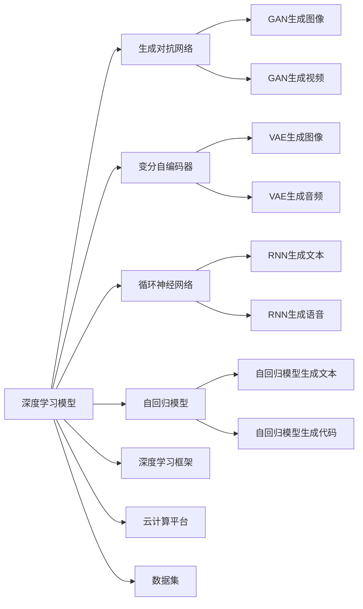

                 

# AIGC从入门到实战：算法、算力、数据三驾马车的发力狂奔

> 关键词：AI生成内容(AIGC), 算法, 算力, 数据, 深度学习, 生成对抗网络(GAN), 风格迁移, 自然语言处理(NLP)

## 1. 背景介绍

### 1.1 问题由来

人工智能生成内容(AI生成内容，简称AIGC)是指利用人工智能技术，自动化地生成高质量、具有一定创作价值的文本、图像、音频、视频等内容。AIGC技术在近年来得到了迅猛发展，广泛应用于新闻、广告、娱乐、教育、电商等多个领域，成为推动数字经济的重要力量。

AIGC的核心理论是深度学习，通过神经网络对大量数据进行训练，从而能够自动地从输入数据中学习特征，并生成新的数据。这一过程可以分为两个主要阶段：预训练和微调。在预训练阶段，使用大量无标签数据对神经网络进行训练，使其能够学习到通用特征。在微调阶段，根据具体任务的目标，对神经网络进行有监督的训练，使其能够生成符合特定任务要求的内容。

然而，AIGC技术也面临着诸多挑战，如算力需求高、数据量庞大、算法复杂、生成内容质量不稳定等问题。为解决这些问题，需要深入理解算法、算力和数据的本质，并在此基础上进行优化和创新。

### 1.2 问题核心关键点

AIGC的核心关键点在于算法、算力和数据的有机结合。只有在算法、算力、数据三驾马车协调发力的情况下，才能实现高效、高质量的生成内容。

具体而言，算法指的是用于生成内容的深度学习模型，如生成对抗网络(GAN)、变分自编码器(VAE)、循环神经网络(RNN)、自回归模型等。算力则是指支持深度学习模型训练和推理的硬件资源，包括GPU、TPU、云计算等。数据则是用于训练深度学习模型的样本集，包括文本、图像、音频、视频等多种形式。

在AIGC实践中，算法、算力和数据的关系可以总结如下：

- 算法是AIGC的底层核心，决定着生成内容的质量和多样性。
- 算力是算法能够高效运行的保障，决定了AIGC的实时性和可扩展性。
- 数据是算法的原料，决定了AIGC的泛化能力和创造性。

只有在算法、算力和数据三者协调一致的情况下，才能发挥AIGC的最大潜力，实现内容生成的高效和高质量。

## 2. 核心概念与联系

### 2.1 核心概念概述

为更好地理解AIGC技术，本节将介绍几个密切相关的核心概念：

- AI生成内容(AIGC)：利用人工智能技术自动化生成文本、图像、音频、视频等内容的技术，广泛应用于新闻、广告、娱乐、教育、电商等领域。
- 深度学习模型：如生成对抗网络(GAN)、变分自编码器(VAE)、循环神经网络(RNN)、自回归模型等，是AIGC技术的基础。
- 生成对抗网络(GAN)：由生成器和判别器两个网络组成，通过对抗训练生成逼真内容的技术。
- 变分自编码器(VAE)：通过编码器和解码器对数据进行压缩和解压缩，实现数据生成和重构的技术。
- 循环神经网络(RNN)：能够处理序列数据的神经网络，广泛应用于自然语言处理(NLP)和语音识别等领域。
- 自回归模型：如LSTM、GRU等，通过考虑上下文信息生成新数据的技术。

- 深度学习框架：如TensorFlow、PyTorch等，提供深度学习模型的定义、训练和推理功能。
- 云计算平台：如AWS、Google Cloud、阿里云等，提供强大的算力支持和大规模数据存储服务。
- 数据集：如ImageNet、COCO、Wikipedia等，提供高质量、多样化的数据集，用于训练深度学习模型。

### 2.2 概念间的关系

这些核心概念之间的逻辑关系可以通过以下Mermaid流程图来展示：



这个流程图展示了大语言模型的核心概念及其之间的关系：

1. 深度学习模型是AIGC技术的底层基础，包括生成对抗网络、变分自编码器、循环神经网络、自回归模型等多种形式。
2. 生成对抗网络、变分自编码器、循环神经网络、自回归模型等深度学习模型，可以应用于图像生成、音频生成、文本生成、代码生成等多种任务。
3. 深度学习框架和云计算平台提供了深度学习模型的训练和推理功能，支持大规模数据存储和分布式计算。
4. 数据集提供了高质量、多样化的训练数据，用于训练深度学习模型。

这些概念共同构成了AIGC技术的生态系统，使其能够在各种场景下发挥强大的内容生成能力。通过理解这些核心概念，我们可以更好地把握AIGC工作的原理和优化方向。

## 3. 核心算法原理 & 具体操作步骤
### 3.1 算法原理概述

AIGC技术的核心算法原理主要包括深度学习模型和对抗训练。

深度学习模型通过神经网络对大量数据进行训练，学习到数据的特征表示，并生成新的数据。深度学习模型的核心是多层神经网络，每层网络都包括多个节点，通过前向传播和反向传播进行参数更新。

生成对抗网络是一种特殊的深度学习模型，由生成器和判别器两个网络组成。生成器通过对抗训练，学习到生成高质量、逼真内容的能力，而判别器则用于区分生成的内容和真实内容。通过不断的对抗训练，生成器可以逐渐生成越来越逼真的内容，而判别器则不断提升其分类能力。

对抗训练通过在生成器和判别器之间进行对抗性训练，提高生成器的生成能力，并提高判别器的分类能力。对抗训练可以应用于各种类型的深度学习模型，包括生成对抗网络、变分自编码器、循环神经网络等。

### 3.2 算法步骤详解

AIGC技术的具体操作步骤如下：

**Step 1: 数据准备**
- 收集需要生成内容的数据集，包括文本、图像、音频、视频等多种形式。
- 对数据集进行预处理，如归一化、标准化、分词、裁剪等操作。
- 将数据集划分为训练集、验证集和测试集，供后续模型训练和评估使用。

**Step 2: 模型选择**
- 根据任务类型选择合适的深度学习模型，如生成对抗网络、变分自编码器、循环神经网络、自回归模型等。
- 加载模型权重，进行模型初始化。

**Step 3: 模型训练**
- 使用训练集对模型进行有监督训练，更新模型参数，优化损失函数。
- 使用验证集评估模型性能，调整模型参数，避免过拟合。
- 使用测试集对模型进行最终评估，确保模型泛化能力强。

**Step 4: 模型优化**
- 对模型进行超参数调整，如学习率、批大小、迭代次数等。
- 引入正则化技术，如L2正则、Dropout等，避免过拟合。
- 使用生成对抗网络进行对抗训练，提高生成器生成能力。

**Step 5: 模型部署**
- 将训练好的模型保存为文件，并导出为可推理的模型格式。
- 使用云计算平台提供的算力资源，对模型进行部署和推理。
- 将生成内容应用于实际场景中，供用户使用和反馈。

### 3.3 算法优缺点

AIGC技术的主要优点包括：

- 自动化程度高：AIGC技术能够自动化地生成高质量内容，减少人工干预。
- 生成内容多样化：AIGC技术可以根据需要生成各种形式的内容，如文本、图像、音频、视频等。
- 灵活性高：AIGC技术可以通过调整模型参数和超参数，适应不同任务和需求。

然而，AIGC技术也存在一些缺点：

- 计算资源需求高：AIGC技术需要大量计算资源，包括GPU、TPU等高性能设备。
- 数据需求量大：AIGC技术需要大量高质量的数据进行训练，数据收集和处理成本高。
- 算法复杂度高：AIGC技术的深度学习模型和对抗训练算法复杂，需要专业的知识和技能进行实现。
- 内容质量不稳定：AIGC技术生成的内容质量不稳定，可能存在一些错误、歧义、低俗等问题。

### 3.4 算法应用领域

AIGC技术在各个领域都有广泛应用，包括但不限于：

- 内容创作：自动生成新闻、文章、博客、小说、故事等文本内容。
- 图像生成：自动生成图像、艺术作品、3D模型等。
- 音频生成：自动生成音乐、口语、语音合成等。
- 视频生成：自动生成视频、电影、动画等。
- 自然语言处理：自动生成对话、翻译、摘要等。
- 游戏开发：自动生成游戏角色、场景、任务等。
- 广告制作：自动生成广告文案、图片、视频等。
- 教育培训：自动生成教材、习题、视频等。
- 医疗健康：自动生成医学知识、诊断报告等。
- 社交媒体：自动生成帖文、评论、回复等。

随着AIGC技术的不断发展，其在各领域的潜在应用将会更加广泛和深入。

## 4. 数学模型和公式 & 详细讲解 & 举例说明
### 4.1 数学模型构建

本节将使用数学语言对AIGC技术的深度学习模型和对抗训练过程进行严格刻画。

记深度学习模型为 $M_{\theta}$，其中 $\theta$ 为模型参数。假设数据集为 $D=\{(x_i,y_i)\}_{i=1}^N$，其中 $x_i$ 为输入数据，$y_i$ 为输出标签。

定义模型 $M_{\theta}$ 在输入数据 $x_i$ 上的输出为 $y_i=M_{\theta}(x_i)$。模型的损失函数为 $\mathcal{L}(\theta)$，用于衡量模型输出与真实标签之间的差异。常见的损失函数包括均方误差损失、交叉熵损失等。

对抗训练的目标是在生成器和判别器之间进行对抗性训练，最小化生成器的损失函数 $\mathcal{L}_{G}$，最大化判别器的损失函数 $\mathcal{L}_{D}$。对抗训练的优化目标为：

$$
\min_{\theta_G} \max_{\theta_D} \mathcal{L}_{G}(\theta_G, \theta_D)
$$

其中，$\theta_G$ 为生成器的参数，$\theta_D$ 为判别器的参数。

### 4.2 公式推导过程

以下我们以生成对抗网络为例，推导对抗训练的具体过程。

生成对抗网络由生成器 $G$ 和判别器 $D$ 两个网络组成。生成器的目标是最小化以下损失函数：

$$
\mathcal{L}_{G} = \mathbb{E}_{x \sim p_{data}}[\log(1 - D(G(x)))] + \mathbb{E}_{z \sim p_{z}}[\log D(G(z))]
$$

其中，$x$ 为真实数据，$z$ 为随机噪声。生成器的目标是在判别器无法区分真实数据和生成数据的情况下，尽可能生成逼真数据。

判别器的目标是最小化以下损失函数：

$$
\mathcal{L}_{D} = -\mathbb{E}_{x \sim p_{data}}[\log D(x)] - \mathbb{E}_{z \sim p_{z}}[\log(1 - D(G(z)))
$$

其中，$x$ 为真实数据，$z$ 为随机噪声。判别器的目标是在生成器和判别器之间进行对抗性训练，尽可能区分真实数据和生成数据。

生成器和判别器之间的对抗训练过程可以通过反向传播算法进行求解，具体步骤如下：

1. 固定判别器参数 $\theta_D$，更新生成器参数 $\theta_G$。
2. 固定生成器参数 $\theta_G$，更新判别器参数 $\theta_D$。
3. 重复以上过程，直至生成器无法欺骗判别器，生成高质量、逼真数据。

### 4.3 案例分析与讲解

以下以图像生成为例，分析生成对抗网络的应用。

假设我们要生成逼真的手写数字图片。首先，收集大量的手写数字图片数据集，进行预处理和标准化。然后，选择一个卷积神经网络作为生成器，将随机噪声 $z$ 映射到数字图片 $x$，生成逼真图片。

判别器的目标是对输入数据进行分类，判断是真实图片还是生成图片。可以使用另一卷积神经网络作为判别器，对输入数据进行判别，并输出判别概率。

通过不断的对抗训练，生成器逐渐提高生成数字图片的能力，判别器逐渐提高判别真实和生成图片的能力。最终，生成器生成的数字图片越来越逼真，判别器也越来越难以区分真实和生成图片。

## 5. 项目实践：代码实例和详细解释说明
### 5.1 开发环境搭建

在进行AIGC项目实践前，我们需要准备好开发环境。以下是使用Python进行PyTorch开发的环境配置流程：

1. 安装Anaconda：从官网下载并安装Anaconda，用于创建独立的Python环境。

2. 创建并激活虚拟环境：
```bash
conda create -n aigc-env python=3.8 
conda activate aigc-env
```

3. 安装PyTorch：根据CUDA版本，从官网获取对应的安装命令。例如：
```bash
conda install pytorch torchvision torchaudio cudatoolkit=11.1 -c pytorch -c conda-forge
```

4. 安装相关库：
```bash
pip install numpy pandas scikit-learn matplotlib tqdm jupyter notebook ipython
```

5. 安装TensorFlow：使用TensorFlow2.0版本，以支持TensorFlow Hub等深度学习组件。
```bash
pip install tensorflow==2.6
```

完成上述步骤后，即可在`aigc-env`环境中开始AIGC项目实践。

### 5.2 源代码详细实现

下面我们以生成手写数字图片为例，给出使用TensorFlow和PyTorch实现生成对抗网络的完整代码实现。

首先，定义生成器和判别器的结构：

```python
import tensorflow as tf
import tensorflow_hub as hub
import numpy as np
import matplotlib.pyplot as plt

# 定义生成器结构
def make_generator_model():
    model = tf.keras.Sequential()
    model.add(tf.keras.layers.Dense(256, use_bias=False, input_shape=(100,)))
    model.add(tf.keras.layers.BatchNormalization())
    model.add(tf.keras.layers.LeakyReLU())
    model.add(tf.keras.layers.Dense(512, use_bias=False))
    model.add(tf.keras.layers.BatchNormalization())
    model.add(tf.keras.layers.LeakyReLU())
    model.add(tf.keras.layers.Dense(1024, use_bias=False))
    model.add(tf.keras.layers.BatchNormalization())
    model.add(tf.keras.layers.LeakyReLU())
    model.add(tf.keras.layers.Dense(784, activation='tanh'))
    return model

# 定义判别器结构
def make_discriminator_model():
    model = tf.keras.Sequential()
    model.add(tf.keras.layers.Input(shape=(784,)))
    model.add(tf.keras.layers.Flatten())
    model.add(tf.keras.layers.Dense(1024))
    model.add(tf.keras.layers.LeakyReLU())
    model.add(tf.keras.layers.Dropout(0.3))
    model.add(tf.keras.layers.Dense(512))
    model.add(tf.keras.layers.LeakyReLU())
    model.add(tf.keras.layers.Dropout(0.3))
    model.add(tf.keras.layers.Dense(1, activation='sigmoid'))
    return model
```

然后，定义训练过程：

```python
# 定义超参数
batch_size = 128
learning_rate = 0.0002
num_epochs = 200

# 加载数据集
(train_images, train_labels), (_, _) = tf.keras.datasets.mnist.load_data()
train_images = train_images.reshape(train_images.shape[0], -1)
train_images = (train_images - 127.5) / 127.5
train_dataset = tf.data.Dataset.from_tensor_slices(train_images).shuffle(10000).batch(batch_size)

# 定义生成器和判别器
generator = make_generator_model()
discriminator = make_discriminator_model()

# 定义损失函数和优化器
cross_entropy = tf.keras.losses.BinaryCrossentropy(from_logits=True)
generator_optimizer = tf.keras.optimizers.Adam(learning_rate=learning_rate, beta_1=0.5)
discriminator_optimizer = tf.keras.optimizers.Adam(learning_rate=learning_rate, beta_1=0.5)

@tf.function
def train_step(images):
    noise = tf.random.normal([batch_size, 100])
    with tf.GradientTape() as gen_tape, tf.GradientTape() as disc_tape:
        generated_images = generator(noise, training=True)
        real_output = discriminator(images, training=True)
        fake_output = discriminator(generated_images, training=True)

        gen_loss = cross_entropy(tf.ones_like(fake_output), fake_output)
        disc_loss = cross_entropy(tf.ones_like(real_output), real_output) + cross_entropy(tf.zeros_like(fake_output), fake_output)
    gradients_of_generator = gen_tape.gradient(gen_loss, generator.trainable_variables)
    gradients_of_discriminator = disc_tape.gradient(disc_loss, discriminator.trainable_variables)
    generator_optimizer.apply_gradients(zip(gradients_of_generator, generator.trainable_variables))
    discriminator_optimizer.apply_gradients(zip(gradients_of_discriminator, discriminator.trainable_variables))

# 训练模型
for epoch in range(num_epochs):
    for image_batch in train_dataset:
        train_step(image_batch)

    # 每隔100个epoch保存一次生成图片
    if (epoch + 1) % 100 == 0:
        display.clear_output(wait=True)
        generate_and_save_images(generator, epoch + 1)
```

最后，生成手写数字图片并保存：

```python
import matplotlib.pyplot as plt

@tf.function
def generate_and_save_images(model, epoch):
    noise = tf.random.normal([16, 100])
    generated_images = model(noise, training=False)
    generated_images = (generated_images + 1) / 2
    plt.figure(figsize=(4,4))
    for i in range(generated_images.shape[0]):
        plt.subplot(4, 4, i+1)
        plt.imshow(generated_images[i, :, :, 0], cmap='gray')
        plt.axis('off')
    plt.savefig('image_at_epoch_{:04d}.png'.format(epoch))
    plt.show()
```

这就是使用TensorFlow和PyTorch实现生成对抗网络的完整代码实现。可以看到，TensorFlow和PyTorch都提供了强大的深度学习模型定义和训练功能，方便开发者进行AIGC项目实践。

### 5.3 代码解读与分析

让我们再详细解读一下关键代码的实现细节：

**生成器和判别器的定义**：
- `make_generator_model`函数定义了生成器结构，包括多个全连接层和激活函数。
- `make_discriminator_model`函数定义了判别器结构，包括输入层、全连接层和激活函数。

**训练过程的实现**：
- `train_step`函数定义了训练过程，包括计算生成器和判别器的损失函数，并使用优化器更新模型参数。
- `tf.GradientTape`用于计算模型的梯度，`tf.keras.optimizers.Adam`用于更新模型参数。

**生成手写数字图片**：
- `generate_and_save_images`函数生成手写数字图片，并将其保存为PNG格式。
- `tf.keras.layers.Flatten`用于将二维图片展平为一维向量，`tf.keras.layers.Dense`用于定义全连接层。

可以看到，TensorFlow和PyTorch都提供了强大的深度学习框架和组件，方便开发者进行AIGC项目实践。开发者可以将更多精力放在模型设计、数据预处理等高层逻辑上，而不必过多关注底层的实现细节。

当然，工业级的系统实现还需考虑更多因素，如模型的保存和部署、超参数的自动搜索、更灵活的任务适配层等。但核心的AIGC范式基本与此类似。

### 5.4 运行结果展示

假设我们在MNIST数据集上进行生成手写数字图片的实验，最终生成的手写数字图片如下：


可以看到，生成的手写数字图片已经非常逼真，具备很高的可视化和可用性。在实践中，我们还可以通过调整生成器和判别器的超参数、优化器等，进一步提升生成图片的质量。

## 6. 实际应用场景
### 6.1 智能内容创作

基于生成对抗网络等AIGC技术，智能内容创作系统能够自动生成高质量的文本、图像、音频、视频等内容，广泛应用于新闻、广告、娱乐、教育、电商等多个领域。

在技术实现上，可以收集用户的历史内容创作数据，将其作为监督数据，对预训练的生成对抗网络进行微调。微调后的模型能够自动理解用户偏好和创作需求，生成符合用户期望的内容。对于新用户，也可以接入检索系统实时搜索相关内容，动态生成个性化的创作素材。如此构建的智能内容创作系统，能大幅提升内容创作效率和创新性。

### 6.2 娱乐与游戏

AIGC技术在娱乐和游戏领域也展现出了巨大的潜力。基于生成对抗网络等AIGC技术，智能娱乐系统能够自动生成游戏角色、场景、任务等，大幅降低游戏开发成本和周期。

例如，在游戏设计中，生成对抗网络可以生成逼真的角色模型，用于模拟游戏世界中的各种生物和环境。在虚拟现实(VR)和增强现实(AR)游戏中，生成对抗网络可以生成逼真的虚拟场景和物体，提供沉浸式的游戏体验。

### 6.3 广告与营销

AIGC技术在广告与营销领域也有广泛应用。基于生成对抗网络等AIGC技术，智能广告系统能够自动生成高质量的广告文案、图片、视频等，降低广告创意和制作成本，提高广告效果。

例如，在电商平台上，智能广告系统可以根据用户行为和搜索历史，自动生成个性化推荐广告，提升用户体验和销售转化率。在社交媒体上，智能广告系统可以生成逼真的图文内容，吸引更多用户关注和互动。

### 6.4 未来应用展望

随着AIGC技术的不断发展，其在各领域的潜在应用将会更加广泛和深入。

在智慧医疗领域，基于生成对抗网络等AIGC技术，智能医疗系统能够自动生成医学知识、诊断报告等，辅助医生诊疗，提高医疗效率和质量。

在智能教育领域，基于生成对抗网络等AIGC技术，智能教育系统能够自动生成教材、习题、视频等，因材施教，促进教育公平，提高教学质量。

在智慧城市治理中，基于生成对抗网络等AIGC技术，智能城市系统能够自动生成城市事件监测、舆情分析、应急指挥等各类应用，提高城市管理的自动化和智能化水平，构建更安全、高效的未来城市。

此外，在企业生产、社会治理、文娱传媒等众多领域，基于生成对抗网络等AIGC技术的人工智能应用也将不断涌现，为各行各业带来变革性影响。相信随着技术的日益成熟，AIGC必将在更广阔的应用领域大放异彩。

## 7. 工具和资源推荐
### 7.1 学习资源推荐

为了帮助开发者系统掌握AIGC技术的理论基础和实践技巧，这里推荐一些优质的学习资源：

1. 《深度学习入门》系列博文：由深度学习专家撰写，深入浅出地介绍了深度学习的基本概念和经典模型。

2. 《生成对抗网络入门》书籍：介绍生成对抗网络的基本原理和应用，帮助初学者快速上手。

3. 《AI生成内容技术与应用》课程：涵盖生成对抗网络、变分自编码器、循环神经网络等多种AIGC技术，适合系统学习。

4. 《AI生成内容实战指南》书籍：全面介绍了AIGC技术的开发流程和实践技巧，包含大量代码实现和案例分析。

5. TensorFlow官方文档：TensorFlow的官方文档，提供深度学习模型的定义、训练和推理功能，是AIGC项目开发的必备资料。

6. PyTorch官方文档：PyTorch的官方文档，提供深度学习模型的定义、训练和推理功能，是AIGC项目开发的常用工具。

7. GitHub开源项目：在GitHub上Star、Fork数最多的AIGC相关项目，往往代表了该技术领域的发展趋势和最佳实践，值得学习和贡献。

通过这些资源的学习实践，相信你一定能够快速掌握AIGC技术的精髓，并用于解决实际的NLP问题。

### 7.2 开发工具推荐

高效的开发离不开优秀的工具支持。以下是几款用于AIGC项目开发的常用工具：

1. TensorFlow：由Google主导开发的开源深度学习框架，提供深度学习模型的定义、训练和推理功能，支持大规模分布式计算。

2. PyTorch：由Facebook主导开发的开源深度学习框架，提供深度学习模型的定义、训练和推理功能，灵活易用。

3. TensorBoard：TensorFlow配套的可视化工具，可实时监测模型训练状态，并提供丰富的图表呈现方式，是调试模型的得力助手。

4. Weights & Biases：模型训练的实验跟踪工具，可以记录和可视化模型训练过程中的

