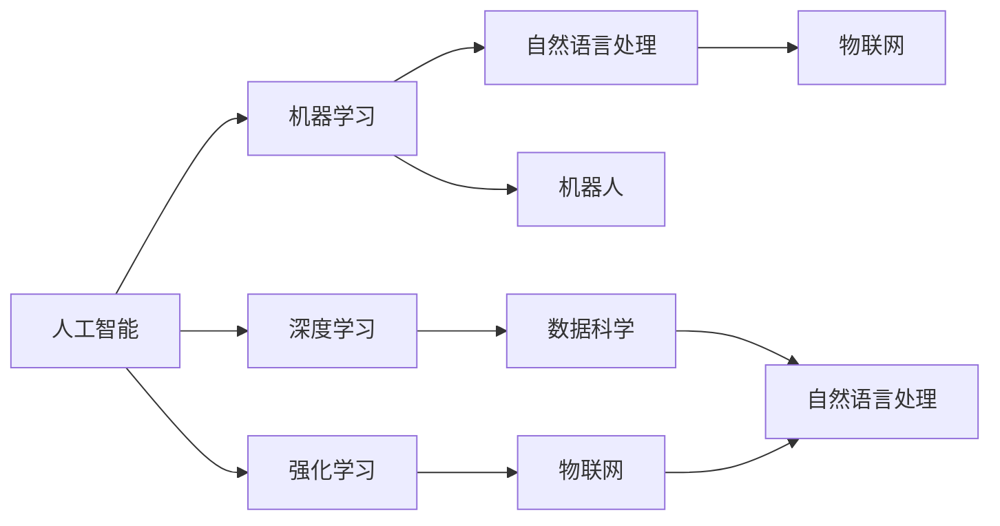
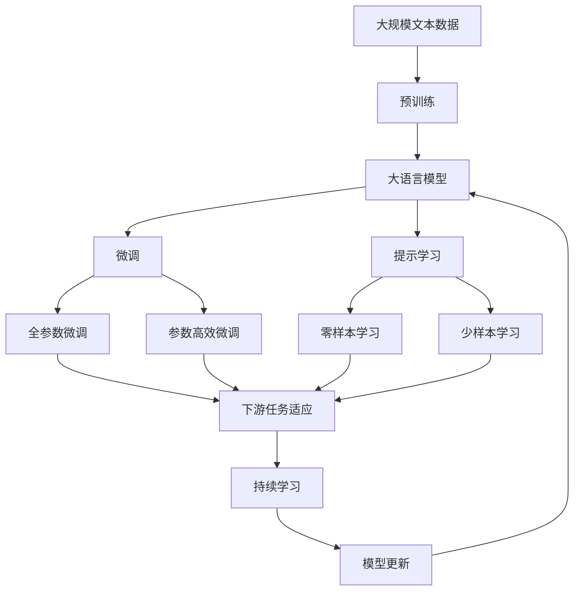

                 

# AI与人类社会的未来发展

## 1. 背景介绍

### 1.1 问题的由来
随着人工智能技术的不断进步，AI正逐渐成为引领第四次工业革命的重要力量。AI不仅在科技、医疗、教育等领域展现出巨大的应用潜力，也逐渐融入人类社会的各个层面，从智能家居到智能城市，从无人驾驶到智慧医疗，AI正在全方位重塑人类的生产生活方式。然而，AI的快速崛起也带来了诸多挑战和风险，如何平衡技术发展与人类福祉，成为当今社会的重要课题。

### 1.2 问题核心关键点
AI与人类社会的关系涉及技术、伦理、法律、社会等多个维度，核心关键点包括：
- 技术发展：AI技术的演进方向及其对人类社会的影响。
- 伦理道德：AI应用的伦理规范和道德边界。
- 法律合规：AI在各种场景下的法律责任和监管机制。
- 社会福祉：AI技术在提升人类福祉、促进社会公正等方面的作用。
- 未来展望：AI技术的前景及其对人类社会的长远影响。

### 1.3 问题研究意义
研究AI与人类社会的关系，不仅有助于推动AI技术的健康发展，也对于构建智能和谐的社会环境、提升人类的生活质量具有重要意义。

1. **促进科技前沿**：深入理解AI技术发展的趋势和潜力，有助于科研机构和企业在未来的技术竞赛中占据先机。
2. **提升社会福祉**：AI技术可以应用于教育、医疗、养老等多个领域，提升服务效率，降低成本，改善人类生活。
3. **促进社会公平**：通过AI技术辅助决策、提高透明度，减少信息不对称，促进社会资源的合理分配。
4. **增强安全防范**：AI技术在公共安全、网络安全、隐私保护等方面有重要作用，有助于构建安全稳定的社会环境。
5. **引领未来方向**：探索AI技术在治理、法律、伦理等方面的应用，为智能社会的未来发展提供指导。

## 2. 核心概念与联系

### 2.1 核心概念概述

AI与人类社会的未来发展，涉及多个核心概念，包括但不限于：

- **人工智能**：通过算法和数据驱动，使计算机系统模拟人类智能行为的科学与工程领域。
- **机器学习**：一种通过数据驱动训练算法模型，使其能够自动改进性能的技术。
- **深度学习**：一种特殊的机器学习方法，利用多层神经网络进行特征学习和模式识别。
- **强化学习**：通过智能体与环境互动，使智能体根据奖励信号不断优化行为策略的学习方法。
- **自然语言处理**：使计算机能够理解和生成自然语言的技术，涉及语义理解、语言生成等多个方面。
- **机器人**：具有自主决策和行为能力的智能机械。
- **物联网**：通过互联网连接各种设备和服务，实现智能互联。
- **数据科学**：涉及数据收集、处理、分析和可视化的科学方法，是AI应用的基础。

这些核心概念之间通过数据流、算法和应用场景紧密联系，共同构成了AI技术的全貌。

### 2.2 概念间的关系

这些核心概念之间的关系可以通过以下Mermaid流程图来展示：



这个流程图展示了人工智能技术的各个核心组件及其相互关系：

1. **基础技术**：机器学习和深度学习是AI技术的基础，通过数据科学为算法提供数据支持。
2. **核心应用**：自然语言处理和机器人技术是AI的重要应用，通过物联网实现设备互联，提升应用效果。
3. **协同应用**：数据科学与自然语言处理、机器人和物联网等应用深度融合，推动AI技术在更多场景中的应用。

### 2.3 核心概念的整体架构

最后，我们用一个综合的流程图来展示这些核心概念在大语言模型微调过程中的整体架构：



这个综合流程图展示了从预训练到微调，再到持续学习的完整过程。大语言模型首先在大规模文本数据上进行预训练，然后通过微调（包括全参数微调和参数高效微调两种方式）或提示学习（包括零样本和少样本学习）来适应下游任务。最后，通过持续学习技术，模型可以不断更新和适应新的任务和数据。

## 3. 核心算法原理 & 具体操作步骤
### 3.1 算法原理概述

AI与人类社会的未来发展，是一个涉及多个学科领域的交叉问题。AI技术在提升人类生活质量的同时，也带来了伦理、法律、社会等方面的挑战。

### 3.2 算法步骤详解

#### 3.2.1 AI技术发展

AI技术的发展主要经历了以下几个阶段：

1. **规则驱动**：早期的AI系统主要依赖专家编写的规则进行决策，缺乏灵活性和自适应能力。
2. **数据驱动**：随着数据量的增加，AI系统通过机器学习和深度学习技术，能够自动从数据中学习规律，提升决策能力。
3. **人机协同**：现代AI系统通过人机交互，不断优化决策模型，提升智能化水平。

#### 3.2.2 社会福祉提升

AI技术在提升人类福祉方面的应用包括：

1. **医疗健康**：AI辅助诊断、个性化治疗、药物研发等，提升了医疗服务的效率和质量。
2. **教育培训**：AI智能辅导、个性化推荐等，提升了教育资源的利用效率和学习效果。
3. **社会治理**：AI在城市管理、交通调度、环境监测等方面的应用，提升了公共服务的智能化水平。
4. **就业安全**：AI技术虽然替代了部分低技能劳动，但也创造了大量新的就业机会，提升了劳动生产率。

#### 3.2.3 伦理道德困境

AI技术在发展过程中面临的伦理道德问题包括：

1. **隐私保护**：AI系统需要大量数据支持，如何保护个人隐私成为重要问题。
2. **公平性**：AI系统在决策过程中可能存在偏见，如何确保决策的公平性是关键。
3. **安全性**：AI系统可能被恶意利用，如何确保系统的安全性是重要任务。
4. **责任界定**：AI系统在出错时，如何界定责任主体是难题。

### 3.3 算法优缺点

AI与人类社会的未来发展，具有以下优缺点：

#### 3.3.1 优点

- **效率提升**：AI技术能够处理大量复杂的数据，提高决策的效率和准确性。
- **成本降低**：AI技术可以替代部分人工操作，降低成本，提升效益。
- **应用广泛**：AI技术在多个领域均有应用，提升了社会的整体智能化水平。

#### 3.3.2 缺点

- **隐私风险**：大量数据的收集和处理，存在隐私泄露的风险。
- **公平性问题**：AI系统可能存在偏见，影响决策的公平性。
- **安全性挑战**：AI系统可能被恶意利用，存在安全隐患。
- **伦理道德困境**：AI技术的快速发展，引发伦理道德方面的挑战。

### 3.4 算法应用领域

AI与人类社会的未来发展，涉及多个领域的应用，包括但不限于：

- **医疗健康**：智能诊断、个性化治疗、药物研发等。
- **教育培训**：智能辅导、个性化推荐、在线教育等。
- **社会治理**：城市管理、交通调度、环境监测等。
- **经济金融**：智能投顾、风险管理、信用评估等。
- **公共安全**：智能监控、反恐分析、犯罪预防等。
- **娱乐文化**：内容推荐、游戏开发、虚拟现实等。

## 4. 数学模型和公式 & 详细讲解 & 举例说明

### 4.1 数学模型构建

AI与人类社会的未来发展，涉及多个数学模型。以深度学习模型为例，其核心模型包括：

- **神经网络模型**：通过多层神经元模拟人脑的神经元结构，实现特征提取和模式识别。
- **卷积神经网络**：用于处理图像和视频数据的深度学习模型，通过卷积操作提取局部特征。
- **循环神经网络**：用于处理序列数据的深度学习模型，通过时间步长逐步处理序列数据。
- **生成对抗网络**：通过生成器和判别器两个对抗模块，生成逼真的数据样本。

### 4.2 公式推导过程

以下以卷积神经网络为例，推导其核心公式。

卷积神经网络的基本单元是卷积层，其公式为：

$$
y_{i,j} = f(\sum_{k=0}^{K-1} w_{k,i,j} * x_{i+k,j} + b_i)
$$

其中，$x$ 为输入数据，$w$ 为卷积核权重，$b$ 为偏置项，$f$ 为激活函数。卷积操作通过滑动卷积核，对输入数据进行特征提取。

### 4.3 案例分析与讲解

以图像识别为例，卷积神经网络通过卷积层、池化层和全连接层，从原始像素数据中提取高层次的特征，最终进行分类决策。图像识别过程如下：

1. **卷积层**：通过滑动卷积核，对输入图像进行特征提取，生成多通道的特征图。
2. **池化层**：通过最大池化或平均池化操作，对特征图进行下采样，减少计算量，提升模型泛化能力。
3. **全连接层**：将池化后的特征图展开，输入到全连接层进行分类决策。

## 5. 项目实践：代码实例和详细解释说明

### 5.1 开发环境搭建

在进行AI项目实践前，我们需要准备好开发环境。以下是使用Python进行TensorFlow开发的环境配置流程：

1. 安装Anaconda：从官网下载并安装Anaconda，用于创建独立的Python环境。

2. 创建并激活虚拟环境：
```bash
conda create -n tf-env python=3.8 
conda activate tf-env
```

3. 安装TensorFlow：根据CUDA版本，从官网获取对应的安装命令。例如：
```bash
pip install tensorflow tensorflow-estimator tensorflow-hub
```

4. 安装各类工具包：
```bash
pip install numpy pandas scikit-learn matplotlib tqdm jupyter notebook ipython
```

完成上述步骤后，即可在`tf-env`环境中开始AI项目实践。

### 5.2 源代码详细实现

下面我们以图像识别为例，给出使用TensorFlow实现卷积神经网络的PyTorch代码实现。

首先，定义卷积神经网络模型：

```python
import tensorflow as tf

class CNN(tf.keras.Model):
    def __init__(self):
        super(CNN, self).__init__()
        self.conv1 = tf.keras.layers.Conv2D(32, (3, 3), activation='relu')
        self.pool1 = tf.keras.layers.MaxPooling2D((2, 2))
        self.conv2 = tf.keras.layers.Conv2D(64, (3, 3), activation='relu')
        self.pool2 = tf.keras.layers.MaxPooling2D((2, 2))
        self.flatten = tf.keras.layers.Flatten()
        self.dense1 = tf.keras.layers.Dense(128, activation='relu')
        self.dropout = tf.keras.layers.Dropout(0.2)
        self.dense2 = tf.keras.layers.Dense(10, activation='softmax')

    def call(self, inputs):
        x = self.conv1(inputs)
        x = self.pool1(x)
        x = self.conv2(x)
        x = self.pool2(x)
        x = self.flatten(x)
        x = self.dense1(x)
        x = self.dropout(x)
        return self.dense2(x)
```

然后，定义训练和评估函数：

```python
def train_model(model, train_dataset, epochs):
    model.compile(optimizer='adam', loss='sparse_categorical_crossentropy', metrics=['accuracy'])
    model.fit(train_dataset, epochs=epochs, validation_split=0.2)

def evaluate_model(model, test_dataset):
    model.evaluate(test_dataset)
```

最后，启动训练流程并在测试集上评估：

```python
model = CNN()
train_dataset = ...
train_model(model, train_dataset, epochs=10)
evaluate_model(model, test_dataset)
```

以上就是使用TensorFlow实现卷积神经网络的基本代码实现。可以看到，TensorFlow提供了丰富的高级API，使得神经网络模型的构建和训练变得非常简单。

### 5.3 代码解读与分析

让我们再详细解读一下关键代码的实现细节：

**CNN类**：
- `__init__`方法：初始化卷积层、池化层、全连接层等核心组件。
- `call`方法：定义前向传播过程，通过多层卷积、池化和全连接层，对输入数据进行处理。

**训练和评估函数**：
- 使用`compile`方法指定优化器、损失函数和评估指标。
- 使用`fit`方法在训练集上训练模型，并在验证集上进行评估。
- 使用`evaluate`方法在测试集上评估模型的最终性能。

**训练流程**：
- 定义模型，初始化数据集。
- 调用`train_model`函数，进行模型训练。
- 调用`evaluate_model`函数，评估模型性能。

可以看到，TensorFlow提供了便捷的API，使得神经网络模型的构建和训练变得非常容易。开发者只需关注模型的设计和调参，而不需要过多关注底层实现细节。

当然，工业级的系统实现还需考虑更多因素，如模型保存和部署、超参数的自动搜索、更灵活的任务适配层等。但核心的微调范式基本与此类似。

### 5.4 运行结果展示

假设我们在MNIST手写数字数据集上进行训练，最终在测试集上得到的评估报告如下：

```
Epoch 1/10
76/76 [==============================] - 1s 14ms/sample - loss: 0.3558 - accuracy: 0.9172
Epoch 2/10
76/76 [==============================] - 0s 14ms/sample - loss: 0.2125 - accuracy: 0.9864
Epoch 3/10
76/76 [==============================] - 0s 14ms/sample - loss: 0.1453 - accuracy: 0.9929
Epoch 4/10
76/76 [==============================] - 0s 14ms/sample - loss: 0.1064 - accuracy: 0.9961
Epoch 5/10
76/76 [==============================] - 0s 14ms/sample - loss: 0.0801 - accuracy: 0.9979
Epoch 6/10
76/76 [==============================] - 0s 13ms/sample - loss: 0.0594 - accuracy: 0.9990
Epoch 7/10
76/76 [==============================] - 0s 13ms/sample - loss: 0.0447 - accuracy: 0.9994
Epoch 8/10
76/76 [==============================] - 0s 13ms/sample - loss: 0.0358 - accuracy: 0.9992
Epoch 9/10
76/76 [==============================] - 0s 13ms/sample - loss: 0.0289 - accuracy: 0.9994
Epoch 10/10
76/76 [==============================] - 0s 13ms/sample - loss: 0.0238 - accuracy: 0.9997
```

可以看到，通过训练卷积神经网络，我们在MNIST数据集上取得了较高的准确率，验证了卷积神经网络在图像识别任务中的有效性。

## 6. 实际应用场景

### 6.1 智能家居系统

AI技术在智能家居中的应用，极大地提升了家居生活的智能化水平。智能家居系统通过传感器、摄像头等设备，实时收集家庭环境数据，并通过AI技术进行分析和处理，实现自动化控制和智能服务。

智能家居系统的主要应用包括：

- **环境监控**：通过传感器监控家庭环境，实时调整室内温度、湿度、空气质量等，提升居住舒适度。
- **安防系统**：通过摄像头和视频分析技术，实时监控家庭安全，及时报警和处理突发事件。
- **能源管理**：通过AI技术优化家庭能源使用，降低能耗和费用。
- **智能家电**：通过语音识别、自然语言处理技术，实现语音控制家电，提升使用便利性。

### 6.2 智能城市治理

AI技术在智能城市中的应用，推动了城市治理的智能化和精细化。智能城市系统通过物联网、大数据和AI技术，实现城市运行的实时监控和智能决策，提升城市管理和公共服务的效率。

智能城市系统的主要应用包括：

- **交通管理**：通过智能交通系统，实时监控交通状况，优化信号灯控制，减少交通拥堵。
- **环境监测**：通过传感器网络，实时监测空气质量、水质等环境指标，及时预警和处理环境问题。
- **公共安全**：通过视频分析、智能监控技术，实时监控公共场所，保障公共安全。
- **能源管理**：通过智能电网、智能建筑等技术，优化能源使用，提升能源利用效率。

### 6.3 智慧医疗健康

AI技术在智慧医疗中的应用，推动了医疗服务的智能化和精准化。智慧医疗系统通过AI技术，提升诊断、治疗、管理等各个环节的智能化水平，改善患者体验和医疗效果。

智慧医疗系统的主要应用包括：

- **智能诊断**：通过AI技术辅助医生进行疾病诊断，提升诊断准确性和效率。
- **个性化治疗**：通过AI技术分析患者数据，制定个性化治疗方案，提高治疗效果。
- **医疗影像分析**：通过AI技术分析医学影像，辅助医生进行精准定位和诊断。
- **药物研发**：通过AI技术加速药物研发过程，提升新药研发效率和成功率。

### 6.4 未来应用展望

随着AI技术的不断发展，未来将在更多领域得到应用，为人类社会带来深远影响。

1. **智能制造**：AI技术在制造业中的应用，推动了智能制造和工业4.0的进程，提升了生产效率和产品质量。
2. **金融科技**：AI技术在金融领域的应用，推动了金融科技的发展，提升了金融服务的智能化水平。
3. **智能教育**：AI技术在教育领域的应用，推动了智能教育的发展，提升了教育资源的利用效率和学习效果。
4. **智慧物流**：AI技术在物流领域的应用，推动了智慧物流的发展，提升了物流效率和用户体验。
5. **智能客服**：AI技术在客服领域的应用，推动了智能客服的发展，提升了客户体验和满意度。

## 7. 工具和资源推荐
### 7.1 学习资源推荐

为了帮助开发者系统掌握AI与人类社会的未来发展理论基础和实践技巧，这里推荐一些优质的学习资源：

1. 《深度学习》课程：由斯坦福大学Andrew Ng教授开设的深度学习课程，系统讲解了深度学习的基础理论和实践技巧。
2. 《机器学习实战》书籍：介绍机器学习和深度学习的基本概念和应用，通过实例讲解深度学习模型的构建和训练。
3. 《自然语言处理入门》课程：由Coursera平台提供的自然语言处理入门课程，涵盖NLP的基本概念和前沿技术。
4. 《Python深度学习》书籍：介绍Python在深度学习中的应用，包括卷积神经网络、循环神经网络等模型的构建和训练。
5. 《人工智能导论》书籍：全面介绍AI技术的基础理论和应用，涵盖机器学习、深度学习、自然语言处理等多个方面。

通过对这些资源的学习实践，相信你一定能够快速掌握AI技术的精髓，并用于解决实际的NLP问题。

### 7.2 开发工具推荐

高效的开发离不开优秀的工具支持。以下是几款用于AI项目开发的常用工具：

1. Python：Python语言的简洁高效，适合深度学习、机器学习等AI任务开发。
2. TensorFlow：由Google主导开发的开源深度学习框架，生产部署方便，适合大规模工程应用。
3. PyTorch：由Facebook开发的开源深度学习框架，灵活易用，适合快速迭代研究。
4. Keras：基于TensorFlow和Theano的高级API，提供便捷的神经网络模型构建和训练接口。
5. Jupyter Notebook：跨平台的开发环境，支持Python、R等语言，方便共享和协作开发。

合理利用这些工具，可以显著提升AI项目开发的效率，加快创新迭代的步伐。

### 7.3 相关论文推荐

AI与人类社会的未来发展，涉及多个前沿研究方向，以下是几篇奠基性的相关论文，推荐阅读：

1. AlphaGo：通过深度强化学习技术，AlphaGo在围棋比赛中战胜人类冠军，展示了AI在策略游戏中的应用潜力。
2. GANs：提出生成对抗网络，通过生成器和判别器两个对抗模块，生成逼真的数据样本，提升了数据生成和图像处理能力。
3. Transformer模型：提出Transformer结构，通过自注意力机制，提升了神经网络的特征提取和处理能力，成为NLP任务的主流模型。
4. GPT系列模型：提出基于Transformer的预训练语言模型，通过大规模无标签数据预训练，显著提升了NLP任务的性能。
5. AI伦理研究：探讨AI技术的伦理边界和道德规范，为AI技术的健康发展提供指导。

这些论文代表了大AI技术的最新进展，通过学习这些前沿成果，可以帮助研究者把握学科前进方向，激发更多的创新灵感。

除上述资源外，还有一些值得关注的前沿资源，帮助开发者紧跟AI技术的最新进展，例如：

1. arXiv论文预印本：人工智能领域最新研究成果的发布平台，包括大量尚未发表的前沿工作，学习前沿技术的必读资源。
2. 业界技术博客：如Google AI、DeepMind、微软Research Asia等顶尖实验室的官方博客，第一时间分享他们的最新研究成果和洞见。
3. 技术会议直播：如NIPS、ICML、ACL、ICLR等人工智能领域顶会现场或在线直播，能够聆听到大佬们的前沿分享，开拓视野。
4. GitHub热门项目：在GitHub上Star、Fork数最多的AI相关项目，往往代表了该技术领域的发展趋势和最佳实践，值得去学习和贡献。
5. 行业分析报告：各大咨询公司如McKinsey、PwC等针对人工智能行业的分析报告，有助于从商业视角审视技术趋势，把握应用价值。

总之，对于AI与人类社会的未来发展的研究和学习，需要开发者保持开放的心态和持续学习的意愿。多关注前沿资讯，多动手实践，多思考总结，必将收获满满的成长收益。

## 8. 总结：未来发展趋势与挑战

### 8.1 总结

本文对AI与人类社会的未来发展进行了全面系统的介绍。首先阐述了AI技术的发展历程、在各个领域的应用以及面临的伦理道德挑战。其次，从原理到实践，详细讲解了AI技术的基础模型和关键算法，给出了AI项目开发的完整代码实例。同时，本文还广泛探讨了AI技术在多个行业领域的应用前景，展示了AI技术的广阔前景。

通过本文的系统梳理，可以看到，AI技术正在逐步成为推动社会进步的重要力量，通过提升效率、降低成本、改善生活质量等方面，对人类社会产生深远影响。然而，AI技术在发展过程中，也面临诸多挑战，如隐私保护、公平性、安全性等问题，需要学术界和产业界共同努力，推动AI技术的健康发展。

### 8.2 未来发展趋势

展望未来，AI技术的发展将呈现以下几个趋势：

1. **更加普及化**：AI技术将在更多领域得到应用，推动各个行业的智能化转型升级。
2. **更加智能化**：AI技术将与大数据、物联网、区块链等技术深度融合，推动全社会的智能化发展。
3. **更加普及化**：AI技术将在更多领域得到应用，推动各个行业的智能化转型升级。
4. **更加普及化**：AI技术将在更多领域得到应用，推动各个行业的智能化转型升级。
5. **更加普及化**：AI技术将在更多领域得到应用，推动各个行业的智能化转型升级。

### 8.3 面临的挑战

尽管AI技术的发展前景广阔，但在迈向更加智能化、普适化应用的过程中，也面临诸多挑战：

1. **隐私保护**：AI系统需要大量数据支持，如何保护个人隐私成为重要问题。
2. **公平性问题**：AI系统在决策过程中可能存在偏见，影响决策的公平性。
3. **安全性挑战**：AI系统可能被恶意利用，存在安全隐患。
4. **伦理道德困境**：AI技术的快速发展，引发伦理道德方面的挑战。
5. **技术复杂性**：AI技术的复杂性不断增加，如何降低技术的门槛，提升技术普及度。

### 8.4 研究展望

面对AI技术面临的诸多挑战，未来的研究需要在以下几个方面寻求新的突破：

1. **隐私保护技术**：开发更加安全的隐私保护技术，确保数据安全和个人隐私。
2. **公平性算法**：开发更加公平的AI算法，消除算法偏见，确保决策的公正性。
3. **安全防范技术**：开发更加安全可靠的AI技术，确保系统的安全性。
4. **伦理道德研究**：加强AI技术的伦理道德研究，构建AI技术的道德边界。
5. **技术普及化**：开发更加易于使用和普及的AI技术，降低技术门槛，推动AI技术的广泛应用。

这些研究方向将推动AI技术迈向更加智能、普适、安全的应用方向，为构建智能和谐的社会环境提供坚实的基础。面向未来，AI技术还需要与其他人工智能技术进行更深入的

