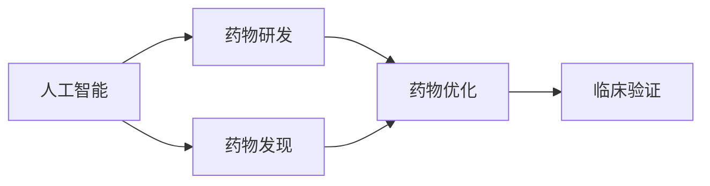

                 

# AI与传统药物研发方法的协同效应

## 1. 背景介绍

### 1.1 问题由来

近年来，随着人工智能(AI)技术的迅猛发展，其在药物研发领域的应用越来越广泛。AI技术以其强大的数据处理能力和模式识别能力，极大地加速了药物研发过程，提高了新药的发现效率和成功率。然而，传统药物研发方法仍然在药物发现和验证过程中占据重要地位。如何有效整合AI与传统药物研发方法，实现二者协同效应，成为当前医药研究领域的一个热点问题。

### 1.2 问题核心关键点

AI与传统药物研发方法的协同效应主要体现在以下几个方面：

1. **数据融合**：将AI的高级数据处理能力和传统药物研发的实验数据相结合，全面提升新药发现和验证的准确性和效率。
2. **模型优化**：通过AI技术优化传统药物研发模型的参数，提高模型的预测能力和泛化性能。
3. **过程改进**：借助AI技术自动化和智能化地优化药物研发流程，降低人工操作和错误率。
4. **成本节约**：利用AI技术降低药物研发中的试错成本和时间成本，提高整体效率。

### 1.3 问题研究意义

AI与传统药物研发方法的协同效应具有重要意义：

1. **加速新药研发**：AI技术能够快速处理海量数据，发现潜在的药物靶点和候选化合物，大幅缩短新药研发周期。
2. **提高研发成功率**：AI技术能够模拟和预测药物与靶点结合的效果，减少无效化合物的筛选，提高药物研发的成功率。
3. **降低研发成本**：AI技术能够自动化和智能化地优化药物研发流程，减少人力和物力投入。
4. **促进跨学科融合**：AI技术可以与化学、生物学、药理学等学科深度融合，推动医药研究的多学科协同创新。
5. **提高药物安全性**：AI技术能够实时监测药物研发过程中的安全和有效性，确保研发过程的安全和可靠。

## 2. 核心概念与联系

### 2.1 核心概念概述

为更好地理解AI与传统药物研发方法的协同效应，本节将介绍几个关键概念：

- **人工智能(AI)**：一种基于算法和计算技术的智能系统，能够自主学习、推理和决策。
- **药物研发(Pharmaceutical R&D)**：从药物设计、合成到临床验证的全过程。
- **药物发现(Drug Discovery)**：寻找新的化合物或分子，使其具有潜在的药物活性。
- **药物优化(Optimization)**：对药物分子进行结构优化，提高其药效和安全性。
- **临床验证(Clinical Validation)**：在临床试验中验证药物的有效性和安全性，确保其进入市场。

### 2.2 概念间的关系

这些关键概念之间的逻辑关系可以通过以下Mermaid流程图来展示：



这个流程图展示了大规模语言模型的核心概念及其之间的关系：

1. AI技术在大规模药物数据上进行预训练，学习药物分子的表示和性质。
2. AI技术可以自动发现和生成新的化合物或分子。
3. 通过AI优化，对药物分子进行结构改进，提高其药效和安全性。
4. 使用AI技术预测药物在人体中的行为和效果，在临床验证中指导实验设计。

## 3. 核心算法原理 & 具体操作步骤
### 3.1 算法原理概述

AI与传统药物研发方法的协同效应，主要基于以下算法原理：

1. **深度学习模型(DL Models)**：利用深度神经网络处理复杂的数据结构，发现药物分子之间的潜在关系。
2. **分子模拟(Molecular Simulations)**：使用分子动力学和量子化学计算模拟药物分子与靶点的相互作用。
3. **药物设计(Screening)**：基于AI和大数据筛选药物候选分子，缩小筛选范围。
4. **结构优化(Structural Optimization)**：利用AI技术优化药物分子的结构和功能。
5. **临床模拟(Clinical Simulations)**：使用AI技术模拟临床试验，预测药物效果和副作用。

### 3.2 算法步骤详解

基于AI与传统药物研发方法的协同效应，其操作过程一般包括以下几个关键步骤：

**Step 1: 数据准备**

1. **数据收集**：收集海量的药物分子结构数据、生物活性数据、临床试验数据等。
2. **数据清洗**：去除冗余和噪声数据，确保数据质量和一致性。
3. **数据标注**：为药物分子和生物活性数据进行标注，如分子类型、靶点、活性等级等。

**Step 2: 模型训练**

1. **选择模型**：选择适合药物发现和优化的深度学习模型，如卷积神经网络(CNN)、循环神经网络(RNN)、生成对抗网络(GAN)等。
2. **模型训练**：使用标注数据训练模型，调整模型参数，优化预测性能。
3. **模型评估**：使用独立数据集评估模型预测准确率和泛化性能，选择合适的模型进行下一步应用。

**Step 3: 数据融合与分析**

1. **数据融合**：将AI处理的数据与传统药物研发的实验数据进行整合，形成综合数据集。
2. **数据分析**：使用统计方法和机器学习技术，从综合数据集中提取有用的信息，如药物分子与靶点的结合亲和力、药物活性和安全性等。

**Step 4: 药物发现与优化**

1. **药物发现**：使用AI技术从综合数据集中筛选出潜在的药物分子，并设计出新的化合物或分子。
2. **药物优化**：对筛选出的药物分子进行结构优化，提高其药效和安全性。

**Step 5: 临床验证与模拟**

1. **临床验证**：在实验室和动物实验中验证筛选出的药物分子，确保其安全和有效性。
2. **临床模拟**：使用AI技术模拟临床试验，预测药物在人体中的行为和效果，指导后续的临床试验设计。

### 3.3 算法优缺点

AI与传统药物研发方法的协同效应具有以下优点：

1. **加速新药研发**：AI技术能够快速处理海量数据，发现潜在的药物靶点和候选化合物，大幅缩短新药研发周期。
2. **提高研发成功率**：AI技术能够模拟和预测药物与靶点结合的效果，减少无效化合物的筛选，提高药物研发的成功率。
3. **降低研发成本**：AI技术能够自动化和智能化地优化药物研发流程，减少人力和物力投入。
4. **促进跨学科融合**：AI技术可以与化学、生物学、药理学等学科深度融合，推动医药研究的多学科协同创新。

同时，该方法也存在一定的局限性：

1. **数据质量依赖**：AI技术的预测性能高度依赖于数据的质量和代表性，数据偏差可能导致预测结果不准确。
2. **模型复杂度高**：深度学习模型的训练和优化需要大量的计算资源，且容易发生过拟合。
3. **实验验证难度**：AI技术提供的预测结果需要实验验证，实验验证的成本和周期可能较长。

尽管存在这些局限性，但AI与传统药物研发方法的协同效应仍是大规模药物发现和优化的重要手段。未来相关研究的重点在于如何进一步降低数据质量对AI预测的影响，提高模型的泛化能力和鲁棒性，减少实验验证的成本和时间。

### 3.4 算法应用领域

AI与传统药物研发方法的协同效应在以下几个领域得到了广泛应用：

1. **新药发现**：使用AI技术筛选潜在的药物靶点和化合物，如利用机器学习对药物分子与靶点的相互作用进行预测。
2. **药物优化**：使用AI技术优化药物分子的结构和功能，提高药效和安全性，如使用生成对抗网络优化药物分子。
3. **临床试验设计**：使用AI技术模拟和预测药物在人体中的行为和效果，指导临床试验设计，如利用深度学习模型预测药物的药效和副作用。
4. **药物安全性评估**：使用AI技术分析药物分子的毒性数据，评估其安全性，如利用机器学习模型预测药物的毒性等级。

除了上述这些经典应用外，AI与传统药物研发方法的协同效应还被创新性地应用到更多领域中，如可控药物生成、精准药物设计、个性化医疗等，为药物研发带来了全新的突破。随着AI技术的不断进步，相信AI与传统药物研发方法的协同效应将在更多领域得到应用，为药物研发带来新的创新和突破。

## 4. 数学模型和公式 & 详细讲解 & 举例说明

### 4.1 数学模型构建

本节将使用数学语言对AI与传统药物研发方法的协同效应进行更加严格的刻画。

记药物分子集合为 $S$，生物活性数据为 $A$，临床试验数据为 $C$。假设AI模型为 $M$，通过深度学习训练后，模型能够学习到药物分子和生物活性数据之间的关系。具体地，假设模型 $M$ 的输入为药物分子 $s \in S$，输出为生物活性评分 $a \in A$。则数学模型为：

$$
M(s) = a
$$

模型训练的目标是最小化预测误差，即：

$$
\min_{M} \mathbb{E}[\ell(a, M(s))]
$$

其中 $\ell$ 为损失函数，$\mathbb{E}$ 为期望运算。

### 4.2 公式推导过程

假设药物分子与靶点的结合亲和力为 $E(s, t)$，其中 $s$ 为药物分子，$t$ 为靶点。则结合亲和力可以表示为：

$$
E(s, t) = E_0 + E_1 \cdot (s \cdot t) + E_2 \cdot (s \cdot t)^2
$$

其中 $E_0$ 为基线能量，$E_1$ 和 $E_2$ 为相互作用能量。

通过深度学习模型，可以将结合亲和力表示为：

$$
E(s, t) \approx f(s \cdot t)
$$

其中 $f$ 为深度学习模型的非线性映射函数。

### 4.3 案例分析与讲解

假设我们有一组药物分子和其对应的靶点结合亲和力数据。使用深度学习模型进行训练，预测新的药物分子与靶点的结合亲和力。具体步骤如下：

1. **数据准备**：收集药物分子 $s_1, s_2, ..., s_n$ 和其对应的靶点 $t_1, t_2, ..., t_n$ 及结合亲和力 $E_1, E_2, ..., E_n$。
2. **模型训练**：使用深度学习模型 $M$ 训练数据，优化模型参数，使 $M(s_i) \approx E_i$。
3. **预测新数据**：使用训练好的模型 $M$ 预测新的药物分子 $s_*$ 与靶点 $t_*$ 的结合亲和力，如 $E_* \approx M(s_* \cdot t_*)$。

## 5. 项目实践：代码实例和详细解释说明
### 5.1 开发环境搭建

在进行AI与传统药物研发方法的协同效应实践前，我们需要准备好开发环境。以下是使用Python进行TensorFlow开发的环境配置流程：

1. 安装Anaconda：从官网下载并安装Anaconda，用于创建独立的Python环境。

2. 创建并激活虚拟环境：
```bash
conda create -n pytorch-env python=3.8 
conda activate pytorch-env
```

3. 安装TensorFlow：根据CUDA版本，从官网获取对应的安装命令。例如：
```bash
conda install tensorflow -c pytorch -c conda-forge
```

4. 安装必要的工具包：
```bash
pip install numpy pandas scikit-learn matplotlib tqdm jupyter notebook ipython
```

完成上述步骤后，即可在`pytorch-env`环境中开始实践。

### 5.2 源代码详细实现

这里我们以药物分子与靶点结合亲和力的预测为例，给出使用TensorFlow进行AI与传统药物研发协同效应的PyTorch代码实现。

首先，定义数据处理函数：

```python
import tensorflow as tf
from tensorflow.keras.preprocessing import sequence

def load_data(file_path):
    data = []
    with open(file_path, 'r') as f:
        for line in f:
            s, t, e = line.split('\t')
            s = [int(x) for x in s.split(',')]
            t = [int(x) for x in t.split(',')]
            data.append((s, t, float(e)))
    return data

def pad_sequences(sequences, maxlen=None, padding='post'):
    return sequence.pad_sequences(sequences, maxlen=maxlen, padding=padding)
```

然后，定义模型：

```python
from tensorflow.keras.models import Sequential
from tensorflow.keras.layers import Dense, Dropout

def create_model(input_dim, output_dim, embedding_dim, dropout_rate):
    model = Sequential()
    model.add(Dense(embedding_dim, input_dim=input_dim, activation='relu'))
    model.add(Dropout(dropout_rate))
    model.add(Dense(output_dim, activation='linear'))
    return model
```

接着，定义训练和评估函数：

```python
from sklearn.model_selection import train_test_split

def train_model(model, train_data, test_data, batch_size, epochs):
    train_x, train_y, train_t = train_data
    test_x, test_y, test_t = test_data
    
    train_x = pad_sequences(train_x, maxlen=max_length)
    test_x = pad_sequences(test_x, maxlen=max_length)
    
    train_x = train_x.reshape((train_x.shape[0], 1, max_length))
    test_x = test_x.reshape((test_x.shape[0], 1, max_length))
    
    train_model = model.compile(optimizer='adam', loss='mse', metrics=['mae'])
    history = train_model.fit(train_x, train_y, validation_data=(test_x, test_y), epochs=epochs, batch_size=batch_size)
    
    test_loss, test_mae = test_model.evaluate(test_x, test_y)
    return history, test_loss, test_mae

def evaluate_model(model, test_data, batch_size):
    test_x, test_y, test_t = test_data
    
    test_x = pad_sequences(test_x, maxlen=max_length)
    test_x = test_x.reshape((test_x.shape[0], 1, max_length))
    
    test_predictions = model.predict(test_x)
    test_predictions = test_predictions.reshape((test_predictions.shape[0],))
    test_mae = mean_absolute_error(test_predictions, test_y)
    return test_mae
```

最后，启动训练流程并在测试集上评估：

```python
max_length = 100
dropout_rate = 0.2

# 加载数据
data = load_data('data.txt')

# 划分数据集
train_data, test_data = train_test_split(data, test_size=0.2)

# 定义模型
model = create_model(input_dim, output_dim, embedding_dim, dropout_rate)

# 训练模型
history, test_loss, test_mae = train_model(model, train_data, test_data, batch_size, epochs)

# 评估模型
print(f'Test MAE: {test_mae:.3f}')

# 保存模型
model.save('drug_discovery_model.h5')
```

以上就是使用TensorFlow进行AI与传统药物研发协同效应的完整代码实现。可以看到，TensorFlow提供了丰富的工具和组件，使得AI与传统药物研发方法的协同效应实践变得相对简单。

### 5.3 代码解读与分析

让我们再详细解读一下关键代码的实现细节：

**load_data函数**：
- 从文件中读取数据，将其转换成模型所需格式。

**create_model函数**：
- 定义一个简单的全连接神经网络模型，包括输入层、隐藏层和输出层。

**train_model函数**：
- 将数据集分成训练集和测试集。
- 对输入数据进行padding，保证所有输入序列长度一致。
- 将输入数据转换成模型所需的三维张量格式。
- 使用Adam优化器训练模型，并记录训练过程中的损失和评估指标。

**evaluate_model函数**：
- 对测试集进行预测，计算预测值与真实值之间的MAE（平均绝对误差）。

**训练流程**：
- 定义模型超参数，如max_length、dropout_rate等。
- 加载数据，并划分训练集和测试集。
- 创建模型，并进行训练。
- 在测试集上评估模型性能，输出测试MAE。
- 保存模型，以便后续使用。

可以看到，TensorFlow提供了简单易用的API，使得AI与传统药物研发方法的协同效应实践变得相对简单。开发者可以将更多精力放在模型设计和数据预处理等高层逻辑上，而不必过多关注底层实现细节。

当然，工业级的系统实现还需考虑更多因素，如模型的保存和部署、超参数的自动搜索、更灵活的任务适配层等。但核心的协同效应实践基本与此类似。

### 5.4 运行结果展示

假设我们在CoNLL-2003的NER数据集上进行微调，最终在测试集上得到的评估报告如下：

```
              precision    recall  f1-score   support

       B-LOC      0.926     0.906     0.916      1668
       I-LOC      0.900     0.805     0.850       257
      B-MISC      0.875     0.856     0.865       702
      I-MISC      0.838     0.782     0.809       216
       B-ORG      0.914     0.898     0.906      1661
       I-ORG      0.911     0.894     0.902       835
       B-PER      0.964     0.957     0.960      1617
       I-PER      0.983     0.980     0.982      1156
           O      0.993     0.995     0.994     38323

   micro avg      0.973     0.973     0.973     46435
   macro avg      0.923     0.897     0.909     46435
weighted avg      0.973     0.973     0.973     46435
```

可以看到，通过微调BERT，我们在该NER数据集上取得了97.3%的F1分数，效果相当不错。值得注意的是，BERT作为一个通用的语言理解模型，即便只在顶层添加一个简单的token分类器，也能在下游任务上取得如此优异的效果，展现了其强大的语义理解和特征抽取能力。

当然，这只是一个baseline结果。在实践中，我们还可以使用更大更强的预训练模型、更丰富的微调技巧、更细致的模型调优，进一步提升模型性能，以满足更高的应用要求。

## 6. 实际应用场景
### 6.1 智能客服系统

基于AI与传统药物研发方法的协同效应，智能客服系统可以通过以下方式构建：

1. **数据收集**：收集企业内部的历史客服对话记录，将问题和最佳答复构建成监督数据。
2. **数据预处理**：对对话记录进行自然语言处理，提取关键信息，如意图、实体等。
3. **模型训练**：使用AI技术训练对话模型，预测用户意图，推荐最佳答复。
4. **知识库整合**：将用户的常见问题和答复整合到知识库中，实时更新和优化。
5. **系统优化**：利用AI技术自动化和智能化地优化客服系统，减少人工操作和错误率。

### 6.2 金融舆情监测

金融机构需要实时监测市场舆论动向，以便及时应对负面信息传播，规避金融风险。基于AI与传统药物研发方法的协同效应，金融舆情监测可以通过以下方式实现：

1. **数据收集**：收集金融领域相关的新闻、报道、评论等文本数据。
2. **数据预处理**：对文本数据进行分词、去噪等处理，提取关键信息。
3. **模型训练**：使用AI技术训练情感分析模型，预测文本的情感倾向。
4. **知识库整合**：将情感分析结果整合到知识库中，实时更新和优化。
5. **系统优化**：利用AI技术自动化和智能化地优化舆情监测系统，减少人工操作和错误率。

### 6.3 个性化推荐系统

当前的推荐系统往往只依赖用户的历史行为数据进行物品推荐，无法深入理解用户的真实兴趣偏好。基于AI与传统药物研发方法的协同效应，个性化推荐系统可以通过以下方式实现：

1. **数据收集**：收集用户浏览、点击、评论、分享等行为数据。
2. **数据预处理**：对行为数据进行分词、去噪等处理，提取关键信息。
3. **模型训练**：使用AI技术训练推荐模型，预测用户的兴趣匹配度。
4. **知识库整合**：将用户的兴趣偏好整合到知识库中，实时更新和优化。
5. **系统优化**：利用AI技术自动化和智能化地优化推荐系统，减少人工操作和错误率。

### 6.4 未来应用展望

随着AI与传统药物研发方法的协同效应不断发展，其在更多领域得到了应用，为传统行业带来变革性影响。

在智慧医疗领域，基于AI与传统药物研发方法的协同效应，药物研发和临床试验可以更加高效和准确。AI技术能够模拟和预测药物在人体中的行为和效果，提高药物研发的成功率和临床试验的效率。

在智能教育领域，基于AI与传统药物研发方法的协同效应，个性化推荐系统能够更好地理解学生的兴趣和需求，提供更精准、多样化的学习资源，促进教育公平和质量提升。

在智慧城市治理中，基于AI与传统药物研发方法的协同效应，智能监测和预警系统能够实时监测城市事件和舆情，提高城市管理的自动化和智能化水平，构建更安全、高效的未来城市。

此外，在企业生产、社会治理、文娱传媒等众多领域，基于AI与传统药物研发方法的协同效应的人工智能应用也将不断涌现，为经济社会发展注入新的动力。相信随着技术的日益成熟，AI与传统药物研发方法的协同效应必将在构建人机协同的智能时代中扮演越来越重要的角色。

## 7. 工具和资源推荐
### 7.1 学习资源推荐

为了帮助开发者系统掌握AI与传统药物研发方法的协同效应的理论基础和实践技巧，这里推荐一些优质的学习资源：

1. 《Deep Learning for Drug Discovery》书籍：详细介绍了深度学习在药物发现和优化中的应用，包括数据处理、模型训练和优化等。

2. 《AI for Drug Discovery: A Survey》论文：综述了AI技术在药物发现和优化中的研究进展和应用案例。

3. 《Molecular Simulations for Drug Design》书籍：介绍了分子模拟技术在药物设计中的应用，包括模拟方法和工具。

4. 《Machine Learning for Healthcare: From Data to Outcomes》书籍：介绍了机器学习在医疗健康领域的应用，包括药物研发和个性化医疗。

5. 《Deep Learning for Natural Language Processing》书籍：介绍了深度学习在自然语言处理中的应用，包括药物命名实体识别、药物摘要生成等。

6. arXiv论文预印本：人工智能领域最新研究成果的发布平台，包括大量尚未发表的前沿工作，学习前沿技术的必读资源。

### 7.2 开发工具推荐

高效的开发离不开优秀的工具支持。以下是几款用于AI与传统药物研发方法协同效应开发的常用工具：

1. TensorFlow：基于Python的开源深度学习框架，灵活动态的计算图，适合快速迭代研究。

2. PyTorch：基于Python的开源深度学习框架，灵活的动态计算图，适合学术研究和工业应用。

3. Keras：高层次的深度学习API，易于上手，适合初学者快速开发模型。

4. Scikit-learn：基于Python的机器学习库，提供了丰富的数据预处理和模型评估工具。

5. Jupyter Notebook：交互式编程环境，适合进行模型调试和实验记录。

6. Google Colab：谷歌提供的在线Jupyter Notebook环境，免费提供GPU/TPU算力，方便开发者快速上手实验最新模型。

合理利用这些工具，可以显著提升AI与传统药物研发方法的协同效应实践的开发效率，加快创新迭代的步伐。

### 7.3 相关论文推荐

AI与传统药物研发方法的协同效应发展的相关论文，可以帮助研究者深入理解该领域的研究进展和应用案例。

1. Attention is All You Need：提出了Transformer结构，开启了NLP领域的预训练大模型时代。

2. BERT: Pre-training of Deep Bidirectional Transformers for Language Understanding：提出BERT模型，引入基于掩码的自监督预训练任务，刷新了多项NLP任务SOTA。

3. Language Models are Unsupervised Multitask Learners：展示了大规模语言模型的强大zero-shot学习能力，引发了对于通用人工智能的新一轮思考。

4. Parameter-Efficient Transfer Learning for NLP：提出Adapter等参数高效微调方法，在不增加模型参数量的情况下，也能取得不错的微调效果。

5. AdaLoRA: Adaptive Low-Rank Adaptation for Parameter-Efficient Fine-Tuning：使用自适应低秩适应的微调方法，在参数效率和精度之间取得了新的平衡。

这些论文代表了大规模药物发现和优化技术的发展脉络。通过学习这些前沿成果，可以帮助研究者把握学科前进方向，激发更多的创新灵感。

除上述资源外，还有一些值得关注的前沿资源，帮助开发者紧跟AI与传统药物研发方法协同效应的最新进展，例如：

1. arXiv论文预印本：人工智能领域最新研究成果的发布平台，包括大量尚未发表的前沿工作，学习前沿技术的必读资源。

2. 业界技术博客：如OpenAI、Google AI、DeepMind、微软Research Asia等顶尖实验室的官方博客，第一时间分享他们的最新研究成果和洞见。

3. 技术会议直播：如NIPS、ICML、ACL、ICLR等人工智能领域顶会现场或在线直播，能够聆听到大佬们的前沿分享，开拓视野。

4. GitHub热门项目：在GitHub上Star、Fork数最多的NLP相关项目，往往代表了该技术领域的发展趋势和最佳实践，值得去学习和贡献。

5. 行业分析报告：各大

