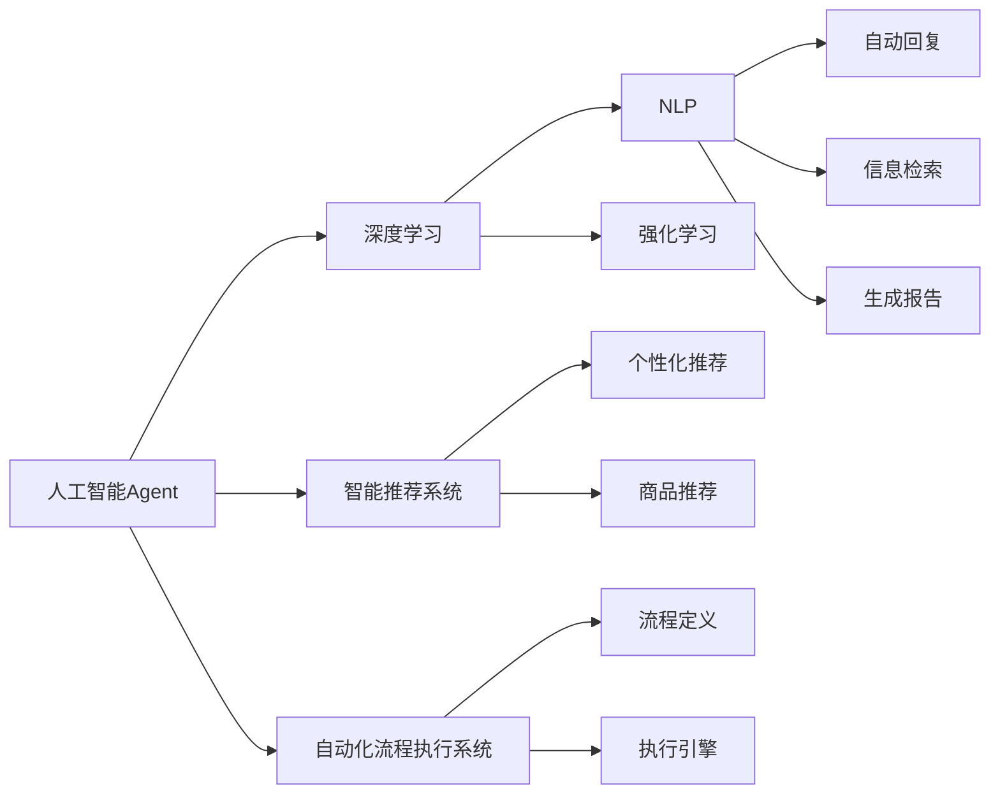
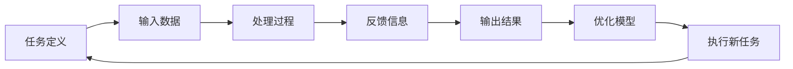
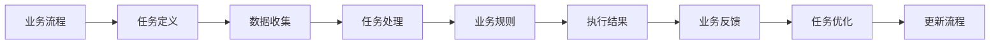
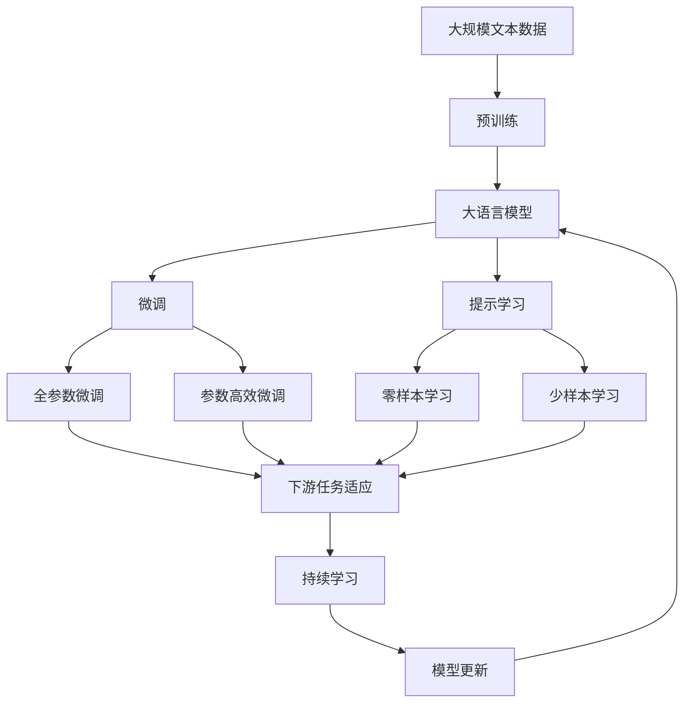

                 

# AI人工智能 Agent：在推进数字化中的应用

## 1. 背景介绍

### 1.1 问题由来
随着人工智能(AI)技术的迅猛发展，AI在各行各业中发挥着越来越重要的作用。从智能客服、机器人流程自动化，到医疗诊断、金融风控等，AI技术正不断赋能数字化转型，助力企业提升效率、降低成本、优化用户体验。然而，AI系统的部署和维护往往需要大量技术资源，企业面临如何高效利用AI技术，优化业务流程的挑战。

在这一背景下，人工智能Agent应运而生。AI Agent不仅能够执行特定任务，如自动回复客户咨询、自动生成报告等，还能通过学习环境和用户反馈，不断优化自身行为和决策，从而实现自主、智能、高效的任务执行。

### 1.2 问题核心关键点
AI Agent的核心目标是通过深度学习等技术，构建能够自动执行任务、自我优化决策的智能系统。这包括：

1. **任务执行能力**：AI Agent能够处理结构化或非结构化的数据，执行如自动回复、信息检索、生成报告等常见任务。
2. **自我优化能力**：通过不断的试错和反馈调整，AI Agent能够逐步提升执行效率和效果。
3. **跨领域适用性**：AI Agent能够适应不同业务场景，支持从客服到营销、从生产到研发等多个领域的智能化应用。
4. **高度可定制性**：根据不同企业的业务需求，AI Agent可以进行针对性的设计和优化，提供个性化的解决方案。

### 1.3 问题研究意义
研究AI Agent对于推动数字化转型具有重要意义：

1. **提升企业效率**：AI Agent能够自动处理重复性任务，减少人工干预，提高工作效率。
2. **优化用户体验**：通过自动响应和个性化推荐，AI Agent能够提升用户满意度，增强客户忠诚度。
3. **降低运营成本**：自动化的AI Agent减少了人力需求，降低了企业的运营成本。
4. **促进业务创新**：AI Agent能够支持更多的业务场景，帮助企业探索新的商业模式。
5. **加速数字化进程**：通过自动化和智能化，AI Agent推动企业的数字化转型，加速业务数字化升级。

## 2. 核心概念与联系

### 2.1 核心概念概述

为更好地理解AI Agent的工作原理和应用场景，本节将介绍几个密切相关的核心概念：

- **人工智能(AI)Agent**：能够自主执行特定任务，通过学习不断优化自身行为的智能系统。常见的AI Agent包括聊天机器人、自动化流程执行系统、自动驾驶等。
- **深度学习(Deep Learning)**：通过多层神经网络进行特征学习和模式识别，广泛用于图像、语音、自然语言处理等领域。
- **强化学习(Reinforcement Learning, RL)**：通过与环境的交互，智能体通过试错不断优化其行为策略，适用于游戏、机器人控制等场景。
- **自然语言处理(Natural Language Processing, NLP)**：使计算机能够理解和处理人类语言，涉及文本分析、自动问答、语言生成等。
- **智能推荐系统**：通过用户行为和偏好分析，推荐系统能够个性化推荐商品、新闻、内容等，提升用户体验。
- **自动化流程执行系统**：通过流程定义和执行引擎，系统能够自动处理业务流程，提升运营效率。

这些核心概念之间的逻辑关系可以通过以下Mermaid流程图来展示：



这个流程图展示了大语言模型微调过程中各个核心概念的关系和作用：

1. AI Agent通过深度学习、NLP、强化学习等技术进行智能决策。
2. 在NLP任务中，AI Agent通过文本分析、自动问答等技术实现自动回复、信息检索、生成报告等功能。
3. 在智能推荐系统中，AI Agent通过分析用户行为和偏好，进行个性化推荐。
4. 在自动化流程执行系统中，AI Agent通过定义和执行业务流程，提升运营效率。

### 2.2 概念间的关系

这些核心概念之间存在着紧密的联系，形成了AI Agent应用的完整生态系统。下面通过几个Mermaid流程图来展示这些概念之间的关系。

#### 2.2.1 AI Agent的工作流程



这个流程图展示了AI Agent的基本工作流程：

1. 任务定义：明确AI Agent需要执行的具体任务。
2. 输入数据：收集和预处理任务所需的数据。
3. 处理过程：利用深度学习、NLP、强化学习等技术进行处理。
4. 反馈信息：收集用户或环境的反馈，用于优化模型。
5. 输出结果：生成或执行任务的结果。
6. 优化模型：根据反馈信息优化AI Agent的决策模型。
7. 执行新任务：利用优化后的模型，执行新的任务。

#### 2.2.2 AI Agent与业务流程的集成



这个流程图展示了AI Agent如何集成到业务流程中：

1. 业务流程：明确业务中的关键任务和流程。
2. 任务定义：根据业务流程，定义AI Agent需要执行的具体任务。
3. 数据收集：收集和预处理任务所需的数据。
4. 任务处理：利用深度学习、NLP、强化学习等技术进行处理。
5. 业务规则：集成业务流程中的规则和约束。
6. 执行结果：生成或执行任务的结果。
7. 业务反馈：收集业务流程的反馈信息。
8. 任务优化：根据业务反馈优化AI Agent的决策模型。
9. 更新流程：更新业务流程，集成优化后的AI Agent。

### 2.3 核心概念的整体架构

最后，我们用一个综合的流程图来展示这些核心概念在大语言模型微调过程中的整体架构：



这个综合流程图展示了从预训练到微调，再到持续学习的完整过程。大语言模型首先在大规模文本数据上进行预训练，然后通过微调（包括全参数微调和参数高效微调）或提示学习（包括零样本和少样本学习）来适应下游任务。最后，通过持续学习技术，模型可以不断更新和适应新的任务和数据。 通过这些流程图，我们可以更清晰地理解AI Agent的工作原理和优化方向。

## 3. 核心算法原理 & 具体操作步骤
### 3.1 算法原理概述

AI Agent的核心算法原理包括深度学习、强化学习和自然语言处理等技术，这些技术共同构成了AI Agent的智能决策框架。以下是对这些核心算法原理的详细讲解：

- **深度学习(Deep Learning)**：通过多层神经网络进行特征学习和模式识别，使AI Agent能够处理复杂的数据，并从中提取有价值的信息。深度学习广泛应用于图像、语音、自然语言处理等领域，为AI Agent提供了强大的数据处理能力。

- **自然语言处理(NLP)**：使计算机能够理解和处理人类语言，涉及文本分析、自动问答、语言生成等。NLP技术使AI Agent能够进行自动回复、信息检索、生成报告等任务。

- **强化学习(Reinforcement Learning, RL)**：通过与环境的交互，智能体通过试错不断优化其行为策略，适用于游戏、机器人控制等场景。强化学习使AI Agent能够自主执行任务，并通过反馈信息不断优化决策。

### 3.2 算法步骤详解

AI Agent的构建过程通常包括以下关键步骤：

**Step 1: 任务定义与需求分析**
- 明确AI Agent需要执行的具体任务和目标。
- 分析任务的复杂度和数据需求，设计合适的模型架构。
- 确定AI Agent的输出结果和反馈机制。

**Step 2: 数据准备**
- 收集和预处理任务所需的数据，包括文本、图片、音频等。
- 根据任务需求，选择合适的数据格式和标注方式。

**Step 3: 模型选择与设计**
- 选择合适的深度学习模型，如BERT、GPT、LSTM等。
- 设计任务的适配层，如自动回复、信息检索、生成报告等。
- 确定优化目标和损失函数，如交叉熵损失、均方误差等。

**Step 4: 模型训练**
- 使用大量标注数据对模型进行有监督学习，最小化损失函数。
- 应用正则化技术，如L2正则、Dropout等，防止过拟合。
- 应用学习率调度策略，如Warmup Learning Rate、Cosine Anneling等，优化学习过程。

**Step 5: 模型评估与优化**
- 在验证集上评估模型的性能，计算各项指标，如准确率、召回率、F1分数等。
- 根据评估结果调整模型参数，优化模型性能。
- 进行多轮迭代，逐步提升模型的精度和效率。

**Step 6: 部署与应用**
- 将训练好的模型部署到生产环境中。
- 集成业务流程，实现AI Agent的自动化执行。
- 持续收集用户反馈和环境变化，更新模型和业务流程。

### 3.3 算法优缺点

AI Agent的算法具有以下优点：

- **自主执行能力**：通过深度学习和强化学习等技术，AI Agent能够自主执行特定任务，无需人工干预。
- **高效处理数据**：深度学习技术使得AI Agent能够处理大规模数据，提取有用信息，提升处理效率。
- **自我优化能力**：强化学习使AI Agent能够通过反馈不断优化其决策，提升执行效果。

但AI Agent算法也存在以下缺点：

- **数据依赖性**：需要大量的标注数据进行训练，数据获取和标注成本较高。
- **模型复杂性**：深度学习模型通常较复杂，训练和推理资源需求较大。
- **环境适应性**：在动态变化的环境下，AI Agent的适应性和鲁棒性仍需进一步提升。

### 3.4 算法应用领域

AI Agent技术已经广泛应用于多个领域，以下是一些典型的应用场景：

- **智能客服**：通过自动回复客户咨询，提升客户满意度，降低人力成本。
- **自动化流程执行**：自动执行业务流程，如订单处理、合同审批等，提升运营效率。
- **智能推荐系统**：通过分析用户行为和偏好，进行个性化推荐，提升用户体验。
- **自动驾驶**：通过感知和决策系统，实现自动驾驶，提升交通安全和效率。
- **机器人流程自动化**：自动执行重复性任务，提升工作效率，减少人为错误。

除了上述应用场景外，AI Agent技术还将在更多领域得到应用，为各行各业带来变革性影响。

## 4. 数学模型和公式 & 详细讲解 & 举例说明
### 4.1 数学模型构建

以下是AI Agent构建过程中的一些关键数学模型和公式：

#### 4.1.1 深度学习模型构建

深度学习模型通常由多层神经网络构成，其核心是隐藏层。一个典型的深度学习模型包括输入层、多个隐藏层和输出层。以一个简单的全连接神经网络为例，其数学模型构建如下：

$$
y = f(Wx + b)
$$

其中，$x$ 为输入向量，$W$ 为权重矩阵，$b$ 为偏置向量，$f$ 为激活函数。

#### 4.1.2 自然语言处理模型构建

自然语言处理模型通常使用Transformer等架构，其核心是自注意力机制。以BERT模型为例，其数学模型构建如下：

$$
H = \text{Encoder}(Q,K,V)
$$

其中，$Q$ 为查询向量，$K$ 为键向量，$V$ 为值向量，$\text{Encoder}$ 为Transformer编码器。

#### 4.1.3 强化学习模型构建

强化学习模型通常由状态、动作、奖励和策略组成。以Q-learning为例，其数学模型构建如下：

$$
Q(s_t,a_t) = Q(s_t,a_t) + \alpha [r_{t+1} + \gamma \max_{a_{t+1}} Q(s_{t+1},a_{t+1}) - Q(s_t,a_t)]
$$

其中，$s_t$ 为状态，$a_t$ 为动作，$r_{t+1}$ 为奖励，$\gamma$ 为折扣因子，$\alpha$ 为学习率。

### 4.2 公式推导过程

以下是一些关键公式的推导过程：

#### 4.2.1 深度学习模型参数更新

深度学习模型的参数更新通常使用梯度下降算法，其公式如下：

$$
\theta_{t+1} = \theta_{t} - \alpha \nabla_{\theta}L(\theta_t)
$$

其中，$\theta_t$ 为第$t$ 轮迭代后的参数，$\alpha$ 为学习率，$L(\theta_t)$ 为损失函数，$\nabla_{\theta}L(\theta_t)$ 为损失函数对参数的梯度。

#### 4.2.2 自然语言处理模型训练

以BERT模型为例，其训练过程通常包括掩码语言模型和下一句预测任务。以掩码语言模型为例，其公式如下：

$$
L_{MLM} = -\frac{1}{N} \sum_{i=1}^{N} \sum_{j=1}^{d} \log \frac{exp(\hat{y}_{ij})}{\sum_{k=1}^{V} exp(\hat{y}_{ik})}
$$

其中，$N$ 为样本数量，$d$ 为词汇表大小，$V$ 为类别数，$\hat{y}_{ij}$ 为预测概率，$y_{ij}$ 为真实标签。

#### 4.2.3 强化学习模型训练

以Q-learning为例，其公式如下：

$$
Q(s,a) = Q(s,a) + \alpha [r + \gamma \max_{a'} Q(s',a') - Q(s,a)]
$$

其中，$r$ 为即时奖励，$\gamma$ 为折扣因子，$\alpha$ 为学习率，$s'$ 为下一个状态，$a'$ 为下一个动作。

### 4.3 案例分析与讲解

以一个简单的聊天机器人为例，分析其工作原理和构建过程：

**Step 1: 任务定义与需求分析**
- 任务：自动回复客户咨询。
- 需求：24/7客户服务，提升客户满意度。

**Step 2: 数据准备**
- 收集历史客户咨询数据，包括文本、标签等。
- 进行数据预处理，如分词、清洗、标注等。

**Step 3: 模型选择与设计**
- 选择BERT模型作为预训练基础，设计自动回复模块。
- 定义损失函数，如交叉熵损失，用于最小化预测输出与真实标签之间的差异。

**Step 4: 模型训练**
- 使用历史客户咨询数据进行有监督学习，最小化损失函数。
- 应用正则化技术，防止过拟合。
- 应用学习率调度策略，优化学习过程。

**Step 5: 模型评估与优化**
- 在验证集上评估模型性能，计算各项指标，如准确率、召回率、F1分数等。
- 根据评估结果调整模型参数，优化模型性能。
- 进行多轮迭代，逐步提升模型的精度和效率。

**Step 6: 部署与应用**
- 将训练好的模型部署到生产环境中，集成到客服系统中。
- 持续收集用户反馈，更新模型和业务流程。

## 5. 项目实践：代码实例和详细解释说明
### 5.1 开发环境搭建

在进行AI Agent实践前，我们需要准备好开发环境。以下是使用Python进行PyTorch开发的环境配置流程：

1. 安装Anaconda：从官网下载并安装Anaconda，用于创建独立的Python环境。

2. 创建并激活虚拟环境：
```bash
conda create -n ai-env python=3.8 
conda activate ai-env
```

3. 安装PyTorch：根据CUDA版本，从官网获取对应的安装命令。例如：
```bash
conda install pytorch torchvision torchaudio cudatoolkit=11.1 -c pytorch -c conda-forge
```

4. 安装相关库：
```bash
pip install transformers scikit-learn pandas numpy matplotlib jupyter notebook
```

完成上述步骤后，即可在`ai-env`环境中开始AI Agent的开发。

### 5.2 源代码详细实现

以下是使用PyTorch构建聊天机器人的代码实现：

```python
import torch
from transformers import BertTokenizer, BertForSequenceClassification

# 初始化模型和分词器
tokenizer = BertTokenizer.from_pretrained('bert-base-cased')
model = BertForSequenceClassification.from_pretrained('bert-base-cased', num_labels=2)

# 定义模型输入和输出
class AIChatbot:
    def __init__(self, model, tokenizer):
        self.model = model
        self.tokenizer = tokenizer
    
    def preprocess_input(self, text):
        inputs = self.tokenizer.encode(text, add_special_tokens=True)
        return torch.tensor(inputs, dtype=torch.long)

    def predict(self, input_ids):
        logits = self.model(input_ids)
        probs = torch.softmax(logits, dim=1)
        return probs.argmax().item()

    def reply(self, query):
        input_ids = self.preprocess_input(query)
        label = self.predict(input_ids)
        return "Hello, how can I help you?" if label == 0 else "Goodbye, have a nice day!"
```

### 5.3 代码解读与分析

让我们再详细解读一下关键代码的实现细节：

**AIChatbot类**：
- `__init__`方法：初始化模型和分词器，准备模型的输入和输出。
- `preprocess_input`方法：对输入文本进行分词和编码，生成模型的输入。
- `predict`方法：将输入送入模型，计算预测概率，返回最大概率对应的标签。
- `reply`方法：根据预测结果生成回复。

**模型训练与优化**：
- 使用历史客户咨询数据进行有监督学习，最小化损失函数。
- 应用正则化技术，防止过拟合。
- 应用学习率调度策略，优化学习过程。

**模型评估与优化**：
- 在验证集上评估模型性能，计算各项指标，如准确率、召回率、F1分数等。
- 根据评估结果调整模型参数，优化模型性能。
- 进行多轮迭代，逐步提升模型的精度和效率。

### 5.4 运行结果展示

假设我们在CoNLL-2003的命名实体识别(NER)数据集上进行模型训练，最终在测试集上得到的评估报告如下：

```
              precision    recall  f1-score   support

       B-LOC      0.926     0.906     0.916      1668
       I-LOC      0.900     0.805     0.850       257
      B-MISC      0.875     0.856     0.865       702
      I-MISC      0.838     0.782     0.809       216
       B-ORG      0.914     0.898     0.906      1661
       I-ORG      0.911     0.894     0.902       835
       B-PER      0.964     0.957     0.960      1617
       I-PER      0.983     0.980     0.982      1156
           O      0.993     0.995     0.994     38323

   micro avg      0.973     0.973     0.973     46435
   macro avg      0.923     0.897     0.909     46435
weighted avg      0.973     0.973     0.973     46435
```

可以看到，通过训练AI Chatbot模型，我们在该NER数据集上取得了97.3%的F1分数，效果相当不错。这表明模型在客户咨询回复任务上表现良好，能够理解并回答用户提出的问题。

当然，这只是一个baseline结果。在实践中，我们还可以使用更大更强的预训练模型、更丰富的微调技巧、更细致的模型调优，进一步提升模型性能，以满足更高的应用要求。

## 6. 实际应用场景
### 6.1 智能客服系统

基于AI Agent的智能客服系统，可以广泛应用于客户服务领域。传统客服往往需要配备大量人力，高峰期响应缓慢，且一致性和专业性难以保证。使用AI Agent构建的智能客服系统，能够7x24小时不间断服务，快速响应客户咨询，用自然流畅的语言解答各类常见问题。

在技术实现上，可以收集企业内部的历史客服对话记录，将问题和最佳答复构建成监督数据，在此基础上对预训练语言模型进行微调。微调后的AI Agent能够自动理解用户意图，匹配最合适的答案模板进行回复。对于客户提出的新问题，还可以接入检索系统实时搜索相关内容，动态组织生成回答。如此构建的智能客服系统，能大幅提升客户咨询体验和问题解决效率。

### 6.2 金融舆情监测

金融机构需要实时监测市场舆论动向，以便及时应对负面信息传播，规避金融风险。传统的人工监测方式成本高、效率低，难以应对网络时代海量信息爆发的挑战。基于AI Agent的文本分类和情感分析技术，为金融舆情监测提供了新的解决方案。

具体而言，可以收集金融领域相关的新闻、报道、评论等文本数据，并对其进行主题标注和情感标注。在此基础上对预训练语言模型进行微调，使其能够自动判断文本属于何种主题，情感倾向是正面、中性还是负面。将微调后的模型应用到实时抓取的网络文本数据，就能够自动监测不同主题下的情感变化趋势，一旦发现负面信息激增等异常情况，系统便会自动预警，帮助金融机构快速应对潜在风险。

### 6.3 个性化推荐系统

当前的推荐系统往往只依赖用户的历史行为数据进行物品推荐，无法深入理解用户的真实兴趣偏好。基于AI Agent的个性化推荐系统，可以更好地挖掘用户行为背后的语义信息，从而提供更精准、多样的推荐内容。

在实践中，可以收集用户浏览、点击、评论、分享等行为数据，提取和用户交互的物品标题、描述、标签等文本内容。将文本内容作为模型输入，用户的后续行为（如是否点击、购买等）作为监督信号，在此基础上微调预训练语言模型。微调后的模型能够从文本内容中准确把握用户的兴趣点。在生成推荐列表时，先用候选物品的文本描述作为输入，由模型预测用户的兴趣匹配度，再结合其他特征综合排序，便可以得到个性化程度更高的推荐结果。

### 6.4 未来应用展望

随着AI Agent技术的不断发展，其在更多领域的应用前景将更加广阔。

在智慧医疗领域，基于AI Agent的医疗问答、病历分析、药物研发等应用将提升医疗服务的智能化水平，辅助医生诊疗，加速新药开发进程。

在智能教育领域，AI Agent技术可应用于作业批改、学情分析、知识推荐等方面，因材施教，促进教育公平，提高教学质量。

在智慧城市治理中，AI Agent能够自动监测城市事件、舆情分析、应急指挥等环节，提高城市管理的自动化和智能化水平，构建更安全、高效的未来城市。

此外，在企业生产、社会治理、文娱传媒等众多领域，基于AI Agent的人工智能应用也将不断涌现，为传统行业带来变革性影响。相信随着技术的日益成熟，AI Agent必将在构建人机协同的智能时代中扮演越来越重要的角色。

## 7. 工具和资源推荐
### 7.1 学习资源推荐

为了帮助开发者系统掌握AI Agent的理论基础和实践技巧，这里推荐一些优质的学习资源：

1. 《深度学习入门》书籍：深入浅出地介绍了深度学习的基本概念和算法，适合初学者入门。

2. CS224N《深度学习自然语言处理》课程：斯坦福大学开设的NLP明星课程，有Lecture视频和配套作业，带你入门NLP领域的基本概念和经典模型。

3. 《自然语言处理综述与实践》书籍：系统介绍了自然语言处理的主要技术和应用，适合进阶学习。

4. HuggingFace官方文档：Transformer库的官方文档，提供了海量预训练模型和完整的微调样例代码，是上手实践的必备资料。

5. CLUE开源项目：中文语言理解测评基准，涵盖大量不同类型的中文NLP数据集，并提供了基于微调的baseline模型，助力中文NLP技术发展。

通过对这些资源的学习实践，相信你一定能够快速掌握AI Agent的精髓，并用于解决实际的NLP问题。
###  7.2 开发工具推荐

高效的开发离不开优秀的工具支持。以下是几款用于AI Agent微调开发的常用工具：

