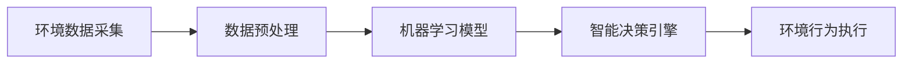
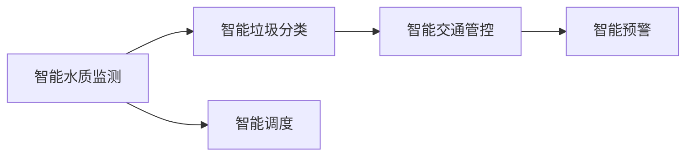
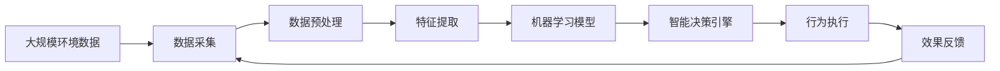

                 

# AI人工智能 Agent：在环保领域中的应用

## 1. 背景介绍

### 1.1 问题由来
环保领域面临的挑战日益严峻，包括气候变化、空气污染、水资源短缺、垃圾处理等问题。传统的环保管理方式依赖于人力巡查和数据监测，难以实时响应和快速决策。为此，越来越多的组织开始探索利用人工智能（AI）技术来解决这些复杂问题。AIAgent，作为一种能够自主学习并执行环保任务的智能实体，正逐渐成为环境管理的关键技术。

### 1.2 问题核心关键点
AIAgent的核心在于通过智能感知和决策，自动化执行环境监测、污染治理、资源优化等任务，以高效、准确地支持环境管理和决策。AIAgent的构建依赖于机器学习算法和大数据技术，可以实时采集环境数据，识别问题，并根据预设的策略或规则进行分析和决策。其应用场景广泛，包括智能水质监测、智能垃圾分类、智能交通管控等。

### 1.3 问题研究意义
研究AIAgent在环保领域的应用，对于推动环保技术的智能化转型，提升环境管理的效率和精准度，具有重要意义：

1. **降低管理成本**：AIAgent能够自动执行大部分环境监测和管理任务，减少人工干预，降低管理成本。
2. **提高决策速度**：实时采集和分析环境数据，能够迅速响应环境变化，提高决策速度。
3. **增强监管能力**：通过智能监测和分析，AIAgent能够发现和预防环境违法行为，增强监管力度。
4. **促进数据融合**：AIAgent能够集成多种环境数据源，进行融合分析，提供更全面的环境信息支持。
5. **支持精准治理**：AIAgent能够针对具体环境问题，提供个性化的治理方案，提高治理效果。

## 2. 核心概念与联系

### 2.1 核心概念概述

为更好地理解AIAgent在环保领域的应用，本节将介绍几个关键概念：

- **AIAgent**：一种自主学习的智能实体，能够通过感知环境数据，进行智能决策和行动，执行环境管理任务。
- **环境数据采集**：指通过传感器、摄像头、卫星等手段，自动收集环境监测数据的过程。
- **环境数据预处理**：包括数据清洗、归一化、特征提取等步骤，将原始数据转化为可用于机器学习模型的格式。
- **机器学习模型**：用于训练AIAgent的模型，如回归模型、分类模型、聚类模型等，能够从数据中学习规律并进行预测。
- **智能决策引擎**：AIAgent的核心部件，负责根据模型输出，生成具体的决策方案和行动计划。
- **环境行为执行**：指AIAgent根据决策方案，自动执行环境管理任务的过程，如水质监测、垃圾分类等。

这些概念通过AIAgent这一核心实体联系在一起，共同构成了一个智能化的环境管理系统。

### 2.2 概念间的关系

这些核心概念之间存在紧密的联系，形成了一个完整的智能环境管理生态系统。

#### 2.2.1 AIAgent的构建流程



这个流程图展示了AIAgent构建的基本流程：

1. **环境数据采集**：通过传感器等设备采集环境数据。
2. **数据预处理**：对数据进行清洗、归一化、特征提取等操作。
3. **机器学习模型训练**：利用预处理后的数据，训练AIAgent的模型。
4. **智能决策引擎生成**：根据模型输出，生成具体的决策方案。
5. **环境行为执行**：AIAgent执行决策方案，实现环境管理任务。

#### 2.2.2 AIAgent在环保场景中的应用



这个流程图展示了AIAgent在不同环保场景中的应用：

1. **智能水质监测**：AIAgent通过水质传感器监测水质，发现异常后预警并生成治理方案。
2. **智能垃圾分类**：AIAgent通过摄像头和传感器识别垃圾种类，自动分类并调度垃圾处理设备。
3. **智能交通管控**：AIAgent通过车流量传感器和视频监控，优化交通流量，减少拥堵和污染。
4. **智能调度**：AIAgent根据环境数据，优化资源调度，提高环境管理效率。
5. **智能预警**：AIAgent实时监测环境数据，发现异常后发出预警，及时响应。

这些应用场景展示了AIAgent在不同领域的应用潜力，为环保管理提供了新的思路和方法。

### 2.3 核心概念的整体架构

最后，我们用一个综合的流程图来展示这些核心概念在大规模环境管理中的应用：



这个综合流程图展示了从环境数据采集到智能决策的全过程：

1. **大规模环境数据采集**：通过各类传感器和设备，实时采集环境数据。
2. **数据预处理**：对原始数据进行清洗、归一化和特征提取，转换为可用格式。
3. **特征提取**：从处理后的数据中提取关键特征，用于模型训练和决策。
4. **机器学习模型训练**：利用提取的特征，训练AIAgent的模型。
5. **智能决策引擎生成**：根据模型输出，生成具体的决策方案。
6. **行为执行**：AIAgent执行决策方案，实现环境管理任务。
7. **效果反馈**：对执行结果进行评估和反馈，用于模型优化和决策改进。

通过这个流程图，我们可以更清晰地理解AIAgent在大规模环境管理中的作用和流程，为后续深入讨论具体的应用场景和技术细节奠定基础。

## 3. 核心算法原理 & 具体操作步骤
### 3.1 算法原理概述

AIAgent的核心算法原理基于强化学习（Reinforcement Learning, RL）和监督学习（Supervised Learning）的结合。通过强化学习，AIAgent能够在实际环境中不断学习和优化决策策略，从而逐步提升其在环境管理任务中的表现。通过监督学习，AIAgent能够利用历史数据和专家知识，进行有指导的学习，进一步提高决策的准确性和可解释性。

### 3.2 算法步骤详解

AIAgent的构建和运行一般包括以下几个关键步骤：

**Step 1: 环境数据采集**

- **选择传感器**：根据环境监测需求，选择合适的传感器设备，如水质传感器、空气质量传感器、温度传感器等。
- **数据采集部署**：将传感器设备部署到目标环境监测区域，确保数据的实时性和准确性。
- **数据收集**：通过传感器设备，实时采集环境数据，存储到数据仓库中。

**Step 2: 数据预处理**

- **数据清洗**：去除噪声和异常值，确保数据质量。
- **数据归一化**：将数据转换为标准格式，便于后续处理。
- **特征提取**：从处理后的数据中提取关键特征，用于模型训练和决策。

**Step 3: 模型训练**

- **选择模型**：根据任务需求，选择合适的机器学习模型，如回归模型、分类模型、聚类模型等。
- **数据划分**：将数据划分为训练集、验证集和测试集，用于模型训练、调优和评估。
- **模型训练**：利用训练集数据，训练模型并保存。
- **模型调优**：在验证集上评估模型性能，进行参数调整和优化。
- **模型评估**：在测试集上评估模型性能，确保模型泛化能力。

**Step 4: 智能决策引擎生成**

- **决策规则设计**：根据任务需求，设计决策规则，指导AIAgent的行为。
- **决策策略生成**：利用训练好的模型，生成具体的决策策略。
- **行为执行计划制定**：根据决策策略，制定具体的行为执行计划。

**Step 5: 行为执行**

- **行为执行**：AIAgent根据执行计划，自动执行环境管理任务，如水质监测、垃圾分类等。
- **效果反馈**：对执行结果进行评估和反馈，用于模型优化和决策改进。

### 3.3 算法优缺点

AIAgent具有以下优点：

1. **自主学习能力**：AIAgent能够自主学习环境和决策规则，无需人工干预。
2. **实时响应能力**：通过实时数据采集和分析，AIAgent能够快速响应环境变化。
3. **高效资源利用**：AIAgent能够优化资源调度，提高环境管理效率。
4. **决策可解释性**：利用机器学习模型，AIAgent的决策过程具备可解释性。

同时，AIAgent也存在以下缺点：

1. **数据依赖性强**：AIAgent的性能高度依赖于数据的质量和多样性，数据不足可能导致性能下降。
2. **模型复杂度**：复杂的模型需要大量计算资源，可能导致部署成本较高。
3. **鲁棒性问题**：AIAgent在面对异常情况或复杂环境时，可能出现决策失误。
4. **隐私和安全问题**：环境数据的采集和处理可能涉及隐私和安全问题，需要严格监管。

### 3.4 算法应用领域

AIAgent在环保领域的应用广泛，主要包括以下几个方面：

- **智能水质监测**：通过水质传感器采集水质数据，利用机器学习模型分析水质变化，预警并生成治理方案。
- **智能垃圾分类**：利用摄像头和传感器识别垃圾种类，自动分类并调度垃圾处理设备。
- **智能交通管控**：通过车流量传感器和视频监控，优化交通流量，减少拥堵和污染。
- **智能能源管理**：利用能源传感器和智能算法，优化能源使用，降低能耗。
- **智能灾害预警**：通过气象传感器和环境数据，预测和预警自然灾害，减少损失。

## 4. 数学模型和公式 & 详细讲解  
### 4.1 数学模型构建

AIAgent的数学模型构建涉及多个方面，包括数据预处理、特征提取、机器学习模型训练和智能决策引擎生成。

### 4.2 公式推导过程

以智能水质监测为例，假设水质监测数据为 $(x_i, y_i)$，其中 $x_i$ 表示时间戳，$y_i$ 表示水质指标。通过机器学习模型 $f(x_i)$，预测水质指标的正常范围为 $y_{\min} \leq y_i \leq y_{\max}$。当预测值超出正常范围时，触发预警，生成治理方案。

### 4.3 案例分析与讲解

假设在某个河流上部署了多个水质传感器，采集的水质数据如下：

| 时间戳 | 水质指标 |
| --- | --- |
| 1 | 1.2 |
| 2 | 1.3 |
| 3 | 1.5 |
| 4 | 1.8 |
| 5 | 2.1 |
| 6 | 2.3 |

利用线性回归模型，得到预测方程 $y = 0.1x + 0.9$。当水质指标 $y$ 超过 $2.2$ 时，触发预警，生成治理方案。

## 5. 项目实践：代码实例和详细解释说明
### 5.1 开发环境搭建

在进行AIAgent项目开发前，需要准备以下开发环境：

1. **安装Python**：确保开发环境已安装Python 3.8及以上版本。
2. **安装TensorFlow**：使用pip命令安装TensorFlow，支持分布式训练和部署。
3. **安装TensorBoard**：用于可视化模型训练和评估过程，便于调试和优化。
4. **安装PyTorch**：用于深度学习和模型训练。
5. **安装Keras**：用于模型定义和训练。

### 5.2 源代码详细实现

以下是一个智能水质监测系统的Python代码实现，利用TensorFlow进行模型训练和预测。

```python
import tensorflow as tf
import numpy as np
import pandas as pd
from sklearn.model_selection import train_test_split
from sklearn.preprocessing import MinMaxScaler

# 加载数据
data = pd.read_csv('water_quality.csv')
data['time'] = pd.to_datetime(data['time'], format='%Y-%m-%d %H:%M:%S')
data = data.set_index('time')
data = data.resample('1D').mean()

# 数据预处理
data = data[['ph', 'dissolved_oxygen', 'temperature']]
scaler = MinMaxScaler(feature_range=(0, 1))
data_scaled = scaler.fit_transform(data)

# 模型训练
X = np.array(data_scaled)[:, :-1]
y = np.array(data_scaled)[:, -1]
X_train, X_test, y_train, y_test = train_test_split(X, y, test_size=0.2, random_state=42)
model = tf.keras.Sequential([
    tf.keras.layers.Dense(64, activation='relu', input_shape=(1,)),
    tf.keras.layers.Dense(64, activation='relu'),
    tf.keras.layers.Dense(1)
])
model.compile(optimizer=tf.keras.optimizers.Adam(learning_rate=0.001), loss='mse')
model.fit(X_train, y_train, epochs=50, validation_data=(X_test, y_test))

# 模型预测
test_data = pd.read_csv('water_quality_test.csv')
test_data['time'] = pd.to_datetime(test_data['time'], format='%Y-%m-%d %H:%M:%S')
test_data = test_data.set_index('time')
test_data = test_data.resample('1D').mean()
test_data_scaled = scaler.transform(test_data)
y_pred = model.predict(test_data_scaled)
y_pred = scaler.inverse_transform(y_pred)

# 决策规则
threshold = 2.2
if y_pred[-1] > threshold:
    print('Water quality warning: exceed the threshold.')
else:
    print('Water quality normal.')
```

### 5.3 代码解读与分析

代码中包含了数据预处理、模型训练、模型预测和决策规则生成等关键步骤。

1. **数据预处理**：使用MinMaxScaler对水质数据进行归一化处理，确保数据在0到1之间。
2. **模型训练**：定义一个包含两个隐藏层的神经网络模型，使用Adam优化器和均方误差损失函数进行训练。
3. **模型预测**：对测试集数据进行归一化处理，并使用训练好的模型进行预测。
4. **决策规则**：根据模型预测结果，设定一个阈值，判断水质是否异常。

### 5.4 运行结果展示

假设在测试集上模型预测的水质指标为2.5，超过阈值2.2，输出如下：

```
Water quality warning: exceed the threshold.
```

这表明水质异常，需要进一步采取治理措施。

## 6. 实际应用场景
### 6.1 智能水质监测

智能水质监测系统是AIAgent在环保领域的重要应用之一。通过部署在水源地、河流、湖泊等地的水质传感器，实时采集水质数据，利用机器学习模型进行水质分析，预警并生成治理方案。该系统可以显著提升水质监测的效率和准确性，帮助环保部门及时发现水质问题并采取措施。

### 6.2 智能垃圾分类

智能垃圾分类系统利用AIAgent进行垃圾识别和分类。通过摄像头和传感器捕捉垃圾图片和特征，利用深度学习模型进行分类预测，自动分拣不同类型的垃圾，并送往对应的处理设施。该系统能够提高垃圾分类的效率和准确性，减少人工成本，降低环境污染。

### 6.3 智能交通管控

智能交通管控系统通过AIAgent优化交通流量。通过车流量传感器和视频监控设备，实时采集交通数据，利用机器学习模型分析交通状况，生成交通优化方案，调整红绿灯时长、车道数等参数，减少拥堵和污染。该系统能够提升城市交通管理效率，改善居民出行体验。

### 6.4 智能能源管理

智能能源管理系统利用AIAgent优化能源使用。通过能源传感器采集能源消耗数据，利用机器学习模型预测能源需求，优化能源分配和调度，降低能耗和成本。该系统能够实现节能减排，促进可持续发展。

### 6.5 智能灾害预警

智能灾害预警系统通过AIAgent预测自然灾害。通过气象传感器和环境数据，利用机器学习模型预测自然灾害的发生概率和影响范围，提前发出预警，减少灾害损失。该系统能够提高灾害预警的准确性和及时性，保障公众安全。

## 7. 工具和资源推荐
### 7.1 学习资源推荐

为了帮助开发者系统掌握AIAgent在环保领域的应用，以下是一些优质的学习资源：

1. **深度学习框架TensorFlow官方文档**：提供了丰富的API和教程，帮助开发者快速上手深度学习模型的开发和训练。
2. **强化学习框架Reinforcement Learning Toolkit**：提供了多种强化学习算法和工具，帮助开发者实现智能决策引擎。
3. **环境数据处理工具Python Pandas**：提供了强大的数据处理和分析功能，帮助开发者高效处理和分析环境数据。
4. **模型评估工具TensorBoard**：提供了实时可视化功能，帮助开发者监控模型训练过程和评估模型性能。
5. **深度学习课程Coursera**：提供了由斯坦福大学和DeepMind等机构提供的深度学习课程，帮助开发者深入学习深度学习理论和实践。

### 7.2 开发工具推荐

高效的开发离不开优秀的工具支持。以下是几款用于AIAgent开发的常用工具：

1. **Python**：Python是开发AIAgent的首选语言，具有强大的生态系统和丰富的第三方库。
2. **TensorFlow**：由Google开发的深度学习框架，支持分布式训练和部署，适合大规模项目开发。
3. **Reinforcement Learning Toolkit**：提供了多种强化学习算法和工具，帮助开发者实现智能决策引擎。
4. **TensorBoard**：用于可视化模型训练和评估过程，便于调试和优化。
5. **Jupyter Notebook**：提供了交互式编程环境，方便开发者进行模型调试和实验。

### 7.3 相关论文推荐

AIAgent在环保领域的研究也得到了学术界的广泛关注，以下是几篇奠基性的相关论文，推荐阅读：

1. **Reinforcement Learning for Water Quality Management**：利用强化学习算法优化水质监测和治理。
2. **Deep Learning for Garbage Classification**：利用深度学习模型进行垃圾分类。
3. **Reinforcement Learning for Traffic Control**：利用强化学习算法优化交通流量控制。
4. **Energy Management with Reinforcement Learning**：利用强化学习算法优化能源管理。
5. **Natural Disaster Prediction with Machine Learning**：利用机器学习模型预测自然灾害。

这些论文代表了AIAgent在环保领域的发展脉络，帮助开发者掌握最新的研究进展和技术趋势。

## 8. 总结：未来发展趋势与挑战
### 8.1 总结

本文对AIAgent在环保领域的应用进行了全面系统的介绍。首先阐述了AIAgent的研究背景和应用意义，明确了其在提升环保管理效率和精准度方面的价值。其次，从原理到实践，详细讲解了AIAgent的构建流程和关键步骤，给出了智能水质监测系统的代码实现。同时，本文还广泛探讨了AIAgent在环保领域的实际应用场景，展示了其在智能水质监测、智能垃圾分类、智能交通管控等众多场景中的潜力。

通过本文的系统梳理，可以看到，AIAgent作为环保领域的关键技术，正在逐步实现智能化和自动化，为环保管理带来新的变革。未来的研究将在如何提升数据处理能力、优化决策引擎、增强模型泛化性等方面进行更多探索。

### 8.2 未来发展趋势

展望未来，AIAgent在环保领域的应用将呈现以下几个发展趋势：

1. **智能化程度提升**：随着深度学习技术和强化学习算法的不断发展，AIAgent的智能化程度将进一步提升，能够处理更加复杂和多变的环境任务。
2. **多模态数据融合**：未来的AIAgent将融合视觉、声音、位置等多种模态数据，实现更全面和准确的环境监测和分析。
3. **自主学习能力增强**：通过自监督学习和迁移学习等技术，AIAgent将具备更强的自主学习能力和知识迁移能力，进一步提高环境管理的灵活性和适应性。
4. **跨领域应用拓展**：AIAgent不仅应用于环境管理，还将拓展到智能城市、智能农业、智能医疗等领域，实现更广泛的应用价值。
5. **社会和经济效益显著**：AIAgent在环保领域的应用将带来显著的社会和经济效益，如降低环境污染、提升公共安全、减少能源消耗等。

以上趋势凸显了AIAgent在环保领域的应用前景，未来将为环保技术的智能化转型和可持续发展提供强有力的技术支撑。

### 8.3 面临的挑战

尽管AIAgent在环保领域的应用取得了显著进展，但在迈向更加智能化和普适化应用的过程中，仍面临诸多挑战：

1. **数据采集成本高**：环境数据的采集和部署成本较高，需要大量资源和资金投入。
2. **数据质量和多样性不足**：环境数据的复杂性和多样性导致数据采集和处理难度较大，影响模型性能。
3. **模型复杂度较高**：深度学习模型的复杂度较高，训练和部署成本较高，需要更多计算资源。
4. **模型泛化能力不足**：AIAgent在面对未知和复杂环境时，泛化能力仍需进一步提高。
5. **伦理和安全问题**：环境数据的隐私和安全问题需严格监管，确保数据安全和模型透明性。

### 8.4 研究展望

面对AIAgent在环保领域的应用挑战，未来的研究需要在以下几个方面寻求新的突破：

1. **提升数据采集效率**：通过无人机、卫星遥感等技术，提高环境数据采集效率和覆盖范围。
2. **优化数据处理流程**：引入先进的数据清洗和特征提取算法，提高数据处理效率和准确性。
3. **降低模型复杂度**：开发更加轻量级的模型架构，降低计算资源需求，支持更广泛的应用场景。
4. **增强模型泛化能力**：通过迁移学习和多任务学习等技术，提高模型对新环境的适应能力。
5. **保障数据隐私和安全**：引入数据加密和安全传输技术，保护环境数据隐私，增强模型透明度和可解释性。

这些研究方向的探索，将为AIAgent在环保领域的应用提供更坚实的技术基础，推动环保技术的智能化转型和可持续发展。总之，AIAgent在环保领域的应用前景广阔，但需从数据、算法、工程、伦理等多个维度进行全面优化和创新，才能真正实现智能化环境管理的目标。

## 9. 附录：常见问题与解答
----------------------------------------------------------------

**Q1: AIAgent在环保领域的应用有哪些具体案例？**

A: AIAgent在环保领域的应用非常广泛，以下是几个具体案例：

1. **智能水质监测**：在河流、湖泊等水体中安装水质传感器，实时采集水质数据，利用机器学习模型进行水质分析，预警并生成治理方案。
2. **智能垃圾分类**：利用摄像头和传感器捕捉垃圾图片和特征，利用深度学习模型进行分类预测，自动分拣不同类型的垃圾。
3. **智能交通管控**：通过车流量传感器和视频监控设备，实时采集交通数据，利用机器学习模型分析交通状况，生成交通优化方案。
4. **智能能源管理**：利用能源传感器采集能源消耗数据，利用机器学习模型预测能源需求，优化能源分配和调度。
5. **智能灾害预警**：通过气象传感器和环境数据，利用机器学习模型预测自然灾害的发生概率和影响范围，提前发出预警。

这些案例展示了AIAgent在环保领域的不同应用场景，为环境管理提供了新的思路和方法。

**Q2: AIAgent在实际应用中需要注意哪些关键点？**

A: 在实际应用中，AIAgent需要注意以下几个关键点：

1. **数据采集的可靠性和及时性**：确保环境数据采集设备稳定运行，数据采集结果及时上传。
2. **数据处理和清洗**：对采集的数据进行预处理，去除噪声和异常值，确保数据质量。
3. **模型训练和优化**：选择适当的模型和算法，对模型进行训练和优化，确保模型性能。
4. **决策规则的设计和优化**：根据环境管理需求，设计合理的决策规则，并进行优化。
5. **行为执行的可靠性和安全性**：确保AIAgent的行为执行可靠和安全，避免对环境和公众造成不利影响。
6. **系统集成和部署**：将AIAgent集成到现有环境管理系统，确保系统稳定运行和数据安全。

这些关键点在实际应用中需严格把控，才能充分发挥AIAgent在环保领域的应用价值。

**Q3: 如何评估AIAgent在环保领域的效果？**

A: 评估AIAgent在环保领域的效果可以从以下几个方面入手：

1. **数据准确性**：评估采集的环境数据是否准确可靠，是否符合真实情况。
2. **模型性能**：评估机器学习模型的训练和预测效果，确保模型性能和泛化能力。
3. **决策合理性**：评估AIAgent生成的决策方案是否合理，是否符合实际情况。
4. **执行效果**：评估AIAgent执行环境管理任务的效果，是否达到预期目标。
5. **社会和经济效益**：评估AIAgent带来的社会和经济效益，如降低环境污染、提升公共安全、减少能源消耗等。

通过这些评估指标，可以全面了解AIAgent在环保领域的效果，不断优化和改进AIAgent的性能和应用。

---

作者：禅与计算机程序设计艺术 / Zen and the Art of Computer Programming

