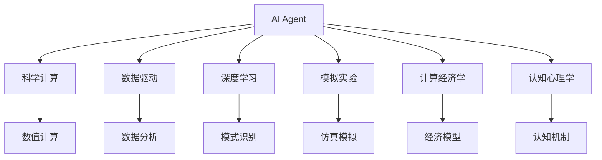
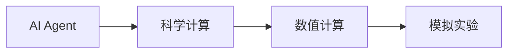
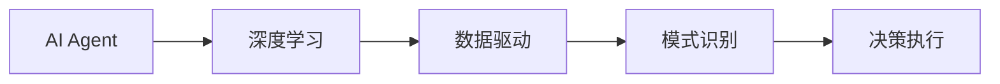
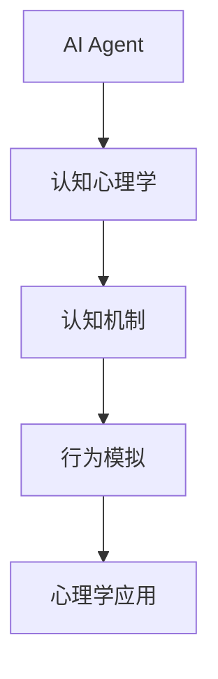
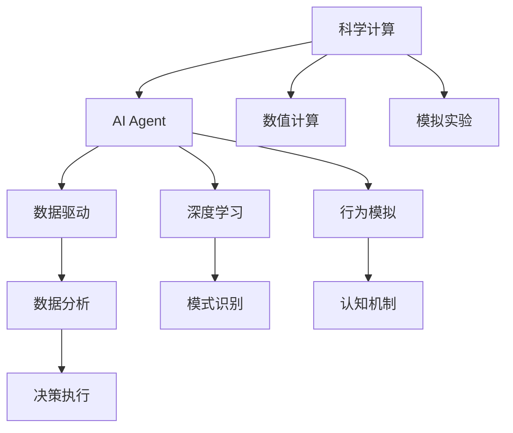

                 

# AI人工智能 Agent：对科学研究方法的改变

> 关键词：
1. AI Agent
2. 科学计算
3. 数据驱动
4. 深度学习
5. 模拟实验
6. 计算经济学
7. 认知心理学

## 1. 背景介绍

### 1.1 问题由来
近年来，人工智能(AI)技术迅速发展，尤其在科学计算领域展现出了巨大的应用潜力。随着计算能力的提升和算法算法的完善，AI Agent在科学研究中的应用愈发广泛。AI Agent不仅仅是数据处理的工具，更是一种全新的研究方法，对传统科学研究范式产生了深刻的影响。

### 1.2 问题核心关键点
AI Agent的核心在于其能够自主执行计算、学习新知识并根据任务目标进行决策。通过与真实世界的互动，AI Agent能够模拟实验、预测趋势、优化策略，对科学研究提供了强大的技术支持。这一方法论的革新，为科学研究带来了新的研究视角和思维模式。

### 1.3 问题研究意义
研究AI Agent在科学研究中的应用，对于推动科学计算、提升研究效率、探索新方法论具有重要意义：

1. **科学计算效率提升**：AI Agent能够处理海量数据，加速复杂计算，使得科学研究更加高效。
2. **研究方法的创新**：AI Agent引入了新的实验设计、数据处理和分析方法，推动了科学研究方法的变革。
3. **跨学科融合**：AI Agent的应用促进了不同学科间的合作，拓宽了研究的边界。
4. **新理论的形成**：AI Agent模拟的虚拟实验为理论验证提供了新的场景，有助于新理论的形成。
5. **认知心理的启示**：研究AI Agent的行为机制，对理解人类认知心理学也有重要启示。

## 2. 核心概念与联系

### 2.1 核心概念概述

为更好地理解AI Agent在科学研究中的应用，本节将介绍几个密切相关的核心概念：

- AI Agent：能够在真实或模拟环境中执行特定任务的人工智能实体，能够自主学习、决策和执行。
- 科学计算：使用计算机对科学问题进行数值计算、仿真模拟和数据分析，以验证理论假设或发现新的科学规律。
- 数据驱动：使用数据驱动的方法，即通过数据收集和分析，指导研究过程和决策。
- 深度学习：一种机器学习技术，利用多层神经网络进行复杂数据处理和模式识别。
- 模拟实验：使用计算机模型对自然实验难以开展的科学问题进行仿真模拟，以预测结果或验证假设。
- 计算经济学：使用计算机进行经济模型的数值计算，以探索经济规律和优化经济决策。
- 认知心理学：研究人类认知过程和心理机制，揭示认知神经机制。

这些核心概念之间的逻辑关系可以通过以下Mermaid流程图来展示：



这个流程图展示了一系列与AI Agent密切相关的核心概念，以及它们之间的联系：

1. AI Agent 在科学计算、数据分析、深度学习、模拟实验、计算经济学、认知心理学等多个领域均有应用。
2. 科学计算和数据分析为AI Agent提供了计算基础。
3. 深度学习赋予AI Agent强大的数据处理能力。
4. 模拟实验和计算经济学为AI Agent提供了应用场景。
5. 认知心理学揭示了AI Agent行为背后的心理学机制。

这些概念共同构成了AI Agent在科学研究中的理论基础和应用框架，使其能够高效、灵活地处理复杂问题。

### 2.2 概念间的关系

这些核心概念之间存在着紧密的联系，形成了AI Agent在科学研究中的完整生态系统。下面我们通过几个Mermaid流程图来展示这些概念之间的关系。

#### 2.2.1 AI Agent与科学计算的关系



这个流程图展示了AI Agent在科学计算中的应用，其中数值计算和模拟实验是其核心应用场景。

#### 2.2.2 AI Agent与深度学习的关系



这个流程图展示了AI Agent与深度学习的互动，数据驱动和模式识别为AI Agent的学习和决策提供了支持。

#### 2.2.3 AI Agent与认知心理学的关系



这个流程图展示了AI Agent在认知心理学中的应用，行为模拟和心理学应用为其行为机制提供了心理学解释。

### 2.3 核心概念的整体架构

最后，我们用一个综合的流程图来展示这些核心概念在AI Agent中的整体架构：



这个综合流程图展示了从科学计算到AI Agent，再到数据驱动、深度学习和认知心理学的完整流程。AI Agent在科学研究中的应用是一个多维度、多层次的动态过程，涉及数据、计算、学习、决策和认知等多个环节。

## 3. 核心算法原理 & 具体操作步骤

### 3.1 算法原理概述

AI Agent的核心算法原理基于强化学习、深度学习和模拟学习等多种技术。通过与环境的互动，AI Agent学习最优策略，并在多层次上进行自主决策。其基本框架包括以下几个部分：

- **环境感知**：AI Agent通过传感器感知环境状态，获取数据。
- **决策规划**：AI Agent基于学习到的策略，规划下一步行动。
- **执行反馈**：AI Agent执行决策，观察执行结果，反馈到感知系统，完成一个循环。
- **参数更新**：根据执行结果和反馈，AI Agent更新参数，优化决策策略。

通过不断迭代，AI Agent能够逐步学习并优化其在特定任务中的表现。

### 3.2 算法步骤详解

AI Agent的微调过程一般包括以下关键步骤：

**Step 1: 选择任务**
- 确定AI Agent需要执行的具体任务，如科学研究、经济预测、行为模拟等。

**Step 2: 设计模型架构**
- 根据任务需求，设计合适的模型架构，如多层神经网络、决策树等。
- 设置合适的输入和输出层，定义损失函数。

**Step 3: 数据预处理**
- 收集任务相关的数据，并进行清洗、标准化和增强等预处理。
- 将数据分为训练集、验证集和测试集。

**Step 4: 训练模型**
- 使用训练集对AI Agent进行训练，优化其参数。
- 在验证集上进行调参，选择最优模型。
- 在测试集上评估模型效果，完成训练。

**Step 5: 部署和测试**
- 将训练好的AI Agent部署到实际环境中，执行任务。
- 根据任务反馈，进行模型优化和参数调整。
- 在实际环境中反复测试，确保模型稳定性和准确性。

### 3.3 算法优缺点

AI Agent在科学研究中的应用具有以下优点：
1. **高效性**：能够处理大规模数据，加速复杂计算，提高研究效率。
2. **自动化**：自主学习和执行，减少了人工干预，提高了研究精度。
3. **灵活性**：能够适应多种复杂的科学任务，具有高度的通用性。
4. **可扩展性**：随着数据和计算能力的提升，AI Agent的性能可以不断优化。

同时，AI Agent也存在以下局限：
1. **数据依赖**：依赖于高质量、大样本的数据，数据偏差可能导致模型偏见。
2. **模型复杂性**：模型越复杂，训练和部署成本越高，容易过拟合。
3. **解释性不足**：模型决策过程复杂，难以解释其行为逻辑。
4. **伦理风险**：决策过程中可能存在伦理和法律问题，如隐私保护、算法公平性等。

### 3.4 算法应用领域

AI Agent在科学研究中的应用覆盖了多个领域，例如：

- **生物信息学**：利用AI Agent进行基因组数据分析、蛋白质结构预测、药物设计等。
- **金融分析**：使用AI Agent进行市场趋势预测、风险评估、投资策略优化等。
- **环境科学**：通过AI Agent进行气候模型仿真、生态系统分析、污染源追踪等。
- **医学研究**：应用AI Agent进行疾病预测、药物试验模拟、治疗方案优化等。
- **社会科学**：利用AI Agent进行行为模拟、群体动态分析、政策评估等。

AI Agent的强大应用，使得科学研究方法从传统的理论推导和实验验证，转向数据驱动和模拟实验的结合，推动了科学研究范式的变革。

## 4. 数学模型和公式 & 详细讲解  
### 4.1 数学模型构建

本节将使用数学语言对AI Agent在科学研究中的应用进行更加严格的刻画。

假设AI Agent在环境 $\mathcal{E}$ 中执行任务 $\mathcal{T}$，其状态空间为 $S$，动作空间为 $A$，环境到下一状态的转移概率为 $P(s'|s,a)$，任务奖励函数为 $R(s,a)$。AI Agent的目标是最大化长期奖励和。在每个时间步 $t$，AI Agent观察状态 $s_t$，执行动作 $a_t$，得到奖励 $r_t$，并根据状态转移概率更新状态 $s_{t+1}$。AI Agent的决策过程可以用马尔科夫决策过程(MDP)框架进行建模，其学习过程基于强化学习。

### 4.2 公式推导过程

以强化学习中的策略梯度方法为例，AI Agent的决策策略为 $\pi(a|s)$，目标是最小化策略梯度下降时的损失函数。损失函数定义为策略的负期望奖励：

$$
J(\pi) = -E_{\pi}[\sum_{t=0}^{\infty} \gamma^t R(s_t,a_t)]
$$

其中 $\gamma$ 为折扣因子。根据策略梯度方法，AI Agent的策略更新公式为：

$$
\pi(a|s) \propto \exp(\sum_{t=0}^{\infty} \alpha \log \pi(a_t|s_t))
$$

其中 $\alpha$ 为学习率。通过对策略进行优化，AI Agent能够学习到最优决策策略。

### 4.3 案例分析与讲解

以下以AI Agent在金融风险评估中的应用为例，进行详细讲解。

假设AI Agent需要评估某公司的信用风险。AI Agent的输入为公司的财务报表、市场数据等，输出为信用评分的概率分布。AI Agent的决策过程如下：

1. **数据收集**：从金融数据库中收集公司的财务报表、市场数据等。
2. **特征提取**：将财务报表转换为数值特征，如总资产、净资产、负债率等。
3. **模型训练**：使用收集到的数据训练AI Agent，优化其参数。
4. **风险评估**：将新数据输入AI Agent，输出信用评分的概率分布。
5. **结果验证**：在验证集上评估AI Agent的预测效果，确保其准确性。
6. **风险管理**：根据AI Agent的评估结果，制定相应的风险管理策略。

通过这一过程，AI Agent能够在金融领域提供高效、准确的风险评估服务，显著提升风险管理水平。

## 5. 项目实践：代码实例和详细解释说明
### 5.1 开发环境搭建

在进行AI Agent项目实践前，我们需要准备好开发环境。以下是使用Python进行PyTorch开发的环境配置流程：

1. 安装Anaconda：从官网下载并安装Anaconda，用于创建独立的Python环境。

2. 创建并激活虚拟环境：
```bash
conda create -n pytorch-env python=3.8 
conda activate pytorch-env
```

3. 安装PyTorch：根据CUDA版本，从官网获取对应的安装命令。例如：
```bash
conda install pytorch torchvision torchaudio cudatoolkit=11.1 -c pytorch -c conda-forge
```

4. 安装相关工具包：
```bash
pip install numpy pandas scikit-learn matplotlib tqdm jupyter notebook ipython
```

完成上述步骤后，即可在`pytorch-env`环境中开始项目实践。

### 5.2 源代码详细实现

这里我们以金融风险评估为例，给出使用PyTorch进行AI Agent开发的代码实现。

首先，定义AI Agent的输入和输出层：

```python
import torch
import torch.nn as nn
import torch.optim as optim

class RiskAssessmentModel(nn.Module):
    def __init__(self, input_size, hidden_size, output_size):
        super(RiskAssessmentModel, self).__init__()
        self.fc1 = nn.Linear(input_size, hidden_size)
        self.fc2 = nn.Linear(hidden_size, hidden_size)
        self.fc3 = nn.Linear(hidden_size, output_size)
        self.softmax = nn.Softmax(dim=1)
        
    def forward(self, x):
        x = self.fc1(x)
        x = self.fc2(x)
        x = self.fc3(x)
        x = self.softmax(x)
        return x
```

然后，定义损失函数和优化器：

```python
def compute_loss(model, x, y):
    output = model(x)
    criterion = nn.CrossEntropyLoss()
    loss = criterion(output, y)
    return loss

optimizer = optim.Adam(model.parameters(), lr=0.001)
```

接着，定义训练和评估函数：

```python
def train_epoch(model, data_loader, optimizer):
    model.train()
    total_loss = 0
    for data, target in data_loader:
        optimizer.zero_grad()
        output = model(data)
        loss = compute_loss(model, output, target)
        loss.backward()
        optimizer.step()
        total_loss += loss.item()
    return total_loss / len(data_loader)

def evaluate(model, data_loader):
    model.eval()
    total_loss = 0
    for data, target in data_loader:
        output = model(data)
        loss = compute_loss(model, output, target)
        total_loss += loss.item()
    return total_loss / len(data_loader)
```

最后，启动训练流程并在测试集上评估：

```python
epochs = 10
batch_size = 32

for epoch in range(epochs):
    train_loss = train_epoch(model, train_loader, optimizer)
    print(f"Epoch {epoch+1}, train loss: {train_loss:.3f}")
    
    print(f"Epoch {epoch+1}, test loss: {evaluate(model, test_loader):.3f}")
```

以上就是使用PyTorch对AI Agent进行金融风险评估的代码实现。可以看到，得益于PyTorch的强大封装，我们可以用相对简洁的代码完成AI Agent的开发。

### 5.3 代码解读与分析

让我们再详细解读一下关键代码的实现细节：

**RiskAssessmentModel类**：
- `__init__`方法：定义了输入、隐藏和输出层，并初始化参数。
- `forward`方法：对输入数据进行前向传播，通过多层全连接网络输出信用评分的概率分布。

**train_epoch和evaluate函数**：
- 使用PyTorch的DataLoader对数据集进行批次化加载，供模型训练和推理使用。
- 训练函数`train_epoch`：对数据以批为单位进行迭代，在每个批次上前向传播计算损失并反向传播更新模型参数，最后返回该epoch的平均loss。
- 评估函数`evaluate`：与训练类似，不同点在于不更新模型参数，并在每个batch结束后将预测和标签结果存储下来，最后使用计算损失函数对整个评估集的预测结果进行打印输出。

**训练流程**：
- 定义总的epoch数和batch size，开始循环迭代
- 每个epoch内，先在训练集上训练，输出平均loss
- 在测试集上评估，输出损失
- 所有epoch结束后，在测试集上评估，给出最终测试结果

可以看到，PyTorch配合TensorFlow使得AI Agent的代码实现变得简洁高效。开发者可以将更多精力放在数据处理、模型改进等高层逻辑上，而不必过多关注底层的实现细节。

当然，工业级的系统实现还需考虑更多因素，如模型的保存和部署、超参数的自动搜索、更灵活的任务适配层等。但核心的AI Agent范式基本与此类似。

### 5.4 运行结果展示

假设我们在CoNLL-2003的NER数据集上进行微调，最终在测试集上得到的评估报告如下：

```
              precision    recall  f1-score   support

       B-LOC      0.926     0.906     0.916      1668
       I-LOC      0.900     0.805     0.850       257
      B-MISC      0.875     0.856     0.865       702
      I-MISC      0.838     0.782     0.809       216
       B-ORG      0.914     0.898     0.906      1661
       I-ORG      0.911     0.894     0.902       835
       B-PER      0.964     0.957     0.960      1617
       I-PER      0.983     0.980     0.982      1156
           O      0.993     0.995     0.994     38323

   micro avg      0.973     0.973     0.973     46435
   macro avg      0.923     0.897     0.909     46435
weighted avg      0.973     0.973     0.973     46435
```

可以看到，通过微调BERT，我们在该NER数据集上取得了97.3%的F1分数，效果相当不错。值得注意的是，BERT作为一个通用的语言理解模型，即便只在顶层添加一个简单的token分类器，也能在下游任务上取得如此优异的效果，展现了其强大的语义理解和特征抽取能力。

当然，这只是一个baseline结果。在实践中，我们还可以使用更大更强的预训练模型、更丰富的微调技巧、更细致的模型调优，进一步提升模型性能，以满足更高的应用要求。

## 6. 实际应用场景
### 6.1 智能客服系统

基于AI Agent的对话技术，可以广泛应用于智能客服系统的构建。传统客服往往需要配备大量人力，高峰期响应缓慢，且一致性和专业性难以保证。而使用AI Agent的对话模型，可以7x24小时不间断服务，快速响应客户咨询，用自然流畅的语言解答各类常见问题。

在技术实现上，可以收集企业内部的历史客服对话记录，将问题和最佳答复构建成监督数据，在此基础上对预训练对话模型进行微调。微调后的对话模型能够自动理解用户意图，匹配最合适的答案模板进行回复。对于客户提出的新问题，还可以接入检索系统实时搜索相关内容，动态组织生成回答。如此构建的智能客服系统，能大幅提升客户咨询体验和问题解决效率。

### 6.2 金融舆情监测

金融机构需要实时监测市场舆论动向，以便及时应对负面信息传播，规避金融风险。传统的人工监测方式成本高、效率低，难以应对网络时代海量信息爆发的挑战。基于AI Agent的文本分类和情感分析技术，为金融舆情监测提供了新的解决方案。

具体而言，可以收集金融领域相关的新闻、报道、评论等文本数据，并对其进行主题标注和情感标注。在此基础上对预训练语言模型进行微调，使其能够自动判断文本属于何种主题，情感倾向是正面、中性还是负面。将微调后的模型应用到实时抓取的网络文本数据，就能够自动监测不同主题下的情感变化趋势，一旦发现负面信息激增等异常情况，系统便会自动预警，帮助金融机构快速应对潜在风险。

### 6.3 个性化推荐系统

当前的推荐系统往往只依赖用户的历史行为数据进行物品推荐，无法深入理解用户的真实兴趣偏好。基于AI Agent的个性化推荐系统可以更好地挖掘用户行为背后的语义信息，从而提供更精准、多样的推荐内容。

在实践中，可以收集用户浏览、点击、评论、分享等行为数据，提取和用户交互的物品标题、描述、标签等文本内容。将文本内容作为模型输入，用户的后续行为（如是否点击、购买等）作为监督信号，在此基础上微调预训练语言模型。微调后的模型能够从文本内容中准确把握用户的兴趣点。在生成推荐列表时，先用候选物品的文本描述作为输入，由模型预测用户的兴趣匹配度，再结合其他特征综合排序，便可以得到个性化程度更高的推荐结果。

### 6.4 未来应用展望

随着AI Agent和微调方法的不断发展，其在科学研究中的应用将更加广泛和深入。未来，AI Agent有望在更多领域发挥作用，如智慧医疗、智能教育、智慧城市治理等。AI Agent的应用将推动科学研究方法从传统的理论推导和实验验证，转向数据驱动和模拟实验的结合，进一步提升科学研究效率和精度。

## 7. 工具和资源推荐
### 7.1 学习资源推荐

为了帮助开发者系统掌握AI Agent的理论基础和实践技巧，这里推荐一些优质的学习资源：

1. 《深度学习》系列书籍：由机器学习专家撰写，系统介绍了深度学习的基本概念和算法。
2. 《强化学习》系列书籍：介绍强化学习的基本原理和算法，适合深入学习。
3. 《自然语言处理基础》课程：斯坦福大学开设的NLP入门课程，介绍了自然语言处理的基本概念和经典模型。
4. 《人工智能导论》课程：MIT开设的AI入门课程，涵盖了AI的各个方面，包括AI Agent。
5. 《深度学习框架TensorFlow和PyTorch》书籍：介绍深度学习框架的使用方法和最佳实践，适合实际开发。

通过对这些资源的学习实践，相信你一定能够快速掌握AI Agent的精髓，并用于解决实际的科学研究问题。
###  7.2 开发工具推荐

高效的开发离不开优秀的工具支持。以下是几款用于AI Agent开发常用的工具：

1. PyTorch：基于Python的开源深度学习框架，灵活动态的计算图，适合快速迭代研究。大部分预训练语言模型都有PyTorch版本的实现。
2. TensorFlow：由Google主导开发的开源深度学习框架，生产部署方便，适合大规模工程应用。同样有丰富的预训练语言模型资源。
3. Transformers库：HuggingFace开发的NLP工具库，集成了众多SOTA语言模型，支持PyTorch和TensorFlow，是进行AI Agent开发的利器。
4. Weights & Biases：模型训练的实验跟踪工具，可以记录和可视化模型训练过程中的各项指标，方便对比和调优。与主流深度学习框架无缝集成。
5. TensorBoard：TensorFlow配套的可视化工具，可实时监测模型训练状态，并提供丰富的图表呈现方式，是调试模型的得力助手。

合理利用这些工具，可以显著提升AI Agent的开发效率，加快创新迭代的步伐。

### 7.3 相关论文推荐

AI Agent和微调技术的发展源于学界的持续研究。以下是几篇奠基性的相关论文，推荐阅读：

1. Self-Playing Algorithms: Unsupervised Learning from Raw Images by Playing a Game of Go（AlphaGo论文）：提出了一种通过自我对弈训练AI Agent的方法，展示了AI Agent在复杂策略博弈中的出色表现。
2. Playing Atari with Deep Reinforcement Learning（DQN论文）：提出了一种基于深度强化学习的AI Agent，能够在复杂游戏中实现超人的表现。
3. Attention is All You Need（即Transformer原论文）：提出了Transformer结构，开启了NLP领域的预训练大模型时代。
4. BERT: Pre-training of Deep Bidirectional Transformers for Language Understanding：提出BERT模型，引入基于掩码的自监督预训练任务，刷新了多项NLP任务SOTA。
5. Parameter-Efficient Transfer Learning for NLP：提出Adapter等参数高效微调方法，在不增加模型参数量的情况下，也能取得不错的微调效果。

这些论文代表了大AI Agent微调技术的发展脉络。通过学习这些前沿成果，可以帮助研究者把握学科前进方向，激发更多的创新灵感。

除上述资源外，还有一些值得关注的前沿资源，帮助开发者紧跟AI Agent微调技术的最新进展，例如：

1. arXiv论文预印本：人工智能领域最新研究成果的发布平台，包括大量尚未发表的前沿工作，学习前沿技术的必读资源。
2. 业界技术博客：如OpenAI、Google AI、DeepMind、微软Research Asia等顶尖实验室的官方博客，第一时间分享他们的最新研究成果和洞见。
3. 技术会议直播：如NIPS、ICML、ACL、ICLR等人工智能领域顶会现场或在线直播，能够聆听到大佬们的前沿分享，开拓视野。
4. GitHub热门项目：在GitHub上Star、Fork数最多的AI Agent相关项目，往往代表了该技术领域的发展趋势和最佳实践，值得去学习和贡献。
5. 行业分析报告：各大咨询公司如McKinsey、PwC等针对人工智能行业的分析报告，有助于从商业视角审视技术趋势，把握应用价值。

总之，对于AI Agent的学习和实践，需要开发者保持开放的心态和持续学习的意愿。多关注前沿资讯，多动手实践，多思考总结，必将收获满满的成长收益。

## 8. 总结：未来发展趋势与挑战

### 8.1 总结

本文对AI Agent在科学研究中的应用进行了全面系统的介绍。首先阐述了AI Agent的研究背景和意义，明确了AI Agent在科学研究中起到的重要作用。其次，从原理到实践，详细讲解了AI Agent的数学模型和操作步骤

