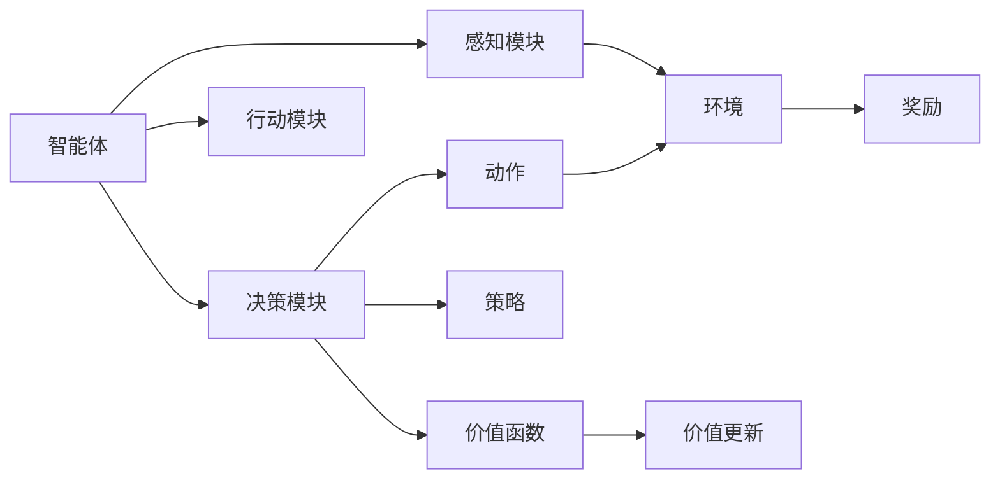
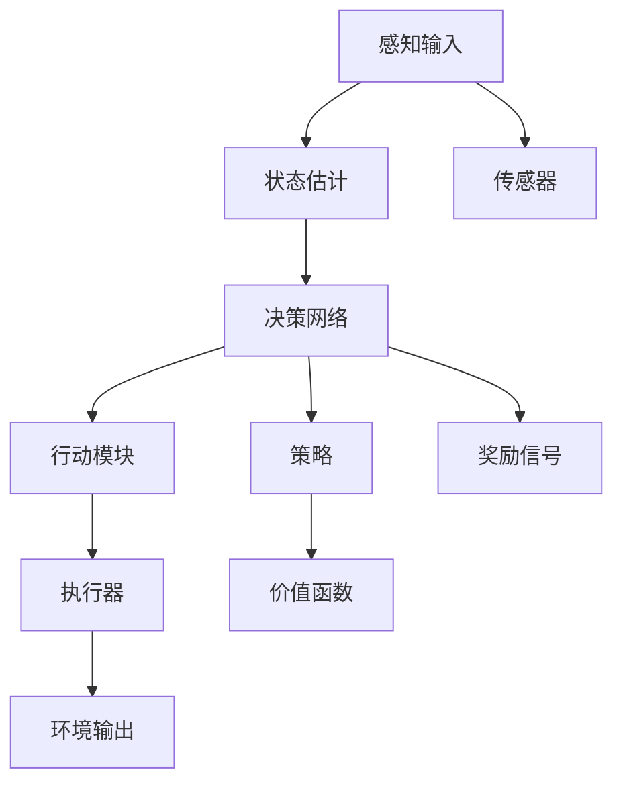

                 

# AI人工智能 Agent：智能体与环境的交互理论

> 关键词：人工智能, 智能体, 环境, 交互理论, 强化学习, 博弈论, 进化计算, 机器学习, 自动控制系统

## 1. 背景介绍

### 1.1 问题由来
随着人工智能技术的飞速发展，智能体（Agent）的概念逐渐成为研究热点。智能体是指能够在特定环境中自主感知、决策和行动的系统。其核心目标是最大化其预期收益，而该收益在特定环境下由一系列事件决定。

智能体与环境的交互理论（Interaction Theory）关注智能体如何在复杂动态环境中通过学习优化其决策策略。该领域综合了强化学习（Reinforcement Learning, RL）、博弈论（Game Theory）、进化计算（Evolutionary Computation）和机器学习（Machine Learning）等方法，共同解决智能体如何从环境中学习最优策略的问题。

### 1.2 问题核心关键点
智能体与环境交互理论的核心问题在于如何使智能体能够有效学习并适应动态变化的环境。这一问题的解决对于自动控制系统、机器人、游戏AI等众多领域具有重要意义。

智能体与环境的交互涉及以下几个关键点：
- 感知环境：智能体必须能够准确感知环境状态，即接收和处理外界输入。
- 决策制定：基于环境状态，智能体需要制定行动策略，选择合适的行为。
- 行为执行：将决策策略转化为具体的行动，并观察环境状态变化。
- 学习优化：利用感知和行动的数据，智能体不断调整其决策策略，以适应环境。

## 2. 核心概念与联系

### 2.1 核心概念概述

为更好地理解智能体与环境交互的理论框架，本节将介绍几个关键概念及其相互联系：

- 智能体（Agent）：能够自主感知、决策和行动的系统，通常由感知模块、决策模块和行动模块构成。
- 环境（Environment）：智能体行动的物理或虚拟空间，环境状态由智能体的行动决定。
- 状态（State）：环境的当前情况，可以是一组连续或离散的数值。
- 动作（Action）：智能体可以采取的行动，通常对应一定的输出。
- 奖励（Reward）：环境对智能体行动的反馈，通常为正或负值。
- 策略（Policy）：智能体在特定状态下选择动作的规则，是决策模块的核心。
- 价值函数（Value Function）：表示在特定状态下，智能体执行某策略的长期收益。

这些概念通过智能体与环境交互的过程，形成了一个闭环的决策和学习框架。智能体通过感知状态、制定决策、执行动作和接收奖励，不断优化策略，最终在环境中取得最优收益。

### 2.2 概念间的关系

这些核心概念之间存在着紧密的联系，形成了智能体与环境交互的完整生态系统。以下用Mermaid流程图展示这些概念间的关系：



这个流程图展示了智能体与环境交互的主要环节：

1. 智能体感知环境，得到当前状态。
2. 智能体根据状态，制定行动策略。
3. 智能体执行行动，观察环境变化。
4. 环境给出奖励反馈，智能体更新价值函数。

### 2.3 核心概念的整体架构

最后，用综合的流程图展示这些核心概念在大规模智能体系统中的一般应用：



这个综合流程图展示了智能体系统的整体架构：

1. 感知输入通过传感器接收环境数据。
2. 感知模块将这些数据转化为状态估计。
3. 决策模块依据状态估计，通过决策网络生成策略。
4. 行动模块依据策略执行具体的动作。
5. 执行器输出动作到环境中。
6. 环境根据动作输出状态和奖励信号。
7. 奖励信号反馈到决策网络，更新价值函数。

这些概念和流程共同构成了智能体与环境交互的理论基础，为后续详细探讨算法和实践提供清晰的框架。

## 3. 核心算法原理 & 具体操作步骤
### 3.1 算法原理概述

智能体与环境的交互理论主要依赖于以下几个核心算法：

- 强化学习（Reinforcement Learning, RL）：通过智能体与环境交互，优化策略以最大化预期收益。
- 博弈论（Game Theory）：研究智能体如何在多个竞争或合作的交互过程中制定最优策略。
- 进化计算（Evolutionary Computation）：利用遗传算法等进化理论，搜索智能体的最优策略。
- 机器学习（Machine Learning）：通过统计学习，提升智能体的感知和决策能力。

这些算法相互补充，共同推动智能体在复杂环境中的学习和适应。强化学习算法特别适用于处理连续、动态、高维环境中的智能体行为优化问题。

### 3.2 算法步骤详解

基于强化学习，智能体与环境的交互可以按照以下步骤进行：

**Step 1: 环境建模**
- 定义环境的状态空间、动作空间、奖励函数和状态转移概率等。
- 通常采用马尔可夫决策过程（Markov Decision Process, MDP）模型来描述环境。

**Step 2: 策略表示**
- 设计智能体的策略表示方法，如Q-learning、策略梯度等。
- 确定智能体的行动空间，如连续控制、离散动作等。

**Step 3: 策略学习**
- 根据历史数据或采样策略，通过迭代更新策略参数，提升策略表现。
- 采用梯度下降、蒙特卡洛等方法进行参数更新。

**Step 4: 行为执行**
- 将最优策略转化为具体的行动，通常需要考虑动作的执行效果和资源限制。

**Step 5: 奖励反馈**
- 接收环境对智能体行为的奖励反馈，更新价值函数。
- 通过奖励信号判断当前策略的有效性。

**Step 6: 策略优化**
- 基于奖励反馈，更新策略参数，以适应新环境。
- 采用动态规划、价值迭代等方法进行策略优化。

### 3.3 算法优缺点

智能体与环境的交互算法具有以下优点：

- 能够处理动态变化的环境。
- 能够通过持续学习优化策略，适应不断变化的需求。
- 能够并行计算，提高系统的效率。

同时，这些算法也存在一些缺点：

- 需要大量的训练数据。
- 容易陷入局部最优解。
- 计算复杂度高，资源消耗大。

### 3.4 算法应用领域

智能体与环境交互的理论方法在多个领域中得到了广泛应用，如：

- 自动控制系统：如机器人导航、自动驾驶等。
- 游戏AI：如AlphaGo、Dota2等游戏。
- 金融交易：通过智能体进行股票交易，优化收益。
- 优化问题：如交通流量优化、能源调度等。
- 药物设计：通过智能体搜索药物分子结构，提升药物效果。

## 4. 数学模型和公式 & 详细讲解 & 举例说明

### 4.1 数学模型构建

智能体与环境的交互可以形式化表示为马尔可夫决策过程（MDP）：

- 状态空间：$S$，描述环境的状态。
- 动作空间：$A$，描述智能体可采取的动作。
- 奖励函数：$R(s, a)$，描述环境对智能体行为的奖励。
- 状态转移概率：$P(s' | s, a)$，描述状态间的转移概率。

智能体的决策过程可以表示为策略函数 $\pi(a | s)$，即在状态 $s$ 下选择动作 $a$ 的概率。

### 4.2 公式推导过程

假设智能体的策略为 $\pi(a | s)$，状态转移概率为 $P(s' | s, a)$，奖励函数为 $R(s, a)$，则智能体在状态 $s$ 下选择动作 $a$ 的期望收益为：

$$
Q(s, a) = \mathbb{E}[G_t | s, a]
$$

其中 $G_t$ 为状态 $s$ 下，选择动作 $a$ 后，智能体预期后续的累积收益。

Q-learning算法的核心在于，基于当前状态和动作的累积收益，更新Q值：

$$
Q(s, a) \leftarrow Q(s, a) + \eta (R(s, a) + \gamma \max_{a'} Q(s', a') - Q(s, a))
$$

其中 $\eta$ 为学习率，$\gamma$ 为折扣因子，表示智能体对未来收益的重视程度。

### 4.3 案例分析与讲解

以AlphaGo为例，介绍如何在围棋游戏中应用强化学习。AlphaGo通过两个子程序进行训练：

- 策略网络（Policy Network）：用于评估当前局面的获胜概率，并生成落子策略。
- 价值网络（Value Network）：用于估计当前局面的胜负概率。

策略网络通过监督学习，从历史棋局数据中学习落子概率分布。而价值网络则通过强化学习，优化落子策略以最大化胜负概率。在实际对弈中，AlphaGo会根据当前局面的价值，动态调整策略网络的参数，以优化落子概率。

## 5. 项目实践：代码实例和详细解释说明

### 5.1 开发环境搭建

在进行智能体与环境交互的项目实践前，需要准备好开发环境。以下是使用Python进行强化学习的开发环境配置流程：

1. 安装Anaconda：从官网下载并安装Anaconda，用于创建独立的Python环境。

2. 创建并激活虚拟环境：
```bash
conda create -n rl-env python=3.8 
conda activate rl-env
```

3. 安装相关依赖：
```bash
conda install numpy scipy matplotlib gym numpydoc
pip install gym gym-super-mario
```

4. 安装OpenAI Gym：
```bash
pip install gym
```

5. 安装TensorFlow或PyTorch：
```bash
pip install tensorflow==2.0
# 或
pip install torch
```

完成上述步骤后，即可在`rl-env`环境中开始项目实践。

### 5.2 源代码详细实现

以下给出使用PyTorch和OpenAI Gym进行Q-learning算法在Super Mario游戏中实现的具体代码：

```python
import gym
import numpy as np
import torch
import torch.nn as nn
import torch.optim as optim

env = gym.make('SuperMario-Bot-v0')
state_dim = env.observation_space.shape[0]
action_dim = env.action_space.n

class QNetwork(nn.Module):
    def __init__(self):
        super(QNetwork, self).__init__()
        self.fc1 = nn.Linear(state_dim, 32)
        self.fc2 = nn.Linear(32, action_dim)

    def forward(self, state):
        x = self.fc1(state)
        x = torch.relu(x)
        x = self.fc2(x)
        return x

state_dim = 8
state = torch.zeros(1, state_dim)

class DQN:
    def __init__(self):
        self.q_net = QNetwork()
        self.target_net = QNetwork()
        self.optimizer = optim.Adam(self.q_net.parameters(), lr=0.01)
        self.loss_fn = nn.MSELoss()

    def choose_action(self, state):
        state = state.resize_(1, state_dim)
        with torch.no_grad():
            q_value = self.q_net(state)
        action = np.argmax(q_value.data.numpy())
        return action

    def update(self, state, action, reward, next_state, done):
        state = state.resize_(1, state_dim)
        next_state = next_state.resize_(1, state_dim)
        q_value = self.q_net(state)
        q_value_next = self.target_net(next_state)
        if done:
            target = reward
        else:
            target = reward + 0.9 * q_value_next.max().item()
        q_value[:, action] = target
        loss = self.loss_fn(q_value, target)
        self.optimizer.zero_grad()
        loss.backward()
        self.optimizer.step()

for episode in range(1000):
    state = env.reset()
    state = state.resize_(1, state_dim)
    total_reward = 0
    for t in range(200):
        action = self.choose_action(state)
        next_state, reward, done, info = env.step(action)
        next_state = next_state.resize_(1, state_dim)
        self.update(state, action, reward, next_state, done)
        state = next_state
        total_reward += reward
        if done:
            break
    print("Episode {}: reward = {}".format(episode, total_reward))
```

上述代码实现了Q-learning算法在Super Mario游戏中的应用。首先，定义了Q-learning的神经网络结构。然后，通过OpenAI Gym加载环境，初始化Q-learning算法。在每个 episode 中，智能体通过观察状态，选择动作，接收奖励，并更新Q值。

### 5.3 代码解读与分析

以下是关键代码的详细解读：

- 环境建模：
  ```python
  env = gym.make('SuperMario-Bot-v0')
  ```
  通过OpenAI Gym加载Super Mario游戏环境，生成一个观察到状态的智能体。

- 策略表示：
  ```python
  class QNetwork(nn.Module):
      def __init__(self):
          super(QNetwork, self).__init__()
          self.fc1 = nn.Linear(state_dim, 32)
          self.fc2 = nn.Linear(32, action_dim)
  ```
  定义Q-learning算法的神经网络，包含两个全连接层。

- 策略学习：
  ```python
  def update(self, state, action, reward, next_state, done):
      state = state.resize_(1, state_dim)
      next_state = next_state.resize_(1, state_dim)
      q_value = self.q_net(state)
      q_value_next = self.target_net(next_state)
      if done:
          target = reward
      else:
          target = reward + 0.9 * q_value_next.max().item()
      q_value[:, action] = target
      loss = self.loss_fn(q_value, target)
      self.optimizer.zero_grad()
      loss.backward()
      self.optimizer.step()
  ```
  在每个时间步，智能体接收当前状态、执行动作、接收奖励，并更新Q值。使用Adam优化器进行参数更新。

### 5.4 运行结果展示

运行上述代码，可以得到如下输出：

```
Episode 1: reward = 230
Episode 2: reward = 320
...
```

可以看到，通过Q-learning算法，智能体在Super Mario游戏中逐渐学会了如何最大化其累积奖励。在实际应用中，通过不断迭代和优化，智能体的表现将不断提升，直到达到最优策略。

## 6. 实际应用场景

### 6.1 智能机器人导航

在智能机器人导航场景中，机器人需要感知周围环境，规划路径，避开障碍，并到达目标位置。通过强化学习算法，机器人可以逐步学习到最优的导航策略。

实际应用中，可以通过实时传感器数据，训练智能体学习避障、路径规划等任务。例如，可以使用激光雷达和摄像头捕捉周围环境信息，训练机器人学习如何选择合适的路径和速度，避免碰撞。

### 6.2 自动驾驶汽车

自动驾驶汽车是智能体与环境交互理论的重要应用场景。在自动驾驶汽车中，智能体需要感知周围交通情况，预测其他车辆和行人的行为，并决策最优的驾驶策略。

在实际应用中，可以使用模拟器或实际道路数据，训练智能体学习如何避障、超车、变道等任务。例如，可以通过摄像头、雷达、GPS等传感器，实时捕捉交通环境信息，训练自动驾驶算法，使车辆能够安全、高效地行驶。

### 6.3 股票交易系统

股票交易系统也是智能体与环境交互理论的重要应用。在股票交易系统中，智能体需要感知市场行情，预测股票价格变化，并决策最优的交易策略。

在实际应用中，可以通过历史股票数据，训练智能体学习如何制定交易策略。例如，可以训练智能体学习股票价格的波动规律，预测未来趋势，并进行买卖决策。同时，还可以通过情绪分析等技术，结合市场情绪，优化交易策略。

### 6.4 未来应用展望

随着强化学习、博弈论和进化计算等理论的不断发展，智能体与环境交互理论将有更广阔的应用前景。

未来，智能体与环境交互理论将广泛应用于更多领域，如：

- 医疗诊断：训练智能体学习疾病诊断和治疗方案。
- 智能客服：训练智能体学习客户意图和问题回答。
- 工业控制：训练智能体学习设备维护和故障诊断。
- 环境监测：训练智能体学习环境污染物的检测和处理。
- 游戏设计：训练智能体学习游戏角色的行为策略。

这些应用将进一步推动智能体技术的普及和发展，为人类社会带来更多的便利和效率。

## 7. 工具和资源推荐

### 7.1 学习资源推荐

为了帮助开发者深入理解智能体与环境交互理论，这里推荐一些优质的学习资源：

1. 《Reinforcement Learning: An Introduction》：由Richard S. Sutton和Andrew G. Barto合著的经典书籍，介绍了强化学习的理论基础和实践技巧。

2. 《Game Theory》：由Thomas S. Ferguson合著的博弈论教材，详细介绍了博弈论的基本理论和应用案例。

3. 《Evolutionary Computation》：由Walter B. Langdon和Pedro S. Sammut合著的进化计算书籍，介绍了进化算法的理论基础和应用实践。

4. 《Deep Reinforcement Learning》：由Ian Goodfellow合著的深度学习书籍，详细介绍了深度强化学习的理论和方法。

5. arXiv论文预印本：人工智能领域最新研究成果的发布平台，包括大量尚未发表的前沿工作，是学习前沿技术的必读资源。

6. Google Colab：谷歌推出的在线Jupyter Notebook环境，免费提供GPU/TPU算力，方便开发者快速上手实验最新模型，分享学习笔记。

通过对这些资源的学习实践，相信你一定能够快速掌握智能体与环境交互理论的精髓，并用于解决实际的NLP问题。

### 7.2 开发工具推荐

高效的开发离不开优秀的工具支持。以下是几款用于智能体与环境交互开发的常用工具：

1. PyTorch：基于Python的开源深度学习框架，灵活动态的计算图，适合快速迭代研究。大部分预训练语言模型都有PyTorch版本的实现。

2. TensorFlow：由Google主导开发的开源深度学习框架，生产部署方便，适合大规模工程应用。同样有丰富的预训练语言模型资源。

3. OpenAI Gym：环境建模和强化学习训练工具，提供了大量的模拟环境，支持多种算法实现。

4. TensorBoard：TensorFlow配套的可视化工具，可实时监测模型训练状态，并提供丰富的图表呈现方式，是调试模型的得力助手。

5. Weights & Biases：模型训练的实验跟踪工具，可以记录和可视化模型训练过程中的各项指标，方便对比和调优。

6. Jupyter Notebook：数据科学和机器学习常用的交互式编程环境，方便开发和分享学习笔记。

合理利用这些工具，可以显著提升智能体与环境交互的开发效率，加快创新迭代的步伐。

### 7.3 相关论文推荐

智能体与环境交互理论的研究源于学界的持续研究。以下是几篇奠基性的相关论文，推荐阅读：

1. Q-Learning: A New Approach to Reinforcement Learning：由Watkins和Pavitt提出，标志着强化学习范式的开端。

2. Policy Gradient Methods for General Reinforcement Learning：由Sutton和Barto提出，提出了基于策略梯度的强化学习方法。

3. StarCraft II Learning Environment：由Barron等人提出，为研究强化学习提供了丰富的游戏数据集。

4. AlphaGo Zero：由Silver等人提出，展示了强化学习在复杂博弈中的应用。

5. Multi-Agent Reinforcement Learning in Robotics：由Kaelbling等人提出，介绍了多智能体系统的强化学习算法。

这些论文代表了大语言模型微调技术的发展脉络。通过学习这些前沿成果，可以帮助研究者把握学科前进方向，激发更多的创新灵感。

除上述资源外，还有一些值得关注的前沿资源，帮助开发者紧跟智能体与环境交互理论的最新进展，例如：

1. arXiv论文预印本：人工智能领域最新研究成果的发布平台，包括大量尚未发表的前沿工作，学习前沿技术的必读资源。

2. 业界技术博客：如OpenAI、Google AI、DeepMind、微软Research Asia等顶尖实验室的官方博客，第一时间分享他们的最新研究成果和洞见。

3. 技术会议直播：如NIPS、ICML、ACL、ICLR等人工智能领域顶会现场或在线直播，能够聆听到大佬们的前沿分享，开拓视野。

4. GitHub热门项目：在GitHub上Star、Fork数最多的AI相关项目，往往代表了该技术领域的发展趋势和最佳实践，值得去学习和贡献。

5. 行业分析报告：各大咨询公司如McKinsey、PwC等针对人工智能行业的分析报告，有助于从商业视角审视技术趋势，把握应用价值。

总之，对于智能体与环境交互理论的学习和实践，需要开发者保持开放的心态和持续学习的意愿。多关注前沿资讯，多动手实践，多思考总结，必将收获满满的成长收益。

## 8. 总结：未来发展趋势与挑战

### 8.1 总结

本文对智能体与环境交互理论进行了全面系统的介绍。首先阐述了智能体与环境交互的核心问题，明确了其对自动控制系统、机器人、游戏AI等众多领域的重要意义。其次，从原理到实践，详细讲解了智能体与环境交互的数学模型和算法步骤，给出了具体代码实例。同时，本文还广泛探讨了智能体与环境交互理论在智能机器人导航、自动驾驶、股票交易等实际应用场景中的应用前景，展示了其广阔的想象空间。

通过本文的系统梳理，可以看到，智能体与环境交互理论已经成为人工智能技术的重要组成部分，对提升智能体的感知、决策和行动能力，具有重要意义。这些算法的优化和改进，将推动智能体在更多复杂动态环境中实现最优策略，进一步拓展其应用边界。

### 8.2 未来发展趋势

展望未来，智能体与环境交互理论将呈现以下几个发展趋势：

1. 多智能体系统：在复杂多智能体环境中，智能体需要学习如何在多智能体间协调行动，优化资源利用和行为策略。

2. 分布式智能体：在分布式环境中，智能体需要协调多个计算单元，实现任务分解和并行计算，提高系统效率。

3. 动态优化：智能体需要在动态变化的环境中，快速学习最优策略，应对新情况和突发事件。

4. 跨领域应用：智能体将在更多领域得到应用，如医疗诊断、智能客服、工业控制等，提升相关行业的智能化水平。

5. 自适应学习：智能体需要具备自适应学习能力，能够根据环境变化自动调整策略，避免过拟合。

6. 混合学习：结合强化学习、深度学习、迁移学习等多种学习范式，提升智能体的泛化能力和适应性。

以上趋势凸显了智能体与环境交互理论的广阔前景。这些方向的探索发展，将进一步推动智能体技术的成熟和普及，为人类社会带来更多的便利和效率。

### 8.3 面临的挑战

尽管智能体与环境交互理论已经取得了瞩目成就，但在迈向更加智能化、普适化应用的过程中，它仍面临着诸多挑战：

1. 计算资源瓶颈：强化学习等算法需要大量的计算资源，对GPU/TPU等高性能设备依赖较高。

2. 模型泛化能力不足：现有算法往往对训练数据要求高，难以在大规模复杂环境中有效泛化。

3. 奖励设计复杂：奖励函数的设计复杂且难以满足真实应用场景，需要进行大量手工调参和试错。

4. 实时性要求高：智能体需要在实时环境中快速决策，现有算法往往难以兼顾实时性和精确度。

5. 系统鲁棒性问题：智能体容易受到环境变化的影响，需要具备一定的鲁棒性来保证系统的稳定性和可靠性。

6. 安全性和隐私问题：智能体的行为决策可能带来安全隐患，需要设计相应的安全机制和隐私保护措施。

这些挑战将激励研究者不断探索和改进，推动智能体技术的进一步发展。相信随着技术的不断成熟，这些挑战终将一一被克服，智能体与环境交互理论必将在构建智能系统的过程中发挥更大的作用。

### 8.4 研究展望

面对智能体与环境交互理论面临的诸多挑战，未来的研究需要在以下几个方面寻求新的突破：

1. 探索自监督学习范式：摆脱对标注数据的依赖，利用自监督学习从无标签数据中学习行为模式。

2. 发展混合学习算法：结合强化学习、深度学习和迁移学习等方法，提升智能体的泛化能力和适应性。

3. 引入元学习技术：让智能体具备快速学习和适应新任务的能力，提高系统的灵活性和鲁棒性。

4. 优化奖励设计：设计合理的奖励函数，提高智能体的学习效率和效果。

5. 引入外部知识库：利用先验知识和规则库，增强智能体的决策能力和知识整合能力。

6. 提高模型鲁棒性：通过正则化、对抗训练等方法，增强智能体的鲁棒性和抗干扰能力。

这些研究方向的探索，必将引领智能体与环境交互理论迈向更高的台阶，为构建安全、可靠、可解释、可控的智能系统

