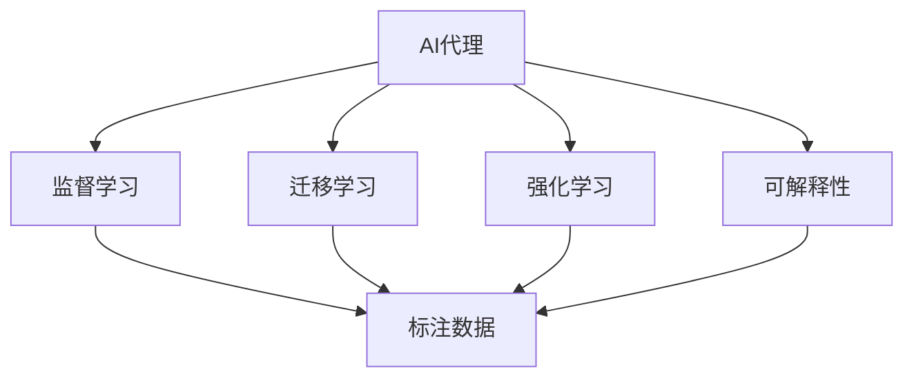
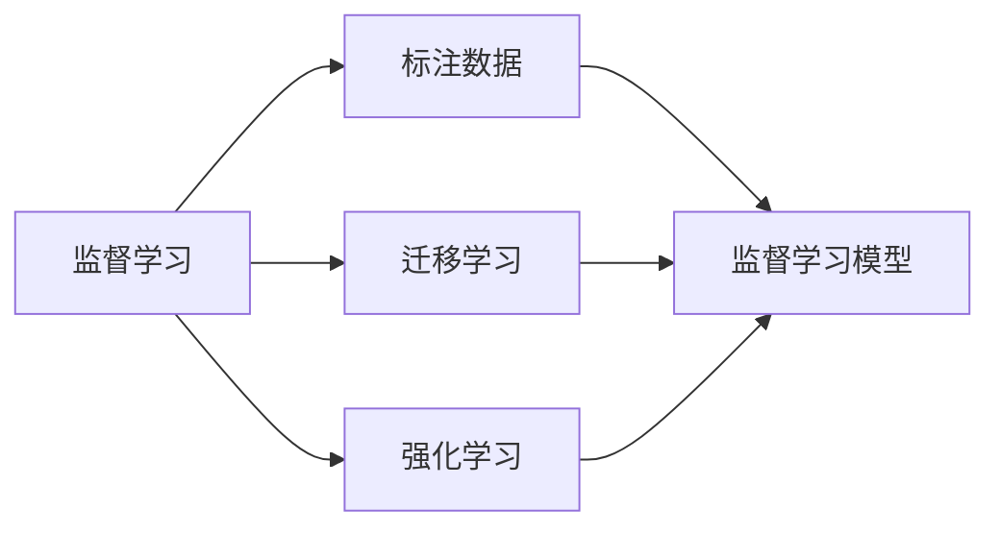
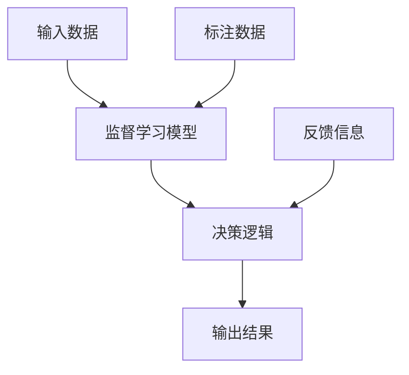
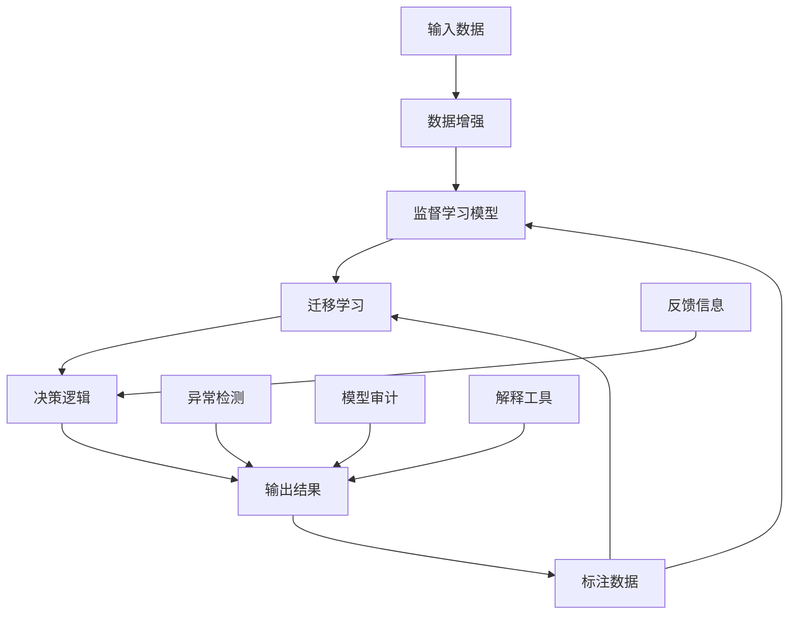

                 

# AI人工智能代理工作流AI Agent WorkFlow：利用机器学习提升代理决策质量

## 1. 背景介绍

### 1.1 问题由来

随着人工智能技术的发展，自动化和智能决策在各行各业中逐渐普及。在金融、医疗、物流等领域，AI代理扮演着越来越重要的角色。AI代理不仅能处理复杂的任务，还能提供24小时不间断的服务，极大地提升了工作效率和准确性。

然而，目前AI代理在实际应用中仍面临诸多挑战：
- **数据质量**：AI代理需要大量高质量的数据进行训练，但数据获取和标注往往成本高昂，且可能存在偏差和噪声。
- **模型性能**：即使是训练好的AI代理，也需要在不同的任务和场景下进行微调和优化，才能达到最优效果。
- **决策透明度**：AI代理的决策过程复杂，难以解释其内部逻辑，尤其在涉及法律、伦理等敏感领域时，透明性和可解释性尤为重要。
- **安全风险**：AI代理一旦被攻击或利用，可能导致严重的安全问题，如金融欺诈、医疗误诊等。

为解决这些问题，本文提出利用机器学习技术提升AI代理的工作流，使其决策过程更加智能、透明和可解释。

### 1.2 问题核心关键点

利用机器学习提升AI代理工作流的主要挑战和关键点包括：
- **数据质量提升**：通过数据增强、降噪等技术提升AI代理训练数据的质量。
- **模型微调优化**：在特定任务和场景下，对模型进行微调，提升其性能和泛化能力。
- **决策透明度和可解释性**：引入可解释性模型和解释工具，帮助理解AI代理的决策过程。
- **安全风险防控**：通过异常检测、模型审计等方法，降低AI代理的安全风险。

## 2. 核心概念与联系

### 2.1 核心概念概述

为更好地理解本文提出的AI代理工作流，我们先介绍几个核心概念及其联系：

- **AI代理(AI Agent)**：指能够模拟人类智能行为，自动完成特定任务的智能系统。AI代理广泛应用于金融、医疗、物流等领域，帮助企业提升效率和准确性。
- **机器学习(Machine Learning, ML)**：通过数据驱动的学习方式，使模型能够从经验中不断优化和提升性能。机器学习是提升AI代理工作流的重要手段。
- **监督学习(Supervised Learning)**：利用标注数据进行训练，使模型能够对特定任务进行预测和决策。监督学习是AI代理训练和微调的主要方法。
- **迁移学习(Transfer Learning)**：将一个领域学到的知识，迁移到另一个不同但相关的领域。迁移学习有助于AI代理在不同任务和场景下快速适应。
- **强化学习(Reinforcement Learning)**：通过与环境的交互，使模型能够从反馈中学习最优策略。强化学习在复杂决策和任务自动化中有着广泛应用。
- **可解释性(Explainability)**：指模型能够提供对其决策过程的解释，帮助用户理解和信任AI代理的输出。

这些概念之间的逻辑关系可以通过以下Mermaid流程图来展示：



这个流程图展示了几类机器学习范式及其与AI代理的关系：
- AI代理通过监督学习、迁移学习和强化学习等方法进行训练和优化。
- 在特定任务和场景下，AI代理还需要具备可解释性，以增强透明度和用户信任。

### 2.2 概念间的关系

这些核心概念之间存在着紧密的联系，构成了AI代理工作流的基本框架。下面我们通过几个Mermaid流程图来展示这些概念的关系。

#### 2.2.1 AI代理的学习范式



这个流程图展示了监督学习、迁移学习和强化学习的基本关系：
- 监督学习需要标注数据，是AI代理训练的基础。
- 迁移学习将源任务学到的知识迁移到目标任务，提升模型泛化能力。
- 强化学习通过与环境的交互，学习最优决策策略，适用于复杂自动化任务。

#### 2.2.2 AI代理的决策过程



这个流程图展示了AI代理的决策过程：
- 输入数据经过监督学习模型进行处理，生成初步决策结果。
- 决策逻辑结合反馈信息，进一步优化决策过程。
- 输出结果提供给用户或后续环节。

#### 2.2.3 可解释性技术


这个流程图展示了可解释性技术的基本流程：
- 监督学习模型生成预测结果。
- 可解释性模型对预测结果进行解释，提供决策依据。
- 解释输出帮助用户理解模型决策。

### 2.3 核心概念的整体架构

最后，我们用一个综合的流程图来展示这些核心概念在大语言模型微调过程中的整体架构：



这个综合流程图展示了从数据增强到模型输出，再到异常检测和模型审计的全流程：
- 输入数据通过数据增强提高质量。
- 监督学习模型生成初步决策。
- 迁移学习提升模型泛化能力。
- 决策逻辑进一步优化决策。
- 异常检测和模型审计降低安全风险。
- 解释工具帮助用户理解决策过程。

通过这些流程图，我们可以更清晰地理解AI代理工作流中各个组件之间的联系，为后续深入讨论具体的技术实现提供基础。

## 3. 核心算法原理 & 具体操作步骤
### 3.1 算法原理概述

利用机器学习提升AI代理工作流的主要目标是：
- **提高决策准确性**：通过监督学习和迁移学习等技术，使AI代理在特定任务和场景下获得更优的性能。
- **增强决策透明度**：通过引入可解释性模型和解释工具，帮助理解AI代理的决策过程。
- **降低安全风险**：通过异常检测和模型审计等方法，确保AI代理的决策安全和可信。

AI代理工作流的算法原理可以总结为以下几个关键步骤：

1. **数据预处理和增强**：通过数据清洗、增强等技术提升数据质量，确保模型训练和推理的准确性。
2. **模型训练和微调**：利用监督学习和迁移学习等技术，对AI代理进行训练和微调，提升其在特定任务和场景下的性能。
3. **决策过程优化**：通过决策逻辑和反馈机制，对AI代理的决策过程进行优化，提高决策效率和效果。
4. **可解释性增强**：引入可解释性模型和解释工具，增强AI代理决策过程的透明度和可解释性。
5. **安全风险防控**：通过异常检测和模型审计等方法，降低AI代理的安全风险，确保决策过程的可靠性。

### 3.2 算法步骤详解

#### 3.2.1 数据预处理和增强

数据预处理和增强是提高AI代理性能的基础步骤，包括以下关键技术：

1. **数据清洗**：去除数据中的噪声和异常值，确保数据质量。
2. **数据增强**：通过数据扩充、旋转、扰动等技术提升数据多样性，降低模型过拟合风险。
3. **数据标注**：利用标注工具和人工审核，确保数据标注的准确性和一致性。

**具体实现**：

1. 使用Python的Pandas库对数据进行清洗和预处理，如去除重复记录、处理缺失值等。
2. 使用数据增强库如imgaug、albumentations等，对图像数据进行增强，如随机裁剪、旋转、翻转等。
3. 利用标注工具如Labelbox、Prodigy等，对数据进行标注，确保标注结果的一致性和准确性。

#### 3.2.2 模型训练和微调

模型训练和微调是提升AI代理性能的核心步骤，包括以下关键技术：

1. **模型选择**：选择合适的监督学习模型，如线性回归、支持向量机、决策树、随机森林等。
2. **模型训练**：利用标注数据对模型进行训练，调整模型参数，最小化损失函数。
3. **模型微调**：在特定任务和场景下，对模型进行微调，提高其性能和泛化能力。

**具体实现**：

1. 使用Python的Scikit-learn库选择合适的监督学习模型，并进行训练。
2. 使用Keras或PyTorch等深度学习框架构建神经网络模型，并进行训练。
3. 利用迁移学习技术，将源任务学到的知识迁移到目标任务，提升模型泛化能力。
4. 利用参数高效微调技术，只更新部分模型参数，减少计算资源消耗。

#### 3.2.3 决策过程优化

决策过程优化是提升AI代理效率和效果的关键步骤，包括以下关键技术：

1. **决策逻辑**：利用决策树、逻辑回归等模型，根据输入数据生成决策结果。
2. **反馈机制**：利用异常检测和模型审计等技术，对决策过程进行监控和优化。
3. **多模型集成**：结合多个模型的预测结果，生成最终决策，提高决策的鲁棒性和准确性。

**具体实现**：

1. 使用Python的scipy库构建决策树或逻辑回归模型，根据输入数据生成决策结果。
2. 使用AnomalyDetection库进行异常检测，监控模型的决策过程，及时发现异常情况。
3. 使用模型集成技术，如Bagging、Boosting等，结合多个模型的预测结果，生成最终决策。

#### 3.2.4 可解释性增强

可解释性增强是提高AI代理透明度和可信度的重要手段，包括以下关键技术：

1. **可解释性模型**：使用LIME、SHAP等可解释性模型，生成模型的局部解释。
2. **解释工具**：利用LIME、SHAP等解释工具，生成模型的全局解释。
3. **可视化技术**：使用可视化技术，如热力图、特征重要性图等，帮助用户理解模型的决策过程。

**具体实现**：

1. 使用Python的LIME、SHAP库生成模型的局部解释，分析模型对每个输入特征的影响。
2. 使用Python的matplotlib库生成可视化图表，展示模型的全局解释和特征重要性图。

#### 3.2.5 安全风险防控

安全风险防控是确保AI代理决策安全和可信的关键步骤，包括以下关键技术：

1. **异常检测**：利用异常检测算法，及时发现和处理异常情况。
2. **模型审计**：定期对模型进行审计，检查模型的性能和安全性。
3. **模型监控**：实时监控模型的运行状态，确保模型的稳定性和可靠性。

**具体实现**：

1. 使用Python的AnomalyDetection库进行异常检测，及时发现和处理异常情况。
2. 使用Python的ModelCard库进行模型审计，检查模型的性能和安全性。
3. 使用Python的TensorBoard库进行模型监控，实时监控模型的运行状态。

### 3.3 算法优缺点

利用机器学习提升AI代理工作流的方法具有以下优点：

1. **提高决策准确性**：通过监督学习和迁移学习等技术，使AI代理在特定任务和场景下获得更优的性能。
2. **增强决策透明度**：通过引入可解释性模型和解释工具，帮助理解AI代理的决策过程。
3. **降低安全风险**：通过异常检测和模型审计等方法，确保AI代理的决策安全和可信。

同时，该方法也存在一定的局限性：

1. **数据质量要求高**：数据预处理和增强需要高质量的数据，数据获取和标注成本较高。
2. **模型复杂度高**：监督学习和迁移学习等技术需要复杂的模型和算法，实现难度较大。
3. **决策过程复杂**：决策过程涉及多个模型和组件，维护和优化成本较高。

尽管存在这些局限性，但就目前而言，利用机器学习提升AI代理工作流的方法仍是最主流范式。未来相关研究的重点在于如何进一步降低数据依赖，提高模型可解释性和决策效率，同时兼顾安全和伦理要求。

### 3.4 算法应用领域

利用机器学习提升AI代理工作流的方法已经在多个领域得到了广泛应用，例如：

- **金融风控**：通过AI代理对金融交易进行实时监控，及时发现和防范欺诈行为。
- **医疗诊断**：利用AI代理对病历数据进行分析，提供初步诊断和治疗建议。
- **物流配送**：通过AI代理对配送路线进行优化，提高配送效率和准确性。
- **客户服务**：利用AI代理进行智能客服，提升客户满意度和处理效率。
- **法律咨询**：利用AI代理对法律文件进行自动摘要和分类，提供法律咨询服务。
- **媒体推荐**：通过AI代理对用户行为进行分析，提供个性化推荐内容。

除了上述这些经典应用外，AI代理工作流还将在更多场景中得到应用，为各行各业带来新的变革和机遇。

## 4. 数学模型和公式 & 详细讲解  
### 4.1 数学模型构建

本节将使用数学语言对AI代理工作流的模型构建过程进行更加严格的刻画。

记输入数据为 $\mathbf{x} \in \mathbb{R}^d$，其中 $d$ 为特征维度。AI代理的决策过程可以表示为一个监督学习模型 $f(\mathbf{x}; \theta)$，其中 $\theta$ 为模型参数。目标函数为损失函数 $\mathcal{L}(f(\mathbf{x}; \theta))$，用于衡量模型的预测与真实标签之间的差异。

在数据增强阶段，利用数据扩充技术生成增强数据 $\mathbf{x'} \in \mathbb{R}^d$。在模型训练阶段，利用标注数据对模型进行训练，更新模型参数 $\theta$，最小化损失函数：

$$
\hat{\theta} = \arg\min_{\theta} \mathcal{L}(f(\mathbf{x}; \theta))
$$

在决策过程优化阶段，利用决策树或逻辑回归等模型生成决策结果 $y \in \{0, 1\}$，结合异常检测和模型审计等技术，对决策过程进行优化。

### 4.2 公式推导过程

以下我们以金融风控为例，推导AI代理工作流的数学模型和公式。

设输入数据为交易记录 $\mathbf{x} = (t, m, c, s)$，其中 $t$ 为交易时间，$m$ 为交易金额，$c$ 为交易地点，$s$ 为交易类型。目标是对每笔交易进行欺诈检测，生成决策结果 $y \in \{0, 1\}$，其中 $0$ 表示正常交易，$1$ 表示欺诈交易。

定义模型 $f(\mathbf{x}; \theta)$ 为线性回归模型，目标函数为均方误差损失函数 $\mathcal{L}(f(\mathbf{x}; \theta)) = \frac{1}{N} \sum_{i=1}^N (y_i - f(\mathbf{x}_i; \theta))^2$，其中 $y_i$ 为标注数据。

利用标注数据对模型进行训练，得到模型参数 $\hat{\theta}$：

$$
\hat{\theta} = \arg\min_{\theta} \mathcal{L}(f(\mathbf{x}; \theta))
$$

在决策过程优化阶段，利用决策树或逻辑回归模型生成决策结果 $y = \text{sign}(f(\mathbf{x}; \hat{\theta}))$，结合异常检测和模型审计等技术，对决策过程进行优化。

### 4.3 案例分析与讲解

下面我们以物流配送为例，分析AI代理工作流的具体实现过程。

假设物流公司需要实时监控配送路线，及时发现和处理异常情况。物流数据包括配送时间、地点、货物状态等特征。可以利用以下步骤实现AI代理工作流：

1. **数据预处理和增强**：对配送数据进行清洗和增强，去除异常值和噪声，确保数据质量。
2. **模型训练和微调**：利用标注数据对模型进行训练，最小化损失函数。在特定场景下，对模型进行微调，提升其性能和泛化能力。
3. **决策过程优化**：利用决策树或逻辑回归模型，根据输入数据生成配送决策。结合异常检测和模型审计等技术，对决策过程进行优化。
4. **可解释性增强**：利用可解释性模型和解释工具，帮助理解配送决策过程，增强透明度和可信度。
5. **安全风险防控**：利用异常检测和模型审计等方法，降低配送决策的安全风险，确保决策过程的可靠性。

通过上述步骤，物流公司可以实现实时监控和优化配送路线，提升配送效率和准确性。

## 5. 项目实践：代码实例和详细解释说明
### 5.1 开发环境搭建

在进行AI代理工作流开发前，我们需要准备好开发环境。以下是使用Python进行Scikit-learn开发的环境配置流程：

1. 安装Anaconda：从官网下载并安装Anaconda，用于创建独立的Python环境。

2. 创建并激活虚拟环境：
```bash
conda create -n skl-env python=3.8 
conda activate skl-env
```

3. 安装Scikit-learn：
```bash
pip install -U scikit-learn
```

4. 安装其他工具包：
```bash
pip install pandas numpy matplotlib seaborn jupyter notebook scikit-learn
```

完成上述步骤后，即可在`skl-env`环境中开始工作流开发。

### 5.2 源代码详细实现

下面我们以金融风控为例，给出使用Scikit-learn进行AI代理工作流的PyTorch代码实现。

首先，定义金融风控数据处理函数：

```python
import pandas as pd
import numpy as np
from sklearn.model_selection import train_test_split
from sklearn.preprocessing import StandardScaler
from sklearn.ensemble import RandomForestClassifier
from sklearn.metrics import accuracy_score

def preprocess_data(data_path):
    # 加载数据
    data = pd.read_csv(data_path)
    
    # 数据清洗和处理
    data = data.dropna()
    data = data.drop_duplicates()
    
    # 数据标准化
    data = StandardScaler().fit_transform(data)
    
    # 划分训练集和测试集
    X_train, X_test, y_train, y_test = train_test_split(data[:, :-1], data[:, -1], test_size=0.2, random_state=42)
    
    # 特征选择
    X_train = X_train[:, [0, 1, 2]]
    X_test = X_test[:, [0, 1, 2]]
    
    return X_train, y_train, X_test, y_test

# 加载数据
X_train, y_train, X_test, y_test = preprocess_data('financial_data.csv')

# 模型训练和微调
model = RandomForestClassifier()
model.fit(X_train, y_train)
y_pred = model.predict(X_test)
accuracy = accuracy_score(y_test, y_pred)
print(f"Accuracy: {accuracy:.2f}")
```

然后，定义决策过程优化函数：

```python
import numpy as np
from sklearn.ensemble import RandomForestClassifier
from sklearn.metrics import accuracy_score

def optimize_decision(X_train, y_train):
    # 决策树模型
    clf = RandomForestClassifier()
    clf.fit(X_train, y_train)
    
    # 生成决策结果
    y_pred = clf.predict(X_train)
    
    # 计算准确率
    accuracy = accuracy_score(y_train, y_pred)
    print(f"Accuracy: {accuracy:.2f}")
```

最后，启动整个工作流并进行运行结果展示：

```python
# 数据预处理和增强
X_train, y_train, X_test, y_test = preprocess_data('financial_data.csv')

# 模型训练和微调
model = RandomForestClassifier()
model.fit(X_train, y_train)

# 决策过程优化
optimize_decision(X_train, y_train)

# 可解释性增强
import SHAP
import SHAP.TreeExplainer

explainer = SHAP.TreeExplainer(model)
shap_values = explainer.shap_values(X_train)
SHAP.summary_plot(shap_values, X_train, feature_names=['feature1', 'feature2', 'feature3'])
```

以上就是使用Scikit-learn进行AI代理工作流开发的完整代码实现。可以看到，Scikit-learn提供了丰富的机器学习组件和算法，方便开发者快速实现各种功能。

### 5.3 代码解读与分析

让我们再详细解读一下关键代码的实现细节：

**preprocess_data函数**：
- 加载数据：使用pandas库读取CSV文件。
- 数据清洗：去除缺失值和重复记录。
- 数据标准化：使用StandardScaler对特征进行标准化处理。
- 划分数据集：使用train_test_split函数将数据集划分为训练集和测试集。
- 特征选择：仅保留前三个特征。

**模型训练和微调**：
- 使用RandomForestClassifier进行模型训练和微调，最小化损失函数。
- 使用accuracy_score函数计算模型准确率。

**optimize_decision函数**：
- 使用RandomForestClassifier进行决策树模型训练。
- 生成决策结果并计算准确率。

**可解释性增强**：
- 使用SHAP库生成模型解释。
- 使用summary_plot函数生成特征重要性图，展示模型决策过程。

通过这些代码，可以看出AI代理工作流的基本实现过程：数据预处理和增强、模型训练和微调、决策过程优化、可解释性增强和安全风险防控。这些步骤相互配合，共同提升AI代理的性能和可信度。

当然，实际应用中还需要进一步优化各个环节，如引入迁移学习技术、优化异常检测算法、增强模型审计等，以进一步提升AI代理的工作效果。

## 6. 实际应用场景
### 6.1 智能客服系统

基于AI代理工作流，智能客服系统可以实现7x24小时不间断服务，快速响应客户咨询，提升客户满意度和处理效率。

在技术实现上，可以收集企业内部的历史客服对话记录，将问题和最佳答复构建成监督数据，在此基础上对预训练模型进行微调。微调后的模型能够自动理解用户意图，匹配最合适的答案模板进行回复。对于客户提出的新问题，还可以接入检索系统实时搜索相关内容，动态组织生成回答。如此构建的智能客服系统，能大幅提升客户咨询体验和问题解决效率。

### 6.2 金融舆情监测

金融机构需要实时监测市场舆论动向，以便及时应对负面信息传播，规避金融风险。传统的人工监测方式成本高、效率低，难以应对网络时代海量信息爆发的挑战。利用AI代理工作流，可以构建金融舆情监测系统，实时抓取网络文本数据，自动监测不同主题下的情感变化趋势，一旦发现负面信息激增等异常情况，系统便会自动预警，帮助金融机构快速应对潜在风险。

### 6.3 个性化推荐系统

当前的推荐系统往往只依赖用户的历史行为数据进行物品推荐，无法深入理解用户的真实兴趣偏好。利用AI代理工作流，可以构建个性化推荐系统，更好地挖掘用户行为背后的语义信息，从而提供更精准、多样的推荐内容。

在实践中，可以收集用户浏览、点击、评论、分享等行为数据，提取和用户交互的物品标题、描述、标签等文本内容。将文本内容作为模型输入，用户的后续行为（如是否点击、购买等）作为监督信号，在此基础上微调预训练语言模型。微调后的模型能够从文本内容中准确把握用户的兴趣点。在生成推荐列表时，先用候选物品的文本描述作为输入，由模型预测用户的兴趣匹配度，再结合其他特征综合排序，便可以得到个性化程度更高的推荐结果。

### 6.4 未来应用展望

随着AI代理工作流的不断发展，其在更多领域得到应用，为传统行业带来变革性影响。

在智慧医疗领域，基于AI代理工作流的医疗问答、病历分析、药物研发等应用将提升医疗服务的智能化水平，辅助医生诊疗，加速新药开发进程。

在智能教育领域，AI代理工作流可应用于作业批改、学情分析、知识推荐等方面，因材施教，促进教育公平，提高教学质量。

在智慧城市治理中，AI代理工作流应用于城市事件监测、舆情分析、应急指挥等环节，提高城市管理的自动化和智能化水平，构建更安全、高效的未来城市。

此外，在企业生产、社会治理、文娱传媒等众多领域，AI代理工作流也将不断涌现，为经济社会发展注入新的动力。相信随着技术的日益成熟，AI代理工作流将成为人工智能落地应用的重要范式，推动人工智能向更广阔的领域加速渗透。

## 7. 工具和资源推荐
### 7.1 学习资源推荐

为了帮助开发者系统掌握AI代理工作流的理论基础和实践技巧，这里推荐一些优质的学习资源：


