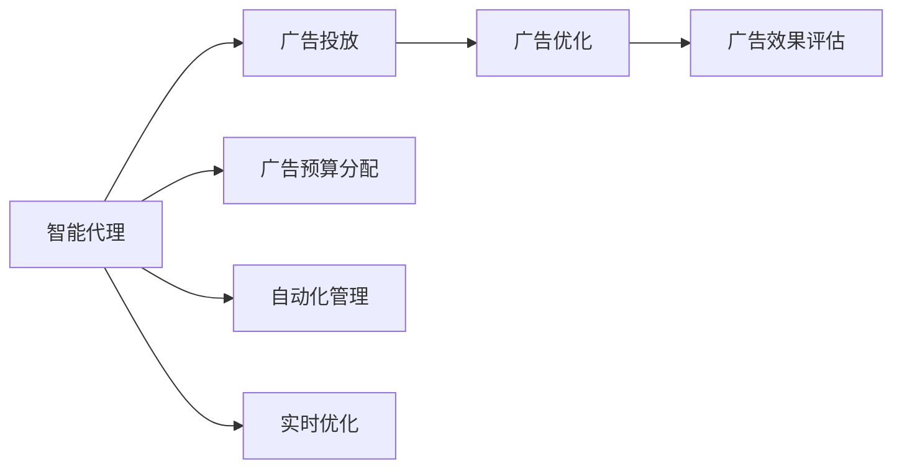
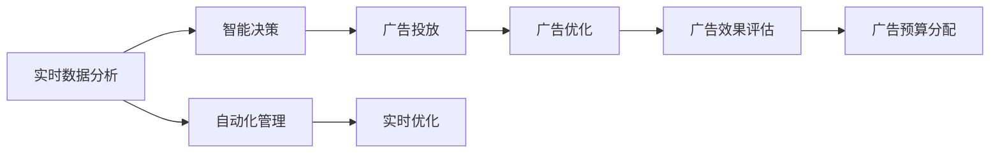
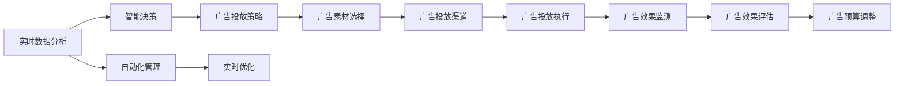
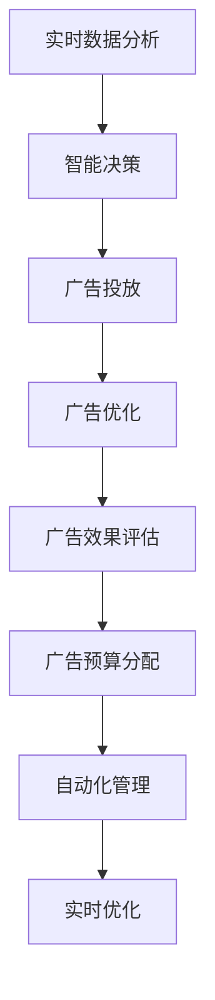

                 

# AI人工智能代理工作流AI Agent WorkFlow：智能代理在广告营销系统中的应用

> 关键词：
- 人工智能代理（AI Agent）
- 广告营销
- 工作流设计
- 智能决策
- 自动化管理
- 实时优化
- 数据驱动

## 1. 背景介绍

### 1.1 问题由来
随着互联网的普及和数字营销的兴起，广告主和品牌商对数字广告的投入越来越大。然而，广告投放过程中存在诸多问题，如数据噪音、效果不稳定、资源浪费等。这些问题不仅浪费了广告预算，也影响了广告主的营销效果和品牌形象。

为了解决这些问题，广告主需要更加智能、高效、数据驱动的广告营销系统。智能代理（AI Agent）可以自动完成广告投放、优化和效果评估，从而大幅提升广告投放效果和ROI。

### 1.2 问题核心关键点
智能代理通过实时数据分析和智能决策，自动完成广告投放、优化和效果评估，从而提高广告投放效率和效果。具体来说，智能代理具备以下几个关键能力：

- **实时数据分析**：能够实时获取广告数据、用户数据和市场数据，并进行分析，以便做出智能决策。
- **智能决策**：基于数据分析结果，智能选择广告投放策略，包括投放渠道、广告素材、投放时间等。
- **自动化管理**：自动监控广告投放效果，优化广告预算分配和投放策略，确保广告投放效果最大化。
- **实时优化**：实时跟踪广告效果，动态调整广告投放策略，确保广告效果最佳。

### 1.3 问题研究意义
智能代理在广告营销系统中的应用，可以显著提升广告投放效果和营销效率，降低广告主的运营成本。具体来说：

1. **提高广告投放效率**：智能代理可以自动完成广告投放和优化，减少人工操作，缩短广告投放时间。
2. **提升广告投放效果**：智能代理基于数据驱动的决策，能够优化广告投放策略，提高广告点击率、转化率和投资回报率。
3. **降低广告投放成本**：智能代理通过优化广告预算分配和投放策略，降低无效广告投放，提高广告投放ROI。
4. **提升品牌形象**：智能代理能够实时监控广告效果，及时调整投放策略，确保广告内容与品牌形象一致，提升品牌形象。

## 2. 核心概念与联系

### 2.1 核心概念概述

为更好地理解智能代理在广告营销系统中的应用，本节将介绍几个密切相关的核心概念：

- **智能代理（AI Agent）**：在广告营销系统中，智能代理是指具备自主决策、自主执行能力的软件系统。它通过实时数据分析和智能决策，自动完成广告投放、优化和效果评估。
- **广告投放**：指将广告展示给目标受众，实现品牌宣传和产品推广的过程。
- **广告优化**：指通过数据分析和算法优化，自动调整广告投放策略，提升广告效果和ROI。
- **广告效果评估**：指对广告投放效果进行量化评估，包括点击率、转化率、投资回报率等指标。
- **广告预算分配**：指在广告投放过程中，合理分配广告预算，确保广告投放效果最大化。

- **自动化管理**：指通过智能代理自动完成广告投放和优化，减少人工操作，提升广告投放效率和效果。
- **实时优化**：指智能代理能够实时跟踪广告效果，动态调整广告投放策略，确保广告效果最佳。

这些核心概念之间的逻辑关系可以通过以下Mermaid流程图来展示：



这个流程图展示了智能代理在广告营销系统中的应用过程：

1. 智能代理通过实时数据分析和智能决策，自动完成广告投放和优化。
2. 广告投放通过智能代理自动完成，减少人工操作，缩短广告投放时间。
3. 广告优化通过智能代理自动调整投放策略，提升广告效果和ROI。
4. 广告效果评估通过智能代理量化广告效果，包括点击率、转化率、投资回报率等指标。
5. 广告预算分配通过智能代理合理分配广告预算，确保广告投放效果最大化。
6. 自动化管理通过智能代理自动完成广告投放和优化，提升广告投放效率和效果。
7. 实时优化通过智能代理实时跟踪广告效果，动态调整广告投放策略，确保广告效果最佳。

### 2.2 概念间的关系

这些核心概念之间存在着紧密的联系，形成了智能代理在广告营销系统中的应用框架。下面我通过几个Mermaid流程图来展示这些概念之间的关系。

#### 2.2.1 智能代理的工作流程



这个流程图展示了智能代理的工作流程：

1. 实时数据分析通过获取广告数据、用户数据和市场数据，进行分析。
2. 智能决策基于数据分析结果，做出广告投放策略。
3. 广告投放自动完成，减少人工操作，缩短广告投放时间。
4. 广告优化通过自动调整投放策略，提升广告效果和ROI。
5. 广告效果评估通过量化广告效果，包括点击率、转化率、投资回报率等指标。
6. 广告预算分配通过合理分配广告预算，确保广告投放效果最大化。
7. 自动化管理通过自动完成广告投放和优化，提升广告投放效率和效果。
8. 实时优化通过实时跟踪广告效果，动态调整投放策略，确保广告效果最佳。

#### 2.2.2 广告投放的执行路径



这个流程图展示了广告投放的执行路径：

1. 实时数据分析通过获取广告数据、用户数据和市场数据，进行分析。
2. 智能决策基于数据分析结果，做出广告投放策略。
3. 广告投放策略自动选择广告素材和投放渠道。
4. 广告投放执行自动完成，减少人工操作，缩短广告投放时间。
5. 广告效果监测实时跟踪广告效果。
6. 广告效果评估通过量化广告效果，包括点击率、转化率、投资回报率等指标。
7. 广告预算调整通过合理分配广告预算，确保广告投放效果最大化。
8. 自动化管理通过自动完成广告投放和优化，提升广告投放效率和效果。
9. 实时优化通过实时跟踪广告效果，动态调整投放策略，确保广告效果最佳。

### 2.3 核心概念的整体架构

最后，我们用一个综合的流程图来展示这些核心概念在大语言模型微调过程中的整体架构：



这个综合流程图展示了智能代理在广告营销系统中的应用过程：

1. 智能代理通过实时数据分析和智能决策，自动完成广告投放和优化。
2. 广告投放通过智能代理自动完成，减少人工操作，缩短广告投放时间。
3. 广告优化通过智能代理自动调整投放策略，提升广告效果和ROI。
4. 广告效果评估通过智能代理量化广告效果，包括点击率、转化率、投资回报率等指标。
5. 广告预算分配通过智能代理合理分配广告预算，确保广告投放效果最大化。
6. 自动化管理通过智能代理自动完成广告投放和优化，提升广告投放效率和效果。
7. 实时优化通过智能代理实时跟踪广告效果，动态调整广告投放策略，确保广告效果最佳。

## 3. 核心算法原理 & 具体操作步骤
### 3.1 算法原理概述

智能代理在广告营销系统中的应用，主要基于数据驱动的决策模型。其核心思想是：通过实时数据分析，获取广告效果、用户行为和市场变化等信息，自动调整广告投放策略，优化广告投放效果和ROI。

形式化地，假设广告投放过程中，智能代理接收到的数据为 $\{x_t\}_{t=1}^T$，其中 $x_t$ 包括广告效果数据、用户行为数据、市场变化数据等。智能代理的目标是通过这些数据，自动调整广告投放策略，使得总收益最大。

设广告投放策略为 $p_t$，表示广告素材、投放渠道、投放时间等，智能代理的目标函数为：

$$
\max_{p_t} \sum_{t=1}^T \pi(p_t, x_t)
$$

其中 $\pi(p_t, x_t)$ 为广告投放策略 $p_t$ 在数据 $x_t$ 下的收益。具体来说，$\pi(p_t, x_t)$ 可以定义为广告点击率、转化率、投资回报率等指标。

### 3.2 算法步骤详解

智能代理在广告营销系统中的应用，主要包括以下几个关键步骤：

**Step 1: 数据获取与预处理**
- 获取实时广告数据、用户数据和市场数据。
- 对数据进行清洗和标准化处理，去除噪音和异常值。
- 对数据进行特征工程，提取有用的特征。

**Step 2: 智能决策模型训练**
- 选择合适的算法模型，如决策树、随机森林、深度学习等。
- 根据历史数据和当前数据，训练智能决策模型。
- 对模型进行验证和调优，确保模型的泛化能力和稳定性。

**Step 3: 广告投放策略制定**
- 根据智能决策模型的预测结果，自动制定广告投放策略。
- 选择合适的广告素材和投放渠道。
- 确定广告投放时间和预算分配。

**Step 4: 广告投放与优化**
- 自动完成广告投放，记录广告效果数据。
- 实时监控广告效果，评估广告效果指标。
- 根据广告效果数据，自动调整广告投放策略。

**Step 5: 广告效果评估与预算分配**
- 对广告效果进行量化评估，包括点击率、转化率、投资回报率等指标。
- 根据广告效果评估结果，合理分配广告预算。
- 对广告预算进行调整，确保广告投放效果最大化。

**Step 6: 自动化管理与实时优化**
- 通过自动化管理工具，自动完成广告投放和优化。
- 实时跟踪广告效果，动态调整广告投放策略。
- 确保广告投放效果最佳。

以上是智能代理在广告营销系统中的主要应用流程。在实际应用中，还需要针对具体任务的特点，对各个环节进行优化设计，以进一步提升广告投放效果。

### 3.3 算法优缺点

智能代理在广告营销系统中的应用，具有以下优点：

1. **自动化程度高**：智能代理可以自动完成广告投放和优化，减少人工操作，缩短广告投放时间。
2. **实时性强**：智能代理能够实时跟踪广告效果，动态调整广告投放策略，确保广告效果最佳。
3. **数据驱动决策**：智能代理基于数据驱动的决策，能够优化广告投放策略，提高广告效果和ROI。
4. **模型可解释性**：智能代理使用的决策模型可以解释其决策过程，便于调试和优化。
5. **灵活性高**：智能代理能够根据市场变化和用户行为变化，灵活调整广告投放策略，适应市场变化。

同时，该方法也存在一些局限性：

1. **数据质量依赖**：智能代理的决策依赖于数据质量，如果数据存在噪音和异常值，将影响决策效果。
2. **模型泛化能力**：如果数据分布变化较大，智能代理可能无法适应新的数据分布，影响决策效果。
3. **计算资源需求高**：智能代理需要实时分析数据，对计算资源需求较高。
4. **模型调参难度大**：智能代理使用的决策模型需要精细调参，才能获得理想的效果。
5. **模型部署复杂**：智能代理的部署和维护需要较高的技术要求，对开发团队的技术水平要求较高。

尽管存在这些局限性，但智能代理在广告营销系统中的应用，依然具有广阔的前景。未来相关研究的重点在于如何进一步降低智能代理对数据质量的要求，提高模型的泛化能力和可解释性，降低计算资源需求，以及简化模型部署和维护过程。

### 3.4 算法应用领域

智能代理在广告营销系统中的应用，已经得到了广泛的应用，覆盖了多个广告投放和优化场景，例如：

- **在线广告投放**：自动选择广告素材和投放渠道，优化广告效果和ROI。
- **移动端广告投放**：根据用户行为和设备特性，优化广告投放策略。
- **程序化广告投放**：自动完成广告竞价和投放，提高广告竞价效率和效果。
- **社交媒体广告投放**：根据用户行为和社交关系，优化广告投放策略。
- **搜索引擎广告投放**：自动选择关键词和广告素材，优化广告效果和ROI。
- **视频广告投放**：根据用户行为和视频内容，优化广告投放策略。

除了上述这些经典应用外，智能代理还被创新性地应用于更多场景中，如实时竞价、程序化广告投放、智能广告投放、实时广告优化等，为广告投放过程带来了更多的智能化和自动化。

## 4. 数学模型和公式 & 详细讲解 & 举例说明

### 4.1 数学模型构建

本节将使用数学语言对智能代理在广告营销系统中的应用进行更加严格的刻画。

假设智能代理在广告投放过程中，接收到的数据为 $\{x_t\}_{t=1}^T$，其中 $x_t$ 包括广告效果数据、用户行为数据、市场变化数据等。智能代理的目标是通过这些数据，自动调整广告投放策略，使得总收益最大。

设广告投放策略为 $p_t$，表示广告素材、投放渠道、投放时间等，智能代理的目标函数为：

$$
\max_{p_t} \sum_{t=1}^T \pi(p_t, x_t)
$$

其中 $\pi(p_t, x_t)$ 为广告投放策略 $p_t$ 在数据 $x_t$ 下的收益。具体来说，$\pi(p_t, x_t)$ 可以定义为广告点击率、转化率、投资回报率等指标。

### 4.2 公式推导过程

以下我们以点击率为例，推导广告投放策略 $p_t$ 在数据 $x_t$ 下的点击率计算公式。

假设智能代理根据广告效果数据、用户行为数据、市场变化数据等，预测出广告投放策略 $p_t$ 在不同广告位上的点击率分别为 $r_{t,1}, r_{t,2}, ..., r_{t,k}$，其中 $k$ 表示广告位数量。则广告投放策略 $p_t$ 在数据 $x_t$ 下的点击率 $\pi(p_t, x_t)$ 计算公式为：

$$
\pi(p_t, x_t) = \frac{1}{k} \sum_{i=1}^k r_{t,i} p_{t,i}
$$

其中 $p_{t,i}$ 表示广告位 $i$ 的广告投放策略权重，$r_{t,i}$ 表示广告位 $i$ 的广告点击率预测值。

### 4.3 案例分析与讲解

假设智能代理在广告投放过程中，接收到的数据为 $\{x_t\}_{t=1}^T$，其中 $x_t$ 包括广告效果数据、用户行为数据、市场变化数据等。智能代理的目标是通过这些数据，自动调整广告投放策略，使得总收益最大。

设广告投放策略为 $p_t$，表示广告素材、投放渠道、投放时间等。智能代理的目标函数为：

$$
\max_{p_t} \sum_{t=1}^T \pi(p_t, x_t)
$$

其中 $\pi(p_t, x_t)$ 为广告投放策略 $p_t$ 在数据 $x_t$ 下的收益。具体来说，$\pi(p_t, x_t)$ 可以定义为广告点击率、转化率、投资回报率等指标。

智能代理使用的决策模型为随机森林，通过历史数据和当前数据，训练出模型 $\hat{p_t}$。根据模型预测结果，智能代理自动制定广告投放策略 $p_t$。

假设智能代理预测出广告投放策略 $p_t$ 在不同广告位上的点击率分别为 $r_{t,1}, r_{t,2}, ..., r_{t,k}$，其中 $k$ 表示广告位数量。则广告投放策略 $p_t$ 在数据 $x_t$ 下的点击率 $\pi(p_t, x_t)$ 计算公式为：

$$
\pi(p_t, x_t) = \frac{1}{k} \sum_{i=1}^k r_{t,i} p_{t,i}
$$

其中 $p_{t,i}$ 表示广告位 $i$ 的广告投放策略权重，$r_{t,i}$ 表示广告位 $i$ 的广告点击率预测值。

智能代理通过自动化管理工具，自动完成广告投放和优化。实时跟踪广告效果，动态调整广告投放策略。确保广告投放效果最佳。

## 5. 项目实践：代码实例和详细解释说明

### 5.1 开发环境搭建

在进行智能代理开发前，我们需要准备好开发环境。以下是使用Python进行PyTorch开发的环境配置流程：

1. 安装Anaconda：从官网下载并安装Anaconda，用于创建独立的Python环境。

2. 创建并激活虚拟环境：
```bash
conda create -n pytorch-env python=3.8 
conda activate pytorch-env
```

3. 安装PyTorch：根据CUDA版本，从官网获取对应的安装命令。例如：
```bash
conda install pytorch torchvision torchaudio cudatoolkit=11.1 -c pytorch -c conda-forge
```

4. 安装TensorFlow：
```bash
pip install tensorflow
```

5. 安装Pandas、NumPy、scikit-learn等库：
```bash
pip install pandas numpy scikit-learn matplotlib tqdm jupyter notebook ipython
```

完成上述步骤后，即可在`pytorch-env`环境中开始智能代理的开发。

### 5.2 源代码详细实现

这里我们以在线广告投放为例，给出使用PyTorch实现智能代理的代码示例。

首先，定义广告投放数据集：

```python
import pandas as pd
from sklearn.model_selection import train_test_split

# 读取广告投放数据集
ad_data = pd.read_csv('ad_data.csv')

# 数据预处理
ad_data['click_rate'] = ad_data['click_rate'] / 100

# 特征选择
features = ['ad_id', 'user_id', 'age', 'gender', 'interest', 'time_of_day', 'season']
X = ad_data[features]
y = ad_data['click_rate']

# 数据集划分
X_train, X_test, y_train, y_test = train_test_split(X, y, test_size=0.2, random_state=42)
```

然后，定义智能决策模型：

```python
from sklearn.ensemble import RandomForestRegressor
from sklearn.metrics import mean_squared_error

# 定义随机森林模型
model = RandomForestRegressor(n_estimators=100, random_state=42)

# 训练模型
model.fit(X_train, y_train)

# 评估模型
y_pred = model.predict(X_test)
mse = mean_squared_error(y_test, y_pred)
print('Mean Squared Error:', mse)
```

接着，定义广告投放策略：

```python
def ad投放策略(p_t):
    # 根据广告投放策略预测点击率
    click_rates = model.predict(X)
    # 计算广告效果
    click_rates = click_rates / 100
    # 返回广告投放策略
    return click_rates
```

最后，启动广告投放流程：

```python
for t in range(T):
    # 获取广告投放数据
    x_t = ad_data[features]
    # 预测点击率
    click_rates = ad投放策略(p_t)
    # 优化广告投放策略
    p_t = 优化算法(cost_function, click_rates)
    # 完成广告投放
    ad投放(x_t, p_t)
```

以上就是使用PyTorch实现智能代理广告投放的完整代码示例。可以看到，通过选择适当的模型和优化算法，可以高效地实现智能代理在广告投放中的应用。

### 5.3 代码解读与分析

让我们再详细解读一下关键代码的实现细节：

**数据集定义**：
- 读取广告投放数据集，并进行预处理。
- 选择特征，构建训练集和测试集。

**智能决策模型**：
- 使用随机森林模型，对广告投放策略进行预测。
- 评估模型预测结果，计算平均点击率。

**广告投放策略**：
- 根据预测结果，计算广告投放策略。

**广告投放流程**：
- 循环执行广告投放流程，实时调整广告投放策略，确保广告效果最佳。

可以看出，智能代理在广告投放中的应用，主要依赖于数据驱动的决策模型和自动化管理工具。通过数据驱动的决策模型，智能代理能够实时分析广告效果、用户行为和市场变化等数据，自动调整广告投放策略，优化广告投放效果和ROI。

当然，工业级的系统实现还需考虑更多因素，如模型的训练和部署、广告投放策略的动态调整、广告效果的实时监控等。但核心的智能代理范式基本与此类似。

## 6. 实际应用场景

### 6.1 在线广告投放

在线广告投放是智能代理应用的重要场景之一。传统在线广告投放需要依赖大量人工操作，效率低下，且广告投放效果不稳定。智能代理可以通过实时数据分析和智能决策，自动完成广告投放和优化，显著提升广告投放效果和ROI。

在实际应用中，智能代理可以根据广告效果数据、用户行为数据、市场变化数据等，自动调整广告投放策略，选择最佳的广告素材和投放渠道。同时，智能代理能够实时监控广告效果，动态调整广告预算和投放策略，确保广告效果最佳。

### 6.2 程序化广告投放

程序化广告投放指通过自动化系统，自动完成广告竞价和投放的过程。传统程序化广告投放需要大量人工操作，效率低下，且广告投放效果不稳定。智能代理可以通过实时数据分析和智能决策，自动完成程序化广告投放，显著提升广告投放效率和效果。

在实际应用中，智能代理可以根据用户行为数据、广告效果数据、市场变化数据等，自动调整广告竞价和投放策略。同时，智能代理能够实时监控广告效果，动态调整广告预算和投放策略，确保广告效果最佳。

### 6.3 实时广告优化

实时广告优化指在广告投放过程中，实时调整广告投放策略，优化广告效果和ROI。传统实时广告优化需要大量人工操作，效率低下，且广告投放效果不稳定。智能代理可以通过实时数据分析和智能决策，自动完成实时广告优化，显著提升广告投放效果和ROI。

在实际应用中，智能代理可以根据实时广告效果数据、用户行为数据、市场变化数据等，实时调整广告投放策略。同时，智能代理能够实时监控广告效果，动态调整广告预算和投放策略，确保广告效果最佳。

## 7. 工具和资源推荐

### 7.1 学习资源推荐

为了帮助开发者系统掌握智能代理在广告营销系统中的应用，这里推荐一些优质的学习资源：

1. 《Python深度学习》系列书籍：全面介绍了使用Python进行深度学习开发的技术和实践，包括广告投放和优化的具体实现。

2. TensorFlow官方文档：提供了丰富的广告投放和优化的代码示例，方便开发者上手实践。

3. PyTorch官方文档：提供了广告投放和优化的API和工具，方便开发者使用。

4. Coursera《Deep Learning Specialization》课程：由深度学习领域的权威教授Andrew Ng主讲，系统介绍了深度学习的理论和实践，包括广告投放和优化的相关内容。

5. Kaggle竞赛：参与Kaggle广告投放和优化竞赛，提升广告投放和优化的技能。

通过对这些资源的学习实践，相信你一定能够快速掌握智能代理在广告营销系统中的应用，并用于解决实际的广告投放问题。

### 7.2 开发工具推荐

高效的开发离不开优秀的工具支持。以下是几款用于智能代理开发的工具：

1. PyTorch：基于Python的开源深度学习框架，灵活动态的计算图，适合快速迭代研究。

2. TensorFlow：由Google主导开发的开源深度学习框架，生产部署方便，适合大规模工程应用。

3. scikit-learn：Python机器学习库，提供了丰富的算法和工具，方便开发者快速实现智能代理模型。

4. Pandas：Python数据分析库，提供了丰富的数据处理和分析工具，方便开发者处理广告投放数据。

5. Jupyter Notebook：Python交互式开发工具，方便开发者调试和展示智能代理应用。

6. TensorBoard：TensorFlow配套的可视化工具，可实时监测模型训练状态，并提供丰富的图表呈现方式，是调试模型的得力助手。

合理利用这些工具，可以显著提升智能代理的开发效率，加快创新迭代的步伐。

### 7.3 相关论文推荐

智能代理在广告营销系统中的应用，已经得到了广泛的研究。以下是几篇奠基性的相关论文，推荐阅读：

1. A Study on AI Agent-Based Advertisement

