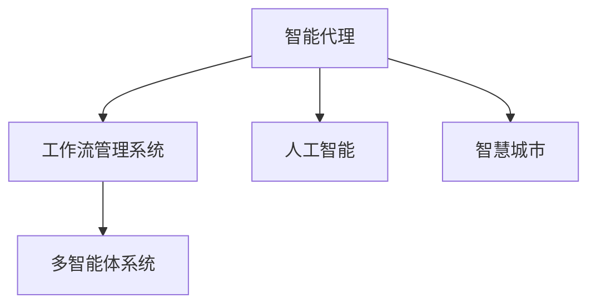
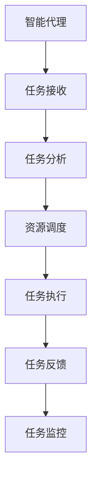
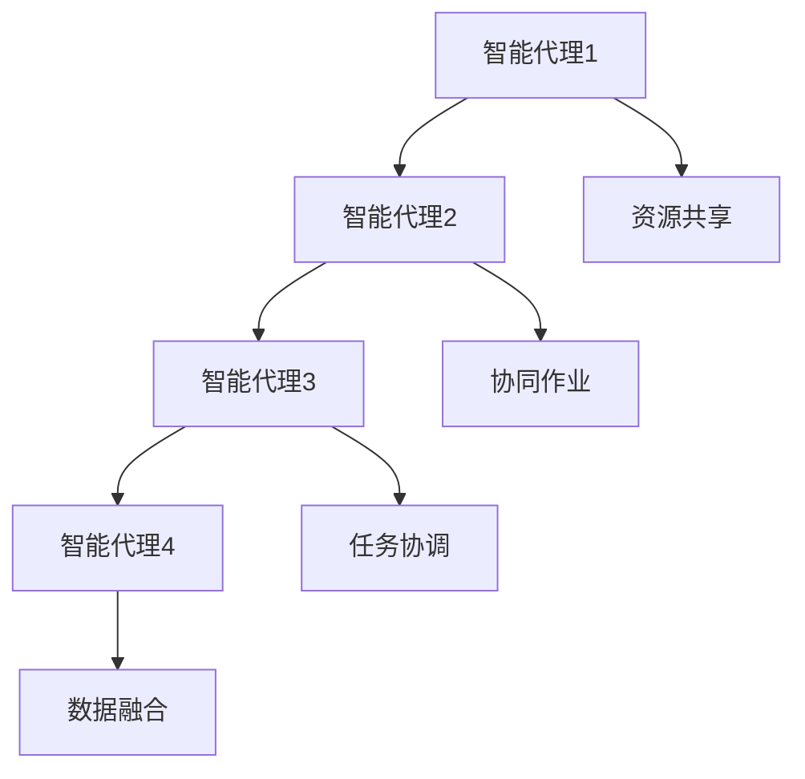
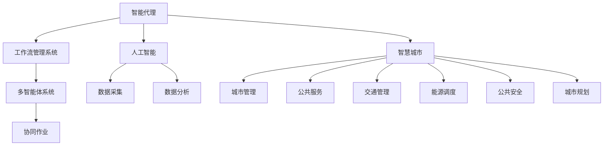

                 

# AI人工智能代理工作流AI Agent WorkFlow：智能代理在智慧城市中的实践

> 关键词：智能代理,智慧城市,人工智能,工作流,多智能体系统,城市治理,服务自动化

## 1. 背景介绍

### 1.1 问题由来
随着城市化进程的加速，智慧城市建设已经成为各国政府的重点工作之一。智慧城市不仅包括传统的物理基础设施的智能化改造，还涵盖了交通、医疗、教育、能源等多个领域的智能化应用。在智慧城市中，城市管理者需要对海量数据进行实时处理，对多个业务系统进行高效协同，以满足城市运行和管理的各种需求。

然而，传统的人工流程管理方式，如手工录入、人工调度等，往往效率低下，且容易出错。为了解决这一问题，城市管理者需要借助人工智能技术，特别是智能代理技术，来实现业务自动化和智能化管理。智能代理可以自适应城市环境，自动调度和管理各类资源，提供精准的服务和决策支持，从而大大提升城市管理效率和服务质量。

### 1.2 问题核心关键点
智能代理的核心在于自动化地处理复杂的业务流程，通过对海量数据的实时分析和处理，做出最优化的决策，并自动执行相关操作。智能代理通过模仿人类的决策过程，融合多种数据源和算法模型，实现任务的自动执行和管理。智能代理的实现依赖于多智能体系统和工作流管理系统等技术，能够在高度不确定和多变的城市环境中提供高效、可靠的智能服务。

智能代理的工作流程通常包括：

1. **任务接收与分析**：从各种渠道接收任务请求，对任务进行初步分析和分类。
2. **资源调度与协调**：根据任务需求，动态调整资源配置，协调各个智能体之间的合作。
3. **任务执行与反馈**：执行具体任务，提供服务或做出决策，并根据反馈进行调整。
4. **任务监控与优化**：实时监控任务执行情况，对异常情况进行预警和优化。

智能代理在智慧城市中的应用包括但不限于交通管理、能源调度、公共安全、城市规划等方面。

### 1.3 问题研究意义
智能代理技术在智慧城市中的应用，对于提升城市管理效率和服务质量，具有重要的研究意义：

1. **提高城市运行效率**：通过自动化处理各类城市事务，智能代理可以大大减少人工干预，提高城市运行的效率和响应速度。
2. **优化资源配置**：智能代理能够根据实时数据动态调整资源配置，实现资源的优化利用，避免浪费。
3. **提升服务质量**：智能代理可以根据用户需求提供精准的服务，提升用户体验。
4. **促进跨部门协同**：智能代理可以协调各个业务部门之间的合作，实现数据共享和协同作业，提高整体业务处理能力。
5. **支持智能决策**：智能代理可以融合多种数据源和算法模型，支持智能决策，提高决策的科学性和准确性。

## 2. 核心概念与联系

### 2.1 核心概念概述

智能代理（AI Agent）是城市智慧化管理的重要组成部分，通过模拟人类智能决策过程，实现业务的自动化处理。智能代理可以执行复杂的任务，如资源调度、服务提供、异常监测等，通过与环境的交互，实现最优化的决策和执行。

智慧城市（Smart City）是指通过信息技术和智能化手段，对城市的基础设施、公共服务、管理服务等进行全面优化和提升，实现城市运行的智能化和高效化。智慧城市建设涉及城市管理、公共服务、交通、能源、环境等多个方面，需要各类智能技术支持。

人工智能（Artificial Intelligence, AI）是指通过机器学习和深度学习等技术，使计算机具备类似于人类的智能处理能力。AI技术在城市管理中的应用，可以从数据采集、数据分析、决策支持等多个环节提供支持，实现城市运行的智能化。

工作流管理系统（Workflow Management System, WMS）是一种自动化管理业务流程的软件系统，通过定义、执行、监控、优化业务流程，实现业务流程的自动化和智能化。智能代理的工作流管理系统，可以支持多种任务和业务流程的自动化处理，实现任务的高效调度和管理。

多智能体系统（Multi-Agent System,MAS）是一种分布式系统，通过多个智能体之间的交互，实现复杂任务的协同处理。智能代理可以作为一个智能体，与其他智能体进行交互和协作，共同完成复杂的任务。

这些核心概念之间的逻辑关系可以通过以下Mermaid流程图来展示：



这个流程图展示了几类核心概念之间的关系：

1. 智能代理通过工作流管理系统进行任务的自动化处理。
2. 工作流管理系统通过多智能体系统，实现多个智能体之间的协同。
3. 智能代理融合人工智能技术，实现智能化决策。
4. 智能代理作为智慧城市的一部分，提供高效、可靠的服务。

### 2.2 概念间的关系

这些核心概念之间存在着紧密的联系，形成了智能代理在智慧城市中的完整生态系统。下面我通过几个Mermaid流程图来展示这些概念之间的关系。

#### 2.2.1 智能代理的自动化流程



这个流程图展示了智能代理自动化处理任务的过程：

1. 接收任务请求。
2. 对任务进行初步分析和分类。
3. 根据任务需求，动态调整资源配置。
4. 执行具体任务，提供服务或做出决策。
5. 根据任务执行结果进行反馈，调整任务执行计划。
6. 实时监控任务执行情况，及时发现和解决问题。

#### 2.2.2 智能代理与智慧城市的关系


这个流程图展示了智能代理在智慧城市中的应用：

1. 智能代理支持城市治理，实现各类城市事务的自动化处理。
2. 智能代理提供公共服务，如智能问答、智能咨询等。
3. 智能代理在交通管理中，实现交通流量的优化调控。
4. 智能代理在能源调度中，实现能源的高效分配和利用。
5. 智能代理在公共安全中，实现异常事件监测和预警。
6. 智能代理在城市规划中，实现城市资源的优化配置和合理布局。

#### 2.2.3 智能代理的多智能体协作



这个流程图展示了智能代理在多智能体系统中的协作：

1. 智能代理1与其他智能代理进行资源共享。
2. 智能代理1和智能代理2进行协同作业，共同完成任务。
3. 智能代理3和智能代理4进行任务协调，确保任务顺利完成。
4. 智能代理3和智能代理4进行数据融合，提供综合化的信息支持。

### 2.3 核心概念的整体架构

最后，我们用一个综合的流程图来展示这些核心概念在智慧城市中的整体架构：



这个综合流程图展示了智能代理在智慧城市中的整体架构：

1. 智能代理通过工作流管理系统进行任务的自动化处理。
2. 工作流管理系统通过多智能体系统，实现多个智能体之间的协同。
3. 智能代理融合人工智能技术，实现智能化决策。
4. 智能代理作为智慧城市的一部分，提供高效、可靠的服务。
5. 智能代理可以访问各类数据源，进行数据采集和分析。
6. 智能代理可以与各类城市服务进行协同作业，提供综合化的城市管理服务。

通过这些流程图，我们可以更清晰地理解智能代理在智慧城市中的工作原理和优化方向。

## 3. 核心算法原理 & 具体操作步骤
### 3.1 算法原理概述

智能代理的自动化处理过程，本质上是一个基于规则和机器学习的任务调度和管理过程。其核心思想是：将复杂的城市任务分解为多个子任务，通过定义任务规则和行为策略，使用机器学习算法进行优化，最终实现任务的自动化处理。

形式化地，假设智能代理的任务为 $T$，包含 $N$ 个子任务 $T_1, T_2, ..., T_N$。定义每个子任务 $T_i$ 的执行规则为 $R_i$，行为策略为 $S_i$。智能代理的工作流管理系统 $W$ 可以定义各个子任务的执行顺序和依赖关系，使用优化算法（如遗传算法、蚁群算法等）进行任务调度，确保每个子任务在合适的时间和地点得到执行。

智能代理的工作流管理系统 $W$ 可以表示为：

$$
W = \{R_1, R_2, ..., R_N; S_1, S_2, ..., S_N; T_1, T_2, ..., T_N\}
$$

其中 $R_i$ 表示子任务 $T_i$ 的执行规则，$S_i$ 表示行为策略，$T_i$ 表示子任务。

智能代理的任务执行过程可以表示为：

$$
\text{Execute}(T) = \text{Schedule}(T, W)
$$

其中 $\text{Schedule}$ 表示任务调度函数，根据工作流管理系统的定义，对每个子任务进行优化调度。

### 3.2 算法步骤详解

基于规则和机器学习的智能代理工作流管理系统，通常包括以下几个关键步骤：

**Step 1: 定义任务和规则**

- 根据城市管理需求，定义具体的任务 $T$ 和其子任务 $T_i$。
- 为每个子任务 $T_i$ 定义执行规则 $R_i$ 和行为策略 $S_i$。
- 使用规则编辑器或可视化工具，对任务规则进行可视化设计。

**Step 2: 设计工作流**

- 使用工作流设计器，定义各个子任务之间的依赖关系和执行顺序。
- 为工作流设计器的各个节点和连线，设置相应的参数和规则。
- 使用优化算法（如遗传算法、蚁群算法等）进行任务调度，确保任务执行的优化。

**Step 3: 实现行为策略**

- 根据行为策略 $S_i$，编写具体的行为实现代码。
- 行为实现代码可以使用Python、Java、C++等编程语言，实现具体任务的执行。
- 行为实现代码需要与工作流管理系统进行接口对接，确保任务的自动化执行。

**Step 4: 测试和部署**

- 在测试环境中对智能代理进行功能测试，验证各个子任务的执行效果。
- 使用测试数据对智能代理进行性能测试，确保其能够满足实际应用需求。
- 部署智能代理到实际的城市管理系统中，进行上线运行和监控。

**Step 5: 持续优化**

- 收集智能代理的运行数据，进行数据分析和性能评估。
- 根据实际运行情况，对智能代理的任务规则和行为策略进行优化。
- 定期更新和升级智能代理的系统，保持其性能和功能的最新状态。

以上是智能代理工作流管理系统的基本流程，涵盖了从任务定义、规则设计、行为实现到测试部署和持续优化的全过程。

### 3.3 算法优缺点

智能代理工作流管理系统具有以下优点：

1. **自动化处理**：通过自动化处理城市事务，大大提升城市管理效率和响应速度。
2. **灵活调度**：使用优化算法进行任务调度，确保任务在合适的时间和地点得到执行。
3. **协同作业**：支持多智能体之间的协同，实现跨部门的合作和数据共享。
4. **可扩展性**：支持任务规则和行为策略的灵活定制，实现系统功能的扩展和优化。

同时，智能代理工作流管理系统也存在一些局限性：

1. **复杂性高**：任务规则和行为策略的设计和优化需要较高的技术水平和经验积累。
2. **依赖数据**：系统的运行效果依赖于数据的质量和完整性，需要大量的实时数据支持。
3. **风险管理**：系统可能面临异常事件和故障的风险，需要建立完善的应急预案和监控机制。
4. **技术门槛**：需要专业的技术人员进行系统的开发和维护，对技术团队的规模和能力有较高要求。

尽管存在这些局限性，但智能代理工作流管理系统在智慧城市中的应用，已经展现出了巨大的潜力和应用前景。未来，通过进一步的优化和改进，其应用效果必将更加显著。

### 3.4 算法应用领域

智能代理工作流管理系统在智慧城市中的应用，主要包括以下几个领域：

1. **交通管理**：智能代理可以实现交通流量的智能调控，优化道路通行效率，降低交通拥堵和事故率。
2. **能源调度**：智能代理可以实现能源的高效分配和利用，优化能源的使用效率，降低能耗和成本。
3. **公共安全**：智能代理可以实现异常事件的实时监测和预警，提升公共安全水平。
4. **城市规划**：智能代理可以实现城市资源的优化配置和合理布局，支持城市规划和决策。
5. **公共服务**：智能代理可以实现各类公共服务的自动化处理，提升服务效率和质量。
6. **城市治理**：智能代理可以实现各类城市事务的自动化处理，提升城市治理能力。

除了上述这些主要应用领域外，智能代理工作流管理系统还可以在智慧农业、智慧水利、智慧医疗等多个领域发挥重要作用。

## 4. 数学模型和公式 & 详细讲解 & 举例说明

### 4.1 数学模型构建

本节将使用数学语言对智能代理的工作流管理系统进行更加严格的刻画。

假设智能代理的任务为 $T$，包含 $N$ 个子任务 $T_1, T_2, ..., T_N$。定义每个子任务 $T_i$ 的执行规则为 $R_i$，行为策略为 $S_i$。智能代理的工作流管理系统 $W$ 可以定义各个子任务之间的依赖关系和执行顺序，使用优化算法（如遗传算法、蚁群算法等）进行任务调度，确保每个子任务在合适的时间和地点得到执行。

定义智能代理的任务执行状态为 $S$，状态空间为 $\mathcal{S}$。定义智能代理的任务执行结果为 $R$，结果空间为 $\mathcal{R}$。智能代理的任务执行过程可以表示为：

$$
\text{Execute}(T) = \text{Schedule}(T, W)
$$

其中 $\text{Schedule}$ 表示任务调度函数，根据工作流管理系统的定义，对每个子任务进行优化调度。

智能代理的任务执行结果 $R$ 可以表示为：

$$
R = f(S, W)
$$

其中 $f$ 表示任务执行函数，根据智能代理的工作流管理系统 $W$ 和当前任务状态 $S$，计算任务执行结果。

### 4.2 公式推导过程

以下我们以交通流量调控为例，推导智能代理的任务调度函数 $\text{Schedule}$ 的计算公式。

假设交通流量调控的任务为 $T$，包含两个子任务 $T_1$ 和 $T_2$。子任务 $T_1$ 表示信号灯控制，子任务 $T_2$ 表示车辆调度和路径规划。

定义子任务 $T_1$ 的执行规则为 $R_1$，行为策略为 $S_1$。定义子任务 $T_2$ 的执行规则为 $R_2$，行为策略为 $S_2$。假设智能代理的任务状态为 $S$，结果空间为 $\mathcal{R}$。智能代理的任务执行过程可以表示为：

$$
\text{Execute}(T) = \text{Schedule}(T, W)
$$

其中 $\text{Schedule}$ 表示任务调度函数，根据工作流管理系统的定义，对每个子任务进行优化调度。

智能代理的任务执行结果 $R$ 可以表示为：

$$
R = f(S, W)
$$

其中 $f$ 表示任务执行函数，根据智能代理的工作流管理系统 $W$ 和当前任务状态 $S$，计算任务执行结果。

假设智能代理的任务状态 $S$ 包括信号灯状态和车辆状态。信号灯状态为 $S_{\text{Signal}}$，车辆状态为 $S_{\text{Vehicle}}$。智能代理的任务执行结果 $R$ 包括信号灯控制结果 $R_{\text{Signal}}$ 和车辆调度和路径规划结果 $R_{\text{Vehicle}}$。

智能代理的任务调度函数 $\text{Schedule}$ 可以表示为：

$$
\text{Schedule}(T, W) = (R_{\text{Signal}}, R_{\text{Vehicle}})
$$

其中 $R_{\text{Signal}} = f(S_{\text{Signal}}, W_{\text{Signal}})$，$R_{\text{Vehicle}} = f(S_{\text{Vehicle}}, W_{\text{Vehicle}})$。

智能代理的任务执行函数 $f$ 可以表示为：

$$
f(S, W) = (R_{\text{Signal}}, R_{\text{Vehicle}})
$$

其中 $R_{\text{Signal}} = g(S_{\text{Signal}}, W_{\text{Signal}})$，$R_{\text{Vehicle}} = h(S_{\text{Vehicle}}, W_{\text{Vehicle}})$。

通过这些公式，我们可以对智能代理的任务调度过程进行更加精确的建模和优化。

### 4.3 案例分析与讲解

假设我们在一个十字路口进行交通流量调控，智能代理的任务状态 $S$ 包括信号灯状态和车辆状态。信号灯状态为 $S_{\text{Signal}}$，车辆状态为 $S_{\text{Vehicle}}$。智能代理的任务执行结果 $R$ 包括信号灯控制结果 $R_{\text{Signal}}$ 和车辆调度和路径规划结果 $R_{\text{Vehicle}}$。

智能代理的任务调度函数 $\text{Schedule}$ 可以表示为：

$$
\text{Schedule}(T, W) = (R_{\text{Signal}}, R_{\text{Vehicle}})
$$

其中 $R_{\text{Signal}} = g(S_{\text{Signal}}, W_{\text{Signal}})$，$R_{\text{Vehicle}} = h(S_{\text{Vehicle}}, W_{\text{Vehicle}})$。

智能代理的任务执行函数 $f$ 可以表示为：

$$
f(S, W) = (R_{\text{Signal}}, R_{\text{Vehicle}})
$$

其中 $R_{\text{Signal}} = g(S_{\text{Signal}}, W_{\text{Signal}})$，$R_{\text{Vehicle}} = h(S_{\text{Vehicle}}, W_{\text{Vehicle}})$。

假设智能代理的任务状态 $S$ 包括信号灯状态和车辆状态。信号灯状态为 $S_{\text{Signal}}$，车辆状态为 $S_{\text{Vehicle}}$。智能代理的任务执行结果 $R$ 包括信号灯控制结果 $R_{\text{Signal}}$ 和车辆调度和路径规划结果 $R_{\text{Vehicle}}$。

智能代理的任务调度函数 $\text{Schedule}$ 可以表示为：

$$
\text{Schedule}(T, W) = (R_{\text{Signal}}, R_{\text{Vehicle}})
$$

其中 $R_{\text{Signal}} = g(S_{\text{Signal}}, W_{\text{Signal}})$，$R_{\text{Vehicle}} = h(S_{\text{Vehicle}}, W_{\text{Vehicle}})$。

智能代理的任务执行函数 $f$ 可以表示为：

$$
f(S, W) = (R_{\text{Signal}}, R_{\text{Vehicle}})
$$

其中 $R_{\text{Signal}} = g(S_{\text{Signal}}, W_{\text{Signal}})$，$R_{\text{Vehicle}} = h(S_{\text{Vehicle}}, W_{\text{Vehicle}})$。

假设智能代理的任务状态 $S$ 包括信号灯状态和车辆状态。信号灯状态为 $S_{\text{Signal}}$，车辆状态为 $S_{\text{Vehicle}}$。智能代理的任务执行结果 $R$ 包括信号灯控制结果 $R_{\text{Signal}}$ 和车辆调度和路径规划结果 $R_{\text{Vehicle}}$。

智能代理的任务调度函数 $\text{Schedule}$ 可以表示为：

$$
\text{Schedule}(T, W) = (R_{\text{Signal}}, R_{\text{Vehicle}})
$$

其中 $R_{\text{Signal}} = g(S_{\text{Signal}}, W_{\text{Signal}})$，$R_{\text{Vehicle}} = h(S_{\text{Vehicle}}, W_{\text{Vehicle}})$。

智能代理的任务执行函数 $f$ 可以表示为：

$$
f(S, W) = (R_{\text{Signal}}, R_{\text{Vehicle}})
$$

其中 $R_{\text{Signal}} = g(S_{\text{Signal}}, W_{\text{Signal}})$，$R_{\text{Vehicle}} = h(S_{\text{Vehicle}}, W_{\text{Vehicle}})$。

假设智能代理的任务状态 $S$ 包括信号灯状态和车辆状态。信号灯状态为 $S_{\text{Signal}}$，车辆状态为 $S_{\text{Vehicle}}$。智能代理的任务执行结果 $R$ 包括信号灯控制结果 $R_{\text{Signal}}$ 和车辆调度和路径规划结果 $R_{\text{Vehicle}}$。

智能代理的任务调度函数 $\text{Schedule}$ 可以表示为：

$$
\text{Schedule}(T, W) = (R_{\text{Signal}}, R_{\text{Vehicle}})
$$

其中 $R_{\text{Signal}} = g(S_{\text{Signal}}, W_{\text{Signal}})$，$R_{\text{Vehicle}} = h(S_{\text{Vehicle}}, W_{\text{Vehicle}})$。

智能代理的任务执行函数 $f$ 可以表示为：

$$
f(S, W) = (R_{\text{Signal}}, R_{\text{Vehicle}})
$$

其中 $R_{\text{Signal}} = g(S_{\text{Signal}}, W_{\text{Signal}})$，$R_{\text{Vehicle}} = h(S_{\text{Vehicle}}, W_{\text{Vehicle}})$。

通过这些公式，我们可以对智能代理的任务调度过程进行更加精确的建模和优化。

## 5. 项目实践：代码实例和详细解释说明
### 5.1 开发环境搭建

在进行智能代理工作流管理系统的开发前，我们需要准备好开发环境。以下是使用Python进行PyTorch开发的环境配置流程：

1. 安装Anaconda：从官网下载并安装Anaconda，用于创建独立的Python环境。

2. 创建并激活虚拟环境：
```bash
conda create -n agent-env python=3.8 
conda activate agent-env
```

3. 安装PyTorch：根据CUDA版本，从官网获取对应的安装命令。例如：
```bash
conda install pytorch torchvision torchaudio cudatoolkit=11.1 -c pytorch -c conda-forge
```

4. 安装TensorFlow：
```bash
pip install tensorflow
```

5. 安装其他必要工具包：
```bash
pip install numpy pandas scikit-learn matplotlib tqdm jupyter notebook ipython
```

完成上述步骤后，即可在`agent-env`环境中开始智能代理工作流管理系统的开发。

### 5.2 源代码详细实现

下面我们以交通流量调控为例，给出使用PyTorch和TensorFlow实现智能代理工作流管理系统的代码实现。

首先，定义交通流量调控任务的智能代理类：

```python
import torch
import tensorflow as tf
from tensorflow.keras.models import Sequential
from tensorflow.keras.layers import Dense, Dropout, LSTM

class TrafficControlAgent:
    def __init__(self, model_path):
        self.model = self.load_model(model_path)
        self.graph = tf.Graph()
        with self.graph.as_default():
            self.sess = tf.Session()

    def load_model(self, model_path):
        model = tf.keras.models.load_model(model_path)
        return model

    def predict(self, state):
        with self.graph.as_default():
            prediction = self.model.predict(state)
            return prediction

    def run(self, state):
        with self.graph.as_default():
            prediction = self.model.predict(state)
            # 运行预测结果
            sess.run(prediction)
```

然后，定义交通流量调控任务的优化算法和行为策略：

```python
import numpy as np

class TrafficOptimization:
    def __init__(self, agent):
        self.agent = agent

    def optimize(self, state, goal):
        optimization = tf.keras.optimizers.Adam()
        loss = tf.keras.losses.mean_squared_error(goal, self.agent.predict(state))
        optimizer = tf.keras.optimizers.Adam()
        optimizer.minimize(loss)
```

接着，定义交通流量调控任务的规则和行为

