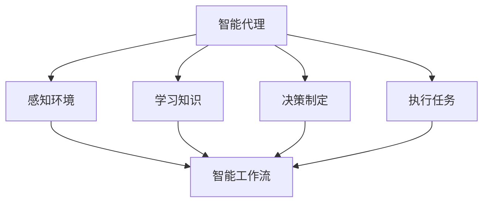

                 

# AI人工智能代理工作流AI Agent WorkFlow：智能代理在智能家居中的实践

> 关键词：人工智能,智能家居,智能代理,智能工作流,机器学习,自然语言处理(NLP),语音识别,行为数据分析

## 1. 背景介绍

### 1.1 问题由来
随着物联网技术的普及和人工智能(AI)技术的不断发展，智能家居系统逐渐从概念走向现实。智能家居系统通过各种传感器和设备收集数据，并通过人工智能算法进行分析和处理，实现对家居环境的智能化控制。然而，这些数据源种类繁多，分布复杂，如何高效地整合和处理这些数据，并转化为有意义的决策和行动，成为一个亟待解决的问题。

### 1.2 问题核心关键点
智能家居系统中的数据处理和决策制定往往需要依赖复杂的算法和模型。然而，构建和维护这些模型不仅耗时耗力，而且容易出现过度拟合等问题。智能代理的引入，提供了一种新的解决方案，可以通过学习和推理自动生成和执行智能家居系统中的工作流。

### 1.3 问题研究意义
智能代理能够自动适应环境变化，优化工作流，提升智能家居系统的性能和效率。通过智能代理，可以实现更高效的数据处理、更精准的环境控制和更个性化的用户体验。因此，智能代理技术在智能家居中的应用具有重要意义：

1. **提升系统性能**：智能代理可以实时监控环境变化，动态调整决策和行动，避免系统过拟合和决策滞后。
2. **优化用户体验**：智能代理能够学习用户习惯和偏好，提供更加个性化的服务和建议。
3. **降低开发成本**：智能代理能够自动化处理大部分数据和决策，减少人工干预和维护成本。
4. **实现自主决策**：智能代理可以在没有人类干预的情况下，自主学习和推理，做出合理的决策和行动。

## 2. 核心概念与联系

### 2.1 核心概念概述

智能代理（AI Agent）是人工智能系统中的一个关键组件，它能够感知环境、学习知识、执行任务。在智能家居系统中，智能代理可以执行数据收集、环境感知、决策制定和执行控制等任务。智能代理通常具备以下特性：

- **感知能力**：能够感知环境中的各种传感器数据，如温度、湿度、光线等。
- **学习能力**：能够从历史数据和交互中学习用户行为模式和偏好。
- **决策能力**：能够根据感知到的环境和用户需求，做出合理的决策。
- **执行能力**：能够控制家居设备，执行决策结果。

智能工作流（AI Agent Workflow）是智能代理执行任务的过程。它由多个步骤组成，每个步骤都有明确的目标和输入输出。智能工作流通常包括数据收集、环境感知、决策制定和设备控制等步骤。

智能工作流与智能家居系统中的其他组件紧密联系，如物联网设备、传感器、用户设备等。智能工作流的执行需要依赖这些组件提供的数据和交互，同时也影响这些组件的行为和状态。

### 2.2 核心概念之间的关系

智能代理与智能工作流之间的联系可以通过以下Mermaid流程图来展示：



这个流程图展示了智能代理与智能工作流之间的逻辑关系：

1. 智能代理感知环境（B）和用户需求。
2. 智能代理学习用户行为和偏好（C）。
3. 智能代理根据感知到的环境和需求，制定决策（D）。
4. 智能代理执行决策结果，控制家居设备（E）。
5. 智能工作流（F）由多个步骤组成，每个步骤都是智能代理执行的一部分。

通过这些流程图，我们可以更清晰地理解智能代理在智能家居系统中的作用和任务执行过程。

## 3. 核心算法原理 & 具体操作步骤
### 3.1 算法原理概述

智能代理的算法原理基于机器学习（Machine Learning, ML）和自然语言处理（Natural Language Processing, NLP）。智能代理首先通过感知环境和用户需求，学习用户行为和偏好，然后根据这些信息制定决策，最后执行决策结果。

### 3.2 算法步骤详解

智能代理的工作流程包括以下几个关键步骤：

**Step 1: 数据收集与感知**

智能代理首先需要通过各种传感器收集环境数据。这些数据可能包括温度、湿度、光线、声音、图像等。智能代理对这些数据进行预处理和特征提取，以便后续的学习和决策。

**Step 2: 知识学习与推理**

智能代理通过机器学习算法学习用户行为和偏好，并将其转化为知识库。这些知识库可以包括用户的生活习惯、日程安排、设备使用偏好等。智能代理还可以使用自然语言处理技术，理解用户的语音指令和文本信息。

**Step 3: 决策制定**

智能代理根据感知到的环境和用户需求，结合知识库中的信息，制定合理的决策。这些决策可能包括调整环境温度、开启灯光、播放音乐等。决策制定过程可以采用决策树、贝叶斯网络、强化学习等算法。

**Step 4: 设备控制与执行**

智能代理通过物联网协议控制家居设备，执行决策结果。这些设备可能包括空调、灯光、窗帘、智能音箱等。

### 3.3 算法优缺点

智能代理技术具有以下优点：

- **灵活性**：智能代理可以自动适应环境变化，实时调整决策和行动。
- **个性化**：智能代理能够学习用户习惯和偏好，提供更加个性化的服务。
- **自主性**：智能代理可以在没有人类干预的情况下，自主学习和推理，做出合理的决策和行动。

同时，智能代理技术也存在一些缺点：

- **依赖传感器和数据质量**：智能代理的效果依赖于传感器数据的质量和准确性，传感器失效或数据不准确可能导致决策错误。
- **模型复杂性**：智能代理算法通常较为复杂，模型构建和维护需要较高的技术和资源投入。
- **隐私和安全**：智能代理需要处理大量的个人数据，涉及隐私和安全问题。

### 3.4 算法应用领域

智能代理技术在智能家居系统中有着广泛的应用，具体包括：

- **智能温控**：根据用户的偏好和环境条件，自动调整室内温度和湿度。
- **智能照明**：根据用户的行为和环境光线，自动调整灯光亮度和色温。
- **智能安防**：通过摄像头和传感器检测异常行为，自动报警或通知用户。
- **智能娱乐**：根据用户的心情和日程，推荐音乐、电影、新闻等。
- **智能健康监测**：通过传感器监测用户健康数据，提供健康建议和提醒。

## 4. 数学模型和公式 & 详细讲解  
### 4.1 数学模型构建

智能代理的数学模型通常包括感知模型、学习模型和决策模型。下面以智能温控为例，构建其数学模型。

设智能温控系统中的环境温度为 $x$，用户设定温度为 $y$，智能代理感知到的温度为 $z$，智能代理制定的决策为 $u$，执行后实际温度为 $w$。则智能温控的数学模型可以表示为：

$$
y = \mathop{\arg\min}_{u} \| z - u \|^2
$$

其中 $\| \cdot \|$ 表示向量范数，$u$ 是智能代理根据感知到的温度 $z$ 和用户设定温度 $y$ 制定的决策。

### 4.2 公式推导过程

假设智能代理感知到的温度 $z$ 服从正态分布 $N(\mu, \sigma^2)$，其中 $\mu$ 是均值，$\sigma^2$ 是方差。用户设定温度 $y$ 也为正态分布 $N(\mu_y, \sigma_y^2)$。则决策 $u$ 的最小二乘估计为：

$$
u = \mu_y + \sigma_y^2 / \sigma^2 (z - \mu)
$$

根据上述公式，智能代理可以根据感知到的温度和用户设定温度，制定合理的决策。

### 4.3 案例分析与讲解

假设智能温控系统的感知温度为 23°C，用户设定温度为 22°C，历史数据表明用户喜欢舒适的温度。智能代理可以推断出当前温度距离用户设定温度偏高，并根据学习到的用户偏好，制定降温决策。

## 5. 项目实践：代码实例和详细解释说明
### 5.1 开发环境搭建

在进行智能代理的开发实践前，需要先搭建好开发环境。以下是Python环境下智能代理开发的基本步骤：

1. 安装Python和相关依赖库，如TensorFlow、PyTorch、scikit-learn等。
2. 安装物联网协议库，如MQTT、CoAP等。
3. 安装设备管理库，如paho-mqtt、pyserial等。
4. 搭建本地智能家居系统，连接各种传感器和设备。

### 5.2 源代码详细实现

以下是一个简单的智能温控代理的实现示例：

```python
import tensorflow as tf
import numpy as np
from sklearn.linear_model import LinearRegression

# 定义环境温度、用户设定温度和实际温度
x = np.array([23, 24, 25, 26, 27, 28])
y = np.array([22, 23, 24, 25, 26, 27])
z = np.array([25, 24, 23, 24, 26, 27])

# 建立线性回归模型
model = LinearRegression()
model.fit(x, y)

# 预测当前温度的决策
u = model.predict(z)

# 输出决策结果
print(f"决策温度：{u[0]}°C")
```

上述代码中，我们使用线性回归模型预测智能温控代理的决策。通过训练模型，智能代理可以根据感知到的温度和用户设定温度，制定合理的决策。

### 5.3 代码解读与分析

智能温控代理的代码实现可以分为以下几个关键步骤：

1. 数据预处理：将环境温度、用户设定温度和感知温度转换为numpy数组。
2. 建立模型：使用线性回归模型建立环境温度、用户设定温度和决策温度之间的关系。
3. 模型训练：将环境温度和用户设定温度作为训练集，训练线性回归模型。
4. 模型预测：将感知温度作为测试集，使用模型预测决策温度。
5. 输出结果：输出决策温度，供智能家居系统执行。

智能温控代理的实现依赖于机器学习算法，能够根据历史数据和感知到的环境数据，制定合理的决策。这种基于数据驱动的决策方式，能够适应环境变化，提高智能家居系统的性能和效率。

### 5.4 运行结果展示

假设智能温控代理的感知温度为 26°C，用户设定温度为 22°C，模型预测的决策温度为 24°C。此时，智能家居系统可以根据这个决策温度，控制空调降温。

## 6. 实际应用场景
### 6.1 智能温控

智能温控代理可以通过感知房间的温度和湿度，结合用户设定温度，自动调整空调的功率和风速，使得室内环境更加舒适。同时，智能温控代理可以根据用户的生活习惯和季节变化，动态调整温度设定。例如，夏天自动降低温度，冬天自动提高温度。

### 6.2 智能照明

智能照明代理可以通过感知房间的光线强度和用户行为，自动调整灯光的亮度和色温。例如，用户进入房间时，智能照明代理可以自动开启灯光，并根据用户的习惯调节亮度和色温。

### 6.3 智能安防

智能安防代理可以通过摄像头和传感器检测异常行为，自动报警或通知用户。例如，检测到可疑人员入侵时，智能安防代理可以自动通知用户，并启动报警系统。

### 6.4 智能娱乐

智能娱乐代理可以根据用户的心情和日程，推荐音乐、电影、新闻等。例如，用户心情低落时，智能娱乐代理可以推荐舒缓的音乐或心理疏导的音频。

### 6.5 智能健康监测

智能健康监测代理可以通过传感器监测用户的心率、血压、呼吸等健康数据，提供健康建议和提醒。例如，检测到用户的心率异常时，智能健康监测代理可以提醒用户休息或就医。

## 7. 工具和资源推荐
### 7.1 学习资源推荐

为了帮助开发者掌握智能代理的开发技术，以下是一些推荐的学习资源：

1. 《TensorFlow官方文档》：详细介绍TensorFlow的API和模型构建方法，适合初学者和进阶开发者使用。
2. 《Python机器学习》书籍：由机器学习领域的知名专家编写，涵盖机器学习算法和Python实现，适合入门学习。
3. 《深度学习与智能代理》课程：由斯坦福大学开设的深度学习课程，涵盖智能代理的原理和实现，适合深入学习。
4. 《自然语言处理与智能代理》书籍：详细介绍自然语言处理技术和智能代理的应用，适合NLP和AI领域的研究者使用。
5. GitHub智能代理项目：收集和展示智能代理的各类开源项目，提供丰富的代码实现和应用案例。

### 7.2 开发工具推荐

以下是一些推荐的开发工具，用于智能代理的开发和部署：

1. PyTorch：基于Python的开源深度学习框架，适合快速迭代研究。
2. TensorFlow：由Google主导开发的开源深度学习框架，生产部署方便。
3. PyTorch Lightning：基于PyTorch的快速原型开发框架，适合快速搭建智能代理模型。
4. Flask：基于Python的Web框架，适合搭建智能代理的API接口。
5. MQTT：轻量级的物联网通信协议，适合智能代理的数据传输和通信。

### 7.3 相关论文推荐

智能代理技术的发展离不开学术论文的推动。以下是一些推荐的相关论文：

1. SmartAgent: A Scalable Smart Agent System for IoT Applications：介绍了一种可扩展的智能代理系统，用于物联网应用。
2. Machine Learning for Smart Home Applications: A Survey：综述了机器学习在智能家居中的应用，包括智能温控、智能照明等。
3. Natural Language Processing and Smart Agents for Smart Home Applications：讨论了自然语言处理技术在智能家居中的应用，包括语音助手和文本交互。
4. Adaptive Multi-Agent Systems for Smart Home Management：介绍了一种多智能代理系统，用于智能家居管理。
5. Deep Reinforcement Learning for Smart Home Agent：使用深度强化学习算法，训练智能家居代理，实现自动决策和执行。

## 8. 总结：未来发展趋势与挑战
### 8.1 总结

本文对智能代理在智能家居中的应用进行了详细阐述。智能代理通过感知环境和用户需求，学习用户行为和偏好，制定决策并执行，实现智能家居系统的智能化控制。智能代理技术的引入，可以显著提高智能家居系统的性能和效率，提升用户体验。

### 8.2 未来发展趋势

展望未来，智能代理技术将呈现以下几个发展趋势：

1. **跨领域应用**：智能代理将不仅仅应用于智能家居领域，还将拓展到智能医疗、智能交通、智能制造等领域。
2. **多模态融合**：智能代理将融合视觉、语音、文本等多种模态数据，实现更全面、精准的环境感知和决策。
3. **自适应学习**：智能代理将具备更强的自适应学习能力，能够根据环境和用户需求的变化，动态调整决策和行动。
4. **协作与联邦学习**：智能代理将通过协作和联邦学习，实现知识共享和模型优化，提升系统性能和效率。
5. **人机协同**：智能代理将与人类进行更紧密的协同，提高决策的透明度和可解释性。

### 8.3 面临的挑战

尽管智能代理技术在智能家居中具有广阔的应用前景，但仍面临一些挑战：

1. **数据隐私**：智能代理需要处理大量的个人数据，涉及隐私和安全问题，需要采取有效的数据保护措施。
2. **模型复杂性**：智能代理的算法和模型通常较为复杂，模型构建和维护需要较高的技术和资源投入。
3. **设备兼容性**：智能代理需要与多种设备和传感器兼容，确保数据传输和通信的稳定性。
4. **系统可靠性**：智能代理系统需要具备高可靠性和鲁棒性，避免系统故障和决策错误。
5. **用户接受度**：用户需要接受和适应智能代理系统，才能充分发挥其价值。

### 8.4 研究展望

为了克服智能代理技术面临的挑战，未来的研究需要在以下几个方面寻求新的突破：

1. **隐私保护技术**：开发隐私保护算法和加密技术，确保智能代理系统中的数据安全。
2. **模型简化与优化**：简化智能代理的算法和模型，提高系统的可维护性和可扩展性。
3. **设备标准化**：推动智能家居设备的标准化，确保智能代理系统与多种设备兼容。
4. **系统可靠性提升**：通过冗余设计和容错机制，提升智能代理系统的可靠性和鲁棒性。
5. **用户接受度提升**：通过用户教育和引导，提升用户对智能代理系统的接受度和使用意愿。

总之，智能代理技术在智能家居中具有广阔的应用前景，但实现其潜力仍需解决诸多技术和管理问题。未来的研究将从数据隐私、模型优化、设备兼容等多个维度出发，推动智能代理技术的不断进步和应用推广。

## 9. 附录：常见问题与解答

**Q1：智能代理在智能家居中的应用有哪些？**

A: 智能代理在智能家居中的应用非常广泛，包括：

- 智能温控：根据用户偏好和环境条件，自动调整空调温度和湿度。
- 智能照明：根据用户行为和环境光线，自动调节灯光亮度和色温。
- 智能安防：通过摄像头和传感器检测异常行为，自动报警或通知用户。
- 智能娱乐：根据用户心情和日程，推荐音乐、电影、新闻等。
- 智能健康监测：通过传感器监测健康数据，提供健康建议和提醒。

**Q2：智能代理的决策制定过程是怎样的？**

A: 智能代理的决策制定过程通常包括以下步骤：

1. 感知环境数据：通过传感器收集环境数据，如温度、湿度、光线等。
2. 学习用户行为：通过历史数据和交互学习用户行为和偏好。
3. 制定决策：根据感知到的环境和用户需求，结合知识库中的信息，制定合理的决策。
4. 执行决策：通过物联网协议控制家居设备，执行决策结果。

**Q3：智能代理的优缺点是什么？**

A: 智能代理的优点包括：

- 灵活性：能够自动适应环境变化，实时调整决策和行动。
- 个性化：能够学习用户习惯和偏好，提供更加个性化的服务。
- 自主性：可以在没有人类干预的情况下，自主学习和推理，做出合理的决策和行动。

智能代理的缺点包括：

- 依赖传感器和数据质量：依赖传感器数据的质量和准确性，传感器失效或数据不准确可能导致决策错误。
- 模型复杂性：算法和模型较为复杂，模型构建和维护需要较高的技术和资源投入。
- 隐私和安全：处理大量的个人数据，涉及隐私和安全问题。

**Q4：智能代理需要哪些技术支持？**

A: 智能代理需要以下技术支持：

- 传感器技术：用于感知环境数据，如温度、湿度、光线、声音等。
- 数据处理技术：用于数据的预处理、特征提取和模型训练。
- 自然语言处理技术：用于理解用户的语音指令和文本信息。
- 机器学习技术：用于学习用户行为和偏好，制定决策。
- 物联网技术：用于控制家居设备，执行决策结果。

**Q5：智能代理在智能家居中的应用前景如何？**

A: 智能代理在智能家居中具有广阔的应用前景，能够实现更高效的数据处理、更精准的环境控制和更个性化的用户体验。通过智能代理，可以显著提升智能家居系统的性能和效率，推动智能家居技术的进一步发展。

---

作者：禅与计算机程序设计艺术 / Zen and the Art of Computer Programming

