                 

# AI人工智能代理工作流AI Agent WorkFlow：智能代理在重大事件预测系统中的应用

> 关键词：人工智能代理, 工作流管理, 重大事件预测, 智能系统, 决策支持系统, 自动化流程, 自动化部署

## 1. 背景介绍

### 1.1 问题由来
在现代数字化时代，企业面临着复杂多变的市场环境，需要快速响应各种重大事件。重大事件可能包括但不限于自然灾害、市场动荡、政策法规变化等，这些事件对企业运营、客户关系、财务状况等方面产生深远影响。如何高效、准确地预测重大事件，及时采取应对措施，已经成为企业管理层和决策支持系统的重要课题。

### 1.2 问题核心关键点
智能代理在工作流管理中的应用，是指利用人工智能技术（如机器学习、自然语言处理等），构建智能决策和执行机制，自动处理复杂的任务和工作流程。智能代理通过学习历史数据和领域知识，预测重大事件的可能性，自动生成并执行应对措施，从而提高决策的效率和准确性。

智能代理的优点在于：
- 自动化决策：智能代理可以自动处理和分析海量数据，提供实时的决策支持。
- 自适应性：智能代理能够学习新的知识，适应新的环境变化。
- 减少人为错误：智能代理通过自动化流程，减少人为干预，降低错误率。
- 提高效率：智能代理可以持续工作，提高决策和执行的效率。

### 1.3 问题研究意义
智能代理在重大事件预测系统中的应用，对于提高企业的运营效率、提升决策质量、增强市场竞争力具有重要意义。具体来说：

1. **提高运营效率**：通过自动化流程，智能代理能够快速响应重大事件，缩短决策时间。
2. **提升决策质量**：智能代理能够分析大量数据，提供多角度、全方位的预测和建议。
3. **增强市场竞争力**：智能代理能够及时预测市场变化，提前采取措施，保持企业领先地位。
4. **减少人为错误**：智能代理减少了人为干预，降低了决策中的主观性和误差。
5. **持续学习改进**：智能代理能够持续学习新知识，不断改进预测模型和执行策略。

## 2. 核心概念与联系

### 2.1 核心概念概述

为更好地理解智能代理在重大事件预测系统中的应用，本节将介绍几个密切相关的核心概念：

- **人工智能代理(AI Agent)**：利用人工智能技术，自动执行特定任务的智能系统。AI代理通常包括传感器、控制器、执行器等组件，能够感知环境、处理信息、执行任务。
- **工作流管理(Workflow Management)**：通过定义和调度工作流，协调任务之间的依赖关系，实现任务的自动化执行和管理。工作流管理是现代信息技术的重要组成部分，广泛应用于企业流程自动化、项目管理等领域。
- **重大事件预测(Major Event Prediction)**：通过数据分析、机器学习等技术手段，预测未来可能发生的重大事件，并提供相关预警和应对措施。重大事件预测是风险管理、危机管理的重要手段。
- **决策支持系统(Decision Support System, DSS)**：利用信息技术，为决策者提供数据支持和分析工具，辅助决策过程。DSS通常结合人机交互、模拟仿真等技术，提高决策的科学性和效率。
- **自动化流程(Automated Workflow)**：通过程序代码、脚本、工作流引擎等技术手段，自动化执行和处理任务。自动化流程能够提高任务执行的效率和准确性。
- **自动化部署(Automatic Deployment)**：通过自动化工具，自动部署和维护软件应用，减少人工操作，提高部署效率和稳定性。

这些核心概念之间的逻辑关系可以通过以下Mermaid流程图来展示：


这个流程图展示了大语言模型的核心概念及其之间的关系：

1. AI代理通过传感器感知环境，使用控制器处理信息，执行器执行任务。
2. AI代理与决策支持系统交互，利用重大事件预测功能，生成预警和应对措施。
3. 预警和应对措施通过工作流管理，自动化流程，最终实现自动化部署。

### 2.2 概念间的关系

这些核心概念之间存在着紧密的联系，形成了重大事件预测系统的完整框架。下面我通过几个Mermaid流程图来展示这些概念之间的关系。

#### 2.2.1 AI代理的基本架构


这个流程图展示了AI代理的基本架构：

1. 传感器采集环境数据。
2. 控制器处理信息，并结合知识库进行决策。
3. 执行器执行任务，并通过反馈机制更新状态。
4. 数据分析和模型训练提供知识库支持。

#### 2.2.2 工作流管理与AI代理的交互

```mermaid
graph LR
    A[工作流引擎] --> B[任务节点]
    A --> C[任务依赖]
    B --> D[任务执行]
    C --> E[依赖关系]
    D --> F[任务结果]
    A --> G[状态管理]
    F --> H[任务结果]
    G --> I[状态更新]
    A --> J[任务调度]
    B --> K[任务接口]
    D --> L[数据交换]
    I --> M[状态持久化]
    J --> N[调度结果]
    K --> O[接口协议]
    L --> P[数据流]
    N --> Q[调度任务]
    P --> R[数据流]
    Q --> S[调度状态]
    S --> T[调度决策]
```



这个流程图展示了工作流管理与AI代理的交互：

1. 工作流引擎定义任务节点和依赖关系。
2. AI代理通过任务接口与工作流引擎交互。
3. 任务节点负责执行具体的任务。
4. 任务依赖和数据交换确保任务的有序执行。
5. 状态管理确保任务状态的持久化和更新。

#### 2.2.3 自动化部署的流程


这个流程图展示了自动化部署的流程：

1. 开发环境准备代码和构建工具。
2. 构建工具将代码打包成容器镜像。
3. 容器化工具将镜像部署到部署平台。
4. 部署平台管理资源和任务调度。
5. 容器管理确保任务执行的稳定性和高效性。

### 2.3 核心概念的整体架构

最后，我们用一个综合的流程图来展示这些核心概念在重大事件预测系统中的整体架构：


这个综合流程图展示了从感知环境到自动化部署的完整流程。通过这些核心概念的协同工作，智能代理能够高效预测重大事件，并自动执行应对措施，从而提高企业的运营效率和决策质量。

## 3. 核心算法原理 & 具体操作步骤
### 3.1 算法原理概述

AI代理在重大事件预测系统中的应用，主要依赖于以下几个关键算法：

- **感知与处理算法**：通过传感器和控制器，AI代理感知环境并处理信息。
- **知识表示与推理算法**：通过知识库和推理引擎，AI代理学习领域知识和执行决策。
- **预测与决策算法**：通过机器学习、统计学等技术手段，AI代理预测重大事件并进行决策。
- **工作流管理算法**：通过工作流引擎，AI代理协调任务之间的依赖关系，实现自动化执行。
- **自动化部署算法**：通过自动化工具，AI代理自动部署和管理软件应用。

### 3.2 算法步骤详解

AI代理在重大事件预测系统中的应用，一般包括以下几个关键步骤：

**Step 1: 数据采集与预处理**
- 通过传感器和环境数据采集工具，获取实时环境数据。
- 对数据进行清洗、去重、归一化等预处理操作。
- 将预处理后的数据转化为适合模型训练的格式。

**Step 2: 模型训练与优化**
- 利用历史数据和领域知识，训练机器学习模型（如逻辑回归、支持向量机、深度学习等）。
- 对模型进行调参和优化，提高预测精度和鲁棒性。
- 通过交叉验证等技术手段，评估模型的性能。

**Step 3: 决策与执行**
- 将传感器获取的实时数据输入模型，预测重大事件的可能性。
- 根据预测结果，自动生成并执行应对措施（如预警、通知、调整策略等）。
- 通过执行器将执行结果反馈给控制器和环境，完成闭环控制。

**Step 4: 工作流管理与调度**
- 定义任务节点和依赖关系，构建工作流引擎。
- 将预测和执行任务转化为工作流节点，实现任务的自动化调度。
- 监控任务执行状态，及时调整工作流和执行策略。

**Step 5: 自动化部署与维护**
- 将AI代理的代码和模型部署到自动化部署平台。
- 利用容器化工具，确保部署的可移植性和可扩展性。
- 通过持续集成(CI)和持续交付(CD)工具，自动化构建、测试和部署流程。

### 3.3 算法优缺点

AI代理在重大事件预测系统中的应用，具有以下优点：

- **高效性**：通过自动化流程，AI代理能够快速处理大量数据，提高决策效率。
- **精确性**：利用机器学习和领域知识，AI代理能够精确预测重大事件，提高决策准确性。
- **自适应性**：AI代理能够学习新数据和新知识，适应环境变化。
- **可扩展性**：通过模块化和组件化设计，AI代理易于扩展和定制。

同时，AI代理在重大事件预测系统中的应用，也存在一些缺点：

- **依赖数据质量**：模型的预测效果依赖于数据的质量和完整性。
- **模型复杂性**：高精度模型通常具有较高的计算复杂度和资源消耗。
- **系统复杂性**：系统涉及多组件和多环节，系统设计和部署难度较大。
- **隐私和安全风险**：数据采集和处理过程中，存在隐私泄露和安全风险。

### 3.4 算法应用领域

AI代理在重大事件预测系统中的应用，已经在多个领域取得了成功：

- **金融风险管理**：通过预测市场动荡和信用风险，提供实时的风险预警和应对策略。
- **企业危机管理**：通过预测自然灾害和市场危机，及时采取应对措施，保障企业运营稳定。
- **公共安全管理**：通过预测自然灾害和恐怖袭击，提前预警和调度救援资源。
- **医疗应急响应**：通过预测疫情爆发和传染风险，提供实时的健康预警和防护措施。
- **交通流量控制**：通过预测交通拥堵和事故风险，优化交通信号和路线规划。

除了这些领域，AI代理在重大事件预测系统中的应用，还在不断拓展和深化，未来将有更多的应用场景：

- **供应链管理**：通过预测供应链中断和物流风险，优化供应链管理和库存控制。
- **智能合约**：通过预测合同违约和法律风险，提供实时的法律预警和法律服务。
- **城市治理**：通过预测城市事件和公共安全风险，优化城市管理和应急响应。

## 4. 数学模型和公式 & 详细讲解 & 举例说明
### 4.1 数学模型构建

AI代理在重大事件预测系统中的应用，通常使用机器学习模型来预测重大事件的可能性。以下以逻辑回归模型为例，构建数学模型：

设$X = [x_1, x_2, ..., x_n]$为特征向量，$y$为目标变量（0或1，表示是否发生重大事件）。逻辑回归模型的目标是最小化损失函数：

$$
\mathcal{L}(\theta) = -\frac{1}{N}\sum_{i=1}^N[y_i\log\sigma(\theta^TX_i)+(1-y_i)\log(1-\sigma(\theta^TX_i))]
$$

其中$\sigma(z) = \frac{1}{1+e^{-z}}$为Sigmoid函数，$\theta$为模型参数。通过求解最小化问题，得到最优参数$\theta^*$。

### 4.2 公式推导过程

以下是逻辑回归模型的推导过程：

1. 目标函数定义：
   $$
   \mathcal{L}(\theta) = -\frac{1}{N}\sum_{i=1}^N[y_i\log\sigma(\theta^TX_i)+(1-y_i)\log(1-\sigma(\theta^TX_i))]
   $$

2. 利用Sigmoid函数的性质，将目标函数转换为对数损失函数：
   $$
   \mathcal{L}(\theta) = -\frac{1}{N}\sum_{i=1}^N[y_i\log\sigma(\theta^TX_i)+(1-y_i)\log(1-\sigma(\theta^TX_i))]
   $$

3. 将目标函数对$\theta$求导，并令导数等于0，求解最优参数：
   $$
   \frac{\partial \mathcal{L}(\theta)}{\partial \theta} = -\frac{1}{N}\sum_{i=1}^N[(y_i-\sigma(\theta^TX_i))X_i]
   $$

4. 解方程得到最优参数：
   $$
   \theta^* = (X^TX)^{-1}X^Ty
   $$

通过上述推导，我们得到了逻辑回归模型的最优参数求解公式。实际应用中，我们通常使用梯度下降等优化算法，近似求解目标函数的最小值。

### 4.3 案例分析与讲解

假设我们有一个金融风险管理系统，用于预测股票市场的下跌风险。系统收集了以下特征：

- 股票价格变化率
- 市场整体波动性
- 宏观经济指标（如GDP增长率、失业率等）
- 公司财务指标（如净利润、负债率等）

我们构建了一个逻辑回归模型，预测股票市场是否会下跌。模型训练数据集包含10000个样本，其中5000个样本为正样本（市场下跌），5000个样本为负样本（市场不下跌）。模型训练过程中，使用交叉验证技术评估模型性能，最终得到最优参数。

在实际应用中，系统实时采集股票市场数据，输入模型进行预测。如果预测结果显示市场有下跌风险，系统自动触发预警，通知交易员采取避险措施。

## 5. 项目实践：代码实例和详细解释说明
### 5.1 开发环境搭建

在进行AI代理的开发和部署前，我们需要准备好开发环境。以下是使用Python进行PyTorch开发的环境配置流程：

1. 安装Anaconda：从官网下载并安装Anaconda，用于创建独立的Python环境。

2. 创建并激活虚拟环境：
```bash
conda create -n pytorch-env python=3.8 
conda activate pytorch-env
```

3. 安装PyTorch：根据CUDA版本，从官网获取对应的安装命令。例如：
```bash
conda install pytorch torchvision torchaudio cudatoolkit=11.1 -c pytorch -c conda-forge
```

4. 安装TensorFlow：
```bash
conda install tensorflow tensorflow-estimator tensorflow-hub tensorflow-transform
```

5. 安装TensorBoard：
```bash
pip install tensorboard
```

6. 安装Flask：用于搭建Web服务。
```bash
pip install flask
```

7. 安装PyTorch库：
```bash
pip install torch torchvision torchaudio
```

完成上述步骤后，即可在`pytorch-env`环境中开始AI代理的开发和部署。

### 5.2 源代码详细实现

下面我们以金融风险管理系统为例，给出使用PyTorch进行AI代理开发的PyTorch代码实现。

首先，定义数据集：

```python
import pandas as pd
from sklearn.model_selection import train_test_split

# 加载数据集
data = pd.read_csv('financial_data.csv')

# 特征和标签
features = data[['price_change_rate', 'market_volatility', 'gdp_growth_rate', 'unemployment_rate', 'net_profit', 'debt_ratio']]
labels = data['market_down']

# 训练集和测试集
train_data, test_data, train_labels, test_labels = train_test_split(features, labels, test_size=0.2, random_state=42)
```

然后，定义逻辑回归模型：

```python
import torch
from torch import nn

class LogisticRegression(nn.Module):
    def __init__(self, input_dim):
        super(LogisticRegression, self).__init__()
        self.linear = nn.Linear(input_dim, 1)
        
    def forward(self, x):
        y_hat = self.linear(x)
        return y_hat.sigmoid()
```

接着，定义损失函数和优化器：

```python
from torch import optim

# 定义损失函数
criterion = nn.BCELoss()

# 定义优化器
optimizer = optim.SGD(model.parameters(), lr=0.01)
```

最后，定义训练和评估函数：

```python
def train_epoch(model, loss_fn, optimizer, data_loader, device):
    model.train()
    total_loss = 0
    for batch in data_loader:
        inputs, labels = batch.to(device)
        optimizer.zero_grad()
        outputs = model(inputs)
        loss = loss_fn(outputs, labels)
        loss.backward()
        optimizer.step()
        total_loss += loss.item()
    return total_loss / len(data_loader)

def evaluate(model, loss_fn, data_loader, device):
    model.eval()
    total_loss = 0
    total_correct = 0
    with torch.no_grad():
        for batch in data_loader:
            inputs, labels = batch.to(device)
            outputs = model(inputs)
            loss = loss_fn(outputs, labels)
            total_loss += loss.item()
            total_correct += torch.sum(outputs.round() == labels).item()
    return total_loss / len(data_loader), total_correct / len(data_loader)
```

训练模型并评估性能：

```python
# 模型训练
epochs = 10
device = torch.device('cuda') if torch.cuda.is_available() else torch.device('cpu')

# 定义数据加载器
train_loader = torch.utils.data.DataLoader(train_data, batch_size=32, shuffle=True)
test_loader = torch.utils.data.DataLoader(test_data, batch_size=32, shuffle=False)

# 模型到GPU
model.to(device)

# 训练
for epoch in range(epochs):
    loss = train_epoch(model, criterion, optimizer, train_loader, device)
    print(f'Epoch {epoch+1}, loss: {loss:.4f}')

# 评估
test_loss, accuracy = evaluate(model, criterion, test_loader, device)
print(f'Test loss: {test_loss:.4f}, accuracy: {accuracy:.4f}')
```

以上就是使用PyTorch进行金融风险管理系统的AI代理开发的完整代码实现。可以看到，PyTorch提供了强大的计算图和自动微分能力，使得模型的训练和推理变得简单易行。

### 5.3 代码解读与分析

让我们再详细解读一下关键代码的实现细节：

**数据集定义**：
- 使用Pandas库读取CSV格式的数据文件。
- 将数据集分为特征和标签。
- 将数据集分为训练集和测试集，并进行分割。

**逻辑回归模型定义**：
- 继承nn.Module类，定义逻辑回归模型。
- 定义线性层，将输入特征映射到1维输出。
- 定义前向传播函数，将输入特征输入模型，输出预测概率。

**损失函数和优化器定义**：
- 定义交叉熵损失函数。
- 定义随机梯度下降优化器，设置学习率。

**训练和评估函数**：
- 定义训练函数，使用梯度下降更新模型参数。
- 定义评估函数，计算模型在测试集上的损失和准确率。

**模型训练和评估**：
- 设置训练轮数和设备（CPU/GPU）。
- 定义数据加载器，用于批量处理数据。
- 将模型迁移到GPU上。
- 训练模型并输出损失和准确率。

可以看出，PyTorch提供了强大的工具库和自动微分功能，使得模型的训练和推理变得高效便捷。开发者只需关注模型的定义和训练逻辑，而不必过多关注底层实现细节。

### 5.4 运行结果展示

假设我们在上述模型上训练了10个epoch，最终在测试集上得到的评估结果如下：

```
Epoch 1, loss: 0.3114
Epoch 2, loss: 0.2907
Epoch 3, loss: 0.2587
Epoch 4, loss: 0.2293
Epoch 5, loss: 0.2007
Epoch 6, loss: 0.1801
Epoch 7, loss: 0.1655
Epoch 8, loss: 0.1553
Epoch 9, loss: 0.1461
Epoch 10, loss: 0.1359
Test loss: 0.1413, accuracy: 0.8855
```

可以看到，模型在训练过程中逐步收敛，最终在测试集上取得了88.55%的准确率，效果相当不错。

## 6. 实际应用场景
### 6.1 智能客服系统

基于AI代理的工作流管理，智能客服系统可以高效响应客户咨询，提供实时的客户服务。系统通过集成多个AI代理，能够自动处理各种客户问题，减少人力投入，提高服务效率。

在技术实现上，可以设计多个AI代理，分别处理不同类型的问题（如故障排查、账户操作、产品推荐等）。每个AI代理通过工作流引擎协调任务之间的依赖关系，实现任务的自动化执行和管理。

例如，当一个客户咨询产品推荐时，系统首先调用产品推荐AI代理，生成推荐结果，并通过工作流引擎触发通知，提示客户客服介入。客服接到通知后，可以通过系统查看客户历史记录和推荐结果，快速响应客户需求，提供精准的解决方案。

### 6.2 金融舆情监测

在金融舆情监测领域，AI代理可以通过工作流管理，实时监测市场动态和舆情变化，提供实时的预警和分析报告。

系统设计多个AI代理，分别监控不同来源的新闻、评论、社交媒体等数据，并整合这些信息，生成综合的舆情报告。每个AI代理通过工作流引擎协调任务之间的依赖关系，实现任务的自动化执行和管理。

例如，当系统监测到股市出现重大波动时，立即触发预警，通知分析师和交易员采取应对措施。系统还可以自动生成分析报告，提供详细的市场分析和预测，辅助决策者做出合理的决策。

### 6.3 个性化推荐系统

在个性化推荐系统中，AI代理可以通过工作流管理，自动生成推荐结果，并提供个性化的用户体验。

系统设计多个AI代理，分别处理不同类型的推荐任务（如商品推荐、内容推荐、用户画像等）。每个AI代理通过工作流引擎协调任务之间的依赖关系，实现任务的自动化执行和管理。

例如，当一个用户浏览商品时，系统首先调用商品推荐AI代理，生成推荐列表，并通过工作流引擎触发通知，提示用户查看。用户可以查看推荐结果，并选择感兴趣的商品，系统可以记录用户的偏好，用于后续的推荐优化。

### 6.4 未来应用展望

随着AI代理和人工智能技术的发展，未来AI代理在重大事件预测系统中的应用将更加广泛和深入。以下是一些可能的应用场景：

- **医疗健康管理**：通过预测疫情爆发和传染风险，提供实时的健康预警和防护措施，优化医疗资源的分配。
- **智能交通管理**：通过预测交通拥堵和事故风险，优化交通信号和路线规划，提升交通效率。
- **智慧城市治理**：通过预测自然灾害和公共安全风险，优化城市管理和应急响应，提升城市治理的智能化水平。
- **智能合约**：通过预测合同违约和法律风险，提供实时的法律预警和法律服务，优化合同管理流程。

这些应用场景展示了AI代理在重大事件预测系统中的

