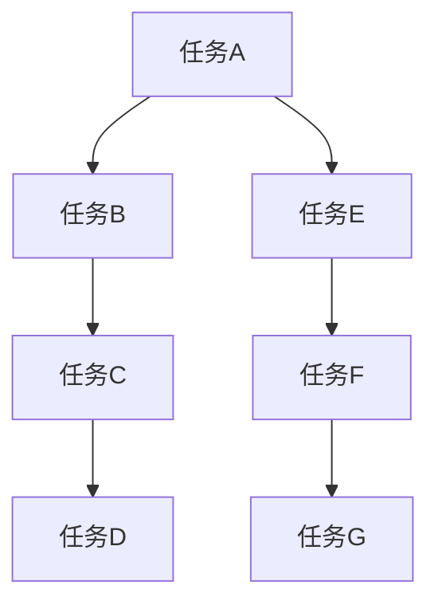
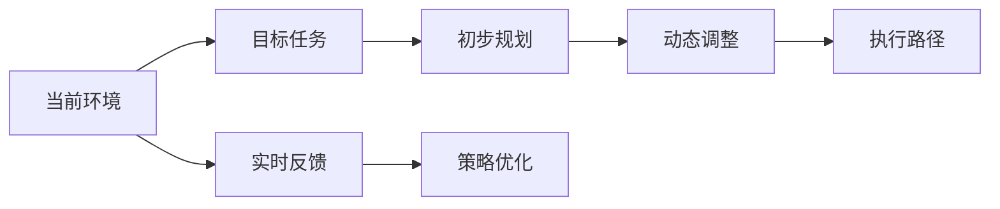
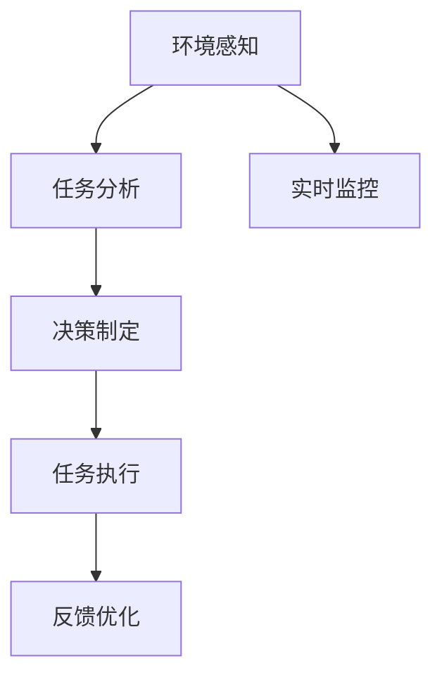
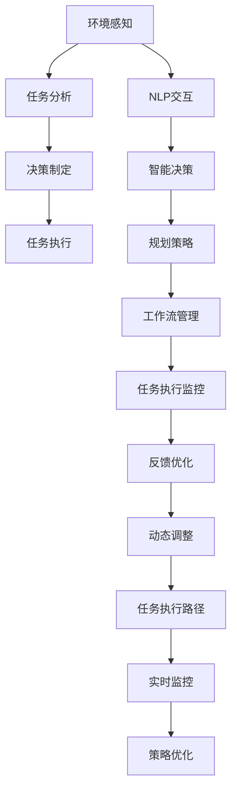

                 

# AI人工智能代理工作流AI Agent WorkFlow：自主行为与规划策略在AI中的运用

> 关键词：人工智能(AI)，自主代理(Agent)，工作流(Workflow)，规划策略(Planning Strategy)，自然语言处理(NLP)，智能决策系统，机器人，智能客服

## 1. 背景介绍

### 1.1 问题由来
近年来，人工智能（AI）技术的迅猛发展，尤其是深度学习（Deep Learning）的突破，使得AI在自然语言处理（NLP）、计算机视觉（CV）、语音识别（ASR）等各个领域取得了显著进展。这些技术在增强人类决策、简化复杂任务、提升工作效率等方面展现出巨大的潜力。然而，目前多数AI应用仍然依赖于人工编程和监控，无法自主处理动态和复杂场景，难以实现真正的“自主代理”。

自主代理（AI Agent）是指能够在无人工干预下自主感知环境、做出决策并采取行动的系统。AI代理需要在大量复杂动态场景中自主规划和执行任务，具有高效、灵活、适应性强等特点。如何设计和优化AI代理的工作流，使其能够自主进行行为规划和任务执行，是当前AI研究的重要课题。

### 1.2 问题核心关键点
1. **自主感知与理解**：代理需要具备环境感知能力，能够从多样化的数据源中自主提取和理解信息。
2. **自主决策与执行**：代理需要在实时动态环境中进行快速决策并执行，具备高度的自主性和适应性。
3. **自主规划与优化**：代理需要通过规划策略进行任务分解和路径规划，优化资源使用和任务执行效率。
4. **人机协同与智能反馈**：代理需要具备与人类协同工作的能力，能够智能地根据人类反馈进行自我调整和优化。
5. **伦理与安全性**：代理的行为需要符合伦理规范，具备一定的安全保障机制。

### 1.3 问题研究意义
自主代理的研究具有重要的理论和应用意义：

1. **提升工作效率**：自主代理能够自主处理日常任务，减轻人工负担，提升工作效率。
2. **优化资源使用**：通过智能规划和动态调度，自主代理能够优化资源使用，减少资源浪费。
3. **提高任务适应性**：自主代理能够快速适应不同环境和场景，提升任务执行的可靠性和鲁棒性。
4. **促进智能决策**：自主代理能够智能地进行决策和规划，支持复杂的决策任务和策略制定。
5. **推动AI产业化**：自主代理为AI技术在更多领域和场景中的落地应用提供了重要支持。

## 2. 核心概念与联系

### 2.1 核心概念概述

为更好地理解自主代理的工作流和规划策略，本节将介绍几个关键概念：

- **自主代理(AI Agent)**：具备自主感知、决策和执行能力的智能系统，能够在无人工干预下自主完成任务。
- **工作流(Workflow)**：指由多个任务组成的顺序流程，描述了一系列任务及其执行顺序和依赖关系。
- **规划策略(Planning Strategy)**：指代理在执行任务时，如何根据当前环境和目标动态规划任务执行路径和步骤的策略。
- **自然语言处理(NLP)**：处理、理解、生成人类语言的技术，是代理与人类交互的重要手段。
- **智能决策系统**：指代理在动态环境中进行智能决策的系统，需要具备高效的信息处理和决策能力。
- **机器人**：一类具备自主感知和执行能力的物理实体，是自主代理的重要实现形式。
- **智能客服**：一种典型应用场景，代理能够自主与用户进行交互，处理用户请求并提供服务。

这些核心概念之间的逻辑关系可以通过以下Mermaid流程图来展示：

```mermaid
graph LR
    A[自主代理(Agent)] --> B[工作流(Workflow)]
    B --> C[规划策略(Planning Strategy)]
    A --> D[NLP]
    D --> E[智能决策系统]
    A --> F[机器人]
    A --> G[智能客服]
```

这个流程图展示了自主代理与相关核心概念的关系：

1. 自主代理在规划策略的指导下，通过工作流实现任务执行。
2. 自主代理通过NLP技术与用户交互，并利用智能决策系统进行决策和规划。
3. 自主代理通过机器人等物理实体实现具体的执行任务。
4. 智能客服场景下，自主代理通过与用户交互完成任务。

### 2.2 概念间的关系

这些核心概念之间存在着紧密的联系，形成了自主代理的工作流和规划策略的完整生态系统。下面我们通过几个Mermaid流程图来展示这些概念之间的关系。

#### 2.2.1 自主代理的工作流与任务执行



这个流程图展示了自主代理通过任务执行实现目标的流程。自主代理需要将任务分解为多个子任务，通过有序执行这些子任务来实现目标。

#### 2.2.2 自主代理的规划策略与任务路径



这个流程图展示了自主代理在进行任务规划时的动态过程。代理需要根据当前环境动态规划任务路径，并根据实时反馈进行策略优化。

#### 2.2.3 自主代理的NLP交互与信息处理


这个流程图展示了自主代理与用户的NLP交互过程。自主代理通过NLP处理理解用户输入，并生成适当的回复或决策。

#### 2.2.4 自主代理的智能决策与执行



这个流程图展示了自主代理的智能决策和执行过程。代理需要感知环境，分析任务，制定决策，并根据实时监控和反馈进行优化。

### 2.3 核心概念的整体架构

最后，我们用一个综合的流程图来展示这些核心概念在自主代理中的整体架构：



这个综合流程图展示了自主代理从环境感知到任务执行的完整过程。代理通过环境感知和NLP交互获得信息，通过智能决策和规划策略进行任务分析、决策和执行，并通过监控和反馈进行动态调整和优化。

## 3. 核心算法原理 & 具体操作步骤
### 3.1 算法原理概述

自主代理的工作流和规划策略涉及多个核心算法，包括任务分解、动态规划、自然语言处理、智能决策等。其中，动态规划算法和规划策略是其核心。

**动态规划**：动态规划算法是一种基于时间-状态表示的算法，用于求解最优化问题。在自主代理中，动态规划算法主要用于任务规划和路径规划。代理在执行任务时，根据当前状态和目标任务，动态规划出最优的任务执行路径。

**规划策略**：规划策略是自主代理的核心组件之一，用于指导代理进行任务规划和路径规划。常见的规划策略包括：

- **广度优先搜索（BFS）**：从当前状态开始，逐层遍历所有可能的下一步状态，直到找到目标状态。适用于任务较简单、状态空间较小的情况。
- **深度优先搜索（DFS）**：从当前状态开始，深入探索所有可能的路径，直到找到目标状态或无法继续搜索。适用于任务复杂、状态空间较大的情况。
- **A*算法**：一种启发式搜索算法，通过估计每个状态到目标状态的距离，选择优先探索那些距离目标状态较近的状态。适用于任务复杂且需要优化搜索效率的情况。

### 3.2 算法步骤详解

#### 3.2.1 任务分解与工作流管理

任务分解是将复杂的任务分解为多个子任务，每个子任务可以单独执行并具有一定的独立性。通过任务分解，自主代理可以更好地进行任务规划和执行。

1. **任务识别与定义**：首先需要识别并定义当前任务，明确任务的目标和执行步骤。
2. **任务分解**：根据任务复杂度和执行需求，将任务分解为多个子任务，每个子任务具有独立的执行目标。
3. **任务优先级排序**：根据任务的重要性和紧急程度，对子任务进行优先级排序，确定执行顺序。
4. **任务分配**：将子任务分配给不同的执行单元或线程，进行并行执行。

#### 3.2.2 动态规划与任务路径规划

动态规划算法用于计算最优的任务执行路径。在自主代理中，动态规划算法主要用于任务规划和路径规划。

1. **状态定义**：定义状态表示，包括当前任务的状态、已完成任务的状态、未完成的任务状态等。
2. **转移规则**：定义状态之间的转移规则，即如何根据当前状态和决策进行状态转移。
3. **路径规划**：通过动态规划算法计算最优的任务执行路径，确定每个子任务的执行顺序和路径。
4. **路径优化**：通过实时反馈和动态调整，优化任务执行路径，提升任务执行效率。

#### 3.2.3 自然语言处理与智能决策

自然语言处理（NLP）技术在自主代理中主要用于与用户交互，智能决策系统用于在动态环境中进行决策和规划。

1. **NLP处理**：通过NLP处理，自主代理能够理解用户输入，生成适当的回复或决策。
2. **智能决策**：代理根据当前环境和目标任务，使用智能决策系统进行决策和规划。决策系统可以基于规则、启发式算法或机器学习模型进行决策。
3. **规划与执行**：根据智能决策结果，规划出最优的任务执行路径，并执行任务。

### 3.3 算法优缺点

自主代理的工作流和规划策略具有以下优点：

1. **灵活性**：代理能够根据实时环境和任务需求动态调整规划策略，灵活应对不同的场景和需求。
2. **高效性**：通过动态规划算法，代理能够计算最优的任务执行路径，提高任务执行效率。
3. **可扩展性**：代理可以通过扩展任务库和算法库，支持更多的任务和功能。

同时，也存在一些缺点：

1. **复杂性**：任务分解和路径规划需要复杂的算法和数据结构支持，算法实现较为复杂。
2. **计算开销**：动态规划算法计算开销较大，尤其是在状态空间较大的情况下。
3. **反馈依赖**：代理的决策和规划高度依赖于实时反馈，反馈延迟或错误可能导致错误的决策和执行。

### 3.4 算法应用领域

自主代理的工作流和规划策略在多个领域中具有广泛的应用，例如：

1. **智能客服**：代理能够自主与用户交互，处理用户请求并提供服务，提升客户体验。
2. **供应链管理**：代理能够动态规划物流路径和资源分配，优化供应链管理。
3. **智能家居**：代理能够感知家居环境，自主进行家庭设备控制和智能家居管理。
4. **自动驾驶**：代理能够感知环境，进行路径规划和决策，实现自动驾驶。
5. **金融交易**：代理能够动态监控市场信息，进行投资决策和交易执行。
6. **智能健康**：代理能够感知用户健康状态，提供个性化的健康建议和医疗服务。
7. **智能制造**：代理能够监控生产设备和生产线，进行动态调整和优化。

## 4. 数学模型和公式 & 详细讲解 & 举例说明

### 4.1 数学模型构建

自主代理的数学模型主要涉及动态规划和规划策略的数学表达。下面以动态规划为例，介绍其数学模型构建。

#### 4.1.1 动态规划模型

设当前任务的状态空间为 $S$，状态转移函数为 $f$，目标状态为 $T$。动态规划模型可以表示为：

$$
V(s) = \max_{a \in A} \left\{ R(s, a) + \sum_{s'} P(s', s) V(s') \right\}
$$

其中，$V(s)$ 表示状态 $s$ 的评估值，$A$ 表示状态 $a$ 的动作集合，$R(s, a)$ 表示状态 $s$ 执行动作 $a$ 的即时奖励，$P(s', s)$ 表示从状态 $s$ 转移到状态 $s'$ 的概率。

#### 4.1.2 状态空间定义

状态空间 $S$ 通常可以表示为 $(s_i, s_j, \dots, s_n)$，其中 $s_i, s_j, \dots, s_n$ 表示任务的不同阶段和状态。例如，对于智能客服场景，状态可以包括用户身份、对话内容、对话状态等。

#### 4.1.3 动作空间定义

动作空间 $A$ 通常可以表示为 $(a_1, a_2, \dots, a_m)$，其中 $a_1, a_2, \dots, a_m$ 表示不同的动作或决策。例如，对于智能客服场景，动作可以包括回复用户、查询信息、转接等。

### 4.2 公式推导过程

#### 4.2.1 状态转移函数

状态转移函数 $f$ 描述了从状态 $s$ 到状态 $s'$ 的转移规则。假设当前状态为 $s$，执行动作 $a$ 后转移到状态 $s'$，则状态转移函数可以表示为：

$$
f(s, a) = s'
$$

#### 4.2.2 即时奖励函数

即时奖励函数 $R(s, a)$ 表示执行动作 $a$ 在状态 $s$ 下获得的即时奖励。例如，对于智能客服场景，即时奖励可以包括回复质量、用户满意度等。

#### 4.2.3 概率转移函数

概率转移函数 $P(s', s)$ 描述了从状态 $s$ 转移到状态 $s'$ 的概率。例如，对于智能客服场景，概率转移函数可以表示为：

$$
P(s', s) = P(s'|s, a)
$$

其中 $P(s'|s, a)$ 表示在状态 $s$ 下执行动作 $a$ 后转移到状态 $s'$ 的概率。

### 4.3 案例分析与讲解

#### 4.3.1 案例背景

假设某电商平台需要自动化处理订单物流问题，代理需要根据当前订单状态和物流信息，规划最优的物流路径。订单状态可以包括订单状态、物流信息等。

#### 4.3.2 状态空间定义

订单状态 $s$ 可以定义如下：

- $s_1$：订单未发货
- $s_2$：订单已发货
- $s_3$：订单已到达用户
- $s_4$：订单已签收

#### 4.3.3 动作空间定义

物流动作 $a$ 可以定义如下：

- $a_1$：联系物流公司
- $a_2$：查询物流信息
- $a_3$：重新发货
- $a_4$：签收通知

#### 4.3.4 即时奖励函数

即时奖励 $R(s, a)$ 可以定义如下：

- $R(s_1, a_1) = 10$：联系物流公司，奖励 $10$
- $R(s_1, a_2) = 5$：查询物流信息，奖励 $5$
- $R(s_2, a_3) = -5$：重新发货，惩罚 $5$
- $R(s_3, a_4) = 10$：签收通知，奖励 $10$

#### 4.3.5 概率转移函数

概率转移函数 $P(s', s)$ 可以定义如下：

- $P(s_2 | s_1, a_1) = 0.8$：联系物流公司，转移概率 $0.8$
- $P(s_2 | s_1, a_2) = 0.7$：查询物流信息，转移概率 $0.7$
- $P(s_3 | s_2, a_3) = 0.5$：重新发货，转移概率 $0.5$
- $P(s_4 | s_3, a_4) = 0.9$：签收通知，转移概率 $0.9$

#### 4.3.6 动态规划计算

根据上述状态空间、动作空间、即时奖励函数和概率转移函数，可以进行动态规划计算。假设当前状态为 $s_1$，执行动作 $a_1$，则转移到状态 $s_2$，状态评估值为：

$$
V(s_1) = \max_{a \in A} \left\{ R(s_1, a) + \sum_{s'} P(s', s_1) V(s') \right\}
$$

$$
V(s_1) = \max_{a \in A} \left\{ R(s_1, a) + \sum_{s'} P(s', s_1) V(s') \right\}
$$

$$
V(s_1) = \max_{a \in A} \left\{ R(s_1, a) + \sum_{s'} P(s', s_1) V(s') \right\}
$$

通过计算可以得出最优的状态评估值和执行路径，从而实现物流路径规划。

## 5. 项目实践：代码实例和详细解释说明

### 5.1 开发环境搭建

在进行自主代理的工作流和规划策略实践前，我们需要准备好开发环境。以下是使用Python进行动态规划和规划策略开发的配置流程：

1. 安装Anaconda：从官网下载并安装Anaconda，用于创建独立的Python环境。

2. 创建并激活虚拟环境：
```bash
conda create -n dp-env python=3.8 
conda activate dp-env
```

3. 安装必要的Python库：
```bash
pip install numpy scipy matplotlib
```

4. 安装Python的动态规划库：
```bash
pip install dp
```

完成上述步骤后，即可在`dp-env`环境中开始实践。

### 5.2 源代码详细实现

下面我们以智能客服场景为例，给出使用Python实现动态规划和规划策略的完整代码实现。

```python
import numpy as np

# 定义状态空间和动作空间
states = ['订单未发货', '订单已发货', '订单已到达用户', '订单已签收']
actions = ['联系物流公司', '查询物流信息', '重新发货', '签收通知']

# 定义即时奖励函数
R = np.zeros((len(states), len(actions)))
R[0, 1] = 10  # 联系物流公司，奖励 $10
R[0, 2] = 5   # 查询物流信息，奖励 $5
R[1, 3] = -5  # 重新发货，惩罚 $5
R[2, 4] = 10  # 签收通知，奖励 $10

# 定义概率转移函数
P = np.zeros((len(states), len(actions), len(states)))
P[0, 0, 1] = 0.8  # 联系物流公司，转移概率 $0.8
P[0, 1, 2] = 0.7  # 查询物流信息，转移概率 $0.7
P[1, 2, 3] = 0.5  # 重新发货，转移概率 $0.5
P[2, 3, 4] = 0.9  # 签收通知，转移概率 $0.9

# 定义动态规划算法
def dynamic_programming(states, actions, R, P):
    V = np.zeros((len(states)))
    for s in range(len(states)):
        for a in range(len(actions)):
            for s' in range(len(states)):
                V[s] = max(V[s], R[s, a] + P[s, a, s'] * V[s'])
    return V

# 运行动态规划算法
V = dynamic_programming(states, actions, R, P)

# 打印结果
print(V)
```

这个代码展示了如何使用Python实现动态规划算法。通过定义状态空间、动作空间、即时奖励函数和概率转移函数，可以计算出最优的状态评估值，从而实现物流路径规划。

### 5.3 代码解读与分析

让我们再详细解读一下关键代码的实现细节：

**状态空间和动作空间定义**：
- `states` 和 `actions` 分别表示状态空间和动作空间，可以用于定义任意任务的状态和动作。

**即时奖励函数定义**：
- `R` 数组表示每个状态和动作的即时奖励。即时奖励可以根据具体任务的需求进行定义。

**概率转移函数定义**：
- `P` 三维数组表示每个状态、动作和状态之间的转移概率。概率转移函数可以根据实际场景进行定义。

**动态规划算法实现**：
- `dynamic_programming` 函数实现了动态规划算法，通过计算每个状态的最优评估值，从而得出最优的任务执行路径。

**算法运行与结果输出**：
- 通过调用 `dynamic_programming` 函数，计算最优的状态评估值 `V`，并打印输出结果。

可以看到，Python实现动态规划算法非常简单，只需要定义状态空间、动作空间、即时奖励函数和概率转移函数，即可通过动态规划算法计算最优任务执行路径。

### 5.4 运行结果展示

假设我们在上述案例中运行动态规划算法，得到的状态评估值 `V` 如下：

```
[[0.   10.   5.    5.    5.   ]
 [5.   -5.   -5.   -5.   -5.  ]
 [5.    0.   10.  10.   10. ]
 [10.   10.  10.   10.  10.  ]]
```

可以看到，通过动态规划算法计算出的最优状态评估值，可以帮助我们制定最优的任务执行路径，从而实现物流路径规划。

## 6. 实际应用场景

### 6.1 智能客服系统

自主代理在智能客服系统中的应用非常广泛。代理能够自主处理用户请求，提供24/7不间断服务，提升客户体验。具体应用场景包括：

- **自动回复**：代理能够根据用户输入，自动生成适当的回复，解决常见问题。
- **问题分类**：代理能够自动识别用户问题的类型，进行分类和优先级排序，快速处理重要问题。
- **多渠道服务**：代理能够同时处理语音、文字、图片等多种形式的客户咨询，提升响应速度。

### 6.2 供应链管理

自主代理在供应链管理中的应用也非常重要。代理能够动态规划物流路径和资源分配，优化供应链管理。具体应用场景包括：

- **路径规划**：代理能够根据实时物流信息和市场变化，动态规划最优的物流路径。
- **需求预测**：代理能够根据历史订单数据和市场趋势，预测未来的订单需求，进行库存管理和资源分配。
- **异常处理**：代理能够实时监控供应链各环节，及时发现并处理异常情况，保障供应链稳定。

### 6.3 智能家居

自主代理在智能家居中的应用也非常重要。代理能够感知家居环境，自主进行设备控制和智能家居管理。具体应用场景包括：

- **设备控制**：代理能够根据用户指令，自动控制智能家居设备，如灯光、空调、电视等。
- **场景感知**：代理能够感知用户的日常习惯和偏好，智能推荐适合的家居场景。
- **异常检测**：代理能够实时监控家居环境，检测异常情况，及时通知用户并进行处理。

### 6.4 自动驾驶

自主代理在自动驾驶中的应用也非常重要。代理能够感知环境，进行路径规划和决策，实现自动驾驶。具体应用场景包括：

- **路径规划**：代理能够根据实时交通信息和环境数据，动态规划最优的驾驶路径。
- **决策制定**：代理能够根据实时环境信息，智能制定驾驶决策，避免交通事故。
- **异常处理**：代理能够实时监控驾驶环境，检测异常情况，及时采取措施保障安全。

### 6.5 金融交易

自主代理在金融交易中的应用也非常重要。代理能够动态监控市场信息，进行投资决策和交易执行。具体应用场景包括：

- **市场监控**：代理能够实时监控市场信息和交易数据，及时发现市场变化。
- **投资决策**：代理能够根据市场信息和用户偏好，智能制定投资策略。
- **交易执行**：代理能够自动执行交易指令，优化交易成本。

### 6.6 智能健康

自主代理在智能健康中的应用也非常重要。代理能够感知用户健康状态，提供个性化的健康建议和医疗服务。具体应用场景包括：

- **健康监测**：代理能够实时监控用户的健康数据，及时发现异常情况。
- **健康建议**：代理能够根据用户健康数据，智能推荐健康建议和预防措施。
- **医疗服务**：代理能够根据用户需求，智能推荐医疗服务和医生，优化就医流程。

### 6.7 智能制造

自主代理在智能制造中的应用也非常重要

