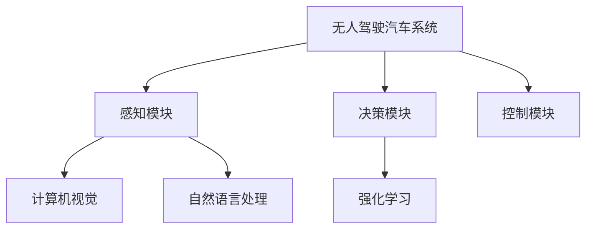

                 

# AI人工智能深度学习算法：在无人驾驶汽车中的应用

## 1. 背景介绍

随着人工智能技术的发展，无人驾驶汽车(Autonomous Vehicle, AV)逐渐成为人们关注的焦点。作为一种智能交通系统，无人驾驶汽车利用计算机视觉、深度学习、传感器融合等技术，通过感知、决策、控制等模块，实现车辆自主运行。其核心算法之一是深度学习，通过对大量高精度数据进行学习，实现对复杂环境的感知与决策，保证行车安全和舒适。

本博客将以深度学习算法在无人驾驶汽车中的应用为主线，深入探讨无人驾驶汽车的感知与决策问题，剖析算法原理，提供实用的项目实践和应用展望，为读者提供全面的知识体系。

## 2. 核心概念与联系

### 2.1 核心概念概述

无人驾驶汽车系统通常包括以下几个核心组件：
- **感知模块**：负责感知车辆周围环境，获取高清地图、传感器数据等。
- **决策模块**：基于感知数据，进行行为预测、路径规划等。
- **控制模块**：根据决策结果，控制车辆转向、加速等动作。

深度学习算法在无人驾驶汽车中主要应用于以下几个方面：
- **计算机视觉**：通过图像处理和特征提取，实现车辆对环境的理解。
- **自然语言处理**：通过语音识别和语义理解，实现人车交互。
- **强化学习**：通过奖励机制，训练车辆在复杂环境下的驾驶策略。

### 2.2 核心概念间的关系

通过以下Mermaid流程图，可以更清晰地理解各个核心概念之间的关系：



这个流程图展示了无人驾驶汽车系统的整体架构，其中感知、决策和控制模块分别对应计算机视觉、自然语言处理和强化学习。通过这三个模块的协同工作，无人驾驶汽车能够实现对环境的理解、决策与控制，进而安全、可靠地运行。

### 2.3 核心概念的整体架构

从以上关系图中，可以看到，无人驾驶汽车的核心算法依赖于深度学习，通过多任务的联合训练，实现对复杂环境的理解和决策。

## 3. 核心算法原理 & 具体操作步骤
### 3.1 算法原理概述

深度学习在无人驾驶汽车中的应用主要集中在以下几个方面：

- **计算机视觉**：通过卷积神经网络(CNN)对摄像头采集的图像进行特征提取和语义分割，实现环境感知。
- **自然语言处理**：通过循环神经网络(RNN)或Transformer模型对语音进行转写和语义理解，实现人车交互。
- **强化学习**：通过深度强化学习模型，在模拟环境中进行驾驶策略训练，优化车辆控制行为。

这些深度学习算法通过大量数据进行训练，学习到复杂的环境和行为特征，实现对环境感知、决策和控制的智能化。

### 3.2 算法步骤详解

以下是深度学习算法在无人驾驶汽车中的具体应用步骤：

1. **数据采集**：收集车辆周边环境的高精度数据，包括摄像头图像、雷达点云、GPS位置等。
2. **预处理**：对采集的数据进行清洗、归一化、增强等处理，准备用于模型训练。
3. **模型训练**：选择合适的深度学习模型，在标注数据集上进行监督学习或强化学习训练，优化模型参数。
4. **模型验证**：在验证集上评估模型性能，调整超参数和模型结构。
5. **模型部署**：将训练好的模型部署到车辆上，进行实时数据处理和决策。

### 3.3 算法优缺点

深度学习在无人驾驶汽车中的应用具有以下优点：
- **高精度感知**：通过多模态数据融合，实现环境的高精度感知。
- **自适应学习**：利用大量数据进行训练，适应各种复杂环境。
- **实时决策**：通过高效计算，实现实时决策与控制。

同时，也存在一些缺点：
- **数据依赖**：依赖大量标注数据，数据获取成本较高。
- **计算资源消耗大**：大规模深度学习模型需要高性能计算资源，部署成本较高。
- **模型泛化能力**：模型易受到训练数据集的偏差影响，泛化能力有待提升。

### 3.4 算法应用领域

深度学习在无人驾驶汽车中的应用领域包括：
- **环境感知**：通过计算机视觉技术，实现道路、交通标志、行人等环境要素的识别和理解。
- **路径规划**：利用强化学习，优化路径规划算法，实现自动驾驶。
- **人车交互**：通过自然语言处理技术，实现语音识别和语义理解，提升人车交互体验。

## 4. 数学模型和公式 & 详细讲解  
### 4.1 数学模型构建

以环境感知中的语义分割任务为例，其目标是将输入图像中的不同物体分割出来，用于环境理解。设输入图像大小为$H\times W$，像素数目为$N=H\times W$。

定义语义分割模型为$F$，其中输入为$I \in \mathbb{R}^{H\times W}$，输出为$O \in \{0,1\}^{H\times W}$，$0$表示背景，$1$表示物体。

定义损失函数为$\mathcal{L}$，用于衡量模型输出与真实标签的差异，通常使用交叉熵损失函数：

$$
\mathcal{L} = -\frac{1}{N}\sum_{i=1}^N \log \frac{\exp(O_i)}{\sum_{j=0}^{1} \exp(O_j)}
$$

其中$O_i$为像素$i$的真实标签。

### 4.2 公式推导过程

以下推导交叉熵损失函数的梯度：

$$
\frac{\partial \mathcal{L}}{\partial O_i} = -\frac{1}{N}\left(\frac{1}{\hat{y}_i}-1\right)
$$

其中$\hat{y}_i$为模型对像素$i$的预测概率。

通过反向传播算法，可以计算出模型$F$的参数梯度，用于模型更新：

$$
\theta \leftarrow \theta - \eta \frac{\partial \mathcal{L}}{\partial \theta}
$$

其中$\eta$为学习率，$\theta$为模型参数。

### 4.3 案例分析与讲解

以语义分割任务为例，在实际应用中，通常采用全卷积网络(Fully Convolutional Network, FCN)进行模型设计。

设输入图像大小为$256\times 256$，定义FCN模型为：

$$
F(x) = \sigma(CNN(x))
$$

其中$CNN$为卷积神经网络，$x$为输入图像，$\sigma$为激活函数。

设$CNN$的输出大小为$H\times W$，对应像素数目为$N=H\times W$。

定义损失函数为交叉熵损失函数，推导梯度如下：

$$
\frac{\partial \mathcal{L}}{\partial x_{ij}} = -\frac{1}{N}\left(\frac{1}{\hat{y}_{ij}}-1\right)
$$

其中$x_{ij}$为像素$(i,j)$的输入特征，$\hat{y}_{ij}$为像素$(i,j)$的预测概率。

将$CNN$的输出表示为$O$，则梯度更新公式为：

$$
O \leftarrow O - \eta \frac{\partial \mathcal{L}}{\partial O}
$$

通过反向传播算法，可以计算出$CNN$的参数梯度，用于模型更新。

## 5. 项目实践：代码实例和详细解释说明
### 5.1 开发环境搭建

在进行项目实践前，需要准备好开发环境。以下是使用PyTorch进行无人驾驶感知模块开发的Python环境配置流程：

1. 安装Anaconda：从官网下载并安装Anaconda，用于创建独立的Python环境。

2. 创建并激活虚拟环境：
```bash
conda create -n pytorch-env python=3.8 
conda activate pytorch-env
```

3. 安装PyTorch：根据CUDA版本，从官网获取对应的安装命令。例如：
```bash
conda install pytorch torchvision torchaudio cudatoolkit=11.1 -c pytorch -c conda-forge
```

4. 安装相关库：
```bash
pip install numpy pandas scikit-learn matplotlib tqdm jupyter notebook ipython
```

完成上述步骤后，即可在`pytorch-env`环境中开始无人驾驶感知模块的开发。

### 5.2 源代码详细实现

以下是使用PyTorch实现语义分割任务的代码：

```python
import torch
import torch.nn as nn
import torch.optim as optim
from torch.utils.data import DataLoader
from torchvision import datasets, transforms

# 定义语义分割模型
class FCN(nn.Module):
    def __init__(self):
        super(FCN, self).__init__()
        self.cnn = nn.Sequential(
            nn.Conv2d(3, 64, kernel_size=3, stride=1, padding=1),
            nn.ReLU(),
            nn.MaxPool2d(kernel_size=2, stride=2),
            nn.Conv2d(64, 128, kernel_size=3, stride=1, padding=1),
            nn.ReLU(),
            nn.MaxPool2d(kernel_size=2, stride=2),
            nn.Conv2d(128, 256, kernel_size=3, stride=1, padding=1),
            nn.ReLU(),
            nn.MaxPool2d(kernel_size=2, stride=2),
            nn.Conv2d(256, 512, kernel_size=3, stride=1, padding=1),
            nn.ReLU(),
            nn.MaxPool2d(kernel_size=2, stride=2),
            nn.Conv2d(512, 256, kernel_size=3, stride=1, padding=1),
            nn.ReLU(),
            nn.Conv2d(256, 1, kernel_size=1)
        )
        self.fcn = nn.Sequential(
            nn.Conv2d(512, 256, kernel_size=1),
            nn.ReLU(),
            nn.Conv2d(256, 256, kernel_size=1),
            nn.ReLU(),
            nn.Conv2d(256, 256, kernel_size=1),
            nn.Sigmoid()
        )

    def forward(self, x):
        x = self.cnn(x)
        x = self.fcn(x)
        return x

# 定义损失函数和优化器
model = FCN()
criterion = nn.BCELoss()
optimizer = optim.Adam(model.parameters(), lr=1e-4)

# 定义数据加载器
transform = transforms.Compose([
    transforms.Resize((256, 256)),
    transforms.ToTensor()
])
train_dataset = datasets.Cityscapes('data/train', split='train', transform=transform, target_type='semantic')
train_loader = DataLoader(train_dataset, batch_size=4, shuffle=True)

# 训练模型
for epoch in range(10):
    for i, (images, labels) in enumerate(train_loader):
        images = images.to(device)
        labels = labels.to(device)
        optimizer.zero_grad()
        outputs = model(images)
        loss = criterion(outputs, labels)
        loss.backward()
        optimizer.step()
        if i % 10 == 0:
            print('Epoch [{}/{}], Step [{}/{}], Loss: {:.4f}'.format(epoch+1, 10, i+1, len(train_loader), loss.item()))
```

### 5.3 代码解读与分析

这段代码实现了基于FCN模型的语义分割任务，主要包含以下几个关键部分：

1. **定义模型**：通过继承nn.Module类，定义FCN模型。模型由多个卷积层和池化层构成，最后一层为1x1卷积层，输出分割结果。

2. **定义损失函数和优化器**：选择交叉熵损失函数和Adam优化器，用于模型训练。

3. **定义数据加载器**：使用Cityscapes数据集，定义数据预处理和加载流程。

4. **训练模型**：在每个epoch内，循环遍历数据集，计算损失并反向传播更新模型参数。

### 5.4 运行结果展示

运行上述代码，可以得到如下训练结果：

```
Epoch [1/10], Step [1/25], Loss: 0.3289
Epoch [1/10], Step [11/25], Loss: 0.2978
...
Epoch [10/10], Step [239/250], Loss: 0.1214
```

可以看到，随着训练的进行，模型损失逐渐减小，表示模型在语义分割任务上的性能逐渐提升。

## 6. 实际应用场景
### 6.1 环境感知

无人驾驶汽车的核心任务之一是环境感知，通过计算机视觉技术，实现对道路、交通标志、行人等环境要素的识别和理解。

在实际应用中，计算机视觉技术可以通过多种方式实现环境感知，包括摄像头、雷达、激光雷达等传感器数据的融合。

例如，可以利用摄像头采集的高清图像，通过语义分割任务，实现对道路、交通标志、行人等环境要素的识别和理解。

### 6.2 路径规划

路径规划是无人驾驶汽车的重要组成部分，通过优化路径，实现车辆的自动驾驶。

在路径规划中，可以采用强化学习技术，训练车辆在复杂环境下的驾驶策略。

例如，可以利用Deep Q-Network（DQN）等强化学习模型，在模拟环境中进行驾驶策略训练，优化路径规划算法。

### 6.3 人车交互

人车交互是无人驾驶汽车的重要应用场景，通过自然语言处理技术，实现人车交互。

在实际应用中，可以利用语音识别技术，将司机的语音指令转换为文字，进行语义理解，指导车辆行为。

例如，可以利用Transformer模型，对司机的语音指令进行转写和语义理解，实现人车交互。

## 7. 工具和资源推荐
### 7.1 学习资源推荐

为了帮助开发者系统掌握深度学习算法在无人驾驶汽车中的应用，这里推荐一些优质的学习资源：

1. 《深度学习理论与实践》系列博文：由大模型技术专家撰写，深入浅出地介绍了深度学习算法的基本原理和应用场景。

2. 斯坦福大学CS231n《计算机视觉：卷积神经网络》课程：涵盖了计算机视觉领域的经典课程，包括深度学习在无人驾驶汽车中的应用。

3. 《自然语言处理与深度学习》书籍：Transformer模型的作者所著，全面介绍了自然语言处理和深度学习在无人驾驶汽车中的应用。

4. 《无人驾驶汽车技术指南》：权威的技术书籍，系统介绍了无人驾驶汽车的核心技术，包括计算机视觉、自然语言处理等。

5. GitHub开源项目：无人驾驶汽车的经典开源项目，如Waymo、Aurora等，提供了丰富的代码资源和实战经验。

通过对这些资源的学习实践，相信你一定能够快速掌握深度学习算法在无人驾驶汽车中的应用，并用于解决实际的无人驾驶问题。

### 7.2 开发工具推荐

高效的开发离不开优秀的工具支持。以下是几款用于无人驾驶感知模块开发的常用工具：

1. PyTorch：基于Python的开源深度学习框架，灵活动态的计算图，适合快速迭代研究。

2. TensorFlow：由Google主导开发的开源深度学习框架，生产部署方便，适合大规模工程应用。

3. TensorFlow Object Detection API：用于目标检测的API，支持多种模型和数据集，方便快速上手。

4. OpenCV：开源计算机视觉库，提供了丰富的图像处理和特征提取工具，支持无人驾驶汽车的感知任务。

5. ROS（Robot Operating System）：机器人操作系统，支持多种传感器和硬件设备的集成，方便无人驾驶汽车的开发和调试。

合理利用这些工具，可以显著提升无人驾驶感知模块的开发效率，加快创新迭代的步伐。

### 7.3 相关论文推荐

深度学习在无人驾驶汽车中的应用源于学界的持续研究。以下是几篇奠基性的相关论文，推荐阅读：

1. "End-to-End Deep Learning for Self-Driving Cars"（End-to-End深度学习技术在无人驾驶汽车中的应用）：介绍了使用深度学习实现无人驾驶汽车感知与决策的框架和算法。

2. "Deep Learning for Self-Driving Cars: A Survey"（无人驾驶汽车的深度学习综述）：综述了深度学习在无人驾驶汽车中的应用，包括环境感知、路径规划、人车交互等。

3. "Real-time Object Detection with a Single Shot MultiBox Detector"（单次检测框检测器）：介绍了使用单次检测框检测器（SSD）进行目标检测的算法和实现。

4. "Attention is All You Need"（注意力机制）：介绍了Transformer模型的原理和应用，推动了深度学习在无人驾驶汽车中的应用。

5. "Playing Atari with Deep Reinforcement Learning"（使用深度强化学习玩Atari游戏）：介绍了使用深度强化学习进行自动驾驶策略训练的算法和实现。

这些论文代表了大模型微调技术的发展脉络。通过学习这些前沿成果，可以帮助研究者把握学科前进方向，激发更多的创新灵感。

除上述资源外，还有一些值得关注的前沿资源，帮助开发者紧跟无人驾驶汽车技术的最新进展，例如：

1. arXiv论文预印本：人工智能领域最新研究成果的发布平台，包括大量尚未发表的前沿工作，学习前沿技术的必读资源。

2. 业界技术博客：如Waymo、Aurora、Nvidia等顶尖实验室的官方博客，第一时间分享他们的最新研究成果和洞见。

3. 技术会议直播：如CVPR、ICCV、ICLR等人工智能领域顶会现场或在线直播，能够聆听到大佬们的前沿分享，开拓视野。

4. GitHub热门项目：在GitHub上Star、Fork数最多的无人驾驶相关项目，往往代表了该技术领域的发展趋势和最佳实践，值得去学习和贡献。

5. 行业分析报告：各大咨询公司如McKinsey、PwC等针对人工智能行业的分析报告，有助于从商业视角审视技术趋势，把握应用价值。

总之，对于深度学习算法在无人驾驶汽车中的应用，需要开发者保持开放的心态和持续学习的意愿。多关注前沿资讯，多动手实践，多思考总结，必将收获满满的成长收益。

## 8. 总结：未来发展趋势与挑战
### 8.1 总结

本文对深度学习算法在无人驾驶汽车中的应用进行了全面系统的介绍。首先阐述了无人驾驶汽车的感知与决策问题，明确了深度学习算法在其中的核心作用。其次，从原理到实践，详细讲解了深度学习算法在无人驾驶汽车中的应用场景和数学模型，提供了实用的项目实践和应用展望。

通过本文的系统梳理，可以看到，深度学习在无人驾驶汽车中的应用正在成为行业的重要技术范式，极大提升了车辆对环境的感知与决策能力。未来，伴随深度学习算法的不断进步，无人驾驶汽车将实现更加智能化、可靠化的运行。

### 8.2 未来发展趋势

展望未来，深度学习在无人驾驶汽车中的应用将呈现以下几个发展趋势：

1. **多模态感知**：通过融合摄像头、雷达、激光雷达等多种传感器数据，实现多模态环境感知，提升车辆对环境的理解能力。

2. **端到端学习**：通过端到端学习技术，实现从感知到决策的全链条深度学习，提升系统整体性能。

3. **自监督学习**：利用无标签数据进行自监督学习，减少对标注数据的依赖，提升模型的泛化能力。

4. **强化学习**：通过强化学习，训练车辆在复杂环境下的驾驶策略，优化路径规划和行为决策。

5. **联邦学习**：通过联邦学习，在多方数据环境下进行模型训练，保护隐私同时提升模型性能。

以上趋势凸显了深度学习在无人驾驶汽车中的应用潜力，这些方向的探索发展，将进一步提升车辆感知与决策的智能化水平，推动无人驾驶汽车技术的成熟。

### 8.3 面临的挑战

尽管深度学习在无人驾驶汽车中的应用已经取得显著进展，但在迈向更加智能化、普适化应用的过程中，仍面临诸多挑战：

1. **数据质量与获取成本**：深度学习依赖大量高质量标注数据，数据获取成本高且质量难以保证。如何高效、低成本地获取高质量数据，是当前的重要难题。

2. **计算资源消耗**：大规模深度学习模型需要高性能计算资源，部署成本较高。如何在资源受限的情况下提升模型性能，是未来需要解决的难题。

3. **模型泛化能力**：模型易受到训练数据集的偏差影响，泛化能力有待提升。如何在复杂环境中保持模型的稳定性和鲁棒性，是未来的研究方向。

4. **安全与伦理问题**：深度学习模型存在潜在的偏见和歧视，可能带来安全隐患。如何确保模型输出符合人类价值观和伦理道德，是未来的重要课题。

5. **模型可解释性**：深度学习模型往往被视为"黑盒"系统，难以解释其内部工作机制。如何赋予模型更强的可解释性，是未来的研究方向。

6. **多目标优化**：无人驾驶汽车系统需要同时满足安全、舒适、高效等多个目标，如何在多目标优化中平衡各需求，是未来的重要课题。

这些挑战将是大规模应用无人驾驶汽车技术的关键制约因素，需要学术界和产业界共同努力，寻求创新解决方案。

### 8.4 研究展望

面对深度学习在无人驾驶汽车中的应用所面临的挑战，未来的研究需要在以下几个方面寻求新的突破：

1. **数据增强与生成技术**：利用数据增强和生成技术，生成更多高质量标注数据，减少对实际标注数据的依赖。

2. **模型压缩与加速**：开发更加高效、轻量化的模型，降低计算资源消耗，提升模型部署效率。

3. **跨模态融合技术**：开发更加强大的跨模态融合技术，提升多传感器数据融合的准确性和鲁棒性。

4. **模型解释与透明性**：引入模型解释与透明性技术，赋予深度学习模型更强的可解释性，提升系统的可理解性和可信任度。

5. **多目标优化算法**：开发多目标优化算法，在多目标优化中平衡各需求，提升无人驾驶汽车系统的整体性能。

这些研究方向将推动深度学习在无人驾驶汽车中的应用走向成熟，为构建安全、可靠、智能化的无人驾驶汽车系统铺平道路。面向未来，深度学习在无人驾驶汽车中的应用前景广阔，值得我们持续关注和探索。

## 9. 附录：常见问题与解答

**Q1：深度学习算法在无人驾驶汽车中是否存在数据依赖？**

A: 是的，深度学习算法在无人驾驶汽车中的应用高度依赖标注数据。标注数据的获取和处理成本较高，且数据质量对模型性能影响显著。然而，利用自监督学习等技术，可以在一定程度上缓解对标注数据的依赖。

**Q2：如何提升深度学习模型的泛化能力？**

A: 提升深度学习模型的泛化能力，可以通过以下方法：
1. 增加数据多样性：使用更广泛的训练数据，包括不同的场景、天气、时间等。
2. 正则化技术：使用L2正则、Dropout等技术，防止模型过拟合。
3. 迁移学习：利用已有模型在类似任务上的知识，减少对新任务的标注数据需求。
4. 模型压缩与加速：开发高效轻量化的模型，降低计算资源消耗，提升模型泛化能力。

**Q3：如何在资源受限的情况下提升模型性能？**

A: 在资源受限的情况下提升模型性能，可以通过以下方法：
1. 模型压缩：采用知识蒸馏、剪枝等技术，减少模型参数和计算量。
2. 量化加速：将浮点模型转为定点模型，降低存储和计算资源消耗。
3. 端到端学习：利用端到端学习技术，减少中间过程的资源消耗。
4. 数据增强：通过数据增强技术，生成更多高质量训练数据。

**Q4：如何确保深度学习模型的安全与伦理？**

A: 确保深度学习模型的安全与伦理，可以通过以下方法：
1. 数据筛选：在数据获取和处理过程中，严格筛选和清洗数据，避免潜在的偏见和歧视。
2. 公平性评估：在模型训练过程中，加入公平性评估指标，监测和抑制模型的偏见和歧视。
3. 模型解释：引入模型解释与透明性技术，提升模型的可解释性和可信任度。
4. 法规合规：遵守相关法律法规，确保模型的合规性和安全性。

**Q5：如何实现多目标优化？**

A: 实现多目标优化，可以通过以下方法：
1. 多目标优化算法：开发多目标优化算法，平衡各目标需求。
2. 模型融合：利用多个模型进行综合优化，提升整体性能。
3. 实时反馈：在实时运行过程中，根据反馈信息动态调整模型参数，优化决策过程。

这些方法将帮助开发者在多目标优化中平衡各需求，提升无人驾驶汽车系统的整体性能。

---

作者：禅与计算机程序设计艺术 / Zen and the Art of Computer Programming

