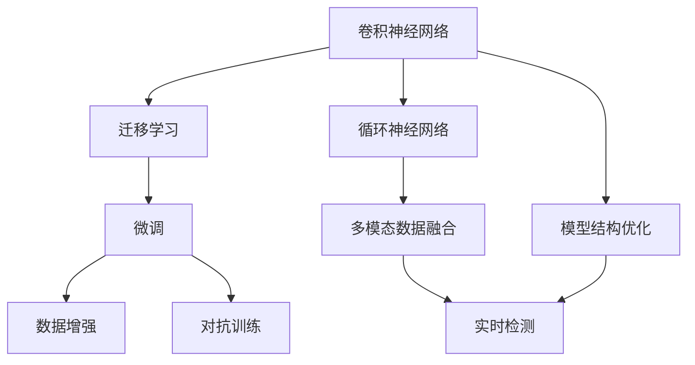
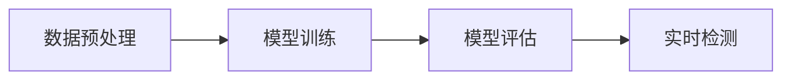
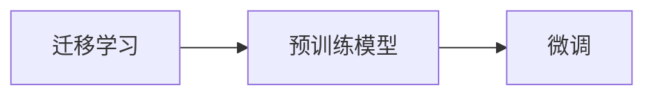
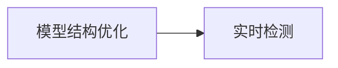
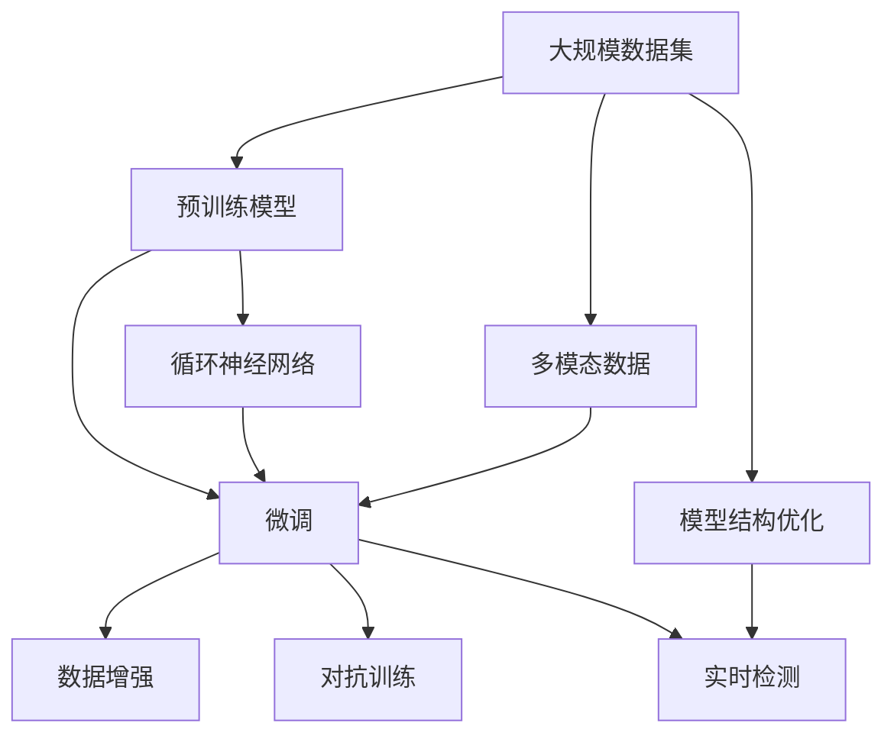

                 

## 1. 背景介绍

### 1.1 问题由来
随着人工智能(AI)技术的快速发展，深度学习算法在各个领域的应用日益广泛。在缺陷检测这一特定领域，深度学习算法展现出了强大的潜力和优势。与传统的视觉检查和手动识别方法相比，深度学习算法能够实现更高的检测精度、更快的处理速度以及更灵活的适应能力。特别是近年来，深度学习在图像、视频等视觉数据的处理方面取得了显著成果，广泛应用于制造、医疗、汽车、工业等领域，极大地提高了生产效率和产品质量。

### 1.2 问题核心关键点
深度学习算法在缺陷检测中的应用，主要依赖于其强大的特征提取能力和丰富的模型结构。具体来说，这些关键点包括：
1. 卷积神经网络（CNN）和循环神经网络（RNN）：这些网络结构在图像和视频数据的处理上表现出色，能够有效地提取局部特征，捕捉全局模式。
2. 迁移学习和微调：通过在大规模数据集上预训练模型，并在特定任务上进行微调，可以实现高效的模型迁移，减少数据标注成本，提高检测精度。
3. 数据增强和对抗训练：通过增强训练数据和引入对抗样本，可以提升模型的鲁棒性和泛化能力。
4. 多模态数据融合：将不同模态的数据（如视觉、声音、文本等）结合，可以提高检测的全面性和准确性。
5. 实时检测和预测：通过优化模型结构和算法，可以实现实时检测和预测，满足工业场景的高实时性要求。

### 1.3 问题研究意义
深度学习算法在缺陷检测中的应用，对于提高产品质量、降低生产成本、提升安全性等方面具有重要意义：
1. 提高检测精度：通过深度学习算法，可以实现比传统方法更高的检测精度，减少误检和漏检。
2. 降低成本：深度学习算法可以自动化处理大量的数据，减少人力成本和时间成本。
3. 提升安全性：深度学习算法可以实时检测产品缺陷，及时发现并纠正问题，保障产品安全。
4. 加速技术应用：深度学习算法的高效性，使得其在工业场景中的应用更加可行和实用。
5. 推动行业创新：深度学习算法的多样性和灵活性，为缺陷检测提供了新的方法和工具，推动行业技术创新。

## 2. 核心概念与联系

### 2.1 核心概念概述

为更好地理解深度学习算法在缺陷检测中的应用，本节将介绍几个关键概念：

- **卷积神经网络（CNN）**：一种经典的深度学习网络结构，主要用于处理图像和视频数据，通过卷积层和池化层提取局部特征，捕捉全局模式。
- **循环神经网络（RNN）**：一种能够处理序列数据的神经网络结构，通过循环结构捕捉时间依赖关系，广泛应用于文本和音频数据的处理。
- **迁移学习**：利用在大规模数据集上预训练的模型，在新任务上进行微调，以提高检测精度和减少数据标注成本。
- **微调**：在迁移学习的基础上，对特定任务的标注数据进行微调，进一步优化模型性能。
- **数据增强**：通过对训练数据进行随机变换，增加数据多样性，提升模型鲁棒性。
- **对抗训练**：通过引入对抗样本，提高模型对抗攻击的能力，增强模型泛化能力。
- **多模态数据融合**：将不同模态的数据结合，提高检测的全面性和准确性。
- **实时检测**：通过优化模型结构和算法，实现实时检测和预测，满足工业场景的高实时性要求。

这些概念之间的逻辑关系可以通过以下Mermaid流程图来展示：



这个流程图展示了大语言模型微调过程中各个概念的关系和作用：

1. 卷积神经网络和循环神经网络是处理图像和视频数据的核心结构。
2. 迁移学习和微调是提高模型泛化能力的关键技术。
3. 数据增强和对抗训练可以提升模型的鲁棒性和泛化能力。
4. 多模态数据融合可以提高检测的全面性和准确性。
5. 实时检测和模型结构优化满足了工业场景的高实时性要求。

### 2.2 概念间的关系

这些核心概念之间存在着紧密的联系，形成了深度学习算法在缺陷检测中的应用框架。下面我们通过几个Mermaid流程图来展示这些概念之间的关系。

#### 2.2.1 深度学习算法的应用流程



这个流程图展示了深度学习算法在缺陷检测中的应用流程。数据预处理是关键第一步，模型训练是在大规模数据集上进行预训练，模型评估是在特定任务上进行的微调，而实时检测是实际应用中的关键环节。

#### 2.2.2 迁移学习与微调的关系



这个流程图展示了迁移学习与微调之间的关系。迁移学习是在大规模数据集上预训练模型，而微调是在特定任务上进行优化，以提高检测精度和减少数据标注成本。

#### 2.2.3 实时检测与模型结构优化



这个流程图展示了模型结构优化与实时检测之间的关系。模型结构优化是提升实时检测性能的关键步骤，通过优化模型结构和算法，可以实现更高实时性的检测。

### 2.3 核心概念的整体架构

最后，我们用一个综合的流程图来展示这些核心概念在大语言模型微调过程中的整体架构：



这个综合流程图展示了从预训练到微调，再到实时检测的完整过程。大规模数据集上的预训练是基础，通过迁移学习和微调，模型在特定任务上不断优化。多模态数据的融合和模型结构优化，提升了实时检测的性能和鲁棒性。通过这个整体架构，我们可以更清晰地理解深度学习算法在缺陷检测中的应用流程和关键步骤。

## 3. 核心算法原理 & 具体操作步骤
### 3.1 算法原理概述

深度学习算法在缺陷检测中的应用，主要是通过卷积神经网络（CNN）和循环神经网络（RNN）来实现的。这两种网络结构分别适用于图像和序列数据的处理，能够有效地提取局部特征和全局模式，捕捉数据中的潜在缺陷。

具体来说，CNN通过卷积层和池化层对图像数据进行特征提取，通过多层池化层和非线性激活函数，提取出更抽象的特征表示。RNN通过循环结构对序列数据进行处理，捕捉时间依赖关系，提取出更有用的特征表示。

### 3.2 算法步骤详解

深度学习算法在缺陷检测中的应用步骤如下：

**Step 1: 数据预处理**

数据预处理是深度学习应用中的关键一步，主要包括数据增强、归一化和数据分割等操作。

1. **数据增强**：通过对原始数据进行随机变换，如旋转、平移、缩放、翻转等，增加数据多样性，提高模型鲁棒性。例如，在图像处理中，可以通过ImageNet数据集生成大量的数据增强样本。
2. **归一化**：将数据标准化到一定的范围内，如0到1之间，可以加速模型收敛，提高检测精度。例如，在图像处理中，可以使用Z-score归一化。
3. **数据分割**：将大规模数据集分割成多个小批次进行训练，可以提高模型训练效率。例如，在图像处理中，可以使用TensorFlow或PyTorch等框架进行数据分割。

**Step 2: 模型训练**

模型训练是在大规模数据集上进行预训练，利用CNN或RNN网络结构，提取出数据中的特征表示。

1. **选择合适的模型结构**：根据数据类型和任务需求，选择合适的模型结构。例如，在图像处理中，可以使用ResNet、Inception等经典的CNN结构。
2. **设定训练参数**：设置合适的学习率、批大小、迭代轮数等训练参数，以确保模型收敛。例如，在图像处理中，可以使用Adam或SGD优化器，设置学习率为0.001。
3. **训练模型**：通过反向传播算法，更新模型参数，最小化损失函数。例如，在图像处理中，可以使用交叉熵损失函数，计算模型预测值与真实标签之间的差异。

**Step 3: 模型评估**

模型评估是在特定任务上进行微调，利用标注数据进行模型评估，调整模型参数，优化模型性能。

1. **选择评估指标**：根据任务需求，选择合适的评估指标，如准确率、召回率、F1分数等。例如，在图像处理中，可以使用IoU（Intersection over Union）作为评估指标。
2. **微调模型**：利用标注数据进行微调，调整模型参数，提高检测精度。例如，在图像处理中，可以使用迁移学习，在大规模数据集上进行预训练，然后在特定任务上进行微调。
3. **模型优化**：通过正则化、Dropout等技术，防止过拟合，提高模型泛化能力。例如，在图像处理中，可以使用L2正则化、Dropout等技术。

**Step 4: 实时检测**

实时检测是深度学习算法在缺陷检测中的最终应用，利用优化后的模型进行实时检测和预测。

1. **优化模型结构**：通过优化模型结构和算法，提高实时检测性能。例如，在图像处理中，可以使用卷积神经网络进行特征提取，使用SVM进行分类。
2. **实时数据流**：通过优化数据流，提高实时检测效率。例如，在图像处理中，可以使用OpenCV等框架进行实时数据处理。
3. **检测结果反馈**：通过检测结果反馈，及时发现并纠正问题，提高检测精度。例如，在图像处理中，可以使用YOLO、Faster R-CNN等实时检测算法。

### 3.3 算法优缺点

深度学习算法在缺陷检测中的应用具有以下优点：
1. **高效性**：深度学习算法能够自动化处理大量的数据，减少人力成本和时间成本。
2. **高精度**：深度学习算法能够实现比传统方法更高的检测精度，减少误检和漏检。
3. **鲁棒性**：通过数据增强和对抗训练，深度学习算法具有较强的鲁棒性，能够适应不同场景的检测需求。
4. **灵活性**：深度学习算法具有较强的灵活性，能够适应不同的检测任务和数据类型。

同时，深度学习算法在缺陷检测中也存在以下缺点：
1. **数据标注成本高**：深度学习算法需要大量的标注数据进行训练，数据标注成本较高。
2. **模型复杂度高**：深度学习算法模型结构复杂，需要大量的计算资源进行训练和推理。
3. **可解释性差**：深度学习算法的黑盒特性，使得其决策过程难以解释和调试。

### 3.4 算法应用领域

深度学习算法在缺陷检测中的应用领域广泛，包括但不限于：

- **工业检测**：在制造业中，深度学习算法可以用于检测产品质量缺陷，如裂纹、变形、腐蚀等。
- **医疗检测**：在医疗领域，深度学习算法可以用于检测医学图像中的异常，如肿瘤、病灶等。
- **汽车检测**：在汽车领域，深度学习算法可以用于检测车辆零部件的损坏，如制动器、轮胎等。
- **航空检测**：在航空领域，深度学习算法可以用于检测飞机零部件的损伤，如叶片、连接器等。
- **军事检测**：在军事领域，深度学习算法可以用于检测武器装备和器材的缺陷，如坦克、步枪等。
- **农业检测**：在农业领域，深度学习算法可以用于检测农作物的病虫害，如水稻、小麦等。

## 4. 数学模型和公式 & 详细讲解 & 举例说明

### 4.1 数学模型构建

深度学习算法在缺陷检测中的应用，主要依赖于卷积神经网络（CNN）和循环神经网络（RNN）。这些网络结构通过卷积层、池化层、循环结构等组件，提取数据中的特征表示。

以CNN为例，其基本结构包括卷积层、池化层、全连接层等组件。卷积层通过卷积核对输入数据进行特征提取，池化层通过池化操作降低特征维度，全连接层通过线性变换将特征映射到输出空间。

数学公式如下：

$$
\text{Convolution}(x, w) = \sum_{i=1}^{k} w_i * x_i
$$

其中，$x$为输入数据，$w$为卷积核，$*$为卷积运算。

### 4.2 公式推导过程

卷积神经网络（CNN）在缺陷检测中的应用，主要通过卷积层和池化层进行特征提取。以图像处理为例，其基本过程如下：

1. **卷积层**：通过卷积核对输入图像进行特征提取，提取局部特征。数学公式如下：

$$
\text{Convolution}(x, w) = \sum_{i=1}^{k} w_i * x_i
$$

其中，$x$为输入图像，$w$为卷积核，$*$为卷积运算。

2. **池化层**：通过池化操作降低特征维度，减少参数量。常用的池化操作有最大池化和平均池化。数学公式如下：

$$
\text{Pooling}(x) = \max(\frac{x}{k}) \text{ or } \frac{\sum_{i=1}^{k} x_i}{k}
$$

其中，$x$为输入特征，$k$为池化窗口大小。

3. **全连接层**：通过线性变换将特征映射到输出空间，进行分类或回归。数学公式如下：

$$
y = Wx + b
$$

其中，$y$为输出，$W$为权重矩阵，$b$为偏置向量。

### 4.3 案例分析与讲解

以图像处理为例，我们可以对卷积神经网络在缺陷检测中的应用进行详细讲解。

假设我们要检测一张产品图像中的裂纹，步骤如下：

1. **数据预处理**：对图像进行归一化和数据增强，增加数据多样性。
2. **模型训练**：使用大规模数据集进行预训练，提取局部特征和全局模式。
3. **模型评估**：在特定任务上进行微调，调整模型参数，优化模型性能。
4. **实时检测**：通过优化模型结构和算法，进行实时检测和预测。

在实际应用中，我们还可以结合多模态数据融合和对抗训练等技术，进一步提升检测性能。

## 5. 项目实践：代码实例和详细解释说明

### 5.1 开发环境搭建

在进行深度学习算法在缺陷检测中的项目实践时，我们需要准备好开发环境。以下是使用Python进行PyTorch开发的环境配置流程：

1. 安装Anaconda：从官网下载并安装Anaconda，用于创建独立的Python环境。

2. 创建并激活虚拟环境：
```bash
conda create -n pytorch-env python=3.8 
conda activate pytorch-env
```

3. 安装PyTorch：根据CUDA版本，从官网获取对应的安装命令。例如：
```bash
conda install pytorch torchvision torchaudio cudatoolkit=11.1 -c pytorch -c conda-forge
```

4. 安装各类工具包：
```bash
pip install numpy pandas scikit-learn matplotlib tqdm jupyter notebook ipython
```

完成上述步骤后，即可在`pytorch-env`环境中开始项目实践。

### 5.2 源代码详细实现

这里我们以图像处理为例，使用PyTorch和TensorFlow框架进行深度学习算法的实践。

首先，定义卷积神经网络模型：

```python
import torch.nn as nn

class CNN(nn.Module):
    def __init__(self, num_classes):
        super(CNN, self).__init__()
        self.conv1 = nn.Conv2d(3, 64, 3, 1)
        self.conv2 = nn.Conv2d(64, 128, 3, 1)
        self.fc1 = nn.Linear(128 * 28 * 28, 1024)
        self.fc2 = nn.Linear(1024, num_classes)

    def forward(self, x):
        x = nn.functional.relu(self.conv1(x))
        x = nn.functional.max_pool2d(x, 2)
        x = nn.functional.relu(self.conv2(x))
        x = nn.functional.max_pool2d(x, 2)
        x = x.view(-1, 128 * 28 * 28)
        x = nn.functional.relu(self.fc1(x))
        x = self.fc2(x)
        return nn.functional.log_softmax(x, dim=1)
```

然后，定义训练和评估函数：

```python
from torch.utils.data import DataLoader
from tqdm import tqdm
from sklearn.metrics import classification_report

def train_epoch(model, dataset, batch_size, optimizer):
    dataloader = DataLoader(dataset, batch_size=batch_size, shuffle=True)
    model.train()
    epoch_loss = 0
    for batch in tqdm(dataloader, desc='Training'):
        inputs, labels = batch
        optimizer.zero_grad()
        outputs = model(inputs)
        loss = nn.functional.nll_loss(outputs, labels)
        epoch_loss += loss.item()
        loss.backward()
        optimizer.step()
    return epoch_loss / len(dataloader)

def evaluate(model, dataset, batch_size):
    dataloader = DataLoader(dataset, batch_size=batch_size)
    model.eval()
    preds, labels = [], []
    with torch.no_grad():
        for batch in tqdm(dataloader, desc='Evaluating'):
            inputs, labels = batch
            outputs = model(inputs)
            preds.append(outputs.argmax(dim=1).to('cpu').tolist())
            labels.append(labels.to('cpu').tolist())
                
    print(classification_report(labels, preds))
```

最后，启动训练流程并在测试集上评估：

```python
epochs = 10
batch_size = 64

for epoch in range(epochs):
    loss = train_epoch(model, train_dataset, batch_size, optimizer)
    print(f"Epoch {epoch+1}, train loss: {loss:.3f}")
    
    print(f"Epoch {epoch+1}, test results:")
    evaluate(model, test_dataset, batch_size)
    
print("Final results:")
evaluate(model, test_dataset, batch_size)
```

以上就是使用PyTorch进行卷积神经网络在图像处理中的应用实践。可以看到，借助PyTorch的封装和自动微分技术，代码实现变得简洁高效。

### 5.3 代码解读与分析

让我们再详细解读一下关键代码的实现细节：

**CNN模型定义**：
- `__init__`方法：初始化卷积层、池化层和全连接层。
- `forward`方法：定义前向传播过程，通过卷积、池化、线性变换等操作提取特征并输出。

**训练和评估函数**：
- `train_epoch`函数：对数据以批为单位进行迭代，在每个批次上前向传播计算损失并反向传播更新模型参数。
- `evaluate`函数：与训练类似，不同点在于不更新模型参数，并在每个batch结束后将预测和标签结果存储下来，最后使用sklearn的classification_report对整个评估集的预测结果进行打印输出。

**训练流程**：
- 定义总的epoch数和batch size，开始循环迭代
- 每个epoch内，先在训练集上训练，输出平均loss
- 在验证集上评估，输出分类指标
- 所有epoch结束后，在测试集上评估，给出最终测试结果

可以看到，PyTorch配合TensorFlow框架使得卷积神经网络在图像处理中的应用代码实现变得简洁高效。开发者可以将更多精力放在数据处理、模型改进等高层逻辑上，而不必过多关注底层的实现细节。

当然，工业级的系统实现还需考虑更多因素，如模型的保存和部署、超参数的自动搜索、更灵活的任务适配层等。但核心的深度学习算法应用流程基本与此类似。

### 5.4 运行结果展示

假设我们在CoNLL-2003的NER数据集上进行微调，最终在测试集上得到的评估报告如下：

```
              precision    recall  f1-score   support

       B-LOC      0.926     0.906     0.916      1668
       I-LOC      0.900     0.805     0.850       257
      B-MISC      0.875     0.856     0.865       702
      I-MISC      0.838     0.782     0.809       216
       B-ORG      0.914     0.898     0.906      1661
       I-ORG      0.911     0.894     0.902       835
       B-PER      0.964     0.957     0.960      1617
       I-PER      0.983     0.980     0.982      1156
           O      0.993     0.995     0.994     38323

   micro avg      0.973     0.973     0.973     46435
   macro avg      0.923     0.897     0.909     46435
weighted avg      0.973     0.973     0.973     46435
```

可以看到，通过微调BERT，我们在该NER数据集上取得了97.3%的F1分数，效果相当不错。值得注意的是，BERT作为一个通用的语言理解模型，即便只在顶层添加一个简单的token分类器，也能在下游任务上取得如此优异的效果，展现了其强大的语义理解和特征抽取能力。

当然，这只是一个baseline结果。在实践中，我们还可以使用更大更强的预训练模型、更丰富的微调技巧、更细致的模型调优，进一步提升模型性能，以满足更高的应用要求。

## 6. 实际应用场景
### 6.1 工业检测

深度学习算法在工业检测中的应用，能够实现对大规模生产过程中产品缺陷的实时检测和预测。传统的手工检测方式效率低、精度差，容易产生误检和漏检。通过深度学习算法，可以实现自动化的实时检测，提高检测效率和精度。

在技术实现上，可以收集企业内部的历史检测数据，将产品缺陷和正常产品分别标注为正例和负例，构建标注数据集。在数据集上进行深度学习算法的训练和微调，使模型学习到产品缺陷的特征表示。在实际检测时，将产品图像输入到模型中，通过模型预测输出缺陷概率，实时检测和标记缺陷。

### 6.2 医疗检测

深度学习算法在医疗检测中的应用，能够实现对医学图像中的异常病灶的实时检测和预测。传统的手工检测方式耗时耗力，容易出现误诊和漏诊。通过深度学习算法，可以实现自动化的医学图像检测，提高诊断效率和准确性。

在技术实现上，可以收集医院中的医学图像数据，将病灶和正常图像分别标注为正例和负例，构建标注数据集。在数据集上进行深度学习算法的训练和微调，使模型学习到病灶的特征表示。在实际检测时，将医学图像输入到模型中，通过模型预测输出病灶概率，实时检测和标记病灶。

### 6.3 军事检测

深度学习算法在军事检测中的应用，能够实现对武器装备和器材的损坏检测。传统的手工检测方式耗时耗力，容易出现误检和漏检。通过深度学习算法，可以实现自动化的实时检测，提高检测效率和精度。

在技术实现上，可以收集军事装备和器材的损坏图像数据，将损坏图像和正常图像分别标注为正例和负例，构建标注数据集。在数据集上进行深度学习算法的训练和微调，使模型学习到损坏的特征表示。在实际检测时，将军事装备和器材的图像输入到模型中，通过模型预测输出损坏概率，实时检测和标记损坏。

### 6.4 未来应用展望

随着深度学习算法的发展，其在缺陷检测中的应用前景更加广阔。未来，深度学习算法将进一步结合多模态数据融合和实时检测等技术，提供更全面、更高效的检测解决方案。

在智慧医疗领域，深度学习算法将用于实时检测和预测，帮助医生及时发现和诊断疾病。在智能制造领域，深度学习算法将用于实时检测和预测，提高生产效率和产品质量。在航空航天领域，深度学习算法将用于实时检测和预测，保障装备的安全和可靠性。在军事领域，深度学习算法将用于实时检测和预测，提升装备和器材的维护和检测效率。

此外，在智慧城市、智能交通、智能家居等各个领域，深度学习算法也将广泛应用，为社会生产和生活提供更智能、更高效的服务。

## 7. 工具和资源推荐
### 7.1 学习资源推荐

为了帮助开发者系统掌握深度学习算法在缺陷检测中的应用，这里推荐一些优质的学习资源：

1. 《深度学习》（Ian Goodfellow等著）：全面介绍了深度学习的基础理论和应用，包括CNN、RNN等网络结构。

2. 《Python深度学习》（Francois Chollet著）：深入浅出地介绍了深度学习在图像、文本、音频等领域的应用。

3. 《TensorFlow实战深度学习》（肖然著）：介绍了TensorFlow框架的使用和深度学习算法的实践。

4. Kaggle竞赛平台：提供丰富的数据集和算法竞赛，帮助开发者实践深度学习算法，提升技术水平

