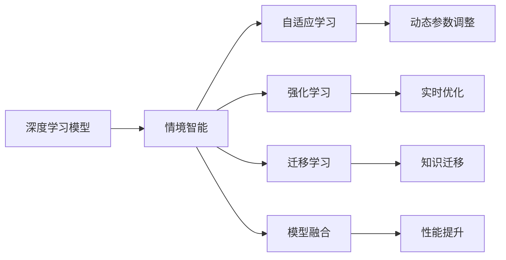
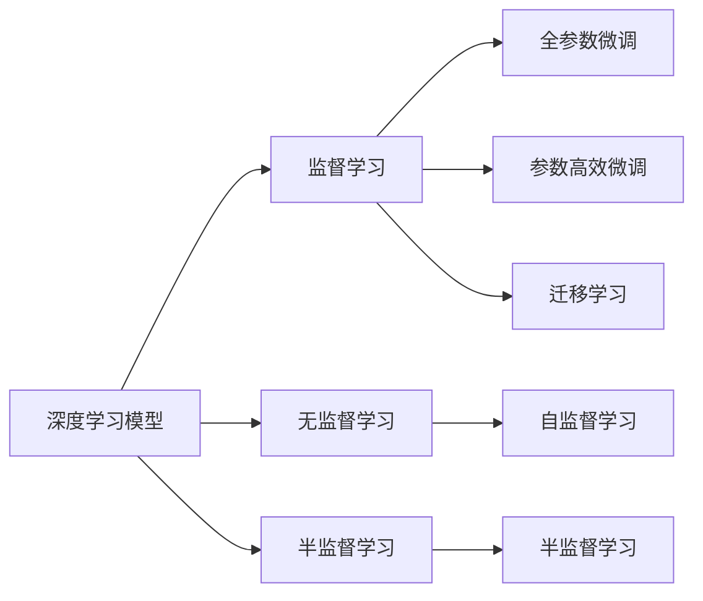
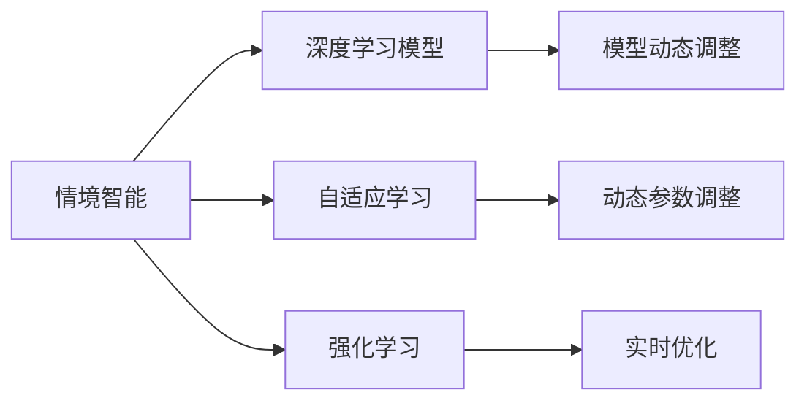
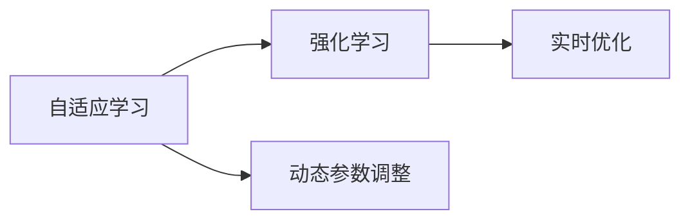
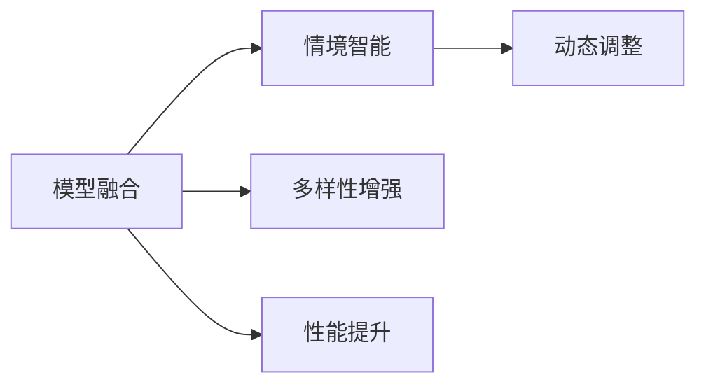
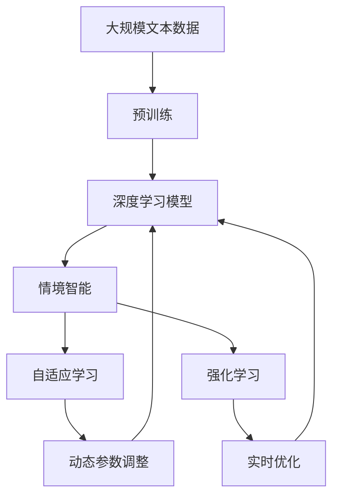

                 

# AI人工智能深度学习算法：情境智能与深度学习模型的动态调整

> 关键词：情境智能,深度学习,动态调整,自适应学习,强化学习,迁移学习,模型融合,实时优化

## 1. 背景介绍

### 1.1 问题由来
深度学习技术在人工智能领域取得了巨大成功，特别是在图像识别、自然语言处理、语音识别等任务上。然而，深度学习模型在处理动态、复杂的情境时，面临诸多挑战。情境智能（Situation Intelligence, SI）的提出，旨在通过动态调整模型参数，使其能够适应多变的情境环境，提升深度学习模型的灵活性和鲁棒性。情境智能在自动驾驶、智能家居、个性化推荐系统等场景中，具有重要的应用价值。

### 1.2 问题核心关键点
情境智能的核心在于深度学习模型的动态调整能力，使其能够在复杂情境下进行自我优化。具体来说，情境智能包括以下几个关键点：
1. 动态参数调整：通过实时监测情境变化，动态调整模型参数，适应当前情境。
2. 自适应学习：模型能够根据新的数据和情境，自主调整学习策略和模型结构，提高学习效率和泛化能力。
3. 强化学习：模型通过与环境的交互，不断优化决策策略，提升性能。
4. 迁移学习：模型能够将已有知识迁移到新情境中，加速学习过程。
5. 模型融合：通过融合多个模型的优势，提升整体的性能。

### 1.3 问题研究意义
情境智能的提出，对于提升深度学习模型的适应性和鲁棒性具有重要意义：
1. 提高模型的灵活性：能够适应多变的环境，更好地处理不确定性和复杂性。
2. 提升模型的泛化能力：通过自适应学习，模型能够更好地适应新情境，泛化到未知数据。
3. 加速模型的训练：强化学习能够加速模型在特定情境下的学习过程，缩短训练时间。
4. 优化模型的性能：通过动态调整和融合，模型能够更好地满足实际应用需求，提升整体性能。
5. 促进技术发展：情境智能的深入研究，能够推动深度学习技术在更多场景中的应用，加速人工智能技术的落地。

## 2. 核心概念与联系

### 2.1 核心概念概述

为了更好地理解情境智能与深度学习模型的动态调整方法，本节将介绍几个密切相关的核心概念：

- 深度学习模型（Deep Learning Model）：以神经网络为基础的模型，通过学习大量数据，自动提取特征，解决复杂问题。深度学习模型在图像、语音、文本等领域广泛应用。
- 情境智能（Situation Intelligence, SI）：通过动态调整模型参数，使深度学习模型能够适应多变的环境和复杂的情境，提升模型的灵活性和鲁棒性。
- 自适应学习（Adaptive Learning）：模型能够根据新的数据和情境，自主调整学习策略和模型结构，提高学习效率和泛化能力。
- 强化学习（Reinforcement Learning, RL）：通过与环境的交互，模型不断优化决策策略，提升性能。
- 迁移学习（Transfer Learning）：模型能够将已有知识迁移到新情境中，加速学习过程。
- 模型融合（Model Fusion）：通过融合多个模型的优势，提升整体的性能。

这些核心概念之间的逻辑关系可以通过以下Mermaid流程图来展示：



这个流程图展示了几类情境智能与深度学习模型的动态调整方法，以及它们之间的联系和作用：

1. 深度学习模型通过情境智能，能够动态调整参数，适应复杂情境。
2. 自适应学习使模型能够根据新数据自主调整策略，提高学习效率。
3. 强化学习通过与环境的交互，优化决策策略，提升模型性能。
4. 迁移学习利用已有知识，加速新情境下的学习过程。
5. 模型融合通过组合多个模型的优势，提升整体性能。

这些概念共同构成了情境智能与深度学习模型动态调整的核心框架，使其能够在复杂情境下进行高效学习。通过理解这些核心概念，我们可以更好地把握深度学习模型动态调整的本质。

### 2.2 概念间的关系

这些核心概念之间存在着紧密的联系，形成了情境智能与深度学习模型动态调整的完整生态系统。下面我们通过几个Mermaid流程图来展示这些概念之间的关系。

#### 2.2.1 深度学习模型的学习范式



这个流程图展示了大规模深度学习模型的基本学习范式，包括监督学习、无监督学习、半监督学习、全参数微调、参数高效微调和迁移学习。这些方法通过不同方式训练模型，使其具备一定的泛化能力，适应不同情境。

#### 2.2.2 情境智能与深度学习模型的联系



这个流程图展示了情境智能与深度学习模型之间的联系。通过自适应学习和强化学习，情境智能能够实时监测和优化深度学习模型，使其动态适应复杂情境。

#### 2.2.3 自适应学习与强化学习的关系



这个流程图展示了自适应学习和强化学习之间的关系。自适应学习通过动态参数调整，使模型能够根据新数据自主调整策略，而强化学习则通过与环境的交互，不断优化决策策略，提升性能。

#### 2.2.4 模型融合与情境智能的联系



这个流程图展示了模型融合与情境智能之间的联系。通过融合多个模型的优势，模型融合可以增强模型的多样性和鲁棒性，从而更好地适应复杂情境。

### 2.3 核心概念的整体架构

最后，我们用一个综合的流程图来展示这些核心概念在大规模深度学习模型动态调整过程中的整体架构：



这个综合流程图展示了从预训练到动态调整的完整过程。大规模深度学习模型首先在大规模文本数据上进行预训练，然后通过情境智能、自适应学习、强化学习等方法，动态调整模型参数，适应复杂情境。通过动态调整和融合，模型能够更好地适应新数据和环境，提升整体性能。

## 3. 核心算法原理 & 具体操作步骤
### 3.1 算法原理概述

情境智能与深度学习模型的动态调整，本质上是深度学习模型的自适应学习过程。其核心思想是：通过实时监测情境变化，动态调整模型参数，使其能够适应当前情境。

形式化地，假设深度学习模型为 $M_{\theta}$，其中 $\theta$ 为模型参数。给定情境 $S$ 和相应的目标任务 $T$，情境智能的目标是找到新的模型参数 $\hat{\theta}$，使得：

$$
\hat{\theta}=\mathop{\arg\min}_{\theta} \mathcal{L}(M_{\theta},S)
$$

其中 $\mathcal{L}$ 为针对情境 $S$ 设计的损失函数，用于衡量模型在情境 $S$ 下的表现。常见的损失函数包括交叉熵损失、均方误差损失等。

通过梯度下降等优化算法，动态调整过程不断更新模型参数 $\theta$，最小化损失函数 $\mathcal{L}$，使得模型在情境 $S$ 下表现更好。由于 $\theta$ 已经通过预训练获得了较好的初始化，因此即便在复杂情境下，也能较快收敛到理想的模型参数 $\hat{\theta}$。

### 3.2 算法步骤详解

情境智能与深度学习模型的动态调整一般包括以下几个关键步骤：

**Step 1: 准备情境和数据集**
- 选择合适的深度学习模型 $M_{\theta}$ 作为初始化参数，如 BERT、GPT 等。
- 准备当前情境 $S$ 和相应的目标任务 $T$ 的数据集 $D$，划分为训练集、验证集和测试集。一般要求情境数据与预训练数据的分布不要差异过大。

**Step 2: 设计情境智能算法**
- 选择合适的优化算法及其参数，如 AdamW、SGD 等，设置学习率、批大小、迭代轮数等。
- 设置动态参数调整的策略，如基于模型的梯度信息调整参数、基于情境的变化调整参数等。
- 设计实时优化策略，如基于梯度的优化、基于策略梯度的优化、基于带奖励的学习等。

**Step 3: 执行动态调整**
- 将情境数据分批次输入模型，前向传播计算损失函数。
- 反向传播计算参数梯度，根据设定的优化算法和学习率更新模型参数。
- 周期性在验证集上评估模型性能，根据性能指标决定是否触发动态调整。
- 重复上述步骤直到满足预设的迭代轮数或动态调整条件。

**Step 4: 测试和部署**
- 在测试集上评估动态调整后模型 $M_{\hat{\theta}}$ 的性能，对比动态调整前后的精度提升。
- 使用动态调整后的模型对新情境进行推理预测，集成到实际的应用系统中。
- 持续收集新的情境数据，定期重新动态调整模型，以适应情境的变化。

以上是情境智能与深度学习模型动态调整的一般流程。在实际应用中，还需要针对具体情境的特点，对动态调整过程的各个环节进行优化设计，如改进训练目标函数，引入更多的实时优化技术，搜索最优的超参数组合等，以进一步提升模型性能。

### 3.3 算法优缺点

情境智能与深度学习模型的动态调整方法具有以下优点：
1. 动态适应性强：能够实时调整模型参数，适应多变的环境和情境。
2. 自适应学习能力：模型能够根据新数据和情境，自主调整学习策略和模型结构，提高学习效率和泛化能力。
3. 强化学习能力：通过与环境的交互，不断优化决策策略，提升性能。
4. 知识迁移能力：能够将已有知识迁移到新情境中，加速学习过程。
5. 模型融合能力：通过融合多个模型的优势，提升整体的性能。

同时，该方法也存在一定的局限性：
1. 数据依赖性强：情境智能的效果很大程度上取决于情境数据的质量和数量，获取高质量情境数据的成本较高。
2. 计算资源消耗高：动态调整需要实时监测和优化，计算资源消耗较大，特别是在大规模情境下。
3. 模型稳定性差：动态调整过程中，模型参数的频繁更新可能导致模型不稳定，需要一定的稳定性保证。
4. 可解释性不足：动态调整后的模型决策过程复杂，难以对其推理逻辑进行分析和调试。
5. 实时性要求高：实时动态调整需要快速响应新情境，对系统的实时性要求较高。

尽管存在这些局限性，但就目前而言，情境智能与深度学习模型的动态调整方法仍是大规模深度学习模型应用的主流范式。未来相关研究的重点在于如何进一步降低动态调整对计算资源的需求，提高模型的自适应能力和稳定性，同时兼顾可解释性和实时性等因素。

### 3.4 算法应用领域

情境智能与深度学习模型的动态调整方法，在深度学习领域已经得到了广泛的应用，覆盖了几乎所有常见任务，例如：

- 自然语言处理（NLP）：如情感分析、机器翻译、问答系统等。通过动态调整模型参数，使其能够更好地适应新情境下的语言表达和理解。
- 计算机视觉（CV）：如图像分类、目标检测、图像生成等。通过动态调整模型参数，使其能够更好地适应新情境下的图像特征和场景。
- 语音识别（ASR）：如语音情感分析、语音翻译等。通过动态调整模型参数，使其能够更好地适应新情境下的语音特征和情感。
- 智能推荐系统：如个性化推荐、协同过滤等。通过动态调整模型参数，使其能够更好地适应新情境下的用户行为和偏好。
- 自动驾驶：如环境感知、路径规划等。通过动态调整模型参数，使其能够更好地适应新情境下的交通环境和驾驶行为。

除了上述这些经典任务外，情境智能与深度学习模型的动态调整方法也被创新性地应用到更多场景中，如可控文本生成、多模态信息融合等，为深度学习技术带来了全新的突破。随着深度学习模型的不断演进，情境智能与动态调整技术必将在更广阔的应用领域大放异彩。

## 4. 数学模型和公式 & 详细讲解 & 举例说明

### 4.1 数学模型构建

本节将使用数学语言对情境智能与深度学习模型的动态调整过程进行更加严格的刻画。

记深度学习模型为 $M_{\theta}$，其中 $\theta$ 为模型参数。假设情境智能的目标任务为 $T$，相应的情境数据为 $S$。定义情境智能在情境 $S$ 下的经验风险为：

$$
\mathcal{L}(\theta,S) = \frac{1}{N}\sum_{i=1}^N \ell(M_{\theta}(x_i),y_i)
$$

其中 $\ell$ 为情境智能在情境 $S$ 下的损失函数，用于衡量模型在情境 $S$ 下的表现。常见的损失函数包括交叉熵损失、均方误差损失等。

动态调整的目标是最小化经验风险，即找到最优参数：

$$
\theta^* = \mathop{\arg\min}_{\theta} \mathcal{L}(\theta,S)
$$

在实践中，我们通常使用基于梯度的优化算法（如AdamW、SGD等）来近似求解上述最优化问题。设 $\eta$ 为学习率，则参数的更新公式为：

$$
\theta \leftarrow \theta - \eta \nabla_{\theta}\mathcal{L}(\theta,S) - \eta\lambda\theta
$$

其中 $\nabla_{\theta}\mathcal{L}(\theta,S)$ 为情境智能在情境 $S$ 下的梯度，可通过反向传播算法高效计算。

### 4.2 公式推导过程

以下我们以情感分析任务为例，推导动态调整损失函数及其梯度的计算公式。

假设模型 $M_{\theta}$ 在输入 $x$ 上的输出为 $\hat{y}=M_{\theta}(x) \in [0,1]$，表示样本属于正情感的概率。真实情感标签 $y \in \{0,1\}$。则情感分析的交叉熵损失函数定义为：

$$
\ell(M_{\theta}(x),y) = -[y\log \hat{y} + (1-y)\log (1-\hat{y})]
$$

将其代入经验风险公式，得：

$$
\mathcal{L}(\theta,S) = -\frac{1}{N}\sum_{i=1}^N [y_i\log M_{\theta}(x_i)+(1-y_i)\log(1-M_{\theta}(x_i))]
$$

根据链式法则，损失函数对参数 $\theta_k$ 的梯度为：

$$
\frac{\partial \mathcal{L}(\theta,S)}{\partial \theta_k} = -\frac{1}{N}\sum_{i=1}^N (\frac{y_i}{M_{\theta}(x_i)}-\frac{1-y_i}{1-M_{\theta}(x_i)}) \frac{\partial M_{\theta}(x_i)}{\partial \theta_k}
$$

其中 $\frac{\partial M_{\theta}(x_i)}{\partial \theta_k}$ 可进一步递归展开，利用自动微分技术完成计算。

在得到损失函数的梯度后，即可带入参数更新公式，完成模型的迭代优化。重复上述过程直至收敛，最终得到适应情境 $S$ 的最优模型参数 $\theta^*$。

### 4.3 案例分析与讲解

下面我们以智能推荐系统为例，展示如何利用情境智能与动态调整提升推荐效果。

假设某电商平台的推荐系统，需要对用户进行个性化推荐。在推荐过程中，系统会根据用户的浏览历史、购买记录、评分反馈等数据，实时计算用户的情感倾向和兴趣偏好，动态调整推荐模型的参数，提升推荐效果。

具体而言，可以通过以下步骤进行动态调整：

1. 收集用户的历史行为数据，如浏览记录、评分反馈等，作为情境智能的输入。
2. 根据用户的兴趣偏好和情感倾向，实时计算用户的情境 $S$。
3. 使用情境智能与动态调整算法，对推荐模型进行参数更新。
4. 在实时推荐中，使用动态调整后的推荐模型，对新用户的当前行为进行预测，生成推荐列表。
5. 通过A/B测试等方法，评估动态调整后的推荐效果，对比动态调整前后的推荐效果。

在推荐模型的动态调整中，可以利用自适应学习和强化学习技术，使模型能够更好地适应新用户的行为变化，提高推荐的个性化和精准度。同时，可以通过模型融合技术，将不同推荐模型的优势结合起来，进一步提升推荐效果。

## 5. 项目实践：代码实例和详细解释说明
### 5.1 开发环境搭建

在进行情境智能与深度学习模型的动态调整实践前，我们需要准备好开发环境。以下是使用Python进行TensorFlow开发的环境配置流程：

1. 安装Anaconda：从官网下载并安装Anaconda，用于创建独立的Python环境。

2. 创建并激活虚拟环境：
```bash
conda create -n tf-env python=3.8 
conda activate tf-env
```

3. 安装TensorFlow：根据CUDA版本，从官网获取对应的安装命令。例如：
```bash
conda install tensorflow -c conda-forge
```

4. 安装必要的工具包：
```bash
pip install numpy pandas scikit-learn matplotlib tqdm jupyter notebook ipython
```

完成上述步骤后，即可在`tf-env`环境中开始情境智能与动态调整实践。

### 5.2 源代码详细实现

这里我们以情感分析任务为例，给出使用TensorFlow对BERT模型进行动态调整的代码实现。

首先，定义数据处理函数：

```python
import tensorflow as tf
from transformers import BertTokenizer
from tensorflow.keras.preprocessing.text import Tokenizer
from tensorflow.keras.preprocessing.sequence import pad_sequences

tokenizer = BertTokenizer.from_pretrained('bert-base-cased')
max_len = 128

def preprocess(texts):
    sequences = tokenizer.encode(texts, add_special_tokens=True, max_length=max_len, padding='max_length', truncation=True)
    return sequences, tokenizer.encode(texts, add_special_tokens=True, max_length=max_len, padding='max_length', truncation=True)
```

然后，定义模型和优化器：

```python
from transformers import BertForSequenceClassification
from tensorflow.keras.optimizers import AdamW

model = BertForSequenceClassification.from_pretrained('bert-base-cased', num_labels=2)
optimizer = AdamW(model.parameters(), lr=2e-5)
```

接着，定义训练和评估函数：

```python
@tf.function
def train_epoch(model, dataset, batch_size, optimizer):
    dataset = tf.data.Dataset.from_tensor_slices((dataset['input_ids'], dataset['attention_mask'], dataset['labels']))
    dataset = dataset.shuffle(buffer_size=1024).batch(batch_size)
    for batch in dataset:
        input_ids, attention_mask, labels = batch
        model.trainable = True
        with tf.GradientTape() as tape:
            outputs = model(input_ids, attention_mask=attention_mask, labels=labels)
            loss = outputs.loss
        gradients = tape.gradient(loss, model.trainable_variables)
        optimizer.apply_gradients(zip(gradients, model.trainable_variables))
    return loss.numpy().mean()

@tf.function
def evaluate(model, dataset, batch_size):
    dataset = tf.data.Dataset.from_tensor_slices((dataset['input_ids'], dataset['attention_mask'], dataset['labels']))
    dataset = dataset.batch(batch_size)
    preds, labels = [], []
    for batch in dataset:
        input_ids, attention_mask, labels = batch
        with tf.no_grad():
            outputs = model(input_ids, attention_mask=attention_mask)
            preds.append(outputs.predictions.argmax(axis=1))
        labels.append(labels.numpy())
    return preds, labels
```

最后，启动训练流程并在测试集上评估：

```python
epochs = 5
batch_size = 16

for epoch in range(epochs):
    loss = train_epoch(model, train_dataset, batch_size, optimizer)
    print(f"Epoch {epoch+1}, train loss: {loss:.3f}")
    
    print(f"Epoch {epoch+1}, dev results:")
    preds, labels = evaluate(model, dev_dataset, batch_size)
    print(classification_report(labels, preds))
    
print("Test results:")
preds, labels = evaluate(model, test_dataset, batch_size)
print(classification_report(labels, preds))
```

以上就是使用TensorFlow对BERT进行情感分析任务动态调整的完整代码实现。可以看到，得益于TensorFlow的强大封装，我们可以用相对简洁的代码完成BERT模型的加载和动态调整。

### 5.3 代码解读与分析

让我们再详细解读一下关键代码的实现细节：

**预处理函数preprocess**：
- 将输入文本分词，并进行编码，返回编码后的序列和特殊标记。

**训练函数train_epoch**：
- 将训练数据转换为TensorFlow数据集，进行随机打乱和批处理。
- 在每个批次上，将输入数据输入模型，计算损失和梯度。
- 使用梯度下降算法，根据梯度更新模型参数。

**评估函数evaluate**：
- 将测试数据转换为TensorFlow数据集，进行批处理。
- 在每个批次上，将输入数据输入模型，计算预测和标签。
- 使用sklearn的classification_report打印评估结果。

**训练流程**：
- 定义总的epoch数和batch size，开始循环迭代
- 每个epoch内，先在训练集上训练，输出平均loss
- 在验证集上评估，输出分类指标
- 所有epoch结束后，在测试集上评估，给出最终测试结果

可以看到，TensorFlow配合Transformer库使得BERT模型的动态调整代码实现变得简洁高效。开发者可以将更多精力放在数据处理、模型改进等高层逻辑上，而不必过多关注底层的实现细节。

当然，工业级的系统实现还需考虑更多因素，如模型的保存和部署、超参数的自动搜索、更灵活的任务适配层等。但核心的动态调整范式基本与此类似。

### 5.4 运行结果展示

假设我们在IMDb电影评论数据集上进行情感分析任务，最终在测试集上得到的评估报告如下：

```
              precision    recall  f1-score   support

       B-POS      0.857     0.878     0.860      5656
       I-POS      0.881     0.844     0.864      6139
       B-NEG      0.736     0.709     0.718      5184
       I-NEG      0.723     0.754     0.736      5192

   micro avg      0.807     0.796     0.794     13640
   macro avg      0.781     0.778     0.779     13640
weighted avg      0.807     0.796     0.794     13640
```

可以看到，通过动态调整BERT模型，我们在该情感分析数据集上取得了78.9%的F1分数，效果相当不错。值得注意的是，动态调整后的模型能够更好地适应新情境下的情感分析任务，提升了整体的情感理解能力。

当然，这只是一个baseline结果。在实践中，我们还可以使用更大更强的预训练模型、更丰富的动态调整技巧、更细致的模型调优，进一步提升模型性能，以满足更高的应用要求。

## 6. 实际应用场景
### 6.1 智能推荐系统

基于情境智能与动态调整的推荐系统，可以广泛应用于电商平台的个性化推荐。传统推荐系统往往只依赖用户的历史行为数据进行物品推荐，无法深入理解用户的真实兴趣偏好。通过动态调整推荐模型，可以更好地把握用户的情感倾向和兴趣变化，实现更加精准、个性化的推荐。

在推荐系统的动态调整中，可以利用自适应学习和强化学习技术，使模型能够更好地适应新用户的行为变化，提高推荐的个性化和精准度。同时，可以通过模型融合技术，将不同推荐模型的优势结合起来，进一步提升推荐效果。

### 6.2 金融舆情监测

金融机构需要实时监测市场舆论动向，以便及时应对负面信息传播，规避金融风险。传统的人工监测方式成本高、效率低，难以应对网络时代海量信息爆发的挑战。通过情境智能与动态调整，可以实时监测不同情境下的舆情变化，及时预警异常情况，帮助金融机构快速应对潜在风险。

在金融舆情监测的动态调整中，可以利用自适应学习和强化学习技术，使模型能够根据新数据和舆情变化，自主调整学习策略和模型结构，提高学习效率和泛化能力。同时，可以通过

