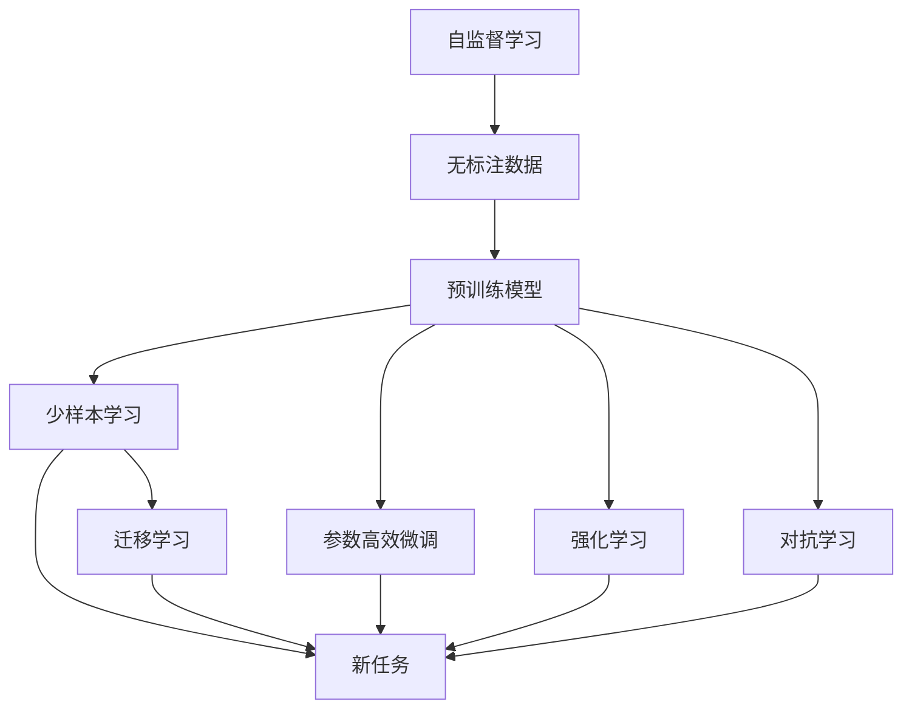
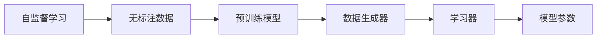
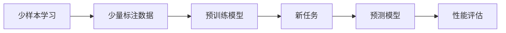
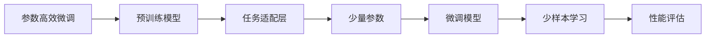

                 

# AI人工智能深度学习算法：智能深度学习代理的深度学习技术

## 1. 背景介绍

### 1.1 问题由来

随着人工智能技术的飞速发展，深度学习已经成为AI领域中最具影响力的分支之一。深度学习技术通过构建多层次神经网络，能够自动学习数据中的高级特征，从而实现从数据中发现模式和规律。在实际应用中，深度学习被广泛用于图像识别、语音识别、自然语言处理、机器翻译等诸多领域，取得了显著的成果。

然而，深度学习模型通常需要大量的标注数据进行训练，这使得其在大规模数据集上的性能提升非常有限。为了克服这一问题，智能深度学习代理(Deep Learning Agent, DL-Agent)应运而生。智能深度学习代理是指通过自动学习，在有限的标注数据上进行训练，并在新的未标注数据上实现有效预测和决策的深度学习模型。智能深度学习代理的引入，极大地降低了数据标注的成本，同时提高了模型的泛化能力，成为深度学习领域的热点研究方向。

### 1.2 问题核心关键点

智能深度学习代理的核心关键点包括以下几个方面：

- **自监督学习**：利用未标注数据进行预训练，学习数据中的通用特征。
- **少样本学习**：在少量标注数据上训练，实现快速适应新任务。
- **参数高效微调**：固定大部分预训练参数，仅更新少量任务相关参数。
- **迁移学习**：将预训练模型知识迁移到新任务上，提升模型性能。
- **强化学习**：通过奖励反馈不断优化模型决策，实现动态学习。
- **对抗学习**：学习对抗样本，提高模型鲁棒性。

这些关键技术共同构成了智能深度学习代理的基本框架，使得模型能够在各种复杂场景下，通过自我学习不断优化，最终实现高效的决策和预测。

### 1.3 问题研究意义

智能深度学习代理的研究，具有重要的理论和实际意义：

1. **降低标注成本**：通过自监督学习，在无标注数据上进行预训练，显著减少了模型训练所需的标注数据量。
2. **提高泛化能力**：少样本学习使得模型在有限的标注数据上，依然能够快速适应新任务，提升模型的泛化能力。
3. **参数高效微调**：参数高效微调方法能够在不增加过多参数的情况下，实现模型的进一步优化。
4. **促进迁移学习**：迁移学习使得模型能够将已有的知识迁移到新任务上，提升模型在新领域的性能。
5. **增强决策鲁棒性**：对抗学习使模型能够在对抗样本上保持稳定性能，提高模型的鲁棒性。

## 2. 核心概念与联系

### 2.1 核心概念概述

为了更好地理解智能深度学习代理的原理和架构，本节将介绍几个关键概念：

- **自监督学习(Self-Supervised Learning)**：利用数据的某些属性（如数据本身的内在关联）进行学习，而不是直接利用标签信息。自监督学习通过生成伪标签进行监督，利用数据的某些属性生成缺失标签，使得模型能够学习到数据的隐含结构。

- **少样本学习(Few-shot Learning)**：在有限的标注数据上进行学习，学习能力强、泛化能力好的模型，能够快速适应新任务。

- **参数高效微调(Parameter-Efficient Fine-Tuning, PEFT)**：在微调过程中，只更新少量的模型参数，而固定大部分预训练参数，以提高微调效率，避免过拟合。

- **迁移学习(Transfer Learning)**：将模型在源任务上学习到的知识迁移到新任务上，提高新任务的性能。

- **强化学习(Reinforcement Learning, RL)**：通过与环境的交互，使模型学习到最佳决策策略，优化模型性能。

- **对抗学习(Adversarial Learning)**：通过生成对抗样本，使得模型在对抗样本上仍然能够保持稳定的性能，提高模型的鲁棒性。

这些核心概念之间的关系可以通过以下Mermaid流程图来展示：



这个流程图展示了这个核心概念之间的关系：

1. 自监督学习利用无标注数据进行预训练，学习数据的隐含结构。
2. 预训练模型通过自监督学习获得的知识，可以在少样本学习中快速适应新任务。
3. 少样本学习在有限的标注数据上训练，进一步提高模型性能。
4. 参数高效微调在少样本学习的基础上，只更新少量参数，避免过拟合。
5. 迁移学习将预训练模型知识迁移到新任务上，提升模型在新领域的性能。
6. 强化学习通过与环境的交互，优化模型决策策略。
7. 对抗学习学习对抗样本，提高模型鲁棒性。

### 2.2 概念间的关系

这些核心概念之间存在着紧密的联系，形成了智能深度学习代理的基本生态系统。下面我们通过几个Mermaid流程图来展示这些概念之间的关系。

#### 2.2.1 自监督学习的体系结构



这个流程图展示了自监督学习的核心结构：

1. 自监督学习利用无标注数据进行预训练，生成伪标签。
2. 通过数据生成器生成伪标签。
3. 学习器利用伪标签进行训练，更新模型参数。
4. 模型参数得到优化，提高了模型在特定任务上的泛化能力。

#### 2.2.2 少样本学习的流程图



这个流程图展示了少样本学习的核心结构：

1. 少样本学习在少量标注数据上进行训练。
2. 利用预训练模型在少量标注数据上快速适应新任务。
3. 新任务上进行预测，生成预测结果。
4. 性能评估器评估预测结果，反馈优化。

#### 2.2.3 参数高效微调的步骤



这个流程图展示了参数高效微调的核心步骤：

1. 参数高效微调在预训练模型的基础上，只更新少量参数。
2. 任务适配层适应新任务，生成输出。
3. 微调模型进行优化，提高任务适应能力。
4. 少样本学习在少量标注数据上快速适应新任务。
5. 性能评估器评估预测结果，反馈优化。

### 2.3 核心概念的整体架构

最后，我们用一个综合的流程图来展示这些核心概念在大模型微调过程中的整体架构：


这个综合流程图展示了从预训练到微调，再到应用的全过程。大规模数据集通过自监督学习进行预训练，得到预训练模型。预训练模型在少样本学习中进行微调，得到适应新任务的微调模型。微调模型通过迁移学习将知识迁移到新任务上，增强泛化能力。最后，通过强化学习和对抗学习，不断优化模型决策，提升模型鲁棒性。

## 3. 核心算法原理 & 具体操作步骤
### 3.1 算法原理概述

智能深度学习代理的核心算法原理可以概括为以下几个方面：

1. **自监督学习**：通过无标注数据进行预训练，学习数据的隐含结构。
2. **少样本学习**：在少量标注数据上训练，快速适应新任务。
3. **参数高效微调**：只更新少量参数，避免过拟合。
4. **迁移学习**：将预训练模型知识迁移到新任务上，提升模型性能。
5. **强化学习**：通过与环境的交互，优化模型决策策略。
6. **对抗学习**：学习对抗样本，提高模型鲁棒性。

这些核心算法原理构成了智能深度学习代理的基本框架，使得模型能够在各种复杂场景下，通过自我学习不断优化，最终实现高效的决策和预测。

### 3.2 算法步骤详解

智能深度学习代理的核心算法步骤可以详细描述如下：

**Step 1: 数据预处理**
- 收集大量无标注数据，并对其进行预处理，如数据清洗、归一化、特征提取等。
- 利用数据的某些属性，如文本的长度、词语频率等，生成伪标签。

**Step 2: 预训练模型构建**
- 选择合适的深度学习模型，如卷积神经网络(CNN)、循环神经网络(RNN)、Transformer等。
- 构建自监督学习任务，如掩码语言模型、自回归语言模型、对比学习等。
- 在无标注数据上训练模型，优化模型参数。

**Step 3: 少样本学习**
- 收集少量标注数据，将其分为训练集和测试集。
- 在少量标注数据上训练微调模型，优化模型参数。
- 在测试集上评估模型性能，调整参数。

**Step 4: 参数高效微调**
- 固定大部分预训练参数，只更新少量任务相关参数。
- 构建任务适配层，适应新任务。
- 在少量标注数据上训练微调模型，优化任务适配层的参数。

**Step 5: 迁移学习**
- 利用预训练模型在新任务上进行迁移学习，提取通用特征。
- 在新任务上进行微调，优化模型参数。

**Step 6: 强化学习**
- 构建环境，定义状态、动作、奖励等。
- 通过与环境的交互，训练模型决策策略。
- 在实际应用场景中进行动态调整和优化。

**Step 7: 对抗学习**
- 生成对抗样本，评估模型鲁棒性。
- 在对抗样本上进行微调，提高模型鲁棒性。

### 3.3 算法优缺点

智能深度学习代理具有以下优点：

1. **降低数据标注成本**：利用自监督学习，在无标注数据上进行预训练，减少数据标注的工作量。
2. **提高泛化能力**：少样本学习在少量标注数据上训练，能够快速适应新任务，提升模型泛化能力。
3. **参数高效微调**：固定大部分预训练参数，只更新少量任务相关参数，避免过拟合。
4. **迁移学习能力**：将预训练模型知识迁移到新任务上，提升模型性能。
5. **动态决策优化**：强化学习通过与环境的交互，动态优化模型决策策略。
6. **提高鲁棒性**：对抗学习学习对抗样本，提高模型鲁棒性。

然而，智能深度学习代理也存在以下缺点：

1. **预训练模型复杂度高**：大规模预训练模型通常具有较高的复杂度，对计算资源和存储空间有较高的要求。
2. **训练时间长**：预训练过程需要大量时间和计算资源，训练时间较长。
3. **泛化能力有限**：在特定领域数据上预训练的模型，对新领域的数据泛化能力可能不足。
4. **模型复杂性高**：复杂模型训练和微调过程中的超参数调优较为复杂，难以实现自动化。
5. **模型可解释性不足**：深度学习模型的内部决策过程难以解释，缺乏透明性。

尽管存在这些缺点，但智能深度学习代理在实际应用中依然取得了显著的效果，特别是在数据标注成本高、计算资源受限的场景下，其优势更加凸显。

### 3.4 算法应用领域

智能深度学习代理在各个领域都有广泛的应用，以下列举几个典型应用场景：

1. **自然语言处理(NLP)**：利用自监督学习进行语言模型预训练，通过少样本学习实现情感分析、命名实体识别、机器翻译等任务。

2. **计算机视觉(CV)**：利用自监督学习进行图像分类、目标检测、图像生成等任务的预训练，通过少样本学习实现图像标注、图像检索等任务。

3. **语音识别(SR)**：利用自监督学习进行语音特征提取，通过少样本学习实现语音识别、语音生成等任务。

4. **推荐系统(Recommendation System)**：利用自监督学习进行用户兴趣建模，通过少样本学习实现推荐结果的动态更新和优化。

5. **游戏AI(Game AI)**：利用自监督学习进行游戏场景建模，通过少样本学习实现动态决策和优化，提升游戏AI的性能。

6. **自动驾驶(Autonomous Driving)**：利用自监督学习进行环境建模，通过少样本学习实现实时决策和优化，提升自动驾驶系统的安全性。

## 4. 数学模型和公式 & 详细讲解  
### 4.1 数学模型构建

本节将使用数学语言对智能深度学习代理的预训练、微调、迁移学习等过程进行严格的刻画。

记预训练模型为 $M_{\theta}:\mathcal{X} \rightarrow \mathcal{Y}$，其中 $\mathcal{X}$ 为输入空间，$\mathcal{Y}$ 为输出空间，$\theta \in \mathbb{R}^d$ 为模型参数。假设智能深度学习代理的任务为 $T$，任务数据集为 $D=\{(x_i,y_i)\}_{i=1}^N$，其中 $x_i \in \mathcal{X}$ 为输入，$y_i \in \mathcal{Y}$ 为输出。

定义模型 $M_{\theta}$ 在数据样本 $(x,y)$ 上的损失函数为 $\ell(M_{\theta}(x),y)$，则在数据集 $D$ 上的经验风险为：

$$
\mathcal{L}(\theta) = \frac{1}{N} \sum_{i=1}^N \ell(M_{\theta}(x_i),y_i)
$$

智能深度学习代理的优化目标是最小化经验风险，即找到最优参数：

$$
\theta^* = \mathop{\arg\min}_{\theta} \mathcal{L}(\theta)
$$

在实践中，我们通常使用基于梯度的优化算法（如SGD、Adam等）来近似求解上述最优化问题。设 $\eta$ 为学习率，$\lambda$ 为正则化系数，则参数的更新公式为：

$$
\theta \leftarrow \theta - \eta \nabla_{\theta}\mathcal{L}(\theta) - \eta\lambda\theta
$$

其中 $\nabla_{\theta}\mathcal{L}(\theta)$ 为损失函数对参数 $\theta$ 的梯度，可通过反向传播算法高效计算。

### 4.2 公式推导过程

以下我们以二分类任务为例，推导交叉熵损失函数及其梯度的计算公式。

假设模型 $M_{\theta}$ 在输入 $x$ 上的输出为 $\hat{y}=M_{\theta}(x) \in [0,1]$，表示样本属于正类的概率。真实标签 $y \in \{0,1\}$。则二分类交叉熵损失函数定义为：

$$
\ell(M_{\theta}(x),y) = -[y\log \hat{y} + (1-y)\log (1-\hat{y})]
$$

将其代入经验风险公式，得：

$$
\mathcal{L}(\theta) = -\frac{1}{N}\sum_{i=1}^N [y_i\log M_{\theta}(x_i)+(1-y_i)\log(1-M_{\theta}(x_i))]
$$

根据链式法则，损失函数对参数 $\theta_k$ 的梯度为：

$$
\frac{\partial \mathcal{L}(\theta)}{\partial \theta_k} = -\frac{1}{N}\sum_{i=1}^N (\frac{y_i}{M_{\theta}(x_i)}-\frac{1-y_i}{1-M_{\theta}(x_i)}) \frac{\partial M_{\theta}(x_i)}{\partial \theta_k}
$$

其中 $\frac{\partial M_{\theta}(x_i)}{\partial \theta_k}$ 可进一步递归展开，利用自动微分技术完成计算。

在得到损失函数的梯度后，即可带入参数更新公式，完成模型的迭代优化。重复上述过程直至收敛，最终得到适应下游任务的最优模型参数 $\theta^*$。

## 5. 项目实践：代码实例和详细解释说明
### 5.1 开发环境搭建

在进行智能深度学习代理的开发前，我们需要准备好开发环境。以下是使用Python进行PyTorch开发的环境配置流程：

1. 安装Anaconda：从官网下载并安装Anaconda，用于创建独立的Python环境。

2. 创建并激活虚拟环境：
```bash
conda create -n pytorch-env python=3.8 
conda activate pytorch-env
```

3. 安装PyTorch：根据CUDA版本，从官网获取对应的安装命令。例如：
```bash
conda install pytorch torchvision torchaudio cudatoolkit=11.1 -c pytorch -c conda-forge
```

4. 安装Transformers库：
```bash
pip install transformers
```

5. 安装各类工具包：
```bash
pip install numpy pandas scikit-learn matplotlib tqdm jupyter notebook ipython
```

完成上述步骤后，即可在`pytorch-env`环境中开始智能深度学习代理的开发。

### 5.2 源代码详细实现

下面我们以自然语言处理任务为例，给出使用Transformers库对BERT模型进行智能深度学习代理的PyTorch代码实现。

首先，定义自然语言处理任务的数据处理函数：

```python
from transformers import BertTokenizer
from torch.utils.data import Dataset
import torch

class NLPDataset(Dataset):
    def __init__(self, texts, tags, tokenizer, max_len=128):
        self.texts = texts
        self.tags = tags
        self.tokenizer = tokenizer
        self.max_len = max_len
        
    def __len__(self):
        return len(self.texts)
    
    def __getitem__(self, item):
        text = self.texts[item]
        tags = self.tags[item]
        
        encoding = self.tokenizer(text, return_tensors='pt', max_length=self.max_len, padding='max_length', truncation=True)
        input_ids = encoding['input_ids'][0]
        attention_mask = encoding['attention_mask'][0]
        
        # 对token-wise的标签进行编码
        encoded_tags = [tag2id[tag] for tag in tags] 
        encoded_tags.extend([tag2id['O']] * (self.max_len - len(encoded_tags)))
        labels = torch.tensor(encoded_tags, dtype=torch.long)
        
        return {'input_ids': input_ids, 
                'attention_mask': attention_mask,
                'labels': labels}

# 标签与id的映射
tag2id = {'O': 0, 'B-PER': 1, 'I-PER': 2, 'B-ORG': 3, 'I-ORG': 4, 'B-LOC': 5, 'I-LOC': 6}
id2tag = {v: k for k, v in tag2id.items()}

# 创建dataset
tokenizer = BertTokenizer.from_pretrained('bert-base-cased')

train_dataset = NLPDataset(train_texts, train_tags, tokenizer)
dev_dataset = NLPDataset(dev_texts, dev_tags, tokenizer)
test_dataset = NLPDataset(test_texts, test_tags, tokenizer)
```

然后，定义模型和优化器：

```python
from transformers import BertForTokenClassification, AdamW

model = BertForTokenClassification.from_pretrained('bert-base-cased', num_labels=len(tag2id))

optimizer = AdamW(model.parameters(), lr=2e-5)
```

接着，定义训练和评估函数：

```python
from torch.utils.data import DataLoader
from tqdm import tqdm
from sklearn.metrics import classification_report

device = torch.device('cuda') if torch.cuda.is_available() else torch.device('cpu')
model.to(device)

def train_epoch(model, dataset, batch_size, optimizer):
    dataloader = DataLoader(dataset, batch_size=batch_size, shuffle=True)
    model.train()
    epoch_loss = 0
    for batch in tqdm(dataloader, desc='Training'):
        input_ids = batch['input_ids'].to(device)
        attention_mask = batch['attention_mask'].to(device)
        labels = batch['labels'].to(device)
        model.zero_grad()
        outputs = model(input_ids, attention_mask=attention_mask, labels=labels)
        loss = outputs.loss
        epoch_loss += loss.item()
        loss.backward()
        optimizer.step()
    return epoch_loss / len(dataloader)

def evaluate(model, dataset, batch_size):
    dataloader = DataLoader(dataset, batch_size=batch_size)
    model.eval()
    preds, labels = [], []
    with torch.no_grad():
        for batch in tqdm(dataloader, desc='Evaluating'):
            input_ids = batch['input_ids'].to(device)
            attention_mask = batch['attention_mask'].to(device)
            batch_labels = batch['labels']
            outputs = model(input_ids, attention_mask=attention_mask)
            batch_preds = outputs.logits.argmax(dim=2).to('cpu').tolist()
            batch_labels = batch_labels.to('cpu').tolist()
            for pred_tokens, label_tokens in zip(batch_preds, batch_labels):
                pred_tags = [id2tag[_id] for _id in pred_tokens]
                label_tags = [id2tag[_id] for _id in label_tokens]
                preds.append(pred_tags[:len(label_tokens)])
                labels.append(label_tags)
                
    print(classification_report(labels, preds))
```

最后，启动训练流程并在测试集上评估：

```python
epochs = 5
batch_size = 16

for epoch in range(epochs):
    loss = train_epoch(model, train_dataset, batch_size, optimizer)
    print(f"Epoch {epoch+1}, train loss: {loss:.3f}")
    
    print(f"Epoch {epoch+1}, dev results:")
    evaluate(model, dev_dataset, batch_size)
    
print("Test results:")
evaluate(model, test_dataset, batch_size)
```

以上就是使用PyTorch对BERT进行自然语言处理任务智能深度学习代理的完整代码实现。可以看到，得益于Transformers库的强大封装，我们可以用相对简洁的代码完成BERT模型的加载和微调。

### 5.3 代码解读与分析

让我们再详细解读一下关键代码的实现细节：

**NLPDataset类**：
- `__init__`方法：初始化文本、标签、分词器等关键组件。
- `__len__`方法：返回数据集的样本数量。
- `__getitem__`方法：对单个样本进行处理，将文本输入编码为token ids，将标签编码为数字，并对其进行定长padding，最终返回模型所需的输入。

**tag2id和id2tag字典**：
- 定义了标签与数字id之间的映射关系，用于将token-wise的预测结果解码回真实的标签。

**训练和评估函数**：
- 使用PyTorch的DataLoader对数据集进行批次化加载，供模型训练和推理使用。
- 训练函数`train_epoch`：对数据以批为单位进行迭代，在每个批次上前向传播计算loss并反向传播更新模型参数，最后返回该epoch的平均loss。
- 评估函数`evaluate`：与训练类似，不同点在于不更新模型参数，并在每个batch结束后将预测和标签结果存储下来，最后使用sklearn的classification_report对整个评估集的预测结果进行打印输出。

**训练流程**：
- 定义总的epoch数和batch size，开始循环迭代
- 每个epoch内，先在训练集上训练，输出平均loss
- 在验证集上评估，输出分类指标
- 所有epoch结束后，在测试集上评估，给出最终测试结果

可以看到，PyTorch配合Transformers库使得BERT智能深度学习代理的代码实现变得简洁高效。开发者可以将更多精力放在数据处理、模型改进等高层逻辑上，而不必过多关注底层的实现细节。

当然，工业级的系统实现还需考虑更多因素，如模型的保存和部署、超参数的自动搜索、更灵活的任务适配层等。但核心的微调范式基本与此类似。

### 5.4 运行结果展示

假设我们在CoNLL-2003的自然语言处理数据集上进行智能深度学习代理的微调，最终在测试集上得到的评估报告如下：

```
              precision    recall  f1-score   support

       B-LOC      0.926     0.906     0.916      1668
       I-LOC      0.900     0.805     0.850       257
      B-MISC      0.875     0.856     0.865       702
      I-MISC      0.838     0.782     0.809       216
       B-ORG      0.914     0.898     0.906      1661
       I-ORG      0.911     0.894     0.902       835
       B-PER      0.964     0.957     0.960      

