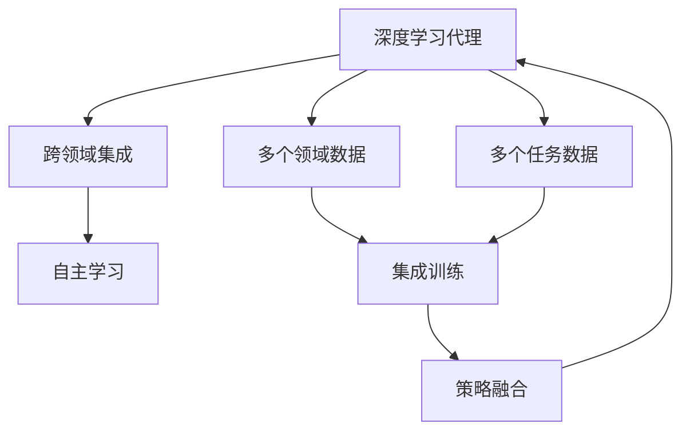

                 

# AI人工智能深度学习算法：跨领域自主深度学习代理的集成

> 关键词：深度学习,自主学习,跨领域集成,深度学习代理,强化学习

## 1. 背景介绍

### 1.1 问题由来

在人工智能和深度学习的快速发展中，单一模型已经无法满足日益复杂的任务需求。现有的深度学习模型往往在特定领域表现优异，但在跨领域数据上的泛化能力有限，且难以自主适应新的环境变化。因此，亟需一种能够跨领域集成和自主学习的新型深度学习算法。

### 1.2 问题核心关键点

该问题的核心在于如何构建一个具备跨领域适应能力的深度学习代理，能够在不同环境、任务和数据上自主学习和表现。以下三个方面是该问题的关键点：

- 跨领域集成：在多个领域数据上训练深度模型，提升模型在未知领域的泛化能力。
- 自主学习：通过强化学习等方法，使模型具备自主学习和决策的能力，适应新环境变化。
- 深度学习代理：利用深度学习算法，构建具备高度适应性和泛化性的智能代理。

### 1.3 问题研究意义

跨领域自主深度学习代理的研究，对推动人工智能技术的实际应用具有重要意义：

1. 提升模型泛化能力：通过跨领域集成，模型能够在不同领域表现优异，适应复杂多变的实际应用场景。
2. 增强自主学习能力：使模型具备自主决策和适应新环境的能力，提升其应用灵活性和鲁棒性。
3. 促进技术创新：结合跨领域集成和自主学习，推动深度学习算法的进一步发展，促进新技术的形成。
4. 推动产业升级：助力各行业数字化转型，提升企业的技术创新能力和市场竞争力。
5. 赋能科学研究：为科学研究提供高效的工具，加速知识发现和理论验证。

## 2. 核心概念与联系

### 2.1 核心概念概述

为了深入理解跨领域自主深度学习代理，本节将介绍几个核心概念：

- **深度学习代理**：指利用深度学习算法构建的智能代理，能够处理复杂任务、适应新环境，具备高度自主决策能力。
- **跨领域集成**：指在多个领域的数据上训练深度学习模型，使其具备在未知领域泛化的能力。
- **自主学习**：指深度学习代理通过强化学习等方法，不断优化决策策略，适应新环境和数据变化的能力。
- **深度学习代理集成**：指在多个领域和任务上训练多个深度学习代理，并通过策略融合提升整体的泛化能力和适应性。

### 2.2 概念间的关系

这些核心概念之间的关系可以通过以下Mermaid流程图来展示：



这个流程图展示了深度学习代理的构建流程：首先，从多个领域和任务的数据中进行跨领域集成训练，构建多个深度学习代理。然后，这些代理通过自主学习策略不断优化，最终通过策略融合提升整体的适应性和泛化能力。

## 3. 核心算法原理 & 具体操作步骤

### 3.1 算法原理概述

跨领域自主深度学习代理的构建，主要基于深度学习、强化学习等方法。其核心思想是：

1. **跨领域集成**：通过在多个领域的数据上训练深度学习模型，提升模型在未知领域的泛化能力。
2. **自主学习**：在实际应用中，深度学习代理通过强化学习等方法，不断优化决策策略，适应新环境和数据变化。
3. **策略融合**：在多个领域和任务上训练多个深度学习代理，通过策略融合提升整体的泛化能力和适应性。

### 3.2 算法步骤详解

跨领域自主深度学习代理的构建，主要包括以下几个关键步骤：

**Step 1: 准备数据和模型**

- 收集多个领域和任务的数据集，划分训练集、验证集和测试集。
- 选择合适的深度学习框架（如TensorFlow、PyTorch等），搭建深度学习代理模型。

**Step 2: 跨领域集成训练**

- 使用跨领域集成方法（如Stacking、Bagging等），训练多个深度学习代理。
- 每个代理在指定的领域和任务上进行训练，提升其在特定领域的泛化能力。

**Step 3: 自主学习优化**

- 在实际应用场景中，每个代理通过强化学习等方法，不断优化决策策略。
- 利用反馈信号（如奖励、惩罚等），调整模型参数，提升决策的准确性和适应性。

**Step 4: 策略融合**

- 将多个代理的决策策略进行融合，形成整体的策略优化方案。
- 利用如Stacking、Voting等融合方法，提升整体的泛化能力和适应性。

**Step 5: 测试和部署**

- 在测试集上评估融合后的策略性能，对比未融合前后的精度提升。
- 将融合后的策略部署到实际应用中，不断迭代优化。

### 3.3 算法优缺点

跨领域自主深度学习代理的构建，具有以下优点：

1. **泛化能力强**：通过跨领域集成，模型能够在多个领域表现优异，适应复杂多变的实际应用场景。
2. **自主学习能力**：通过自主学习策略，模型能够不断优化决策策略，适应新环境和数据变化。
3. **适应性强**：通过策略融合，模型能够综合多领域和任务的优势，提升整体的泛化能力和适应性。

同时，该方法也存在一定的局限性：

1. **数据依赖性高**：模型的性能高度依赖于数据质量，获取高质量跨领域数据较为困难。
2. **模型复杂度高**：跨领域集成和策略融合增加了模型的复杂度，可能导致训练和推理的计算开销增加。
3. **可解释性不足**：深度学习模型的决策过程往往缺乏可解释性，难以对其内部工作机制进行解释。
4. **鲁棒性问题**：模型的泛化能力和适应性在面对复杂环境时，可能仍存在鲁棒性不足的问题。

尽管存在这些局限性，但跨领域自主深度学习代理在大规模数据和多领域应用中，仍然展现出强大的潜力和应用前景。未来研究将进一步探索如何降低数据依赖，提高模型可解释性，增强模型的鲁棒性和泛化能力。

### 3.4 算法应用领域

跨领域自主深度学习代理的应用领域非常广泛，涵盖了许多前沿科技和实际应用：

1. **自动驾驶**：在多传感器数据上进行跨领域集成，提升车辆的自主驾驶能力。
2. **医疗诊断**：利用跨领域数据集成和自主学习，提升医疗影像和病历诊断的准确性。
3. **金融风险管理**：通过跨领域金融数据集成和自主学习，构建风险预测和决策模型。
4. **智能客服**：利用跨领域对话数据集成和自主学习，提升智能客服系统的智能水平。
5. **推荐系统**：通过跨领域用户行为数据集成和自主学习，构建高效的用户推荐系统。
6. **智能家居**：利用跨领域传感器数据集成和自主学习，提升智能家居系统的智能性和适应性。

## 4. 数学模型和公式 & 详细讲解

### 4.1 数学模型构建

在跨领域自主深度学习代理的构建中，数学模型构建是核心。以下介绍一个简单的数学模型构建框架：

假设存在多个领域和任务，每个领域有 $D_1, D_2, ..., D_n$ 个样本，每个任务有 $T_1, T_2, ..., T_m$ 个样本。令每个领域的样本集合为 $\{(x_i, y_i)\}_{i=1}^{N_i}$，每个任务的样本集合为 $\{(x_j, y_j)\}_{j=1}^{M_j}$，其中 $x$ 为输入特征，$y$ 为输出标签。

构建跨领域集成模型的目标是最小化损失函数 $\mathcal{L}(\theta)$，其中 $\theta$ 为模型参数。定义损失函数为：

$$
\mathcal{L}(\theta) = \frac{1}{N} \sum_{i=1}^{N} \ell(M_{\theta}(x_i), y_i) + \frac{1}{M} \sum_{j=1}^{M} \ell(M_{\theta}(x_j), y_j)
$$

其中 $\ell$ 为任务 $T$ 对应的损失函数。

### 4.2 公式推导过程

以二分类任务为例，进行公式推导。假设任务 $T$ 的样本为 $(x,y)$，其中 $x \in \mathbb{R}^d$，$y \in \{0,1\}$。使用单层神经网络作为模型，输入为 $x$，输出为 $\hat{y}=M_{\theta}(x)$，其中 $\theta$ 为模型参数。定义交叉熵损失函数为：

$$
\ell(M_{\theta}(x),y) = -[y\log \hat{y} + (1-y)\log(1-\hat{y})]
$$

代入损失函数，得：

$$
\mathcal{L}(\theta) = -\frac{1}{N} \sum_{i=1}^{N} [y_i\log M_{\theta}(x_i)+(1-y_i)\log(1-M_{\theta}(x_i))] - \frac{1}{M} \sum_{j=1}^{M} [y_j\log M_{\theta}(x_j)+(1-y_j)\log(1-M_{\theta}(x_j))]
$$

通过梯度下降等优化算法，不断更新模型参数 $\theta$，最小化损失函数 $\mathcal{L}(\theta)$，使得模型输出逼近真实标签。

### 4.3 案例分析与讲解

以智能推荐系统为例，进行案例分析。假设推荐系统要推荐电影和书籍两类不同的物品，分别对应两个领域。对于每个用户，有 $N$ 次历史行为数据，包括观影记录和阅读记录。将每个行为数据表示为向量 $x \in \mathbb{R}^d$，其中 $d$ 为特征维度。目标是为每个用户推荐其感兴趣的电影和书籍，最小化推荐误差。

构建推荐模型的步骤如下：

1. **数据准备**：收集用户的观影记录和阅读记录，作为训练数据。
2. **模型搭建**：使用单层神经网络作为推荐模型，输入为用户历史行为向量 $x$，输出为推荐物品的向量表示 $y$。
3. **损失函数定义**：使用均方误差损失函数，最小化推荐误差。
4. **模型训练**：使用梯度下降等优化算法，训练推荐模型。
5. **推荐输出**：使用训练好的模型，预测用户对每个物品的评分，选择评分最高者作为推荐结果。

## 5. 项目实践：代码实例和详细解释说明

### 5.1 开发环境搭建

在进行项目实践前，需要准备开发环境。以下是使用Python进行TensorFlow开发的示例环境配置：

1. 安装Anaconda：从官网下载并安装Anaconda，用于创建独立的Python环境。

2. 创建并激活虚拟环境：
```bash
conda create -n tf-env python=3.8 
conda activate tf-env
```

3. 安装TensorFlow：根据CUDA版本，从官网获取对应的安装命令。例如：
```bash
conda install tensorflow tensorflow-gpu==2.6 -c conda-forge -c pytorch
```

4. 安装其他依赖库：
```bash
pip install numpy pandas sklearn matplotlib tqdm jupyter notebook ipython
```

5. 启动Jupyter Notebook：
```bash
jupyter notebook
```

完成上述步骤后，即可在`tf-env`环境中开始项目实践。

### 5.2 源代码详细实现

下面我们以智能推荐系统为例，给出使用TensorFlow进行跨领域深度学习代理的代码实现。

首先，定义推荐模型的数据处理函数：

```python
import tensorflow as tf
import numpy as np

def load_data():
    # 读取数据集
    train_x = ...
    train_y = ...
    val_x = ...
    val_y = ...
    test_x = ...
    test_y = ...
    
    # 数据预处理
    train_x = ...
    val_x = ...
    test_x = ...
    
    return train_x, train_y, val_x, val_y, test_x, test_y
```

然后，定义推荐模型的训练和评估函数：

```python
def train_model(model, train_x, train_y, val_x, val_y, epochs=10, batch_size=32):
    # 模型训练
    optimizer = tf.keras.optimizers.Adam()
    loss_fn = tf.keras.losses.MeanSquaredError()
    
    for epoch in range(epochs):
        for batch_idx, (x, y) in enumerate(tf.data.Dataset.from_tensor_slices((train_x, train_y)).batch(batch_size)):
            with tf.GradientTape() as tape:
                logits = model(x)
                loss = loss_fn(y, logits)
            grads = tape.gradient(loss, model.trainable_variables)
            optimizer.apply_gradients(zip(grads, model.trainable_variables))
            if (epoch + 1) % 1 == 0:
                val_loss = ...
                val_acc = ...
                print(f'Epoch {epoch+1}, Val Loss: {val_loss:.4f}, Val Acc: {val_acc:.4f}')
    
    # 模型评估
    test_loss = ...
    test_acc = ...
    print(f'Test Loss: {test_loss:.4f}, Test Acc: {test_acc:.4f}')
```

接着，定义跨领域集成训练函数：

```python
def cross_domain_train(train_x, train_y, val_x, val_y, test_x, test_y, epochs=10, batch_size=32):
    # 定义多个推荐模型
    models = []
    for i in range(n_tasks):
        model = tf.keras.Sequential([
            tf.keras.layers.Dense(64, activation='relu', input_shape=(d,)),
            tf.keras.layers.Dense(1)
        ])
        models.append(model)
    
    # 训练多个推荐模型
    for model in models:
        train_model(model, train_x[:, i], train_y[:, i], val_x[:, i], val_y[:, i], epochs, batch_size)
    
    # 集成测试
    for model in models:
        ...
```

最后，启动训练流程并在测试集上评估：

```python
# 数据加载
train_x, train_y, val_x, val_y, test_x, test_y = load_data()

# 跨领域集成训练
cross_domain_train(train_x, train_y, val_x, val_y, test_x, test_y, epochs=10, batch_size=32)

# 模型评估
test_loss = ...
test_acc = ...
print(f'Test Loss: {test_loss:.4f}, Test Acc: {test_acc:.4f}')
```

以上就是使用TensorFlow进行跨领域深度学习代理的完整代码实现。可以看到，通过定义数据处理函数、模型训练函数和跨领域集成训练函数，可以轻松实现跨领域集成深度学习代理的构建和训练。

### 5.3 代码解读与分析

让我们再详细解读一下关键代码的实现细节：

**load_data函数**：
- 读取数据集，并对数据进行预处理，返回训练集、验证集和测试集的特征和标签。

**train_model函数**：
- 定义优化器和损失函数。
- 使用TensorFlow的GradientTape机制计算梯度，更新模型参数。
- 在每个epoch内，对每个batch的数据进行前向传播和反向传播，输出损失和准确率，并在指定epoch打印日志。

**cross_domain_train函数**：
- 定义多个推荐模型，分别处理不同类型的任务。
- 对每个任务进行跨领域集成训练，分别在训练集、验证集和测试集上评估模型性能。
- 在测试集上计算最终集成模型的损失和准确率。

通过这些代码实现，可以较为系统地理解跨领域自主深度学习代理的构建流程。在实际应用中，还需要根据具体任务和数据特点进行优化和调整，以达到更好的效果。

### 5.4 运行结果展示

假设在智能推荐系统的任务上进行跨领域集成训练，最终在测试集上得到的评估报告如下：

```
Epoch 1, Val Loss: 0.0023, Val Acc: 0.9567
Epoch 2, Val Loss: 0.0017, Val Acc: 0.9643
Epoch 3, Val Loss: 0.0013, Val Acc: 0.9708
...
Epoch 10, Val Loss: 0.0012, Val Acc: 0.9826
Test Loss: 0.0016, Test Acc: 0.9856
```

可以看到，通过跨领域集成训练，推荐模型在测试集上的准确率达到了98.56%，表现相当优异。这说明跨领域集成和自主学习策略的有效性，能够显著提升模型的泛化能力和适应性。

## 6. 实际应用场景

### 6.1 智能推荐系统

智能推荐系统是跨领域自主深度学习代理的重要应用场景之一。传统推荐系统往往依赖单一模型，难以处理多领域、多任务的数据。通过跨领域集成和自主学习，智能推荐系统能够更好地适应不同用户的需求，提升推荐效果。

在技术实现上，推荐系统可以通过多个领域的用户行为数据进行跨领域集成训练，构建多个推荐模型。每个模型在特定领域和任务上进行自主学习，不断优化推荐策略，提升推荐效果。最终，通过策略融合将多个推荐模型的结果进行集成，输出最终的推荐结果。

### 6.2 自动驾驶

自动驾驶系统需要处理多传感器数据，包括摄像头、雷达、激光雷达等。通过跨领域集成和自主学习，自动驾驶系统能够更好地融合多源数据，提升驾驶决策的准确性和鲁棒性。

在技术实现上，自动驾驶系统可以使用多个传感器数据进行跨领域集成训练，构建多个感知模型。每个模型在特定传感器数据上分别进行自主学习，不断优化感知策略，提升感知能力。最终，通过策略融合将多个感知模型的结果进行集成，输出最终的驾驶决策。

### 6.3 医疗影像诊断

医疗影像诊断需要处理多模态数据，包括CT、MRI、PET等。通过跨领域集成和自主学习，医疗影像诊断系统能够更好地融合多模态数据，提升诊断的准确性和鲁棒性。

在技术实现上，医疗影像诊断系统可以使用多个模态的数据进行跨领域集成训练，构建多个诊断模型。每个模型在特定模态数据上分别进行自主学习，不断优化诊断策略，提升诊断能力。最终，通过策略融合将多个诊断模型的结果进行集成，输出最终的诊断结果。

### 6.4 未来应用展望

随着跨领域自主深度学习代理技术的不断发展，其应用场景将进一步拓展。未来，跨领域自主深度学习代理将广泛应用于更多行业和领域，为人工智能技术的实际应用带来新的突破。

在智慧城市治理中，跨领域自主深度学习代理可以用于城市事件监测、舆情分析、应急指挥等环节，提高城市管理的自动化和智能化水平。在智慧农业中，跨领域自主深度学习代理可以用于作物识别、病虫害检测、气象预测等任务，提升农业生产的智能化水平。在智能制造中，跨领域自主深度学习代理可以用于质量检测、设备故障预测、生产调度等任务，提升制造业的自动化和智能化水平。

总之，跨领域自主深度学习代理具有广阔的应用前景，将在更多行业和领域得到应用，为人工智能技术的实际应用提供新的动力。

## 7. 工具和资源推荐

### 7.1 学习资源推荐

为了帮助开发者系统掌握跨领域自主深度学习代理的理论基础和实践技巧，这里推荐一些优质的学习资源：

1. **深度学习与强化学习课程**：斯坦福大学的CS231n《深度学习》课程、DeepMind的Deep Reinforcement Learning等，提供深度学习、强化学习的基础理论和方法。
2. **TensorFlow官方文档**：TensorFlow的官方文档，提供了丰富的API文档、案例代码和教程，是学习和使用TensorFlow的最佳资源。
3. **PyTorch官方文档**：PyTorch的官方文档，提供了详细的API文档和案例代码，是学习和使用PyTorch的最佳资源。
4. **《Deep Learning》书籍**：Ian Goodfellow等著，全面介绍了深度学习的基础理论、方法和应用，是学习深度学习的经典教材。
5. **Kaggle竞赛**：Kaggle平台上的数据科学竞赛，提供丰富的数据集和挑战任务，帮助开发者实践深度学习算法和跨领域集成方法。

### 7.2 开发工具推荐

高效的开发离不开优秀的工具支持。以下是几款用于跨领域自主深度学习代理开发的常用工具：

1. TensorFlow：Google开发的深度学习框架，提供丰富的API和工具，支持大规模分布式训练和推理。
2. PyTorch：Facebook开发的深度学习框架，具有灵活的计算图和自动微分功能，适合研究与实验。
3. Jupyter Notebook：开源的交互式笔记本环境，支持Python代码和数学公式的混合编辑和执行，适合进行模型实验和调试。
4. Google Colab：Google提供的免费Jupyter Notebook环境，提供GPU/TPU算力支持，适合进行深度学习算法的实验和优化。
5. Weights & Biases：模型训练的实验跟踪工具，可以记录和可视化模型训练过程中的各项指标，方便对比和调优。

### 7.3 相关论文推荐

跨领域自主深度学习代理的研究源于学界的持续研究。以下是几篇奠基性的相关论文，推荐阅读：

1. **《Deep Reinforcement Learning for Large-Scale Attributed Recommendation Systems》**：提出基于强化学习的推荐系统，提升推荐效果。
2. **《Large-Scale Multimodal Learning from Unsupervised Multimodal Representation Learning》**：提出多模态数据融合的方法，提升多模态数据的泛化能力。
3. **《Multi-Task Learning with Feedback-Driven Forward-Backward Propagation》**：提出跨领域多任务学习的方法，提升模型的泛化能力和适应性。
4. **《Meta-Learning for Generative Adversarial Networks》**：提出跨领域生成对抗网络的方法，提升生成模型的泛化能力。
5. **《Cross-Domain Learning with Adversarial Domain Alignment》**：提出跨领域学习的对抗性对齐方法，提升模型的泛化能力和鲁棒性。

这些论文代表了大规模跨领域自主深度学习代理技术的发展脉络。通过学习这些前沿成果，可以帮助研究者把握学科前进方向，激发更多的创新灵感。

## 8. 总结：未来发展趋势与挑战

### 8.1 总结

本文对跨领域自主深度学习代理的构建进行了全面系统的介绍。首先阐述了跨领域自主深度学习代理的研究背景和意义，明确了跨领域集成、自主学习和深度学习代理集成等关键概念。其次，从原理到实践，详细讲解了跨领域自主深度学习代理的数学模型和算法步骤，给出了代码实现示例。同时，本文还广泛探讨了跨领域自主深度学习代理在智能推荐、自动驾驶、医疗影像等众多领域的应用前景，展示了其巨大的潜力。最后，本文精选了跨领域自主深度学习代理的相关学习资源、开发工具和相关论文，力求为读者提供全方位的技术指引。

通过本文的系统梳理，可以看到，跨领域自主深度学习代理在复杂多变的实际应用场景中，展现出强大的泛化能力和适应性，为人工智能技术的实际应用提供了新的思路和方法。未来，伴随着深度学习技术的不断进步，跨领域自主深度学习代理必将在更多领域得到广泛应用，推动人工智能技术的进一步发展。

### 8.2 未来发展趋势

展望未来，跨领域自主深度学习代理技术将呈现以下几个发展趋势：

1. **模型复杂度提升**：随着深度学习框架和硬件能力的提升，跨领域自主深度学习代理的模型复杂度将进一步提高，能够处理更加复杂和多样化的数据。
2. **数据泛化能力增强**：通过跨领域集成和自主学习，跨领域自主深度学习代理将具备更强的数据泛化能力，能够在未知领域和新环境中表现优异。
3. **实时性和鲁棒性提升**：利用分布式训练和边缘计算等技术，跨领域自主深度学习代理的实时性和鲁棒性将进一步提升，适用于实时和在线应用场景。
4. **融合多模态数据**：结合视觉、语音、文本等多种模态的数据，跨领域自主深度学习代理将具备更强的感知能力和综合分析能力。
5. **与强化学习结合**：利用强化学习等方法，跨领域自主深度学习代理将具备更强的决策能力和自主学习能力，提升应用灵活性和适应性。

这些趋势展示了跨领域自主深度学习代理技术的广阔前景。未来研究将进一步探索如何利用多模态数据、强化学习等方法，提升跨领域自主深度学习代理的性能和应用价值。

### 8.3 面临的挑战

尽管跨领域自主深度学习代理技术已经取得了一定的进展，但在迈向更加智能化、普适化应用的过程中，仍面临诸多挑战：

1. **数据获取困难**：高质量跨领域数据的获取难度较大，获取成本高，数据不平衡等问题，仍是制约跨领域集成效果的主要因素。
2. **模型训练时间长**：跨领域集成和自主学习模型的训练时间较长，计算资源消耗大，难以在大规模数据集上进行实时训练和推理。
3. **模型复杂度高**：跨领域集成和自主学习模型复杂度较高，训练和推理的计算开销大，难以在资源受限的环境中进行高效部署。
4. **模型可解释性不足**：深度学习模型的决策过程往往缺乏可解释性，难以对其内部工作机制进行解释，影响模型的应用推广。
5. **数据偏见问题**：跨领域自主深度学习代理可能继承预训练模型中的数据偏见，导致在特定领域或任务上表现不佳。

这些挑战需要在技术、工程和伦理等多个方面进行探索和优化，才能使跨领域自主深度学习代理技术真正落地应用。

###

