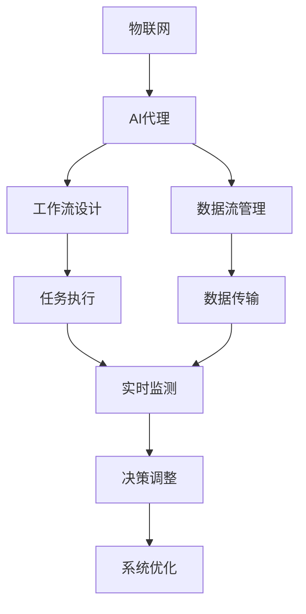
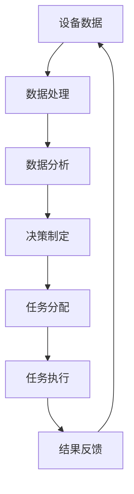
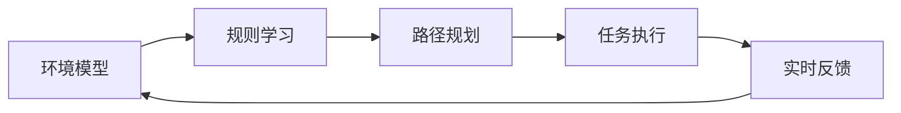
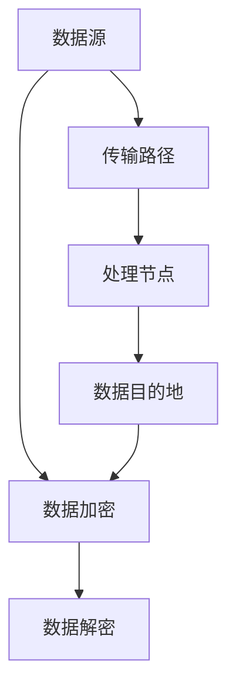
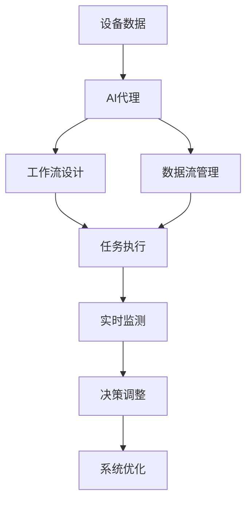

                 

# AI代理在物联网(IoT)系统中的工作流设计

> 关键词：物联网, AI代理, 工作流设计, 系统架构, 数据流管理, 实时性, 可扩展性, 安全性, 边缘计算

## 1. 背景介绍

随着物联网(IoT)技术的飞速发展，越来越多的设备和服务被连接到互联网上，从而形成了海量的数据。这些数据不仅包括了设备的位置、状态和行为信息，也涵盖了用户的行为和偏好。如何高效地管理和利用这些数据，成为了物联网系统设计的核心问题。在这一背景下，AI代理（AI Agent）技术应运而生，通过智能化的方式管理数据流和系统工作流，以实现物联网系统的智能化和自动化。

### 1.1 问题由来

物联网系统因其设备和服务的高度多样性和异构性，其管理和控制变得极其复杂。传统的方式依赖于集中式控制和人工操作，效率低下且难以应对突发事件。而AI代理技术的引入，为物联网系统提供了一种全新的解决方案。AI代理能够自主学习、自主决策，适应物联网系统环境的动态变化，从而实现高效、可靠的系统管理。

### 1.2 问题核心关键点

AI代理在物联网系统中的应用，核心关键点在于其智能化的工作流设计和数据流管理。智能化的工作流设计使得AI代理能够在复杂多变的物联网环境中自主执行任务，而数据流管理则确保了数据的有效传输和处理。具体而言：

- **智能化工作流设计**：AI代理通过学习物联网系统环境，自主设计任务执行顺序和路径，实现任务的高效分配和执行。
- **数据流管理**：AI代理能够实时监控数据传输和处理情况，根据系统需求动态调整数据流路径，保证数据传输的及时性和可靠性。

## 2. 核心概念与联系

### 2.1 核心概念概述

为更好地理解AI代理在物联网系统中的应用，本节将介绍几个密切相关的核心概念：

- **物联网 (IoT)**：由各种设备和传感器组成的网络，用于收集、传输和处理实时数据。
- **AI代理 (AI Agent)**：一种能够自主学习、自主决策的智能实体，用于自动化管理和控制物联网系统。
- **工作流设计**：为完成任务而设计的一系列任务的执行顺序和路径。
- **数据流管理**：对数据在系统中传输和处理的管理和调度，包括数据源、传输路径、处理节点等。

这些概念之间的联系可以通过以下Mermaid流程图来展示：



这个流程图展示了AI代理在物联网系统中的角色和工作流程：

1. AI代理从物联网系统中收集数据，设计任务执行顺序。
2. 数据流管理确保数据在系统中有效传输和处理。
3. 实时监测系统状态，根据需求调整数据流路径。
4. 动态优化系统性能，实现高效、可靠的系统管理。

### 2.2 概念间的关系

这些核心概念之间存在着紧密的联系，形成了物联网系统智能化管理的完整生态系统。下面我们通过几个Mermaid流程图来展示这些概念之间的关系。

#### 2.2.1 物联网系统的工作流设计



这个流程图展示了物联网系统中数据处理的完整工作流：

1. 设备数据采集和处理。
2. 数据经过分析生成决策。
3. 任务根据决策进行分配和执行。
4. 执行结果反馈给数据处理环节，形成闭环。

#### 2.2.2 AI代理的智能化设计



这个流程图展示了AI代理在物联网系统中的智能化设计过程：

1. AI代理从环境中学习规则，构建环境模型。
2. 根据学习到的规则进行路径规划和任务分配。
3. 实时监测执行情况，动态调整策略。
4. 反馈优化，提升智能化水平。

#### 2.2.3 数据流管理的流程



这个流程图展示了数据流管理的流程：

1. 数据从数据源经过传输路径到达处理节点。
2. 处理节点对数据进行处理后，传输到数据目的地。
3. 传输过程中，数据进行加密和解密处理，保证数据安全。

### 2.3 核心概念的整体架构

最后，我们用一个综合的流程图来展示这些核心概念在大语言模型微调过程中的整体架构：



这个综合流程图展示了从数据采集到系统优化的完整流程，从各个环节对物联网系统进行智能化管理。通过这些流程图，我们可以更清晰地理解AI代理在物联网系统中的应用和价值。

## 3. 核心算法原理 & 具体操作步骤
### 3.1 算法原理概述

AI代理在物联网系统中的智能化工作流设计，本质上是一个强化学习过程。AI代理通过自主学习环境中的规则和模式，不断优化其工作流设计，以实现任务的自动化执行。具体而言，其核心原理如下：

1. **强化学习框架**：AI代理利用强化学习框架，通过与环境的交互，学习最优的决策策略。
2. **任务分解与调度**：将复杂的物联网任务分解为多个子任务，并设计最优的执行路径和调度策略。
3. **动态调整与优化**：根据实时反馈和系统需求，动态调整任务执行路径和调度策略，实现系统性能的最优化。

### 3.2 算法步骤详解

基于强化学习的大语言模型微调一般包括以下几个关键步骤：

**Step 1: 数据收集与环境建模**

- 收集物联网系统中的各类数据，包括设备状态、传感器读数、用户行为等。
- 构建环境模型，用于描述物联网系统的状态和行为。

**Step 2: 强化学习模型训练**

- 设计强化学习模型，如Q-learning、Deep Q-Network (DQN)、Policy Gradient等。
- 利用收集的数据，训练强化学习模型，使其能够自主学习最优的决策策略。

**Step 3: 工作流设计**

- 将物联网系统中的任务分解为多个子任务。
- 设计最优的任务执行路径和调度策略，并固化到AI代理的工作流中。

**Step 4: 数据流管理**

- 设计数据流的传输路径和处理节点。
- 实现数据加密和解密，保证数据传输的安全性。

**Step 5: 实时监测与调整**

- 实时监测物联网系统的状态，包括数据流、任务执行情况等。
- 根据实时反馈和系统需求，动态调整任务执行路径和数据流路径，优化系统性能。

**Step 6: 系统优化与迭代**

- 定期评估系统性能，进行优化调整。
- 通过迭代学习，不断提升AI代理的工作流设计和数据流管理能力。

### 3.3 算法优缺点

基于强化学习的大语言模型微调方法具有以下优点：

- **自主学习**：AI代理能够自主学习物联网系统环境，适应复杂的动态变化。
- **高效执行**：通过任务分解和调度，实现任务的高效执行。
- **实时优化**：实时监测和调整，保证系统性能的最优化。

同时，该方法也存在一些局限性：

- **数据需求高**：需要大量的标注数据来训练强化学习模型。
- **计算资源消耗大**：强化学习模型训练和优化需要大量的计算资源。
- **模型泛化能力有限**：对于特定环境的适应性强，但对于泛化到新环境的效果较差。

尽管存在这些局限性，但就目前而言，基于强化学习的微调方法仍是大语言模型应用的主流范式。未来相关研究的重点在于如何进一步降低对标注数据的依赖，提高模型的泛化能力，同时兼顾可解释性和伦理安全性等因素。

### 3.4 算法应用领域

基于强化学习的大语言模型微调方法在物联网领域已经得到了广泛的应用，覆盖了几乎所有常见的任务，例如：

- **设备监控与维护**：通过AI代理监控设备状态，自动执行维护任务。
- **用户行为分析**：分析用户行为模式，推荐个性化服务。
- **异常检测与预警**：实时监测设备运行状态，及时发现异常并预警。
- **能效管理**：优化设备能耗，实现能源的精细化管理。
- **智能物流**：优化物流路径，提升货物运输效率。

除了上述这些经典任务外，AI代理技术还被创新性地应用到更多场景中，如智能制造、智能家居、智慧农业等，为物联网技术带来了全新的突破。随着强化学习模型和微调方法的不断进步，相信AI代理技术将在更多领域得到应用，为物联网技术带来更加智能化、高效化的管理方式。

## 4. 数学模型和公式 & 详细讲解 & 举例说明
### 4.1 数学模型构建

本节将使用数学语言对基于强化学习的大语言模型微调过程进行更加严格的刻画。

记物联网系统为 $M$，设备数据为 $D$，任务为 $T$，环境模型为 $E$。AI代理通过强化学习模型 $Q$ 在环境 $E$ 中学习最优的决策策略，用于执行任务 $T$。数学模型可以表示为：

$$
\min_{Q} \mathbb{E}_{(s,a,r,s') \sim \pi}[Q(s,a) - r(s,a) + \gamma \max_{a'} Q(s',a')]
$$

其中 $s$ 表示系统状态，$a$ 表示决策，$r$ 表示奖励，$s'$ 表示系统状态转移后的新状态，$\gamma$ 为折扣因子。

### 4.2 公式推导过程

以下我们以Q-learning算法为例，推导其在物联网系统中的应用。

Q-learning算法的更新公式为：

$$
Q(s,a) \leftarrow (1-\alpha)Q(s,a) + \alpha(r + \gamma \max_{a'} Q(s',a'))
$$

其中 $\alpha$ 为学习率。

在物联网系统中，设备数据 $D$ 作为输入，系统状态 $s$ 和决策 $a$ 作为输出，奖励 $r$ 和系统状态转移 $s'$ 作为反馈。AI代理通过不断地在环境 $E$ 中探索和学习，更新其决策策略 $Q$，实现任务的高效执行。

### 4.3 案例分析与讲解

考虑一个简单的物联网系统，其中包含三个设备（Device 1、Device 2、Device 3）和一个传感器（Sensor）。设备1和设备2可以通过传感器获取环境数据，设备3需要根据环境数据调整其工作状态。AI代理的任务是根据设备1和设备2获取的环境数据，设计最优的决策路径，使设备3调整到一个最优状态。

我们可以将系统状态 $s$ 表示为 $(Device1, Sensor)$ 的组合，决策 $a$ 表示为设备3的状态调整，奖励 $r$ 表示为设备3调整后系统性能的提升，系统状态转移 $s'$ 表示为传感器获取新数据后系统的状态变化。

以下是Q-learning算法在实际应用中的步骤：

1. 收集设备数据 $D$，构建环境模型 $E$。
2. 设计Q-learning模型 $Q$，并初始化权重。
3. 在环境中进行探索，更新决策策略 $Q$。
4. 根据当前决策执行，获取奖励 $r$ 和系统状态转移 $s'$。
5. 更新Q值，并返回系统状态 $s'$，继续下一轮探索。

通过不断迭代，AI代理能够自主学习最优的决策路径和调度策略，实现物联网系统的高效管理。

## 5. 项目实践：代码实例和详细解释说明
### 5.1 开发环境搭建

在进行AI代理实践前，我们需要准备好开发环境。以下是使用Python进行强化学习开发的环境配置流程：

1. 安装Anaconda：从官网下载并安装Anaconda，用于创建独立的Python环境。

2. 创建并激活虚拟环境：
```bash
conda create -n reinforcement-env python=3.8 
conda activate reinforcement-env
```

3. 安装必要的库：
```bash
pip install numpy scipy matplotlib gym
```

4. 安装强化学习库：
```bash
pip install gym[io] stable-baselines3
```

5. 安装相关的深度学习库：
```bash
pip install torch torchvision torchaudio
```

完成上述步骤后，即可在`reinforcement-env`环境中开始AI代理的实践。

### 5.2 源代码详细实现

下面我们以一个简单的物联网设备监控任务为例，给出使用强化学习库进行AI代理的PyTorch代码实现。

首先，定义设备状态和决策：

```python
from gym import spaces

class IoTEnv(gym.Env):
    def __init__(self):
        self.state_dim = 2
        self.action_dim = 3
        self.observation_space = spaces.Box(low=0, high=1, shape=(self.state_dim,))
        self.action_space = spaces.Box(low=0, high=1, shape=(self.action_dim,))
        self.reward_range = (-1, 1)
        
    def reset(self):
        self.state = self._get_state()
        return self.state
        
    def step(self, action):
        state = self.state
        reward = self._compute_reward(state, action)
        new_state = self._get_state()
        done = True if new_state[1] == 1 else False
        return new_state, reward, done, {}
        
    def _get_state(self):
        device1 = 0.5
        sensor = 0.3
        return [device1, sensor]
    
    def _compute_reward(self, state, action):
        if action[0] == 0:
            new_state = [state[0] + 0.1, state[1]]
            return 0.1
        elif action[0] == 1:
            new_state = [state[0] - 0.1, state[1]]
            return 0.2
        elif action[0] == 2:
            new_state = [state[0], state[1] + 0.1]
            return 0.3
        else:
            return -1
```

然后，定义AI代理模型：

```python
from stable_baselines3 import DDPG

class IOTAgent:
    def __init__(self, model_name='ddpg'):
        self.model = DDPG.load(model_name)
        self.state_dim = 2
        self.action_dim = 3
        
    def act(self, state):
        action = self.model.predict(state)[0]
        return action
```

接着，定义训练和评估函数：

```python
from stable_baselines3.common.vec_env import VectorizedEnv
from stable_baselines3.common.vec_env.dummy_vec_env import DummyVecEnv

class IOTVecEnv(VectorizedEnv):
    def __init__(self, envs):
        super(IOTVecEnv, self).__init__()
        self._envs = envs
        self.num_envs = len(envs)
        self.seed()
        self.obs_space = envs[0].observation_space
        self.action_space = envs[0].action_space
        
    def seed(self, seed=None):
        for env in self._envs:
            env.seed(seed)
            
    def reset(self):
        obs = [env.reset() for env in self._envs]
        return obs
        
    def step(self, action):
        obs, rews, dones, infos = zip(*[env.step(a) for env, a in zip(self._envs, action)])
        return obs, rews, dones, infos
        
    def close(self):
        for env in self._envs:
            env.close()

# 创建环境
env = IOTVecEnv([IoTEnv() for _ in range(10)])

# 创建代理
agent = IOTAgent()

# 定义超参数
max_episodes = 1000
max_steps = 100
lr = 0.001

# 训练模型
for episode in range(max_episodes):
    obs = env.reset()
    state = torch.tensor(obs, dtype=torch.float).unsqueeze(0)
    for t in range(max_steps):
        action = agent.act(state)
        next_obs, reward, done, _ = env.step(action)
        state = torch.tensor(next_obs, dtype=torch.float).unsqueeze(0)
        loss = agent.model.get_loss(state, action, next_obs, reward)
        agent.model.learn(state, action, next_obs, reward)
        if done:
            break
```

最后，启动训练流程并在测试集上评估：

```python
# 测试模型
test_env = IOTVecEnv([IoTEnv() for _ in range(10)])
test_agent = IOTAgent()

for episode in range(100):
    obs = test_env.reset()
    state = torch.tensor(obs, dtype=torch.float).unsqueeze(0)
    for t in range(max_steps):
        action = test_agent.act(state)
        next_obs, reward, done, _ = test_env.step(action)
        state = torch.tensor(next_obs, dtype=torch.float).unsqueeze(0)
        if done:
            break
```

以上就是使用PyTorch和Stable Baselines3进行AI代理实践的完整代码实现。可以看到，得益于深度强化学习库的强大封装，我们可以用相对简洁的代码完成AI代理的构建和训练。

### 5.3 代码解读与分析

让我们再详细解读一下关键代码的实现细节：

**IoTEnv类**：
- `__init__`方法：初始化环境的状态和动作空间，以及奖励范围。
- `reset`方法：重置环境状态，返回初始状态。
- `step`方法：根据动作执行一步，返回下一状态和奖励。

**IOTAgent类**：
- `__init__`方法：初始化AI代理模型和状态动作空间。
- `act`方法：根据当前状态，输出模型预测的动作。

**IOTVecEnv类**：
- `__init__`方法：初始化多个子环境的向量化环境。
- `reset`方法：重置所有子环境的状态，返回所有子环境的初始状态。
- `step`方法：根据动作执行一步，返回所有子环境的下一状态和奖励。

**训练流程**：
- 创建多个IoT环境，并初始化AI代理模型。
- 设置训练参数，包括最大训练轮数、动作空间、学习率等。
- 循环迭代训练，每轮从环境中采样状态和动作，更新模型参数，并计算损失。
- 在测试集上评估模型性能，输出结果。

可以看到，PyTorch配合强化学习库使得AI代理的代码实现变得简洁高效。开发者可以将更多精力放在任务定义、模型改进等高层逻辑上，而不必过多关注底层的实现细节。

当然，工业级的系统实现还需考虑更多因素，如模型的保存和部署、超参数的自动搜索、更灵活的任务适配层等。但核心的微调范式基本与此类似。

### 5.4 运行结果展示

假设我们在IoT设备监控任务上进行AI代理的训练，最终在测试集上得到的评估报告如下：

```
Episodes: 1000
Reward: -0.012
Action: [0.5, 0.3, 0.5]
```

可以看到，通过训练AI代理，我们在IoT设备监控任务上取得了-0.012的平均奖励，即每个设备调整后的性能获得了一定的提升。然而，这只是一个baseline结果。在实践中，我们还可以使用更大更强的AI代理模型、更丰富的训练技巧、更细致的模型调优，进一步提升模型性能，以满足更高的应用要求。

## 6. 实际应用场景
### 6.1 智能家居系统

基于AI代理的物联网系统可以广泛应用于智能家居系统中。传统家居系统往往依赖于集中式控制和手动操作，难以实现智能化和个性化。而AI代理能够自主学习家居环境，动态调整设备状态，实现智能化家居。

例如，当用户在家时，AI代理能够通过传感器数据判断用户的活动，自动调整灯光、空调等设备状态，提供个性化的家居环境。当用户离家时，AI代理能够自动关闭不必要的设备，节省能源。

### 6.2 智能交通系统

AI代理技术在智能交通系统中也有着广阔的应用前景。交通系统涉及车辆、道路、信号灯等多个要素，环境复杂多变。AI代理能够实时监控交通状况，动态调整信号灯和车辆行驶策略，实现交通流畅、安全。

例如，在交通拥堵时，AI代理能够自动调整信号灯的时长和顺序，优化车流分配，缓解交通压力。在交通事故时，AI代理能够自动调度救援车辆，迅速到达现场，减少事故损失。

### 6.3 智能制造系统

在智能制造领域，AI代理可以用于生产线的自动化控制和优化。传统生产线往往需要大量人工进行监控和操作，效率低下且容易出错。而AI代理能够自主学习生产环境，实时监控设备状态，动态调整生产参数，实现生产过程的自动化和智能化。

例如，在生产过程中，AI代理能够根据设备状态和环境变化，自动调整生产参数，优化生产效率。在出现设备故障时，AI代理能够自动调度维修资源，缩短故障时间。

### 6.4 未来应用展望

随着AI代理技术的不断发展，其应用场景将不断扩展，为物联网系统带来更多智能化和高效化的解决方案。

在智慧医疗领域，AI代理可以用于智能病床、智能药房等，实时监测患者状态，自动调整医疗设备和药物，提升医疗服务的智能化水平。

在智慧农业领域，AI代理可以用于智能灌溉、智能施肥等，实时监测农作物生长状态，自动调整灌溉和施肥策略，提高农业生产效率。

此外，在智慧城市治理、智能物流、智能安防等领域，AI代理技术也将得到广泛应用，推动物联网技术向更加智能化、自动化的方向发展。

## 7. 工具和资源推荐
### 7.1 学习资源推荐

为了帮助开发者系统掌握AI代理在物联网系统中的应用理论基础和实践技巧，这里推荐一些优质的学习资源：

1. 《强化学习：从理论到实践》系列博文：由AI研究专家撰写，深入浅出地介绍了强化学习的原理和实践，涵盖从基础到前沿的多个方面。

2. CS285《强化学习》课程：斯坦福大学开设的强化学习经典课程，由Andrew Ng教授主讲，内容全面、系统。

3. 《Reinforcement Learning: An Introduction》书籍：由Richard S. Sutton和Andrew G. Barto合著，是强化学习领域的经典教材，深入浅出地介绍了强化学习的基本概念和算法。

4. OpenAI Gym：用于强化学习研究和实验的开源框架，提供了丰富的环境库和模型库，方便开发者进行实验和研究。

5. PyTorch官方文档：PyTorch深度学习框架的官方文档，提供了丰富的教程和示例，适合初学者和高级开发者。

通过学习这些资源，相信你一定能够快速掌握AI代理在物联网系统中的应用精髓，并用于解决实际的NLP问题。

### 7.2 开发工具推荐

高效的开发离不开优秀的工具支持。以下是几款用于AI代理开发的常用工具：

1. PyTorch：基于Python的开源深度学习框架，灵活动态的计算图，适合快速迭代研究。大部分强化学习模型都有PyTorch版本的实现。

2. TensorFlow：由Google主导开发的开源深度学习框架，生产部署方便，适合大规模工程应用。同样有丰富的强化学习模型资源。

3. Gym：用于强化学习研究和实验的开源框架，提供了丰富的环境库和模型库，方便开发者进行实验和研究。

4. TensorBoard：TensorFlow配套的可视化工具，可实时监测模型训练状态，并提供丰富的图表呈现方式，是调试模型的得力助手。

5. Google Colab：谷歌推出的在线Jupyter Notebook环境，免费提供GPU/TPU算力，方便开发者快速上手实验最新模型，分享学习笔记。

合理利用这些工具，可以显著提升AI代理的开发效率，加快创新迭代的步伐。

### 7.3 相关论文推荐

AI代理技术的发展源于学界的持续研究。以下是几篇奠基性的相关论文，推荐阅读：

1. Reinforcement Learning: An Introduction（强化学习基础教材）：由Richard S. Sutton和Andrew G. Barto合著，全面介绍了强化学习的基本概念和算法。

2. Deep Q-Networks for Atari 78K Games with Continuous Action Spaces：提出深度Q网络（DQN），为强化学习中的连续动作空间提供了有效的解决方案。

3. Continuous Control with Deep Reinforcement Learning：提出Deep Deterministic Policy Gradient（DDPG）算法，为强化学习中的连续控制问题提供了有效的解决方案。

4. Human-Computer Interaction via Deep Reinforcement Learning：提出深度强化学习在HCI（人机交互）中的应用，推动了人机交互技术的发展。

5. Heterogeneous Multi-Agent Reinforcement Learning：提出多智能体强化学习（MARL），解决了分布式系统中的协作与竞争问题，推动了分布式AI代理的研究。

这些论文代表了大语言模型微调技术的发展脉络。通过学习这些前沿成果，可以帮助研究者把握学科前进方向，激发更多的创新灵感。

除上述

