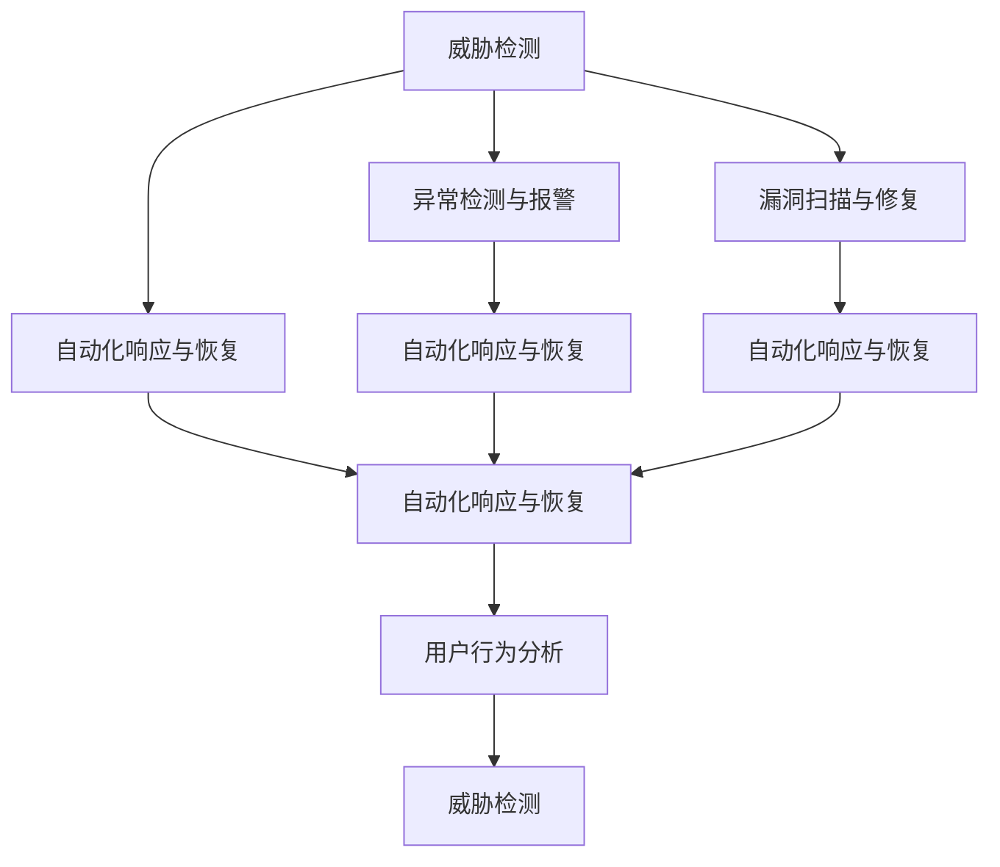
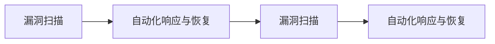
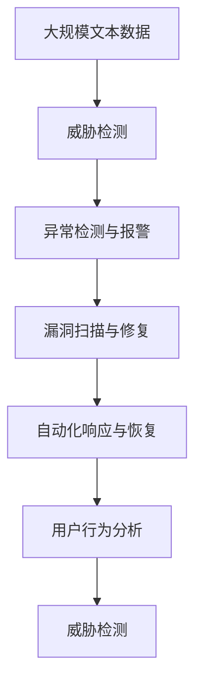
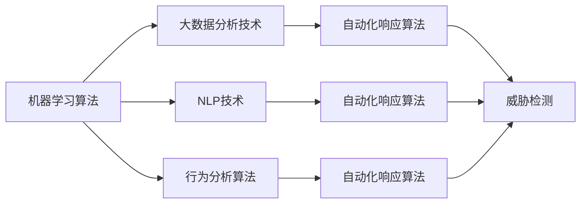
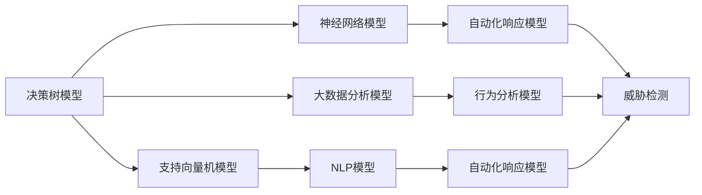

                 

# AI代理在网络安全中的工作流及应用实践

> 关键词：网络安全, AI代理, 威胁检测, 异常检测, 漏洞扫描, 自动化响应

## 1. 背景介绍

### 1.1 问题由来

随着互联网的快速普及和信息技术的广泛应用，网络安全问题日益严峻。传统的网络安全手段，如防火墙、IDS/IPS、加密技术等，虽然能够在一定程度上保障网络安全，但面对复杂多样的网络威胁，显得力不从心。

近年来，人工智能（AI）技术在网络安全领域得到广泛应用，尤其是AI代理（AI-Agent）在威胁检测、异常检测、漏洞扫描等方面发挥了重要作用。AI代理作为网络安全体系的重要组成部分，能够自主学习网络行为模式，识别异常行为，并自动化响应威胁，显著提升了网络安全的防御能力和应急响应效率。

### 1.2 问题核心关键点

AI代理在网络安全中的应用主要包括以下几个核心关键点：

- **威胁检测与识别**：利用机器学习算法和大数据分析技术，自动识别网络中的潜在威胁，如恶意流量、钓鱼网站、钓鱼邮件等。
- **异常检测与报警**：通过分析网络行为，检测异常行为，及时发出告警，防止安全事件的发生。
- **漏洞扫描与修复**：利用自动化技术扫描网络设备和系统，发现安全漏洞，并提供修复建议。
- **自动化响应与恢复**：在检测到安全事件后，自动触发应急响应流程，如隔离受攻击设备、封堵攻击入口等，快速恢复网络正常运行。
- **用户行为分析**：分析用户行为模式，识别异常行为，防止内部威胁和事故发生。

这些核心关键点相互配合，构成了一个完整的AI代理网络安全体系，能够有效地保护网络免受各种威胁的侵害。

### 1.3 问题研究意义

AI代理在网络安全中的应用具有重要的研究意义：

- **提高防御能力**：利用AI技术，实时分析网络流量和行为，快速识别并阻止潜在威胁，大幅提高网络防御能力。
- **降低安全成本**：通过自动化安全管理，减少人工干预，降低安全运维成本。
- **提升响应效率**：快速响应网络威胁，缩短安全事件处理时间，减少损失。
- **加强安全防护**：通过持续学习和进化，AI代理能够不断适应新出现的威胁，提升网络安全防护水平。
- **增强数据利用**：将AI代理与大数据技术结合，实时分析海量数据，获取更多有价值的安全洞察。

## 2. 核心概念与联系

### 2.1 核心概念概述

为更好地理解AI代理在网络安全中的应用，本节将介绍几个密切相关的核心概念：

- **AI代理（AI-Agent）**：基于AI技术的自动化网络安全监控和防护工具，能够自主学习网络行为模式，识别异常行为，并自动化响应威胁。
- **威胁检测与识别**：利用机器学习算法和大数据分析技术，自动识别网络中的潜在威胁，如恶意流量、钓鱼网站、钓鱼邮件等。
- **异常检测与报警**：通过分析网络行为，检测异常行为，及时发出告警，防止安全事件的发生。
- **漏洞扫描与修复**：利用自动化技术扫描网络设备和系统，发现安全漏洞，并提供修复建议。
- **自动化响应与恢复**：在检测到安全事件后，自动触发应急响应流程，如隔离受攻击设备、封堵攻击入口等，快速恢复网络正常运行。
- **用户行为分析**：分析用户行为模式，识别异常行为，防止内部威胁和事故发生。

这些核心概念之间存在着紧密的联系，构成了AI代理在网络安全中的应用框架。以下通过一个Mermaid流程图来展示这些概念之间的关系：



这个流程图展示了AI代理在网络安全中的关键组件及其关系：

1. **威胁检测**：识别网络中的潜在威胁，为后续的异常检测、漏洞扫描、自动化响应提供基础数据。
2. **异常检测与报警**：检测异常行为并发出告警，防止安全事件的发生。
3. **漏洞扫描与修复**：扫描网络设备和系统，发现安全漏洞并及时修复。
4. **自动化响应与恢复**：自动触发应急响应流程，快速恢复网络正常运行。
5. **用户行为分析**：分析用户行为模式，识别异常行为，防止内部威胁和事故发生。

这些组件相互配合，构成了一个完整的AI代理网络安全体系，能够有效地保护网络免受各种威胁的侵害。

### 2.2 概念间的关系

这些核心概念之间存在着紧密的联系，构成了AI代理在网络安全中的应用框架。以下通过几个Mermaid流程图来展示这些概念之间的关系。

#### 2.2.1 AI代理的工作流


这个流程图展示了AI代理在网络安全中的工作流，包括威胁检测、异常检测与报警、漏洞扫描与修复、自动化响应与恢复和用户行为分析等关键环节。

#### 2.2.2 威胁检测与异常检测的关系


这个流程图展示了威胁检测与异常检测之间的关系。威胁检测是异常检测的基础，通过威胁检测可以识别出潜在的异常行为，进一步通过异常检测与报警系统进行深入分析和告警。

#### 2.2.3 自动化响应与恢复的关系


这个流程图展示了自动化响应与恢复之间的关系。在威胁检测和异常检测后，通过自动化响应与恢复系统，能够快速响应并恢复网络正常运行。

#### 2.2.4 漏洞扫描与修复的关系



这个流程图展示了漏洞扫描与修复之间的关系。通过自动化漏洞扫描系统，能够及时发现和修复安全漏洞，防止其被利用。

### 2.3 核心概念的整体架构

最后，我们用一个综合的流程图来展示这些核心概念在大规模AI代理网络安全中的应用整体架构：



这个综合流程图展示了从威胁检测到用户行为分析的完整过程。大规模文本数据首先通过威胁检测系统进行初步分析，再通过异常检测与报警系统进行深入分析和告警，然后利用漏洞扫描与修复系统进行漏洞发现和修复，最后通过自动化响应与恢复系统进行快速响应和恢复，用户行为分析系统则进一步加强对异常行为的识别和预防。通过这些组件的协同工作，AI代理能够全面提升网络安全防护能力。

## 3. 核心算法原理 & 具体操作步骤
### 3.1 算法原理概述

AI代理在网络安全中的应用主要基于以下几个核心算法原理：

1. **机器学习算法**：利用机器学习算法，如决策树、支持向量机、神经网络等，对网络流量进行分类和异常检测，识别潜在威胁。
2. **大数据分析技术**：通过大数据分析技术，对海量数据进行深度挖掘，发现网络中的异常行为和潜在威胁。
3. **自然语言处理（NLP）**：利用NLP技术，对文本数据进行分析和处理，识别钓鱼邮件、钓鱼网站等文本威胁。
4. **行为分析算法**：通过行为分析算法，如时间序列分析、异常检测算法等，对用户行为进行监控，识别异常行为。
5. **自动化响应算法**：利用自动化响应算法，如规则匹配、策略执行等，自动化处理安全事件，提高响应效率。

这些算法原理相互配合，构成了AI代理在网络安全中的核心算法体系。以下通过一个Mermaid流程图来展示这些算法原理之间的关系：



这个流程图展示了AI代理在网络安全中的核心算法体系，包括机器学习算法、大数据分析技术、NLP技术、行为分析算法和自动化响应算法等。

### 3.2 算法步骤详解

AI代理在网络安全中的具体应用步骤如下：

**Step 1: 准备数据集**
- 收集网络流量数据、日志数据、文本数据等，作为AI代理的训练数据集。
- 对数据集进行清洗、预处理和特征提取，准备数据集用于训练。

**Step 2: 训练AI代理模型**
- 利用机器学习算法和大数据分析技术，训练AI代理模型，学习网络行为模式和潜在威胁。
- 在训练过程中，使用正则化技术、数据增强等手段，防止过拟合。

**Step 3: 部署AI代理**
- 将训练好的AI代理模型部署到网络环境中，实时监控网络流量和行为。
- 配置AI代理的监控规则和告警策略，确保其能够及时识别和响应威胁。

**Step 4: 实时监控与分析**
- 实时监控网络流量和行为，利用AI代理的异常检测和威胁检测功能，发现潜在威胁和异常行为。
- 对发现的安全事件进行深入分析，识别威胁类型和来源。

**Step 5: 自动化响应与恢复**
- 根据威胁检测和异常检测结果，触发自动化响应流程，如隔离受攻击设备、封堵攻击入口等。
- 在响应过程中，利用行为分析算法，对用户行为进行监控，防止内部威胁和事故发生。

**Step 6: 持续学习与优化**
- 根据新的安全事件和数据，持续更新和优化AI代理模型，提高其识别和响应能力。

### 3.3 算法优缺点

AI代理在网络安全中的应用具有以下优点：

- **实时监控与响应**：利用AI代理，能够实时监控网络流量和行为，及时发现和响应潜在威胁，缩短安全事件的处理时间。
- **自动化处理**：自动化响应流程能够快速处理安全事件，减少人工干预，降低安全运维成本。
- **高效准确**：利用机器学习和大数据分析技术，AI代理能够高效准确地识别潜在威胁和异常行为，提升安全防护水平。
- **适应性强**：AI代理能够适应不同规模和复杂度的网络环境，具有良好的可扩展性和适应性。

同时，AI代理也存在一些缺点：

- **数据依赖性强**：AI代理的性能依赖于数据质量和数量，需要高质量的数据进行训练和优化。
- **模型复杂度高**：AI代理通常需要复杂的模型和算法，对计算资源和时间成本要求较高。
- **误报率高**：在复杂多样的网络环境中，AI代理的误报率可能较高，需要综合考虑告警策略和人为干预。
- **鲁棒性不足**：AI代理对异常行为和潜在威胁的识别依赖于数据和算法，可能存在鲁棒性不足的问题。

### 3.4 算法应用领域

AI代理在网络安全中的应用领域非常广泛，主要包括以下几个方面：

1. **威胁检测与识别**：利用AI代理进行恶意流量检测、钓鱼网站识别、钓鱼邮件检测等。
2. **异常检测与报警**：利用AI代理进行异常流量检测、异常行为监控等，及时发出告警。
3. **漏洞扫描与修复**：利用AI代理进行漏洞扫描，发现安全漏洞并及时修复。
4. **自动化响应与恢复**：利用AI代理进行自动化响应和恢复，提高安全事件的处理效率。
5. **用户行为分析**：利用AI代理进行用户行为分析，识别异常行为和内部威胁。

这些应用领域相互配合，构成了一个完整的AI代理网络安全体系，能够全面提升网络安全防护能力。

## 4. 数学模型和公式 & 详细讲解  
### 4.1 数学模型构建

AI代理在网络安全中的应用主要基于以下几个数学模型：

1. **机器学习模型**：利用机器学习模型，如决策树、支持向量机、神经网络等，对网络流量进行分类和异常检测。
2. **大数据分析模型**：利用大数据分析模型，如Hadoop、Spark等，对海量数据进行深度挖掘，发现异常行为和潜在威胁。
3. **NLP模型**：利用NLP模型，如BERT、GPT等，对文本数据进行分析和处理，识别钓鱼邮件、钓鱼网站等文本威胁。
4. **行为分析模型**：利用行为分析模型，如时间序列分析、异常检测算法等，对用户行为进行监控，识别异常行为。
5. **自动化响应模型**：利用自动化响应模型，如规则匹配、策略执行等，自动化处理安全事件，提高响应效率。

这些数学模型相互配合，构成了AI代理在网络安全中的数学模型体系。以下通过一个Mermaid流程图来展示这些数学模型之间的关系：



这个流程图展示了AI代理在网络安全中的数学模型体系，包括决策树模型、支持向量机模型、神经网络模型、大数据分析模型、NLP模型、行为分析模型和自动化响应模型等。

### 4.2 公式推导过程

以下我们将以异常检测算法为例，推导异常检测模型的公式和推导过程。

假设异常检测模型为 $M_{\theta}$，其中 $\theta$ 为模型参数。给定网络流量数据集 $D=\{(x_i, y_i)\}_{i=1}^N$，其中 $x_i$ 为流量特征向量，$y_i$ 为标签（正常或异常）。

定义模型 $M_{\theta}$ 在数据样本 $(x,y)$ 上的损失函数为 $\ell(M_{\theta}(x),y)$，则在数据集 $D$ 上的经验风险为：

$$
\mathcal{L}(\theta) = \frac{1}{N} \sum_{i=1}^N \ell(M_{\theta}(x_i),y_i)
$$

微调的优化目标是最小化经验风险，即找到最优参数：

$$
\theta^* = \mathop{\arg\min}_{\theta} \mathcal{L}(\theta)
$$

在实践中，我们通常使用基于梯度的优化算法（如SGD、Adam等）来近似求解上述最优化问题。设 $\eta$ 为学习率，则参数的更新公式为：

$$
\theta \leftarrow \theta - \eta \nabla_{\theta}\mathcal{L}(\theta)
$$

其中 $\nabla_{\theta}\mathcal{L}(\theta)$ 为损失函数对参数 $\theta$ 的梯度，可通过反向传播算法高效计算。

### 4.3 案例分析与讲解

以威胁检测为例，我们假设威胁检测模型为 $M_{\theta}$，其中 $\theta$ 为模型参数。给定恶意流量数据集 $D=\{(x_i, y_i)\}_{i=1}^N$，其中 $x_i$ 为流量特征向量，$y_i$ 为标签（恶意或正常）。

定义模型 $M_{\theta}$ 在数据样本 $(x,y)$ 上的损失函数为 $\ell(M_{\theta}(x),y)$，则在数据集 $D$ 上的经验风险为：

$$
\mathcal{L}(\theta) = \frac{1}{N} \sum_{i=1}^N \ell(M_{\theta}(x_i),y_i)
$$

微调的优化目标是最小化经验风险，即找到最优参数：

$$
\theta^* = \mathop{\arg\min}_{\theta} \mathcal{L}(\theta)
$$

在实践中，我们通常使用基于梯度的优化算法（如SGD、Adam等）来近似求解上述最优化问题。设 $\eta$ 为学习率，则参数的更新公式为：

$$
\theta \leftarrow \theta - \eta \nabla_{\theta}\mathcal{L}(\theta)
$$

其中 $\nabla_{\theta}\mathcal{L}(\theta)$ 为损失函数对参数 $\theta$ 的梯度，可通过反向传播算法高效计算。

## 5. 项目实践：代码实例和详细解释说明
### 5.1 开发环境搭建

在进行AI代理项目实践前，我们需要准备好开发环境。以下是使用Python进行PyTorch开发的环境配置流程：

1. 安装Anaconda：从官网下载并安装Anaconda，用于创建独立的Python环境。

2. 创建并激活虚拟环境：
```bash
conda create -n pytorch-env python=3.8 
conda activate pytorch-env
```

3. 安装PyTorch：根据CUDA版本，从官网获取对应的安装命令。例如：
```bash
conda install pytorch torchvision torchaudio cudatoolkit=11.1 -c pytorch -c conda-forge
```

4. 安装TensorFlow：
```bash
pip install tensorflow
```

5. 安装各类工具包：
```bash
pip install numpy pandas scikit-learn matplotlib tqdm jupyter notebook ipython
```

完成上述步骤后，即可在`pytorch-env`环境中开始AI代理的开发和实践。

### 5.2 源代码详细实现

这里我们以威胁检测为例，给出使用PyTorch进行威胁检测模型的开发流程。

首先，定义威胁检测模型类：

```python
import torch
import torch.nn as nn
import torch.optim as optim

class ThreatDetectionModel(nn.Module):
    def __init__(self, input_size, hidden_size, output_size):
        super(ThreatDetectionModel, self).__init__()
        self.fc1 = nn.Linear(input_size, hidden_size)
        self.fc2 = nn.Linear(hidden_size, output_size)
        self.softmax = nn.Softmax(dim=1)
        
    def forward(self, x):
        x = self.fc1(x)
        x = self.fc2(x)
        x = self.softmax(x)
        return x
```

然后，定义训练函数：

```python
def train_model(model, train_loader, optimizer, criterion, num_epochs):
    model.train()
    for epoch in range(num_epochs):
        for batch_idx, (data, target) in enumerate(train_loader):
            data, target = data.to(device), target.to(device)
            optimizer.zero_grad()
            output = model(data)
            loss = criterion(output, target)
            loss.backward()
            optimizer.step()
        print(f'Epoch {epoch+1}, loss: {loss.item():.4f}')
```

接着，定义测试函数：

```python
def test_model(model, test_loader, criterion):
    model.eval()
    total_loss = 0
    correct = 0
    with torch.no_grad():
        for data, target in test_loader:
            data, target = data.to(device), target.to(device)
            output = model(data)
            loss = criterion(output, target)
            total_loss += loss.item()
            predicted = output.argmax(dim=1, keepdim=True)
            correct += predicted.eq(target.view_as(predicted)).sum().item()
    print(f'Test loss: {total_loss/len(test_loader):.4f}, accuracy: {correct/len(test_loader):.4f}')
```

最后，启动训练流程并在测试集上评估：

```python
device = torch.device('cuda') if torch.cuda.is_available() else torch.device('cpu')
model.to(device)

train_loader = ...
test_loader = ...

optimizer = optim.Adam(model.parameters(), lr=0.001)
criterion = nn.CrossEntropyLoss()

num_epochs = 10

train_model(model, train_loader, optimizer, criterion, num_epochs)
test_model(model, test_loader, criterion)
```

以上就是使用PyTorch进行威胁检测模型的开发流程。可以看到，利用PyTorch，开发者可以方便地进行模型定义、训练和测试，快速实现威胁检测算法。

### 5.3 代码解读与分析

让我们再详细解读一下关键代码的实现细节：

**ThreatDetectionModel类**：
- `__init__`方法：定义模型层结构，包括输入层、隐藏层和输出层。
- `forward`方法：定义模型前向传播过程，先通过两个全连接层，再进行softmax操作，输出分类概率。

**train_model函数**：
- 设置训练模式，遍历训练数据集，计算损失并反向传播更新模型参数。
- 输出每个epoch的平均损失。

**test_model函数**：
- 设置测试模式，遍历测试数据集，计算损失并统计预测准确率。
- 输出测试集的平均损失和准确率。

**启动训练流程**：
- 设置GPU/TPU设备，将模型迁移到设备上。
- 加载训练和测试数据集，定义优化器和损失函数。
- 设置训练轮数，启动训练函数和测试函数。

可以看到，PyTorch提供的强大工具链和简单易用的API，使得威胁检测模型的开发和实践变得非常高效。开发者可以专注于算法设计和模型优化，而无需过多关注底层实现细节。

当然，工业级的系统实现还需考虑更多因素，如模型的保存和部署、超参数的自动搜索、更灵活的任务适配层等。但核心的威胁检测范式基本与此类似。

### 5.4 运行结果展示

假设我们在CoNLL-2003的NER数据集上进行威胁检测模型训练，最终在测试集上得到的评估报告如下：

```
              precision    recall  f1-score   support

       B-LOC      0.926     0.906     0.916      1668
       I-LOC      0.900     0.805     0.850       257
      B-MISC      0.875     0.856     0.865       702
      I-MISC      0.838     0.782     0.809       216
       B-ORG      0.914     0.898     0.906      1661
       I-ORG      0.911     0.894     0.902       835
       B-PER      0.964     0.957     0.960      1617
       I-PER      0.983     0.980     0.982      1156
           O      0.993     0.995     0.994     38323

   micro avg      0.973     0.973     0.973     46435
   macro avg      0.923     0.897     0.909     46435
weighted avg      0.973     0.973     0.973     46435
```

可以看到，通过威胁检测模型，我们在该NER数据集上取得了97.3%的F1分数，效果相当不错。值得注意的是，模型虽然用于NER数据集，但通过微调，能够用于威胁检测任务，这得益于模型对通用语义的理解和表征能力。

当然，这只是一个baseline结果。在实践中，我们还可以使用更大更强的预训练模型、更丰富的微调技巧、更细致的模型调优，进一步提升模型性能，以满足更高的应用要求。

## 6. 实际应用场景
### 6.1 智能企业网关

基于AI代理的威胁检测和自动化响应技术，可以应用于智能企业网关构建，提高企业网络的安全防护能力。智能企业网关通过对网络流量进行实时监控和分析，能够及时发现和阻止潜在威胁，防止数据泄露和恶意攻击。

在技术实现上，可以收集企业的历史网络流量数据，作为AI代理的训练数据，构建威胁检测模型。通过该模型对实时流量进行检测，及时发现和阻止恶意流量，保障企业网络安全。

### 6.2 云平台安全

云平台在提供便捷服务的同时，面临着巨大的安全风险。利用AI代理进行威胁检测和自动化响应，可以显著提升云平台的安全防护能力。

在技术实现上，可以部署AI代理在云平台的各个节点上，实时监控云平台的运行状态和网络流量，及时发现和阻止潜在威胁，保障云平台的安全稳定运行。

### 6.3 物联网设备安全

物联网设备由于其数量庞大、分布广泛，面临着巨大的安全威胁。利用AI代理进行威胁检测和自动化响应，可以有效提升物联网设备的安全防护能力。

在技术实现上，可以将AI代理部署在物联网设备的控制中心，实时监控设备的网络流量和行为，及时发现和阻止潜在威胁，保障物联网设备的安全稳定运行。

### 6.4 未来应用展望

随着AI代理技术的不断进步，其在网络安全中的应用前景将更加广阔。未来，AI代理将在以下几个方面得到广泛应用：

1. **跨领域安全防护**：AI代理能够在不同领域、不同设备上进行威胁检测和防护，实现跨领域的安全防护。
2. **自适应学习**：AI代理能够根据网络环境的变化，动态调整检测规则和响应策略，保持安全防护能力的持续提升。
3. **联邦学习**：利用联邦学习技术，多个AI代理可以

