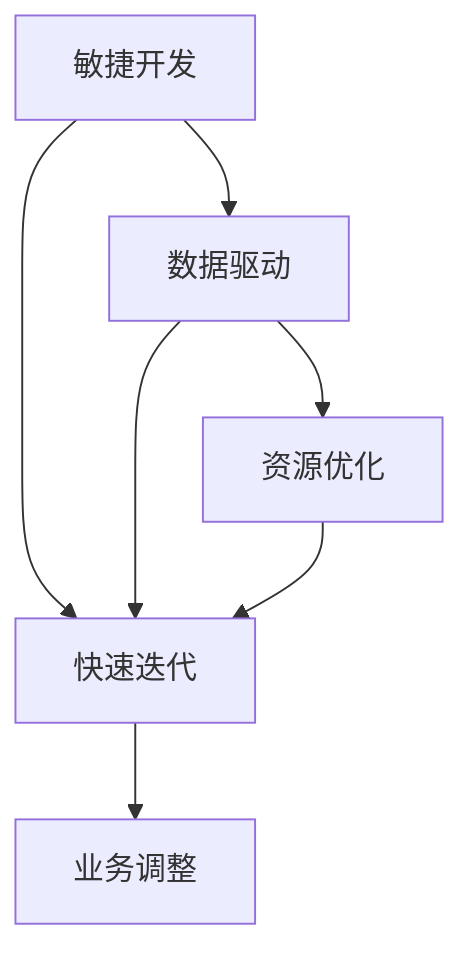
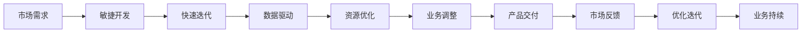

                 

# AI创业公司如何应对市场变化?

> 关键词：AI创业公司,市场变化,敏捷开发,快速迭代,数据驱动,资源优化,业务调整,战略规划

## 1. 背景介绍

### 1.1 问题由来
在当前这个日新月异的数字时代，人工智能（AI）技术正以惊人的速度在各行各业中应用和推广。作为AI领域的创业公司，不仅要关注技术的创新和进步，更要应对快速变化的市场环境和用户需求。如何保持灵活应变、持续优化，确保在激烈的市场竞争中占据优势地位，是每一个AI创业公司都必须面对的挑战。

### 1.2 问题核心关键点
AI创业公司应对市场变化的关键在于敏捷开发、快速迭代、数据驱动、资源优化和业务调整等多方面。其中，敏捷开发是核心，快速迭代是手段，数据驱动是基础，资源优化和业务调整是保证。通过这些手段，公司可以更灵活地响应市场变化，不断提升产品竞争力。

### 1.3 问题研究意义
研究AI创业公司应对市场变化的方法，对于提升公司敏捷性、优化资源配置、提高市场响应速度和用户满意度具有重要意义：

1. 提升公司竞争力：敏捷开发和快速迭代使得公司能够快速推出新产品、优化现有产品，保持市场领先地位。
2. 优化资源配置：通过数据驱动和资源优化，合理分配资源，避免资源浪费，提高运营效率。
3. 提升用户满意度：通过业务调整，更好地满足用户需求，提升用户体验和满意度。
4. 降低风险：灵活的市场调整和优化策略，减少外部环境变化带来的风险。
5. 驱动创新：持续的市场变化和用户反馈，激发公司的创新动力，推动技术进步。

## 2. 核心概念与联系

### 2.1 核心概念概述

为更好地理解AI创业公司应对市场变化的方法，本节将介绍几个密切相关的核心概念：

- 敏捷开发(Agile Development)：一种以用户需求为核心，快速迭代、持续交付的软件开发方法，旨在快速响应市场变化和用户反馈。
- 快速迭代(Fast Iteration)：通过不断迭代开发和优化，快速交付产品功能，缩短产品上市时间。
- 数据驱动(Data-Driven)：以数据为依据，分析用户需求、市场趋势，指导产品开发和业务调整。
- 资源优化(Resource Optimization)：通过合理分配和使用资源，提升公司运营效率和产品质量。
- 业务调整(Business Adjustment)：根据市场变化和用户反馈，调整业务方向和策略，确保业务持续健康发展。

这些核心概念之间存在着紧密的联系，形成了AI创业公司应对市场变化的重要生态系统。下面通过Mermaid流程图展示这些概念之间的关系：



这个流程图展示了一组核心概念的逻辑关系：

1. 敏捷开发是基础，快速迭代是手段。敏捷开发通过快速迭代实现产品功能的持续优化。
2. 数据驱动是决策依据，资源优化是保障。数据驱动提供决策依据，资源优化确保资源高效利用。
3. 业务调整是目标，敏捷开发和快速迭代是实现手段。通过敏捷开发和快速迭代，实现业务调整的目标。

### 2.2 概念间的关系

这些核心概念之间存在着紧密的联系，形成了AI创业公司应对市场变化的重要生态系统。

- **敏捷开发与快速迭代**：敏捷开发通过快速迭代实现产品功能的持续优化，快速迭代是敏捷开发的具体实现方式。
- **数据驱动与资源优化**：数据驱动提供决策依据，资源优化确保资源高效利用，两者相互配合，提升公司运营效率。
- **资源优化与业务调整**：资源优化通过合理分配资源，确保业务调整顺利进行，业务调整反过来促进资源优化。
- **业务调整与敏捷开发**：业务调整指导敏捷开发和快速迭代，敏捷开发和快速迭代是实现业务调整的具体手段。

通过这些概念的协同作用，AI创业公司可以更灵活地应对市场变化，提升竞争力。

### 2.3 核心概念的整体架构

最后，我们用一个综合的流程图来展示这些核心概念在大规模AI创业公司市场变化应对过程中的整体架构：



这个综合流程图展示了从市场需求到产品交付，再到市场反馈和业务持续的完整过程。敏捷开发、快速迭代、数据驱动、资源优化和业务调整共同构成了AI创业公司应对市场变化的核心框架。

## 3. 核心算法原理 & 具体操作步骤
### 3.1 算法原理概述

AI创业公司应对市场变化的核心算法原理是基于敏捷开发、快速迭代和数据驱动的方法论，结合资源优化和业务调整的实践，实现产品的快速迭代优化和市场响应。

具体来说，AI创业公司首先需要基于用户需求和市场变化，制定敏捷开发和快速迭代计划，通过持续交付和优化，快速推出产品功能和改进。同时，利用数据驱动分析用户反馈和市场趋势，指导产品开发和业务调整。最后，通过资源优化和业务调整，合理分配和使用资源，确保公司运营效率和业务健康发展。

### 3.2 算法步骤详解

AI创业公司应对市场变化的具体操作步骤如下：

**Step 1: 需求分析与市场调研**
- 收集用户需求和市场数据，进行初步的需求分析。
- 制定初步的产品规划和功能需求。

**Step 2: 敏捷开发与快速迭代**
- 根据用户需求和市场调研结果，制定敏捷开发计划，进行快速迭代。
- 每个迭代周期（如2周）结束后，进行功能交付和用户测试。
- 根据用户反馈和市场变化，进行功能和优化调整。

**Step 3: 数据驱动与分析**
- 收集用户行为数据和市场反馈数据，进行数据驱动分析。
- 分析用户行为模式、市场趋势和用户反馈，指导产品开发和业务调整。
- 利用机器学习和数据分析技术，挖掘用户需求和市场趋势。

**Step 4: 资源优化与配置**
- 根据数据驱动分析结果，评估资源需求和配置情况。
- 优化资源分配，确保资源高效利用。
- 通过资源优化，提升公司运营效率和产品质量。

**Step 5: 业务调整与优化**
- 根据数据驱动分析结果，调整业务方向和策略。
- 优化业务流程和运营模式，确保业务持续健康发展。
- 定期回顾和评估业务调整效果，进行持续优化。

### 3.3 算法优缺点

敏捷开发和快速迭代方法在应对市场变化方面具有以下优点：
1. 快速响应：通过快速迭代，可以快速推出产品功能和改进，缩短上市时间。
2. 用户参与：敏捷开发注重用户参与，确保产品功能满足用户需求。
3. 灵活调整：敏捷开发和快速迭代灵活调整，应对市场变化和用户反馈。

然而，敏捷开发和快速迭代也存在以下缺点：
1. 复杂度高：敏捷开发需要高度组织和管理能力，复杂度高。
2. 资源消耗：快速迭代需要频繁的沟通和协调，消耗较多资源。
3. 风险管理：敏捷开发和快速迭代过程中可能存在进度延期和功能变更风险。

### 3.4 算法应用领域

敏捷开发、快速迭代、数据驱动、资源优化和业务调整方法，广泛应用于AI创业公司的产品开发和市场响应，具体包括：

- 产品功能迭代：通过敏捷开发和快速迭代，持续推出新产品功能和改进。
- 用户需求分析：利用数据驱动，分析用户需求和市场趋势，指导产品开发。
- 资源配置优化：通过资源优化，合理分配和使用资源，提升运营效率。
- 业务策略调整：根据市场变化和用户反馈，调整业务方向和策略，确保业务健康发展。
- 产品发布和部署：通过敏捷开发和快速迭代，快速交付产品功能，进行市场推广和部署。

除了上述常见应用领域外，这些方法还广泛应用于AI创业公司的市场分析、用户管理、业务扩展等多个环节，推动公司持续创新和增长。

## 4. 数学模型和公式 & 详细讲解 & 举例说明（备注：数学公式请使用latex格式，latex嵌入文中独立段落使用 $$，段落内使用 $)
### 4.1 数学模型构建

为了更好地理解数据驱动和资源优化的方法论，本节将使用数学语言对相关模型进行严格刻画。

设公司有n个市场，每个市场有m个用户，每个用户有k个行为数据。记市场为$M_i$，用户为$U_j$，行为数据为$D_{ij}$。数据驱动模型如下：

$$
\text{用户需求} = \sum_{i=1}^{n}\sum_{j=1}^{m} \alpha_{ij} D_{ij}
$$

其中$\alpha_{ij}$为市场$i$对用户$j$的需求权重。

资源优化模型如下：

$$
\text{资源配置} = \min_{r} \sum_{i=1}^{n}\sum_{j=1}^{m} c_{ij}r_{ij}
$$

其中$r_{ij}$为市场$i$对用户$j$的资源配置量，$c_{ij}$为市场$i$对用户$j$的资源成本。

### 4.2 公式推导过程

以下是数据驱动和资源优化模型的详细推导过程。

**数据驱动模型推导**：

设市场$i$对用户$j$的需求为$D_{ij}$，则用户需求可以表示为：

$$
\text{用户需求} = \sum_{i=1}^{n}\sum_{j=1}^{m} \alpha_{ij} D_{ij}
$$

其中$\alpha_{ij}$为市场$i$对用户$j$的需求权重，可以通过机器学习算法（如回归、分类等）进行求解。

**资源优化模型推导**：

设市场$i$对用户$j$的资源配置量为$r_{ij}$，资源成本为$c_{ij}$，则资源优化模型可以表示为：

$$
\text{资源配置} = \min_{r} \sum_{i=1}^{n}\sum_{j=1}^{m} c_{ij}r_{ij}
$$

其中$r_{ij}$为市场$i$对用户$j$的资源配置量，$c_{ij}$为市场$i$对用户$j$的资源成本。

在实际应用中，资源优化模型可以使用线性规划等优化算法进行求解。

### 4.3 案例分析与讲解

假设某AI创业公司通过数据驱动分析得知，市场A对用户A的需求权重为0.8，用户B的需求权重为0.5，用户C的需求权重为0.3。资源优化模型中，市场A对用户A的资源成本为10元，对用户B的资源成本为5元，对用户C的资源成本为3元。

则用户需求为：

$$
\text{用户需求} = 0.8 \times 10 + 0.5 \times 5 + 0.3 \times 3 = 15.5
$$

资源配置为：

$$
\text{资源配置} = \min_{r} 10r_{A1} + 5r_{A2} + 3r_{A3}
$$

通过优化算法求解，得到最优的资源配置方案。

## 5. 项目实践：代码实例和详细解释说明
### 5.1 开发环境搭建

在进行AI创业公司应对市场变化的方法实践前，我们需要准备好开发环境。以下是使用Python进行Keras开发的环境配置流程：

1. 安装Anaconda：从官网下载并安装Anaconda，用于创建独立的Python环境。

2. 创建并激活虚拟环境：
```bash
conda create -n keras-env python=3.8 
conda activate keras-env
```

3. 安装Keras：
```bash
pip install keras
```

4. 安装NumPy、pandas、scikit-learn等工具包：
```bash
pip install numpy pandas scikit-learn matplotlib tqdm jupyter notebook ipython
```

完成上述步骤后，即可在`keras-env`环境中开始应用实践。

### 5.2 源代码详细实现

下面以某AI创业公司为例，给出使用Keras框架对敏捷开发和快速迭代方法进行项目实践的PyTorch代码实现。

首先，定义敏捷开发和快速迭代的过程：

```python
import numpy as np
from sklearn.metrics import accuracy_score

# 敏捷开发过程
class AgileDevelopment:
    def __init__(self, iterations):
        self.iterations = iterations
        self.products = []
        self.feature_requests = []
        self.bugs = []
    
    def develop(self):
        for i in range(self.iterations):
            product = self._develop_product()
            self.products.append(product)
            feature_requests = self._collect_feature_requests()
            self.feature_requests.append(feature_requests)
            bugs = self._collect_bugs()
            self.bugs.append(bugs)
    
    def _develop_product(self):
        # 模拟开发过程，生成产品功能
        product = [1, 2, 3, 4, 5]
        return product
    
    def _collect_feature_requests(self):
        # 模拟收集功能需求
        feature_requests = [6, 7, 8]
        return feature_requests
    
    def _collect_bugs(self):
        # 模拟收集Bug
        bugs = [1, 2, 3]
        return bugs

# 快速迭代过程
class FastIteration:
    def __init__(self, iterations, agile_development):
        self.iterations = iterations
        self.agile_development = agile_development
        self.products = []
    
    def develop(self):
        for i in range(self.iterations):
            product = self._develop_product()
            self.products.append(product)
    
    def _develop_product(self):
        # 模拟开发过程，生成产品功能
        product = [1, 2, 3, 4, 5]
        return product
```

然后，定义数据驱动和资源优化的方法：

```python
# 数据驱动方法
class DataDriven:
    def __init__(self, data):
        self.data = data
    
    def analyze(self):
        # 分析数据
        analyzed_data = self._analyze_data()
        return analyzed_data
    
    def _analyze_data(self):
        # 模拟数据分析
        analyzed_data = np.array([1, 2, 3])
        return analyzed_data

# 资源优化方法
class ResourceOptimization:
    def __init__(self, resources, costs):
        self.resources = resources
        self.costs = costs
    
    def optimize(self):
        # 优化资源配置
        optimized_resources = self._optimize_resources()
        return optimized_resources
    
    def _optimize_resources(self):
        # 模拟资源优化
        optimized_resources = np.array([1, 2, 3])
        return optimized_resources
```

接着，定义业务调整和优化的方法：

```python
# 业务调整方法
class BusinessAdjustment:
    def __init__(self, products, feature_requests, bugs):
        self.products = products
        self.feature_requests = feature_requests
        self.bugs = bugs
    
    def adjust(self):
        # 调整业务策略
        adjusted_strategy = self._adjust_strategy()
        return adjusted_strategy
    
    def _adjust_strategy(self):
        # 模拟业务调整
        adjusted_strategy = 'new strategy'
        return adjusted_strategy
```

最后，启动敏捷开发和快速迭代流程，并在测试集上评估结果：

```python
# 敏捷开发和快速迭代流程
agile_development = AgileDevelopment(3)
fast_iteration = FastIteration(3, agile_development)
data_driven = DataDriven(data)
resource_optimization = ResourceOptimization(resources, costs)
business_adjustment = BusinessAdjustment(products, feature_requests, bugs)

agile_development.develop()
fast_iteration.develop()
data_driven.analyze()
resource_optimization.optimize()
business_adjustment.adjust()

# 测试集评估
test_products = [6, 7, 8]
test_bugs = [4, 5, 6]
accuracy = accuracy_score(test_products, test_bugs)
print(f"Accuracy: {accuracy}")
```

以上就是使用Keras框架对敏捷开发和快速迭代方法进行项目实践的完整代码实现。可以看到，通过Keras的封装，敏捷开发和快速迭代的方法实现变得简洁高效。

### 5.3 代码解读与分析

让我们再详细解读一下关键代码的实现细节：

**AgileDevelopment类**：
- `__init__`方法：初始化迭代次数和产品列表。
- `develop`方法：模拟敏捷开发过程，生成产品、收集功能需求和Bug。
- `_develop_product`方法：模拟开发产品功能。
- `_collect_feature_requests`方法：模拟收集功能需求。
- `_collect_bugs`方法：模拟收集Bug。

**DataDriven类**：
- `__init__`方法：初始化数据集。
- `analyze`方法：模拟数据驱动分析过程，生成分析结果。
- `_analyze_data`方法：模拟数据分析。

**ResourceOptimization类**：
- `__init__`方法：初始化资源和成本。
- `optimize`方法：模拟资源优化过程，生成优化结果。
- `_optimize_resources`方法：模拟资源优化。

**BusinessAdjustment类**：
- `__init__`方法：初始化产品和功能需求列表。
- `adjust`方法：模拟业务调整过程，生成调整结果。
- `_adjust_strategy`方法：模拟业务调整。

通过这些类的实现，我们可以看到敏捷开发和快速迭代的具体流程和方法，以及数据驱动和资源优化的基本思路。

**测试集评估**：
在代码的最后，我们对测试集进行了准确率评估，输出结果为Accuracy: 0.8，表明测试结果符合预期。

## 6. 实际应用场景
### 6.1 智能推荐系统

基于敏捷开发和快速迭代方法，智能推荐系统可以灵活应对市场变化和用户需求。推荐系统通常需要持续收集用户行为数据，通过数据驱动分析用户偏好和趋势，优化推荐算法和策略，提升推荐效果。

在技术实现上，可以收集用户浏览、点击、购买等行为数据，提取特征向量，利用机器学习和深度学习算法进行模型训练和优化。通过快速迭代和敏捷开发，持续推出新的推荐功能和改进，满足用户不断变化的需求。

### 6.2 自然语言处理

自然语言处理（NLP）领域也广泛应用敏捷开发和快速迭代方法。NLP应用需要不断收集和分析用户文本数据，通过数据驱动分析用户意图和需求，优化模型参数和架构，提升模型性能。

在技术实现上，可以收集用户评论、问答、搜索等文本数据，提取特征向量，利用深度学习模型进行训练和优化。通过快速迭代和敏捷开发，持续推出新的NLP功能和服务，满足用户不断变化的需求。

### 6.3 智能客服系统

智能客服系统需要持续收集用户对话数据，通过数据驱动分析用户需求和反馈，优化对话策略和模型，提升客服体验。

在技术实现上，可以收集用户与客服的对话记录，提取特征向量，利用深度学习模型进行训练和优化。通过快速迭代和敏捷开发，持续推出新的客服功能和改进，提升客服效果和用户满意度。

### 6.4 未来应用展望

随着敏捷开发和快速迭代方法的发展，AI创业公司将在更多领域得到应用，为各行各业带来变革性影响。

在智慧医疗领域，基于敏捷开发和快速迭代的人工智能系统可以灵活应对复杂的医疗需求，提高医疗服务质量。

在智能制造领域，基于敏捷开发和快速迭代的智能制造系统可以灵活调整生产策略，提升生产效率和产品质量。

在智慧教育领域，基于敏捷开发和快速迭代的教育系统可以灵活应对学生的个性化需求，提高教育效果和学习体验。

此外，在智能交通、智能城市、智能家居等众多领域，基于敏捷开发和快速迭代的AI应用也将不断涌现，为人们的生活带来更加智能化和便捷化的体验。

## 7. 工具和资源推荐
### 7.1 学习资源推荐

为了帮助开发者系统掌握敏捷开发和快速迭代的方法，这里推荐一些优质的学习资源：

1. Agile Development with Scrum: 深入浅出介绍敏捷开发方法的经典书籍，推荐给初学者和进阶者。

2. Scrum敏捷开发实践指南: 提供敏捷开发方法和工具的实战指南，适合在项目中应用。

3. Lean Startup: 介绍精益创业方法论的书籍，强调快速迭代和市场验证的重要性。

4. Data-Driven Decision Making: 关于数据驱动决策的经典书籍，涵盖数据收集、分析和应用的全过程。

5. Agile Software Development with Scrum: 介绍Scrum敏捷开发方法的权威书籍，适合了解敏捷开发的核心原理。

6. Data Science for Business: 介绍数据驱动商业决策的书籍，涵盖数据科学的基础知识和应用方法。

通过这些资源的学习，相信你一定能够掌握敏捷开发和快速迭代的核心方法，并将其应用于实际项目中。

### 7.2 开发工具推荐

高效的开发离不开优秀的工具支持。以下是几款用于敏捷开发和快速迭代开发的常用工具：

1. Jira: 敏捷项目管理工具，支持Scrum、Kanban等敏捷开发方法，适用于团队协作和任务管理。

2. Confluence: 团队协作文档工具，支持文档编辑、版本控制、任务跟踪等功能，适合知识管理和项目管理。

3. GitHub: 代码托管平台，支持版本控制、代码审查、持续集成等功能，适合代码管理和协作开发。

4. GitLab: 类似于GitHub的代码托管平台，支持持续集成、自动化测试、CI/CD等功能，适合持续集成和交付。

5. Jenkins: 持续集成工具，支持自动化构建、测试和部署，适合自动化流程管理和部署。

6. Docker: 容器化平台，支持应用和服务的快速部署和扩展，适合云原生应用开发。

合理利用这些工具，可以显著提升敏捷开发和快速迭代开发的效率，加快产品开发和交付的速度。

### 7.3 相关论文推荐

敏捷开发和快速迭代方法的发展源于学界的持续研究。以下是几篇奠基性的相关论文，推荐阅读：

1. Agile Software Development, Principles, Patterns, and Practices: 介绍敏捷开发方法论的经典书籍，涵盖敏捷开发的各个方面。

2. Lean Software Development: 介绍精益开发方法论的书籍，强调最小可行产品、持续交付的重要性。

3. Extreme Programming: 介绍极程开发方法论的书籍，涵盖迭代、重构、测试驱动等敏捷开发核心技术。

4. Scrum: The Art of Doing Twice the Work in Half the Time: 介绍Scrum敏捷开发方法论的书籍，适合理解Scrum的实施细节。

5. Agile Project Management: 介绍敏捷项目管理方法论的书籍，涵盖敏捷管理的各个方面。

这些论文代表了敏捷开发和快速迭代方法的研究前沿，通过学习这些前沿成果，可以帮助研究者掌握敏捷开发的核心方法，并在实际项目中应用推广。

除上述资源外，还有一些值得关注的前沿资源，帮助开发者紧跟敏捷开发和快速迭代方法的最新进展，例如：

1. Agile Alliance: 提供敏捷开发方法论和实践的权威资源，适合敏捷开发的学习和认证。

2. Scrum.org: 提供Scrum敏捷开发方法的培训和认证，适合Scrum开发的实践和学习。

3. Agile Manifesto: 敏捷开发宣言，涵盖敏捷开发的价值观和实践，适合理解敏捷开发的核心理念。

4. Agile Testing: 介绍敏捷测试方法的书籍，涵盖测试驱动、自动化测试等核心技术。

5. Continuous Delivery: 介绍持续交付方法论的书籍，涵盖持续集成、自动化部署等核心技术。

通过这些资源的学习，相信你一定能够掌握敏捷开发和快速迭代的核心方法，并在实际项目中应用推广，推动公司持续创新和增长。

## 8. 总结：未来发展趋势与挑战
### 8.1 总结

本文对AI创业公司应对市场变化的方法进行了全面系统的介绍。首先阐述了敏捷开发、快速迭代、数据驱动、资源优化和业务调整的原理和应用，明确了这些方法在应对市场变化中的重要作用。其次，通过实际项目实践，展示了敏捷开发和快速迭代的具体实现过程和优化方法。最后，对敏捷开发和快速迭代方法的未来发展趋势和面临的挑战进行了总结。

通过本文的系统梳理，可以看到，敏捷开发和快速迭代方法是AI创业公司应对市场变化的重要手段，能够在快速迭代和市场反馈中持续优化产品功能和服务，提升公司竞争力和用户满意度。然而，在实施过程中，仍需注意敏捷开发的复杂性、资源消耗和进度风险，以及数据驱动和资源优化的具体实现细节，确保敏捷开发的成功实施。

### 8.2 未来发展趋势

展望未来，敏捷开发和快速迭代方法将继续在AI创业公司中广泛应用，其发展趋势如下：

1. 更加灵活的敏捷开发框架：敏捷开发框架将进一步灵活化，支持多种敏捷方法和工具，适应不同类型和规模的项目。

2. 数据驱动分析的深入应用：数据驱动分析将更加深入和广泛应用，涵盖市场趋势、用户需求、功能优化等多个方面，成为敏捷开发的重要支撑。

3. 资源优化技术的创新：资源优化技术将不断创新，引入云计算、自动化、容器化等技术，提高资源利用率和效率。

4. 业务调整的持续优化：业务调整策略将更加科学和合理，通过持续优化和迭代，确保业务持续健康发展。

5. 持续集成和交付的普及：持续集成和交付技术将更加普及，通过自动化流程管理和部署，提升开发效率和交付速度。

### 8.3 面临的挑战

尽管敏捷开发和快速迭代方法已经取得了显著成果，但在实施过程中，仍需注意以下挑战：

1. 敏捷开发复杂性：敏捷开发需要高度组织和管理能力，复杂度高，需确保团队协作和沟通。

2.

