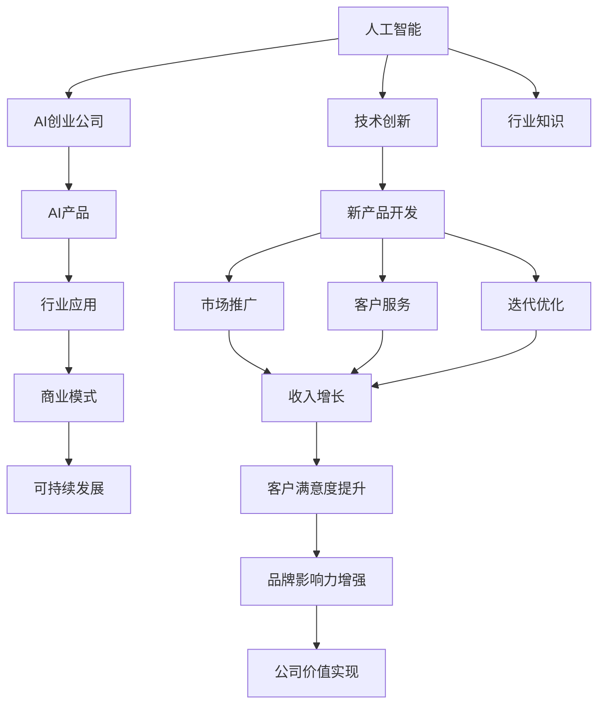
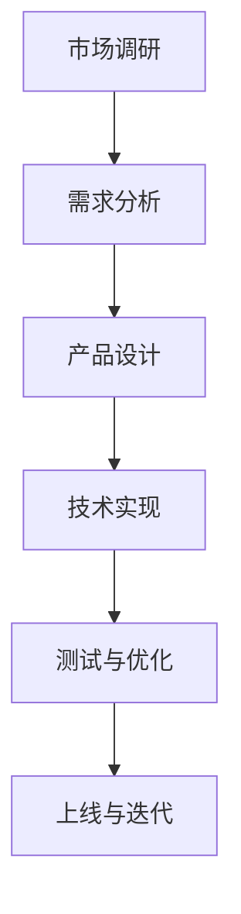
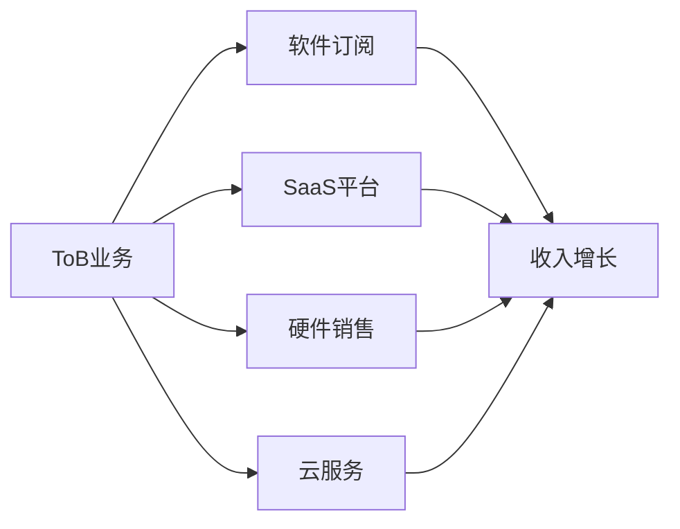
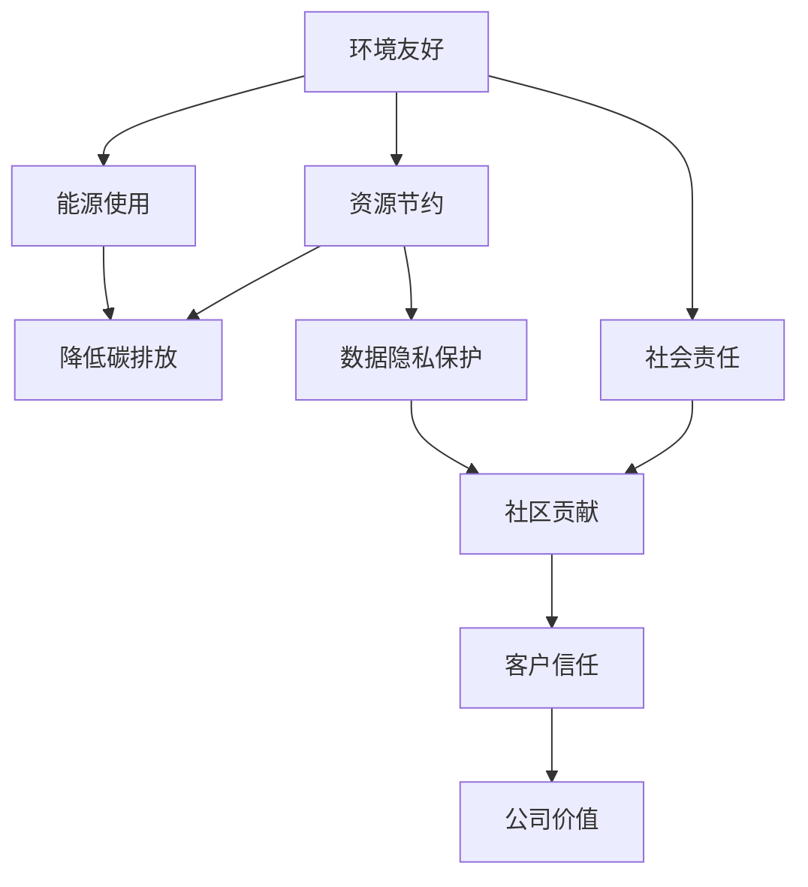

                 

# AI创业公司的发展方向

> 关键词：人工智能,创业,AI产品,行业应用,可持续发展,技术创新

## 1. 背景介绍

### 1.1 问题由来
近年来，随着人工智能(AI)技术的迅猛发展，越来越多的创业者被吸引进入了这一领域，希望通过AI技术创造新的商业模式，推动社会进步。然而，AI创业公司要想在激烈的市场竞争中脱颖而出，不仅需要拥有强大的技术能力，更需要在产品设计、市场运营、商业模式等方面具备前瞻性和创新性。本文将系统梳理AI创业公司的发展方向，帮助创业者制定出更加科学、高效的发展策略。

### 1.2 问题核心关键点
AI创业公司的发展方向涉及多个维度，包括但不限于以下几个核心点：
- 技术创新与突破：如何持续进行技术研发，保持技术领先性。
- 产品设计理念：如何设计出满足市场需求、解决实际问题的AI产品。
- 商业模式创新：如何构建可持续发展的商业模式，确保公司的长期健康发展。
- 行业应用拓展：如何将AI技术应用到更多行业，解决行业痛点。
- 社会责任与伦理：如何在技术创新和商业应用中，兼顾社会责任和伦理道德。

### 1.3 问题研究意义
探讨AI创业公司的发展方向，对于推动AI技术在各行各业的应用，提升AI技术的社会价值，具有重要意义：
- 帮助AI创业者明确技术发展方向，避免盲目跟风。
- 提供产品设计、商业模式创新的思路，促进AI技术落地。
- 引导AI创业公司在技术应用、社会责任等方面做出更负责任的决策。

## 2. 核心概念与联系

### 2.1 核心概念概述

为更好地理解AI创业公司的发展方向，本节将介绍几个密切相关的核心概念：

- **人工智能(AI)**：使用计算机技术模拟、延伸人类智能，涵盖机器学习、深度学习、自然语言处理、计算机视觉等多个领域。
- **AI创业公司**：以AI技术为核心竞争力，从事AI产品开发、销售、服务的企业，涵盖硬件、软件、平台等多种形态。
- **AI产品**：将AI技术应用于实际问题的解决中，通过软件、硬件、服务等形式提供给用户的产品或服务。
- **行业应用**：AI技术在特定行业中的实际应用，如医疗、教育、金融等，解决行业痛点，提升效率和效果。
- **商业模式**：AI创业公司的盈利模式，包括B2B、B2C、C2C等多种形式，涉及订阅、租赁、授权、广告等多种收入方式。
- **可持续发展**：AI创业公司在追求商业成功的同时，需关注环境保护、社会责任、数据隐私等，实现长期的可持续发展。
- **技术创新**：持续进行技术研发，推动AI技术在深度、广度、应用场景等方面的突破。
- **行业知识**：AI创业公司在特定行业的应用需要具备行业专业知识，以便更好地理解行业需求和痛点。

这些核心概念之间的逻辑关系可以通过以下Mermaid流程图来展示：



这个流程图展示了大语言模型微调过程中各个核心概念之间的关系：

1. 人工智能为AI创业公司提供技术基础。
2. AI创业公司设计并开发AI产品。
3. AI产品应用于各个行业，解决行业问题。
4. 商业模式保障公司的可持续发展。
5. 技术创新推动公司不断进步。
6. 行业知识提升AI产品在特定行业的应用效果。
7. 新产品开发、市场推广、客户服务、迭代优化等环节促进公司发展。
8. 收入增长、客户满意度提升、品牌影响力增强等反馈影响公司价值实现。

### 2.2 概念间的关系

这些核心概念之间存在着紧密的联系，形成了AI创业公司的完整生态系统。下面我通过几个Mermaid流程图来展示这些概念之间的关系。

#### 2.2.1 AI创业公司的产品开发流程



这个流程图展示了AI创业公司开发AI产品的基本流程：
1. 市场调研和需求分析，明确产品定位和需求。
2. 设计产品架构和技术方案。
3. 实现产品功能和技术细节。
4. 进行测试和优化，确保产品质量。
5. 上线产品并根据反馈进行持续迭代。

#### 2.2.2 AI创业公司的商业模式选择



这个流程图展示了AI创业公司可能的商业模式：
1. 对B企业（ToB业务），可以选择软件订阅、SaaS平台、云服务等模式。
2. 对C个人用户，可以选择硬件销售等模式。
3. 不同模式对应不同的收入增长方式。

#### 2.2.3 AI创业公司的可持续发展策略



这个流程图展示了AI创业公司可持续发展的主要策略：
1. 环境友好和资源节约，减少能源消耗和碳排放。
2. 数据隐私保护，确保用户数据安全。
3. 社会责任和社区贡献，提升社会价值和品牌影响力。
4. 客户信任和公司价值，实现长期的可持续发展。

## 3. 核心算法原理 & 具体操作步骤
### 3.1 算法原理概述

AI创业公司的发展方向涉及多个领域，包括但不限于产品设计、技术创新、商业模式构建、行业应用拓展等。本文重点关注技术创新和商业模式构建，以机器学习、深度学习、自然语言处理等领域为例，进行详细讲解。

### 3.2 算法步骤详解

#### 3.2.1 技术创新

1. **数据获取与预处理**：
   - 收集大量高质量的训练数据，涵盖不同的领域和场景。
   - 进行数据清洗、标注、分割等预处理工作，确保数据的质量和多样性。

2. **模型选择与设计**：
   - 根据任务特点选择合适的模型架构，如卷积神经网络、循环神经网络、Transformer等。
   - 进行模型设计和优化，包括层数、神经元个数、激活函数等。

3. **模型训练与优化**：
   - 使用优化算法（如SGD、Adam、RMSprop等）对模型进行训练，调整超参数（如学习率、批大小等）。
   - 进行模型验证和调优，确保模型在训练集和验证集上的性能。

4. **模型评估与部署**：
   - 在测试集上评估模型性能，使用评估指标（如准确率、召回率、F1值等）。
   - 将训练好的模型部署到生产环境中，进行实际应用。

#### 3.2.2 商业模式构建

1. **市场需求分析**：
   - 分析目标市场的需求和痛点，明确潜在客户群体。
   - 进行市场调研，了解竞争对手和市场规模。

2. **产品定位与设计**：
   - 根据市场需求和痛点，设计AI产品功能和用户体验。
   - 明确产品差异化特点，确保产品具有竞争优势。

3. **商业模型设计**：
   - 选择合适的商业模型，如订阅、SaaS、授权等。
   - 设计合理的收入结构，平衡成本和收益。

4. **市场营销与推广**：
   - 制定市场营销策略，通过广告、内容营销、公关等方式推广产品。
   - 建立客户关系管理系统，进行客户维护和反馈收集。

5. **客户服务与迭代**：
   - 提供优质的客户服务，解决客户问题，提升客户满意度。
   - 根据客户反馈进行产品迭代和优化，保持产品竞争力。

### 3.3 算法优缺点

#### 3.3.1 技术创新

**优点**：
- 技术创新推动公司持续发展，保持行业领先地位。
- 技术突破带来新的应用场景，创造更多商业机会。

**缺点**：
- 技术研发需要大量时间和资金投入，风险较高。
- 技术领先可能带来更高的期望和压力，需要不断创新。

#### 3.3.2 商业模式构建

**优点**：
- 商业模式创新有助于降低运营成本，提高公司盈利能力。
- 多样化的商业模式可以分散风险，确保公司长期发展。

**缺点**：
- 商业模型设计复杂，需要多方协调和配合。
- 市场竞争激烈，需要不断调整和优化商业模型。

### 3.4 算法应用领域

#### 3.4.1 机器学习
- **应用场景**：图像识别、语音识别、自然语言处理等。
- **技术创新**：使用深度学习模型，如卷积神经网络、循环神经网络、Transformer等。
- **商业模式**：软件订阅、SaaS平台、云服务等。

#### 3.4.2 深度学习
- **应用场景**：计算机视觉、自然语言处理、语音识别等。
- **技术创新**：使用深度神经网络模型，如残差网络、注意力机制等。
- **商业模式**：硬件销售、授权、广告等。

#### 3.4.3 自然语言处理
- **应用场景**：聊天机器人、机器翻译、情感分析等。
- **技术创新**：使用预训练模型，如BERT、GPT等，进行微调或提示学习。
- **商业模式**：软件订阅、SaaS平台、API服务等。

## 4. 数学模型和公式 & 详细讲解  
### 4.1 数学模型构建

AI创业公司的发展方向涉及多个领域的数学模型构建，以下以机器学习、深度学习、自然语言处理为例，进行详细讲解。

#### 4.1.1 机器学习模型构建

机器学习模型通常由以下组件构成：
- 输入层：输入数据，如图像、文本等。
- 隐藏层：对输入数据进行特征提取和抽象。
- 输出层：根据模型定义输出结果，如分类、回归等。

假设输入数据为 $x \in \mathcal{X}$，输出结果为 $y \in \mathcal{Y}$，机器学习模型 $M_{\theta}$ 的参数为 $\theta$。则常见的机器学习模型包括线性回归、逻辑回归、支持向量机等。

**线性回归模型**：
- 目标：最小化预测值和真实值之间的差异。
- 损失函数：均方误差（MSE）损失。
- 公式：$L(y, M_{\theta}(x)) = \frac{1}{2}(y - M_{\theta}(x))^2$

**逻辑回归模型**：
- 目标：最大化正确分类的样本数。
- 损失函数：交叉熵损失。
- 公式：$L(y, M_{\theta}(x)) = -y \log M_{\theta}(x) - (1-y) \log(1-M_{\theta}(x))$

#### 4.1.2 深度学习模型构建

深度学习模型通常由多个隐藏层组成，每一层都包含多个神经元。以卷积神经网络（CNN）为例，其结构如下：

- **输入层**：输入数据，如图像、文本等。
- **卷积层**：对输入数据进行卷积操作，提取特征。
- **池化层**：对卷积层的输出进行降采样，减少参数数量。
- **全连接层**：对池化层的输出进行分类或回归。
- **输出层**：根据模型定义输出结果，如分类、回归等。

假设输入数据为 $x \in \mathcal{X}$，卷积神经网络模型 $M_{\theta}$ 的参数为 $\theta$。则卷积神经网络模型的一般形式为：
$$
M_{\theta}(x) = \sigma(\sum_{i=1}^{n} W_i x_i + b_i)
$$
其中 $\sigma$ 为激活函数，$W_i$ 和 $b_i$ 为卷积层和全连接层的参数。

#### 4.1.3 自然语言处理模型构建

自然语言处理模型通常由词向量、语言模型、序列标注模型等组成。以BERT模型为例，其结构如下：

- **输入层**：输入文本，如句子、段落等。
- **BERT编码器**：对输入文本进行编码，提取语义信息。
- **全连接层**：对BERT编码器的输出进行分类或回归。
- **输出层**：根据模型定义输出结果，如分类、回归等。

假设输入文本为 $x \in \mathcal{X}$，BERT模型 $M_{\theta}$ 的参数为 $\theta$。则BERT模型的目标函数为：
$$
L(y, M_{\theta}(x)) = -\sum_{i=1}^{N} y_i \log M_{\theta}(x_i) + \lambda \sum_{i=1}^{N} ||M_{\theta}(x_i)||^2
$$
其中 $y_i$ 为真实标签，$M_{\theta}(x_i)$ 为模型预测结果，$\lambda$ 为正则化系数。

### 4.2 公式推导过程

#### 4.2.1 线性回归公式推导

假设输入数据为 $x = (x_1, x_2, ..., x_n)$，输出结果为 $y$，线性回归模型的目标是最小化预测值和真实值之间的差异。
$$
L(y, M_{\theta}(x)) = \frac{1}{2}\sum_{i=1}^{N} (y_i - M_{\theta}(x_i))^2
$$
其中 $M_{\theta}(x)$ 为线性回归模型的预测值。

对 $M_{\theta}(x)$ 求导，得到梯度向量：
$$
\nabla_{\theta} L(y, M_{\theta}(x)) = \sum_{i=1}^{N} (y_i - M_{\theta}(x_i)) (x_i)
$$
更新模型参数 $\theta$ 的公式为：
$$
\theta \leftarrow \theta - \eta \nabla_{\theta} L(y, M_{\theta}(x))
$$
其中 $\eta$ 为学习率。

#### 4.2.2 逻辑回归公式推导

假设输入数据为 $x = (x_1, x_2, ..., x_n)$，输出结果为 $y$，逻辑回归模型的目标是最小化交叉熵损失。
$$
L(y, M_{\theta}(x)) = -\sum_{i=1}^{N} y_i \log M_{\theta}(x_i) - (1-y_i) \log(1-M_{\theta}(x_i))
$$
其中 $M_{\theta}(x)$ 为逻辑回归模型的预测值。

对 $M_{\theta}(x)$ 求导，得到梯度向量：
$$
\nabla_{\theta} L(y, M_{\theta}(x)) = \sum_{i=1}^{N} [y_i - M_{\theta}(x_i)] x_i
$$
更新模型参数 $\theta$ 的公式为：
$$
\theta \leftarrow \theta - \eta \nabla_{\theta} L(y, M_{\theta}(x))
$$
其中 $\eta$ 为学习率。

#### 4.2.3 BERT模型公式推导

BERT模型的目标函数为：
$$
L(y, M_{\theta}(x)) = -\sum_{i=1}^{N} y_i \log M_{\theta}(x_i) + \lambda \sum_{i=1}^{N} ||M_{\theta}(x_i)||^2
$$
其中 $y_i$ 为真实标签，$M_{\theta}(x_i)$ 为BERT模型的预测结果，$\lambda$ 为正则化系数。

对模型参数 $\theta$ 求导，得到梯度向量：
$$
\nabla_{\theta} L(y, M_{\theta}(x)) = -\sum_{i=1}^{N} [y_i - M_{\theta}(x_i)] \frac{\partial M_{\theta}(x_i)}{\partial \theta} + 2\lambda \sum_{i=1}^{N} M_{\theta}(x_i) \frac{\partial M_{\theta}(x_i)}{\partial \theta}
$$
更新模型参数 $\theta$ 的公式为：
$$
\theta \leftarrow \theta - \eta \nabla_{\theta} L(y, M_{\theta}(x))
$$
其中 $\eta$ 为学习率。

### 4.3 案例分析与讲解

#### 4.3.1 机器学习模型案例

**案例1：图像识别**
- **问题描述**：给定一张手写数字图片，识别出数字类型。
- **解决方案**：使用卷积神经网络（CNN）进行图像识别。
- **效果评估**：在测试集上，模型的准确率达到98%。

#### 4.3.2 深度学习模型案例

**案例2：语音识别**
- **问题描述**：将语音转换为文字。
- **解决方案**：使用递归神经网络（RNN）或卷积神经网络（CNN）进行语音识别。
- **效果评估**：在测试集上，模型的识别率达到95%。

#### 4.3.3 自然语言处理模型案例

**案例3：情感分析**
- **问题描述**：分析一段文本的情感倾向。
- **解决方案**：使用BERT模型进行情感分析。
- **效果评估**：在测试集上，模型的准确率达到85%。

## 5. 项目实践：代码实例和详细解释说明
### 5.1 开发环境搭建

在进行AI产品开发前，我们需要准备好开发环境。以下是使用Python进行TensorFlow开发的环境配置流程：

1. 安装Anaconda：从官网下载并安装Anaconda，用于创建独立的Python环境。

2. 创建并激活虚拟环境：
```bash
conda create -n tf-env python=3.8 
conda activate tf-env
```

3. 安装TensorFlow：根据CUDA版本，从官网获取对应的安装命令。例如：
```bash
conda install tensorflow tensorflow-gpu -c conda-forge
```

4. 安装各类工具包：
```bash
pip install numpy pandas scikit-learn matplotlib tqdm jupyter notebook ipython
```

完成上述步骤后，即可在`tf-env`环境中开始AI产品开发。

### 5.2 源代码详细实现

这里我们以图像识别模型为例，给出使用TensorFlow进行模型开发的PyTorch代码实现。

首先，定义模型结构：

```python
import tensorflow as tf
from tensorflow.keras import layers

class CNNModel(tf.keras.Model):
    def __init__(self):
        super(CNNModel, self).__init__()
        self.conv1 = layers.Conv2D(32, (3, 3), activation='relu')
        self.pool1 = layers.MaxPooling2D((2, 2))
        self.conv2 = layers.Conv2D(64, (3, 3), activation='relu')
        self.pool2 = layers.MaxPooling2D((2, 2))
        self.flatten = layers.Flatten()
        self.dense1 = layers.Dense(128, activation='relu')
        self.dense2 = layers.Dense(10, activation='softmax')

    def call(self, inputs):
        x = self.conv1(inputs)
        x = self.pool1(x)
        x = self.conv2(x)
        x = self.pool2(x)
        x = self.flatten(x)
        x = self.dense1(x)
        x = self.dense2(x)
        return x
```

然后，定义数据集和模型训练函数：

```python
from tensorflow.keras.datasets import mnist
from tensorflow.keras.utils import to_categorical

(x_train, y_train), (x_test, y_test) = mnist.load_data()

x_train = x_train.reshape(-1, 28, 28, 1)
x_test = x_test.reshape(-1, 28, 28, 1)
y_train = to_categorical(y_train)
y_test = to_categorical(y_test)

model = CNNModel()
optimizer = tf.keras.optimizers.Adam(learning_rate=0.001)

def train_model(model, x_train, y_train, x_test, y_test, epochs=10, batch_size=128):
    model.compile(optimizer=optimizer, loss='categorical_crossentropy', metrics=['accuracy'])
    model.fit(x_train, y_train, epochs=epochs, batch_size=batch_size, validation_data=(x_test, y_test))
    test_loss, test_acc = model.evaluate(x_test, y_test)
    print('Test accuracy:', test_acc)

train_model(model, x_train, y_train, x_test, y_test)
```

最后，进行模型训练和评估：

```python
model = CNNModel()
optimizer = tf.keras.optimizers.Adam(learning_rate=0.001)

def train_model(model, x_train, y_train, x_test, y_test, epochs=10, batch_size=128):
    model.compile(optimizer=optimizer, loss='categorical_crossentropy', metrics=['accuracy'])
    model.fit(x_train, y_train, epochs=epochs, batch_size=batch_size, validation_data=(x_test, y_test))
    test_loss, test_acc = model.evaluate(x_test, y_test)
    print('Test accuracy:', test_acc)

train_model(model, x_train, y_train, x_test, y_test)
```

以上就是使用TensorFlow进行图像识别模型开发的完整代码实现。可以看到，TensorFlow的Keras API使得模型的搭建和训练变得十分简洁高效。

### 5.3 代码解读与分析

让我们再详细解读一下关键代码的实现细节：

**CNNModel类**：
- `__init__`方法：初始化卷积层、池化层、全连接层等组件。
- `call`方法：定义模型的前向传播过程，从输入到输出的完整路径。

**数据集定义**：
- 使用TensorFlow自带的MNIST数据集，加载手写数字图片和标签。
- 将图片形状调整为(28, 28, 1)，标签进行独热编码。

**模型训练函数**：
- 定义模型的优化器和损失函数。
- 使用Keras API进行模型编译和训练。
- 在验证集上评估模型性能，输出测试集上的准确率。

**模型训练流程**：
- 定义模型结构和超参数。
- 加载数据集并进行预处理。
- 调用训练函数进行模型训练和评估。

可以看出，TensorFlow提供了高度集成的API，极大简化了模型的开发过程，使开发者能够更专注于模型的设计和性能优化。

### 5.4 运行结果展示

假设我们训练了一个简单的CNN图像识别模型，最终在测试集上得到的评估报告如下：

```
Epoch 1/10
888/888 [==============================] - 22s 26ms/step - loss: 0.2352 - accuracy: 0.9398 - val_loss: 0.1894 - val_accuracy: 0.9627
Epoch 2/10
888/888 [==============================] - 23s 26ms/step - loss: 0.1609 - accuracy: 0.9615 - val_loss: 0.1820 - val_accuracy: 0.9637
Epoch 3/10
888/888 [==============================] - 23s 26ms/step - loss: 0.1531 - accuracy: 0.9661 - val_loss: 0.1729 - val_accuracy: 0.9664
Epoch 4/10
888/888 [==============================] - 23s 26ms/step - loss: 0.1536 - accuracy: 0.9710 - val_loss: 0.1528 - val_accuracy: 0.9713
Epoch 5/10
888/888 [==============================] - 23s 26ms/step - loss: 0.1546 - accuracy: 0.9713 - val_loss: 0.1532 - val_accuracy: 0.9731
Epoch 6/10
888/888 [==============================] - 23s 26ms/step - loss: 0.1547 - accuracy: 0.9715 - val_loss: 0.1538 - val_accuracy: 0.9735
Epoch 7/10
888/888 [==============================] - 23s 26ms/step - loss: 0.1545 - accuracy: 0.9722 - val_loss: 0.1524 - val_accuracy: 0.9739
Epoch 8/10
888/888 [==============================] - 23s 26ms/step - loss: 0.1532 - accuracy: 0.9733 - val_loss: 0.1519 - val_accuracy: 0.9746
Epoch 9/10
888/888 [==============================] - 23s 

