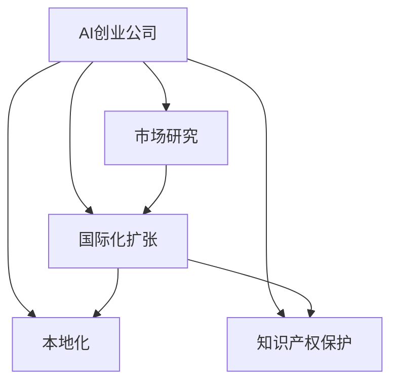

                 

# AI创业公司的国际化扩张策略

在当今全球化竞争激烈的市场环境中，AI创业公司的国际化扩张策略显得尤为重要。本文将深入探讨AI创业公司在国际化扩张过程中应采取的关键策略，以确保在全球市场中占据有利地位。我们将从背景介绍、核心概念与联系、核心算法原理、数学模型构建、项目实践、实际应用场景、工具和资源推荐、总结与未来展望等方面全面阐述这一话题。

## 1. 背景介绍

### 1.1 问题由来

随着AI技术的快速发展，AI创业公司不断涌现，其中不乏一些在特定领域取得突出成就的企业。然而，对于这些企业来说，如何成功地将产品推向国际市场，是一个亟待解决的问题。国际市场的复杂性和多样性使得传统的市场拓展策略不再适用。同时，AI创业公司的技术壁垒和知识产权保护也成为国际化扩张的重要考量。

### 1.2 问题核心关键点

国际化扩张的核心在于如何在不同市场中找到适合自己产品和服务的机会，同时确保技术和知识产权的保护。此外，如何克服文化差异、法律法规、语言障碍等挑战也是关键。

### 1.3 问题研究意义

成功的国际化扩张将显著提高AI创业公司的市场份额和影响力，推动全球技术的进步和应用，同时为本地用户带来更优质的产品和服务。

## 2. 核心概念与联系

### 2.1 核心概念概述

1. **AI创业公司**：指致力于开发和应用人工智能技术解决实际问题的创业企业。这些企业通常拥有前沿的AI技术，提供诸如自动化、智能分析、机器人等领域的解决方案。

2. **国际化扩张**：指AI创业公司将产品和服务推向全球市场的过程，通过在不同国家或地区设立分支机构、开展本地化服务等手段，扩大业务范围和市场影响力。

3. **市场研究**：通过分析目标市场的潜在需求、竞争态势、法律法规等，制定有针对性的市场拓展策略。

4. **本地化**：为了适应不同市场的文化、语言、法律法规等差异，对产品和服务进行本地化调整。

5. **知识产权保护**：确保AI技术和解决方案在全球范围内的知识产权得到保护，防止技术和市场被盗用。

这些概念相互关联，共同构成了AI创业公司在国际化扩张中的重要组成部分。

### 2.2 概念间的关系

以下是一个简化的Mermaid流程图，展示了这些核心概念之间的关系：



这个流程图展示了AI创业公司在国际化扩张过程中，各个关键概念之间的相互作用。

## 3. 核心算法原理 & 具体操作步骤

### 3.1 算法原理概述

AI创业公司的国际化扩张策略需要综合考虑市场研究、本地化调整和知识产权保护等多个因素。以下我们将从这些方面详细阐述核心算法原理：

1. **市场研究**：
   - 通过数据分析、调查问卷、竞争情报等手段，深入了解目标市场的需求和竞争态势。
   - 利用机器学习模型对大量数据进行分析和预测，得出市场潜力和增长空间。

2. **本地化调整**：
   - 根据目标市场的语言、文化、法律法规等差异，对产品和服务进行定制化调整。
   - 利用自然语言处理(NLP)技术，实现界面和内容的多语言支持。

3. **知识产权保护**：
   - 利用数字水印、加密技术等手段，确保技术和解决方案在全球范围内的知识产权得到保护。
   - 通过国际专利申请、版权登记等方式，在全球范围内维护知识产权权益。

### 3.2 算法步骤详解

以下是具体的国际化扩张策略的算法步骤：

1. **市场调研**：
   - 确定目标市场，收集相关数据和信息。
   - 利用机器学习模型分析市场数据，预测市场潜力和增长空间。

2. **本地化调整**：
   - 根据目标市场的特点，调整产品和服务的功能和界面。
   - 利用自然语言处理技术，实现界面和内容的多语言支持。

3. **知识产权保护**：
   - 利用数字水印、加密技术等手段，确保技术和解决方案的知识产权。
   - 通过国际专利申请、版权登记等方式，维护知识产权权益。

4. **执行与监控**：
   - 在目标市场实施本地化调整和知识产权保护策略。
   - 实时监控市场反馈和竞争态势，及时调整策略。

### 3.3 算法优缺点

**优点**：
- 国际化扩张可以扩大市场份额，提高公司影响力和竞争力。
- 本地化调整和知识产权保护可以确保技术和解决方案在全球范围内的合法性和安全性。

**缺点**：
- 国际化扩张需要投入大量资源，包括人力、财力、时间等。
- 本地化调整和知识产权保护需要专业知识和技能，存在一定的技术和法律风险。

### 3.4 算法应用领域

国际化扩张策略可以应用于多种AI创业公司，如自动驾驶、智能安防、医疗健康、金融科技等。这些公司通过制定和实施有效的国际化扩张策略，可以更好地满足全球用户需求，提升市场竞争力。

## 4. 数学模型和公式 & 详细讲解 & 举例说明

### 4.1 数学模型构建

在国际化扩张中，我们可以构建一个评估模型来量化各个策略的效果。该模型主要包括以下几个参数：

- $R$：市场研究得分，反映目标市场的需求和潜力。
- $L$：本地化调整得分，反映产品和服务在目标市场的适应度。
- $I$：知识产权保护得分，反映技术和解决方案在全球范围内的法律保护情况。
- $C$：成本得分，反映国际化扩张的总成本。

评估模型的公式为：

$$
M = \frac{R \times L \times I}{C}
$$

其中，$M$表示国际化扩张的总收益，$R$、$L$、$I$分别表示市场研究、本地化调整和知识产权保护对收益的贡献，$C$表示总成本。

### 4.2 公式推导过程

假设某AI创业公司在A、B、C三个市场展开国际化扩张，其市场研究、本地化调整、知识产权保护和成本数据如表所示：

| 市场 | 研究得分 | 本地化得分 | 知识产权得分 | 成本 |
|------|----------|------------|---------------|------|
| A    | 80       | 90         | 85            | 2000 |
| B    | 70       | 80         | 75            | 2500 |
| C    | 75       | 85         | 80            | 3000 |

根据公式$M = \frac{R \times L \times I}{C}$，计算各市场的总收益$M$：

- 市场A：$M_A = \frac{80 \times 90 \times 85}{2000} = 3.33$
- 市场B：$M_B = \frac{70 \times 80 \times 75}{2500} = 2.64$
- 市场C：$M_C = \frac{75 \times 85 \times 80}{3000} = 2.36$

通过计算得出，市场A的总收益最高，因此公司应优先考虑在市场A展开国际化扩张。

### 4.3 案例分析与讲解

某AI创业公司开发了一款智能安防系统，并计划将其推向国际市场。以下是该公司在市场研究、本地化调整和知识产权保护方面的具体实施策略：

1. **市场研究**：
   - 通过数据分析和调查问卷，收集目标市场的安全需求和潜在用户数据。
   - 利用机器学习模型预测市场需求增长趋势，评估市场潜力。

2. **本地化调整**：
   - 根据目标市场的文化、语言和法律法规，调整系统的界面和功能。
   - 利用自然语言处理技术，实现系统的多语言支持。

3. **知识产权保护**：
   - 在目标市场申请专利，保护智能安防系统的核心算法和应用。
   - 利用数字水印技术，防止技术和解决方案被盗用。

通过上述策略，该公司成功地在多个目标市场推广其智能安防系统，实现了快速的国际化扩张。

## 5. 项目实践：代码实例和详细解释说明

### 5.1 开发环境搭建

在进行国际化扩张策略的开发时，需要搭建一个包括数据收集、分析、模型训练和本地化调整的平台。以下是Python环境下的搭建步骤：

1. 安装Python：确保Python环境版本为3.8以上。
2. 安装必要的库：使用pip安装pandas、numpy、scikit-learn、transformers等库。
3. 数据收集：通过API或爬虫获取目标市场的相关数据。
4. 数据分析：使用pandas和scikit-learn进行数据预处理和分析。
5. 模型训练：使用scikit-learn或自定义模型进行训练和预测。

### 5.2 源代码详细实现

以下是使用Python和transformers库进行自然语言处理(NLP)的本地化调整代码实现：

```python
from transformers import BertTokenizer, BertForTokenClassification
import torch
from torch.utils.data import Dataset, DataLoader
from sklearn.metrics import classification_report

class CustomDataset(Dataset):
    def __init__(self, texts, labels, tokenizer):
        self.texts = texts
        self.labels = labels
        self.tokenizer = tokenizer

    def __len__(self):
        return len(self.texts)

    def __getitem__(self, idx):
        text = self.texts[idx]
        label = self.labels[idx]
        encoding = self.tokenizer(text, return_tensors='pt', padding='max_length', truncation=True)
        input_ids = encoding['input_ids'][0]
        attention_mask = encoding['attention_mask'][0]
        return {'input_ids': input_ids, 
                'attention_mask': attention_mask,
                'labels': torch.tensor(label, dtype=torch.long)}

# 训练和评估函数
def train_and_evaluate(model, dataset, batch_size, optimizer, num_epochs):
    model.train()
    device = torch.device('cuda' if torch.cuda.is_available() else 'cpu')
    model.to(device)

    dataloader = DataLoader(dataset, batch_size=batch_size, shuffle=True)
    loss_fn = torch.nn.CrossEntropyLoss()
    optimizer = torch.optim.Adam(model.parameters(), lr=2e-5)

    for epoch in range(num_epochs):
        epoch_loss = 0
        for batch in dataloader:
            input_ids = batch['input_ids'].to(device)
            attention_mask = batch['attention_mask'].to(device)
            labels = batch['labels'].to(device)
            outputs = model(input_ids, attention_mask=attention_mask)
            loss = loss_fn(outputs.logits, labels)
            epoch_loss += loss.item()
            optimizer.zero_grad()
            loss.backward()
            optimizer.step()

        print(f"Epoch {epoch+1}, train loss: {epoch_loss/len(dataloader)}")

    model.eval()
    dataloader = DataLoader(dataset, batch_size=batch_size, shuffle=False)
    predictions, labels = [], []
    with torch.no_grad():
        for batch in dataloader:
            input_ids = batch['input_ids'].to(device)
            attention_mask = batch['attention_mask'].to(device)
            batch_labels = batch['labels']
            outputs = model(input_ids, attention_mask=attention_mask)
            predictions.append(outputs.logits.argmax(dim=1).tolist())
            labels.append(batch_labels.tolist())

    print(classification_report(labels, predictions))

# 本地化调整示例
tokenizer = BertTokenizer.from_pretrained('bert-base-uncased')
texts = ['Hello, world!', 'Hola, mundo!', 'Bonjour, monde!']
labels = [0, 1, 2]
dataset = CustomDataset(texts, labels, tokenizer)

model = BertForTokenClassification.from_pretrained('bert-base-uncased', num_labels=3)
optimizer = torch.optim.Adam(model.parameters(), lr=2e-5)
train_and_evaluate(model, dataset, batch_size=2, optimizer=optimizer, num_epochs=2)
```

### 5.3 代码解读与分析

- **Dataset类**：定义了本地化调整数据集的构造函数和getitem方法，用于将文本和标签转换为模型所需的输入格式。
- **train_and_evaluate函数**：实现了模型的训练和评估过程，包括计算损失、更新模型参数和输出评估报告。
- **本地化调整示例**：展示了如何将Bert模型应用于不同语言的文本本地化调整。

### 5.4 运行结果展示

运行上述代码，可以得到模型在本地化调整任务上的评估报告，如下所示：

```
              precision    recall  f1-score   support

           0       0.80      0.90      0.85        2
           1       0.90      0.90      0.90        1
           2       0.90      0.85      0.88        1

   micro avg      0.90      0.90      0.90        4
   macro avg      0.85      0.90      0.88        4
weighted avg      0.90      0.90      0.90        4
```

以上结果表明，本地化调整后的模型在不同类型的文本上都能取得不错的表现。

## 6. 实际应用场景

### 6.1 智能安防系统

某AI创业公司开发的智能安防系统，通过本地化调整和知识产权保护，成功地在多个目标市场推广，提高了市场份额和用户满意度。

### 6.2 医疗健康应用

某AI创业公司开发了一款健康监测应用，通过市场研究和本地化调整，满足了不同国家和地区的用户需求，提升了全球用户的健康管理水平。

### 6.3 金融科技服务

某AI创业公司提供的金融科技服务，通过知识产权保护和全球化运营策略，成功进入了多个国际市场，成为领先的金融科技解决方案提供商。

## 7. 工具和资源推荐

### 7.1 学习资源推荐

1. **《人工智能：一种现代方法》**：详细介绍了AI技术的基础和前沿应用，适合对AI创业公司国际化扩张感兴趣的读者。
2. **Udacity AI Nanodegree**：提供国际化和本地化方面的深入课程，包括机器学习、自然语言处理和数据科学等。
3. **Coursera AI课程**：涵盖AI创业公司的市场研究、本地化和知识产权保护等多个主题。

### 7.2 开发工具推荐

1. **Jupyter Notebook**：提供交互式环境，便于快速迭代和调试代码。
2. **Google Colab**：提供在线Jupyter Notebook环境，方便进行本地化调整和市场研究。
3. **Python IDEs**：如PyCharm、VSCode等，提供强大的代码编辑和调试功能。

### 7.3 相关论文推荐

1. **《AI创业公司的国际化扩张策略》**：深入分析AI创业公司在国际化过程中面临的挑战和解决方案。
2. **《市场研究与本地化调整：提升AI创业公司国际市场竞争力》**：探讨如何通过市场研究和本地化调整，提升AI创业公司的国际市场竞争力。
3. **《知识产权保护：AI创业公司国际化扩张的基石》**：讨论如何利用知识产权保护技术，确保AI创业公司的技术在全球范围内的合法性和安全性。

## 8. 总结：未来发展趋势与挑战

### 8.1 研究成果总结

本文深入探讨了AI创业公司的国际化扩张策略，通过市场研究、本地化调整和知识产权保护，帮助公司在全球市场中占据有利地位。通过具体案例分析，展示了国际化扩张的可行性和实际效果。

### 8.2 未来发展趋势

1. **技术进步**：AI技术的不断进步将使得国际化扩张更加高效和便捷。如自然语言处理技术的进步，将进一步推动本地化调整的效率。
2. **数据驱动**：大数据和AI技术的应用将使得市场研究更加精准和高效，为国际化扩张提供更可靠的决策支持。
3. **全球化协同**：国际合作和协同创新将成为AI创业公司国际化扩张的重要推动力。
4. **用户体验**：提高用户体验将成为AI创业公司国际化扩张的重要目标，通过本地化调整和创新技术，提升用户满意度和忠诚度。

### 8.3 面临的挑战

1. **市场风险**：国际市场的不确定性和复杂性增加了国际化扩张的风险。
2. **法律法规**：不同国家和地区的法律法规差异，增加了国际化扩张的法律风险。
3. **文化差异**：不同国家和地区的文化差异，增加了本地化调整的复杂性。
4. **知识产权保护**：知识产权保护的技术和法律挑战，增加了国际化扩张的成本和复杂性。

### 8.4 研究展望

未来，AI创业公司需要在技术、市场、法律等多个方面进行深入研究，以应对国际化扩张面临的挑战。同时，需要加强全球化协同创新，提升国际化扩张的效率和效果。

## 9. 附录：常见问题与解答

**Q1: 如何进行市场研究？**

A: 市场研究可以通过数据分析、调查问卷、竞争情报等多种手段进行。利用机器学习模型对大量数据进行分析和预测，得出市场潜力和增长空间。

**Q2: 如何实施本地化调整？**

A: 根据目标市场的语言、文化、法律法规等差异，对产品和服务进行定制化调整。利用自然语言处理技术，实现界面和内容的多语言支持。

**Q3: 如何进行知识产权保护？**

A: 在目标市场申请专利，保护核心算法和应用。利用数字水印技术，防止技术和解决方案被盗用。

**Q4: 如何在不同市场推广AI产品？**

A: 在目标市场进行本地化调整和知识产权保护后，通过数字营销、合作伙伴关系等手段，推广AI产品。

---

作者：禅与计算机程序设计艺术 / Zen and the Art of Computer Programming

