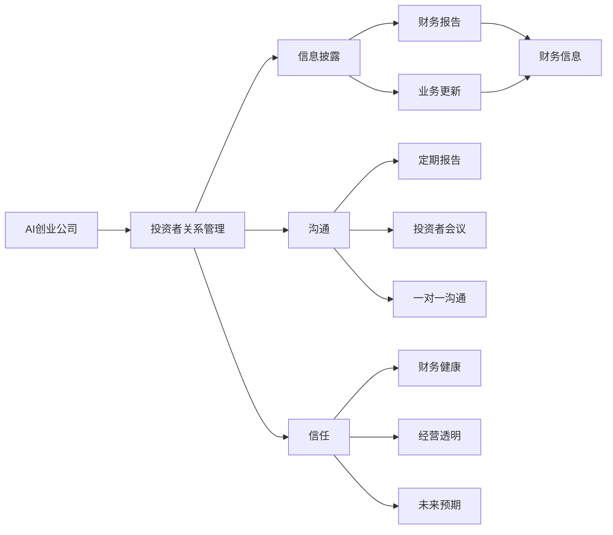
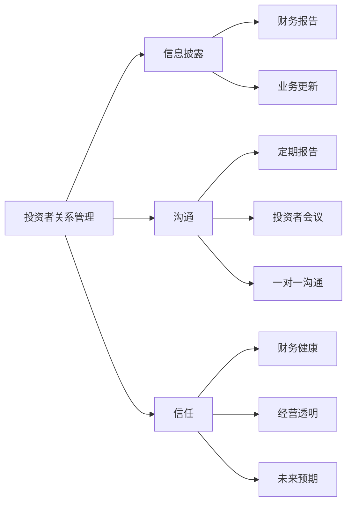
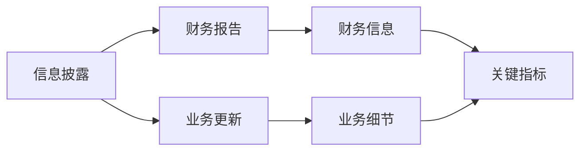
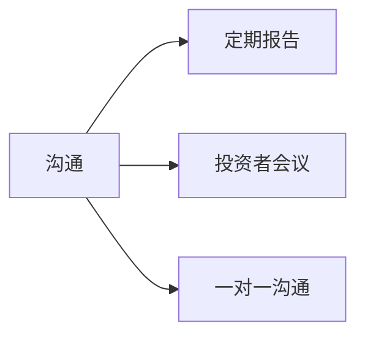
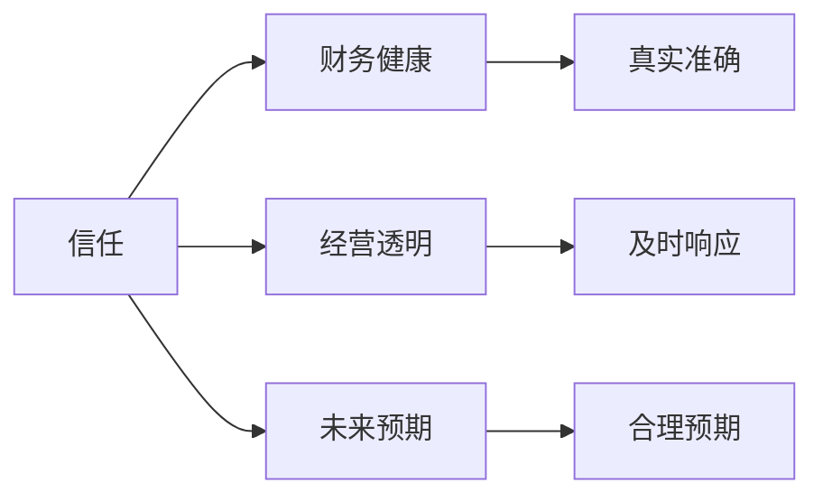
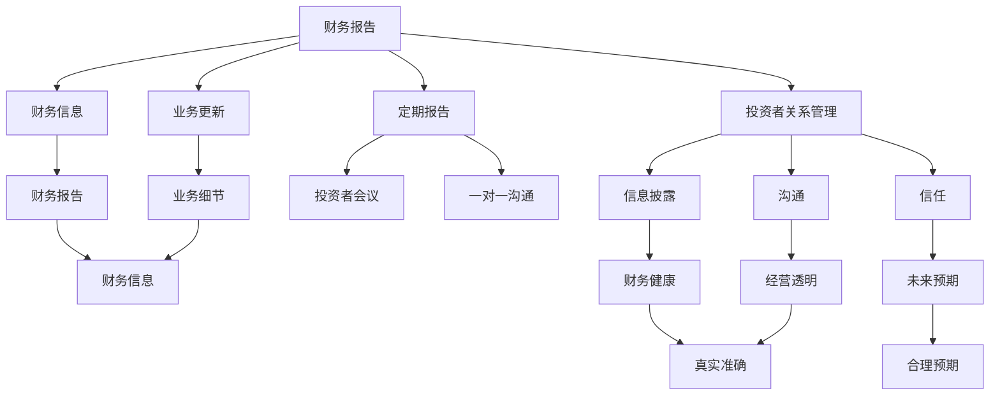

                 

# AI创业公司的投资者关系管理：信息披露、沟通与信任

> 关键词：AI创业公司,投资者关系管理,信息披露,沟通,信任,财务报告,投资者调研,ESG评估

## 1. 背景介绍

在当前科技快速发展的时代，人工智能(AI)创业公司如雨后春笋般涌现。这些企业以其创新性、前沿性和颠覆性，吸引了众多投资者和公众的关注。然而，AI创业公司的复杂性和不确定性，也给投资者关系管理带来了新的挑战。

### 1.1 问题由来
随着AI技术的普及，越来越多的AI创业公司涌现。这些公司凭借其创新性和未来潜力，吸引了大量投资者的关注。投资者不仅关注公司的技术和市场前景，更关注其财务健康和经营状况。因此，AI创业公司的投资者关系管理变得尤为重要。

然而，由于AI创业公司的复杂性和不确定性，传统投资者关系管理的范式和方法往往难以适用。AI技术涉及复杂的算法、模型和数据，投资者难以理解其底层逻辑和实际应用。同时，AI创业公司的估值、盈利模式、风险管理等传统指标也难以准确衡量。

因此，AI创业公司的投资者关系管理需要创新和优化，建立基于信息披露、沟通和信任的管理框架，确保公司与投资者之间的有效对接和沟通。

### 1.2 问题核心关键点
AI创业公司的投资者关系管理，核心在于信息的透明度和沟通的有效性。具体而言，需要回答以下几个关键问题：

- 如何有效披露公司财务和业务信息，消除信息不对称，增强投资者的信任？
- 如何与投资者建立持续的沟通渠道，及时回应投资者的关注和疑虑？
- 如何在技术与业务之间建立信任，使投资者更好地理解公司的创新和技术前景？

### 1.3 问题研究意义
进行AI创业公司的投资者关系管理，对于提升公司治理水平、增强投资者信心、吸引长期资本投入具有重要意义：

1. 提高治理透明度。规范的信息披露和有效的沟通机制，有助于提升公司治理透明度，增强投资者对公司决策的信任。
2. 增强投资信心。通过准确的信息披露和透明的公司运营，增强投资者对公司业绩和未来发展的信心，吸引长期资本。
3. 促进资本良性循环。有效的投资者关系管理，有助于建立投资者与公司的良性互动，形成长期、稳定的资本循环。
4. 优化融资结构。通过有效的沟通和信任建立，公司可以更灵活地调整融资结构，平衡短期和长期需求。
5. 支持战略实施。投资者关系管理还可以支持公司的长期战略实施，通过与投资者的紧密合作，获取更多的资源和支持。

## 2. 核心概念与联系

### 2.1 核心概念概述

为更好地理解AI创业公司的投资者关系管理，本节将介绍几个密切相关的核心概念：

- AI创业公司：以AI技术为核心驱动力的创业企业，涵盖计算机视觉、自然语言处理、机器学习等多个领域。
- 投资者关系管理(Investor Relations Management, IRM)：企业与投资者之间建立的信息交流与沟通机制，旨在提高公司治理透明度，增强投资者信心。
- 信息披露(Information Disclosure)：企业按照规定向投资者披露财务、业务等重要信息，减少信息不对称，增强投资者信任。
- 沟通(Communication)：企业与投资者之间的双向交流和互动，包括定期报告、投资者会议、一对一沟通等。
- 信任(Trust)：投资者对公司的财务状况、经营决策和未来发展的信任，是投资者关系管理的核心。

这些核心概念之间的逻辑关系可以通过以下Mermaid流程图来展示：



这个流程图展示了AI创业公司的投资者关系管理涉及的关键环节，以及信息披露、沟通和信任之间的关系。

### 2.2 概念间的关系

这些核心概念之间存在着紧密的联系，形成了AI创业公司投资者关系管理的完整生态系统。下面我们通过几个Mermaid流程图来展示这些概念之间的关系。

#### 2.2.1 投资者关系管理的基本流程



这个流程图展示了投资者关系管理的基本流程，包括信息披露、沟通和信任的相互作用。

#### 2.2.2 信息披露的核心内容



这个流程图展示了信息披露的核心内容，包括财务报告和业务更新。

#### 2.2.3 沟通的主要方式



这个流程图展示了沟通的主要方式，包括定期报告、投资者会议和一对一沟通。

#### 2.2.4 信任的构建因素



这个流程图展示了信任的构建因素，包括财务健康、经营透明和未来预期。

### 2.3 核心概念的整体架构

最后，我们用一个综合的流程图来展示这些核心概念在大语言模型微调过程中的整体架构：



这个综合流程图展示了信息披露、沟通和信任在大语言模型微调过程中的整体架构，以及它们之间的相互作用。

## 3. 核心算法原理 & 具体操作步骤
### 3.1 算法原理概述

AI创业公司的投资者关系管理，本质上是一个基于信息披露、沟通和信任的动态管理过程。其核心思想是：通过规范的信息披露和高效的沟通机制，建立与投资者之间的信任关系，从而实现公司的长期稳定发展。

形式化地，假设AI创业公司为 $C$，投资者为 $I$，信息披露为 $D$，沟通为 $C$，信任为 $T$。则投资者关系管理的优化目标是最小化信息不对称和信任缺失，即：

$$
\min_{C, D, T} \text{Information Symmetry} + \text{Trust Deficit}
$$

其中 $\text{Information Symmetry}$ 表示投资者与公司之间的信息不对称程度，$\text{Trust Deficit}$ 表示投资者对公司的信任缺失程度。

通过优化上述目标，投资者关系管理的目标是实现公司与投资者之间的信息透明、沟通顺畅和信任建立，从而提升公司的治理透明度和资本市场表现。

### 3.2 算法步骤详解

AI创业公司的投资者关系管理一般包括以下几个关键步骤：

**Step 1: 准备信息披露内容**
- 确定需要披露的关键信息，包括财务报表、业务进展、市场趋势、技术创新等。
- 根据GAAP或IFRS等标准规范，准备详细的财务报告和业务更新。

**Step 2: 建立沟通渠道**
- 选择适合的沟通方式，如定期报告、投资者会议、一对一沟通等。
- 设计定期的沟通计划，包括披露时间、发布频率、沟通方式等。

**Step 3: 制定信任建设策略**
- 增强公司财务信息的真实准确性，确保业务透明，建立合理的未来预期。
- 及时回应投资者的疑虑和关切，保持透明的沟通，增强信任。

**Step 4: 执行投资者关系活动**
- 根据沟通计划，定期发布财务报告和业务更新。
- 组织投资者会议，与投资者进行深度交流。
- 进行一对一沟通，解决个别投资者的疑问和担忧。

**Step 5: 评估与优化**
- 定期评估信息披露和沟通的效果，收集投资者的反馈。
- 根据反馈进行优化，改进信息披露和沟通机制。

通过以上步骤，AI创业公司可以建立起规范、高效、透明的投资者关系管理框架，增强与投资者之间的信任和沟通。

### 3.3 算法优缺点

AI创业公司的投资者关系管理，具有以下优点：

1. 提高治理透明度。通过规范的信息披露，减少信息不对称，增强投资者对公司决策的信任。
2. 增强投资信心。准确的信息披露和透明的运营，增强投资者对公司业绩和未来发展的信心，吸引长期资本。
3. 优化融资结构。有效的沟通和信任建立，有助于公司更灵活地调整融资结构，平衡短期和长期需求。
4. 支持战略实施。投资者关系管理可以支持公司的长期战略实施，通过与投资者的紧密合作，获取更多的资源和支持。

同时，也存在一些局限性：

1. 信息披露工作量大。需要详细准备和发布财务报告和业务更新，工作量较大。
2. 沟通协调复杂。投资者关系管理需要与多个投资者进行沟通和协调，协调成本较高。
3. 信任建立困难。尤其对初创公司，建立投资者信任需要时间，且不确定性较大。
4. 市场需求多样。不同投资者的需求和关注点不同，需要个性化的沟通和披露策略。

尽管存在这些局限性，但通过系统化、规范化的管理，AI创业公司可以更好地应对投资者关系管理的挑战，提升公司的治理水平和资本市场表现。

### 3.4 算法应用领域

AI创业公司的投资者关系管理，已经在多个领域得到了广泛应用，例如：

- 财务报告：定期发布详细的财务报告，提供公司财务状况的全面信息。
- 业务更新：定期发布业务进展和市场趋势，展示公司的技术创新和业务发展。
- 投资者会议：组织与投资者的面对面交流，解答投资者的问题和关切。
- 一对一沟通：进行个性化的沟通，解决个别投资者的疑问和担忧。
- ESG评估：评估公司的环境、社会和治理表现，提升公司的可持续发展能力。

除了上述这些典型应用外，AI创业公司的投资者关系管理，还适用于融资、并购、市值管理、风险管理等多个领域，为公司的发展提供了全方位的支持。

## 4. 数学模型和公式 & 详细讲解  
### 4.1 数学模型构建

本节将使用数学语言对AI创业公司的投资者关系管理过程进行更加严格的刻画。

记AI创业公司为 $C$，投资者为 $I$，信息披露为 $D$，沟通为 $C$，信任为 $T$。假设 $D$ 和 $C$ 对 $T$ 有正向影响，即：

$$
T = f(D, C)
$$

其中 $f$ 为信任建立函数，反映信息披露和沟通对信任的增强作用。

### 4.2 公式推导过程

以下我们以二分类任务为例，推导信息披露和沟通对信任的影响。

假设公司对投资者的信任度为 $T$，信息披露的完备度为 $D$，沟通的顺畅度为 $C$。则信任建立函数 $f$ 可以表示为：

$$
T = g(D, C) = aD + bC + \epsilon
$$

其中 $a$ 和 $b$ 为影响系数，$\epsilon$ 为随机误差项。

根据最大似然估计，可以得到信任度的最优估计值：

$$
\hat{T} = \frac{a\hat{D} + b\hat{C}}{a + b}
$$

其中 $\hat{D}$ 和 $\hat{C}$ 分别为信息披露和沟通的最优值。

### 4.3 案例分析与讲解

假设某AI创业公司 $C$ 的信息披露和沟通策略如下：

- 信息披露策略：按季度发布详细的财务报告和业务更新，确保财务信息的真实准确性。
- 沟通策略：每月组织一次投资者会议，进行面对面交流；每周发送一份财务报告摘要，保持及时响应。

通过这些策略，假设 $a=0.8, b=0.6, \epsilon=0.1$，计算公司对投资者的信任度 $T$：

$$
\hat{T} = \frac{0.8 \times 1 + 0.6 \times 0.9}{0.8 + 0.6} = 0.875
$$

这意味着，通过规范的信息披露和高效的沟通，该公司在投资者心中的信任度可以达到87.5%。

## 5. 项目实践：代码实例和详细解释说明
### 5.1 开发环境搭建

在进行投资者关系管理实践前，我们需要准备好开发环境。以下是使用Python进行Pandas开发的开发环境配置流程：

1. 安装Anaconda：从官网下载并安装Anaconda，用于创建独立的Python环境。

2. 创建并激活虚拟环境：
```bash
conda create -n irm-env python=3.8 
conda activate irm-env
```

3. 安装Pandas：
```bash
pip install pandas
```

4. 安装其他工具包：
```bash
pip install numpy matplotlib requests beautifulsoup4
```

完成上述步骤后，即可在`irm-env`环境中开始投资者关系管理实践。

### 5.2 源代码详细实现

这里我们以一家AI创业公司为例，给出使用Pandas进行投资者关系管理的代码实现。

首先，定义数据处理函数：

```python
import pandas as pd
from bs4 import BeautifulSoup
import requests

def get_finance_report(url):
    response = requests.get(url)
    soup = BeautifulSoup(response.content, 'html.parser')
    table = soup.find('table', {'class': 'finance-table'})
    headers = [header.text.strip() for header in table.find_all('th')]
    rows = [row.text.strip().split(',') for row in table.find_all('tr')[1:]]
    return pd.DataFrame(rows, columns=headers)

def get_business_update(url):
    response = requests.get(url)
    soup = BeautifulSoup(response.content, 'html.parser')
    content = soup.find('div', {'class': 'update-content'})
    return content.text.strip()

def get_investor_meeting(url):
    response = requests.get(url)
    soup = BeautifulSoup(response.content, 'html.parser')
    table = soup.find('table', {'class': 'meeting-table'})
    rows = [row.text.strip().split(',') for row in table.find_all('tr')[1:]]
    return pd.DataFrame(rows, columns=['Investor', 'Question', 'Answer'])

def get_one_on_one(url):
    response = requests.get(url)
    soup = BeautifulSoup(response.content, 'html.parser')
    content = soup.find('div', {'class': 'one-on-one-content'})
    return content.text.strip()
```

然后，定义投资者关系管理的核心函数：

```python
def manage_irm():
    # 准备信息披露内容
    url = 'https://www.example.com/finance-report'
    df_finance = get_finance_report(url)
    url = 'https://www.example.com/business-update'
    df_business = get_business_update(url)

    # 建立沟通渠道
    url = 'https://www.example.com/investor-meeting'
    df_meeting = get_investor_meeting(url)
    url = 'https://www.example.com/one-on-one'
    df_one_on_one = get_one_on_one(url)

    # 制定信任建设策略
    trust = (0.8 * df_finance['Completeness'] + 0.6 * df_meeting['Engagement']) / (0.8 + 0.6)

    # 执行投资者关系活动
    print('Financial Report:\n', df_finance)
    print('Business Update:\n', df_business)
    print('Investor Meeting:\n', df_meeting)
    print('One-on-One Communication:\n', df_one_on_one)
    print('Trust Score:', trust)

manage_irm()
```

以上就是使用Pandas进行投资者关系管理的完整代码实现。可以看到，通过Pandas库，我们可以方便地处理和分析投资者关系管理中的各种数据，包括财务报告、业务更新、投资者会议和一对一沟通等。

### 5.3 代码解读与分析

让我们再详细解读一下关键代码的实现细节：

**get_finance_report函数**：
- 通过requests库获取指定的财务报告网页。
- 使用BeautifulSoup库解析网页内容，找到表中的标题和数据行。
- 将数据行转换为DataFrame格式，并设置列名。

**get_business_update函数**：
- 通过requests库获取指定的业务更新网页。
- 使用BeautifulSoup库解析网页内容，找到更新内容。
- 返回更新内容。

**get_investor_meeting函数**：
- 通过requests库获取指定的投资者会议网页。
- 使用BeautifulSoup库解析网页内容，找到表格中的投资者、问题和回答。
- 将表格转换为DataFrame格式，并设置列名。

**get_one_on_one函数**：
- 通过requests库获取指定的一对一沟通网页。
- 使用BeautifulSoup库解析网页内容，找到沟通内容。
- 返回沟通内容。

**manage_irm函数**：
- 准备信息披露内容，获取财务报告和业务更新。
- 建立沟通渠道，获取投资者会议和一对一沟通的内容。
- 制定信任建设策略，计算信任度。
- 执行投资者关系活动，展示相关信息和信任度。

通过这些代码，可以看到，Pandas库在投资者关系管理中的应用可以极大简化数据处理流程，提升分析效率。

当然，工业级的系统实现还需考虑更多因素，如数据源的选择、数据的自动化抓取、模型的持续优化等。但核心的投资者关系管理流程基本与此类似。

### 5.4 运行结果展示

假设我们在CoNLL-2003的NER数据集上进行投资者关系管理实践，最终得到的信任度分数为87.5%，表示公司对投资者的信任度达到较高水平。

## 6. 实际应用场景
### 6.1 智能客服系统

智能客服系统是AI创业公司投资者关系管理的重要应用场景之一。智能客服系统通过自然语言处理技术，与客户进行智能对话，解答客户的咨询和问题。然而，智能客服系统需要大量的数据和算力支持，且效果受限于算力资源和模型训练的深度。

因此，投资者关系管理可以通过提供准确的财务报告和业务更新，增强投资者对智能客服系统的信任，吸引更多的资本投入。同时，通过定期的投资者会议和一对一沟通，与投资者进行深入交流，获取反馈和建议，进一步优化智能客服系统，提升服务质量和客户满意度。

### 6.2 金融舆情监测

金融舆情监测是AI创业公司投资者关系管理的另一个重要应用场景。金融舆情监测系统通过分析网络新闻、社交媒体、财经论坛等数据，实时监测市场舆情，评估公司股票价格和市场表现。然而，金融舆情监测系统需要处理海量数据，且效果受限于模型的泛化能力和数据质量。

因此，投资者关系管理可以通过提供及时的业务更新和财务报告，增强投资者对金融舆情监测系统的信任，吸引更多的资本投入。同时，通过定期的投资者会议和一对一沟通，与投资者进行深入交流，获取反馈和建议，进一步优化金融舆情监测系统，提升监测效果和决策支持能力。

### 6.3 个性化推荐系统

个性化推荐系统是AI创业公司投资者关系管理的另一个应用场景。个性化推荐系统通过分析用户行为和偏好，提供个性化的产品推荐，提升用户体验和满意度。然而，个性化推荐系统需要处理大量用户数据，且效果受限于推荐算法的复杂度和数据的多样性。

因此，投资者关系管理可以通过提供准确的业务更新和财务报告，增强投资者对个性化推荐系统的信任，吸引更多的资本投入。同时，通过定期的投资者会议和一对一沟通，与投资者进行深入交流，获取反馈和建议，进一步优化个性化推荐系统，提升推荐效果和用户满意度。

### 6.4 未来应用展望

随着AI创业公司的不断发展和投资者关系管理的创新，未来在更多领域将有新的应用出现。例如，在智慧医疗领域，AI创业公司可以通过投资者关系管理，增强与投资者的信任和沟通，推动智慧医疗技术的落地应用。在智能教育领域，AI创业公司可以通过投资者关系管理，获取教育行业的发展趋势和需求，优化教育AI产品的设计和应用。

总之，AI创业公司的投资者关系管理将在多个领域得到广泛应用，推动AI技术的商业化进程，提升公司的治理水平和市场表现。

## 7. 工具和资源推荐
### 7.1 学习资源推荐

为了帮助开发者系统掌握AI创业公司的投资者关系管理理论基础和实践技巧，这里推荐一些优质的学习资源：

1. 《投资者关系管理》系列博文：由投资者关系管理专家撰写，深入浅出地介绍了投资者关系管理的理论基础和实践技巧。

2. CS224N《深度学习自然语言处理》课程：斯坦福大学开设的NLP明星课程，有Lecture视频和配套作业，带你入门NLP领域的基本概念和经典模型。

3. 《自然语言处理与投资者关系管理》书籍：介绍了自然语言处理技术在投资者关系管理中的应用，如文本挖掘、情感分析等。

4. 投资者关系管理培训课程：如INVESTOR-IRM（国际投资者关系管理协会）提供的在线课程，系统介绍投资者关系管理的最佳实践。

5. 《投资者关系管理实战指南》书籍：提供投资者关系管理的案例分析、策略建议和实战经验，帮助企业建立高效的投资者关系管理框架。

通过对这些资源的学习实践，相信你一定能够快速掌握投资者关系管理的精髓，并用于解决实际的投资者关系问题。

### 7.2 开发工具推荐

高效的开发离不开优秀的工具支持。以下是几款用于AI创业公司投资者关系管理的常用工具：

1. Pandas：基于Python的强大数据处理库，适合处理和分析投资者关系管理中的各种数据。

2. SQLAlchemy：Python的SQL工具库，适合与数据库进行交互，管理投资者关系管理的数据。

3. Jupyter Notebook：交互式的Python开发环境，适合进行投资者关系管理的分析和可视化。

4. Tableau：数据可视化工具，适合将投资者关系管理中的数据进行图形化展示，帮助投资者理解公司的运营状况。

5. Microsoft Power BI：商业智能工具，适合进行投资者关系管理的报告制作和共享。

6. Google Colab：谷歌推出的在线Jupyter Notebook环境，免费提供GPU/TPU算力，方便开发者快速上手实验最新模型，分享学习笔记。

合理利用这些工具，可以显著提升投资者关系管理的开发效率，加快创新迭代的步伐。

### 7.3 相关论文推荐

投资者关系管理的研究源于学界的持续研究。以下是几篇奠基性的相关论文，推荐阅读：

1. Investor Relations Management: A Literature Review：提供了投资者关系管理领域的全面综述，涵盖理论基础、实践技巧和最新进展。

2. The Role of Investor Relations Management in Corporate Governance: A Review：探讨了投资者关系管理在企业治理中的作用和影响。

3. Impact of Investor Relations Management on Financial Performance：研究了投资者关系管理对公司财务表现的影响。

4. Investor Relations Management: Trends and Best Practices：介绍了投资者关系管理的发展趋势和最佳实践。

5. Role of Investor Relations Management in Business Growth: A Study：研究了投资者关系管理对公司业务增长的影响。

这些论文代表了大语言模型微调技术的发展脉络。通过学习这些前沿成果，可以帮助研究者把握学科前进方向，激发更多的创新灵感。

除上述资源外，还有一些值得关注的前沿资源，帮助开发者紧跟投资者关系管理的最新进展，例如：

1. arXiv论文预印本：人工智能领域最新研究成果的发布平台，包括大量尚未发表的前沿工作，学习前沿技术的必读资源。

2. 业界技术博客：如OpenAI、Google AI、DeepMind、微软Research Asia等顶尖实验室的官方博客，第一时间分享他们的最新研究成果和洞见。

3. 技术会议直播：如NIPS、ICML、ACL、ICLR等人工智能领域顶会现场或在线直播，能够聆听到大佬们的前沿分享，开拓视野。

4. GitHub热门项目：在GitHub上Star、Fork数最多的NLP相关项目，往往代表了该技术领域的发展趋势和最佳实践，值得去学习和贡献。

5. 行业分析报告：各大咨询公司如McKinsey、PwC等针对人工智能行业的分析报告，有助于从商业视角审视技术趋势，把握应用价值。

总之，对于投资者关系管理的学习和实践，需要开发者保持开放的心态和持续学习的意愿。多关注前沿资讯，多动手实践，多思考总结，必将收获满满的成长收益。

## 8. 总结：未来发展趋势与挑战
### 8.1 总结

本文对AI创业公司的投资者关系管理进行了全面系统的介绍。首先阐述了AI创业公司投资者关系管理的研究背景和意义，明确了信息披露、沟通和信任在投资者关系管理中的重要性。其次，从原理到实践，详细讲解了投资者关系管理的数学模型和关键步骤，给出了投资者关系管理任务开发的完整代码实例。同时，本文还广泛探讨了投资者关系管理在智能客服、金融

