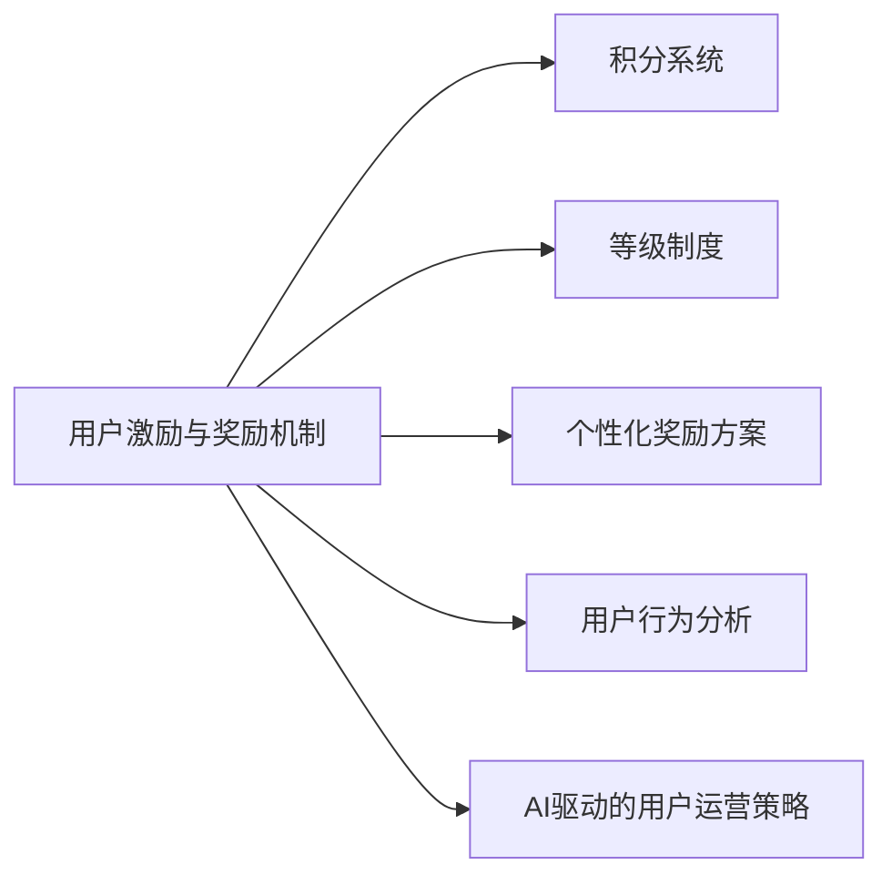
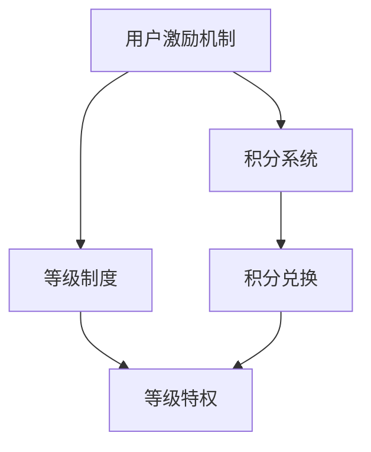
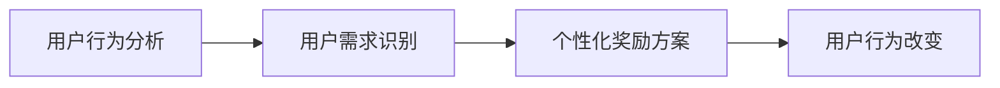
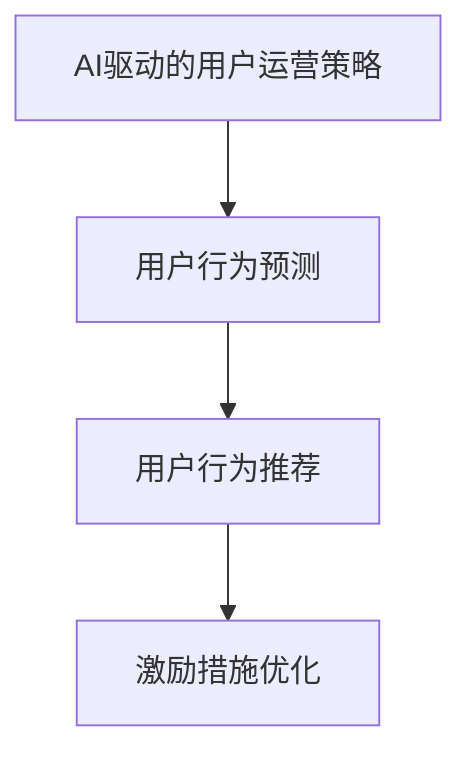
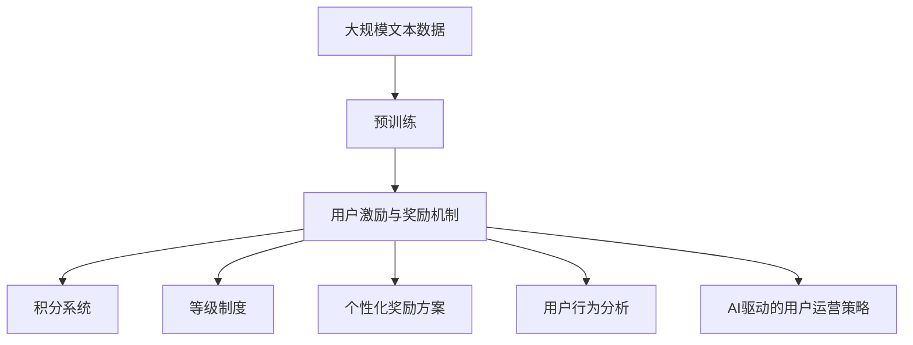

                 

# AI创业公司的用户激励与奖励机制设计：积分机制、等级机制与奖励方案

> 关键词：用户激励机制, 积分机制, 等级机制, 奖励方案, 用户留存, 用户增长, 用户行为分析, AI驱动的用户运营策略

## 1. 背景介绍

在当今竞争激烈的互联网市场中，用户留存和增长是AI创业公司持续发展的关键。为了吸引用户并维持他们的活跃度，许多公司都开发了不同的用户激励与奖励机制。这些机制旨在通过各种奖励手段，提升用户的参与度和满意度，促进用户长期留存和业务增长。

### 1.1 问题由来

随着人工智能技术的发展，用户激励与奖励机制也在不断进化。从简单的积分系统和等级制度，到复杂的个性化奖励方案，这些机制帮助公司更好地理解和满足用户需求。然而，如何设计一个既高效又可持续的用户激励系统，成为了AI创业公司面临的重要问题。

### 1.2 问题核心关键点

用户激励与奖励机制设计的核心在于：
- 理解用户需求与行为：通过数据分析，发现用户行为模式，从而设计针对性激励措施。
- 设计有效的激励机制：通过积分、等级、奖励等多种方式，提升用户参与度和满意度。
- 确保机制可持续性：避免过度激励，防止用户疲劳和激励成本过高。

### 1.3 问题研究意义

设计有效的用户激励与奖励机制，对于提升用户留存率、促进用户增长、增强用户粘性具有重要意义。良好的激励机制可以吸引新用户，留住老用户，提升用户体验，从而实现业务的可持续发展。

## 2. 核心概念与联系

### 2.1 核心概念概述

为更好地理解用户激励与奖励机制设计，本节将介绍几个密切相关的核心概念：

- 用户激励与奖励机制：旨在通过各种奖励手段，提升用户的参与度和满意度，促进用户长期留存和业务增长。
- 积分系统：一种常见的奖励机制，用户通过完成特定任务或行为获取积分，积分可兑换奖励或提升用户等级。
- 等级制度：根据用户的积分、行为、贡献等因素，设置不同的用户等级，每个等级享有不同的权益和特权。
- 个性化奖励方案：针对不同用户群体和行为，设计个性化的奖励策略，提升用户满意度和忠诚度。
- 用户行为分析：通过数据分析，理解用户的行为模式和需求，设计针对性的激励措施。
- AI驱动的用户运营策略：利用人工智能技术，如机器学习、自然语言处理等，进行用户行为预测和推荐，优化用户运营策略。

这些核心概念之间的逻辑关系可以通过以下Mermaid流程图来展示：



这个流程图展示了几大核心概念在大语言模型微调过程中的整体架构：

1. 用户激励与奖励机制是整个设计的基础。
2. 积分系统、等级制度和个性化奖励方案，都是具体化的激励手段。
3. 用户行为分析和AI驱动的用户运营策略，为激励机制设计提供数据支持和智能决策。

### 2.2 概念间的关系

这些核心概念之间存在着紧密的联系，形成了用户激励与奖励机制设计的完整生态系统。下面我通过几个Mermaid流程图来展示这些概念之间的关系。

#### 2.2.1 用户激励机制与积分系统、等级制度



这个流程图展示了一个简单的激励机制，其中积分系统和等级制度是具体的实现方式。

#### 2.2.2 用户行为分析与个性化奖励方案



这个流程图展示了用户行为分析如何指导个性化奖励方案的设计和实施。

#### 2.2.3 AI驱动的用户运营策略



这个流程图展示了AI技术如何通过预测和推荐，优化用户运营策略，提升激励效果。

### 2.3 核心概念的整体架构

最后，我们用一个综合的流程图来展示这些核心概念在大语言模型微调过程中的整体架构：



这个综合流程图展示了从预训练到用户激励与奖励机制设计的完整过程。用户激励与奖励机制设计涉及多个方面，包括积分系统、等级制度、个性化奖励方案、用户行为分析和AI驱动的用户运营策略，所有这些要素共同作用，形成了一个全面的用户激励与奖励机制。

## 3. 核心算法原理 & 具体操作步骤
### 3.1 算法原理概述

用户激励与奖励机制设计的核心算法原理是基于强化学习（Reinforcement Learning, RL）和行为工程学（Behavioral Engineering）的原理。通过分析用户行为，设计适当的激励手段，利用机器学习算法优化激励方案，最终提升用户参与度和满意度。

### 3.2 算法步骤详解

用户激励与奖励机制的设计可以分为以下几个步骤：

**Step 1: 数据收集与用户行为分析**

- 收集用户行为数据，如登录次数、互动频率、任务完成情况等。
- 利用数据分析工具，如Google Analytics、Mixpanel等，进行用户行为分析，发现用户的行为模式和需求。

**Step 2: 设定激励机制**

- 根据用户行为分析结果，设定激励机制，如积分系统、等级制度等。
- 设计积分和等级的具体规则，如积分获取方式、兑换条件、等级晋升标准等。

**Step 3: 实施个性化奖励方案**

- 根据用户行为和属性，设计个性化的奖励方案，如针对新用户和老用户的不同奖励策略。
- 利用机器学习算法，如决策树、随机森林、神经网络等，对用户进行分类和预测，优化个性化奖励方案。

**Step 4: 实时监控与优化**

- 实时监控用户行为和激励效果，如用户留存率、任务完成率等。
- 利用A/B测试等方法，不断优化激励方案，确保其有效性和可持续性。

### 3.3 算法优缺点

用户激励与奖励机制设计的主要优点包括：
1. 提升用户参与度和满意度，促进用户长期留存和业务增长。
2. 通过数据分析和机器学习，实现个性化的奖励方案，提升用户体验。
3. 实时监控和优化激励效果，确保激励机制的有效性和可持续性。

然而，该方法也存在一些局限性：
1. 数据收集和分析的成本较高，需要投入大量资源。
2. 设计复杂的激励机制，可能增加用户困惑和疲劳感。
3. 机器学习算法的精准度受限于数据质量和模型选择，可能存在偏差。

### 3.4 算法应用领域

用户激励与奖励机制设计在多个领域都得到了广泛应用，例如：

- 社交媒体平台：如Facebook、微信、微博等，通过积分和等级制度激励用户活跃度和互动。
- 电子商务平台：如Amazon、淘宝、京东等，通过积分和优惠券等激励用户购买和评论。
- 在线教育平台：如Coursera、Udacity等，通过积分和认证机制激励用户学习和参与课程讨论。
- 移动应用：如抖音、知乎、B站等，通过积分和等级制度提升用户粘性和活跃度。

除了上述这些经典应用外，用户激励与奖励机制还在游戏、金融、健康、旅游等多个领域得到应用，为各行业的用户运营提供了有效的手段。

## 4. 数学模型和公式 & 详细讲解  
### 4.1 数学模型构建

本节将使用数学语言对用户激励与奖励机制设计的数学模型进行描述。

假设用户行为数据为 $D=\{(x_i,y_i)\}_{i=1}^N$，其中 $x_i$ 为行为特征向量，$y_i$ 为行为标签。设计激励机制的数学模型为：

$$
\mathcal{M} = \arg\max_{\theta} \sum_{i=1}^N L(y_i, \mathcal{F}(x_i, \theta))
$$

其中 $\theta$ 为激励机制的参数，$\mathcal{F}(x_i, \theta)$ 为激励模型，$L$ 为损失函数。

常见的损失函数包括均方误差、交叉熵等，具体选择取决于激励机制的类型和目标。

### 4.2 公式推导过程

以下我们将以积分系统为例，推导积分获取和兑换的数学模型。

假设用户完成特定任务后获得积分，积分数量记为 $G_i$，积分与完成任务的难度成比例，即 $G_i = k \times D_i$，其中 $D_i$ 为任务难度，$k$ 为积分系数。用户达到一定积分后，可以兑换奖励，设奖励为 $R_j$，兑换规则为 $R_j = R \times I_j$，其中 $I_j$ 为用户积分。

根据以上定义，积分系统的数学模型可以表示为：

$$
\mathcal{M} = \arg\max_{\theta} \sum_{i=1}^N L(G_i, \theta)
$$

其中 $L$ 为损失函数，$G_i$ 为任务难度和积分系数的乘积。

### 4.3 案例分析与讲解

假设一个在线教育平台设计了积分系统，用户完成课程学习任务后获得积分，积分可以兑换课程优惠券。具体积分和兑换规则如下：

1. 用户每完成一节课程学习，获得 $10$ 积分。
2. 用户积分达到 $100$ 分时，可以兑换 $20$ 元优惠券，有效期为一个月。
3. 优惠券可在下次购买课程时使用，每次使用后扣减 $20$ 元。

通过数据统计和用户行为分析，平台发现 $60\%$ 的用户在积分达到 $100$ 分时会兑换优惠券。此时，可以设计如下激励模型：

$$
\mathcal{F}(x_i, \theta) = \left\{
\begin{aligned}
10 &\quad &\text{if } D_i \leq \theta \\
0 &\quad &\text{otherwise}
\end{aligned}
\right.
$$

其中 $D_i$ 为任务难度，$\theta$ 为积分系数。用户积分达到 $100$ 分时，可以兑换优惠券：

$$
\mathcal{R}(x_i, \theta) = \left\{
\begin{aligned}
R &\quad &\text{if } I_i \geq 100 \\
0 &\quad &\text{otherwise}
\end{aligned}
\right.
$$

其中 $I_i$ 为用户积分，$R$ 为优惠券金额。

## 5. 项目实践：代码实例和详细解释说明
### 5.1 开发环境搭建

在进行用户激励与奖励机制设计时，我们需要准备好开发环境。以下是使用Python进行TensorFlow开发的环境配置流程：

1. 安装Anaconda：从官网下载并安装Anaconda，用于创建独立的Python环境。

2. 创建并激活虚拟环境：
```bash
conda create -n tf-env python=3.8 
conda activate tf-env
```

3. 安装TensorFlow：根据CUDA版本，从官网获取对应的安装命令。例如：
```bash
conda install tensorflow -c conda-forge
```

4. 安装各类工具包：
```bash
pip install numpy pandas scikit-learn matplotlib tqdm jupyter notebook ipython
```

完成上述步骤后，即可在`tf-env`环境中开始项目实践。

### 5.2 源代码详细实现

这里我们以积分系统为例，给出使用TensorFlow进行用户激励与奖励机制设计的PyTorch代码实现。

首先，定义积分系统的数学模型：

```python
import tensorflow as tf
from tensorflow.keras.layers import Input, Dense
from tensorflow.keras.models import Model

# 定义积分系统的数学模型
input_layer = Input(shape=(num_features,))
hidden_layer = Dense(64, activation='relu')(input_layer)
output_layer = Dense(1, activation='sigmoid')(hidden_layer)

# 定义损失函数
loss_function = tf.keras.losses.BinaryCrossentropy()

# 定义激励模型
model = Model(input_layer, output_layer)
model.compile(optimizer=tf.keras.optimizers.Adam(learning_rate=0.001), loss=loss_function)
```

然后，训练积分系统：

```python
# 准备训练数据
train_data = ...
train_labels = ...

# 训练积分系统
model.fit(train_data, train_labels, epochs=10, batch_size=32)
```

最后，评估积分系统的效果：

```python
# 准备测试数据
test_data = ...
test_labels = ...

# 评估积分系统的效果
test_loss = model.evaluate(test_data, test_labels)
print(f"测试损失：{test_loss:.4f}")
```

以上就是使用TensorFlow进行用户激励与奖励机制设计的完整代码实现。可以看到，TensorFlow提供了强大的工具和库，使得用户激励与奖励机制的实现变得简单易懂。

### 5.3 代码解读与分析

让我们再详细解读一下关键代码的实现细节：

**积分系统数学模型**：
- `input_layer`：输入层，接受用户行为特征向量。
- `hidden_layer`：隐藏层，通过全连接层对输入进行非线性变换。
- `output_layer`：输出层，输出积分系数。
- `loss_function`：损失函数，使用二元交叉熵损失。
- `model`：激励模型，包含输入层、隐藏层和输出层。

**训练与评估流程**：
- `train_data`：训练数据集，包含用户行为特征和积分系数。
- `train_labels`：训练标签集，包含用户积分。
- `model.fit`：训练积分系统，指定训练轮数和批次大小。
- `test_data`：测试数据集，包含用户行为特征和积分系数。
- `test_labels`：测试标签集，包含用户积分。
- `model.evaluate`：评估积分系统的效果，返回测试损失。

**代码解读**：
- 代码实现了简单的积分系统，通过输入层和隐藏层进行非线性变换，输出积分系数。
- 损失函数使用二元交叉熵损失，衡量预测积分和真实积分之间的差异。
- 训练过程使用Adam优化器，学习率为 $0.001$。
- 测试过程使用模型评估函数，计算测试损失。

## 6. 实际应用场景

### 6.1 社交媒体平台

社交媒体平台通过积分和等级制度激励用户活跃度和互动。例如，微信通过点赞、评论和分享获得微信豆，用户可以兑换微信红包、表情等。Facebook则通过积分和等级激励用户完成各种任务，如点赞、分享、好友互加等。

### 6.2 电子商务平台

电子商务平台通过积分和优惠券激励用户购买和评论。例如，Amazon通过积分和优惠券激励用户购买商品，用户可以兑换亚马逊礼品卡、免费商品等。淘宝则通过积分和优惠券激励用户参与购物车分享、评价等。

### 6.3 在线教育平台

在线教育平台通过积分和认证机制激励用户学习和参与课程讨论。例如，Coursera通过积分和证书激励用户完成课程学习，用户可以兑换Coursera优惠券、电子书等。Udacity则通过积分和证书激励用户参与编程项目，用户可以兑换Udacity会员等。

### 6.4 未来应用展望

随着人工智能技术的发展，用户激励与奖励机制设计将呈现以下几个发展趋势：

1. 更加个性化：利用人工智能技术，实现更加个性化的奖励方案，提升用户满意度和忠诚度。
2. 动态调整：根据用户行为实时调整激励方案，提升用户参与度和满意度。
3. 跨平台整合：整合不同平台的数据和奖励方案，实现统一的用户激励机制。
4. 社交互动：通过社交网络平台，增加用户之间的互动和分享，提升用户粘性。
5. 游戏化设计：借鉴游戏设计原理，设计更加有趣和吸引用户的激励机制。

这些趋势将推动用户激励与奖励机制设计向更加智能化、个性化和互动化的方向发展，为AI创业公司带来更多的用户增长机会。

## 7. 工具和资源推荐
### 7.1 学习资源推荐

为了帮助开发者系统掌握用户激励与奖励机制设计的理论基础和实践技巧，这里推荐一些优质的学习资源：

1. 《User Experience: Research Methods and Applications》：详细介绍了用户体验的研究方法和应用，涵盖用户激励和奖励机制的设计原理和实践案例。
2. 《Designing Behavioral Experiments: Statistical Methods》：介绍了行为实验的设计和分析方法，帮助开发者设计和评估用户激励机制的效果。
3. 《User-Centered Product Design》：介绍了用户体验和产品设计的基本原理和实践方法，涵盖用户激励和奖励机制的设计策略。
4. 《Behavioral Science in Product Design》：介绍了行为科学在产品设计中的应用，帮助开发者理解和设计更加有效的激励机制。
5. 《Machine Learning for Trading》：介绍了机器学习在金融交易中的应用，包括用户行为预测和个性化激励方案设计。

通过对这些资源的学习实践，相信你一定能够快速掌握用户激励与奖励机制设计的精髓，并用于解决实际的NLP问题。

### 7.2 开发工具推荐

高效的开发离不开优秀的工具支持。以下是几款用于用户激励与奖励机制开发的常用工具：

1. TensorFlow：由Google主导开发的开源深度学习框架，生产部署方便，适合大规模工程应用。
2. PyTorch：基于Python的开源深度学习框架，灵活动态的计算图，适合快速迭代研究。
3. Scikit-learn：Python数据科学库，提供了丰富的机器学习算法和数据处理工具，适合用户行为分析和激励模型设计。
4. Jupyter Notebook：免费的交互式笔记本环境，适合数据分析和模型调试。
5. GitHub：免费的代码托管平台，适合代码版本控制和团队协作。

合理利用这些工具，可以显著提升用户激励与奖励机制设计的开发效率，加快创新迭代的步伐。

### 7.3 相关论文推荐

用户激励与奖励机制设计的研究源于学界的持续研究。以下是几篇奠基性的相关论文，推荐阅读：

1. 《User Modeling for Recommendation Systems》：介绍了用户建模的方法和应用，涵盖用户行为分析和个性化奖励方案设计。
2. 《A Multi-Armed Bandit Approach to Dynamic Pricing》：介绍了多臂赌博机方法，用于动态调整价格和激励方案。
3. 《Personalization and Adaptive Models in Recommendation Systems》：介绍了个性化和适应性推荐模型的设计和应用，涵盖用户行为分析和个性化奖励方案设计。
4. 《Behavioral Models for Recommender Systems》：介绍了行为模型在推荐系统中的应用，涵盖用户行为分析和个性化奖励方案设计。
5. 《A Survey of Reinforcement Learning in Recommendation Systems》：综述了强化学习在推荐系统中的应用，涵盖用户行为分析和个性化奖励方案设计。

这些论文代表了大语言模型微调技术的发展脉络。通过学习这些前沿成果，可以帮助研究者把握学科前进方向，激发更多的创新灵感。

除上述资源外，还有一些值得关注的前沿资源，帮助开发者紧跟用户激励与奖励机制设计的最新进展，例如：

1. arXiv论文预印本：人工智能领域最新研究成果的发布平台，包括大量尚未发表的前沿工作，学习前沿技术的必读资源。
2. 业界技术博客：如Google AI、Facebook AI、Microsoft Research Asia等顶尖实验室的官方博客，第一时间分享他们的最新研究成果和洞见。
3. 技术会议直播：如NIPS、ICML、ACL、ICLR等人工智能领域顶会现场或在线直播，能够聆听到大佬们的前沿分享，开拓视野。
4. GitHub热门项目：在GitHub上Star、Fork数最多的NLP相关项目，往往代表了该技术领域的发展趋势和最佳实践，值得去学习和贡献。
5. 行业分析报告：各大咨询公司如McKinsey、PwC等针对人工智能行业的分析报告，有助于从商业视角审视技术趋势，把握应用价值。

总之，对于用户激励与奖励机制设计的学习，需要开发者保持开放的心态和持续学习的意愿。多关注前沿资讯，多动手实践，多思考总结，必将收获满满的成长收益。

## 8. 总结：未来发展趋势与挑战
### 8.1 总结

本文对用户激励与奖励机制设计进行了全面系统的介绍。首先阐述了用户激励与奖励机制设计的研究背景和意义，明确了激励机制在提升用户留存率、促进用户增长、增强用户粘性方面的重要价值。其次，从原理到实践，详细讲解了用户激励与奖励机制设计的数学模型和关键步骤，给出了用户激励与奖励机制设计的完整代码实例。同时，本文还广泛探讨了激励机制在社交媒体、电子商务、在线教育等多个行业领域的应用前景，展示了激励机制设计的巨大潜力。

通过本文的系统梳理，可以看到，用户激励与奖励机制设计是一个复杂而高效的系统工程。通过科学的设计和优化，用户激励与奖励机制能够有效地提升用户参与度和满意度，实现业务的可持续发展。

### 8.2 未来发展趋势

展望未来，用户激励与奖励机制设计将呈现以下几个发展趋势：

1. 更加个性化：利用人工智能技术，实现更加个性化的奖励方案，提升用户满意度和忠诚度。
2. 动态调整：根据用户行为实时调整激励方案，提升用户参与度和满意度。
3. 跨平台整合：整合不同平台的数据和奖励方案，实现统一的用户激励机制。
4. 社交互动：通过社交网络平台，增加用户之间的互动和分享，提升用户粘性。
5. 游戏化设计：借鉴游戏设计原理，设计更加有趣和吸引用户的激励机制。

这些趋势凸显了用户激励与奖励机制设计的广阔前景。这些方向的探索发展，必将进一步提升用户体验和业务价值，为AI创业公司带来更多的用户增长机会。

### 8.3 面临的挑战

尽管用户激励与奖励机制设计已经取得了瞩目成就，但在迈向更加智能化、个性化应用的过程中，它仍面临着诸多挑战：

1. 数据收集和分析的成本较高，需要投入大量资源。
2. 设计复杂的激励机制，可能增加用户困惑和疲劳感。
3. 机器学习算法的精准度受限于数据质量和模型选择，可能存在偏差。
4. 激励机制的长期效果难以预测，可能存在过度激励或激励不足的情况。
5. 用户隐私保护问题，如何收集和处理用户数据，同时保护用户隐私，仍需深入研究。

正视用户激励与奖励机制设计面临的这些挑战，积极应对并寻求突破，将是大语言模型微调走向成熟的必由之路。相信随着学界和产业界的共同努力，这些挑战终将一一被克服，用户激励与奖励机制设计必将在构建人机协同的智能时代中扮演越来越重要的角色。

### 8.4 未来突破

面对用户激励与奖励机制设计所面临的种种挑战，未来的研究需要在以下几个方面寻求新的突破：

1. 探索无监督和半监督激励机制设计：摆脱对大规模标注数据的依赖，利用自监督学习、主动学习等无监督和半监督范式，最大限度利用非结构化数据，实现更加灵活高效的激励机制。
2. 研究参数高效和计算高效的激励机制：开发更加参数高效的激励机制，在固定大部分预训练参数的同时，只更新极少量的激励方案参数。同时优化激励模型的计算图，减少前向传播和反向传播的资源消耗，实现更加轻量级、实时性的部署。
3. 引入因果分析和博弈论工具：将因果分析方法引入激励机制设计，识别出激励机制决策的关键特征，增强激励机制的因果性和逻辑性。借助博弈论工具刻画人机交互过程，主动探索并规避激励机制的脆弱点，提高系统稳定性。
4. 纳入伦理道德约束：在激励机制设计中引入伦理导向的评估指标，过滤和惩罚有害的激励方案，确保激励机制符合用户价值观和伦理道德。同时加强人工干预和审核，建立激励机制行为的监管机制，确保激励机制的有效性和可持续性。

这些研究方向的探索，必将引领用户激励与奖励机制设计技术迈向更高的台阶，为构建安全、可靠、可解释、可控的智能系统铺平道路。面向未来，用户激励与奖励机制设计还需要与其他人工智能技术进行更深入的融合，如知识表示、因果推理、强化学习等，多路径协同发力，共同推动智能系统的进步。只有勇于创新、敢于突破，才能不断拓展激励机制设计的边界，让智能技术更好地造福人类社会。

## 9. 附录：常见问题与解答

**Q1：用户激励与奖励机制设计是否适用于所有用户？**

A: 用户激励与奖励机制设计通常针对大多数用户，但对于一些特定用户群体，如未成年用户、老年人等，可能需要特殊考虑。例如，未成年用户可能需要限制积分兑换和等级晋升，以保护其隐私和健康。

**Q2：如何设计有效的激励机制？**

A: 设计有效的激励机制需要考虑以下几个方面：
1. 理解用户需求与行为：通过数据分析，发现用户行为模式和需求。
2. 设定明确的激励目标：设定具体的激励目标，如积分、等级、奖励等。
3. 设计合理的激励规则：根据用户行为和属性，设计合理的积分、等级、奖励规则。
4. 实时监控与优化：实时监控激励效果，不断优化激励方案。

**Q3：用户激励与奖励机制设计是否需要大量资源？**

A: 用户激励与奖励机制设计需要投入大量资源进行数据收集和分析，但通过自动化和优化

