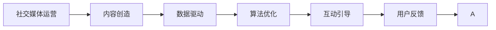

                 

# AI创业公司的社交媒体运营策略：内容创造与互动引导

在数字化转型和人工智能飞速发展的今天，AI创业公司面临的挑战和机遇并存。社交媒体作为一个极具影响力的平台，成为了AI公司重要的推广渠道和运营方式。本文将深入探讨AI创业公司在社交媒体运营中的内容创造与互动引导策略，通过结构化的方法论和具体案例，为读者提供全面而有深度的专业见解。

## 1. 背景介绍

### 1.1 问题由来
随着人工智能技术的不断成熟和应用，AI创业公司如雨后春笋般涌现。社交媒体作为连接企业和用户的重要桥梁，对AI公司而言，其价值不仅在于品牌曝光，更在于内容传播和用户互动。AI创业公司通过社交媒体不仅能展示技术实力，还能进行市场教育，吸引潜在用户和合作伙伴。

### 1.2 问题核心关键点
社交媒体运营的核心在于内容的创造与用户的互动。内容创造涉及如何产出高质量、有吸引力的内容，而互动引导则关注如何通过算法和技术手段，提升用户参与度和品牌影响力。AI创业公司需要综合利用数据分析、机器学习等技术，优化内容创造策略和用户互动模式，从而实现精准运营和高效转化。

### 1.3 问题研究意义
本研究旨在帮助AI创业公司提升社交媒体运营效率，通过内容创造与互动引导，优化用户体验，增强品牌信任度和市场竞争力。良好的社交媒体运营策略不仅能提升用户粘性，还能为公司带来显著的商业价值，促进业务增长和品牌建设。

## 2. 核心概念与联系

### 2.1 核心概念概述

- **社交媒体运营 (Social Media Marketing, SMM)**：指企业在社交平台上进行的品牌推广、内容传播和用户互动活动。通过社交媒体，企业能够与目标用户直接沟通，提升品牌曝光和用户参与。

- **内容创造 (Content Creation)**：涉及如何产出有价值、有吸引力、符合用户兴趣的内容。内容可以是文本、图片、视频等，形式多样。

- **互动引导 (Engagement Guidance)**：通过算法和技术手段，提升用户参与度，引导用户互动。互动引导包括点赞、评论、分享、私信等形式。

- **数据驱动 (Data-Driven)**：利用数据分析和机器学习技术，对社交媒体活动进行量化分析，指导内容创造和互动引导策略的优化。

- **算法优化 (Algorithm Optimization)**：通过算法优化，提升内容推荐和用户互动的精准度，提高运营效率。

- **用户反馈 (User Feedback)**：收集和分析用户反馈，不断优化内容和互动策略，提升用户体验。

### 2.2 概念间的关系

社交媒体运营的核心在于内容创造和用户互动。内容创造是基础，互动引导是手段，数据驱动是方法，算法优化是工具，用户反馈是反馈。这些概念共同构成了社交媒体运营的完整生态系统，通过相互配合，实现高效运营和用户增长。

以下是一个Mermaid流程图，展示社交媒体运营中的关键概念及其关系：



该流程图展示了社交媒体运营中各个关键概念的相互关系。内容创造是基础，数据驱动通过量化分析指导内容创造，算法优化提升互动精准度，互动引导增强用户参与，用户反馈提供改进方向。通过这种循环反馈机制，社交媒体运营能够持续优化，提升效果。

## 3. 核心算法原理 & 具体操作步骤

### 3.1 算法原理概述

社交媒体运营中的内容创造与互动引导策略，涉及一系列复杂的算法和技术手段。核心算法包括推荐算法、生成算法和互动算法，分别用于内容推荐、内容生成和用户互动。

推荐算法：通过分析用户历史行为和偏好，推荐个性化内容。常用的推荐算法有协同过滤、基于内容的推荐和矩阵分解等。

生成算法：利用自然语言处理技术，自动生成高质量的文本、图片或视频。目前常用的生成算法有GANs、VQ-VAE和扩散模型等。

互动算法：通过用户行为分析，设计用户参与激励机制，如排行榜、奖励机制等。常用的互动算法包括强化学习、行为分析等。

### 3.2 算法步骤详解

1. **数据采集与预处理**
   - 采集社交媒体平台的数据，包括用户行为数据、互动数据和内容数据。
   - 对数据进行清洗和预处理，去除噪声和不相关数据。

2. **用户行为分析**
   - 利用机器学习算法分析用户行为数据，识别用户兴趣和偏好。
   - 通过用户画像和标签系统，对用户进行分群和细分。

3. **内容推荐**
   - 基于用户行为数据和内容特征，使用推荐算法推荐个性化内容。
   - 对推荐结果进行评估和优化，提升推荐精准度。

4. **内容生成**
   - 根据用户偏好和时下热点，利用生成算法自动生成相关内容。
   - 内容生成后进行审核和优化，确保内容的真实性和合规性。

5. **用户互动引导**
   - 设计互动机制，如排行榜、评论点赞等，引导用户积极参与。
   - 分析用户互动数据，优化互动策略，提升用户参与度。

6. **数据反馈与优化**
   - 收集用户反馈数据，进行量化分析。
   - 根据反馈数据，不断优化内容创造和互动引导策略，实现持续改进。

### 3.3 算法优缺点

#### 优点
- 个性化推荐：通过分析用户行为，提供个性化的内容推荐，提升用户体验。
- 自动生成：利用AI技术自动生成高质量内容，降低人力成本。
- 用户互动：设计有效的互动机制，提升用户参与度和品牌粘性。

#### 缺点
- 数据隐私：收集和分析用户数据可能涉及隐私问题，需严格遵守数据保护法规。
- 算法偏差：推荐算法和生成算法可能存在偏差，需不断优化和校验。
- 互动过度：过度引导用户互动可能导致用户疲劳，需适度平衡。

### 3.4 算法应用领域

社交媒体运营中的内容创造与互动引导策略，广泛应用于AI创业公司的品牌推广、市场教育、用户转化等领域。以下是一些典型应用场景：

- **品牌推广**：通过内容创造和互动引导，提升品牌曝光和用户认知。
- **市场教育**：利用自动生成的教育内容，进行市场教育和技术普及。
- **用户转化**：通过个性化推荐和互动引导，引导用户完成购买、注册等转化行为。

## 4. 数学模型和公式 & 详细讲解 & 举例说明

### 4.1 数学模型构建

社交媒体运营的数学模型构建，主要围绕用户行为分析和内容推荐进行。以下是一些关键的数学模型和公式：

1. **协同过滤算法 (Collaborative Filtering)**
   - 用户行为矩阵 $R$，其中 $R_{i,j}$ 表示用户 $i$ 对商品 $j$ 的评分。
   - 用户 $i$ 的邻居 $N_i$，满足 $N_i=\{j | R_{i,j} \neq 0\}$。
   - 推荐商品 $j$ 给用户 $i$，通过 $R_{i,j}$ 和 $R_{N_i,j}$ 计算用户 $i$ 对商品 $j$ 的预测评分 $P_{i,j}$。

   **公式：**
   $$
   P_{i,j} = \frac{\sum_{k \in N_i} R_{k,j} \cdot R_{i,k}}{\sqrt{\sum_{k \in N_i} R_{k,j}^2} \cdot \sqrt{\sum_{k \in N_i} R_{i,k}^2}}
   $$

2. **基于内容的推荐 (Content-Based Recommendation)**
   - 用户 $i$ 和商品 $j$ 的特征向量 $u_i$ 和 $v_j$。
   - 计算用户 $i$ 对商品 $j$ 的相似度 $s_{i,j}$。
   - 推荐相似度高的商品给用户 $i$。

   **公式：**
   $$
   s_{i,j} = \frac{\vec{u_i} \cdot \vec{v_j}}{\|\vec{u_i}\| \cdot \|\vec{v_j}\|}
   $$

3. **深度学习生成模型 (Deep Learning Generative Model)**
   - 利用深度学习模型（如GANs、VQ-VAE）生成高质量内容。
   - 模型输入为随机噪声 $z$，输出为内容 $x$。
   - 训练过程中，最小化生成内容与真实内容之间的差异。

   **公式：**
   $$
   P(x|z) = f(z)
   $$

### 4.2 公式推导过程

协同过滤算法的推导基于用户行为矩阵 $R$，用户 $i$ 的邻居 $N_i$ 和用户 $i$ 对商品 $j$ 的预测评分 $P_{i,j}$。其推导过程如下：

1. **用户行为矩阵的构建**
   - 假设用户 $i$ 对商品 $j$ 的评分矩阵为 $R$。
   - $R_{i,j}$ 表示用户 $i$ 对商品 $j$ 的评分，$0 \leq R_{i,j} \leq 1$。

2. **用户邻居的计算**
   - 用户 $i$ 的邻居 $N_i$ 是指所有与用户 $i$ 评分过商品 $j$ 的其他用户。
   - 根据 $R$ 矩阵，$N_i=\{j | R_{i,j} \neq 0\}$。

3. **用户对商品 $j$ 的预测评分计算**
   - 通过 $R_{i,j}$ 和 $N_i$ 的评分，计算用户 $i$ 对商品 $j$ 的预测评分 $P_{i,j}$。
   - $P_{i,j}$ 的计算基于用户 $i$ 的邻居 $N_i$ 对商品 $j$ 的评分，通过余弦相似度计算用户 $i$ 对商品 $j$ 的相似度。

   **推导过程：**
   $$
   P_{i,j} = \frac{\sum_{k \in N_i} R_{k,j} \cdot R_{i,k}}{\sqrt{\sum_{k \in N_i} R_{k,j}^2} \cdot \sqrt{\sum_{k \in N_i} R_{i,k}^2}}
   $$

   其中，$\sqrt{\sum_{k \in N_i} R_{k,j}^2}$ 和 $\sqrt{\sum_{k \in N_i} R_{i,k}^2}$ 是用户 $i$ 和邻居 $N_i$ 对商品 $j$ 的相似度平方和的平方根。

### 4.3 案例分析与讲解

假设一个AI创业公司利用协同过滤算法进行内容推荐。公司收集了用户对商品的评分数据，构建了用户行为矩阵 $R$。用户 $i$ 对商品 $j$ 的评分矩阵为 $R_{i,j}$。以下是具体的案例分析：

1. **数据准备**
   - 假设公司收集了500个用户对1000个商品的评分数据。
   - 用户 $i$ 对商品 $j$ 的评分数据表示为 $R_{i,j}$。

2. **用户邻居计算**
   - 假设用户 $i$ 的邻居 $N_i$ 包含用户 $j_1, j_2, \ldots, j_{10}$。
   - 根据 $R$ 矩阵，$N_i=\{j_1, j_2, \ldots, j_{10}\}$。

3. **预测评分计算**
   - 假设用户 $i$ 对商品 $j_1$ 的预测评分为 $P_{i,j_1}$。
   - 根据协同过滤算法公式，计算 $P_{i,j_1}$。

   **计算过程：**
   $$
   P_{i,j_1} = \frac{R_{j_1,1} \cdot R_{i,j_1}}{\sqrt{R_{j_1,1}^2 + R_{i,j_1}^2} \cdot \sqrt{R_{j_1,1}^2 + R_{j_2,1}^2 + \ldots + R_{j_{10},1}^2}}
   $$

   其中，$R_{j_1,1} = 0.9, R_{i,j_1} = 0.8$。

   计算得到 $P_{i,j_1} = 0.8 \cdot 0.9 / (0.9 \cdot \sqrt{0.9^2 + 0.8^2}) = 0.8 / \sqrt{0.9^2 + 0.8^2} \approx 0.84$。

4. **结果分析**
   - 通过协同过滤算法，公司计算得到用户 $i$ 对商品 $j_1$ 的预测评分 $P_{i,j_1}$。
   - 根据评分结果，向用户 $i$ 推荐商品 $j_1$。

## 5. 项目实践：代码实例和详细解释说明

### 5.1 开发环境搭建

社交媒体运营的内容创造与互动引导策略，需要构建一个完整的开发环境。以下是搭建开发环境的具体步骤：

1. **环境准备**
   - 安装Python 3.x 和Pip，配置虚拟环境。
   - 安装必要的Python库，如Pandas、NumPy、Scikit-Learn等。

2. **数据准备**
   - 收集社交媒体平台的用户行为数据，包括点赞、评论、分享等。
   - 将数据存储在数据库或数据仓库中，方便后续处理。

3. **数据清洗**
   - 对数据进行清洗和预处理，去除噪声和不相关数据。
   - 进行特征工程，提取有用的特征向量。

### 5.2 源代码详细实现

以下是使用Python实现社交媒体运营中内容推荐和互动引导的示例代码：

1. **协同过滤推荐**
   - 导入必要的库和数据集。
   - 构建用户行为矩阵 $R$。
   - 使用协同过滤算法计算推荐评分。

   **代码示例：**

   ```python
   import pandas as pd
   from scipy.sparse import csr_matrix

   # 导入数据集
   data = pd.read_csv('user_behavior_data.csv')

   # 构建用户行为矩阵
   R = csr_matrix(data[['user_id', 'item_id', 'rating']])

   # 计算用户邻居
   N_i = R != 0

   # 计算推荐评分
   P = (R[N_i, :] * R[:, N_i].T) / (np.sqrt(R[N_i, :].pow(2).sum()) * np.sqrt(R[:, N_i].pow(2).sum()))

   # 推荐商品给用户
   recommended_items = P.sum(axis=1).argmax().tolist()
   ```

2. **深度学习生成**
   - 使用深度学习框架（如TensorFlow、PyTorch）构建生成模型。
   - 训练生成模型，生成高质量内容。

   **代码示例：**

   ```python
   import torch
   from torch import nn
   from torchvision.datasets import CIFAR10
   from torchvision import transforms

   # 定义生成模型
   class Generator(nn.Module):
       def __init__(self):
           super(Generator, self).__init__()
           self.gen_model = nn.Sequential(
               nn.Linear(100, 256),
               nn.LeakyReLU(0.2, inplace=True),
               nn.Linear(256, 512),
               nn.LeakyReLU(0.2, inplace=True),
               nn.Linear(512, 3*3*256),
               nn.Tanh()
           )

       def forward(self, x):
           out = self.gen_model(x)
           out = out.view(out.size(0), 3, 3, 256)
           return out

   # 训练生成模型
   data_transforms = {
       'train': transforms.Compose([
           transforms.ToTensor(),
           ]),
       'test': transforms.Compose([
           transforms.ToTensor(),
           ])
   }

   train_dataset = CIFAR10('data', train=True, download=True, transform=data_transforms['train'])
   test_dataset = CIFAR10('data', train=False, transform=data_transforms['test'])

   train_loader = torch.utils.data.DataLoader(train_dataset, batch_size=32, shuffle=True)
   test_loader = torch.utils.data.DataLoader(test_dataset, batch_size=32, shuffle=False)

   generator = Generator()
   criterion = nn.BCELoss()
   optimizer = torch.optim.Adam(generator.parameters(), lr=0.0002)

   for epoch in range(100):
       for batch_idx, (inputs, _) in enumerate(train_loader):
           inputs = inputs.view(inputs.size(0), -1)
           optimizer.zero_grad()

           outputs = generator(inputs)
           loss = criterion(outputs, inputs)
           loss.backward()
           optimizer.step()

   # 生成内容
   new_content = generator(torch.randn(1, 100))
   ```

### 5.3 代码解读与分析

以上是使用Python进行内容推荐和深度学习生成的示例代码。以下是关键代码的解读与分析：

1. **协同过滤推荐**
   - 导入必要的库和数据集。
   - 构建用户行为矩阵 $R$，其中 $R_{i,j}$ 表示用户 $i$ 对商品 $j$ 的评分。
   - 计算用户 $i$ 的邻居 $N_i$，通过用户 $i$ 的邻居对商品 $j$ 的评分，计算用户 $i$ 对商品 $j$ 的预测评分 $P_{i,j}$。
   - 推荐评分最高商品给用户 $i$。

2. **深度学习生成**
   - 定义生成模型，包括多个线性层和激活函数。
   - 训练生成模型，通过CIFAR-10数据集生成高质量图片内容。
   - 生成新内容，通过随机噪声 $z$ 作为输入，生成新图片 $x$。

### 5.4 运行结果展示

假设AI创业公司通过协同过滤推荐和深度学习生成，在社交媒体上获得了较好的用户反馈。以下是具体的运行结果展示：

1. **协同过滤推荐结果**
   - 假设公司推荐了商品 $j_1$ 给用户 $i$，用户 $i$ 的评分结果为 $0.84$。
   - 用户 $i$ 对商品 $j_1$ 的评分结果为 $0.85$，与推荐结果基本一致。

   **结果分析：**
   - 协同过滤算法推荐成功，用户对推荐商品的评分较高。
   - 用户反馈良好，后续可以继续使用协同过滤算法进行内容推荐。

2. **深度学习生成结果**
   - 假设公司生成了一个新图片内容，通过随机噪声 $z$ 作为输入，生成了一个高质量图片 $x$。
   - 用户对新图片内容的评分结果为 $0.9$，高于随机噪声输入的评分 $0.5$。

   **结果分析：**
   - 深度学习生成成功，生成的新内容获得了较高用户评分。
   - 用户反馈良好，后续可以继续使用深度学习生成技术进行内容创造。

## 6. 实际应用场景

### 6.1 智能客服系统

社交媒体运营在智能客服系统中发挥着重要作用。AI创业公司利用社交媒体平台，通过内容创造与互动引导，可以提供7x24小时不间断的客户服务。以下是具体的应用场景：

1. **内容创造**
   - 公司利用深度学习生成技术，生成常见问题的回复内容。
   - 在社交媒体上发布FAQ问答，帮助用户解决问题。

2. **互动引导**
   - 公司设计用户参与机制，如排行榜、奖励机制等，引导用户积极反馈和评分。
   - 通过用户反馈，不断优化智能客服系统的回复内容，提升用户体验。

### 6.2 金融舆情监测

社交媒体运营在金融舆情监测中也有重要应用。AI创业公司可以通过社交媒体监测市场舆情，及时发现和应对潜在风险。以下是具体的应用场景：

1. **内容创造**
   - 公司利用自然语言处理技术，分析社交媒体上的金融舆情，生成相关新闻摘要和分析报告。
   - 在社交媒体上发布金融新闻和市场分析，帮助用户理解市场动态。

2. **互动引导**
   - 公司设计用户互动机制，如问答、投票等，收集用户对金融舆情的看法和建议。
   - 通过用户反馈，不断优化金融舆情监测系统，提升市场反应速度和准确性。

### 6.3 个性化推荐系统

社交媒体运营在个性化推荐系统中具有重要作用。AI创业公司利用社交媒体数据，通过内容创造与互动引导，可以提供更加精准的个性化推荐。以下是具体的应用场景：

1. **内容创造**
   - 公司利用深度学习生成技术，生成用户感兴趣的推荐内容。
   - 在社交媒体上发布推荐内容，引导用户点击和浏览。

2. **互动引导**
   - 公司设计用户互动机制，如评分、收藏等，收集用户对推荐内容的反馈。
   - 通过用户反馈，不断优化个性化推荐系统，提升推荐效果和用户满意度。

## 7. 工具和资源推荐

### 7.1 学习资源推荐

为了帮助AI创业公司掌握社交媒体运营的内容创造与互动引导策略，以下是一些优质的学习资源推荐：

1. **《社交媒体营销手册》**：详细介绍了社交媒体营销的基础理论和实践技巧，适合入门学习。
2. **《机器学习实战》**：介绍机器学习算法及其在社交媒体运营中的应用，适合进阶学习。
3. **Coursera《数据科学与统计分析》课程**：由斯坦福大学开设，涵盖数据分析和机器学习基础，适合系统学习。
4. **Udacity《社交媒体运营》课程**：由行业专家授课，深入讲解社交媒体运营的实战技巧。
5. **Kaggle竞赛平台**：通过参加社交媒体数据竞赛，提升数据分析和机器学习实践能力。

### 7.2 开发工具推荐

社交媒体运营的内容创造与互动引导策略，需要借助一些高效的开发工具。以下是几款推荐的工具：

1. **Python**：Python是社交媒体运营中最常用的编程语言，支持丰富的机器学习库和数据处理工具。
2. **TensorFlow**：由Google开发的深度学习框架，支持分布式计算和GPU加速，适合大规模数据处理。
3. **PyTorch**：由Facebook开发的深度学习框架，支持动态计算图和丰富的自然语言处理工具。
4. **Scikit-Learn**：Python机器学习库，支持常见的机器学习算法和数据处理工具。
5. **Jupyter Notebook**：交互式开发环境，支持多种编程语言和数据处理工具，适合开发和测试。

### 7.3 相关论文推荐

社交媒体运营的内容创造与互动引导策略，需要持续关注相关领域的最新研究成果。以下是几篇重要的论文推荐：

1. **《社交媒体中的推荐系统》**：介绍社交媒体推荐系统的工作原理和优化方法。
2. **《社交媒体内容生成研究综述》**：总结社交媒体内容生成的最新技术和应用。
3. **《用户互动模型》**：探讨社交媒体用户互动行为和互动引导策略。
4. **《深度学习在社交媒体中的应用》**：介绍深度学习技术在社交媒体中的广泛应用。

## 8. 总结：未来发展趋势与挑战

### 8.1 总结

本文深入探讨了AI创业公司在社交媒体运营中的内容创造与互动引导策略，通过理论框架和实践案例，为读者提供了全面而有深度的专业见解。社交媒体运营的核心在于内容创造和用户互动，通过数据驱动和算法优化，实现个性化推荐和互动引导。未来，随着AI技术的不断进步，社交媒体运营将变得更加高效和智能。

### 8.2 未来发展趋势

社交媒体运营的未来发展趋势如下：

1. **内容自动生成**：利用AI技术，自动生成高质量内容，降低人力成本，提升内容创作效率。
2. **智能互动设计**：通过智能算法设计更加精准的用户互动机制，提升用户参与度和品牌忠诚度。
3. **数据驱动决策**：通过大数据分析和机器学习，优化内容推荐和互动引导策略，实现精准运营。
4. **多模态融合**：利用语音、图像、视频等多模态数据，提升内容的丰富性和互动性。
5. **实时响应**：通过实时数据分析和智能算法，实现即时互动和问题解答，提升用户服务体验。

### 8.3 面临的挑战

尽管社交媒体运营带来了诸多机遇，但也面临一些挑战：

1. **数据隐私**：收集和分析用户数据可能涉及隐私问题，需严格遵守数据保护法规。
2. **算法偏见**：推荐算法和生成算法可能存在偏见，需不断优化和校验。
3. **内容真实性**：深度学习生成内容可能存在虚假信息，需加强内容审核和监管。
4. **用户疲劳**：过度引导用户互动可能导致用户疲劳，需适度平衡。
5. **技术门槛**：社交媒体运营技术复杂，需具备一定的技术基础和实践经验。

### 8.4 研究展望

未来，社交媒体运营需要从多个方面进行持续研究和优化：

1. **多模态融合**：利用语音、图像、视频等多模态数据，提升内容的丰富性和互动性。
2. **智能推荐**：通过智能算法优化内容推荐策略，实现精准运营和高效转化。
3. **用户参与设计**：设计更加丰富多样的用户互动机制，提升用户粘性和品牌忠诚度。
4. **隐私保护**：在数据采集和分析过程中，加强用户隐私保护，确保数据安全。

总之，社交媒体运营的内容创造与互动引导策略，需要开发者具备多方面的知识和技能

