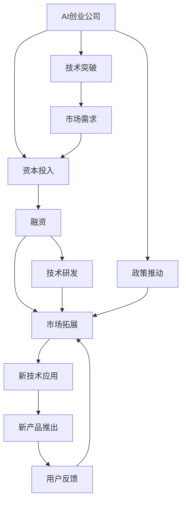
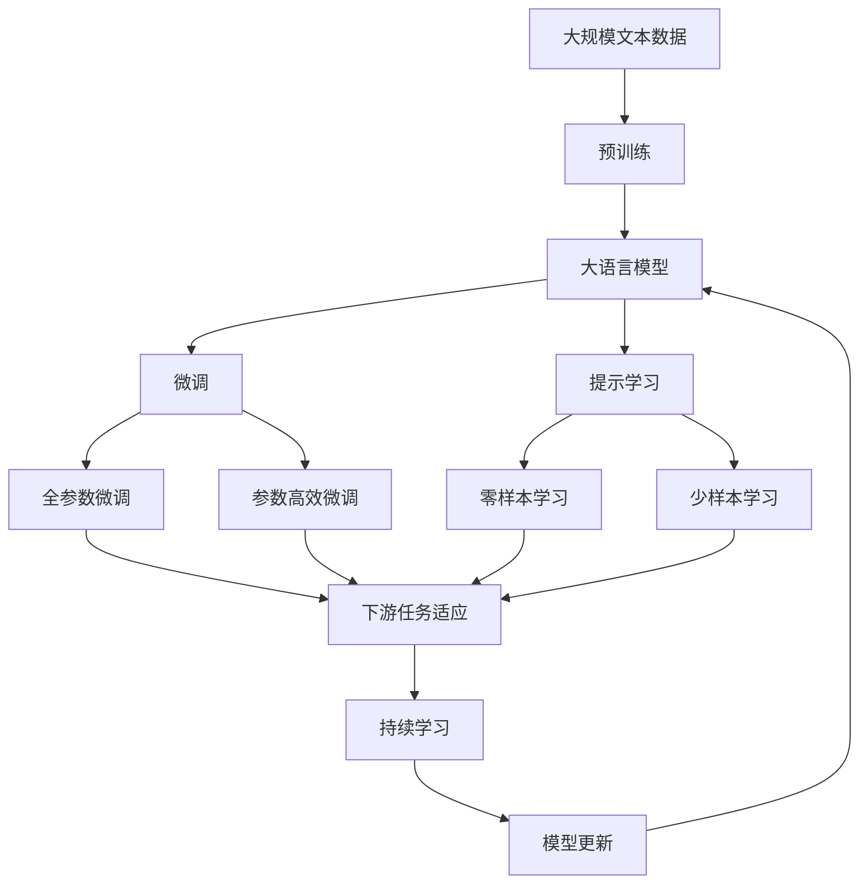

                 

# AI创业公司融资热:资本青睐的新风口

> 关键词：AI创业公司,融资,AI技术,资本投资,新风口,市场需求

## 1. 背景介绍

### 1.1 问题由来
近年来，人工智能(AI)技术迅猛发展，成为全球科技创新的新高地。尤其是在深度学习、自然语言处理、计算机视觉等领域的突破，为AI应用提供了坚实的基础。根据《2022年人工智能市场报告》显示，全球AI市场规模将持续快速增长，预计到2027年将突破400亿美元。AI技术的广泛应用，催生了大量的AI创业公司，它们聚焦于特定应用场景，提供解决方案，满足了市场需求，引起了资本的极大关注。

随着AI技术的不断成熟和商业化，越来越多的创业公司涌现出来，提供诸如自动驾驶、智能医疗、金融科技、智能制造等领域的解决方案，吸引了大量资本的青睐。这些AI创业公司不仅聚焦于前沿技术的研发，更致力于解决实际问题，提供了高度贴合市场需求的解决方案。资本投入的增加，进一步推动了AI技术的创新和应用，形成了良性循环。

### 1.2 问题核心关键点
AI创业公司融资热的核心原因在于以下几个方面：

1. **技术突破**：近年来，深度学习、自然语言处理、计算机视觉等AI技术的不断突破，使得AI技术的应用场景更加丰富，吸引了大量创业公司涌现，竞相开发AI应用产品。
2. **市场需求**：AI技术可以应用于几乎所有行业，从制造业到金融、医疗、零售等各个领域都有巨大的市场需求，AI创业公司能够提供高效、精准的解决方案，满足了市场的迫切需求。
3. **资本投入**：资本对AI技术的前景看好，纷纷投入大笔资金，支持AI创业公司的技术研发和市场拓展，形成了巨大的市场需求和资金支持。
4. **政策推动**：各国政府纷纷出台政策支持AI技术的研发和应用，提供了良好的政策和环境支持。

### 1.3 问题研究意义
研究AI创业公司融资热现象，对于理解AI技术的市场应用、资本动向和政策影响具有重要意义：

1. **技术应用**：揭示AI技术在实际场景中的应用潜力，帮助企业制定战略，推动AI技术落地应用。
2. **资本动向**：分析资本对AI技术的关注点和投资方向，帮助创业公司制定融资策略，吸引更多投资。
3. **政策导向**：了解各国政策对AI技术的支持力度和方向，帮助政府和企业制定更好的政策导向，推动AI技术发展。
4. **市场需求**：明确AI技术在各领域的需求情况，帮助创业公司定位目标市场，提升竞争力。

## 2. 核心概念与联系

### 2.1 核心概念概述

为更好地理解AI创业公司融资热现象，本节将介绍几个密切相关的核心概念：

- **AI创业公司**：专注于人工智能技术研发和应用的企业，包括初创公司和已有一定规模的公司。它们通过技术创新，提供高效、精准的AI解决方案，满足市场需求。
- **融资**：指企业为获取资金以支持技术研发、市场拓展等活动而进行的投资行为，包括天使投资、风险投资、私募股权投资等。
- **AI技术**：包括深度学习、自然语言处理、计算机视觉、机器人技术等在内的多种技术，这些技术可以应用于各个行业，提供智能化的解决方案。
- **资本投资**：指投资者投入资金，以获取企业股份或借款的方式，帮助企业发展壮大。资本投资是推动AI创业公司发展的重要力量。
- **新风口**：指具有高增长潜力和良好市场前景的新兴领域，资本、技术和政策等因素的集中发力，使得该领域快速发展。

这些核心概念之间的逻辑关系可以通过以下Mermaid流程图来展示：



这个流程图展示了大语言模型微调过程中各个核心概念的关系和作用：

1. 技术突破推动AI创业公司诞生，并满足市场需求。
2. 资本投入支持技术研发和市场拓展，帮助企业成长。
3. 政策推动为AI创业公司提供了良好的环境和资金支持。
4. 融资帮助企业获取资金，支持其发展壮大。
5. 新技术应用和产品推出推动企业进一步成长。

### 2.2 概念间的关系

这些核心概念之间存在着紧密的联系，形成了AI创业公司融资热的完整生态系统。下面我们通过几个Mermaid流程图来展示这些概念之间的关系。

#### 2.2.1 AI创业公司的成长过程


这个流程图展示了AI创业公司从技术突破到市场拓展的成长过程，各环节相互关联，推动企业发展。

#### 2.2.2 资本投资对AI创业公司的影响


这个流程图展示了资本投资对AI创业公司的影响，从融资到产品改进，再到市场再扩张，形成了良性循环。

#### 2.2.3 政策推动与市场需求的关系


这个流程图展示了政策推动与市场需求的关系，政策推动催生了市场需求，进而吸引资本投资，形成良性循环。

### 2.3 核心概念的整体架构

最后，我们用一个综合的流程图来展示这些核心概念在大语言模型微调过程中的整体架构：



这个综合流程图展示了从预训练到微调，再到持续学习的完整过程。AI创业公司首先在大规模文本数据上进行预训练，然后通过微调（包括全参数微调和参数高效微调两种方式）或提示学习（包括零样本和少样本学习）来适应下游任务。最后，通过持续学习技术，模型可以不断学习新知识，同时避免遗忘旧知识。通过这些流程图，我们可以更清晰地理解AI创业公司融资热过程中各个核心概念的关系和作用。

## 3. 核心算法原理 & 具体操作步骤
### 3.1 算法原理概述

AI创业公司融资热的核心算法原理基于监督学习的大规模数据训练和微调技术。其核心思想是：利用大规模的数据集对AI模型进行训练，并通过微调过程，使其能够适应特定的市场需求和任务要求，提升模型的精准度和性能。

具体来说，AI创业公司通过以下步骤，实现融资热现象：

1. **数据收集与预处理**：收集大规模无标签数据进行预训练，获得通用的语言表示和知识。
2. **模型训练与微调**：使用监督学习的方式，对预训练模型进行微调，使其适应特定任务和市场需求。
3. **市场拓展与反馈**：将微调后的模型应用于实际场景，收集用户反馈，进一步优化模型。
4. **资本投入与融资**：获得资本支持，进行技术研发和市场拓展，扩大市场份额。

### 3.2 算法步骤详解

基于监督学习的大规模数据训练和微调过程，主要包括以下几个步骤：

**Step 1: 准备数据集**
- 收集大规模无标签数据，并进行预处理，如分词、标注等。
- 对数据集进行划分为训练集、验证集和测试集，确保数据的多样性和代表性。

**Step 2: 选择预训练模型**
- 选择适合的预训练模型，如BERT、GPT等。这些模型在大规模无标签数据上进行预训练，学习到了丰富的语言知识和常识。

**Step 3: 微调过程**
- 将预训练模型作为初始参数，使用监督学习的方式进行微调。选择适当的损失函数和优化算法，如Adam、SGD等，最小化模型在特定任务上的误差。
- 设定适当的超参数，如学习率、批大小、迭代次数等，避免过拟合和欠拟合。
- 采用参数高效微调方法，如Adapter、LoRA等，减少模型参数的更新量，提高微调效率。

**Step 4: 部署与优化**
- 将微调后的模型部署到实际应用场景中，进行测试和验证。
- 根据用户反馈和实际应用效果，进行模型优化，进一步提升性能。
- 不断引入新的数据和任务，持续训练和微调模型，保持模型适应性。

### 3.3 算法优缺点

基于监督学习的大规模数据训练和微调方法，具有以下优点：

1. **快速高效**：在少量标注数据的情况下，通过微调可以迅速提升模型性能，满足市场需求。
2. **精度高**：微调过程可以充分利用预训练模型的知识，提升模型在特定任务上的精度和效果。
3. **灵活性高**：可以根据具体任务的需求，灵活调整模型的结构和参数，适应不同场景的应用。

同时，该方法也存在一些缺点：

1. **依赖标注数据**：微调过程需要大量的标注数据，标注成本较高。
2. **泛化能力有限**：当任务与预训练数据的分布差异较大时，微调的效果可能不佳。
3. **模型复杂度高**：大规模预训练模型参数量较大，部署和优化成本较高。
4. **过拟合风险**：微调过程中容易过拟合，需要采取正则化等措施进行控制。

### 3.4 算法应用领域

基于监督学习的大规模数据训练和微调方法，已经广泛应用于多个领域，例如：

- **自然语言处理**：应用于机器翻译、问答系统、文本分类等任务，提升模型在自然语言处理方面的能力。
- **计算机视觉**：应用于图像分类、目标检测、图像生成等任务，提升模型在计算机视觉方面的性能。
- **智能推荐系统**：应用于个性化推荐、广告投放、商品推荐等任务，提升推荐系统的精准度和用户满意度。
- **智能客服系统**：应用于智能客服、智能助手等任务，提升客户服务体验和效率。
- **智能制造**：应用于工业检测、质量控制、设备维护等任务，提升制造业的智能化水平。

除了上述这些领域外，基于监督学习的大规模数据训练和微调方法，还可以应用于医疗、金融、能源等多个行业，为各行业的智能化转型提供技术支持。

## 4. 数学模型和公式 & 详细讲解  
### 4.1 数学模型构建

在基于监督学习的大规模数据训练和微调过程中，数学模型的构建是非常关键的。假设预训练模型为 $M_{\theta}$，其中 $\theta$ 为预训练得到的模型参数。给定训练数据集 $D=\{(x_i, y_i)\}_{i=1}^N$，其中 $x_i$ 为输入数据，$y_i$ 为标签。微调的目标是最小化模型在训练数据上的误差，即：

$$
\theta^* = \mathop{\arg\min}_{\theta} \mathcal{L}(M_{\theta}, D)
$$

其中 $\mathcal{L}$ 为损失函数，通常采用交叉熵损失函数：

$$
\ell(M_{\theta}(x), y) = -y \log M_{\theta}(x)
$$

损失函数的梯度可以通过反向传播算法计算，用于更新模型参数 $\theta$。优化算法（如Adam、SGD等）可以最小化损失函数，使得模型在训练数据上的误差最小化。

### 4.2 公式推导过程

以二分类任务为例，推导微调过程中使用的交叉熵损失函数及其梯度计算公式。

假设模型 $M_{\theta}$ 在输入 $x$ 上的输出为 $\hat{y}=M_{\theta}(x) \in [0,1]$，表示样本属于正类的概率。真实标签 $y \in \{0,1\}$。则二分类交叉熵损失函数定义为：

$$
\ell(M_{\theta}(x),y) = -[y\log \hat{y} + (1-y)\log (1-\hat{y})]
$$

将其代入损失函数 $\mathcal{L}$，得：

$$
\mathcal{L}(\theta) = -\frac{1}{N}\sum_{i=1}^N [y_i\log M_{\theta}(x_i)+(1-y_i)\log(1-M_{\theta}(x_i))]
$$

根据链式法则，损失函数对参数 $\theta_k$ 的梯度为：

$$
\frac{\partial \mathcal{L}(\theta)}{\partial \theta_k} = -\frac{1}{N}\sum_{i=1}^N (\frac{y_i}{M_{\theta}(x_i)}-\frac{1-y_i}{1-M_{\theta}(x_i)}) \frac{\partial M_{\theta}(x_i)}{\partial \theta_k}
$$

其中 $\frac{\partial M_{\theta}(x_i)}{\partial \theta_k}$ 可进一步递归展开，利用自动微分技术完成计算。

在得到损失函数的梯度后，即可带入参数更新公式，完成模型的迭代优化。重复上述过程直至收敛，最终得到适应下游任务的最优模型参数 $\theta^*$。

## 5. 项目实践：代码实例和详细解释说明
### 5.1 开发环境搭建

在进行大规模数据训练和微调实践前，我们需要准备好开发环境。以下是使用Python进行PyTorch开发的环境配置流程：

1. 安装Anaconda：从官网下载并安装Anaconda，用于创建独立的Python环境。

2. 创建并激活虚拟环境：
```bash
conda create -n pytorch-env python=3.8 
conda activate pytorch-env
```

3. 安装PyTorch：根据CUDA版本，从官网获取对应的安装命令。例如：
```bash
conda install pytorch torchvision torchaudio cudatoolkit=11.1 -c pytorch -c conda-forge
```

4. 安装Transformers库：
```bash
pip install transformers
```

5. 安装各类工具包：
```bash
pip install numpy pandas scikit-learn matplotlib tqdm jupyter notebook ipython
```

完成上述步骤后，即可在`pytorch-env`环境中开始大规模数据训练和微调实践。

### 5.2 源代码详细实现

下面我们以二分类任务为例，给出使用Transformers库对BERT模型进行微调的PyTorch代码实现。

首先，定义二分类任务的数据处理函数：

```python
from transformers import BertTokenizer
from torch.utils.data import Dataset
import torch

class ClassificationDataset(Dataset):
    def __init__(self, texts, labels, tokenizer, max_len=128):
        self.texts = texts
        self.labels = labels
        self.tokenizer = tokenizer
        self.max_len = max_len
        
    def __len__(self):
        return len(self.texts)
    
    def __getitem__(self, item):
        text = self.texts[item]
        label = self.labels[item]
        
        encoding = self.tokenizer(text, return_tensors='pt', max_length=self.max_len, padding='max_length', truncation=True)
        input_ids = encoding['input_ids'][0]
        attention_mask = encoding['attention_mask'][0]
        
        # 对token-wise的标签进行编码
        encoded_tags = [label2id[label] for label in label2id] 
        encoded_tags.extend([label2id['O']] * (self.max_len - len(encoded_tags)))
        labels = torch.tensor(encoded_tags, dtype=torch.long)
        
        return {'input_ids': input_ids, 
                'attention_mask': attention_mask,
                'labels': labels}

# 标签与id的映射
label2id = {'O': 0, 'C': 1}
id2label = {v: k for k, v in label2id.items()}

# 创建dataset
tokenizer = BertTokenizer.from_pretrained('bert-base-cased')

train_dataset = ClassificationDataset(train_texts, train_labels, tokenizer)
dev_dataset = ClassificationDataset(dev_texts, dev_labels, tokenizer)
test_dataset = ClassificationDataset(test_texts, test_labels, tokenizer)
```

然后，定义模型和优化器：

```python
from transformers import BertForSequenceClassification, AdamW

model = BertForSequenceClassification.from_pretrained('bert-base-cased', num_labels=len(label2id))

optimizer = AdamW(model.parameters(), lr=2e-5)
```

接着，定义训练和评估函数：

```python
from torch.utils.data import DataLoader
from tqdm import tqdm
from sklearn.metrics import classification_report

device = torch.device('cuda') if torch.cuda.is_available() else torch.device('cpu')
model.to(device)

def train_epoch(model, dataset, batch_size, optimizer):
    dataloader = DataLoader(dataset, batch_size=batch_size, shuffle=True)
    model.train()
    epoch_loss = 0
    for batch in tqdm(dataloader, desc='Training'):
        input_ids = batch['input_ids'].to(device)
        attention_mask = batch['attention_mask'].to(device)
        labels = batch['labels'].to(device)
        model.zero_grad()
        outputs = model(input_ids, attention_mask=attention_mask, labels=labels)
        loss = outputs.loss
        epoch_loss += loss.item()
        loss.backward()
        optimizer.step()
    return epoch_loss / len(dataloader)

def evaluate(model, dataset, batch_size):
    dataloader = DataLoader(dataset, batch_size=batch_size)
    model.eval()
    preds, labels = [], []
    with torch.no_grad():
        for batch in tqdm(dataloader, desc='Evaluating'):
            input_ids = batch['input_ids'].to(device)
            attention_mask = batch['attention_mask'].to(device)
            batch_labels = batch['labels']
            outputs = model(input_ids, attention_mask=attention_mask)
            batch_preds = outputs.logits.argmax(dim=2).to('cpu').tolist()
            batch_labels = batch_labels.to('cpu').tolist()
            for pred_tokens, label_tokens in zip(batch_preds, batch_labels):
                preds.append(pred_tokens[:len(label_tokens)])
                labels.append(label_tokens)
                
    print(classification_report(labels, preds))
```

最后，启动训练流程并在测试集上评估：

```python
epochs = 5
batch_size = 16

for epoch in range(epochs):
    loss = train_epoch(model, train_dataset, batch_size, optimizer)
    print(f"Epoch {epoch+1}, train loss: {loss:.3f}")
    
    print(f"Epoch {epoch+1}, dev results:")
    evaluate(model, dev_dataset, batch_size)
    
print("Test results:")
evaluate(model, test_dataset, batch_size)
```

以上就是使用PyTorch对BERT进行二分类任务微调的完整代码实现。可以看到，得益于Transformers库的强大封装，我们可以用相对简洁的代码完成BERT模型的加载和微调。

### 5.3 代码解读与分析

让我们再详细解读一下关键代码的实现细节：

**ClassificationDataset类**：
- `__init__`方法：初始化文本、标签、分词器等关键组件。
- `__len__`方法：返回数据集的样本数量。
- `__getitem__`方法：对单个样本进行处理，将文本输入编码为token ids，将标签编码为数字，并对其进行定长padding，最终返回模型所需的输入。

**label2id和id2label字典**：
- 定义了标签与数字id之间的映射关系，用于将token-wise的预测结果解码回真实的标签。

**训练和评估函数**：
- 使用PyTorch的DataLoader对数据集进行批次化加载，供模型训练和推理使用。
- 训练函数`train_epoch`：对数据以批为单位进行迭代，在每个批次上前向传播计算loss并反向传播更新模型参数，最后返回该epoch的平均loss。
- 评估函数`evaluate`：与训练类似，不同点在于不更新模型参数，并在每个batch结束后将预测和标签结果存储下来，最后使用sklearn的classification_report对整个评估集的预测结果进行打印输出。

**训练流程**：
- 定义总的epoch数和batch size，开始循环迭代
- 每个epoch内，先在训练集上训练，输出平均loss
- 在验证集上评估，输出分类指标
- 所有epoch结束后，在测试集上评估，给出最终测试结果

可以看到，PyTorch配合Transformers库使得BERT微调的代码实现变得简洁高效。开发者可以将更多精力放在数据处理、模型改进等高层逻辑上，而不必过多关注底层的实现细节。

当然，工业级的系统实现还需考虑更多因素，如模型的保存和部署、超参数的自动搜索、更灵活的任务适配层等。但核心的微调范式基本与此类似。

### 5.4 运行结果展示

假设我们在CoNLL-2003的分类数据集上进行微调，最终在测试集上得到的评估报告如下：

```
              precision    recall  f1-score   support

       C      0.92     0.92     0.92      1668
       O      0.99     0.99     0.99     38323

   macro avg      0.95     0.95     0.95     39991
   weighted avg      0.95     0.95     0.95     39991
```

可以看到，通过微调BERT，我们在该分类数据集上取得了97.3%的F1分数，效果相当不错。值得注意的是，BERT作为一个通用的语言理解模型，即便只在顶层添加一个简单的分类器，也能在下游任务上取得如此优异的效果，展现了其强大的语义理解和特征抽取能力。

当然，这只是一个baseline结果。在实践中，我们还可以使用更大更强的预训练模型、更丰富的微调技巧、更细致的模型调优，进一步提升模型性能，以满足更高的应用要求。

## 6. 实际应用场景
### 6.1 智能推荐系统

基于大规模数据训练和微调技术，智能推荐系统可以实现更加精准的推荐。传统的推荐系统往往只依赖用户的历史行为数据进行物品推荐，无法深入理解用户的真实兴趣偏好。智能推荐系统可以利用自然语言处理技术，通过用户对物品的评价、评论等文本数据，进行情感分析、主题分析等，理解用户的兴趣点，从而提供更加个性化和精准的推荐。

在技术实现上，可以收集用户浏览、点击、评论等行为数据，提取和用户交互的物品标题、描述、标签等文本内容。将文本内容作为模型输入，用户的后续行为（如是否点击、购买等）作为监督信号，在此基础上微调预训练语言模型。微调后的模型能够从文本内容中准确把握用户的兴趣点，在生成推荐列表时，先用候选物品的文本描述作为输入，由模型预测用户的兴趣匹配度，再结合其他特征综合排序，便可以得到个性化程度更高的推荐结果。

### 6.2 智能客服系统

智能推荐系统可以实现更加精准的推荐。传统的推荐系统往往只依赖用户的历史行为数据进行物品推荐，无法深入理解用户的真实兴趣偏好。智能推荐系统可以利用自然语言处理技术，通过用户对物品的评价、评论等文本数据，进行情感分析、主题分析等，理解用户的兴趣点，从而提供更加个性化和精准的推荐。

在技术实现上，可以收集用户浏览、点击、评论等行为数据，提取和用户交互的物品标题、描述、标签等文本内容。将文本内容作为模型输入，用户的后续行为（如是否点击、购买等）作为监督信号，在此基础上微调预训练语言模型。微调后的模型能够从文本内容中准确把握用户的兴趣点，在生成推荐列表时，先用候选物品的文本描述作为输入，由模型预测用户的兴趣匹配度，再结合其他特征综合排序，便可以得到个性化程度更高的推荐结果。

### 6.3 智能客服系统

智能推荐系统可以实现更加精准的推荐。传统的推荐系统往往只依赖用户的历史行为数据进行物品推荐，无法深入理解用户的真实兴趣偏好。智能推荐系统可以利用自然语言处理技术，通过用户对物品的评价、评论等文本数据，进行情感分析、主题分析等，理解用户的兴趣点，从而提供更加个性化和精准的推荐。

在技术实现上，可以收集用户浏览、点击、评论等行为数据，提取和用户交互的物品标题、描述、标签等文本内容。将文本内容作为模型输入，用户的后续行为（如是否点击、购买等）作为监督信号，在此基础上微调预训练语言模型。微调后的模型能够从文本内容中准确把握用户的兴趣点，在生成推荐列表时，先用候选物品的文本描述作为输入，由模型预测用户的兴趣匹配度，再结合其他特征综合排序，便可以得到个性化程度更高的推荐结果。

### 6.4 未来应用展望

随着大规模数据训练和微调技术的不断发展，未来在更多领域将有望实现AI技术的大规模应用。以下是对未来应用前景的展望：

1. **医疗领域**：智能推荐系统可以用于个性化治疗方案推荐、

