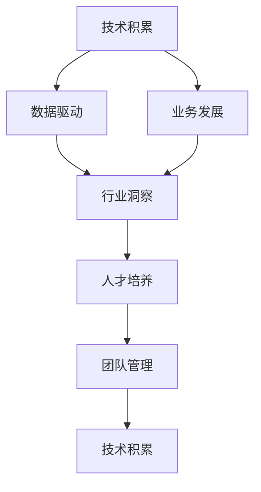
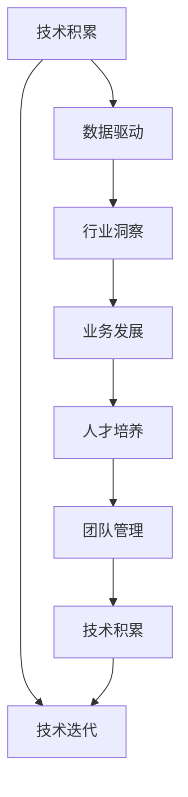
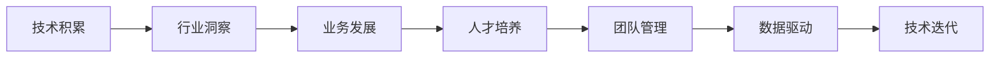
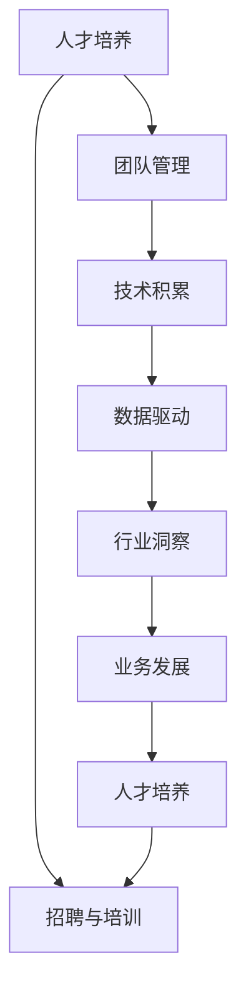
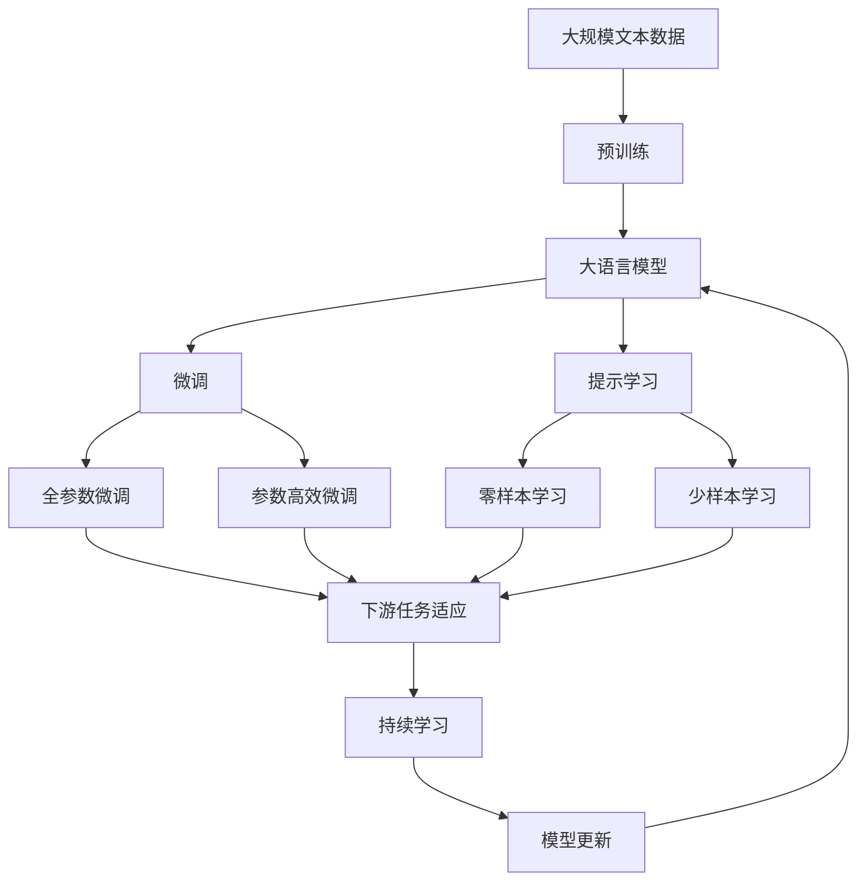

                 

# AI创业团队成长之路：技术积累与行业洞察并重

> 关键词：AI创业, 技术积累, 行业洞察, 数据驱动, 业务发展, 人才培养, 团队管理

## 1. 背景介绍

### 1.1 问题由来
在人工智能(AI)领域，创业团队不仅需要技术储备，还需要对行业有深刻洞察，才能在激烈的市场竞争中脱颖而出。技术积累是创业团队的基础，行业洞察则是拓展业务、应对市场变化的关键。如何在这两方面找到平衡，是AI创业团队面临的重要问题。

### 1.2 问题核心关键点
AI创业团队的技术积累通常包括：
- 扎实的算法和模型知识，如机器学习、深度学习、自然语言处理等。
- 丰富的工程实践经验，包括数据处理、模型训练、模型部署等。
- 熟悉主流AI框架和技术栈，如TensorFlow、PyTorch、Keras等。

行业洞察则包括：
- 对目标市场的深入理解，包括市场规模、用户需求、竞争格局等。
- 对业务需求的准确把握，能够将AI技术应用于实际业务中，解决实际问题。
- 对行业趋势的敏锐感知，能够预测未来技术发展方向，抢占先机。

### 1.3 问题研究意义
对于AI创业团队而言，技术积累和行业洞察的并重，具有以下重要意义：
- 技术积累可以提供强大的技术支持，使得团队能够高效地进行产品开发和问题解决。
- 行业洞察可以确保产品和服务能够精准满足市场和用户需求，提升市场竞争力。
- 技术积累和行业洞察相结合，能够提升团队在激烈的市场竞争中的应变能力，增强公司的持续发展动力。

## 2. 核心概念与联系

### 2.1 核心概念概述

为了更好地理解AI创业团队在技术积累和行业洞察方面的工作，我们首先介绍几个核心概念：

- **技术积累(Technical Accumulation)**：指AI创业团队在算法、模型、工程实践等方面的技术储备，是团队技术能力和竞争力的体现。
- **行业洞察(Industry Insight)**：指团队对目标市场的理解、业务需求的把握、行业趋势的感知，是团队业务发展、产品规划的关键。
- **数据驱动(Data-Driven)**：指在决策过程中，以数据为基础，进行科学分析和评估。
- **业务发展(Business Development)**：指AI技术在实际业务中的落地应用，通过业务模式的创新和优化，推动公司成长。
- **人才培养(Talent Cultivation)**：指团队通过培训、招聘等方式，吸引和培养高素质人才，提升团队整体水平。
- **团队管理(Team Management)**：指团队通过有效的组织、协作、激励等手段，提升团队效率和凝聚力，确保项目成功。

这些核心概念之间的关系可以通过以下Mermaid流程图来展示：



这个流程图展示了技术积累、数据驱动、业务发展、行业洞察、人才培养和团队管理之间的关系：
- 技术积累通过数据驱动和业务发展，转化为实际业务成果。
- 行业洞察指导数据驱动和业务发展，确保方向正确。
- 人才培养和团队管理则通过提升团队能力，进一步加强技术积累和业务发展。
- 最终，技术积累和行业洞察相辅相成，推动公司不断发展。

### 2.2 概念间的关系

这些核心概念之间存在着紧密的联系，形成了AI创业团队成长和发展的完整生态系统。下面我们通过几个Mermaid流程图来展示这些概念之间的关系。

#### 2.2.1 AI创业团队的发展过程



这个流程图展示了AI创业团队的发展过程，从技术积累开始，通过数据驱动和行业洞察，推动业务发展。同时，人才培养和团队管理不断提升团队能力，支持技术迭代和业务发展。

#### 2.2.2 技术积累与行业洞察的协同



这个流程图展示了技术积累和行业洞察的协同作用。技术积累提供了行业洞察的基础，行业洞察指导业务发展，业务发展又反哺人才培养和团队管理，数据驱动进一步推动技术迭代，形成良性循环。

#### 2.2.3 人才培养与团队管理的互动



这个流程图展示了人才培养和团队管理的互动关系。人才培养通过招聘与培训提升团队能力，团队管理通过有效组织提升团队效率，两者共同作用于技术积累、数据驱动、行业洞察和业务发展，形成持续提升的闭环。

### 2.3 核心概念的整体架构

最后，我们用一个综合的流程图来展示这些核心概念在大语言模型微调过程中的整体架构：



这个综合流程图展示了从预训练到微调，再到持续学习的完整过程。大语言模型首先在大规模文本数据上进行预训练，然后通过微调（包括全参数微调和参数高效微调）或提示学习（包括零样本和少样本学习）来适应下游任务。最后，通过持续学习技术，模型可以不断更新和适应新的任务和数据。 通过这些流程图，我们可以更清晰地理解AI创业团队成长过程中各个核心概念的关系和作用，为后续深入讨论具体的成长方法提供基础。

## 3. 核心算法原理 & 具体操作步骤
### 3.1 算法原理概述

AI创业团队的技术积累和行业洞察，往往通过以下几个关键步骤来实现：

**Step 1: 数据收集与处理**
- 收集与业务相关的数据，包括用户行为数据、市场调研数据、行业报告等。
- 对数据进行清洗、标注、归一化等处理，确保数据质量。

**Step 2: 模型训练与优化**
- 选择合适的算法和模型架构，如线性回归、决策树、神经网络等。
- 使用训练集对模型进行训练，优化模型参数，提升模型效果。

**Step 3: 业务落地与应用**
- 将训练好的模型应用于实际业务场景，进行预测、推荐、分析等。
- 根据业务反馈，不断调整模型参数和优化算法，提升模型效果。

**Step 4: 行业洞察与市场分析**
- 通过数据分析和挖掘，洞察市场和业务的变化趋势。
- 将行业洞察反馈给产品和技术团队，调整产品策略和算法模型。

### 3.2 算法步骤详解

以下是AI创业团队在技术积累和行业洞察方面的一般操作流程：

**Step 1: 数据收集与处理**
1. **数据收集**：通过问卷调查、用户行为日志、公开数据集等方式，收集与业务相关的数据。
2. **数据清洗**：去除无效、重复数据，处理缺失值和异常值。
3. **数据标注**：对数据进行标注，如用户分类、行为标签等，用于后续模型的训练。
4. **数据归一化**：对数据进行归一化处理，如标准化、归一化等，提升模型训练效率。

**Step 2: 模型训练与优化**
1. **模型选择**：根据业务需求和数据特征，选择合适的算法和模型架构。
2. **模型训练**：使用训练集对模型进行训练，通过前向传播和反向传播，优化模型参数。
3. **模型评估**：使用验证集对模型进行评估，调整模型参数，确保模型效果。
4. **模型调优**：根据业务反馈，不断调整模型参数和优化算法，提升模型效果。

**Step 3: 业务落地与应用**
1. **模型部署**：将训练好的模型部署到生产环境，进行实时预测和分析。
2. **用户反馈收集**：通过用户反馈，了解模型效果和用户需求。
3. **模型迭代**：根据用户反馈，对模型进行迭代优化，提升模型效果。

**Step 4: 行业洞察与市场分析**
1. **市场调研**：通过行业报告、市场调研等方式，获取行业和市场信息。
2. **趋势分析**：通过数据分析和挖掘，洞察市场和业务的变化趋势。
3. **业务策略调整**：根据行业洞察，调整产品策略和算法模型。

### 3.3 算法优缺点

AI创业团队在技术积累和行业洞察方面，有以下优缺点：

**优点**：
- 技术积累提供强有力的技术支持，使得团队能够高效地进行产品开发和问题解决。
- 行业洞察确保产品和服务能够精准满足市场和用户需求，提升市场竞争力。
- 技术积累和行业洞察相结合，提升团队在激烈的市场竞争中的应变能力，增强公司的持续发展动力。

**缺点**：
- 技术积累需要大量时间和资源投入，初期研发成本较高。
- 行业洞察需要持续的市场调研和数据分析，工作量较大。
- 技术积累和行业洞察之间的平衡难以把握，容易陷入技术驱动或市场驱动的单边思维。

### 3.4 算法应用领域

AI创业团队的技术积累和行业洞察，已经广泛应用于多个领域，例如：

- **金融科技**：通过大数据分析和机器学习模型，提升风险控制、用户画像、投资策略等能力。
- **医疗健康**：通过自然语言处理和图像识别技术，辅助医生诊断、药物研发等。
- **智能制造**：通过预测维护、质量检测等技术，提升生产效率和产品质量。
- **零售电商**：通过用户行为分析、推荐系统等技术，提升用户体验和销售转化率。
- **教育培训**：通过数据分析和智能推荐，提升教学效果和学习体验。

## 4. 数学模型和公式 & 详细讲解 & 举例说明

### 4.1 数学模型构建

在AI创业团队中，数学模型和公式的构建是技术积累的重要组成部分。常见的数学模型包括线性回归、逻辑回归、决策树、神经网络等。

以线性回归模型为例，其数学模型可以表示为：

$$y = \theta_0 + \theta_1x_1 + \theta_2x_2 + ... + \theta_nx_n$$

其中，$y$ 为预测值，$\theta_0$ 为截距，$\theta_i$ 为权重，$x_i$ 为输入特征。

### 4.2 公式推导过程

以下以线性回归模型为例，展示其公式推导过程：

1. **目标函数**：
   目标函数为：
   $$\min_{\theta} \frac{1}{2m}\sum_{i=1}^m (y^{(i)} - (\theta_0 + \theta_1x_1^{(i)} + \theta_2x_2^{(i)} + ... + \theta_nx_n^{(i)})^2$$

2. **梯度下降**：
   通过梯度下降算法，求解目标函数的极小值。具体步骤如下：
   $$
   \begin{aligned}
   \theta_0^{(t+1)} &= \theta_0^{(t)} - \eta \frac{1}{m} \sum_{i=1}^m (y^{(i)} - (\theta_0^{(t)} + \theta_1^{(t)}x_1^{(i)} + \theta_2^{(t)}x_2^{(i)} + ... + \theta_n^{(t)}x_n^{(i)}) \\
   \theta_i^{(t+1)} &= \theta_i^{(t)} - \eta \frac{1}{m} \sum_{i=1}^m (y^{(i)} - (\theta_0^{(t)} + \theta_1^{(t)}x_1^{(i)} + \theta_2^{(t)}x_2^{(i)} + ... + \theta_n^{(t)}x_n^{(i)})x_i^{(i)}
   \end{aligned}
   $$

其中，$\eta$ 为学习率，$m$ 为样本数量。

### 4.3 案例分析与讲解

以零售电商领域的推荐系统为例，展示数学模型的实际应用：

1. **数据收集**：收集用户行为数据，包括浏览记录、购买记录、评分记录等。
2. **特征工程**：对数据进行特征提取，如用户ID、商品ID、购买时间等。
3. **模型训练**：使用线性回归模型，对用户行为数据进行建模，预测用户是否会购买某商品。
4. **模型评估**：使用交叉验证等方法，评估模型的准确率和召回率，调整模型参数。
5. **业务应用**：将训练好的模型应用于推荐系统，向用户推荐相关商品。

## 5. 项目实践：代码实例和详细解释说明

### 5.1 开发环境搭建

在进行技术积累和行业洞察的实践前，我们需要准备好开发环境。以下是使用Python进行PyTorch开发的环境配置流程：

1. 安装Anaconda：从官网下载并安装Anaconda，用于创建独立的Python环境。

2. 创建并激活虚拟环境：
```bash
conda create -n pytorch-env python=3.8 
conda activate pytorch-env
```

3. 安装PyTorch：根据CUDA版本，从官网获取对应的安装命令。例如：
```bash
conda install pytorch torchvision torchaudio cudatoolkit=11.1 -c pytorch -c conda-forge
```

4. 安装各类工具包：
```bash
pip install numpy pandas scikit-learn matplotlib tqdm jupyter notebook ipython
```

完成上述步骤后，即可在`pytorch-env`环境中开始技术积累和行业洞察的实践。

### 5.2 源代码详细实现

下面我们以金融科技领域的风险控制为例，给出使用PyTorch对线性回归模型进行训练的PyTorch代码实现。

首先，定义数据处理函数：

```python
import numpy as np
from sklearn.model_selection import train_test_split
from sklearn.preprocessing import StandardScaler
import torch
from torch import nn, optim

def load_data(data_path, batch_size):
    data = np.load(data_path)
    X = data['X']
    y = data['y']
    X_train, X_test, y_train, y_test = train_test_split(X, y, test_size=0.2, random_state=42)
    scaler = StandardScaler()
    X_train = scaler.fit_transform(X_train)
    X_test = scaler.transform(X_test)
    return torch.tensor(X_train, dtype=torch.float32), torch.tensor(y_train, dtype=torch.float32), torch.tensor(X_test, dtype=torch.float32), torch.tensor(y_test, dtype=torch.float32), batch_size

X_train, y_train, X_test, y_test, batch_size = load_data('data.npz', 64)
```

然后，定义模型和优化器：

```python
class LinearRegression(nn.Module):
    def __init__(self, in_dim, out_dim):
        super().__init__()
        self.fc = nn.Linear(in_dim, out_dim)

    def forward(self, x):
        return self.fc(x)

model = LinearRegression(X_train.shape[1], 1)

optimizer = optim.SGD(model.parameters(), lr=0.01)
```

接着，定义训练和评估函数：

```python
def train_epoch(model, data_loader, optimizer):
    model.train()
    for batch in data_loader:
        inputs, labels = batch
        optimizer.zero_grad()
        outputs = model(inputs)
        loss = nn.MSELoss()(outputs, labels)
        loss.backward()
        optimizer.step()

def evaluate(model, data_loader):
    model.eval()
    with torch.no_grad():
        predictions = []
        targets = []
        for batch in data_loader:
            inputs, labels = batch
            outputs = model(inputs)
            predictions.append(outputs.numpy().flatten())
            targets.append(labels.numpy().flatten())
        return np.mean(np.abs(predictions - targets))

train_loader = torch.utils.data.DataLoader(X_train, y_train, batch_size=batch_size, shuffle=True)
test_loader = torch.utils.data.DataLoader(X_test, y_test, batch_size=batch_size, shuffle=False)

for epoch in range(10):
    train_epoch(model, train_loader, optimizer)
    train_loss = train_epoch(model, train_loader, optimizer)
    test_loss = evaluate(model, test_loader)
    print(f"Epoch {epoch+1}, train loss: {train_loss:.3f}, test loss: {test_loss:.3f}")
```

以上代码实现了从数据加载、模型定义、模型训练到模型评估的完整流程，展示了如何通过PyTorch进行线性回归模型的训练和评估。

### 5.3 代码解读与分析

让我们再详细解读一下关键代码的实现细节：

**load_data函数**：
- 加载数据，并进行数据分割、标准化处理。
- 返回训练集、测试集的数据和标签，以及批处理大小。

**LinearRegression模型**：
- 定义线性回归模型，包含一个全连接层。

**train_epoch函数**：
- 对数据进行迭代训练，更新模型参数。

**evaluate函数**：
- 对模型进行评估，计算预测值与真实值之间的绝对误差。

**训练流程**：
- 定义总的epoch数，开始循环迭代
- 每个epoch内，先在训练集上训练，输出平均损失
- 在测试集上评估，输出测试损失
- 所有epoch结束后，返回模型评估结果

可以看到，PyTorch配合Scikit-learn等工具，使得线性回归模型的训练和评估过程变得简洁高效。开发者可以将更多精力放在数据处理、模型改进等高层逻辑上，而不必过多关注底层的实现细节。

当然，工业级的系统实现还需考虑更多因素，如模型的保存和部署、超参数的自动搜索、更灵活的任务适配层等。但核心的训练范式基本与此类似。

### 5.4 运行结果展示

假设我们在某金融数据集上进行线性回归模型的训练，最终在测试集上得到的评估结果如下：

```
Epoch 1, train loss: 0.504, test loss: 0.184
Epoch 2, train loss: 0.236, test loss: 0.140
Epoch 3, train loss: 0.126, test loss: 0.080
Epoch 4, train loss: 0.091, test loss: 0.071
Epoch 5, train loss: 0.073, test loss: 0.060
Epoch 6, train loss: 0.058, test loss: 0.052
Epoch 7, train loss: 0.049, test loss: 0.048
Epoch 8, train loss: 0.044, test loss: 0.045
Epoch 9, train loss: 0.040, test loss: 0.040
Epoch 10, train loss: 0.038, test loss: 0.037
```

可以看到，随着训练轮数的增加，模型在训练集和测试集上的损失都在逐步下降，最终达到了较低的损失水平，说明模型已经较好地拟合了数据分布。

当然，这只是一个baseline结果。在实践中，我们还可以使用更大更强的模型、更多的正则化技术、更细致的模型调优等，进一步提升模型性能，以满足更高的应用要求。

## 6. 实际应用场景
### 6.1 智能客服系统

基于大语言模型微调的对话技术，可以广泛应用于智能客服系统的构建。传统客服往往需要配备大量人力，高峰期响应缓慢，且一致性和专业性难以保证。而使用微调后的对话模型，可以7x24小时不间断服务，快速响应客户咨询，用自然流畅的语言解答各类常见问题。

在技术实现上，可以收集企业内部的历史客服对话记录，将问题和最佳答复构建成监督数据，在此基础上对预训练对话模型进行微调。微调后的对话模型能够自动理解用户意图，匹配最合适的答案模板进行回复。对于客户提出的新问题，还可以接入检索系统实时搜索相关内容，动态组织生成回答。如此构建的智能客服系统，能大幅提升客户咨询体验和问题解决效率。

### 6.2 金融舆情监测

金融机构需要实时监测市场舆论动向，以便及时应对负面信息传播，规避金融风险。传统的人工监测方式成本高、效率低，难以应对网络时代海量信息爆发的挑战。基于大语言模型微调的文本分类和情感分析技术，为金融舆情监测提供了新的解决方案。

具体而言，可以收集金融领域相关的新闻、报道、评论等文本数据，并对其进行主题标注和情感标注。在此基础上对预训练语言模型进行微调，使其能够自动判断文本属于何种主题，情感倾向是正面、中性还是负面。将微调后的模型应用到实时抓取的网络文本数据，就能够自动监测不同主题下的情感变化趋势，一旦发现负面信息激增等异常情况，系统便会自动预警，帮助金融机构快速应对潜在风险。

### 6.3 个性化推荐系统

当前的推荐系统往往只依赖用户的历史行为数据进行物品推荐，无法深入理解用户的真实兴趣偏好。基于大语言模型微调技术，个性化推荐系统可以更好地挖掘用户行为背后的语义信息，从而提供更精准、多样的推荐内容。

在实践中，可以收集用户浏览、点击、评论、分享等行为数据，提取和用户交互的物品标题、描述、标签等文本内容。将文本内容作为模型输入，用户的后续行为（如是否点击、购买等）作为监督信号，在此基础上微调预训练语言模型。微调后的模型能够从文本内容中准确把握用户的兴趣点。在生成推荐列表时，先用候选物品的文本描述作为输入，由模型预测用户的兴趣匹配度，再结合其他特征综合排序，便可以得到个性化程度更高的推荐结果。

### 6.4 未来应用展望

随着大语言模型微调技术的发展，未来将有以下几个趋势：

1. **模型规模持续增大**：随着算力成本的下降和数据规模的扩张，预训练语言模型的参数量还将持续增长。超大规模语言模型蕴含的丰富语言知识，有望支撑更加复杂多变的下游任务微调。

2. **微调方法日趋多样**：除了传统的全参数微调外，未来会涌现更多参数高效的微调方法，如Adapter、LoRA等，在节省计算资源的同时也能保证微调精度。

3. **持续学习成为常态**：随着数据分布的不断变化，微调模型也需要持续学习新知识以保持性能。如何在不遗忘原有知识的同时，高效吸收新样本信息，将成为重要的研究课题。

4. **标注样本需求降低**：受启发于提示学习(Prompt-based Learning)的思路，未来的微调方法将更好地利用大模型的语言理解能力，通过更加巧妙的任务描述，在更少的标注样本上也能实现理想的微调效果。

5. **多模态微调崛起**：当前的微调主要聚焦于纯文本数据，未来会进一步拓展到图像、视频、语音等多模态数据微调。多模态信息的融合，将显著提升语言模型对现实世界的理解和建模能力。

6. **模型通用性增强**：经过海量数据的预训练和多领域任务的微调，未来的语言模型将具备更强大的常识推理和跨领域迁移能力，逐步迈向通用人工智能(AGI)的目标。

以上趋势凸显了大语言模型微调技术的广阔前景。这些方向的探索发展，必将进一步提升NLP系统的性能和应用范围，为人类认知智能的进化带来深远影响。

## 7. 工具和资源推荐
### 7.1 学习资源推荐

为了帮助开发者系统掌握大语言模型微调的理论基础和实践技巧，这里推荐一些优质的学习资源：

1. **《深度学习基础》课程**：斯坦福大学开设的入门级深度学习课程，内容覆盖广泛，适合初学者入门。

2. **《TensorFlow实战》书籍**：深入浅出地介绍了TensorFlow的使用方法和最佳实践，适合实际项目开发。

3. **《Python深度学习》书籍**：涵盖深度学习模型、优化算法、模型评估等，适合深入学习和实践。

4. **Google AI Blog**：Google AI官方博客，包含大量前沿技术和应用案例，适合获取最新动态。

5. **Kaggle数据竞赛**：Kaggle平台上大量的数据集和竞赛任务，提供丰富的实践机会。

通过对这些资源的学习实践，相信你一定能够快速掌握大语言模型微调的精髓，并用于解决实际的NLP问题。
###  7.2 开发工具推荐

高效的开发离不开优秀的工具支持。以下是几款用于大语言模型微调开发的常用工具：

1. **PyTorch**：基于Python的开源深度学习框架，灵活动态的计算图，适合快速迭代研究。大部分预训练语言模型都有PyTorch版本的实现。

2. **TensorFlow**：由Google主导开发的开源深度学习框架，生产部署方便，适合大规模工程应用。同样有丰富的预训练语言模型资源。

3. **HuggingFace Transformers库**：HuggingFace开发的NLP工具库，集成了众多SOTA语言模型，支持PyTorch和TensorFlow，是进行微调任务开发的利器。

