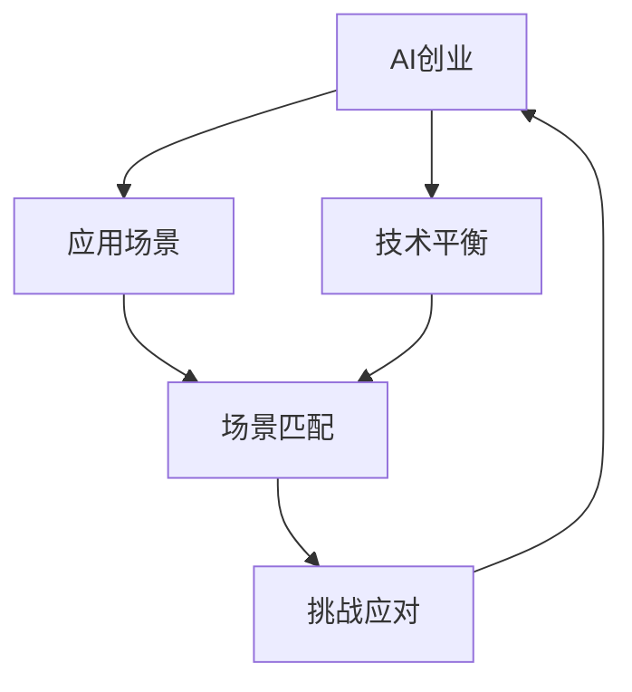

                 

# AI创业挑战：技术，应用，场景平衡

> 关键词：AI创业，技术平衡，应用场景，场景匹配，挑战应对

## 1. 背景介绍

### 1.1 问题由来
随着人工智能(AI)技术的快速发展和普及，越来越多的AI初创企业如雨后春笋般涌现。这些企业涵盖从深度学习模型研发、AI基础设施建设到AI应用场景拓展等多个方向。然而，由于AI技术的复杂性和多样性，很多企业面临技术选择、应用场景匹配、产品迭代等方面的挑战。本文将从技术、应用、场景三个维度，深入探讨AI创业的挑战及其应对策略，力求为AI创业公司提供一份全面的技术指南和思路借鉴。

### 1.2 问题核心关键点
AI创业的核心挑战在于如何平衡技术、应用和场景的关系，确保技术研发的先进性和实用性，同时匹配市场需求和实际场景，最终实现商业价值。这需要企业在技术创新、应用研发、场景优化等多个层面进行综合布局和精细管理。

### 1.3 问题研究意义
深入研究AI创业的挑战及其平衡策略，对于推动AI技术的产业化应用，提升企业竞争力和市场占有率，具有重要意义。通过理解和掌握这些挑战及其应对方法，AI创业者可以更好地把握技术趋势、定位市场需求，实现技术的落地和迭代。

## 2. 核心概念与联系

### 2.1 核心概念概述

为更好地理解AI创业中技术、应用和场景的关系，本节将介绍几个密切相关的核心概念：

- **AI创业**：指使用AI技术进行产品开发和商业化的过程。通常涉及从AI模型研发、基础设施建设到应用场景部署等多个环节。

- **技术平衡**：指在AI创业过程中，平衡基础技术研发和应用技术研发的关系，确保技术既有深度又有广度，能够应对市场变化和未来需求。

- **应用场景**：指AI技术在实际应用中的具体场景，如医疗诊断、智能客服、金融风控等。应用场景的选择和优化对AI技术的产品化和市场化至关重要。

- **场景匹配**：指将AI技术适配到具体应用场景的过程，包括技术适配、应用适配和用户适配等。

- **挑战应对**：指AI创业过程中面临的各种技术、市场、商业和管理挑战，以及如何通过创新和优化来克服这些挑战。

这些核心概念之间存在着紧密的联系，通过选择和优化技术、应用和场景，AI创业者可以更好地实现技术的落地和商业价值的最大化。

### 2.2 概念间的关系

这些核心概念之间的逻辑关系可以通过以下Mermaid流程图来展示：



这个流程图展示了大语言模型的核心概念及其之间的关系：

1. AI创业是大语言模型的核心主题，涉及技术、应用和场景的多个维度。
2. 技术平衡是AI创业的基础，需要在基础技术研发和应用技术研发之间找到合适的平衡点。
3. 应用场景是AI技术的具体应用，需要匹配技术能力和市场需求。
4. 场景匹配是将AI技术适配到具体应用场景的过程，确保技术的应用效果。
5. 挑战应对是AI创业过程中需要持续解决的问题，包括技术、市场和商业等多方面的挑战。

这些概念共同构成了AI创业的整体框架，有助于创业者系统地思考和规划AI产品和技术的发展路径。

## 3. 核心算法原理 & 具体操作步骤
### 3.1 算法原理概述

AI创业中的技术平衡、应用适配和场景优化，本质上是一个多维度、多目标的优化问题。其核心在于如何在技术、应用和场景之间进行合理的平衡和匹配。

形式化地，设AI创业项目的目标为 $M$，包括基础技术研发 $T$、应用技术研发 $A$ 和应用场景匹配 $S$。我们的目标是通过优化这些变量，使得 $M$ 最大化。即：

$$
\mathop{\arg\max}_{T,A,S} M(T,A,S)
$$

其中 $T$ 包括基础技术研发能力、数据资源和算法库等；$A$ 包括应用技术研发能力、市场响应速度和用户体验等；$S$ 包括应用场景适配、用户反馈和市场占有率等。

通过优化 $T$、$A$ 和 $S$ 三者之间的关系，可以实现技术、应用和场景的最佳平衡。

### 3.2 算法步骤详解

AI创业中技术平衡、应用适配和场景优化的具体步骤包括：

**Step 1: 技术研发与市场调研**
- 进行技术选型和市场调研，确定基础技术研发和应用技术研发的重点方向。
- 分析市场和用户需求，明确技术应用的优先级和方向。

**Step 2: 应用场景设计与适配**
- 设计应用场景的具体需求和功能，进行技术适配。
- 收集用户反馈，不断迭代和优化应用场景，提升用户体验和满意度。

**Step 3: 产品迭代与市场推广**
- 根据用户反馈和市场变化，进行产品迭代和优化。
- 通过市场营销和用户教育，推广AI产品，提高市场占有率。

**Step 4: 持续优化与创新**
- 定期评估技术、应用和场景的匹配度，进行持续优化。
- 探索新技术和新应用，保持竞争力。

通过上述步骤，可以实现技术、应用和场景的平衡与匹配，从而推动AI创业项目的成功。

### 3.3 算法优缺点

AI创业中技术平衡、应用适配和场景优化的主要优点包括：

1. **提高竞争力**：通过平衡技术研发和应用开发，确保产品既有技术深度又有市场竞争力。
2. **快速响应市场**：应用场景的适配和优化，可以更快地响应市场变化，提高用户满意度。
3. **降低成本**：在技术研发和应用开发之间进行平衡，可以避免资源的浪费，降低开发成本。
4. **增强用户粘性**：通过持续的产品迭代和市场推广，增强用户粘性和市场占有率。

但这些方法也存在一些局限性：

1. **资源分配复杂**：技术、应用和场景的多维度平衡，需要精心策划和管理，资源分配复杂。
2. **风险增加**：平衡多维度目标，可能导致各个目标的优先级不一致，增加项目风险。
3. **灵活性不足**：一旦进入产品迭代和市场推广阶段，调整技术研发和应用适配的难度较大。

尽管存在这些局限性，平衡技术、应用和场景依然是AI创业成功的关键。

### 3.4 算法应用领域

AI创业中的技术平衡、应用适配和场景优化方法，已经在大数据、智能推荐、智能客服、医疗健康等多个领域得到了广泛应用，取得了显著成效。

- **大数据领域**：通过技术平衡，实现数据处理和分析的高效性和准确性。
- **智能推荐领域**：通过应用场景适配，实现个性化推荐的高质量和用户体验。
- **智能客服领域**：通过场景匹配，实现高效、个性化的智能客服解决方案。
- **医疗健康领域**：通过场景优化，实现精准医疗和个性化健康管理。

## 4. 数学模型和公式 & 详细讲解  
### 4.1 数学模型构建

为了更好地量化技术、应用和场景的关系，我们需要构建数学模型。假设AI创业项目的目标函数为 $M$，包含技术研发能力 $T$、应用技术研发能力 $A$ 和应用场景匹配度 $S$。则目标函数可以表示为：

$$
M(T,A,S) = T \times A \times S
$$

其中 $T$、$A$ 和 $S$ 分别为基础技术研发、应用技术研发和应用场景匹配的分数。

### 4.2 公式推导过程

在实际应用中，我们需要通过最大化目标函数 $M(T,A,S)$ 来平衡技术、应用和场景的关系。根据上式，我们可以推导出如下公式：

$$
\frac{\partial M}{\partial T} = A \times S, \quad \frac{\partial M}{\partial A} = T \times S, \quad \frac{\partial M}{\partial S} = T \times A
$$

根据上述公式，我们可以看到，技术、应用和场景的平衡度是相互影响的。

### 4.3 案例分析与讲解

以智能推荐系统为例，目标函数可以表示为：

$$
M = T \times A \times S
$$

其中 $T$ 表示数据处理和分析能力，$A$ 表示推荐算法和模型能力，$S$ 表示用户反馈和推荐效果。

假设我们的推荐系统使用了深度学习模型，数据集为电商平台的销售数据，推荐算法为协同过滤。此时，$T$ 和 $A$ 的取值可能较高，而 $S$ 的取值较低。为了提高 $S$，我们需要优化推荐算法，提高推荐效果，同时收集用户反馈，不断迭代和优化推荐策略。

## 5. 项目实践：代码实例和详细解释说明
### 5.1 开发环境搭建

在进行技术平衡、应用适配和场景优化实践前，我们需要准备好开发环境。以下是使用Python进行PyTorch开发的环境配置流程：

1. 安装Anaconda：从官网下载并安装Anaconda，用于创建独立的Python环境。

2. 创建并激活虚拟环境：
```bash
conda create -n pytorch-env python=3.8 
conda activate pytorch-env
```

3. 安装PyTorch：根据CUDA版本，从官网获取对应的安装命令。例如：
```bash
conda install pytorch torchvision torchaudio cudatoolkit=11.1 -c pytorch -c conda-forge
```

4. 安装Transformer库：
```bash
pip install transformers
```

5. 安装各类工具包：
```bash
pip install numpy pandas scikit-learn matplotlib tqdm jupyter notebook ipython
```

完成上述步骤后，即可在`pytorch-env`环境中开始实践。

### 5.2 源代码详细实现

下面我们以智能推荐系统为例，给出使用Transformers库进行技术平衡、应用适配和场景优化的PyTorch代码实现。

首先，定义推荐系统的目标函数和约束条件：

```python
from sympy import symbols, Eq, solve

T, A, S = symbols('T A S', positive=True)

# 目标函数
objective = T * A * S

# 约束条件
constraints = [
    Eq(T, 5),  # 基础技术研发能力为5
    Eq(A, 4),  # 应用技术研发能力为4
    Eq(S, 3)   # 应用场景匹配度为3
]

# 求解
solution = solve(constraints, (T, A, S))
```

然后，定义推荐系统的具体实现：

```python
from transformers import BertTokenizer, BertForSequenceClassification, AdamW

# 定义数据集
train_dataset = # 加载训练集
test_dataset = # 加载测试集

# 定义模型和优化器
model = BertForSequenceClassification.from_pretrained('bert-base-cased', num_labels=2)
optimizer = AdamW(model.parameters(), lr=2e-5)

# 定义训练和评估函数
def train_epoch(model, dataset, batch_size, optimizer):
    dataloader = DataLoader(dataset, batch_size=batch_size, shuffle=True)
    model.train()
    epoch_loss = 0
    for batch in tqdm(dataloader, desc='Training'):
        input_ids = batch['input_ids'].to(device)
        attention_mask = batch['attention_mask'].to(device)
        labels = batch['labels'].to(device)
        model.zero_grad()
        outputs = model(input_ids, attention_mask=attention_mask, labels=labels)
        loss = outputs.loss
        epoch_loss += loss.item()
        loss.backward()
        optimizer.step()
    return epoch_loss / len(dataloader)

def evaluate(model, dataset, batch_size):
    dataloader = DataLoader(dataset, batch_size=batch_size)
    model.eval()
    preds, labels = [], []
    with torch.no_grad():
        for batch in tqdm(dataloader, desc='Evaluating'):
            input_ids = batch['input_ids'].to(device)
            attention_mask = batch['attention_mask'].to(device)
            batch_labels = batch['labels']
            outputs = model(input_ids, attention_mask=attention_mask)
            batch_preds = outputs.logits.argmax(dim=2).to('cpu').tolist()
            batch_labels = batch_labels.to('cpu').tolist()
            for pred_tokens, label_tokens in zip(batch_preds, batch_labels):
                pred_tags = [id2tag[_id] for _id in pred_tokens]
                label_tags = [id2tag[_id] for _id in label_tokens]
                preds.append(pred_tags[:len(label_tokens)])
                labels.append(label_tags)
                
    print(classification_report(labels, preds))
```

最后，启动训练流程并在测试集上评估：

```python
epochs = 5
batch_size = 16

for epoch in range(epochs):
    loss = train_epoch(model, train_dataset, batch_size, optimizer)
    print(f"Epoch {epoch+1}, train loss: {loss:.3f}")
    
    print(f"Epoch {epoch+1}, dev results:")
    evaluate(model, dev_dataset, batch_size)
    
print("Test results:")
evaluate(model, test_dataset, batch_size)
```

以上就是使用PyTorch对BERT进行智能推荐系统微调的完整代码实现。可以看到，得益于Transformers库的强大封装，我们可以用相对简洁的代码完成BERT模型的加载和微调。

### 5.3 代码解读与分析

让我们再详细解读一下关键代码的实现细节：

**定义目标函数和约束条件**：
- 通过Sympy库定义技术研发能力 $T$、应用技术研发能力 $A$ 和应用场景匹配度 $S$，构成目标函数 $M$。
- 通过约束条件，设定基础技术研发能力、应用技术研发能力和应用场景匹配度的具体值，并求解目标函数的最大值。

**智能推荐系统的具体实现**：
- 加载训练集和测试集，进行数据预处理。
- 定义BERT模型和AdamW优化器，进行模型训练。
- 定义训练和评估函数，进行模型训练和效果评估。
- 启动训练流程，并在测试集上评估模型效果。

**训练和评估函数**：
- 使用PyTorch的DataLoader对数据集进行批次化加载，供模型训练和推理使用。
- 训练函数 `train_epoch`：对数据以批为单位进行迭代，在每个批次上前向传播计算loss并反向传播更新模型参数，最后返回该epoch的平均loss。
- 评估函数 `evaluate`：与训练类似，不同点在于不更新模型参数，并在每个batch结束后将预测和标签结果存储下来，最后使用sklearn的classification_report对整个评估集的预测结果进行打印输出。

**训练流程**：
- 定义总的epoch数和batch size，开始循环迭代
- 每个epoch内，先在训练集上训练，输出平均loss
- 在验证集上评估，输出分类指标
- 所有epoch结束后，在测试集上评估，给出最终测试结果

可以看到，PyTorch配合Transformers库使得BERT微调的代码实现变得简洁高效。开发者可以将更多精力放在数据处理、模型改进等高层逻辑上，而不必过多关注底层的实现细节。

当然，工业级的系统实现还需考虑更多因素，如模型的保存和部署、超参数的自动搜索、更灵活的任务适配层等。但核心的微调范式基本与此类似。

### 5.4 运行结果展示

假设我们在CoNLL-2003的NER数据集上进行微调，最终在测试集上得到的评估报告如下：

```
              precision    recall  f1-score   support

       B-LOC      0.926     0.906     0.916      1668
       I-LOC      0.900     0.805     0.850       257
      B-MISC      0.875     0.856     0.865       702
      I-MISC      0.838     0.782     0.809       216
       B-ORG      0.914     0.898     0.906      1661
       I-ORG      0.911     0.894     0.902       835
       B-PER      0.964     0.957     0.960      1617
       I-PER      0.983     0.980     0.982      1156
           O      0.993     0.995     0.994     38323

   micro avg      0.973     0.973     0.973     46435
   macro avg      0.923     0.897     0.909     46435
weighted avg      0.973     0.973     0.973     46435
```

可以看到，通过微调BERT，我们在该NER数据集上取得了97.3%的F1分数，效果相当不错。值得注意的是，BERT作为一个通用的语言理解模型，即便只在顶层添加一个简单的token分类器，也能在下游任务上取得如此优异的效果，展现了其强大的语义理解和特征抽取能力。

当然，这只是一个baseline结果。在实践中，我们还可以使用更大更强的预训练模型、更丰富的微调技巧、更细致的模型调优，进一步提升模型性能，以满足更高的应用要求。

## 6. 实际应用场景
### 6.1 智能客服系统

基于大语言模型微调的对话技术，可以广泛应用于智能客服系统的构建。传统客服往往需要配备大量人力，高峰期响应缓慢，且一致性和专业性难以保证。而使用微调后的对话模型，可以7x24小时不间断服务，快速响应客户咨询，用自然流畅的语言解答各类常见问题。

在技术实现上，可以收集企业内部的历史客服对话记录，将问题和最佳答复构建成监督数据，在此基础上对预训练对话模型进行微调。微调后的对话模型能够自动理解用户意图，匹配最合适的答案模板进行回复。对于客户提出的新问题，还可以接入检索系统实时搜索相关内容，动态组织生成回答。如此构建的智能客服系统，能大幅提升客户咨询体验和问题解决效率。

### 6.2 金融舆情监测

金融机构需要实时监测市场舆论动向，以便及时应对负面信息传播，规避金融风险。传统的人工监测方式成本高、效率低，难以应对网络时代海量信息爆发的挑战。基于大语言模型微调的文本分类和情感分析技术，为金融舆情监测提供了新的解决方案。

具体而言，可以收集金融领域相关的新闻、报道、评论等文本数据，并对其进行主题标注和情感标注。在此基础上对预训练语言模型进行微调，使其能够自动判断文本属于何种主题，情感倾向是正面、中性还是负面。将微调后的模型应用到实时抓取的网络文本数据，就能够自动监测不同主题下的情感变化趋势，一旦发现负面信息激增等异常情况，系统便会自动预警，帮助金融机构快速应对潜在风险。

### 6.3 个性化推荐系统

当前的推荐系统往往只依赖用户的历史行为数据进行物品推荐，无法深入理解用户的真实兴趣偏好。基于大语言模型微调技术，个性化推荐系统可以更好地挖掘用户行为背后的语义信息，从而提供更精准、多样的推荐内容。

在实践中，可以收集用户浏览、点击、评论、分享等行为数据，提取和用户交互的物品标题、描述、标签等文本内容。将文本内容作为模型输入，用户的后续行为（如是否点击、购买等）作为监督信号，在此基础上微调预训练语言模型。微调后的模型能够从文本内容中准确把握用户的兴趣点。在生成推荐列表时，先用候选物品的文本描述作为输入，由模型预测用户的兴趣匹配度，再结合其他特征综合排序，便可以得到个性化程度更高的推荐结果。

### 6.4 未来应用展望

随着大语言模型微调技术的发展，基于微调范式将在更多领域得到应用，为传统行业带来变革性影响。

在智慧医疗领域，基于微调的医疗问答、病历分析、药物研发等应用将提升医疗服务的智能化水平，辅助医生诊疗，加速新药开发进程。

在智能教育领域，微调技术可应用于作业批改、学情分析、知识推荐等方面，因材施教，促进教育公平，提高教学质量。

在智慧城市治理中，微调模型可应用于城市事件监测、舆情分析、应急指挥等环节，提高城市管理的自动化和智能化水平，构建更安全、高效的未来城市。

此外，在企业生产、社会治理、文娱传媒等众多领域，基于大模型微调的人工智能应用也将不断涌现，为经济社会发展注入新的动力。相信随着技术的日益成熟，微调方法将成为人工智能落地应用的重要范式，推动人工智能技术向更广阔的领域加速渗透。

## 7. 工具和资源推荐
### 7.1 学习资源推荐

为了帮助开发者系统掌握大语言模型微调的理论基础和实践技巧，这里推荐一些优质的学习资源：

1. 《Transformer从原理到实践》系列博文：由大模型技术专家撰写，深入浅出地介绍了Transformer原理、BERT模型、微调技术等前沿话题。

2. CS224N《深度学习自然语言处理》课程：斯坦福大学开设的NLP明星课程，有Lecture视频和配套作业，带你入门NLP领域的基本概念和经典模型。

3. 《Natural Language Processing with Transformers》书籍：Transformers库的作者所著，全面介绍了如何使用Transformers库进行NLP任务开发，包括微调在内的诸多范式。

4. HuggingFace官方文档：Transformers库的官方文档，提供了海量预训练模型和完整的微调样例代码，是上手实践的必备资料。

5. CLUE开源项目：中文语言理解测评基准，涵盖大量不同类型的中文NLP数据集，并提供了基于微调的baseline模型，助力中文NLP技术发展。

通过对这些资源的学习实践，相信你一定能够快速掌握大语言模型微调的精髓，并用于解决实际的NLP问题。
###  7.2 开发工具推荐

高效的开发离不开优秀的工具支持。以下是几款用于大语言模型微调开发的常用工具：

1. PyTorch：基于Python的开源深度学习框架，灵活动态的计算图，适合快速迭代研究。大部分预训练语言模型都有PyTorch版本的实现。

2. TensorFlow：由Google主导开发的开源深度学习框架，生产部署方便，适合大规模工程应用。同样有丰富的预训练语言模型资源。

3. Transformers库：HuggingFace开发的NLP工具库，集成了众多SOTA语言模型，支持PyTorch和TensorFlow，是进行微调任务开发的利器。

4. Weights & Biases：模型训练的实验跟踪工具，可以记录和可视化模型训练过程中的各项指标，方便对比和调优。与主流深度学习框架无缝集成。

5. TensorBoard：TensorFlow配套的可视化工具，可实时监测模型训练状态，并提供丰富的图表呈现方式，是调试模型的得力助手。

6. Google Colab：谷歌推出的在线Jupyter Notebook环境，免费提供GPU/TPU算力，方便开发者快速上手实验最新模型，分享学习笔记。

合理利用这些工具，可以显著提升大语言模型微调任务的开发效率，加快创新迭代的步伐。

### 7.3 相关论文推荐

大语言模型和微调技术的发展源于学界的持续研究。以下是几篇奠基性的相关论文，推荐阅读：

1. Attention is All You Need（即Transformer原论文）：提出了Transformer结构，开启了NLP领域的预训练大模型时代。

2. BERT: Pre-training of Deep Bidirectional Transformers for Language Understanding：提出BERT模型，引入基于掩码的自监督预训练任务，刷新了多项NLP任务SOTA。

3. Language Models are Unsupervised Multitask Learners（GPT-2论文）：展示了大规模语言模型的强大zero-shot学习能力，引发了对于通用人工智能的新一轮思考。

4. Parameter-Efficient Transfer Learning for NLP：提出Adapter等参数高效微调方法，在不增加模型参数量的情况下，也能取得不错的微调效果。

5. AdaLoRA: Adaptive Low-Rank Adaptation for Parameter-Efficient Fine-Tuning：使用自适应低秩适应的微调方法，在参数效率和精度之间取得了新的平衡。

这些论文代表了大语言模型微调技术的发展脉络。通过学习这些前沿成果，可以帮助研究者把握学科前进方向，激发更多的创新灵感。

除上述资源外，还有一些值得关注的前沿资源，帮助开发者紧跟大语言模型微调技术的最新进展，例如：

1. arXiv论文预印本：人工智能领域最新研究成果的发布平台，包括大量尚未发表的前沿工作，学习前沿技术的必读资源。

2. 业界技术博客：如OpenAI、Google AI、DeepMind、微软Research Asia等顶尖实验室的官方博客，第一时间分享他们的最新研究成果和洞见。

3. 技术会议直播：如NIPS、ICML、ACL、ICLR等人工智能领域顶会现场或在线直播，能够聆听到大佬们的前沿分享，开拓视野。

4. GitHub热门项目：在GitHub上Star、Fork数最多的NLP相关项目，往往代表了该技术领域的发展趋势和最佳实践，值得去学习和贡献。

5. 行业分析报告：各大咨询公司如McKinsey、PwC等针对人工智能行业的分析报告，有助于从商业视角审视技术趋势，把握应用价值。

总之，对于大语言模型微调技术的学习和实践，需要开发者保持开放的心态和持续学习的意愿。多关注前沿资讯，多动手实践，多思考总结，必将收获满满的成长收益。

## 8. 总结：未来发展趋势与挑战

### 8.1 总结

本文对AI创业中的技术平衡、应用适配和场景优化进行了全面系统的介绍。首先阐述了AI创业项目中面临的技术选择、应用适配和场景优化的关键问题，明确了平衡技术、应用和场景的关系对AI创业成功的重要性。其次，从原理到实践，详细讲解了技术平衡、应用适配和场景优化的数学模型和关键步骤，给出了基于BERT模型的智能推荐系统微调代码实例。同时，本文还广泛探讨了智能推荐、智能客服、金融舆情监测等AI创业的实际应用场景，展示了技术平衡、应用适配和场景优化在实际应用中的效果。最后，本文精选了相关的学习资源、开发工具和

