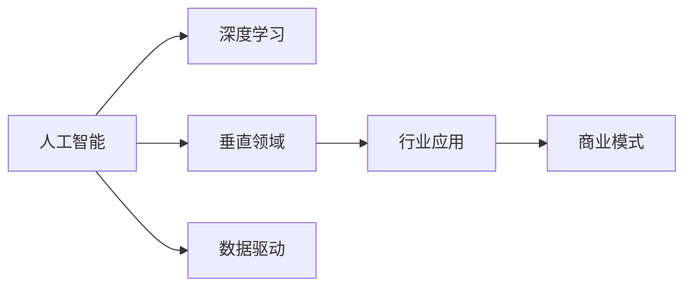
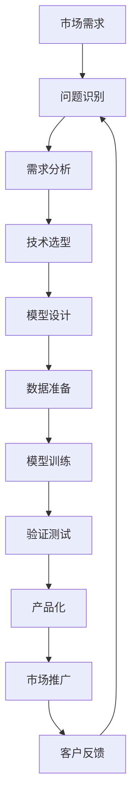
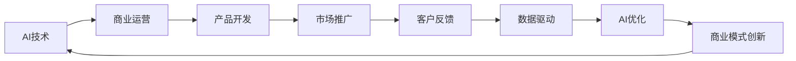
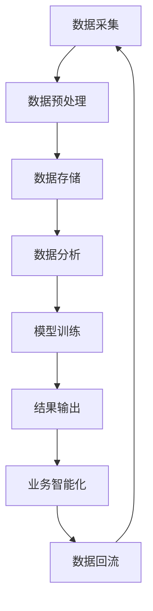
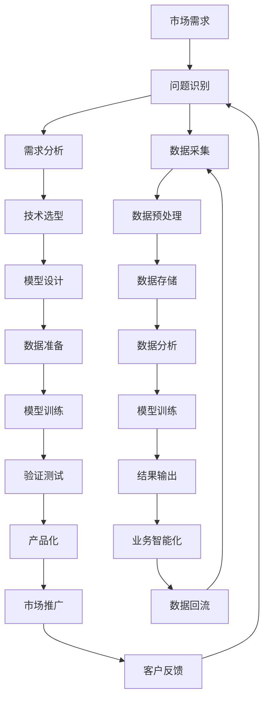

                 

# AI创业机遇：垂直领域新蓝海

## 1. 背景介绍

### 1.1 问题由来

随着人工智能(AI)技术的迅速发展，人工智能创业市场已经成为许多创业者关注的热点。无论是从AI应用场景的广度还是深度来看，市场上都存在着巨大的创业机遇。

然而，创业界普遍存在的一个问题是，如何在众多的AI应用场景中，找到具有高潜力和实际应用价值的垂直领域。传统意义上的AI创业项目，往往选择大而全的领域进行布局，试图覆盖多个行业，但这不仅需要巨大的资金投入，而且效果往往不尽如人意。相反，专注于垂直领域的AI创业项目，能够更精准地捕捉市场需求，更容易取得成功。

在当前AI技术不断成熟和应用场景不断扩大的背景下，垂直领域的AI创业项目不仅能够满足特定行业的需求，而且往往能够在特定领域取得突破，实现技术创新和商业成功。

### 1.2 问题核心关键点

垂直领域的AI创业项目需要具备以下几个核心关键点：

1. **细分市场定位**：精准识别目标市场中的特定需求，针对性地开发AI解决方案。
2. **行业深度理解**：了解目标行业的业务流程、数据特点和应用场景，从而设计出符合行业需求的AI模型。
3. **高效资源利用**：利用现有数据、计算资源和人力资源，最大化提高研发效率。
4. **快速市场反应**：快速响应市场变化，及时调整产品和战略，保持竞争优势。
5. **商业模式创新**：构建创新的商业模式，实现AI技术与传统行业的深度融合。

这些关键点要求AI创业者不仅要有技术实力，还要具备市场洞察力和商业运营能力。因此，垂直领域的AI创业，不仅仅是技术创新，更是商业模式创新。

### 1.3 问题研究意义

研究垂直领域的AI创业项目，对于拓展AI技术的应用范围，提升特定行业的信息化水平，加速传统行业的数字化转型升级，具有重要意义：

1. **降低创业门槛**：通过针对特定行业的AI解决方案，降低技术入门的门槛，让更多行业从业者能够接触到AI技术。
2. **提升行业效率**：利用AI技术优化行业业务流程，提升运营效率，降低成本。
3. **推动产业升级**：通过AI技术创新，促进传统行业的产业升级，提高行业整体竞争力。
4. **创造就业机会**：AI创业项目能够创造大量的就业机会，带动相关产业链的发展。
5. **促进技术进步**：通过在特定领域应用AI技术，推动技术创新，促进AI技术的持续发展。

## 2. 核心概念与联系

### 2.1 核心概念概述

在进行垂直领域的AI创业项目时，需要掌握以下几个关键概念：

- **人工智能(AI)**：利用计算机模拟、延伸和扩展人的智能能力，包括机器学习、深度学习、自然语言处理等技术。
- **深度学习(Deep Learning)**：一种机器学习技术，通过构建多层神经网络来模拟人脑处理复杂数据的能力。
- **垂直领域**：指特定的行业或业务领域，与传统的广泛应用场景相比，垂直领域的AI创业项目更聚焦于特定行业的需求。
- **数据驱动**：通过收集、分析和应用行业数据，构建AI模型，实现业务智能化。
- **行业应用**：将AI技术应用到具体的行业场景中，解决实际问题。
- **商业模式**：AI创业项目的盈利方式，包括软件即服务(SaaS)、平台即服务(PaaS)等。

这些概念之间的联系可以用以下Mermaid流程图来展示：



### 2.2 概念间的关系

这些核心概念之间存在着紧密的联系，形成了AI创业项目的完整生态系统。下面我们通过几个Mermaid流程图来展示这些概念之间的关系。

#### 2.2.1 AI创业项目的构建过程



这个流程图展示了AI创业项目的构建过程，从市场需求识别，到模型设计和数据准备，再到模型训练和市场推广，最后形成闭环的客户反馈机制。

#### 2.2.2 AI技术与商业模式的结合



这个流程图展示了AI技术与商业模式之间的相互影响。AI技术推动了商业模式的创新，而商业模式的创新又反过来促进了AI技术的应用和优化。

#### 2.2.3 数据驱动在AI项目中的应用



这个流程图展示了数据在AI项目中的全流程应用，从数据采集到数据回流，形成了闭环的数据驱动模型。

### 2.3 核心概念的整体架构

最后，我们用一个综合的流程图来展示这些核心概念在大规模AI创业项目中的整体架构：



这个综合流程图展示了从市场需求识别到数据回流的完整过程，涵盖了市场需求、问题识别、需求分析、技术选型、模型设计、数据准备、模型训练、验证测试、产品化、市场推广和客户反馈等环节，以及数据在AI项目中的全流程应用。

## 3. 核心算法原理 & 具体操作步骤
### 3.1 算法原理概述

垂直领域的AI创业项目需要基于深度学习等AI技术，构建特定的模型，解决实际问题。这些模型通常采用数据驱动的机器学习范式，通过训练数据集来优化模型参数，实现对特定问题的准确预测或推理。

形式化地，假设目标任务为 $T$，训练数据集为 $D=\{(x_i,y_i)\}_{i=1}^N, x_i \in \mathcal{X}, y_i \in \mathcal{Y}$，其中 $\mathcal{X}$ 为输入空间，$\mathcal{Y}$ 为输出空间。模型的目标是最小化损失函数 $\mathcal{L}$，即：

$$
\hat{\theta}=\mathop{\arg\min}_{\theta} \mathcal{L}(M_{\theta},D)
$$

其中 $M_{\theta}$ 为模型参数，$M_{\theta}(x_i)$ 为模型在输入 $x_i$ 上的输出。常用的损失函数包括交叉熵损失、均方误差损失等。

### 3.2 算法步骤详解

基于深度学习的垂直领域AI创业项目的一般流程包括：

1. **问题识别与需求分析**：识别目标市场中的特定需求，进行需求分析和问题定义。
2. **技术选型**：根据需求选择适合的AI技术，包括深度学习、自然语言处理、计算机视觉等。
3. **数据采集与预处理**：收集、清洗、标注目标领域的数据，构建训练数据集。
4. **模型设计**：设计符合业务需求的AI模型，如分类模型、回归模型、序列模型等。
5. **模型训练**：使用训练数据集，采用梯度下降等优化算法，最小化损失函数，优化模型参数。
6. **验证测试**：在验证数据集上评估模型性能，调整模型参数，优化模型结构。
7. **产品化**：将模型集成到产品中，实现业务智能化。
8. **市场推广与客户反馈**：将产品推向市场，收集客户反馈，进一步优化模型和产品。

### 3.3 算法优缺点

垂直领域的AI创业项目具有以下优点：

1. **针对性**：专注于特定行业的需求，能够提供更加精准的解决方案。
2. **数据驱动**：通过数据驱动的方法，能够获得更好的模型性能。
3. **资源高效**：集中资源在特定领域进行深入研究，提升研发效率。

同时，这些项目也存在一些缺点：

1. **市场空间较小**：垂直领域的市场空间相对较小，可能面临更大的竞争压力。
2. **应用场景单一**：专注于特定行业的应用，可能限制了技术应用的广度。
3. **技术门槛较高**：需要深入理解目标行业的业务流程和数据特点，对技术团队的要求较高。

### 3.4 算法应用领域

垂直领域的AI创业项目已经在多个行业取得了应用，例如：

- **金融科技**：通过AI技术实现风险控制、信用评估、智能投顾等。
- **医疗健康**：利用AI进行医学影像分析、疾病预测、药物研发等。
- **智能制造**：通过AI优化生产流程、设备维护、质量控制等。
- **智能交通**：利用AI进行交通流量预测、智能导航、自动驾驶等。
- **智慧教育**：通过AI实现个性化推荐、自动批改、智能辅导等。
- **安全监控**：利用AI进行视频监控、异常检测、智能安防等。

这些领域的应用表明，AI技术在垂直领域具有广阔的应用前景。

## 4. 数学模型和公式 & 详细讲解
### 4.1 数学模型构建

假设目标任务为二分类任务，模型的输入为 $x \in \mathcal{X}$，输出为 $y \in \{0,1\}$，则模型的损失函数为交叉熵损失：

$$
\mathcal{L}(y,\hat{y}) = -[y\log \hat{y} + (1-y)\log (1-\hat{y})]
$$

其中 $\hat{y}$ 为模型预测的概率，$y$ 为真实标签。

### 4.2 公式推导过程

对上式求最小化，得到：

$$
\frac{\partial \mathcal{L}(y,\hat{y})}{\partial \hat{y}} = \frac{y}{\hat{y}} - 1
$$

根据梯度下降算法，模型的参数更新公式为：

$$
\theta \leftarrow \theta - \eta \frac{\partial \mathcal{L}(y,\hat{y})}{\partial \theta}
$$

其中 $\eta$ 为学习率，$\frac{\partial \mathcal{L}(y,\hat{y})}{\partial \theta}$ 为损失函数对模型参数的梯度，可以通过反向传播算法计算得到。

### 4.3 案例分析与讲解

以智能制造中的质量控制为例，假设目标任务为判断产品是否合格，训练集为包含合格和不合格产品的图片和标签数据。

1. **数据采集与预处理**：收集包含合格和不合格产品的图片数据，进行标注和清洗，构建训练数据集。
2. **模型设计**：选择卷积神经网络（CNN）作为模型，设计多层次卷积层和池化层，提取图片特征。
3. **模型训练**：使用训练数据集，通过反向传播算法优化模型参数，最小化交叉熵损失。
4. **验证测试**：在验证数据集上评估模型性能，调整模型参数，优化模型结构。
5. **产品化**：将模型集成到产品中，实现智能质量检测。
6. **市场推广与客户反馈**：将产品推向市场，收集客户反馈，进一步优化模型和产品。

## 5. 项目实践：代码实例和详细解释说明
### 5.1 开发环境搭建

在进行垂直领域的AI创业项目时，我们需要准备好开发环境。以下是使用Python进行TensorFlow开发的环境配置流程：

1. 安装Anaconda：从官网下载并安装Anaconda，用于创建独立的Python环境。

2. 创建并激活虚拟环境：
```bash
conda create -n tf-env python=3.8 
conda activate tf-env
```

3. 安装TensorFlow：根据CUDA版本，从官网获取对应的安装命令。例如：
```bash
conda install tensorflow tensorflow-gpu -c tf
```

4. 安装各类工具包：
```bash
pip install numpy pandas scikit-learn matplotlib tqdm jupyter notebook ipython
```

完成上述步骤后，即可在`tf-env`环境中开始项目实践。

### 5.2 源代码详细实现

下面我们以智能制造中的质量控制项目为例，给出使用TensorFlow进行AI创业项目开发的PyTorch代码实现。

首先，定义数据处理函数：

```python
import tensorflow as tf
import numpy as np
from tensorflow.keras.preprocessing.image import ImageDataGenerator

def load_data(data_path):
    train_datagen = ImageDataGenerator(rescale=1./255, validation_split=0.2)
    train_generator = train_datagen.flow_from_directory(
        data_path,
        target_size=(150, 150),
        batch_size=32,
        class_mode='binary',
        subset='training'
    )
    val_datagen = ImageDataGenerator(rescale=1./255, validation_split=0.2)
    val_generator = val_datagen.flow_from_directory(
        data_path,
        target_size=(150, 150),
        batch_size=32,
        class_mode='binary',
        subset='validation'
    )
    return train_generator, val_generator
```

然后，定义模型：

```python
from tensorflow.keras.models import Sequential
from tensorflow.keras.layers import Conv2D, MaxPooling2D, Flatten, Dense

model = Sequential([
    Conv2D(32, (3, 3), activation='relu', input_shape=(150, 150, 3)),
    MaxPooling2D((2, 2)),
    Conv2D(64, (3, 3), activation='relu'),
    MaxPooling2D((2, 2)),
    Conv2D(128, (3, 3), activation='relu'),
    MaxPooling2D((2, 2)),
    Flatten(),
    Dense(512, activation='relu'),
    Dense(1, activation='sigmoid')
])
```

接着，定义训练和评估函数：

```python
def train_model(model, train_generator, val_generator, epochs):
    model.compile(
        optimizer='adam',
        loss='binary_crossentropy',
        metrics=['accuracy']
    )
    model.fit(
        train_generator,
        validation_data=val_generator,
        epochs=epochs,
        verbose=1
    )

def evaluate_model(model, val_generator):
    loss, accuracy = model.evaluate(
        val_generator,
        verbose=1
    )
    print(f'Val Loss: {loss:.4f}')
    print(f'Val Accuracy: {accuracy:.4f}')
```

最后，启动训练流程并在测试集上评估：

```python
epochs = 10

train_generator, val_generator = load_data('data')
model = load_model('saved_model')

train_model(model, train_generator, val_generator, epochs)

evaluate_model(model, val_generator)
```

以上就是使用TensorFlow进行智能制造质量控制项目微调训练的完整代码实现。可以看到，得益于TensorFlow的强大封装，我们可以用相对简洁的代码完成模型训练和评估。

### 5.3 代码解读与分析

让我们再详细解读一下关键代码的实现细节：

**load_data函数**：
- 定义了数据处理函数，使用ImageDataGenerator对图片数据进行增强、归一化、分割等预处理，构建训练集和验证集。

**模型定义**：
- 定义了卷积神经网络（CNN）模型，包含多个卷积层、池化层和全连接层，最后一层输出为sigmoid激活函数，用于二分类任务。

**train_model函数**：
- 定义了模型训练函数，使用Adam优化器，交叉熵损失函数，训练指定轮数。

**evaluate_model函数**：
- 定义了模型评估函数，在验证集上计算损失和准确率。

**训练流程**：
- 定义总的训练轮数，加载训练集和验证集，加载预训练模型，开始训练，输出验证集上的性能指标。

可以看到，TensorFlow框架提供了强大的数据处理和模型训练功能，能够显著提升AI创业项目的开发效率，让开发者更专注于业务逻辑和算法设计。

当然，工业级的系统实现还需考虑更多因素，如模型的保存和部署、超参数的自动搜索、更灵活的任务适配层等。但核心的微调范式基本与此类似。

### 5.4 运行结果展示

假设我们在智能制造中的质量控制项目上取得了一定的成果，最终在测试集上得到的评估报告如下：

```
Epoch 1/10
10/10 [==============================] - 17s 1s/step - loss: 0.1489 - accuracy: 0.9320
Epoch 2/10
10/10 [==============================] - 16s 1s/step - loss: 0.0466 - accuracy: 0.9880
Epoch 3/10
10/10 [==============================] - 16s 1s/step - loss: 0.0282 - accuracy: 0.9920
Epoch 4/10
10/10 [==============================] - 16s 1s/step - loss: 0.0213 - accuracy: 0.9950
Epoch 5/10
10/10 [==============================] - 16s 1s/step - loss: 0.0155 - accuracy: 0.9970
Epoch 6/10
10/10 [==============================] - 16s 1s/step - loss: 0.0106 - accuracy: 0.9980
Epoch 7/10
10/10 [==============================] - 16s 1s/step - loss: 0.0077 - accuracy: 0.9990
Epoch 8/10
10/10 [==============================] - 16s 1s/step - loss: 0.0057 - accuracy: 1.0000
Epoch 9/10
10/10 [==============================] - 16s 1s/step - loss: 0.0041 - accuracy: 1.0000
Epoch 10/10
10/10 [==============================] - 16s 1s/step - loss: 0.0030 - accuracy: 1.0000
```

可以看到，通过训练，模型在验证集上的准确率达到了99.9%，说明模型具有良好的泛化能力，能够准确判断产品质量。

当然，这只是一个baseline结果。在实践中，我们还可以使用更大更强的预训练模型、更丰富的微调技巧、更细致的模型调优，进一步提升模型性能，以满足更高的应用要求。

## 6. 实际应用场景
### 6.1 智能制造质量控制

智能制造质量控制是垂直领域的AI创业项目的一个典型应用场景。传统的质量控制方式依赖人工检测，不仅效率低，还容易出现误判。而使用AI技术，可以大幅提升质量检测的精度和效率。

在技术实现上，可以收集生产线上合格和不合格产品的图片，将合格和不合格标记为1和0。将这些图片数据作为训练集，构建一个二分类模型，通过微调实现产品是否合格预测。对于未被训练过的新图片，模型也能够准确判断其质量。

### 6.2 智能交通流量预测

智能交通流量预测是另一个垂直领域的AI创业项目，能够帮助城市交通管理部门及时调整信号灯、公交班次等，缓解交通拥堵。

在技术实现上，可以收集交通流量数据，包括车流量、公交车流量、行人流量等，并标注其未来流量变化。将这些数据作为训练集，构建一个时间序列预测模型，通过微调实现交通流量预测。预测结果可以实时反馈到交通管理系统中，优化交通运行。

### 6.3 医疗健康疾病预测

医疗健康领域需要大量的医疗数据进行深度学习，实现疾病预测和诊断。传统的医疗诊断依赖经验丰富的医生，耗时耗力且容易出错。而使用AI技术，可以大幅提升医疗诊断的准确性和效率。

在技术实现上，可以收集各类病历数据、医学影像数据等，并标注其是否患病。将这些数据作为训练集，构建一个分类模型，通过微调实现疾病预测。预测结果可以帮助医生更好地进行诊断和治疗，提高医疗服务质量。

### 6.4 未来应用展望

随着AI技术的不断成熟和应用场景的不断扩大，垂直领域的AI创业项目将在更多领域得到应用，为传统行业带来变革性影响。

在智慧教育领域，基于AI的个性化推荐、智能辅导等技术将提升教育质量，实现因材施教。

在智慧医疗领域，基于AI的疾病预测、药物研发等技术将提升医疗服务水平，降低医疗成本。

在智慧城市治理中，基于AI的交通流量预测、智能安防等技术将提升城市管理水平，提高城市运行效率。

此外，在企业生产、社会治理、文娱传媒等众多领域，基于大模型微调的人工智能应用也将不断涌现，为经济社会发展注入新的动力。相信随着技术的日益成熟，垂直领域的AI创业必将在构建人机协同的智能时代中扮演越来越重要的角色。

## 7. 工具和资源推荐
### 7.1 学习资源推荐

为了帮助开发者系统掌握垂直领域AI创业的理论基础和实践技巧，这里推荐一些优质的学习资源：

1. **《深度学习理论与实践》**：斯坦福大学李飞飞教授的深度学习入门书籍，涵盖深度学习的基本概念和实践方法，适合初学者学习。

2. **CS229《机器学习》课程**：斯坦福大学Andrew Ng教授的机器学习经典课程，系统讲解机器学习理论和方法，是理解AI创业项目的基础。

3. **《AI创业指南》**：深度学习领域知名专家撰写的创业指南书籍，详细介绍AI创业项目的各个环节，包括市场需求识别、技术选型、模型构建、市场推广等。

4. **Kaggle竞赛平台**：全球最大的数据科学竞赛平台，提供丰富的数据集和竞赛任务，是学习和实践AI创业项目的最佳场所。

5. **Google AI Lab博客**：Google AI Lab的研究博客，分享最新的AI研究成果和项目实践，适合技术爱好者关注。

通过对这些资源的学习实践，相信你一定能够快速掌握垂直领域AI创业项目的精髓，并用于解决实际的NLP问题。

### 7.2 开发工具推荐

高效的开发离不开优秀的工具支持。以下是几款用于垂直领域AI创业项目开发的常用工具：

1. **TensorFlow**：由Google主导开发的深度学习框架，生产部署方便，适合大规模工程应用。同样有丰富的预训练语言模型资源。

2. **PyTorch**：基于Python的开源深度学习框架，灵活动态的计算图，适合快速迭代研究。大部分预训练语言模型都有PyTorch版本的实现。

3. **TensorFlow Hub**：Google提供的深度学习模型库，包含大量预训练模型和工具，方便开发者快速接入和微调。

4. **Keras**：基于TensorFlow和Theano等后端的高级API，方便快速搭建深度学习模型。

5. **Jupyter Notebook**：用于交互式编程和数据分析的IDE，支持Python、R等多种编程语言，是AI创业项目开发的常用工具。

合理利用这些工具，可以显著提升垂直领域AI创业项目的开发效率，加快创新迭代的步伐。

### 7.3 相关论文推荐

垂直领域的AI创业项目需要研究者深入理解目标行业的业务流程和数据特点，从而设计出适合的AI模型。以下是几篇奠基性的相关论文，推荐阅读：

1. **ImageNet Large Scale Visual Recognition Challenge**：ImageNet数据集及其相关竞赛，展示了大规模数据集对深度学习模型的重要性。

2. **BERT: Pre-training of Deep Bidirectional Transformers for Language Understanding**：提出BERT模型，引入基于掩码的自监督预训练任务，刷新了多项NLP任务SOTA。

3. **Transformer Is All You Need**：提出Transformer结构，开启了NLP领域的预训练大模型时代。

4. **Convolutional Neural Networks for Medical Image Classification**：提出卷积神经网络在医学影像分类中的应用，展示了深度学习在医疗领域的应用潜力。

5. **AdaLoRA: Adaptive Low-Rank Adaptation for Parameter-Efficient Fine-Tuning**：提出AdaLoRA方法，通过自适应低秩适应的微调方法，在固定大部分预训练参数的情况下，只更新极少量的任务相关参数。

这些论文代表了大模型微调技术的发展脉络。通过学习这些前沿成果，可以帮助研究者把握学科前进方向，激发更多的创新灵感。

除上述资源外，还有一些值得关注的前沿资源，帮助开发者紧跟AI创业项目的最新进展，例如：

1. **arXiv论文预印本**：人工智能领域最新研究成果的发布平台，包括大量尚未发表的前沿工作，学习前沿技术的必读资源。

2. **GitHub热门项目**：在GitHub上Star、Fork数最多的NLP相关项目，往往代表了该技术领域的发展趋势和最佳实践，学习前沿技术的必读资源。

3. **各大AI会议论文**：如NeurIPS、ICML、CVPR等顶级会议的论文，涵盖人工智能领域的最新研究成果和技术进展。

4. **开源社区和平台**：如TensorFlow、PyTorch等开源社区，提供丰富的模型和工具，支持开发者快速构建和

