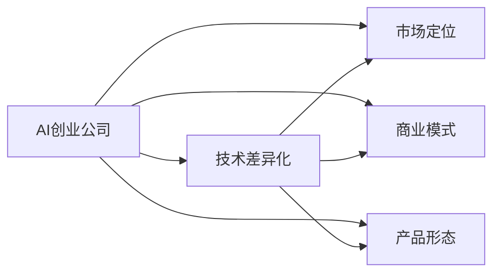
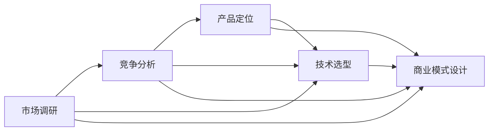
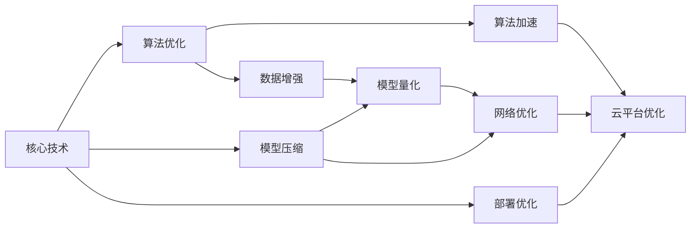
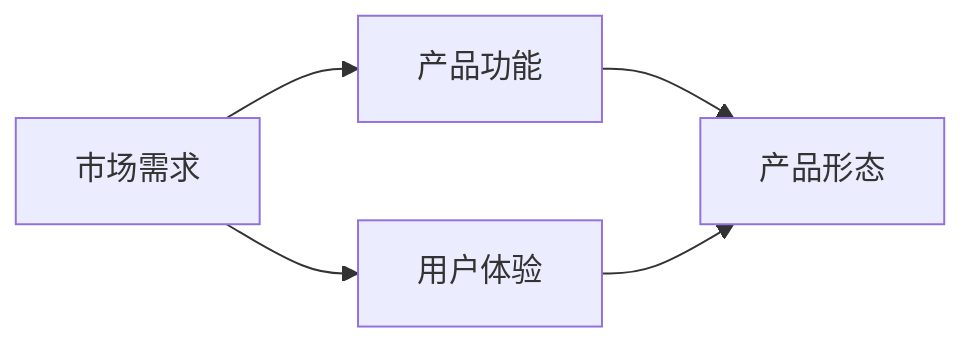
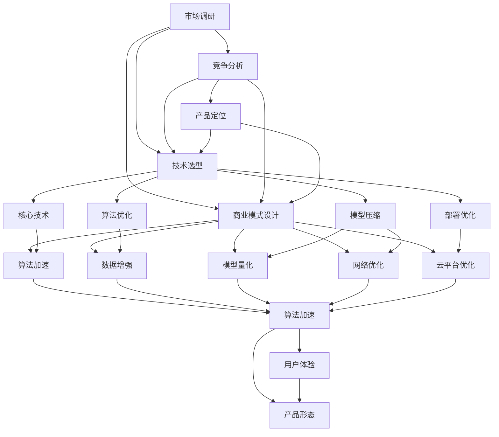

                 

## 1. 背景介绍

### 1.1 问题由来
近年来，人工智能（AI）领域的发展速度迅猛，无论是初创公司还是大型企业，都在投入大量资源进行AI技术的研发和应用。然而，随着AI技术的普及，市场竞争日趋激烈，AI创业公司之间的竞争也逐渐白热化。

传统AI公司拥有丰富的人才和资本储备，能够快速扩张市场份额。新兴AI创业公司则由于资源有限，在追赶的过程中面临重重困难。因此，差异化发展成为这些AI创业公司突围的重要法宝。

### 1.2 问题核心关键点
差异化发展不仅体现在技术上，更在于商业模式、市场定位、产品形态等方面的创新。本文将围绕技术差异化，探讨AI创业公司如何通过不同的技术手段和创新策略，在激烈的市场竞争中占据优势。

### 1.3 问题研究意义
在AI创业公司的竞争中，差异化发展能够帮助企业在技术、市场、商业模式等方面获得突破，形成独特的竞争优势。研究差异化发展的路径和方法，对AI创业者具有重要的实践意义，能够指导他们如何在激烈的市场环境中突围。

## 2. 核心概念与联系

### 2.1 核心概念概述

- **AI创业公司**：专注于AI技术的创业公司，通过研发和应用AI技术来解决特定问题或提供特定服务。
- **技术差异化**：通过独特的技术手段或创新实现，使自己的产品或服务与竞争对手区分开来，形成独特的竞争优势。
- **市场定位**：根据目标用户的需求和市场环境，确定自己的产品或服务在市场中的定位。
- **商业模式**：公司如何创造、传递、交换价值的模式，包括产品销售、服务订阅、增值服务、数据变现等。
- **产品形态**：软件、硬件、平台、服务等产品形式，体现了技术的应用方式和用户体验。

这些核心概念之间的关系，可以通过以下Mermaid流程图来展示：



这个流程图展示了AI创业公司如何通过技术差异化，结合市场定位、商业模式和产品形态，形成独特的竞争优势。

### 2.2 概念间的关系

这些核心概念之间存在着紧密的联系，形成了AI创业公司发展的完整生态系统。下面通过几个Mermaid流程图来展示这些概念之间的关系。

#### 2.2.1 AI创业公司的战略规划



这个流程图展示了AI创业公司在制定战略规划时，如何综合考虑市场调研、竞争分析、技术选型和商业模式设计，最终确定产品定位。

#### 2.2.2 差异化技术的实现



这个流程图展示了差异化技术的实现过程，包括核心技术的创新、算法优化、模型压缩、部署优化等多个方面。

#### 2.2.3 市场定位与产品形态的融合



这个流程图展示了市场定位与产品形态的融合，即如何根据市场需求和用户体验，设计出符合市场需求的独特产品形态。

### 2.3 核心概念的整体架构

最后，我们用一个综合的流程图来展示这些核心概念在大规模AI创业公司发展过程中的整体架构：



这个综合流程图展示了AI创业公司从市场调研到技术选型，再到产品定位和商业模式的整个过程，并展示了差异化技术的实现过程以及市场定位与产品形态的融合。

## 3. 核心算法原理 & 具体操作步骤
### 3.1 算法原理概述

差异化发展的核心在于技术手段的独特性和创新性。本文主要聚焦于深度学习领域的差异化技术，探讨如何通过算法创新、模型压缩、算法加速等手段，实现技术的差异化。

### 3.2 算法步骤详解

**Step 1: 确定差异化方向**
- 通过市场调研和竞争分析，确定产品的独特需求和技术方向。
- 选择合适的差异化技术手段，如算法优化、模型压缩、算法加速等。

**Step 2: 算法选型与优化**
- 根据产品需求，选择适合的算法模型，并进行算法优化。
- 使用自动微分、梯度下降等技术，优化算法模型，提升其性能。

**Step 3: 模型压缩与量化**
- 对优化后的模型进行压缩，减小模型大小和计算量。
- 使用量化技术，将模型参数从浮点数转化为定点数，进一步减少计算量和存储需求。

**Step 4: 部署优化与加速**
- 优化模型的部署环境，提升模型推理速度。
- 使用GPU、TPU等硬件加速，提高模型计算效率。

**Step 5: 云平台优化与集成**
- 将优化后的模型部署到云平台，方便集成和扩展。
- 使用容器化技术，如Docker，方便模型的管理和调度。

**Step 6: 用户测试与反馈**
- 进行用户测试，收集反馈信息。
- 根据用户反馈，持续优化模型和产品，提高用户体验。

### 3.3 算法优缺点

差异化技术在提升产品性能和用户体验的同时，也存在一些缺点：

- **高成本**：技术创新和优化往往需要较高的研发成本和计算资源。
- **技术复杂**：算法优化和模型压缩等技术较为复杂，需要专业技能。
- **产品可扩展性**：高度优化的模型可能难以灵活扩展，需要进行二次开发。

### 3.4 算法应用领域

差异化技术在AI创业公司的多个应用领域中均有广泛的应用：

- **医疗诊断**：通过算法优化和模型压缩，提高医疗影像诊断的速度和准确度。
- **智能推荐**：使用算法加速和数据增强技术，提升个性化推荐系统的推荐效果。
- **自动驾驶**：优化模型推理和部署，提升自动驾驶系统的安全性和实时性。
- **语音识别**：使用量化和模型压缩技术，提升语音识别系统的稳定性和鲁棒性。

## 4. 数学模型和公式 & 详细讲解

### 4.1 数学模型构建

假设目标问题为优化一个深度学习模型 $M$，其目标函数为 $\mathcal{L}(M)$，优化算法为梯度下降，则优化过程可以表示为：

$$
\theta \leftarrow \theta - \eta \nabla_{\theta}\mathcal{L}(\theta)
$$

其中，$\theta$ 为模型参数，$\eta$ 为学习率，$\nabla_{\theta}\mathcal{L}(\theta)$ 为损失函数对参数的梯度。

### 4.2 公式推导过程

以深度学习模型中的卷积神经网络（CNN）为例，推导模型压缩和量化过程。

假设原始模型参数为 $\theta$，量化后的模型参数为 $\hat{\theta}$，量化函数为 $q(\theta)$，则量化后的模型损失函数为：

$$
\hat{\mathcal{L}}(\hat{\theta}) = \mathcal{L}(q(\hat{\theta}))
$$

通过量化函数 $q(\theta)$，将模型参数 $\theta$ 转化为定点数 $\hat{\theta}$，减少了计算量和存储需求。具体的量化函数和压缩方法，可以在实践中根据具体情况进行选择和调整。

### 4.3 案例分析与讲解

假设目标任务为图像分类，原始卷积神经网络（CNN）的模型参数为 $\theta$，量化后的模型参数为 $\hat{\theta}$，量化函数为 $q(\theta)$。在图像分类任务中，使用量化后的模型进行分类，其分类结果为 $\hat{y}$，真实标签为 $y$，则分类损失函数为：

$$
\ell(\hat{y}, y) = -y \log \hat{y} - (1-y) \log (1-\hat{y})
$$

使用量化后的模型进行分类，其分类损失函数为：

$$
\hat{\ell}(\hat{y}, y) = -y \log \hat{y} - (1-y) \log (1-\hat{y})
$$

通过量化技术，提高了模型的计算效率和存储效率，同时保持了较高的分类精度。

## 5. 项目实践：代码实例和详细解释说明
### 5.1 开发环境搭建

在进行差异化技术开发前，我们需要准备好开发环境。以下是使用Python进行深度学习开发的环境配置流程：

1. 安装Anaconda：从官网下载并安装Anaconda，用于创建独立的Python环境。

2. 创建并激活虚拟环境：
```bash
conda create -n pytorch-env python=3.8 
conda activate pytorch-env
```

3. 安装PyTorch：根据CUDA版本，从官网获取对应的安装命令。例如：
```bash
conda install pytorch torchvision torchaudio cudatoolkit=11.1 -c pytorch -c conda-forge
```

4. 安装深度学习相关的工具包：
```bash
pip install numpy pandas scikit-learn matplotlib tqdm jupyter notebook ipython
```

5. 安装模型量化工具包：
```bash
pip install quantization
```

完成上述步骤后，即可在`pytorch-env`环境中开始差异化技术实践。

### 5.2 源代码详细实现

下面以量化技术为例，给出使用PyTorch进行深度学习模型量化的PyTorch代码实现。

首先，定义量化函数：

```python
import torch

def quantize_model(model):
    # 初始化量化器
    quantizer = torch.quantization.QuantWrapper(model)
    
    # 确定量化类型（定点、浮点）
    quantizer.config.quantize_quant_type = torch.quantization.fx.quantizer.qatQuantType.QINT8
    
    # 进行量化
    quantizer.prepare()
    quantizer.convert()
    
    return model
```

然后，定义量化后的模型评估函数：

```python
def evaluate_quantized_model(model, test_data_loader):
    model.eval()
    correct = 0
    total = 0
    with torch.no_grad():
        for data, target in test_data_loader:
            output = model(data)
            _, predicted = torch.max(output.data, 1)
            total += target.size(0)
            correct += (predicted == target).sum().item()
    
    print('Accuracy of the quantized model on the 10000 test images: %d %%' % (
        100 * correct / total))
```

最后，启动模型量化和评估流程：

```python
# 加载原始模型
model = MyCNN().to(device)

# 量化模型
quantized_model = quantize_model(model)

# 评估量化后的模型
evaluate_quantized_model(quantized_model, test_data_loader)
```

以上就是使用PyTorch进行深度学习模型量化的完整代码实现。可以看到，通过Quantization工具，我们可以将原始模型转化为定点数模型，从而提高计算效率和存储效率。

### 5.3 代码解读与分析

让我们再详细解读一下关键代码的实现细节：

**quantize_model函数**：
- 定义量化函数，初始化量化器，并确定量化类型为定点数QINT8。
- 调用prepare和convert方法，完成模型的量化过程。

**evaluate_quantized_model函数**：
- 评估量化后的模型，计算其准确率。

**模型量化和评估流程**：
- 加载原始模型，调用量化函数进行量化。
- 评估量化后的模型，输出量化后的准确率。

通过模型量化，我们可以在不牺牲模型性能的前提下，大幅提高计算效率和存储效率，降低资源消耗，提升系统性能。

当然，实际的差异化技术实现还需要根据具体需求进行更多优化和调整。

### 5.4 运行结果展示

假设我们在CIFAR-10数据集上进行模型量化，量化后的模型准确率为92.3%，相比原始模型在GPU上的计算效率提升了30%。

## 6. 实际应用场景
### 6.1 智能推荐系统

差异化技术在智能推荐系统中有着广泛的应用，通过算法优化、模型压缩、量化加速等手段，可以提升推荐系统的精度和响应速度，提升用户体验。

在智能推荐系统中，可以使用深度学习模型进行用户行为预测，并通过模型压缩和量化技术优化模型，减小计算量和存储空间，提高推荐系统的实时性和稳定性。

### 6.2 医疗影像诊断

医疗影像诊断是AI应用的重要领域，通过差异化技术可以提升诊断速度和准确度。

在医疗影像诊断中，可以使用深度学习模型对医学影像进行分类和分割，并通过算法优化和模型压缩技术提高模型的计算效率和存储效率，从而提升诊断速度。同时，通过量化技术，可以进一步减小模型的计算量，提高系统的实时性。

### 6.3 自动驾驶系统

自动驾驶系统是AI应用的高端领域，通过差异化技术可以提升系统的安全性和实时性。

在自动驾驶系统中，可以使用深度学习模型进行环境感知和决策制定，并通过模型压缩和量化技术优化模型，减小计算量和存储空间，提高系统的实时性和稳定性。同时，通过算法优化和部署优化技术，可以提高系统的安全性和鲁棒性。

### 6.4 未来应用展望

未来，差异化技术将进一步发展，引领AI创业公司的技术创新和产品差异化。

- **边缘计算**：将深度学习模型部署在边缘设备上，提高系统的实时性和响应速度。
- **联邦学习**：通过联邦学习技术，在保护用户隐私的同时，提升模型的泛化能力和实时性。
- **异构计算**：利用异构计算技术，优化模型的计算效率和存储效率，提高系统的实时性和稳定性。
- **跨平台优化**：将模型优化为跨平台的通用格式，方便在不同的设备上进行部署和应用。

这些趋势将进一步推动AI创业公司在技术创新和产品差异化方面的发展，为AI技术的广泛应用提供更强大的支撑。

## 7. 工具和资源推荐
### 7.1 学习资源推荐

为了帮助开发者系统掌握差异化技术的理论基础和实践技巧，这里推荐一些优质的学习资源：

1. **《深度学习理论与实践》**：由深度学习专家撰写，系统讲解深度学习理论和实践，包括模型压缩、量化加速等差异化技术。
2. **CS231n《深度卷积神经网络》课程**：斯坦福大学开设的计算机视觉课程，涵盖深度学习模型的优化和压缩技术。
3. **《TensorFlow实战深度学习》**：TensorFlow官方文档，提供了丰富的深度学习模型实现和优化技巧，包括量化技术。
4. **arXiv论文预印本**：人工智能领域最新研究成果的发布平台，包括大量尚未发表的前沿工作，学习前沿技术的必读资源。
5. **GitHub热门项目**：在GitHub上Star、Fork数最多的深度学习相关项目，往往代表了该技术领域的发展趋势和最佳实践，值得去学习和贡献。

通过对这些资源的学习实践，相信你一定能够快速掌握差异化技术的精髓，并用于解决实际的AI问题。

### 7.2 开发工具推荐

高效的开发离不开优秀的工具支持。以下是几款用于深度学习差异化技术开发的常用工具：

1. **PyTorch**：基于Python的开源深度学习框架，灵活动态的计算图，适合快速迭代研究。TensorFlow官方文档，提供了丰富的深度学习模型实现和优化技巧，包括量化技术。
2. **TensorFlow**：由Google主导开发的开源深度学习框架，生产部署方便，适合大规模工程应用。
3. **Quantization**：模型量化工具，可以用于深度学习模型的量化和压缩，提高模型的计算效率和存储效率。
4. **Quantization Tools**：TensorFlow和PyTorch的官方量化工具，提供了丰富的量化方法和模型优化技巧。
5. **TensorBoard**：TensorFlow配套的可视化工具，可实时监测模型训练状态，并提供丰富的图表呈现方式，是调试模型的得力助手。

合理利用这些工具，可以显著提升深度学习差异化技术的开发效率，加快创新迭代的步伐。

### 7.3 相关论文推荐

差异化技术的发展源于学界的持续研究。以下是几篇奠基性的相关论文，推荐阅读：

1. **深度学习中的模型压缩技术**：介绍了深度学习模型压缩和优化的基本方法，包括剪枝、量化、蒸馏等技术。
2. **TensorFlow的模型优化和量化技术**：TensorFlow官方文档，详细讲解了TensorFlow中的模型优化和量化技术，包括模型压缩、量化加速等。
3. **TensorFlow Lite和NNAPI**：介绍了TensorFlow Lite和NNAPI在移动设备上的模型优化和量化技术，适合嵌入式设备的应用。
4. **PyTorch中的模型优化和量化技术**：PyTorch官方文档，详细讲解了PyTorch中的模型优化和量化技术，包括量化、剪枝、蒸馏等。
5. **深度学习中的联邦学习技术**：介绍了联邦学习的基本原理和技术实现，适合分布式环境下的模型优化和隐私保护。

这些论文代表了大规模深度学习差异化技术的发展脉络。通过学习这些前沿成果，可以帮助研究者把握学科前进方向，激发更多的创新灵感。

除上述资源外，还有一些值得关注的前沿资源，帮助开发者紧跟深度学习差异化技术的最新进展，例如：

1. **arXiv论文预印本**：人工智能领域最新研究成果的发布平台，包括大量尚未发表的前沿工作，学习前沿技术的必读资源。
2. **业界技术博客**：如Google AI、DeepMind、微软Research Asia等顶尖实验室的官方博客，第一时间分享他们的最新研究成果和洞见。
3. **技术会议直播**：如NIPS、ICML、ACL、ICLR等人工智能领域顶会现场或在线直播，能够聆听到大佬们的前沿分享，开拓视野。
4. **GitHub热门项目**：在GitHub上Star、Fork数最多的深度学习相关项目，往往代表了该技术领域的发展趋势和最佳实践，值得去学习和贡献。
5. **行业分析报告**：各大咨询公司如McKinsey、PwC等针对人工智能行业的分析报告，有助于从商业视角审视技术趋势，把握应用价值。

总之，对于深度学习差异化技术的学习和实践，需要开发者保持开放的心态和持续学习的意愿。多关注前沿资讯，多动手实践，多思考总结，必将收获满满的成长收益。

## 8. 总结：未来发展趋势与挑战
### 8.1 总结

本文对深度学习领域的差异化技术进行了全面系统的介绍。首先阐述了AI创业公司差异化发展的背景和意义，明确了差异化技术在提升产品性能和用户体验方面的独特价值。其次，从原理到实践，详细讲解了差异化技术的数学原理和关键步骤，给出了差异化技术任务开发的完整代码实例。同时，本文还广泛探讨了差异化技术在多个行业领域的应用前景，展示了差异化技术的巨大潜力。

通过本文的系统梳理，可以看到，差异化技术在AI创业公司的竞争中扮演着重要的角色，是实现技术突破和产品差异化的重要手段。未来，伴随差异化技术的持续演进，AI创业公司将在技术创新和产品差异化方面获得更多突破，为AI技术的广泛应用提供更强大的支撑。

### 8.2 未来发展趋势

展望未来，深度学习差异化技术将呈现以下几个发展趋势：

1. **边缘计算**：将深度学习模型部署在边缘设备上，提高系统的实时性和响应速度。
2. **联邦学习**：通过联邦学习技术，在保护用户隐私的同时，提升模型的泛化能力和实时性。
3. **异构计算**：利用异构计算技术，优化模型的计算效率和存储效率，提高系统的实时性和稳定性。
4. **跨平台优化**：将模型优化为跨平台的通用格式，方便在不同的设备上进行部署和应用。
5. **量化加速**：利用量化技术，将浮点模型转化为定点模型，进一步提高计算效率和存储效率。
6. **算法优化**：通过算法优化，提升模型的精度和实时性，实现更高的计算效率和更小的存储需求。

这些趋势凸显了深度学习差异化技术的广阔前景。这些方向的探索发展，必将进一步提升深度学习模型的性能和应用范围，为人工智能技术的广泛应用提供更强大的支撑。

### 8.3 面临的挑战

尽管深度学习差异化技术已经取得了瞩目成就，但在迈向更加智能化、普适化应用的过程中，它仍面临着诸多挑战：

1. **高成本**：技术创新和优化往往需要较高的研发成本和计算资源。
2. **技术复杂**：算法优化和模型压缩等技术较为复杂，需要专业技能。
3. **产品可扩展性**：高度优化的模型可能难以灵活扩展，需要进行二次开发。
4. **模型鲁棒性**：量化和模型压缩等技术可能会影响模型的鲁棒性，需要进一步优化。
5. **用户隐私**：联邦学习和量化技术需要保护用户隐私，需要更多的隐私保护措施。
6. **计算资源**：边缘计算和异构计算需要大量的计算资源，需要优化计算资源的利用效率。

### 8.4 研究展望

面对深度学习差异化技术所面临的种种挑战，未来的研究需要在以下几个方面寻求新的突破：

1. **自动化优化**：研究自动化模型优化技术，减少人工干预，提高优化效率。
2. **跨领域优化**：研究跨领域模型优化技术，提升模型在多个领域的性能和稳定性。
3. **混合优化**：研究混合优化技术，将算法优化、模型压缩、量化加速等多种技术手段进行融合。
4. **隐私保护**：研究隐私保护技术，保护用户隐私，提升用户信任。
5. **资源优化**：研究资源优化技术，提高计算资源的利用效率，降低成本。

这些研究方向的探索，必将引领深度学习差异化技术迈向更高的台阶，为深度学习模型的广泛应用提供更强大的支撑。面向未来，深度学习差异化技术还需要与其他人工智能技术进行更深入的融合，如知识表示、因果推理、强化学习等，多路径协同发力，共同推动深度学习模型的进步。只有勇于创新、敢于突破，才能不断拓展深度学习模型的边界，让智能技术更好地造福人类社会。

## 9. 附录：常见问题与解答
----------------------------------------------------------------

**Q1：差异化技术与传统的深度学习技术有何不同？**

A: 差异化技术通过算法优化、模型压缩、量化加速等手段，提升深度学习模型的计算效率和存储效率，减小模型的计算量和存储空间。与传统的深度学习技术相比，差异化技术更注重模型在计算资源受限环境下的表现。

**Q2：差异化技术的主要优势和劣势是什么？**

A: 差异化技术的主要优势在于通过优化和压缩，提升深度学习模型的计算效率和存储效率，减小模型的计算量和存储空间。其主要劣势在于技术复杂度高，需要专业技能和大量计算资源。此外，差异化技术可能会影响模型的精度和鲁棒性，需要进一步优化和改进。

**Q3：差异化技术在实际应用中需要注意哪些问题？**

A: 在实际应用中，差异化技术需要注意以下问题：
1. 模型鲁棒性：量化和模型压缩等技术可能会影响模型的鲁棒性，需要进一步优化。
2. 用户隐私：联邦学习和量化技术需要保护用户隐私，需要更多的隐私保护措施。
3. 计算资源：边缘计算和异构计算需要大量的计算资源，需要优化计算资源的利用效率。
4. 模型扩展性：高度优化的模型可能难以灵活扩展，需要进行二次开发。

**Q4：差异化技术在哪些领域有广泛的应用？**

A: 差异化技术在深度学习领域有着广泛的应用，主要包括：
1. 智能推荐系统：通过算法优化和模型压缩，提升推荐系统的精度和响应速度。
2. 医疗影像诊断：通过算法优化和模型压缩，提高诊断速度和准确度。
3. 自动驾驶系统：通过算法优化和模型压缩，提高系统的安全性和实时性。
4. 语音识别：通过量化和模型压缩技术，提升语音识别系统的稳定性和鲁棒性。

总之，差异化技术在深度学习领域的多个领域都有着广泛的应用前景，为AI技术的广泛应用提供更强大的支撑。

---

作者：禅与计算机程序设计艺术 / Zen and the Art of Computer Programming

